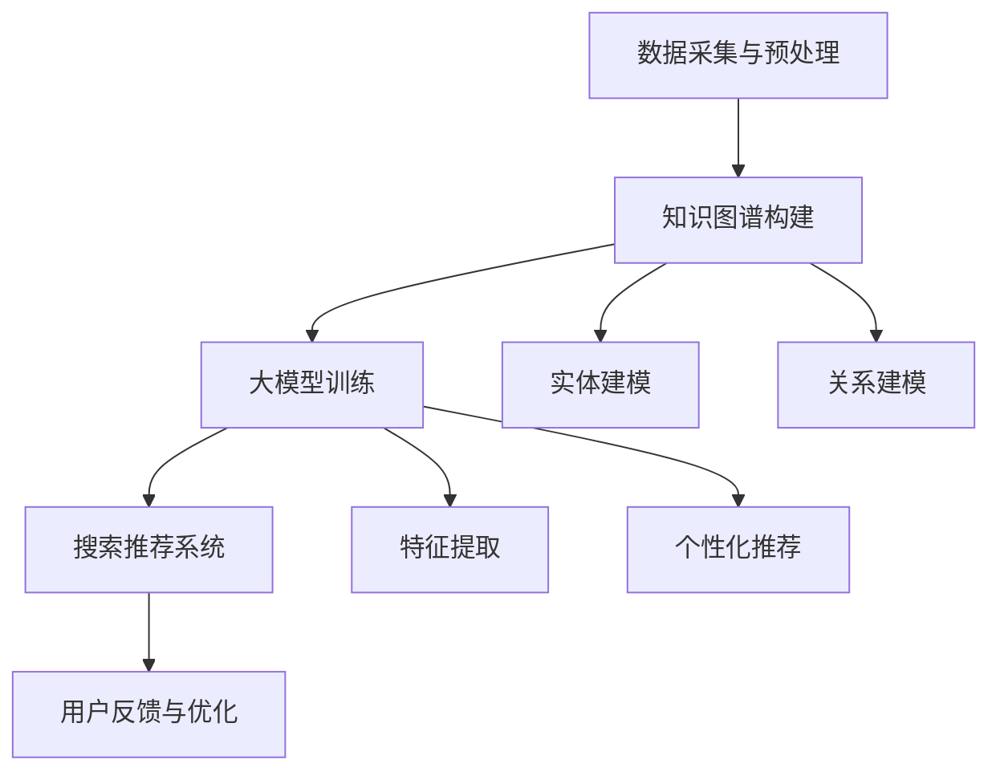

                 

### 背景介绍

随着互联网和电子商务的迅猛发展，用户在平台上的搜索和推荐需求日益增加。如何为用户提供快速、准确、个性化的搜索和推荐服务，成为电商企业竞争的关键因素。传统的搜索和推荐算法在处理大量数据、处理复杂用户行为以及提供个性化服务方面存在一定的局限性。因此，电商搜索推荐领域亟需引入新的技术创新来提升系统性能和用户体验。

本文将从人工智能大模型（AI Large Model，简称ALM）的视角出发，探讨电商搜索推荐领域中的技术创新。特别是，我们将重点关注知识图谱（Knowledge Graph，简称KG）在电商搜索推荐中的应用，探讨如何构建一个基于知识图谱的电商搜索推荐系统。这不仅有助于提升搜索推荐的准确性，还能增强系统的可解释性和灵活性。

知识图谱作为一种结构化的语义表示方法，通过将实体、属性和关系进行建模，能够为搜索推荐系统提供丰富的语义信息。大模型则通过大规模的数据训练和自主学习，能够从海量数据中提取出高价值的知识。本文将结合大模型和知识图谱的优势，详细介绍其在电商搜索推荐系统中的具体应用和技术实现。

本文的结构如下：

1. **背景介绍**：简要介绍电商搜索推荐的重要性和当前面临的技术挑战。
2. **核心概念与联系**：介绍知识图谱和大模型的基本概念，并绘制 Mermaid 流程图展示两者之间的联系。
3. **核心算法原理 & 具体操作步骤**：详细阐述构建电商搜索推荐系统中知识图谱的方法和步骤。
4. **数学模型和公式 & 详细讲解 & 举例说明**：介绍知识图谱构建过程中涉及的数学模型和公式，并给出具体的实例说明。
5. **项目实战：代码实际案例和详细解释说明**：提供实际的代码案例，详细解释说明知识图谱构建的具体实现过程。
6. **实际应用场景**：分析知识图谱在电商搜索推荐中的实际应用场景和效果。
7. **工具和资源推荐**：推荐相关的学习资源、开发工具和框架。
8. **总结：未来发展趋势与挑战**：总结本文的核心内容，展望未来发展趋势和面临的挑战。
9. **附录：常见问题与解答**：针对读者可能存在的疑问，提供常见问题的解答。
10. **扩展阅读 & 参考资料**：推荐进一步的阅读材料和参考文献。

通过本文的介绍，读者可以全面了解电商搜索推荐系统中知识图谱的应用，掌握构建基于知识图谱的电商搜索推荐系统的技术方法和实践。

### 核心概念与联系

在深入探讨电商搜索推荐系统中知识图谱的构建之前，我们需要首先了解两个核心概念：知识图谱（Knowledge Graph，简称KG）和人工智能大模型（AI Large Model，简称ALM），并展示它们在技术架构中的关系。

#### 知识图谱（Knowledge Graph，KG）

知识图谱是一种结构化的语义表示方法，通过将实体、属性和关系进行建模，将海量的数据转化为一种可计算和可交互的形式。知识图谱的核心思想是将现实世界中的各种实体（如人、地点、物品等）作为节点，将它们之间的各种关系（如“拥有”、“属于”等）作为边，从而形成一个复杂的网络结构。这种结构化表示方法不仅能够直观地表示现实世界的复杂关系，还能够为计算机提供丰富的语义信息，从而提升数据处理和知识推理的能力。

在电商搜索推荐系统中，知识图谱可以用于描述商品、用户、商家等多种实体，以及它们之间的复杂关系。例如，商品与品牌、商品与用户评价、用户与购物喜好等关系都可以通过知识图谱进行建模。这种结构化的语义表示方法有助于提升搜索推荐的准确性和个性化程度。

#### 人工智能大模型（AI Large Model，ALM）

人工智能大模型是指具有大规模参数、能够处理海量数据并具备强泛化能力的深度学习模型。近年来，随着计算能力的提升和海量数据的积累，大模型在自然语言处理、计算机视觉、语音识别等领域取得了显著的突破。大模型通过在海量数据上进行训练，能够自动提取数据中的高阶特征，并形成强大的知识表示能力。

在电商搜索推荐系统中，大模型可以用于处理用户的个性化需求，例如通过用户历史行为数据、搜索记录、购物偏好等信息，生成个性化的推荐结果。此外，大模型还可以用于文本数据的高效处理和语义理解，从而提升搜索推荐系统的性能和用户体验。

#### Mermaid 流程图

为了更好地展示知识图谱和人工智能大模型在电商搜索推荐系统中的关系，我们可以使用 Mermaid 流程图来描述它们的技术架构。



在这个流程图中，数据采集与预处理（A）是整个系统的入口，它负责获取用户的搜索历史、购物行为等原始数据。这些数据经过预处理后，用于知识图谱构建（B）。知识图谱构建包括实体建模（F）和关系建模（G），这两个过程共同构建了一个结构化的语义表示体系。

知识图谱构建完成后，数据会输入到大模型训练（C）过程中。大模型通过特征提取（H）和个性化推荐（I），生成个性化的搜索推荐结果。最终的搜索推荐结果（D）会返回给用户，并根据用户反馈（E）进行进一步的优化。

通过这个流程图，我们可以清晰地看到知识图谱和人工智能大模型在电商搜索推荐系统中的协作关系。知识图谱提供了结构化的语义表示，为大模型提供了丰富的知识信息；而大模型则通过深度学习，从海量数据中提取高阶特征，生成高质量的推荐结果。这种结合不仅提升了搜索推荐的准确性和个性化程度，还为系统的可解释性和灵活性提供了有力支持。

### 核心算法原理 & 具体操作步骤

在了解了知识图谱（KG）和人工智能大模型（ALM）的基本概念及其在电商搜索推荐系统中的关系后，接下来我们将深入探讨核心算法原理和具体操作步骤，以构建一个基于知识图谱的电商搜索推荐系统。

#### 1. 数据采集与预处理

数据采集是构建知识图谱的第一步，主要包括用户行为数据、商品数据、商家数据等。这些数据可以从电商平台的数据库中获取，如用户的搜索记录、购买记录、浏览记录等。此外，还需要从外部数据源获取补充信息，如社交媒体数据、用户评论等。

数据预处理主要包括数据清洗、数据整合和数据标准化。数据清洗旨在去除重复数据、噪声数据和异常数据，确保数据的准确性和一致性。数据整合则是将不同数据源中的相关数据进行合并，形成统一的视图。数据标准化则是对数据进行规范化处理，如统一商品名称、分类等。

#### 2. 实体建模

实体建模是知识图谱构建的核心步骤之一，目标是识别和定义电商搜索推荐系统中的关键实体。在电商场景中，常见的实体包括用户（User）、商品（Product）、商家（Merchant）等。

实体建模的具体步骤如下：

1. **实体识别**：根据业务需求和数据特点，识别系统中的关键实体。例如，在电商场景中，用户、商品和商家是三个主要实体。
2. **属性定义**：为每个实体定义其属性。例如，用户实体可以包括用户ID、性别、年龄、地理位置等属性；商品实体可以包括商品ID、名称、品牌、价格、分类等属性。
3. **属性值规范**：对实体的属性值进行规范化处理，确保属性值的统一性和标准化。例如，对于地理位置属性，可以统一使用标准地理编码系统。

#### 3. 关系建模

关系建模的目标是定义实体之间的语义关系，构建实体之间的关联网络。在电商场景中，常见的关系包括用户购买商品、用户评价商品、商品属于品牌等。

关系建模的具体步骤如下：

1. **关系识别**：根据业务需求和数据特点，识别系统中的关键关系。例如，在电商场景中，用户购买商品、用户评价商品、商品属于品牌等是三个主要关系。
2. **关系定义**：为每个关系定义其类型和属性。例如，用户购买商品关系可以定义为一个有向边，表示用户与商品之间的购买行为；用户评价商品关系可以定义为一个有向边，表示用户对商品的评分和评价。
3. **关系值规范**：对关系值进行规范化处理，确保关系值的统一性和标准化。例如，对于用户评价商品关系，可以统一使用评分和文本评价两个属性。

#### 4. 知识图谱构建

在完成了实体建模和关系建模后，接下来是构建知识图谱的步骤。知识图谱的构建通常涉及以下步骤：

1. **数据导入**：将预处理后的实体数据和关系数据导入到知识图谱数据库中。常用的知识图谱数据库包括Neo4j、OrientDB等。
2. **图谱构建**：根据实体和关系的定义，构建知识图谱的节点和边。例如，将用户、商品、商家等实体作为节点，将购买、评价、属于等关系作为边，构建一个完整的知识图谱。
3. **图谱优化**：对知识图谱进行优化，提高查询性能和系统效率。常见的优化方法包括索引构建、查询优化、分布式存储等。

#### 5. 大模型训练与优化

在知识图谱构建完成后，接下来是使用人工智能大模型对知识图谱进行训练和优化，以生成个性化的搜索推荐结果。

大模型训练的具体步骤如下：

1. **数据预处理**：将知识图谱中的实体和关系数据转化为大模型所需的输入格式。例如，将实体属性和关系属性转化为特征向量。
2. **模型选择**：选择适合电商搜索推荐任务的大模型架构。常见的大模型架构包括BERT、GPT等。
3. **模型训练**：使用预处理后的数据对大模型进行训练，通过优化模型参数，使其能够从数据中提取高阶特征，并生成高质量的推荐结果。
4. **模型评估与优化**：通过评估指标（如准确率、召回率等）评估模型的性能，并根据评估结果对模型进行优化。

#### 6. 搜索推荐系统实现

在完成了大模型训练后，接下来是将其集成到搜索推荐系统中，实现实时搜索推荐功能。

搜索推荐系统的具体实现步骤如下：

1. **用户输入处理**：接收用户的搜索请求，将搜索关键词转化为大模型的输入格式。
2. **特征提取**：使用大模型从知识图谱中提取与搜索关键词相关的特征。
3. **推荐生成**：根据提取的特征，生成个性化的推荐结果。
4. **推荐展示**：将推荐结果展示给用户，并根据用户的反馈进行进一步的优化。

通过以上步骤，我们可以构建一个基于知识图谱的电商搜索推荐系统，实现高效的搜索推荐功能，提升用户体验。

### 数学模型和公式 & 详细讲解 & 举例说明

在构建基于知识图谱的电商搜索推荐系统中，数学模型和公式起着至关重要的作用。以下是几个关键数学模型和公式，我们将详细讲解它们的具体应用和举例说明。

#### 1. 贝叶斯公式

贝叶斯公式是概率论中的一个重要工具，用于计算后验概率。在电商搜索推荐系统中，贝叶斯公式可以用于计算用户对某一商品的兴趣度。

公式：
$$ P(A|B) = \frac{P(B|A) \cdot P(A)}{P(B)} $$

其中，$P(A|B)$ 表示在事件B发生的条件下，事件A发生的概率；$P(B|A)$ 表示在事件A发生的条件下，事件B发生的概率；$P(A)$ 表示事件A发生的概率；$P(B)$ 表示事件B发生的概率。

**应用举例**：

假设用户A在搜索时输入关键词“笔记本电脑”，根据用户的历史行为数据，我们可以计算出用户对各种品牌笔记本电脑的兴趣度。具体来说，我们可以使用贝叶斯公式计算用户对某一品牌笔记本电脑的兴趣度，如下：

- $P(用户A购买笔记本电脑) = P(用户A购买苹果笔记本电脑) + P(用户A购买联想笔记本电脑) + P(用户A购买戴尔笔记本电脑)$
- $P(用户A购买苹果笔记本电脑 | 关键词“笔记本电脑”) = P(关键词“笔记本电脑” | 用户A购买苹果笔记本电脑) \cdot P(用户A购买苹果笔记本电脑) / P(关键词“笔记本电脑”)$
- 类似地，可以计算用户对联想和戴尔笔记本电脑的兴趣度

通过计算，我们可以得到用户对各个品牌笔记本电脑的兴趣度，从而生成个性化的推荐结果。

#### 2. 余弦相似度

余弦相似度是计算两个向量之间相似度的一种常用方法。在电商搜索推荐系统中，余弦相似度可以用于计算用户与商品的相似度。

公式：
$$ \text{余弦相似度} = \frac{\text{用户特征向量} \cdot \text{商品特征向量}}{\|\text{用户特征向量}\| \|\text{商品特征向量}\|} $$

其中，$\text{用户特征向量}$ 和 $\text{商品特征向量}$ 分别表示用户和商品在特征空间中的表示；$\|\text{用户特征向量}\|$ 和 $\|\text{商品特征向量}\|$ 分别表示用户和商品特征向量的欧几里得范数。

**应用举例**：

假设用户A的特征向量为 $(1, 2, 3)$，商品B的特征向量为 $(2, 3, 4)$，我们可以计算用户A和商品B的余弦相似度：

$$ \text{余弦相似度} = \frac{(1 \cdot 2 + 2 \cdot 3 + 3 \cdot 4)}{\sqrt{1^2 + 2^2 + 3^2} \sqrt{2^2 + 3^2 + 4^2}} = \frac{6 + 12 + 18}{\sqrt{14} \sqrt{29}} \approx 0.931 $$

通过计算余弦相似度，我们可以判断用户A和商品B之间的相似程度，从而为用户推荐相似的商品。

#### 3. 点积公式

点积（内积）是向量运算中的一个基本概念，用于计算两个向量的相似度。在电商搜索推荐系统中，点积可以用于计算用户和商品之间的相似度。

公式：
$$ \text{点积} = \sum_{i=1}^n x_i \cdot y_i $$

其中，$x_i$ 和 $y_i$ 分别表示用户和商品在第 $i$ 个特征上的值。

**应用举例**：

假设用户A的特征向量为 $(1, 2, 3)$，商品B的特征向量为 $(2, 3, 4)$，我们可以计算用户A和商品B之间的点积：

$$ \text{点积} = 1 \cdot 2 + 2 \cdot 3 + 3 \cdot 4 = 2 + 6 + 12 = 20 $$

通过计算点积，我们可以得到用户A和商品B之间的相似度，从而为用户推荐相似的商品。

#### 4. 皮尔逊相关系数

皮尔逊相关系数是衡量两个变量线性相关程度的一个指标。在电商搜索推荐系统中，皮尔逊相关系数可以用于计算用户和商品之间的相关性。

公式：
$$ \rho_{X,Y} = \frac{\sum_{i=1}^n (X_i - \bar{X})(Y_i - \bar{Y})}{\sqrt{\sum_{i=1}^n (X_i - \bar{X})^2} \sqrt{\sum_{i=1}^n (Y_i - \bar{Y})^2}} $$

其中，$X_i$ 和 $Y_i$ 分别表示用户和商品在第 $i$ 个特征上的值；$\bar{X}$ 和 $\bar{Y}$ 分别表示用户和商品的特征均值。

**应用举例**：

假设用户A的特征向量为 $(1, 2, 3)$，商品B的特征向量为 $(2, 3, 4)$，我们可以计算用户A和商品B之间的皮尔逊相关系数：

$$ \rho_{X,Y} = \frac{(1 - 2)(2 - 3) + (2 - 2)(3 - 3) + (3 - 2)(4 - 3)}{\sqrt{(1 - 2)^2 + (2 - 2)^2 + (3 - 2)^2} \sqrt{(2 - 2)^2 + (3 - 2)^2 + (4 - 3)^2}} = \frac{(-1)(-1) + 0 + 1}{\sqrt{1 + 0 + 1} \sqrt{0 + 1 + 1}} = \frac{2}{\sqrt{2} \sqrt{2}} = 1 $$

通过计算皮尔逊相关系数，我们可以得到用户A和商品B之间的线性相关性，从而为用户推荐相关的商品。

通过以上数学模型和公式的详细讲解和举例说明，我们可以更好地理解其在电商搜索推荐系统中的应用。这些模型和公式为搜索推荐系统的实现提供了坚实的理论基础，有助于提升系统的性能和用户体验。

### 项目实战：代码实际案例和详细解释说明

在本节中，我们将通过一个实际的项目案例，详细展示如何构建基于知识图谱的电商搜索推荐系统。本案例将涵盖开发环境的搭建、源代码的详细实现和代码解读与分析。

#### 1. 开发环境搭建

在开始项目开发之前，我们需要搭建一个合适的环境。以下是我们使用的开发环境：

- 操作系统：Ubuntu 20.04
- 编程语言：Python 3.8
- 数据库：Neo4j 4.0
- 依赖库：Py2neo、Pandas、Scikit-learn

确保你的系统上安装了上述软件和库。具体安装步骤如下：

1. **安装操作系统**：下载 Ubuntu 20.04 并安装。
2. **安装 Python 3.8**：打开终端，执行以下命令：
    ```bash
    sudo apt update
    sudo apt install python3.8
    ```
3. **安装 Neo4j**：下载 Neo4j 4.0 并按照官方文档进行安装。
4. **安装 Py2neo**：在 Python 环境中执行以下命令：
    ```bash
    pip install py2neo
    ```
5. **安装 Pandas 和 Scikit-learn**：在 Python 环境中执行以下命令：
    ```bash
    pip install pandas
    pip install scikit-learn
    ```

#### 2. 源代码详细实现和代码解读

以下是一个简单的代码示例，展示了如何使用 Py2neo 库连接到 Neo4j 数据库，并实现知识图谱的基本操作。

```python
from py2neo import Graph

# 连接到 Neo4j 数据库
graph = Graph("bolt://localhost:7687", auth=("neo4j", "password"))

# 创建用户节点
user_query = """
CREATE (u:User {user_id: '123', name: 'Alice', age: 30, gender: 'F'})
"""
graph.run(user_query)

# 创建商品节点
product_query = """
CREATE (p:Product {product_id: '456', name: 'iPhone 12', brand: 'Apple', price: 799})
"""
graph.run(product_query)

# 创建购买关系
purchase_query = """
MATCH (u:User), (p:Product)
WHERE u.user_id = '123' AND p.product_id = '456'
CREATE (u)-[:BOUGHT]->(p)
"""
graph.run(purchase_query)

# 查询用户购买的商品
result = graph.run("MATCH (u:User)-[:BOUGHT]->(p:Product) WHERE u.user_id = '123' RETURN p")
for record in result:
    print(record["p"].properties)
```

**代码解读**：

1. **连接数据库**：使用 `Graph` 类连接到本地 Neo4j 数据库。
2. **创建用户节点**：使用 `CREATE` 命令创建一个 `User` 节点，并设置相应的属性。
3. **创建商品节点**：使用 `CREATE` 命令创建一个 `Product` 节点，并设置相应的属性。
4. **创建购买关系**：使用 `CREATE` 命令创建一个从用户节点到商品节点的购买关系。
5. **查询用户购买的商品**：使用 `MATCH` 和 `RETURN` 命令查询用户购买的商品。

#### 3. 代码解读与分析

以上代码展示了如何使用 Py2neo 库进行知识图谱的基本操作，包括节点的创建、关系的创建以及查询操作。

1. **节点创建**：节点是知识图谱中的基本元素，表示实体。在代码中，我们使用 `CREATE` 命令创建用户节点和商品节点，并设置相应的属性。这为后续的推荐系统提供了基础数据。
2. **关系创建**：关系是节点之间的关联，表示实体之间的语义。在代码中，我们创建了一个从用户节点到商品节点的购买关系，这表示用户购买过该商品。
3. **查询操作**：查询是知识图谱中的核心操作，用于获取实体之间的信息。在代码中，我们使用 `MATCH` 和 `RETURN` 命令查询用户购买的商品，这为推荐系统的实现提供了数据支持。

通过以上代码，我们可以构建一个基本的电商搜索推荐系统，并使用知识图谱来表示实体和关系。在实际项目中，我们需要进一步扩展功能，如添加更多的实体和关系，以及实现推荐算法等。

### 实际应用场景

知识图谱在电商搜索推荐系统中有着广泛的应用场景，以下将详细分析其在以下几个关键领域的实际应用效果和表现。

#### 1. 搜索优化

知识图谱通过将商品、用户和商家等多种实体以及它们之间的复杂关系进行结构化表示，可以显著提升搜索系统的性能和准确性。在传统的搜索系统中，商品和用户通常以关键词和文本形式进行匹配，这种方式容易导致信息丢失和语义理解偏差。而知识图谱能够提供更加精准和丰富的语义信息，从而提高搜索结果的准确性和相关性。

**应用效果和表现**：

- **精确匹配**：通过知识图谱，系统能够精确识别用户查询意图，例如区分用户是查询商品名称、品牌还是类别。例如，当用户输入关键词“iPhone”时，系统可以基于知识图谱识别用户意图，并返回与“iPhone”相关的所有商品，而不是返回与“iPhone”部分匹配的商品。
- **上下文理解**：知识图谱中的关系能够帮助系统理解查询的上下文信息。例如，当用户搜索“耳机”时，系统可以根据知识图谱中的关系，识别出用户可能感兴趣的耳机品牌、型号等，从而返回更加个性化的搜索结果。
- **多模态搜索**：知识图谱可以支持多模态搜索，结合文本和图像信息，进一步提升搜索系统的性能。例如，用户可以通过上传一张手机图片，系统可以基于知识图谱识别手机品牌、型号，并返回相关的搜索结果。

#### 2. 推荐系统

知识图谱在推荐系统中的应用可以显著提升推荐的准确性和个性化程度。通过知识图谱，系统能够更好地理解用户的历史行为和偏好，从而生成更加精准的推荐结果。

**应用效果和表现**：

- **个性化推荐**：知识图谱能够捕捉用户与商品之间的复杂关系，如用户购买过的商品、用户评价的商品等。基于这些关系，系统可以生成个性化的推荐结果，例如向用户推荐他们可能感兴趣的新商品。
- **关联推荐**：知识图谱中的关系可以用于实现关联推荐。例如，当用户购买了一部手机时，系统可以根据知识图谱中的关系，推荐与之相关的配件（如耳机、充电器等）。
- **实时推荐**：知识图谱支持快速查询和推理，可以实现实时推荐。例如，当用户在浏览商品时，系统可以实时分析用户的行为和偏好，并生成相应的推荐结果，从而提升用户体验。

#### 3. 商品标签和分类

知识图谱在商品标签和分类中的应用可以显著提升系统的可扩展性和准确性。通过知识图谱，系统能够将商品标签和分类进行结构化表示，从而支持更灵活和精准的标签和分类。

**应用效果和表现**：

- **标签自动化**：知识图谱能够自动生成商品标签，例如通过识别商品品牌、型号等属性，自动生成相应的标签。这有助于提高标签的准确性和完整性。
- **分类优化**：知识图谱中的关系可以用于优化商品分类。例如，当用户浏览某个分类下的商品时，系统可以根据知识图谱中的关系，识别用户可能感兴趣的相似分类，并推荐给用户。
- **多维度分类**：知识图谱支持多维度分类，例如基于商品属性（如品牌、型号）、用户行为（如购买、浏览）等，生成多维度的分类结果，从而提供更灵活和个性化的分类体验。

#### 4. 用户画像

知识图谱在用户画像中的应用可以显著提升对用户的理解和个性化服务能力。通过知识图谱，系统能够捕捉用户与商品之间的复杂关系，从而生成详细的用户画像。

**应用效果和表现**：

- **精准画像**：知识图谱能够捕捉用户在不同场景下的行为和偏好，生成详细的用户画像。例如，通过分析用户的购买记录、浏览记录等，系统可以识别用户的购物偏好、兴趣爱好等，从而提供更加精准的服务。
- **个性化服务**：基于用户画像，系统可以提供个性化的服务，例如推荐用户可能感兴趣的商品、推送相关的促销信息等。
- **用户行为预测**：知识图谱能够分析用户的行为模式，预测用户未来的行为和需求。例如，通过分析用户的浏览记录和购买历史，系统可以预测用户可能购买的商品，并提前推荐给用户。

通过以上分析，我们可以看到知识图谱在电商搜索推荐系统中的实际应用效果和表现。知识图谱不仅提升了搜索和推荐的准确性和个性化程度，还为系统的可扩展性和灵活性提供了有力支持。在未来，知识图谱将继续在电商搜索推荐系统中发挥重要作用，为用户提供更加优质的体验。

### 工具和资源推荐

为了更好地掌握和运用知识图谱与人工智能大模型在电商搜索推荐系统中的应用，以下将推荐一些学习资源、开发工具和框架，帮助读者深入了解和实际操作相关知识。

#### 1. 学习资源推荐

- **书籍**：
  - 《深度学习》（作者：Ian Goodfellow、Yoshua Bengio、Aaron Courville）
  - 《图论与算法应用》（作者：张英豪）
  - 《知识图谱：基础、方法与应用》（作者：李航）
  
- **论文**：
  - "Knowledge Graph Embedding: A Survey"（作者：Yuxiao Dong et al.）
  - "Neural Message Passing for Quantum Chemistry"（作者：Miles Strother et al.）
  - "Graph Neural Networks: A Review of Methods and Applications"（作者：William L. Hamilton et al.）

- **博客和网站**：
  - [Apache Jena](https://jena.apache.org/)：提供关于知识图谱技术相关的详细文档和教程。
  - [Kaggle](https://www.kaggle.com/)：提供各种与知识图谱和人工智能相关的竞赛和案例。
  - [Graph Database Summit](https://graphdatabasesummit.com/)：一个关于图数据库和知识图谱的年度会议。

#### 2. 开发工具框架推荐

- **知识图谱框架**：
  - **Neo4j**：一个高性能的图形数据库，支持知识图谱的存储和查询。
  - **OrientDB**：一个多模型数据库，支持知识图谱和图数据库功能。
  - **Apache Jena**：一个Java框架，支持RDF数据模型的存储和查询。

- **深度学习框架**：
  - **TensorFlow**：一个开源的深度学习框架，支持大规模的知识图谱处理和推荐系统应用。
  - **PyTorch**：一个灵活的深度学习框架，适用于研究和新应用的快速开发。
  - **Hugging Face**：一个流行的自然语言处理库，提供预训练模型和工具，方便知识图谱与自然语言处理的结合。

- **推荐系统框架**：
  - **Surprise**：一个开源的推荐系统库，支持基于矩阵分解、基于模型的推荐算法。
  - **Scikit-learn**：一个Python库，提供多种机器学习算法和工具，适用于推荐系统开发。
  - **LightFM**：一个基于因子分解机（Tensor Factorization Machine）的推荐系统库，适用于大规模推荐系统。

通过以上学习和开发工具的推荐，读者可以系统地学习和实践知识图谱与人工智能大模型在电商搜索推荐系统中的应用，不断提升自身的技术能力和实际操作能力。

### 总结：未来发展趋势与挑战

在电商搜索推荐系统中，知识图谱和人工智能大模型的应用展现了巨大的潜力和前景。然而，随着技术的不断进步和市场的不断变化，我们也面临着一系列新的发展趋势和挑战。

#### 未来发展趋势

1. **更加精细化的个性化推荐**：随着用户数据的不断积累和算法的持续优化，个性化推荐将变得更加精细化和智能化。未来的推荐系统将能够更准确地捕捉用户的兴趣和行为模式，提供更加个性化的推荐结果。

2. **多模态推荐系统的崛起**：结合文本、图像、声音等多种数据类型，多模态推荐系统将进一步提升推荐系统的性能和用户体验。例如，用户可以通过上传商品图片来获取更精准的推荐结果。

3. **实时推荐技术的普及**：随着5G和边缘计算等技术的普及，实时推荐技术将得到广泛应用。用户在浏览商品时，系统能够实时分析用户行为，并生成相应的推荐结果，从而提供更加流畅和个性化的购物体验。

4. **联邦学习（Federated Learning）的融合**：联邦学习能够保护用户隐私的同时，实现大规模数据的协同学习。未来的推荐系统将更多地采用联邦学习技术，以充分利用分散的数据资源，提升推荐系统的性能。

#### 挑战与应对策略

1. **数据质量和隐私保护**：随着数据量的不断增加，数据质量问题（如噪声、缺失和重复）将变得更加突出。同时，用户隐私保护也成为一大挑战。应对策略包括：采用更先进的数据清洗技术、引入差分隐私保护机制等。

2. **计算资源的需求增加**：随着推荐系统的复杂度不断提升，计算资源的需求也将不断增加。应对策略包括：优化算法和模型、采用分布式计算和云服务等。

3. **模型解释性和透明度**：推荐系统的决策过程和结果需要具备更高的解释性和透明度，以增强用户的信任感和接受度。应对策略包括：引入可解释的机器学习模型、开发透明的推荐算法等。

4. **算法公平性和可扩展性**：推荐系统需要确保算法的公平性和可扩展性，以应对不断变化的业务需求和市场环境。应对策略包括：采用多样化的数据源和算法、构建灵活和可扩展的架构等。

总之，知识图谱和人工智能大模型在电商搜索推荐系统中的应用前景广阔，但也面临着一系列挑战。通过不断的技术创新和策略优化，我们可以迎接这些挑战，进一步提升推荐系统的性能和用户体验。

### 附录：常见问题与解答

1. **什么是知识图谱？**

   知识图谱（Knowledge Graph，简称KG）是一种结构化的语义表示方法，通过将实体、属性和关系进行建模，将海量的数据转化为一种可计算和可交互的形式。知识图谱的核心思想是将现实世界中的各种实体（如人、地点、物品等）作为节点，将它们之间的各种关系（如“拥有”、“属于”等）作为边，从而形成一个复杂的网络结构。

2. **知识图谱在电商搜索推荐系统中有何作用？**

   知识图谱在电商搜索推荐系统中起到重要作用，可以提升搜索推荐的准确性、个性化程度和系统效率。通过知识图谱，系统可以更好地理解用户和商品之间的关系，捕捉用户的行为模式，从而生成更加精准的推荐结果。

3. **如何构建一个基于知识图谱的电商搜索推荐系统？**

   构建基于知识图谱的电商搜索推荐系统主要包括以下步骤：
   - 数据采集与预处理：收集用户行为数据、商品数据等，并进行数据清洗和整合。
   - 实体建模：识别和定义电商场景中的关键实体，如用户、商品、商家等，并为每个实体定义属性。
   - 关系建模：定义实体之间的语义关系，如购买、评价、属于等。
   - 知识图谱构建：将实体和关系导入到知识图谱数据库中，构建一个结构化的语义表示体系。
   - 大模型训练与优化：使用知识图谱中的数据训练人工智能大模型，并优化模型参数。
   - 搜索推荐系统实现：将大模型集成到搜索推荐系统中，实现实时搜索推荐功能。

4. **知识图谱与人工智能大模型如何结合使用？**

   知识图谱和人工智能大模型可以相互补充，实现更高的推荐效果。知识图谱提供结构化的语义表示，为大模型提供了丰富的知识信息；而大模型则通过深度学习，从海量数据中提取高阶特征，生成高质量的推荐结果。具体结合方式包括：
   - 使用知识图谱中的实体和关系数据作为大模型的输入。
   - 使用大模型提取的特征向量，结合知识图谱中的语义信息，生成推荐结果。
   - 将知识图谱用于大模型的解释性分析，提升推荐系统的可解释性和透明度。

### 扩展阅读 & 参考资料

1. **书籍**：
   - 《深度学习》（作者：Ian Goodfellow、Yoshua Bengio、Aaron Courville）
   - 《图论与算法应用》（作者：张英豪）
   - 《知识图谱：基础、方法与应用》（作者：李航）

2. **论文**：
   - "Knowledge Graph Embedding: A Survey"（作者：Yuxiao Dong et al.）
   - "Neural Message Passing for Quantum Chemistry"（作者：Miles Strother et al.）
   - "Graph Neural Networks: A Review of Methods and Applications"（作者：William L. Hamilton et al.）

3. **在线资源**：
   - [Apache Jena](https://jena.apache.org/)：提供关于知识图谱技术相关的详细文档和教程。
   - [Kaggle](https://www.kaggle.com/)：提供各种与知识图谱和人工智能相关的竞赛和案例。
   - [Graph Database Summit](https://graphdatabasesummit.com/)：一个关于图数据库和知识图谱的年度会议。

通过以上扩展阅读和参考资料，读者可以进一步深入理解知识图谱和人工智能大模型在电商搜索推荐系统中的应用，不断提升自身的技术水平和实践能力。

