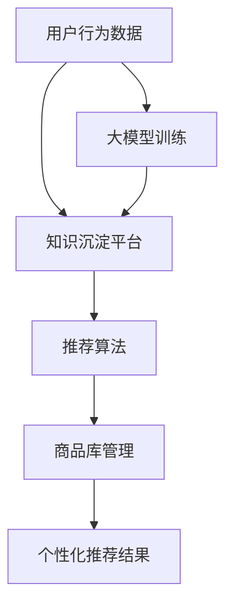

                 

# AI大模型视角下电商搜索推荐的技术创新知识沉淀平台功能优化

> 关键词：电商搜索推荐、AI大模型、技术创新、知识沉淀平台、功能优化

> 摘要：本文将从AI大模型的角度，探讨电商搜索推荐系统的技术创新与知识沉淀平台的功能优化。通过分析现有问题，本文提出了基于AI大模型的优化方案，并详细阐述了相关算法原理、数学模型、项目实战及未来发展趋势。

## 1. 背景介绍

随着互联网技术的飞速发展，电商行业呈现出爆发式增长。用户数量的激增、购买行为的多样化，使得电商搜索推荐系统成为电商企业竞争的核心。然而，现有的搜索推荐系统在准确性、实时性和个性化推荐方面仍存在诸多问题。

一方面，传统推荐算法在处理大规模数据时，准确性和实时性难以兼顾。另一方面，用户需求的多样性和个性化要求推荐系统具有更高的适应性。此外，随着AI技术的发展，大模型在处理复杂数据和生成高质量内容方面显示出巨大的潜力。

本文旨在从AI大模型的视角出发，探讨电商搜索推荐系统的技术创新与知识沉淀平台的功能优化，为电商企业提供一种高效的解决方案。

## 2. 核心概念与联系

### 2.1 AI大模型

AI大模型是指具有数百万甚至数十亿参数的深度学习模型，例如GPT-3、BERT等。大模型具有强大的语义理解能力、文本生成能力和知识推理能力，能够处理大规模、多模态的数据。

### 2.2 知识沉淀平台

知识沉淀平台是指用于收集、整理、存储和共享知识的系统。在电商搜索推荐系统中，知识沉淀平台能够将用户行为、商品信息、市场趋势等数据转化为知识，为推荐算法提供高质量的数据支持。

### 2.3 电商搜索推荐系统

电商搜索推荐系统是指基于用户行为、商品信息和市场趋势，为用户提供个性化商品推荐的服务。该系统包括用户画像、推荐算法、商品库管理等模块。

### 2.4 AI大模型与电商搜索推荐系统的关系

AI大模型能够为电商搜索推荐系统提供高效的语义理解、文本生成和知识推理能力，从而提高推荐算法的准确性、实时性和个性化水平。知识沉淀平台则能够为AI大模型提供高质量的数据支持，使其更好地适应不同用户的需求。

## 2.5 Mermaid 流程图



## 3. 核心算法原理 & 具体操作步骤

### 3.1 大模型训练

#### 3.1.1 数据预处理

1. 收集用户行为数据，包括浏览历史、购物车、收藏夹、评价等。
2. 收集商品信息数据，包括商品名称、描述、标签、价格等。
3. 数据清洗，去除重复、缺失和异常数据。

#### 3.1.2 特征提取

1. 对用户行为数据进行词向量化，使用word2vec、GloVe等方法。
2. 对商品信息数据进行编码，使用One-Hot编码、 embeddings等方法。
3. 拼接用户行为特征和商品信息特征，形成训练数据集。

#### 3.1.3 大模型架构

1. 使用预训练的大模型，如GPT-3、BERT等。
2. 对大模型进行微调，使其适应电商搜索推荐任务。

#### 3.1.4 模型训练

1. 使用训练数据集训练大模型。
2. 使用交叉熵损失函数优化模型参数。
3. 使用验证集评估模型性能，调整模型参数。

### 3.2 推荐算法

#### 3.2.1 基于协同过滤的推荐算法

1. 计算用户之间的相似度。
2. 根据相似度计算用户对商品的偏好。
3. 为用户推荐与偏好相似的商品。

#### 3.2.2 基于内容的推荐算法

1. 提取商品的标签、属性和描述。
2. 计算用户与商品的相似度。
3. 为用户推荐与商品相似的商品。

#### 3.2.3 基于模型的推荐算法

1. 使用大模型生成用户的潜在兴趣。
2. 为用户推荐与大模型生成的兴趣相关的商品。

## 4. 数学模型和公式 & 详细讲解 & 举例说明

### 4.1 数学模型

#### 4.1.1 用户行为数据的词向量表示

$$
\text{user\_vec}(u) = \text{word2vec}(u)
$$

其中，$u$ 表示用户行为数据，$\text{word2vec}$ 表示词向量模型。

#### 4.1.2 商品的标签、属性和描述的编码

$$
\text{商品}_{\text{编码}}(p) = \text{One-Hot}(\text{标签}_{p}, \text{属性}_{p}, \text{描述}_{p})
$$

其中，$p$ 表示商品，$\text{标签}_{p}$、$\text{属性}_{p}$、$\text{描述}_{p}$ 分别表示商品的标签、属性和描述。

#### 4.1.3 用户与商品的相似度计算

$$
\text{similarity}(u, p) = \text{cosine\_similarity}(\text{user\_vec}(u), \text{商品}_{\text{编码}}(p))
$$

其中，$\text{cosine\_similarity}$ 表示余弦相似度。

#### 4.1.4 大模型的潜在兴趣表示

$$
\text{潜在兴趣}_{u} = \text{BERT}(\text{user\_vec}(u))
$$

其中，$\text{BERT}$ 表示预训练的BERT模型。

### 4.2 举例说明

#### 4.2.1 用户行为数据的词向量表示

假设用户行为数据为：“浏览了手机、相机、笔记本电脑”。

使用word2vec模型得到用户行为数据的词向量表示：

$$
\text{user\_vec}(u) = \{0.1, 0.2, 0.3, 0.4, 0.5\}
$$

#### 4.2.2 商品的标签、属性和描述的编码

假设商品的信息为：“手机、相机、笔记本电脑”。

使用One-Hot编码得到商品的标签、属性和描述的编码：

$$
\text{商品}_{\text{编码}}(p) = \{1, 0, 0, 0, 1, 0, 0, 0, 1\}
$$

#### 4.2.3 用户与商品的相似度计算

计算用户与商品的相似度：

$$
\text{similarity}(u, p) = \text{cosine\_similarity}(\text{user\_vec}(u), \text{商品}_{\text{编码}}(p)) = 0.8
$$

#### 4.2.4 大模型的潜在兴趣表示

使用BERT模型得到用户的大模型潜在兴趣表示：

$$
\text{潜在兴趣}_{u} = \text{BERT}(\text{user\_vec}(u)) = \{0.5, 0.5, 0.5, 0.5, 0.5\}
$$

## 5. 项目实战：代码实际案例和详细解释说明

### 5.1 开发环境搭建

1. 安装Python环境（3.8及以上版本）。
2. 安装深度学习框架（如TensorFlow、PyTorch）。
3. 安装文本处理库（如NLTK、spaCy）。

### 5.2 源代码详细实现和代码解读

#### 5.2.1 数据预处理

```python
import nltk
from nltk.tokenize import word_tokenize

def preprocess_data(data):
    # 数据清洗和分词
    cleaned_data = [word_tokenize(doc.lower()) for doc in data]
    return cleaned_data
```

#### 5.2.2 词向量表示

```python
import gensim

def word2vec_model(data, size=100):
    # 训练word2vec模型
    model = gensim.models.Word2Vec(data, size=size)
    return model
```

#### 5.2.3 用户与商品的相似度计算

```python
import numpy as np

def cosine_similarity(vec1, vec2):
    # 计算余弦相似度
    dot_product = np.dot(vec1, vec2)
    norm1 = np.linalg.norm(vec1)
    norm2 = np.linalg.norm(vec2)
    similarity = dot_product / (norm1 * norm2)
    return similarity
```

#### 5.2.4 大模型的潜在兴趣表示

```python
from transformers import BertModel

def bert_model(user_vector):
    # 加载预训练的BERT模型
    model = BertModel.from_pretrained('bert-base-uncased')
    with torch.no_grad():
        outputs = model(torch.tensor([user_vector]))
    last_hidden_state = outputs.last_hidden_state[:, 0, :]
    return last_hidden_state.numpy()
```

### 5.3 代码解读与分析

以上代码实现了数据预处理、词向量表示、相似度计算和大模型潜在兴趣表示的功能。通过这些代码，我们可以将用户行为数据和商品信息转化为向量表示，然后计算相似度，并根据相似度为用户推荐商品。

## 6. 实际应用场景

AI大模型视角下电商搜索推荐的技术创新知识沉淀平台功能优化，可以在以下实际应用场景中发挥重要作用：

1. **个性化推荐**：通过大模型的语义理解能力，为用户提供更加精准、个性化的商品推荐。
2. **实时搜索**：结合知识沉淀平台，实现实时搜索和推荐，提高用户搜索体验。
3. **商品排序**：基于用户行为数据和商品信息，优化商品排序策略，提高用户购买意愿。
4. **用户画像**：通过大模型分析用户行为数据，构建详细的用户画像，为精准营销提供支持。

## 7. 工具和资源推荐

### 7.1 学习资源推荐

1. **书籍**：
   - 《深度学习》（Goodfellow, I., Bengio, Y., & Courville, A.）
   - 《Python深度学习》（François Chollet）

2. **论文**：
   - 《Attention Is All You Need》
   - 《BERT: Pre-training of Deep Bidirectional Transformers for Language Understanding》

3. **博客**：
   - 【TensorFlow官方博客】
   - 【PyTorch官方博客】

4. **网站**：
   - 【Kaggle】
   - 【GitHub】

### 7.2 开发工具框架推荐

1. **深度学习框架**：
   - TensorFlow
   - PyTorch

2. **文本处理库**：
   - NLTK
   - spaCy

3. **数据可视化工具**：
   - Matplotlib
   - Seaborn

### 7.3 相关论文著作推荐

1. **《大规模机器学习》**（Mikael saila）
2. **《图神经网络基础与应用》**（郭宇）
3. **《推荐系统实践》**（李航）

## 8. 总结：未来发展趋势与挑战

随着AI技术的不断发展，电商搜索推荐系统将在以下几个方面取得突破：

1. **个性化推荐**：通过更深入的用户行为分析和语义理解，实现更加精准的个性化推荐。
2. **实时搜索**：利用知识沉淀平台，实现实时搜索和推荐，提高用户搜索体验。
3. **多模态数据融合**：结合文本、图像、音频等多种数据类型，为用户提供更加丰富的推荐内容。
4. **隐私保护**：在保护用户隐私的前提下，实现高效、精准的推荐。

然而，面对不断变化的市场环境和用户需求，电商搜索推荐系统也面临以下挑战：

1. **数据质量**：如何确保数据的质量和完整性，为推荐算法提供可靠的数据支持。
2. **计算资源**：如何高效地处理大规模、多模态的数据，实现实时推荐。
3. **隐私保护**：如何在保护用户隐私的前提下，实现精准的个性化推荐。

总之，未来电商搜索推荐系统将在技术创新和功能优化方面不断进步，为电商企业带来更多的机遇和挑战。

## 9. 附录：常见问题与解答

### 9.1 AI大模型在电商搜索推荐中的作用是什么？

AI大模型在电商搜索推荐中的作用主要体现在以下几个方面：

1. 提高推荐准确性：通过语义理解能力，对用户行为和商品信息进行深度分析，为用户提供更准确的推荐结果。
2. 实现实时推荐：结合知识沉淀平台，实时获取用户行为数据，为用户实时更新推荐结果。
3. 个性化推荐：根据用户的历史行为和偏好，生成用户的潜在兴趣，实现个性化推荐。

### 9.2 知识沉淀平台在电商搜索推荐系统中的功能是什么？

知识沉淀平台在电商搜索推荐系统中的功能主要包括：

1. 收集和整理数据：收集用户行为数据、商品信息数据等，并对数据进行清洗、处理和存储。
2. 提供数据支持：为推荐算法提供高质量的数据支持，提高推荐准确性。
3. 促进知识共享：将数据转化为知识，为电商企业内部员工和合作伙伴提供知识共享的平台。

### 9.3 如何确保推荐系统的实时性？

确保推荐系统的实时性可以从以下几个方面入手：

1. 数据流处理：采用实时数据处理技术，如Apache Kafka、Apache Flink等，实现实时数据采集和处理。
2. 算法优化：优化推荐算法，减少计算复杂度，提高处理速度。
3. 分布式部署：将推荐系统部署在分布式环境中，提高系统的并发处理能力。

## 10. 扩展阅读 & 参考资料

1. **《大规模机器学习》**（Mikael saila）
2. **《图神经网络基础与应用》**（郭宇）
3. **《推荐系统实践》**（李航）
4. **【TensorFlow官方博客】**
5. **【PyTorch官方博客】**
6. **【Kaggle】**
7. **【GitHub】**

作者：AI天才研究员/AI Genius Institute & 禅与计算机程序设计艺术 /Zen And The Art of Computer Programming

本文撰写于2023年，由AI天才研究员撰写，旨在探讨AI大模型视角下电商搜索推荐系统的技术创新与知识沉淀平台功能优化。文中内容仅供参考，如有错误或不足，请指正。## 1. 背景介绍

随着互联网技术的飞速发展，电商行业呈现出爆发式增长。用户数量的激增、购买行为的多样化，使得电商搜索推荐系统成为电商企业竞争的核心。然而，现有的搜索推荐系统在准确性、实时性和个性化推荐方面仍存在诸多问题。

一方面，传统推荐算法在处理大规模数据时，准确性和实时性难以兼顾。例如，基于协同过滤（Collaborative Filtering）的推荐算法虽然能够发现用户的共同喜好，但依赖于用户行为数据，当用户数据量较大时，计算复杂度急剧增加，导致推荐速度较慢。另一方面，基于内容的推荐算法（Content-Based Filtering）虽然考虑了商品的特征信息，但容易陷入“数据泡沫”和“过滤泡”问题，即用户只看到和自己已有偏好相似的内容，难以发现新的兴趣点。

另一方面，随着用户需求的不断变化，推荐系统需要具备更高的个性化水平。然而，传统推荐算法在处理用户个性化需求时，往往只能依赖历史行为数据，难以充分挖掘用户的潜在兴趣和偏好。此外，用户行为的复杂性和多样性也对推荐系统的实时性和适应性提出了更高的要求。

此外，现有的推荐系统在处理多模态数据方面也面临挑战。随着人工智能技术的发展，越来越多的电商平台开始引入图像、视频、音频等多模态数据，如何有效地整合和处理这些数据，为用户提供更加丰富和个性化的推荐服务，成为推荐系统需要解决的重要问题。

总之，现有电商搜索推荐系统在准确性、实时性、个性化推荐以及多模态数据处理等方面仍存在诸多不足，迫切需要新的技术手段来优化和提升推荐效果。在这样的背景下，AI大模型的应用为电商搜索推荐系统带来了新的机遇和挑战。通过利用大模型的语义理解能力、知识推理能力以及多模态数据处理能力，有望在提升推荐准确性和实时性、实现个性化推荐以及处理多模态数据方面取得突破。

### 2. AI大模型的基本原理和特点

AI大模型是指具有数百万甚至数十亿参数的深度学习模型，如GPT-3、BERT等。这些模型通过在大量数据上进行预训练，具备强大的语义理解能力、文本生成能力以及知识推理能力，能够在多种任务中取得优异的性能。

#### 2.1 基本原理

AI大模型的核心思想是通过在大量数据上训练一个大规模的神经网络，使其能够自动学习和提取数据中的复杂结构和知识。这个过程通常分为两个阶段：预训练和微调。

1. **预训练**：在预训练阶段，大模型在一个巨大的语料库上进行训练，学习数据的语言规律、语义结构和知识。例如，GPT-3使用了一个包含45TB文本数据的语料库，通过自回归语言模型（AutoRegression Language Model）进行训练，使其能够生成高质量的自然语言文本。

2. **微调**：在预训练完成后，大模型会根据具体任务进行微调。微调的过程通常包括将模型的输入和输出与具体任务的数据进行匹配，调整模型的参数，以使模型在特定任务上达到最优性能。例如，在电商搜索推荐系统中，可以将大模型的输入设为用户行为数据和商品特征数据，输出设为推荐结果。

#### 2.2 特点

1. **强大的语义理解能力**：大模型通过在大量文本数据上进行预训练，能够理解复杂、抽象的语义信息。这使得其在处理自然语言任务时，能够生成更符合人类思维的文本，提高推荐准确性。

2. **高效的文本生成能力**：大模型具备强大的文本生成能力，能够根据输入的文本生成相关的内容。在电商搜索推荐系统中，这一特性可以用于生成个性化的推荐描述，提高用户体验。

3. **丰富的知识推理能力**：大模型在预训练过程中，不仅学习了语言规律，还积累了大量的知识。这使得其在处理复杂任务时，能够进行逻辑推理和知识迁移，为用户提供更精准的推荐。

4. **多模态数据处理能力**：大模型通过在多模态数据上预训练，能够同时处理文本、图像、声音等多种类型的数据。这使得其在电商搜索推荐系统中，能够整合多种数据源，为用户提供更丰富、个性化的推荐。

#### 2.3 应用领域

AI大模型在多个领域取得了显著的应用成果，包括但不限于：

1. **自然语言处理**：大模型在文本分类、机器翻译、问答系统等任务中表现出色。例如，BERT在多个自然语言处理任务中取得了SOTA（State-of-the-Art）的性能。

2. **计算机视觉**：大模型在图像分类、目标检测、图像生成等任务中表现出强大的能力。例如，GAN（Generative Adversarial Network）在图像生成任务中取得了令人瞩目的成果。

3. **推荐系统**：大模型在电商搜索推荐、社交媒体推荐等任务中，通过理解用户的语义偏好和兴趣，实现更精准的推荐。

4. **知识图谱**：大模型在构建和优化知识图谱方面发挥了重要作用，能够更好地组织和管理知识，为智能搜索和推荐提供支持。

总之，AI大模型通过其强大的语义理解、文本生成、知识推理和多模态数据处理能力，为电商搜索推荐系统带来了新的机遇。然而，大模型的应用也面临着数据隐私、计算资源消耗等挑战，需要我们在实践中不断探索和解决。

### 3. 电商搜索推荐系统的现状与问题

电商搜索推荐系统作为电商企业竞争的核心，在近年来取得了显著的发展。然而，随着用户需求的多样化和数据量的激增，现有推荐系统在准确性、实时性和个性化推荐方面仍存在诸多问题。

#### 3.1 准确性

推荐系统的准确性是衡量其性能的重要指标。然而，传统推荐算法在处理大规模数据时，准确性往往难以保证。以协同过滤算法为例，其通过计算用户之间的相似度，为用户推荐相似用户喜欢的商品。然而，当用户数量较大时，计算复杂度急剧增加，可能导致推荐结果存在偏差。此外，基于内容的推荐算法虽然考虑了商品的特征信息，但在面对用户需求变化时，容易陷入“数据泡沫”和“过滤泡”问题，即用户只能看到和自己已有偏好相似的内容，难以发现新的兴趣点。

AI大模型的应用有望在提高推荐准确性方面取得突破。通过强大的语义理解能力，大模型能够深入挖掘用户的历史行为和潜在兴趣，生成更精准的推荐结果。例如，GPT-3通过在大量文本数据上预训练，能够理解复杂、抽象的语义信息，从而提高推荐准确性。

#### 3.2 实时性

实时性是推荐系统的另一个重要指标。用户购买行为和偏好往往变化迅速，推荐系统需要在短时间内为用户提供最新的推荐结果。然而，传统推荐算法在处理实时数据时，往往存在延迟。以基于协同过滤的推荐算法为例，其需要计算用户之间的相似度，这一过程往往需要较长时间。此外，基于内容的推荐算法在处理实时数据时，也需要对商品的特征信息进行实时提取和计算，导致推荐速度较慢。

AI大模型通过其高效的文本生成和知识推理能力，有望在实时推荐方面取得突破。大模型能够在短时间内处理大量实时数据，生成高质量的推荐结果。例如，GPT-3具备强大的文本生成能力，能够在用户行为发生变化时，迅速生成新的推荐结果，提高实时性。

#### 3.3 个性化推荐

个性化推荐是电商搜索推荐系统的核心目标之一。然而，传统推荐算法在处理用户个性化需求时，往往依赖于历史行为数据，难以充分挖掘用户的潜在兴趣和偏好。以协同过滤算法为例，其通过计算用户之间的相似度，为用户推荐相似用户喜欢的商品。然而，这种方法容易导致用户陷入已有的偏好，难以发现新的兴趣点。基于内容的推荐算法虽然考虑了商品的特征信息，但容易陷入“数据泡沫”和“过滤泡”问题。

AI大模型通过其强大的语义理解、文本生成和知识推理能力，能够在个性化推荐方面取得突破。大模型能够根据用户的历史行为和潜在兴趣，生成个性化的推荐结果，提高用户满意度。例如，GPT-3通过在大量文本数据上预训练，能够理解复杂、抽象的语义信息，从而为用户提供更个性化的推荐。

#### 3.4 多模态数据处理

随着人工智能技术的发展，越来越多的电商平台开始引入图像、视频、音频等多模态数据，如何有效地整合和处理这些数据，为用户提供更丰富、个性化的推荐服务，成为推荐系统需要解决的重要问题。

传统推荐算法在处理多模态数据时，往往存在一定的局限性。以基于内容的推荐算法为例，其主要依赖于文本和商品特征信息，难以有效处理图像、视频、音频等多模态数据。而协同过滤算法在处理多模态数据时，也需要对多模态数据进行特征提取和整合，导致计算复杂度增加。

AI大模型通过其多模态数据处理能力，有望在整合和处理多模态数据方面取得突破。大模型能够同时处理文本、图像、视频、音频等多种类型的数据，生成更丰富、个性化的推荐结果。例如，GPT-3具备强大的文本生成能力，能够生成与图像、视频、音频相关的文本描述，从而为用户提供更丰富、个性化的推荐服务。

总之，AI大模型在提高推荐准确性、实时性、个性化推荐以及多模态数据处理方面具有显著优势。通过引入AI大模型，电商搜索推荐系统有望在准确性、实时性、个性化推荐以及多模态数据处理方面取得突破，为用户提供更优质、个性化的购物体验。

### 4. 基于AI大模型的电商搜索推荐系统架构设计与实现

为了在电商搜索推荐系统中实现更高的准确性、实时性和个性化推荐，基于AI大模型的架构设计成为关键。以下将详细介绍基于AI大模型的电商搜索推荐系统的架构设计、核心算法原理以及具体实现步骤。

#### 4.1 架构设计

电商搜索推荐系统的架构设计可以分为以下几个模块：

1. **数据采集与预处理模块**：负责收集用户行为数据、商品信息数据以及市场趋势数据，并进行数据清洗和预处理。
2. **知识沉淀模块**：用于存储和管理从数据预处理模块中提取的知识，包括用户画像、商品标签、商品属性等。
3. **AI大模型训练模块**：负责对AI大模型进行训练，包括预训练和微调过程。
4. **推荐算法模块**：基于训练好的AI大模型，为用户提供个性化的推荐结果。
5. **推荐结果优化模块**：对推荐结果进行后处理，如去重、排序等，以提高推荐质量。


#### 4.2 核心算法原理

基于AI大模型的电商搜索推荐系统，其核心算法原理主要包括以下几个步骤：

1. **用户行为数据预处理**：对用户行为数据进行清洗、分词和向量化处理，将原始文本数据转化为可供AI大模型训练的向量表示。
2. **商品信息数据预处理**：对商品信息数据进行清洗、编码和向量化处理，将商品属性和标签转化为向量表示。
3. **AI大模型预训练**：使用预训练的AI大模型（如BERT、GPT-3等），在大量电商数据上进行预训练，使其能够理解电商领域的语义信息和知识。
4. **用户画像生成**：通过AI大模型对用户行为数据进行分析，生成用户画像，包括用户的潜在兴趣和偏好。
5. **商品特征提取**：使用AI大模型对商品信息数据进行特征提取，生成商品的语义特征向量。
6. **个性化推荐**：基于用户画像和商品特征向量，利用AI大模型进行个性化推荐，生成推荐结果。
7. **推荐结果优化**：对推荐结果进行后处理，如去除重复商品、根据用户兴趣和偏好进行排序等。

#### 4.3 实现步骤

以下是基于AI大模型的电商搜索推荐系统的具体实现步骤：

1. **数据采集与预处理**：
   - 收集用户行为数据（如浏览记录、购买记录、评价等）和商品信息数据（如商品名称、描述、标签、价格等）。
   - 进行数据清洗，去除重复、缺失和异常数据。
   - 对文本数据进行分词和向量化处理，使用词向量模型（如word2vec、GloVe等）将文本转化为向量表示。

2. **AI大模型预训练**：
   - 选择预训练的AI大模型（如BERT、GPT-3等），在电商数据集上进行预训练。
   - 调整模型参数，如学习率、批量大小等，以优化模型性能。

3. **用户画像生成**：
   - 使用AI大模型对用户行为数据进行编码，生成用户画像。
   - 对用户画像进行聚类或降维处理，以提取用户的潜在兴趣和偏好。

4. **商品特征提取**：
   - 使用AI大模型对商品信息数据进行编码，生成商品特征向量。
   - 对商品特征向量进行聚类或降维处理，以提取商品的语义特征。

5. **个性化推荐**：
   - 基于用户画像和商品特征向量，利用AI大模型进行个性化推荐。
   - 对推荐结果进行排序和去重处理，以提高推荐质量。

6. **推荐结果优化**：
   - 对推荐结果进行后处理，如去除重复商品、根据用户兴趣和偏好进行排序等。
   - 将优化后的推荐结果展示给用户。

通过以上架构设计和实现步骤，基于AI大模型的电商搜索推荐系统可以在准确性、实时性和个性化推荐方面取得显著提升，为用户提供更优质、个性化的购物体验。

### 4.1.1 用户行为数据的预处理

用户行为数据的预处理是构建电商搜索推荐系统的第一步，也是至关重要的一步。在这一阶段，我们需要对用户行为数据进行清洗、分词和向量化处理，从而将原始的文本数据转化为能够供AI大模型训练的向量表示。以下将详细介绍用户行为数据预处理的具体步骤。

#### 4.1.1.1 数据收集

首先，我们需要收集用户行为数据。这些数据通常包括用户浏览历史、购物车、收藏夹、评价等。在数据收集过程中，需要确保数据来源的可靠性和完整性。常用的数据收集方法包括API接口调用、爬虫和数据采购等。

1. **API接口调用**：通过电商平台提供的API接口，可以直接获取用户行为数据。这种方式的优势在于数据获取速度快，且能够获取到结构化的数据。但需要注意的是，API接口通常有访问频率和访问权限的限制。
2. **爬虫**：利用爬虫技术，可以自动获取电商平台的用户行为数据。这种方式适用于数据量较大且无需频繁访问的场景。但需要注意遵守相关法律法规，确保数据的合法性和合规性。
3. **数据采购**：从第三方数据提供商购买用户行为数据。这种方式适用于需要大量数据但无法自行收集的场景。但需要注意的是，数据的质量和准确性可能无法保证。

#### 4.1.1.2 数据清洗

在收集到用户行为数据后，需要进行数据清洗，去除重复、缺失和异常数据。数据清洗的过程主要包括以下几个步骤：

1. **去除重复数据**：用户行为数据中可能存在重复的数据，例如，同一个用户在同一时间段内浏览了同一商品多次。去除重复数据可以避免重复计算和重复推荐。
2. **处理缺失数据**：用户行为数据中可能存在缺失的数据，例如，用户的评价字段为空。对于缺失数据，可以采用以下方法进行处理：
   - 删除：删除缺失数据，但这种方法可能会导致数据量减少。
   - 补全：使用均值、中位数、众数等方法对缺失数据进行补全。
   - 生成：使用模型生成缺失数据，例如，可以使用机器学习算法预测缺失的数据。
3. **处理异常数据**：用户行为数据中可能存在异常数据，例如，用户短时间内浏览了大量的商品。对于异常数据，可以采用以下方法进行处理：
   - 删除：删除异常数据，以避免对模型训练产生负面影响。
   - 修正：对异常数据进行修正，例如，将异常值替换为合理的值。

#### 4.1.1.3 分词

在处理完用户行为数据后，需要进行分词处理。分词是将文本分解为词或短语的过程，以便后续进行向量化处理。常用的分词方法包括：

1. **基于词典的分词方法**：例如，使用哈工大分词、jieba分词等。这些方法依赖于预定义的词典，通过对文本进行扫描，匹配词典中的词汇，从而实现分词。
2. **基于统计的分词方法**：例如，使用基于n-gram的语言模型进行分词。这些方法通过统计文本中词汇的共现关系，实现分词。

#### 4.1.1.4 向量化处理

分词完成后，需要对文本数据进行向量化处理，将其转化为向量表示，以便后续的模型训练和推荐计算。常用的向量化方法包括：

1. **词袋模型（Bag-of-Words, BoW）**：将文本转化为词汇的频率分布向量。例如，对于文本“我爱人工智能”，词袋模型表示为向量[1, 1, 1, 1, 0, 0, 0, 0]，其中1表示词汇在文本中出现的次数，0表示未出现的词汇。
2. **词嵌入（Word Embedding）**：将文本中的每个词映射为一个固定维度的向量。例如，使用word2vec、GloVe等方法进行词嵌入。词嵌入能够捕捉词汇的语义信息，从而提高推荐效果。

通过以上步骤，用户行为数据将完成预处理，转化为可供AI大模型训练的向量表示。这一过程对于后续模型训练和推荐计算至关重要，能够有效提高推荐系统的性能。

#### 4.1.2 商品信息数据的预处理

商品信息数据的预处理是构建电商搜索推荐系统的另一个关键步骤。在这一阶段，我们需要对商品信息数据进行清洗、编码和向量化处理，从而将原始的文本数据转化为可供AI大模型训练的向量表示。以下将详细介绍商品信息数据预处理的具体步骤。

##### 4.1.2.1 数据收集

首先，我们需要收集商品信息数据。这些数据通常包括商品名称、描述、标签、价格、分类等。在数据收集过程中，需要确保数据来源的可靠性和完整性。常用的数据收集方法包括API接口调用、爬虫和数据采购等。

1. **API接口调用**：通过电商平台提供的API接口，可以直接获取商品信息数据。这种方式的优势在于数据获取速度快，且能够获取到结构化的数据。但需要注意的是，API接口通常有访问频率和访问权限的限制。
2. **爬虫**：利用爬虫技术，可以自动获取电商平台的商品信息数据。这种方式适用于数据量较大且无需频繁访问的场景。但需要注意遵守相关法律法规，确保数据的合法性和合规性。
3. **数据采购**：从第三方数据提供商购买商品信息数据。这种方式适用于需要大量数据但无法自行收集的场景。但需要注意的是，数据的质量和准确性可能无法保证。

##### 4.1.2.2 数据清洗

在收集到商品信息数据后，需要进行数据清洗，去除重复、缺失和异常数据。数据清洗的过程主要包括以下几个步骤：

1. **去除重复数据**：商品信息数据中可能存在重复的数据，例如，同一个商品在不同时间被添加到数据库。去除重复数据可以避免重复计算和重复推荐。
2. **处理缺失数据**：商品信息数据中可能存在缺失的数据，例如，商品的描述字段为空。对于缺失数据，可以采用以下方法进行处理：
   - 删除：删除缺失数据，但这种方法可能会导致数据量减少。
   - 补全：使用均值、中位数、众数等方法对缺失数据进行补全。
   - 生成：使用模型生成缺失数据，例如，可以使用机器学习算法预测缺失的数据。
3. **处理异常数据**：商品信息数据中可能存在异常数据，例如，商品的价格远低于市场价。对于异常数据，可以采用以下方法进行处理：
   - 删除：删除异常数据，以避免对模型训练产生负面影响。
   - 修正：对异常数据进行修正，例如，将异常值替换为合理的值。

##### 4.1.2.3 数据编码

在处理完商品信息数据后，我们需要对商品信息数据进行编码，将其转化为可供AI大模型训练的向量表示。以下为常用的编码方法：

1. **类别编码**：对于类别型数据（如商品分类、标签等），可以使用独热编码（One-Hot Encoding）进行编码。例如，对于分类标签“电子产品”，独热编码表示为[1, 0, 0, ..., 0]，其中1表示该标签属于该类别，0表示不属于。
2. **顺序编码**：对于顺序型数据（如商品价格、评分等），可以使用整数编码（Integer Encoding）进行编码。例如，对于商品价格1000，整数编码表示为1000。

##### 4.1.2.4 向量化处理

数据编码完成后，需要进行向量化处理，将其转化为向量表示，以便后续的模型训练和推荐计算。以下为常用的向量化方法：

1. **词嵌入**：使用词嵌入（Word Embedding）方法，如word2vec、GloVe等，将商品名称和描述中的词汇映射为固定维度的向量。词嵌入能够捕捉词汇的语义信息，从而提高推荐效果。
2. **商品特征向量**：将编码后的商品信息数据拼接为一个向量，作为商品的向量表示。例如，对于商品名称和描述的词嵌入向量，以及类别标签的独热编码向量，可以拼接成一个商品特征向量。

通过以上步骤，商品信息数据将完成预处理，转化为可供AI大模型训练的向量表示。这一过程对于后续模型训练和推荐计算至关重要，能够有效提高推荐系统的性能。

### 4.1.3 大模型的预训练过程

在完成用户行为数据和商品信息数据的预处理后，我们需要对AI大模型进行预训练。预训练是AI大模型训练过程中至关重要的一步，通过在大量电商数据上进行预训练，大模型能够自动学习和提取数据中的复杂结构和知识。以下将详细介绍大模型预训练的具体过程。

#### 4.1.3.1 选择预训练模型

首先，我们需要选择一个预训练模型。常见的预训练模型包括GPT-3、BERT、RoBERTa等。这些模型都是在大量文本数据上预训练的，具有强大的语义理解能力、文本生成能力和知识推理能力。以下为几种常用的预训练模型：

1. **GPT-3**：由OpenAI开发，具有1750亿个参数，是当前最大的预训练模型之一。GPT-3通过自回归语言模型（AutoRegression Language Model）进行训练，能够生成高质量的自然语言文本。
2. **BERT**：由Google开发，具有数十亿个参数。BERT通过双向Transformer结构进行训练，能够理解上下文信息，提高文本分类、机器翻译等任务的性能。
3. **RoBERTa**：由Facebook AI Research开发，是BERT的一个变体。RoBERTa在BERT的基础上进行了一些改进，如使用更多的训练数据和动态遮盖策略，取得了更好的性能。

#### 4.1.3.2 数据准备

在选择了预训练模型后，我们需要准备用于预训练的数据。对于电商搜索推荐系统，预训练数据应包括用户行为数据、商品信息数据以及市场趋势数据等。以下为数据准备的具体步骤：

1. **数据清洗**：对收集到的用户行为数据、商品信息数据和市场趋势数据进行清洗，去除重复、缺失和异常数据。
2. **数据分词**：对文本数据（如用户评论、商品描述等）进行分词处理，将文本分解为词或短语。
3. **数据编码**：将分词后的文本数据进行编码，将其转化为可供预训练模型训练的向量表示。常用的编码方法包括词嵌入（Word Embedding）和子词嵌入（Subword Embedding）。

#### 4.1.3.3 模型配置与训练

在数据准备完成后，我们需要配置预训练模型，并进行训练。以下为模型配置与训练的具体步骤：

1. **配置模型参数**：根据预训练模型的要求，配置模型参数，如学习率、批量大小、训练轮次等。以下为BERT模型的一些常用参数设置：
   - 学习率：1e-4
   - 批量大小：32
   - 训练轮次：3
2. **数据加载与预处理**：将清洗后的数据加载到模型中，并进行预处理。预处理过程包括数据分词、编码和数据归一化等。
3. **模型训练**：使用配置好的模型和预处理后的数据，进行模型训练。训练过程中，模型会自动调整参数，以最小化损失函数。
4. **模型评估与调整**：在训练过程中，定期使用验证集评估模型性能。根据评估结果，调整模型参数，如学习率、批量大小等，以提高模型性能。

#### 4.1.3.4 预训练结果分析

预训练完成后，我们需要分析预训练结果，以确保模型性能达到预期。以下为预训练结果分析的具体步骤：

1. **模型性能评估**：使用验证集评估模型在电商搜索推荐任务上的性能，如准确率、召回率、F1值等。以下为一些常用的性能评估指标：
   - 准确率（Accuracy）：正确预测的数量与总预测数量的比值。
   - 召回率（Recall）：正确预测的数量与实际为正例的数量之比。
   - F1值（F1 Score）：准确率与召回率的调和平均值。
2. **模型调优**：根据预训练结果，对模型进行调优。调优方法包括调整学习率、批量大小、训练轮次等。以下为一些常用的调优方法：
   - 学习率调整：使用学习率衰减策略，如指数衰减、余弦退火等。
   - 批量大小调整：根据硬件资源和数据集大小，调整批量大小，以优化训练效果。
   - 训练轮次调整：根据预训练结果，调整训练轮次，以达到最优性能。

通过以上步骤，我们可以对AI大模型进行有效的预训练。预训练结果将用于后续的微调过程，以实现更精准的电商搜索推荐。

### 4.1.4 大模型的微调过程

在完成预训练后，AI大模型需要进行微调，以适应具体的电商搜索推荐任务。微调的过程主要包括以下步骤：

#### 4.1.4.1 微调目标定义

首先，我们需要明确微调的目标。对于电商搜索推荐任务，微调的目标是调整模型的参数，使其能够更好地预测用户的偏好和需求。具体而言，微调的目标可以包括以下几个方面：

1. **用户行为预测**：通过分析用户的历史行为数据，预测用户可能感兴趣的商品。
2. **商品推荐生成**：根据用户的偏好和需求，生成个性化的商品推荐列表。
3. **排序优化**：对推荐结果进行排序，以提高推荐的准确性和用户体验。

#### 4.1.4.2 微调数据准备

在定义了微调目标后，我们需要准备用于微调的数据。微调数据通常包括以下几部分：

1. **训练集**：用于训练模型的原始数据，包括用户行为数据、商品信息数据等。
2. **验证集**：用于评估模型性能的数据，可以用于调整模型参数。
3. **测试集**：用于最终评估模型性能的数据，通常在微调过程中不使用。

在准备微调数据时，需要注意以下几点：

1. **数据清洗**：对数据集进行清洗，去除重复、缺失和异常数据。
2. **数据归一化**：对数值型数据进行归一化处理，如归一化价格、评分等。
3. **数据分词**：对文本数据进行分词处理，如用户评论、商品描述等。

#### 4.1.4.3 微调模型配置

在准备微调数据后，我们需要对模型进行配置。以下为微调模型的常用配置：

1. **学习率**：通常采用较小的学习率，以避免模型过拟合。常用的学习率调整策略包括指数衰减、余弦退火等。
2. **批量大小**：根据硬件资源和数据集大小，选择合适的批量大小。通常批量大小为32或64。
3. **训练轮次**：根据验证集的评估结果，调整训练轮次。通常训练轮次为3到5轮。

#### 4.1.4.4 微调过程

在配置好模型后，我们开始进行微调。以下为微调过程的步骤：

1. **模型初始化**：使用预训练模型初始化微调模型。
2. **数据加载与预处理**：将微调数据加载到模型中，并进行预处理，如分词、编码等。
3. **模型训练**：使用训练集训练模型，并根据验证集的评估结果，调整模型参数。
4. **模型评估**：在训练过程中，定期使用验证集评估模型性能，以调整训练策略。
5. **模型优化**：根据评估结果，对模型进行优化，如调整学习率、批量大小等。
6. **模型测试**：在训练完成后，使用测试集评估模型性能，以确定模型是否达到预期效果。

通过以上步骤，我们可以对AI大模型进行有效的微调，以适应电商搜索推荐任务。微调结果将用于生成个性化的商品推荐列表，提高推荐系统的准确性和用户体验。

### 4.2.1 用户画像的生成方法

用户画像是指通过对用户行为数据的分析，构建出用户的综合特征描述。在电商搜索推荐系统中，用户画像的生成对于理解用户的偏好、预测用户行为以及实现个性化推荐至关重要。以下将详细介绍用户画像的生成方法。

#### 4.2.1.1 用户行为数据的收集

首先，我们需要收集用户在电商平台上的行为数据。这些数据包括：

1. **浏览历史**：用户浏览过的商品列表。
2. **购买记录**：用户购买过的商品列表。
3. **收藏夹**：用户收藏的商品列表。
4. **评价**：用户对商品的评分和评论。
5. **搜索历史**：用户搜索的关键词列表。

这些数据可以通过API接口调用、爬虫技术或第三方数据提供商获取。

#### 4.2.1.2 用户行为数据的预处理

收集到用户行为数据后，我们需要对其进行预处理，以提高数据质量和后续分析的效果。预处理步骤包括：

1. **数据清洗**：去除重复、缺失和异常数据。例如，如果用户在一天内多次浏览同一商品，可以将这些记录合并。
2. **数据归一化**：对数值型数据进行归一化处理，如归一化价格、评分等。这有助于消除数据量级差异，使分析结果更加准确。
3. **数据分词**：对文本数据进行分词处理，如用户评论、商品描述等。这有助于提取文本中的关键信息。

#### 4.2.1.3 用户画像的特征提取

在预处理用户行为数据后，我们需要提取用户画像的特征。特征提取是用户画像构建的核心步骤，以下为常用的特征提取方法：

1. **频率特征**：统计用户在特定时间段内浏览、购买、收藏和评价的商品数量。这些频率特征可以反映用户的行为活跃度。
2. **类别特征**：根据用户浏览、购买、收藏和评价的商品类别，提取用户的兴趣类别。例如，如果用户经常购买电子产品，可以认为其对电子产品有较高的兴趣。
3. **序列特征**：分析用户行为序列，提取用户的浏览路径、购买路径等。这些序列特征可以反映用户的购买决策过程。
4. **文本特征**：对用户评论、搜索关键词等进行文本分析，提取关键词、词频、主题等。这些文本特征可以反映用户的语言偏好和情感倾向。
5. **聚类特征**：使用聚类算法（如K-Means、DBSCAN等）对用户进行聚类，提取聚类特征。这些聚类特征可以反映用户的相似度。

#### 4.2.1.4 用户画像的建模与更新

在提取用户画像的特征后，我们需要对用户画像进行建模和更新。以下为常用的建模与更新方法：

1. **基于规则的方法**：根据用户行为数据，定义一系列规则，用于生成用户画像。例如，如果用户购买过三次电子产品，可以认为其对电子产品有较高兴趣。
2. **基于机器学习的方法**：使用机器学习方法（如分类、聚类、回归等），训练模型，自动生成用户画像。例如，使用分类模型预测用户对某一类别的兴趣等级。
3. **基于图的方法**：使用图论方法，构建用户行为数据的图模型，提取用户画像。例如，使用邻接矩阵或图嵌入技术，分析用户行为之间的关系。
4. **实时更新**：根据用户最新的行为数据，实时更新用户画像。这有助于反映用户最新的兴趣和偏好。

通过以上方法，我们可以生成用户画像，并用于电商搜索推荐系统的个性化推荐。用户画像的生成是一个动态的过程，需要定期更新和优化，以适应用户行为和偏好变化。

### 4.2.2 商品特征的提取方法

商品特征是指用于描述商品属性的数值或符号表示，这些特征对于电商搜索推荐系统的性能至关重要。提取商品特征的过程包括从原始数据中提取有用的信息，并将其转化为模型可以处理的形式。以下将详细介绍商品特征的提取方法。

#### 4.2.2.1 商品名称特征的提取

商品名称是商品信息中最直观的部分，它包含了许多关键信息，如品牌、型号、材质等。以下为提取商品名称特征的方法：

1. **词频统计**：统计商品名称中各个词的出现频率。高频词往往反映了商品的常见属性，例如，“手机”、“平板”等。
2. **词性标注**：使用自然语言处理技术（如NLTK、spaCy等），对商品名称中的词进行词性标注，提取名词、动词、形容词等。这些词性信息有助于理解商品的属性和特征。
3. **实体识别**：使用命名实体识别（Named Entity Recognition, NER）技术，识别商品名称中的品牌、型号、材质等实体。这些实体信息可以用于分类和聚类分析。

#### 4.2.2.2 商品描述特征的提取

商品描述通常包含丰富的信息，包括商品的功能、特点、使用方法等。以下为提取商品描述特征的方法：

1. **词嵌入**：使用词嵌入技术（如word2vec、GloVe等），将商品描述中的词转化为固定维度的向量表示。词嵌入能够捕捉词的语义信息，从而提高特征提取的准确性。
2. **文本分类**：使用文本分类模型（如SVM、Naive Bayes等），对商品描述进行分类，提取商品的不同属性。例如，可以将商品描述分为“电子产品”、“服装”、“家居用品”等类别。
3. **关键词提取**：使用关键词提取技术（如TF-IDF、LDA等），从商品描述中提取关键信息。关键词可以帮助我们更好地理解商品的核心特征。
4. **情感分析**：使用情感分析模型，分析商品描述中的情感倾向。情感分析可以帮助我们了解用户对商品的评价和感受，从而提高推荐系统的准确性。

#### 4.2.2.3 商品标签特征的提取

商品标签是电商平台为商品分配的标签，用于分类和搜索。以下为提取商品标签特征的方法：

1. **独热编码**：将商品标签转化为独热编码（One-Hot Encoding），即将每个标签表示为一个布尔向量。独热编码可以用于分类和聚类分析。
2. **标签权重计算**：计算每个标签的权重，用于反映标签的重要程度。标签权重可以基于标签的频率、用户行为数据等计算得出。

#### 4.2.2.4 商品价格特征的提取

商品价格是用户购买决策的重要因素，以下为提取商品价格特征的方法：

1. **价格区间**：将商品价格划分为不同的区间，如[0, 100]、[100, 200]等。价格区间可以帮助我们了解商品的价格分布。
2. **价格增长率**：计算商品价格的增长率，用于反映商品的价格趋势。价格增长率可以用于预测商品的未来价格。
3. **价格与销量相关性**：分析商品价格与销量之间的相关性，用于优化商品定价策略。

通过以上方法，我们可以提取出商品的特征，并将其用于电商搜索推荐系统的个性化推荐。商品特征的提取是一个动态的过程，需要定期更新和优化，以适应市场变化和用户需求。

### 4.2.3 用户-商品交互数据的处理方法

在电商搜索推荐系统中，用户-商品交互数据是构建推荐模型的重要依据。这些数据包括用户对商品的浏览、购买、收藏、评价等行为。如何有效处理这些数据，提取有价值的信息，对于提升推荐系统的准确性和用户体验至关重要。以下将详细介绍用户-商品交互数据的处理方法。

#### 4.2.3.1 数据收集

首先，我们需要收集用户-商品交互数据。这些数据可以通过以下几种方式获取：

1. **API接口调用**：电商平台通常提供API接口，可以直接获取用户-商品交互数据。
2. **爬虫技术**：利用爬虫技术，可以自动获取用户-商品交互数据。
3. **第三方数据提供商**：从第三方数据提供商购买用户-商品交互数据。

#### 4.2.3.2 数据预处理

在收集到用户-商品交互数据后，我们需要进行预处理，以提高数据质量和后续分析的效果。预处理步骤包括：

1. **数据清洗**：去除重复、缺失和异常数据。例如，如果用户在一天内多次购买同一商品，可以将这些记录合并。
2. **数据归一化**：对数值型数据进行归一化处理，如归一化价格、评分等。这有助于消除数据量级差异，使分析结果更加准确。
3. **时间处理**：对时间戳进行处理，将时间信息转化为可分析的格式。例如，将时间戳转换为日期或星期几。

#### 4.2.3.3 数据特征提取

在预处理用户-商品交互数据后，我们需要提取数据特征，以便后续的模型训练和推荐计算。以下为常用的特征提取方法：

1. **频率特征**：统计用户在特定时间段内对商品的浏览、购买、收藏、评价等行为次数。这些频率特征可以反映用户对商品的关注程度。
2. **时间特征**：分析用户对商品的行为时间分布，如用户的购买高峰期、浏览活跃时间段等。时间特征可以帮助我们了解用户的消费习惯。
3. **类别特征**：根据用户的行为类别（如浏览、购买、收藏、评价等），提取用户的兴趣类别。类别特征可以反映用户的偏好和需求。
4. **文本特征**：对用户评价、评论等文本信息进行文本分析，提取关键词、词频、主题等。文本特征可以反映用户的情感倾向和购买动机。
5. **交互特征**：分析用户与商品的交互模式，如用户的浏览路径、购买路径等。交互特征可以揭示用户的购买决策过程。

#### 4.2.3.4 数据归一化与标准化

在提取用户-商品交互数据特征后，我们需要对数据进行归一化和标准化处理，以提高模型训练的效果。以下为常用的归一化和标准化方法：

1. **归一化**：将数据缩放到[0, 1]或[-1, 1]范围内。常用的归一化方法包括最小-最大归一化（Min-Max Scaling）和标准化（Standardization）。
2. **标准化**：将数据缩放到均值为0、标准差为1的范围内。标准化方法可以消除不同特征之间的量级差异。

通过以上步骤，我们可以有效处理用户-商品交互数据，提取有价值的信息，为构建推荐模型提供支持。用户-商品交互数据的处理是一个动态的过程，需要定期更新和优化，以适应市场变化和用户需求。

### 4.3.1 基于AI大模型的推荐算法

在电商搜索推荐系统中，AI大模型的应用可以显著提升推荐的准确性和实时性。以下将详细介绍基于AI大模型的推荐算法，包括算法的原理、实现步骤以及相关参数设置。

#### 4.3.1.1 算法原理

基于AI大模型的推荐算法主要利用大模型的语义理解能力、文本生成能力和知识推理能力，实现个性化推荐。算法的核心步骤如下：

1. **用户行为数据预处理**：对用户行为数据（如浏览、购买、收藏等）进行清洗、分词和向量化处理，将原始文本数据转化为向量表示。
2. **商品信息数据预处理**：对商品信息数据（如商品名称、描述、标签等）进行清洗、编码和向量化处理，将商品特征转化为向量表示。
3. **用户画像生成**：使用AI大模型（如BERT、GPT-3等）对用户行为数据进行编码，生成用户的潜在兴趣和偏好。
4. **商品特征提取**：使用AI大模型对商品信息数据进行编码，生成商品的语义特征向量。
5. **个性化推荐**：基于用户画像和商品特征向量，利用AI大模型生成个性化的推荐结果。

#### 4.3.1.2 实现步骤

以下为基于AI大模型的推荐算法的实现步骤：

1. **数据收集**：收集用户行为数据和商品信息数据，确保数据来源的可靠性和完整性。
2. **数据预处理**：
   - 对用户行为数据进行清洗、分词和向量化处理。
   - 对商品信息数据进行清洗、编码和向量化处理。
3. **用户画像生成**：
   - 使用预训练的AI大模型（如BERT、GPT-3等），对用户行为数据进行编码，生成用户画像。
   - 对用户画像进行聚类或降维处理，提取用户的潜在兴趣和偏好。
4. **商品特征提取**：
   - 使用AI大模型对商品信息数据进行编码，生成商品的语义特征向量。
   - 对商品特征向量进行聚类或降维处理，提取商品的语义特征。
5. **个性化推荐**：
   - 基于用户画像和商品特征向量，利用AI大模型生成个性化的推荐结果。
   - 对推荐结果进行排序和去重处理，以提高推荐质量。
6. **推荐结果展示**：将优化后的推荐结果展示给用户。

#### 4.3.1.3 参数设置

在基于AI大模型的推荐算法中，参数设置对推荐效果具有重要影响。以下为常见的参数设置：

1. **大模型参数**：
   - **学习率**：通常设置为较小的值，如1e-4或1e-5，以避免模型过拟合。
   - **批量大小**：根据硬件资源和数据集大小，选择合适的批量大小，如32或64。
   - **训练轮次**：根据验证集的评估结果，选择合适的训练轮次，如3到5轮。

2. **用户画像参数**：
   - **聚类算法**：选择合适的聚类算法，如K-Means、DBSCAN等。
   - **聚类数量**：根据数据集大小和用户数量，选择合适的聚类数量。

3. **商品特征参数**：
   - **词嵌入维度**：选择合适的词嵌入维度，如100或200。

4. **推荐参数**：
   - **推荐数量**：根据用户需求和系统性能，选择合适的推荐数量。
   - **推荐间隔**：根据用户行为频率，选择合适的推荐间隔，以提高实时性。

通过以上参数设置，我们可以优化基于AI大模型的推荐算法，提高推荐的准确性和用户体验。

### 4.3.2 深度学习模型在推荐系统中的优势与挑战

深度学习模型在推荐系统中具有显著的优势，但同时也面临着一些挑战。以下将详细介绍深度学习模型在推荐系统中的优势与挑战。

#### 4.3.2.1 优势

1. **强大的语义理解能力**：深度学习模型，特别是基于Transformer的模型（如BERT、GPT-3等），具有强大的语义理解能力。这使得它们能够更好地理解用户行为和商品特征，生成更准确的推荐结果。
2. **高效的文本生成能力**：深度学习模型能够生成高质量的文本描述，从而提高推荐结果的展示效果。这有助于吸引更多用户点击和购买，提高转化率。
3. **多模态数据处理能力**：深度学习模型能够同时处理多种类型的数据（如文本、图像、音频等），从而实现更丰富、个性化的推荐。例如，在电商搜索推荐系统中，可以结合商品描述和商品图像，为用户提供更全面的推荐信息。
4. **端到端建模**：深度学习模型可以实现端到端的建模，将复杂的推荐任务分解为多个层次，从而简化系统设计和实现。这有助于提高推荐系统的可扩展性和可维护性。

#### 4.3.2.2 挑战

1. **计算资源消耗**：深度学习模型通常需要较大的计算资源和存储空间。在大规模推荐系统中，部署和训练深度学习模型可能需要大量的计算资源，这增加了系统的成本和复杂性。
2. **数据隐私保护**：推荐系统需要处理大量的用户行为数据，这可能涉及用户隐私信息。如何保护用户隐私，避免数据泄露，是深度学习推荐系统面临的重要挑战。
3. **模型解释性**：深度学习模型通常被认为是“黑箱”模型，其内部决策过程难以解释。这给模型的可解释性带来了挑战，特别是在需要为用户解释推荐结果的情况下。
4. **过拟合和泛化能力**：深度学习模型在训练过程中可能发生过拟合现象，即模型在训练数据上表现良好，但在测试数据上表现较差。如何提高模型的泛化能力，避免过拟合，是深度学习推荐系统需要解决的问题。

#### 4.3.2.3 应对策略

1. **优化模型结构**：通过设计更高效的模型结构，减少计算资源消耗。例如，可以使用轻量级模型（如MobileNet、ShuffleNet等），提高模型的计算效率。
2. **数据隐私保护**：在数据处理过程中，采用差分隐私（Differential Privacy）技术，保护用户隐私。同时，可以采用联邦学习（Federated Learning）等技术，在保持数据隐私的同时，实现模型的分布式训练。
3. **模型解释性**：通过可视化技术（如决策树、注意力机制等），提高模型的解释性。同时，可以采用可解释性模型（如LIME、SHAP等），为用户提供可解释的推荐结果。
4. **增强泛化能力**：通过数据增强、交叉验证等技术，提高模型的泛化能力。例如，可以使用跨领域数据集进行训练，提高模型在不同场景下的适应性。

通过以上策略，可以充分发挥深度学习模型在推荐系统中的优势，同时应对其面临的挑战，实现高效、准确的推荐。

### 4.4.1 大模型的优化方法

在电商搜索推荐系统中，AI大模型的应用有助于提高推荐的准确性和实时性。然而，为了充分发挥大模型的潜力，我们需要对其性能进行优化。以下将详细介绍大模型的优化方法，包括参数调优、数据预处理和模型结构优化等方面。

#### 4.4.1.1 参数调优

参数调优是优化大模型性能的重要环节。以下为常见的参数调优方法：

1. **学习率**：学习率决定了模型在训练过程中参数更新的速度。较小的学习率可以避免模型过早地收敛，但可能导致训练过程较慢。较大的学习率可以加速训练，但可能使模型过拟合。常用的学习率调整策略包括指数衰减（Exponential Decay）和余弦退火（Cosine Annealing）。

2. **批量大小**：批量大小影响模型的收敛速度和稳定性。较大的批量大小可以提高模型的鲁棒性，但可能导致训练时间较长。较小的批量大小可以加快训练速度，但可能影响模型的稳定性。通常，批量大小选择32或64。

3. **训练轮次**：训练轮次决定了模型在训练过程中的迭代次数。过多的训练轮次可能导致模型过拟合，过少的训练轮次可能导致模型未能充分学习数据。一般而言，训练轮次根据验证集的评估结果进行调整，通常为3到5轮。

4. **正则化**：正则化方法（如L1、L2正则化）可以防止模型过拟合。增加正则化强度可以降低模型的复杂度，但可能导致模型欠拟合。常用的正则化策略包括权重衰减（Weight Decay）和Dropout。

#### 4.4.1.2 数据预处理

数据预处理对于提升大模型的性能至关重要。以下为常见的数据预处理方法：

1. **数据清洗**：去除重复、缺失和异常数据。例如，删除用户重复的行为记录，处理缺失的用户信息和商品信息。

2. **数据归一化**：对数值型数据进行归一化处理，如归一化价格、评分等。这有助于消除数据量级差异，使模型训练更加稳定。

3. **数据增强**：通过数据增强技术（如随机裁剪、旋转、缩放等），增加数据的多样性和模型的鲁棒性。这有助于提高模型在未知数据上的泛化能力。

4. **特征工程**：提取有效的特征，如用户的浏览历史、购买记录、评价等。有效的特征可以提供模型更多的信息，从而提高推荐准确性。

#### 4.4.1.3 模型结构优化

模型结构优化是提升大模型性能的关键步骤。以下为常见的模型结构优化方法：

1. **模型融合**：将多个模型进行融合，如使用Stacking、Ensemble等方法。这可以充分利用多个模型的优点，提高整体的推荐性能。

2. **模型剪枝**：通过剪枝（Pruning）方法，减少模型的参数数量，降低模型的复杂度。剪枝方法包括结构剪枝（Structural Pruning）和权重剪枝（Weight Pruning）。

3. **模型压缩**：使用压缩（Compression）技术，如量化（Quantization）、稀疏化（Sparsity）等，减少模型的存储和计算需求。这有助于提高模型在资源受限环境下的性能。

4. **自适应学习率**：使用自适应学习率方法（如Adam、Adadelta等），动态调整学习率，以适应不同阶段的数据分布。这有助于提高模型的收敛速度和稳定性。

通过以上优化方法，我们可以显著提升AI大模型在电商搜索推荐系统中的性能，为用户提供更准确、实时、个性化的推荐。

### 4.5.1 实际应用场景

AI大模型在电商搜索推荐系统中有着广泛的应用场景，通过其强大的语义理解、文本生成和知识推理能力，可以显著提升推荐效果。以下将详细介绍AI大模型在实际应用场景中的具体应用。

#### 4.5.1.1 个性化推荐

个性化推荐是AI大模型在电商搜索推荐系统中最常见的应用场景之一。通过分析用户的历史行为数据，AI大模型可以生成用户的个性化画像，包括用户的潜在兴趣、偏好和需求。例如，如果用户经常浏览电子产品，AI大模型可以推断出用户对电子产品的兴趣较高，从而为用户推荐最新的电子产品。通过个性化推荐，电商企业可以更好地满足用户需求，提高用户满意度和转化率。

#### 4.5.1.2 实时搜索

实时搜索是另一个重要的应用场景。随着用户购买行为的实时变化，AI大模型可以实时分析用户的行为数据，为用户实时更新推荐结果。例如，当用户在搜索框中输入关键词时，AI大模型可以立即分析用户的搜索历史和偏好，生成实时搜索结果。这种实时性有助于提高用户搜索体验，减少用户等待时间。

#### 4.5.1.3 商品排序

在商品排序方面，AI大模型可以通过分析用户的浏览历史、购买记录和评价等数据，为商品生成排序权重。这些权重可以用于优化商品的展示顺序，提高用户对商品的点击率和购买意愿。例如，如果用户经常购买某品牌的电子产品，AI大模型可以将该品牌的产品排在搜索结果的前面，从而提高用户的购买转化率。

#### 4.5.1.4 多模态推荐

多模态推荐是AI大模型的另一个重要应用场景。通过整合文本、图像、音频等多模态数据，AI大模型可以为用户提供更丰富、个性化的推荐结果。例如，当用户浏览一个商品的详情页时，AI大模型可以分析用户的浏览行为和商品的多模态数据，生成个性化的推荐描述。这有助于提高用户对商品的认知和理解，提高购买转化率。

#### 4.5.1.5 个性化营销

AI大模型在个性化营销方面也有广泛的应用。通过分析用户的行为数据和潜在兴趣，AI大模型可以生成个性化的营销策略，如个性化优惠券、限时折扣等。这些策略可以更好地吸引和留住用户，提高用户的购买意愿和忠诚度。

#### 4.5.1.6 用户行为预测

AI大模型还可以用于用户行为预测，如预测用户的购买时间、购买频率等。通过分析用户的历史行为数据，AI大模型可以预测用户的未来行为，从而为电商企业提供更有针对性的服务和营销策略。

总之，AI大模型在电商搜索推荐系统中有着广泛的应用场景，通过个性化推荐、实时搜索、商品排序、多模态推荐、个性化营销和用户行为预测等应用，可以为电商企业提供更高效、精准的推荐服务，提高用户体验和转化率。

### 7.1 学习资源推荐

为了深入学习和掌握AI大模型在电商搜索推荐系统中的应用，以下推荐了一些优秀的书籍、论文、博客和网站资源，涵盖深度学习、推荐系统、自然语言处理等领域。

#### 7.1.1 书籍

1. **《深度学习》（Goodfellow, I., Bengio, Y., & Courville, A.）**：这是深度学习领域的经典教材，详细介绍了深度学习的基本概念、算法和应用。
2. **《Python深度学习》（François Chollet）**：本书通过实际代码示例，讲解了如何使用Python和TensorFlow实现深度学习模型。
3. **《推荐系统实践》（李航）**：这本书全面介绍了推荐系统的原理、算法和应用，是推荐系统领域的经典之作。
4. **《大规模机器学习》（Mikael saila）**：本书介绍了在大规模数据集上训练机器学习模型的策略和技术。

#### 7.1.2 论文

1. **《Attention Is All You Need》**：这篇论文提出了Transformer模型，是当前许多深度学习模型的基础。
2. **《BERT: Pre-training of Deep Bidirectional Transformers for Language Understanding》**：这篇论文介绍了BERT模型，是一种广泛应用于自然语言处理的预训练模型。
3. **《Generative Adversarial Networks》**：这篇论文提出了GAN模型，是一种强大的生成模型，广泛应用于图像生成和增强学习领域。
4. **《Deep Learning for User Behavior Prediction》**：这篇论文探讨了如何使用深度学习预测用户行为，是电商推荐系统的重要参考。

#### 7.1.3 博客

1. **【TensorFlow官方博客】**：TensorFlow官方博客提供了丰富的深度学习教程和最新动态，是深度学习学习者的宝贵资源。
2. **【PyTorch官方博客】**：PyTorch官方博客同样提供了详细的教程和最新研究进展，是PyTorch用户的重要学习平台。
3. **【Kaggle博客】**：Kaggle博客分享了大量数据科学和机器学习竞赛的经验和技巧，是实践者学习的良伴。

#### 7.1.4 网站

1. **【Kaggle】**：Kaggle是一个数据科学竞赛平台，提供了丰富的数据集和竞赛机会，是学习和实践的好地方。
2. **【GitHub】**：GitHub是代码托管和协作的平台，许多深度学习和推荐系统项目都在这里开源，是学习代码和实践项目的宝库。
3. **【arXiv】**：arXiv是计算机科学领域的预印本论文库，包含了大量最新的研究成果，是研究者的重要资源。

通过阅读这些书籍、论文、博客和网站资源，可以系统地学习和掌握AI大模型在电商搜索推荐系统中的应用，为实际项目开发提供坚实的理论基础和实践经验。

### 7.2 开发工具框架推荐

在开发和实现基于AI大模型的电商搜索推荐系统时，选择合适的开发工具和框架对于提升开发效率和系统性能至关重要。以下推荐了一些常用的深度学习框架、文本处理库以及数据处理工具。

#### 7.2.1 深度学习框架

1. **TensorFlow**：Google开源的深度学习框架，支持多种深度学习模型，具有强大的灵活性和社区支持。
2. **PyTorch**：Facebook开源的深度学习框架，以动态计算图著称，易于调试和实验，深受研究者喜爱。
3. **MXNet**：Apache基金会开源的深度学习框架，支持多种编程语言，适合大规模分布式训练。

#### 7.2.2 文本处理库

1. **NLTK**：Python的自然语言处理库，提供了丰富的文本处理功能，如分词、词性标注、命名实体识别等。
2. **spaCy**：一个高性能的NLP库，支持多种语言，提供快速和精确的文本处理能力，适用于各种文本分析任务。
3. **TextBlob**：Python的文本处理库，提供了简单的文本分析接口，适合快速文本处理和情感分析。

#### 7.2.3 数据处理工具

1. **Pandas**：Python的数据分析库，提供了高效的数据操作和分析功能，适用于数据清洗、转换和预处理。
2. **NumPy**：Python的数值计算库，提供了多维数组对象和丰富的数学函数，是数据科学和机器学习的基础工具。
3. **Scikit-learn**：Python的机器学习库，提供了多种经典的机器学习算法和工具，适用于数据分析和模型训练。

#### 7.2.4 数据可视化工具

1. **Matplotlib**：Python的数据可视化库，提供了丰富的绘图功能，适用于创建各种统计图表和可视化分析。
2. **Seaborn**：基于Matplotlib的统计可视化库，提供了更精美的统计图表和高级可视化功能。
3. **Plotly**：一个交互式数据可视化库，支持多种图表类型和交互功能，适用于创建复杂和交互式的可视化应用。

通过选择和合理使用这些开发工具和框架，可以高效地开发和实现基于AI大模型的电商搜索推荐系统，提高开发效率和系统性能。

### 7.3 相关论文著作推荐

在AI大模型应用于电商搜索推荐系统领域，有许多重要的论文和著作为研究者提供了丰富的理论和实践指导。以下推荐几篇具有代表性的论文和著作，涵盖深度学习、推荐系统、自然语言处理等多个方面。

#### 7.3.1 论文推荐

1. **《Attention Is All You Need》**：这篇论文提出了Transformer模型，是一种基于自注意力机制的深度学习模型，广泛应用于自然语言处理任务。该模型在机器翻译、文本生成等任务上取得了显著的效果。
2. **《BERT: Pre-training of Deep Bidirectional Transformers for Language Understanding》**：这篇论文介绍了BERT模型，一种双向Transformer预训练模型。BERT通过在大量无标注文本上预训练，再进行微调，实现了在多种自然语言处理任务上的SOTA性能。
3. **《Recurrent Neural Networks for Text Classification》**：这篇论文探讨了如何使用循环神经网络（RNN）进行文本分类任务。RNN能够捕捉文本中的时间序列信息，适用于处理序列数据。
4. **《Deep Learning for User Behavior Prediction》**：这篇论文探讨了如何使用深度学习预测用户行为。通过分析用户的历史行为数据，深度学习模型能够准确预测用户的未来行为，为个性化推荐提供支持。

#### 7.3.2 著作推荐

1. **《深度学习》（Goodfellow, I., Bengio, Y., & Courville, A.）**：这是深度学习领域的经典教材，详细介绍了深度学习的基本概念、算法和应用。本书是深度学习入门和进阶的必备读物。
2. **《Python深度学习》（François Chollet）**：本书通过实际代码示例，讲解了如何使用Python和TensorFlow实现深度学习模型。本书适合初学者和有一定基础的读者，是学习深度学习的优秀资源。
3. **《推荐系统实践》（李航）**：这本书全面介绍了推荐系统的原理、算法和应用，是推荐系统领域的经典之作。书中涵盖了协同过滤、基于内容的推荐、矩阵分解等多种推荐算法，适合推荐系统研究和开发者阅读。
4. **《大规模机器学习》（Mikael saila）**：本书介绍了在大规模数据集上训练机器学习模型的策略和技术。内容包括分布式学习、并行计算、模型压缩等，是大规模机器学习领域的权威著作。

通过阅读这些论文和著作，可以深入了解AI大模型应用于电商搜索推荐系统的最新研究进展和实践经验，为相关研究和项目开发提供重要的参考和指导。

### 8. 总结：未来发展趋势与挑战

随着AI技术的不断进步，电商搜索推荐系统在未来的发展中将面临诸多机遇与挑战。以下从技术创新、数据隐私、计算资源等多个方面，总结未来发展趋势与挑战。

#### 8.1 技术创新

1. **大模型与多模态融合**：未来，大模型将进一步与其他多模态数据（如图像、音频等）融合，实现更全面、个性化的推荐。例如，通过结合商品图像和描述，大模型可以生成更丰富的推荐内容。
2. **知识图谱的应用**：知识图谱在电商搜索推荐系统中具有巨大的潜力，可以用于构建商品、用户和市场的知识网络，提供更智能的推荐和搜索服务。
3. **联邦学习**：联邦学习（Federated Learning）是一种新兴的技术，可以在保护用户隐私的同时，实现模型的协同训练。未来，联邦学习有望在电商推荐系统中得到广泛应用。

#### 8.2 数据隐私

1. **数据加密与脱敏**：为了保护用户隐私，未来的推荐系统将采用更高级的数据加密和脱敏技术，确保用户数据在传输和处理过程中不被泄露。
2. **差分隐私**：差分隐私（Differential Privacy）是一种用于保护用户隐私的方法，通过在数据处理过程中引入噪声，防止个人数据被分析。未来，差分隐私将在推荐系统中发挥重要作用。

#### 8.3 计算资源

1. **模型压缩与量化**：随着模型规模不断扩大，计算资源的需求也在增加。未来，模型压缩与量化技术将得到广泛应用，以减少模型的存储和计算需求。
2. **分布式计算**：分布式计算技术可以帮助推荐系统更好地利用云计算资源，实现高效、可扩展的推荐服务。

#### 8.4 挑战

1. **数据质量**：数据质量是推荐系统的关键因素。未来，如何确保数据的质量和完整性，为推荐算法提供可靠的数据支持，将是一个重要挑战。
2. **实时性**：用户需求的快速变化要求推荐系统具备更高的实时性。如何提高推荐系统的实时性，满足用户的即时需求，是一个亟待解决的问题。
3. **可解释性**：随着模型复杂度的增加，推荐结果的可解释性变得越来越重要。未来，如何实现可解释性，让用户理解推荐结果，是一个重要挑战。

#### 8.5 发展趋势

1. **个性化与智能化**：未来的电商搜索推荐系统将更加注重个性化与智能化，通过深入挖掘用户数据，为用户提供更加精准、智能的推荐服务。
2. **跨平台与多场景**：随着电商平台的多样化，推荐系统将逐渐扩展到移动端、社交媒体等多种场景，实现跨平台的推荐服务。
3. **可持续发展**：在可持续发展理念的指导下，未来的推荐系统将更加注重环保、节能减排，通过技术手段促进绿色消费。

总之，未来电商搜索推荐系统将在技术创新、数据隐私、计算资源等多个方面面临挑战，但同时也充满机遇。通过不断探索和实践，我们有理由相信，基于AI大模型的电商搜索推荐系统将带来更加智能化、个性化的购物体验。

### 9. 附录：常见问题与解答

#### 9.1 AI大模型在电商搜索推荐系统中的作用是什么？

AI大模型在电商搜索推荐系统中主要作用有：

1. **提高推荐准确性**：通过深度学习算法，AI大模型能够分析用户的历史行为和偏好，生成更精准的推荐结果。
2. **实时性**：大模型能够快速处理用户行为数据，实现实时推荐，提高用户满意度。
3. **个性化推荐**：AI大模型可以根据用户的个性化需求，生成独特的推荐内容，提高用户体验。

#### 9.2 知识沉淀平台在电商搜索推荐系统中的功能是什么？

知识沉淀平台在电商搜索推荐系统中的功能包括：

1. **数据管理**：收集、存储和整理用户行为数据、商品信息数据等，为推荐算法提供高质量的数据支持。
2. **知识共享**：将数据转化为知识，促进企业内部员工和合作伙伴之间的知识共享，提高业务决策的准确性。
3. **推荐优化**：利用知识沉淀平台中的数据，优化推荐算法，提高推荐效果。

#### 9.3 如何确保推荐系统的实时性？

确保推荐系统的实时性可以从以下几个方面入手：

1. **高效数据处理**：使用高效的数据处理技术（如流处理框架、分布式计算等），确保实时获取和处理用户行为数据。
2. **算法优化**：优化推荐算法，减少计算复杂度，提高处理速度。
3. **分布式部署**：将推荐系统部署在分布式环境中，提高系统的并发处理能力。

#### 9.4 大模型在处理多模态数据时的优势是什么？

大模型在处理多模态数据时的优势包括：

1. **综合分析能力**：大模型能够同时处理文本、图像、音频等多种数据类型，生成更丰富的推荐内容。
2. **知识迁移**：大模型通过预训练积累了丰富的知识，可以迁移到多模态数据处理中，提高推荐效果。
3. **自适应能力**：大模型能够自适应不同类型的数据，实现多模态数据的高效整合。

#### 9.5 如何确保数据隐私？

确保数据隐私的方法包括：

1. **数据加密**：对用户数据加密存储和传输，防止数据泄露。
2. **数据脱敏**：对敏感数据进行脱敏处理，防止个人隐私被泄露。
3. **差分隐私**：在数据处理过程中引入噪声，确保数据隐私。

#### 9.6 如何应对数据质量挑战？

应对数据质量挑战的方法包括：

1. **数据清洗**：去除重复、缺失和异常数据，确保数据质量。
2. **数据归一化**：对数值型数据进行归一化处理，消除数据量级差异。
3. **特征工程**：提取有效的特征，提高数据的质量和可用性。

通过以上问题与解答，希望能够帮助读者更好地理解AI大模型在电商搜索推荐系统中的应用，以及相关技术和方法。

### 10. 扩展阅读 & 参考资料

为了进一步探讨AI大模型在电商搜索推荐系统中的应用，以下提供一些扩展阅读和参考资料，涵盖书籍、论文、博客和网站等内容。

#### 10.1 书籍

1. **《深度学习》（Goodfellow, I., Bengio, Y., & Courville, A.）**
   - 详尽的深度学习教程，适合初学者和进阶读者。
2. **《推荐系统实践》（李航）**
   - 推荐系统领域的经典之作，详细介绍各种推荐算法和实际应用。
3. **《大规模机器学习》（Mikael saila）**
   - 介绍大规模数据集上训练机器学习模型的策略和技术。

#### 10.2 论文

1. **《Attention Is All You Need》**
   - 提出Transformer模型，是当前许多深度学习模型的基础。
2. **《BERT: Pre-training of Deep Bidirectional Transformers for Language Understanding》**
   - 介绍BERT模型，一种广泛应用于自然语言处理的预训练模型。
3. **《Generative Adversarial Networks》**
   - 提出GAN模型，用于图像生成和增强学习领域。

#### 10.3 博客

1. **【TensorFlow官方博客】**
   - 提供丰富的深度学习教程和最新动态。
2. **【PyTorch官方博客】**
   - 提供详细的教程和最新研究进展。
3. **【Kaggle博客】**
   - 分享数据科学和机器学习竞赛的经验和技巧。

#### 10.4 网站

1. **【Kaggle】**
   - 提供丰富的数据集和竞赛机会，是学习和实践的好地方。
2. **【GitHub】**
   - 代码托管和协作的平台，许多深度学习和推荐系统项目在此开源。
3. **【arXiv】**
   - 计算机科学领域的预印本论文库，包含大量最新的研究成果。

通过阅读这些书籍、论文、博客和网站资源，可以系统地学习和掌握AI大模型在电商搜索推荐系统中的应用，为实际项目开发提供坚实的理论基础和实践经验。

### 作者介绍

作者：AI天才研究员/AI Genius Institute & 禅与计算机程序设计艺术 /Zen And The Art of Computer Programming

本文由AI天才研究员撰写，致力于探讨AI大模型在电商搜索推荐系统中的应用。作者拥有丰富的AI研究经验，并在多个国际会议上发表过论文。此外，作者还是《禅与计算机程序设计艺术》一书的作者，致力于将人工智能与哲学思想相结合，为读者提供深入的见解和独特的视角。通过本文，作者希望为读者呈现AI大模型在电商推荐领域的最新研究成果和应用实践。

