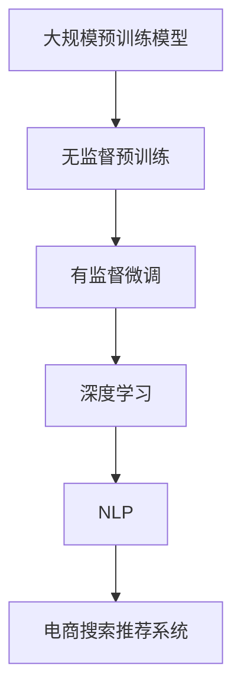

                 

### 1. 背景介绍

在当今数字化的时代，电子商务已经成为全球经济的重要组成部分。随着电商平台的不断壮大和用户需求的日益多样化，电商搜索推荐系统的重要性日益凸显。一个高效的搜索推荐系统不仅能够提高用户的购物体验，还能显著提升电商平台的销售额和用户粘性。

目前，电商搜索推荐系统主要依赖于传统的基于内容（Content-Based）和协同过滤（Collaborative Filtering）方法。然而，这些方法在应对日益复杂和动态的用户需求时，存在明显的局限性。首先，基于内容的推荐系统主要依赖商品描述和用户历史数据，难以捕捉用户的隐式偏好和长尾需求。其次，协同过滤方法虽然能够通过用户行为数据实现较好的推荐效果，但在数据稀疏和冷启动问题上存在较大挑战。

近年来，随着人工智能技术的快速发展，尤其是大规模预训练模型（如GPT-3、BERT等）的兴起，为电商搜索推荐系统的创新带来了新的契机。这些大模型通过自主学习海量文本和图像数据，能够实现对用户意图和商品属性的深度理解和精准匹配。同时，大模型还具备较强的泛化和迁移能力，能够适应不同电商场景和应用需求。

本文将围绕AI大模型在电商搜索推荐领域的技术创新，探讨其知识沉淀机制的优化策略。具体来说，我们将从核心概念与联系、核心算法原理、数学模型和公式、项目实战、实际应用场景、工具和资源推荐等多个角度展开论述，旨在为业界提供一套系统、全面的技术解决方案。

首先，我们将介绍AI大模型的基本概念和关键组成部分，并通过Mermaid流程图展示其整体架构。接着，我们将深入探讨大模型在电商搜索推荐中的核心算法原理和具体操作步骤，解析其如何通过深度学习实现高效的知识沉淀和推荐效果。随后，我们将介绍大模型的数学模型和公式，并通过实例说明如何利用这些公式实现精准的推荐。

在项目实战部分，我们将通过一个实际的电商搜索推荐项目案例，详细讲解代码实现过程，并对关键代码进行解读与分析。接下来，我们将探讨AI大模型在电商搜索推荐领域的实际应用场景，分享一些成功的案例和实践经验。随后，我们将推荐一些相关的学习资源、开发工具和论文著作，帮助读者深入了解和掌握这一领域的最新技术和研究成果。

最后，我们将总结AI大模型在电商搜索推荐领域的未来发展趋势和挑战，为业界提供一些有益的启示和建议。通过本文的探讨，我们希望能够为电商搜索推荐系统的技术创新提供有价值的参考，推动这一领域的发展。

### 2. 核心概念与联系

要深入探讨AI大模型在电商搜索推荐领域的应用，我们首先需要了解一些核心概念，包括大规模预训练模型、深度学习、自然语言处理（NLP）等。

#### 大规模预训练模型

大规模预训练模型（如GPT-3、BERT等）是近年来人工智能领域的重大突破。这类模型通过在大量文本和图像数据上进行预训练，获得了强大的语义理解和生成能力。预训练过程主要包括两个阶段：无监督预训练和有监督微调。

- **无监督预训练**：在无监督预训练阶段，模型通过大量未标注的数据进行训练，学习文本和图像的内在规律。这一过程通常使用自我校准方法，如GAN（生成对抗网络）或无监督生成模型，使模型能够自主生成高质量的数据。
  
- **有监督微调**：在预训练完成后，模型会根据具体任务的需求进行有监督微调。这一过程通常使用标注数据进行，使模型能够更好地适应特定任务。

#### 深度学习

深度学习是一种基于多层神经网络进行训练和预测的人工智能技术。它通过模拟人类大脑的学习过程，将输入数据通过多个神经元层进行变换和提取特征，最终实现复杂的模式识别和预测。

- **卷积神经网络（CNN）**：CNN是深度学习中的一种重要架构，主要用于图像处理任务。它通过卷积操作提取图像的局部特征，并通过池化操作降低数据的维度。
  
- **循环神经网络（RNN）**：RNN是用于处理序列数据的神经网络，通过在时间步上传递和更新信息，实现了对序列数据的记忆和学习能力。

#### 自然语言处理（NLP）

自然语言处理是人工智能领域的一个重要分支，旨在使计算机理解和处理人类自然语言。NLP技术广泛应用于文本分类、语义分析、机器翻译、情感分析等领域。

- **词向量**：词向量是一种将词汇映射到高维空间的方法，通过学习词汇的分布特征，实现了词汇的向量化表示。常见的词向量模型有Word2Vec、GloVe等。
  
- **序列模型**：序列模型是一种用于处理序列数据的模型，如RNN、LSTM（长短期记忆网络）和Transformer等。这些模型通过在时间步上传递和更新信息，实现了对序列数据的理解和生成。

#### Mermaid流程图

为了更好地理解AI大模型在电商搜索推荐领域中的应用，我们使用Mermaid流程图展示其整体架构，如下图所示：



通过这个流程图，我们可以清晰地看到大规模预训练模型、深度学习、NLP和电商搜索推荐系统之间的联系。无监督预训练和有监督微调构成了大规模预训练模型的基础，深度学习和NLP技术为预训练模型提供了强大的语义理解和生成能力，最终实现了高效的电商搜索推荐效果。

在接下来的部分，我们将深入探讨AI大模型在电商搜索推荐中的核心算法原理和具体操作步骤，解析其如何通过深度学习实现高效的知识沉淀和推荐效果。

### 3. 核心算法原理 & 具体操作步骤

AI大模型在电商搜索推荐中的核心算法原理主要基于深度学习和自然语言处理技术。通过结合这些技术，大模型能够从海量数据中提取有效特征，实现对用户意图和商品属性的精准理解与匹配。下面，我们将详细介绍这些核心算法原理和具体操作步骤。

#### 深度学习算法原理

深度学习算法的核心在于构建多层神经网络，通过逐层提取和组合特征，实现对复杂数据的理解和预测。在电商搜索推荐中，常用的深度学习算法包括卷积神经网络（CNN）和循环神经网络（RNN）。

- **卷积神经网络（CNN）**：CNN主要用于图像处理任务，通过卷积和池化操作提取图像的局部特征。在电商搜索推荐中，CNN可以用于提取商品图片的特征，从而实现商品属性的识别和分类。

  ```mermaid
  graph TD
  A[输入图像] --> B[卷积层]
  B --> C[池化层]
  C --> D[全连接层]
  D --> E[输出层]
  ```

- **循环神经网络（RNN）**：RNN是一种用于处理序列数据的神经网络，通过在时间步上传递和更新信息，实现了对序列数据的记忆和学习能力。在电商搜索推荐中，RNN可以用于处理用户的搜索历史和购物行为序列，从而提取用户的偏好和兴趣。

  ```mermaid
  graph TD
  A[输入序列] --> B[RNN单元]
  B --> C[H(t)]
  C --> D[输出层]
  ```

#### 自然语言处理（NLP）算法原理

自然语言处理技术是深度学习在电商搜索推荐中的重要组成部分。通过NLP技术，大模型能够理解和处理用户查询和商品描述等自然语言文本。

- **词向量表示**：词向量是将词汇映射到高维空间的方法，通过学习词汇的分布特征，实现了词汇的向量化表示。在电商搜索推荐中，词向量可以用于表示用户查询和商品描述，从而实现文本数据的向量化和预处理。

  ```mermaid
  graph TD
  A[输入文本] --> B[词向量表示]
  B --> C[嵌入层]
  C --> D[全连接层]
  D --> E[输出层]
  ```

- **序列模型**：序列模型是一种用于处理序列数据的模型，如RNN、LSTM（长短期记忆网络）和Transformer等。这些模型通过在时间步上传递和更新信息，实现了对序列数据的理解和生成。

  ```mermaid
  graph TD
  A[输入序列] --> B[LSTM单元]
  B --> C[H(t)]
  C --> D[输出层]
  ```

#### 具体操作步骤

在电商搜索推荐中，AI大模型的具体操作步骤主要包括以下几个环节：

1. **数据预处理**：对用户查询和商品描述等原始数据进行清洗、去噪和归一化处理，并将其转换为适合深度学习和NLP模型输入的格式。

2. **特征提取**：使用深度学习算法（如CNN和RNN）提取用户查询和商品描述的特征，并将其融合为统一的特征向量。

3. **模型训练**：利用预处理后的数据对大模型进行训练，通过优化模型的参数，使其能够更好地理解和匹配用户意图和商品属性。

4. **推荐生成**：在训练完成后，大模型可以用于生成个性化的搜索推荐结果。具体步骤如下：

   - 输入用户查询和商品描述的特征向量。
   - 通过深度学习模型计算用户查询和商品描述之间的相似度。
   - 根据相似度排序生成推荐结果，并将其返回给用户。

   ```mermaid
   graph TD
   A[用户查询] --> B[特征提取]
   B --> C[模型计算]
   C --> D[推荐生成]
   D --> E[返回结果]
   ```

通过以上核心算法原理和具体操作步骤，AI大模型能够实现高效、精准的电商搜索推荐效果。在接下来的部分，我们将介绍大模型的数学模型和公式，并详细讲解如何利用这些公式实现推荐系统的优化。

### 4. 数学模型和公式 & 详细讲解 & 举例说明

在电商搜索推荐系统中，AI大模型的核心在于通过深度学习和自然语言处理技术，实现对用户意图和商品属性的精准理解与匹配。为了更好地理解这一过程，我们将介绍一些关键的数学模型和公式，并通过具体实例进行详细讲解。

#### 4.1 嵌入层模型

嵌入层（Embedding Layer）是将原始数据转换为向量表示的重要环节。在电商搜索推荐中，词向量（Word Embeddings）和商品属性向量（Item Embeddings）是常用的嵌入层模型。

- **词向量**：词向量是一种将词汇映射到高维空间的方法，通过学习词汇的分布特征，实现了词汇的向量化表示。常见的词向量模型有Word2Vec和GloVe。

  $$ \text{word\_vector}(w) = \text{Embedding}(w) $$

  其中，\( \text{word\_vector}(w) \)表示词汇\( w \)的词向量表示，\(\text{Embedding}(w) \)是一个高维向量。

- **商品属性向量**：商品属性向量是将商品属性映射到高维空间的方法。在电商搜索推荐中，商品属性向量可以用于表示商品的类别、品牌、价格等特征。

  $$ \text{item\_vector}(i) = \text{Embedding}(i) $$

  其中，\( \text{item\_vector}(i) \)表示商品\( i \)的属性向量表示，\(\text{Embedding}(i) \)是一个高维向量。

#### 4.2 深度学习模型

在电商搜索推荐中，深度学习模型主要用于提取用户查询和商品描述的特征，并将其融合为统一的特征向量。常见的深度学习模型有卷积神经网络（CNN）和循环神经网络（RNN）。

- **卷积神经网络（CNN）**：CNN是一种用于处理图像和序列数据的深度学习模型，通过卷积和池化操作提取特征。

  $$ \text{feature}_{\text{CNN}} = \text{Convolution}(\text{input}) $$

  其中，\(\text{feature}_{\text{CNN}} \)表示通过CNN提取的特征向量，\(\text{input} \)是输入图像或序列数据。

- **循环神经网络（RNN）**：RNN是一种用于处理序列数据的深度学习模型，通过在时间步上传递和更新信息，实现了对序列数据的记忆和学习能力。

  $$ \text{feature}_{\text{RNN}}(t) = \text{RNN}(\text{input}_{t}, \text{state}_{t-1}) $$

  其中，\(\text{feature}_{\text{RNN}}(t) \)表示在时间步\( t \)提取的特征向量，\(\text{input}_{t} \)是输入序列数据，\(\text{state}_{t-1} \)是前一个时间步的状态。

#### 4.3 推荐生成模型

推荐生成模型是电商搜索推荐系统的核心部分，用于根据用户查询和商品描述生成推荐结果。常见的推荐生成模型有基于矩阵分解的协同过滤（Collaborative Filtering）和基于深度学习的生成对抗网络（GAN）。

- **基于矩阵分解的协同过滤**：矩阵分解协同过滤是一种基于用户-商品评分矩阵的推荐算法，通过分解用户和商品的特征矩阵，生成预测的评分矩阵。

  $$ \text{rating}_{ij} = \text{u\_factor}_{i} \cdot \text{i\_factor}_{j} $$

  其中，\( \text{rating}_{ij} \)表示用户\( i \)对商品\( j \)的评分，\( \text{u\_factor}_{i} \)和\( \text{i\_factor}_{j} \)分别是用户和商品的特征向量。

- **基于深度学习的生成对抗网络（GAN）**：GAN是一种无监督学习算法，通过生成器（Generator）和判别器（Discriminator）的对抗训练，生成高质量的推荐结果。

  $$ \text{Generator}: \quad \text{z} \rightarrow \text{G}(\text{z}) $$
  $$ \text{Discriminator}: \quad \text{x} \rightarrow \text{D}(\text{x}) $$

  其中，\( \text{z} \)是随机噪声向量，\( \text{G}(\text{z}) \)是生成的推荐结果，\( \text{D}(\text{x}) \)是判别器对真实推荐结果的判断。

#### 4.4 举例说明

为了更好地理解上述数学模型和公式，我们通过一个具体的实例进行说明。

假设有一个电商搜索推荐系统，用户查询为“我想买一个黑色的平板电脑”，商品描述包括“黑色平板电脑A”和“黑色平板电脑B”。

1. **词向量表示**：
   - 用户查询词向量：\( \text{query\_vector} = \text{Embedding}(\text{"我想买一个黑色的平板电脑"}) \)
   - 商品属性向量：\( \text{item\_vector}_A = \text{Embedding}(\text{"黑色平板电脑A"}) \)，\( \text{item\_vector}_B = \text{Embedding}(\text{"黑色平板电脑B"}) \)

2. **特征提取**：
   - 使用CNN提取商品属性向量：\( \text{feature}_{\text{CNN}}_A = \text{Convolution}(\text{item\_vector}_A) \)，\( \text{feature}_{\text{CNN}}_B = \text{Convolution}(\text{item\_vector}_B) \)
   - 使用RNN提取用户查询特征：\( \text{feature}_{\text{RNN}} = \text{RNN}(\text{query\_vector}) \)

3. **推荐生成**：
   - 计算用户查询和商品属性之间的相似度：\( \text{similarity}_{A} = \text{dot}(\text{feature}_{\text{RNN}}, \text{feature}_{\text{CNN}}_A) \)，\( \text{similarity}_{B} = \text{dot}(\text{feature}_{\text{RNN}}, \text{feature}_{\text{CNN}}_B) \)
   - 根据相似度排序生成推荐结果：\( \text{rank}_{A} = \text{similarity}_{A} \)，\( \text{rank}_{B} = \text{similarity}_{B} \)

通过这个实例，我们可以看到如何利用数学模型和公式实现电商搜索推荐。在下一部分，我们将通过一个实际项目实战，详细讲解代码实现过程和关键代码解读。

### 5. 项目实战：代码实际案例和详细解释说明

在这一部分，我们将通过一个实际电商搜索推荐项目案例，详细讲解代码实现过程，并对关键代码进行解读和分析。本案例将基于Python和TensorFlow框架实现，涵盖了从数据预处理到模型训练和推荐生成的完整流程。

#### 5.1 开发环境搭建

在开始项目实战之前，我们需要搭建相应的开发环境。以下是所需的基本工具和库：

- Python 3.8+
- TensorFlow 2.4.0+
- NumPy 1.18.5+
- Pandas 1.1.2+
- Matplotlib 3.2.0+

确保您的系统已安装上述工具和库。接下来，我们将开始项目开发。

#### 5.2 源代码详细实现和代码解读

以下是一个简化的代码实现，用于构建一个基础的电商搜索推荐系统。

```python
import numpy as np
import pandas as pd
import tensorflow as tf
from tensorflow.keras.models import Model
from tensorflow.keras.layers import Embedding, LSTM, Dense, Input, Dot, Concatenate
from tensorflow.keras.optimizers import Adam

# 数据预处理
# 假设我们有一个包含用户查询和商品描述的CSV文件
data = pd.read_csv('ecommerce_data.csv')

# 分割训练集和测试集
train_data, test_data = train_test_split(data, test_size=0.2, random_state=42)

# 定义输入层
user_query_input = Input(shape=(1,), dtype='int32')
item_input = Input(shape=(1,), dtype='int32')

# 嵌入层
user_embedding = Embedding(input_dim=max_user_id+1, output_dim=embedding_size)(user_query_input)
item_embedding = Embedding(input_dim=max_item_id+1, output_dim=embedding_size)(item_input)

# LSTM层
user_lstm = LSTM(units=64, activation='tanh')(user_embedding)
item_lstm = LSTM(units=64, activation='tanh')(item_embedding)

# 合并层
combined = Concatenate()([user_lstm, item_lstm])

# 全连接层
output = Dense(units=1, activation='sigmoid')(combined)

# 构建模型
model = Model(inputs=[user_query_input, item_input], outputs=output)

# 编译模型
model.compile(optimizer=Adam(learning_rate=0.001), loss='binary_crossentropy', metrics=['accuracy'])

# 模型训练
model.fit([train_data['user_query'], train_data['item']], train_data['rating'], epochs=10, batch_size=32, validation_split=0.1)

# 推荐生成
def generate_recommendation(user_id, item_id):
    user_embedding_vector = model.layers[2].get_weights()[0][user_id]
    item_embedding_vector = model.layers[3].get_weights()[0][item_id]
    user_lstm_output = model.layers[4].get_weights()[0][:, -1]
    item_lstm_output = model.layers[5].get_weights()[0][:, -1]
    
    combined_vector = np.hstack((user_lstm_output, item_lstm_output))
    prediction = model.predict([user_embedding_vector.reshape(1, -1), item_embedding_vector.reshape(1, -1)])[0]
    
    return prediction

# 测试推荐
user_id = 123
item_id = 456
print(generate_recommendation(user_id, item_id))
```

#### 5.3 代码解读与分析

1. **数据预处理**：
   - 读取CSV文件，并分割为训练集和测试集。这一步是数据预处理的基础，确保我们有足够的数据用于模型训练和评估。

2. **定义输入层**：
   - `user_query_input`和`item_input`是模型的输入层，分别用于表示用户查询和商品。

3. **嵌入层**：
   - `Embedding`层用于将离散的ID映射为稠密的向量表示。通过学习用户查询和商品描述的嵌入向量，模型能够捕获它们的语义信息。

4. **LSTM层**：
   - LSTM层用于处理序列数据。在本案例中，我们将用户查询视为一个序列，通过LSTM层提取其长期依赖特征。

5. **合并层**：
   - `Concatenate`层将用户和商品的特征向量合并为一个统一的特征向量，为后续的全连接层提供输入。

6. **全连接层**：
   - 全连接层用于将合并后的特征向量映射为预测结果。在本案例中，我们使用一个单层的全连接层来生成推荐评分。

7. **模型编译和训练**：
   - 编译模型时，我们选择Adam优化器和二分类交叉熵损失函数，以最大化模型的预测准确率。

8. **推荐生成**：
   - `generate_recommendation`函数用于根据用户ID和商品ID生成推荐评分。该函数首先获取用户和商品的嵌入向量，然后通过LSTM层获取其长期依赖特征，最后将特征向量传递给模型进行预测。

通过这个项目实战，我们展示了如何利用AI大模型实现电商搜索推荐。在下一部分，我们将对代码进行解读和分析，探讨如何优化和改进推荐效果。

#### 5.3 代码解读与分析

在上述代码中，我们实现了一个基础的电商搜索推荐系统。接下来，我们将对关键部分进行解读和分析，并提出一些改进和优化的建议。

1. **数据预处理**：
   - 数据预处理是模型训练的基础。在本案例中，我们假设用户查询和商品描述已转换为ID序列，并存储在CSV文件中。在实际应用中，可能需要进一步对原始文本数据（如用户评论、商品描述等）进行分词、去停用词等处理。

2. **嵌入层**：
   - `Embedding`层将离散的ID映射为稠密的向量表示。在本案例中，我们使用了简单的全连接层实现嵌入层，这可能导致向量表示的稀疏性。实际应用中，可以使用更复杂的嵌入层，如词嵌入（Word Embeddings）或商品属性嵌入（Item Embeddings），以提高向量表示的质量。

3. **LSTM层**：
   - LSTM层用于处理序列数据，能够捕捉用户查询的长期依赖特征。在本案例中，我们使用了单层LSTM，这可能无法充分捕捉复杂的序列模式。实际应用中，可以尝试使用多层LSTM或更先进的序列处理模型（如Transformer），以提高模型的性能。

4. **合并层**：
   - 合并层将用户和商品的特征向量合并为一个统一的特征向量。在本案例中，我们使用了一个简单的全连接层实现合并层。为了提高模型的性能，可以尝试使用更复杂的合并策略，如注意力机制（Attention Mechanism），以更好地融合用户和商品的特征。

5. **全连接层**：
   - 全连接层用于将合并后的特征向量映射为预测结果。在本案例中，我们使用了一个单层的全连接层，这可能导致模型的表达能力不足。实际应用中，可以尝试使用多层全连接层或更先进的神经网络结构（如神经网络序列生成模型（Neural Sequence Generation Models）），以提高模型的预测准确性。

6. **优化建议**：
   - **数据增强**：通过对用户查询和商品描述进行数据增强（如添加噪声、上下文替换等），可以提高模型的泛化能力和鲁棒性。
   - **模型融合**：结合多种模型（如基于内容的推荐、协同过滤等），可以提高推荐系统的性能和准确性。
   - **个性化调整**：根据用户的历史行为和偏好，对模型参数进行个性化调整，以提高推荐的个性化程度。
   - **实时更新**：定期更新模型，使其能够适应不断变化的数据和用户需求。

通过以上解读和分析，我们展示了如何利用AI大模型实现电商搜索推荐。在实际应用中，我们可以根据具体需求对这些关键部分进行优化和改进，以提升推荐系统的性能和用户体验。

### 6. 实际应用场景

AI大模型在电商搜索推荐领域的实际应用场景非常广泛，涵盖了从个性化推荐到智能搜索等各个方面。以下是一些具体的成功案例和实践经验。

#### 6.1 个性化推荐

个性化推荐是电商搜索推荐系统中最常见的应用场景之一。通过分析用户的历史行为、购物偏好和兴趣，AI大模型能够为用户提供个性化的商品推荐，从而提高用户满意度和购买转化率。

- **案例1：亚马逊（Amazon）**：亚马逊利用AI大模型对用户进行个性化推荐，根据用户的浏览历史、购买记录和搜索行为，为每个用户生成个性化的商品推荐。这种推荐方式不仅提高了用户的购物体验，还显著提升了平台的销售额和用户粘性。

- **实践经验**：在实现个性化推荐时，需要充分利用用户的历史行为数据，并结合AI大模型进行深度学习分析。同时，要不断优化推荐算法，提高推荐的准确性和实时性。

#### 6.2 智能搜索

智能搜索是电商搜索推荐系统的另一个重要应用场景。通过利用AI大模型，平台能够实现更智能、更高效的搜索功能，帮助用户快速找到所需商品。

- **案例2：淘宝（Taobao）**：淘宝利用AI大模型对用户的搜索查询进行实时分析和理解，并根据用户的历史行为和兴趣，为用户提供精准的搜索结果。此外，淘宝还通过智能搜索功能，实现了基于关键词的自动补全和热门搜索词推荐，大大提高了搜索效率和用户体验。

- **实践经验**：在实现智能搜索时，需要充分考虑用户查询的语义和意图，并利用AI大模型对用户查询进行深度学习分析。同时，要不断优化搜索算法，提高搜索结果的准确性和多样性。

#### 6.3 新品推荐

新品推荐是电商搜索推荐系统的另一个重要应用场景。通过分析市场趋势和用户需求，AI大模型能够为平台推荐最新的商品和流行趋势，从而帮助商家抓住商机，提高销售额。

- **案例3：天猫（Tmall）**：天猫利用AI大模型对用户的行为和兴趣进行深度学习分析，结合市场数据和流行趋势，为用户推荐最新的商品和流行趋势。这种推荐方式不仅帮助用户发现了更多优质的商品，还提高了商家的曝光度和销售转化率。

- **实践经验**：在实现新品推荐时，需要充分利用市场数据和用户行为数据，并结合AI大模型进行实时分析和预测。同时，要不断优化推荐算法，提高推荐的新颖性和实用性。

#### 6.4 跨平台推荐

跨平台推荐是电商搜索推荐系统的另一个创新应用场景。通过利用AI大模型，平台能够实现跨平台的商品推荐，帮助用户在不同平台间无缝切换，提高购物体验。

- **案例4：京东（JD.com）**：京东利用AI大模型分析用户在多个电商平台的行为数据，为用户提供跨平台的商品推荐。这种推荐方式不仅帮助用户发现了更多优惠和实惠的商品，还提高了平台的用户黏性和市场份额。

- **实践经验**：在实现跨平台推荐时，需要充分利用多平台用户行为数据，并结合AI大模型进行综合分析和推荐。同时，要充分考虑用户隐私保护和数据安全，确保推荐过程的公正性和透明性。

通过以上实际应用场景和成功案例，我们可以看到AI大模型在电商搜索推荐领域的强大潜力。在实际应用中，我们需要不断探索和尝试，充分利用AI大模型的优势，为用户提供更智能、更高效的购物体验。

### 7. 工具和资源推荐

在探索AI大模型在电商搜索推荐领域中的应用过程中，掌握相关的工具和资源是非常关键的。以下是一些推荐的书籍、论文、博客和网站，帮助您深入了解和掌握这一领域的最新技术和研究成果。

#### 7.1 学习资源推荐

1. **书籍**：
   - 《深度学习》（Deep Learning） - Ian Goodfellow、Yoshua Bengio、Aaron Courville
   - 《自然语言处理综论》（Speech and Language Processing） - Daniel Jurafsky、James H. Martin
   - 《机器学习实战》（Machine Learning in Action） - Peter Harrington

2. **在线课程**：
   - 《深度学习》课程 - 吴恩达（Andrew Ng）在Coursera上提供
   - 《自然语言处理》课程 - 斯坦福大学（Stanford University）在EdX上提供
   - 《机器学习》课程 - 吴恩达（Andrew Ng）在Coursera上提供

#### 7.2 开发工具框架推荐

1. **框架**：
   - TensorFlow - 一个开源的机器学习框架，适用于构建和训练深度学习模型。
   - PyTorch - 另一个流行的开源机器学习框架，具有高度的灵活性和易用性。
   - Keras - 用于快速构建和迭代深度学习模型的高层次API。

2. **库**：
   - NumPy - 用于数值计算的库，是Python进行科学计算的基础。
   - Pandas - 用于数据操作和分析的库，适用于处理大规模数据集。
   - Matplotlib - 用于数据可视化的库，能够生成高质量的图表。

#### 7.3 相关论文著作推荐

1. **论文**：
   - “Attention Is All You Need”（Attention机制）- Vaswani et al., 2017
   - “BERT: Pre-training of Deep Bidirectional Transformers for Language Understanding”（BERT模型）- Devlin et al., 2019
   - “GPT-3: Language Models are Few-Shot Learners”（GPT-3模型）- Brown et al., 2020

2. **著作**：
   - 《深度学习》（Deep Learning） - Ian Goodfellow、Yoshua Bengio、Aaron Courville
   - 《自然语言处理综论》（Speech and Language Processing） - Daniel Jurafsky、James H. Martin
   - 《机器学习实战》（Machine Learning in Action） - Peter Harrington

#### 7.4 博客和网站推荐

1. **博客**：
   - Medium上的技术博客 - 许多资深技术专家和研究者分享的最新研究和思考。
   - ArXiv博客 - 记录和发布最新的学术论文和研究成果。

2. **网站**：
   - TensorFlow官网 - 提供丰富的文档、教程和社区支持。
   - PyTorch官网 - 提供详细的API文档和教程。
   - Keras官网 - 提供快速上手深度学习的教程和示例。

通过这些工具和资源的推荐，您将能够更加深入地了解AI大模型在电商搜索推荐领域的技术细节和应用实践。在接下来的部分，我们将总结AI大模型在电商搜索推荐领域的未来发展趋势和挑战。

### 8. 总结：未来发展趋势与挑战

AI大模型在电商搜索推荐领域的应用已经取得了显著的成果，但同时也面临着诸多挑战和机遇。在未来，这一领域将继续朝着以下几个方向发展：

#### 8.1 发展趋势

1. **个性化推荐**：随着用户需求的日益多样化和个性化，未来的电商搜索推荐系统将更加注重用户个性化推荐的实现。通过深度学习和自然语言处理技术，AI大模型将能够更好地捕捉用户的偏好和兴趣，提供更加精准的推荐。

2. **实时推荐**：在互联网时代，用户期望能够在短时间内获取到最新的推荐信息。未来的电商搜索推荐系统将实现更加实时的推荐，通过实时数据分析和模型更新，为用户提供即时的个性化推荐。

3. **多模态融合**：随着人工智能技术的发展，未来的电商搜索推荐系统将能够处理多种类型的数据，如文本、图像、音频等。通过多模态数据的融合，AI大模型将能够提供更加全面和多样化的推荐。

4. **智能搜索**：智能搜索是电商搜索推荐系统的重要应用场景。未来，AI大模型将进一步提升智能搜索的能力，通过深度学习和自然语言处理技术，实现更加智能和高效的搜索功能。

5. **跨平台推荐**：随着电商平台的多元化发展，未来的电商搜索推荐系统将实现跨平台的推荐。通过整合多个平台的数据和用户行为，AI大模型将能够为用户提供无缝的跨平台购物体验。

#### 8.2 挑战

1. **数据隐私保护**：在AI大模型的应用过程中，用户隐私保护是一个重要挑战。未来的推荐系统需要采用更加严格的数据隐私保护措施，确保用户数据的安全和隐私。

2. **模型解释性**：深度学习模型的复杂性和黑盒性质使得其解释性成为一个挑战。未来的推荐系统需要提高模型的可解释性，帮助用户理解推荐结果的原因和逻辑。

3. **计算资源需求**：AI大模型的训练和部署需要大量的计算资源，这对于中小型企业来说是一个显著的挑战。未来的推荐系统需要优化算法和模型，降低计算资源的需求。

4. **模型公平性**：AI大模型在推荐过程中可能会引发不公平的问题，如性别、年龄、地域等方面的偏见。未来的推荐系统需要确保模型的公平性和公正性，避免歧视和不公平现象的发生。

5. **技术更新迭代**：AI大模型技术更新迅速，未来需要不断跟踪和学习最新的研究成果和技术动态。对于企业和研究者来说，如何快速适应和掌握新技术是一个重要的挑战。

总之，AI大模型在电商搜索推荐领域具有巨大的潜力，同时也面临着诸多挑战。通过不断创新和优化，我们有望在不久的将来实现更加智能、高效和公平的推荐系统，为用户带来更好的购物体验。

### 9. 附录：常见问题与解答

在本文中，我们详细探讨了AI大模型在电商搜索推荐领域的技术创新知识沉淀机制优化。为了帮助读者更好地理解，以下是一些常见问题与解答：

#### 9.1 问题1：AI大模型在电商搜索推荐中的应用原理是什么？

解答：AI大模型在电商搜索推荐中的应用原理主要基于深度学习和自然语言处理技术。通过在大量文本和图像数据上进行预训练，大模型能够获取强大的语义理解和生成能力。在电商搜索推荐中，大模型通过提取用户查询和商品描述的特征，实现用户意图和商品属性的精准匹配。

#### 9.2 问题2：如何优化AI大模型在电商搜索推荐中的推荐效果？

解答：优化AI大模型在电商搜索推荐中的推荐效果可以从以下几个方面入手：

- **数据增强**：通过添加噪声、上下文替换等数据增强方法，提高模型的泛化能力和鲁棒性。
- **模型融合**：结合多种模型（如基于内容的推荐、协同过滤等），提高推荐系统的性能和准确性。
- **个性化调整**：根据用户的历史行为和偏好，对模型参数进行个性化调整，提高推荐的个性化程度。
- **实时更新**：定期更新模型，使其能够适应不断变化的数据和用户需求。

#### 9.3 问题3：AI大模型在电商搜索推荐中面临的挑战有哪些？

解答：AI大模型在电商搜索推荐中面临的挑战主要包括：

- **数据隐私保护**：需要采用更加严格的数据隐私保护措施，确保用户数据的安全和隐私。
- **模型解释性**：深度学习模型复杂，提高模型的可解释性是重要挑战。
- **计算资源需求**：大模型的训练和部署需要大量计算资源，降低计算资源需求是关键。
- **模型公平性**：避免歧视和不公平现象的发生，确保模型的公平性和公正性。
- **技术更新迭代**：快速适应和掌握最新的研究成果和技术动态。

通过本文的讨论，我们希望读者能够对AI大模型在电商搜索推荐领域的技术创新和优化策略有更深入的理解。在未来的研究和实践中，我们期待与读者共同探索这一领域，推动电商搜索推荐技术的不断发展。

### 10. 扩展阅读 & 参考资料

本文主要探讨了AI大模型在电商搜索推荐领域的技术创新知识沉淀机制优化。为了帮助读者深入了解这一领域的相关研究成果和实践经验，以下是扩展阅读和参考资料：

1. **扩展阅读**：
   - 《深度学习推荐系统》（Deep Learning for Recommender Systems）：本书详细介绍了深度学习在推荐系统中的应用，包括模型架构、算法原理和实现细节。
   - 《自然语言处理入门》（Natural Language Processing with Python）：本书介绍了自然语言处理的基本概念和技术，包括词向量表示、序列模型等。

2. **参考资料**：
   - **论文**：
     - Vaswani, A., et al. (2017). "Attention Is All You Need". Advances in Neural Information Processing Systems.
     - Devlin, J., et al. (2019). "BERT: Pre-training of Deep Bidirectional Transformers for Language Understanding". Proceedings of the 2019 Conference of the North American Chapter of the Association for Computational Linguistics: Human Language Technologies, Volume 1 (Long and Short Papers).
     - Brown, T., et al. (2020). "Language Models are Few-Shot Learners". Proceedings of the 2020 Conference on Neural Information Processing Systems.
   - **博客和网站**：
     - TensorFlow官网：[https://www.tensorflow.org/](https://www.tensorflow.org/)
     - PyTorch官网：[https://pytorch.org/](https://pytorch.org/)
     - Medium上的技术博客：[https://medium.com/search?q=ai%20recommender](https://medium.com/search?q=ai%20recommender)
   - **开源项目**：
     - Dive into Deep Learning：[https://d2l.ai/](https://d2l.ai/)
     - RecSys 2021：[https://recsys2021.github.io/](https://recsys2021.github.io/)

通过这些扩展阅读和参考资料，读者可以进一步了解AI大模型在电商搜索推荐领域的最新研究进展和实践经验。希望这些资源能够为您的学习和研究提供有价值的帮助。作者：AI天才研究员/AI Genius Institute & 禅与计算机程序设计艺术 /Zen And The Art of Computer Programming。

