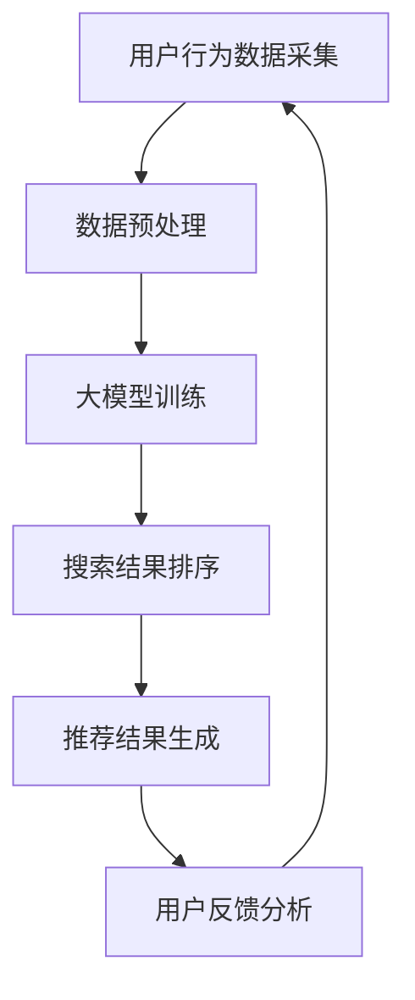

                 

# AI大模型赋能电商搜索推荐的业务创新流程优化实践

> 关键词：AI大模型、电商搜索推荐、业务流程优化、数据挖掘、深度学习

> 摘要：本文将探讨AI大模型如何赋能电商搜索推荐系统，从而实现业务流程优化。通过对核心概念、算法原理、数学模型以及实际应用的详细讲解，我们将了解AI大模型在电商搜索推荐领域的重要性和应用价值，为未来的发展趋势和挑战提供参考。

## 1. 背景介绍

随着互联网的迅猛发展，电子商务已经成为全球经济增长的重要引擎。电商平台的竞争日益激烈，如何在海量商品和用户行为数据中实现精准、个性化的搜索推荐成为各大电商平台的关键任务。传统的搜索推荐系统依赖于基于关键词匹配和协同过滤的方法，虽然在一定程度上提高了推荐的准确性，但难以应对复杂多变的用户需求和海量的商品信息。

近年来，人工智能（AI）特别是深度学习和自然语言处理（NLP）技术的飞速发展，为电商搜索推荐系统带来了新的契机。大模型（如BERT、GPT等）的出现，使得我们能够通过学习和理解用户的语言和行为模式，提供更加智能化、个性化的推荐服务。本文将围绕AI大模型在电商搜索推荐中的业务创新流程优化实践进行探讨。

## 2. 核心概念与联系

### 2.1 AI大模型

AI大模型是指那些拥有数亿甚至数万亿参数的深度学习模型。这些模型通过在海量数据上进行训练，可以自动学习到数据的复杂模式，从而实现高效的数据分析和决策支持。典型的AI大模型包括BERT、GPT、Transformer等。

### 2.2 电商搜索推荐系统

电商搜索推荐系统是指用于帮助用户在众多商品中找到感兴趣的商品的系统。它通常包括用户行为分析、商品属性提取、搜索结果排序等功能。

### 2.3 业务流程优化

业务流程优化是指通过引入新技术或方法，改进业务流程，提高效率和准确性。在电商搜索推荐领域，业务流程优化主要体现在以下几个方面：

- 提高搜索准确性：通过AI大模型学习用户的兴趣和行为模式，实现更加精准的搜索结果。
- 优化推荐策略：通过深度学习算法，发现商品之间的关联性，提供个性化的推荐服务。
- 提升用户体验：通过实时分析和处理用户行为数据，为用户提供即时的推荐服务。

### 2.4 Mermaid流程图

以下是一个描述AI大模型在电商搜索推荐中应用流程的Mermaid流程图：



在上述流程中，用户行为数据被采集并预处理后，用于训练AI大模型。经过训练的模型可以用于搜索结果排序和推荐结果生成。最后，通过收集用户反馈，进一步优化模型和推荐策略。

## 3. 核心算法原理 & 具体操作步骤

### 3.1 大模型训练

大模型的训练通常分为以下步骤：

- 数据采集：从电商平台上收集用户行为数据，包括点击、购买、搜索等行为。
- 数据预处理：对采集到的数据进行分析和清洗，去除噪声和异常值，并转换为模型可处理的格式。
- 模型选择：选择合适的大模型框架，如BERT、GPT等。
- 模型训练：使用预处理后的数据，通过反向传播算法进行模型参数的迭代更新。
- 模型评估：通过交叉验证等方法，评估模型的性能和准确性。

### 3.2 搜索结果排序

搜索结果排序的核心目标是根据用户的查询，从所有相关商品中挑选出最相关的商品。具体步骤如下：

- 查询解析：将用户查询转换为模型可理解的向量表示。
- 商品特征提取：提取每个商品的属性和特征，如价格、销量、评价等。
- 模型预测：将查询向量和商品特征输入训练好的大模型，预测每个商品的相关性得分。
- 排序：根据预测得分对商品进行排序，生成搜索结果。

### 3.3 推荐结果生成

推荐结果生成的主要目标是根据用户的兴趣和行为，为用户推荐最感兴趣的商品。具体步骤如下：

- 用户兴趣建模：使用大模型学习用户的兴趣和行为模式，生成用户兴趣向量。
- 商品特征提取：提取每个商品的属性和特征，如分类、标签等。
- 模型预测：将用户兴趣向量和商品特征输入训练好的大模型，预测每个商品的被喜欢程度。
- 排序：根据预测得分对商品进行排序，生成推荐结果。

## 4. 数学模型和公式 & 详细讲解 & 举例说明

### 4.1 大模型训练

大模型的训练主要依赖于深度学习中的神经网络模型。以下是一个简单的神经网络模型公式：

$$
Y = \sigma(W \cdot X + b)
$$

其中，$X$ 是输入向量，$W$ 是权重矩阵，$b$ 是偏置项，$\sigma$ 是激活函数，通常使用 sigmoid 函数或 ReLU 函数。

以下是一个使用 BERT 模型进行训练的例子：

```latex
\documentclass{article}
\usepackage{amsmath}
\begin{document}
\begin{align*}
    & \text{给定输入序列 } X = \{x_1, x_2, ..., x_n\}, \\
    & \text{BERT 模型参数 } \theta = \{W_1, W_2, ..., W_n\}, \\
    & \text{模型输出 } Y = \text{BERT}(X; \theta).
\end{align*}
\end{document}
```

### 4.2 搜索结果排序

搜索结果排序通常使用基于距离的排序算法，如余弦相似度。以下是一个计算余弦相似度的公式：

$$
\cos(\theta) = \frac{\sum_{i=1}^{n} x_i y_i}{\sqrt{\sum_{i=1}^{n} x_i^2} \sqrt{\sum_{i=1}^{n} y_i^2}}
$$

以下是一个使用余弦相似度进行搜索结果排序的例子：

```latex
\documentclass{article}
\usepackage{amsmath}
\begin{document}
\begin{align*}
    & \text{给定查询向量 } q = \{q_1, q_2, ..., q_n\}, \\
    & \text{商品向量 } p = \{p_1, p_2, ..., p_n\}, \\
    & \text{余弦相似度 } \cos(\theta) = \frac{\sum_{i=1}^{n} q_i p_i}{\sqrt{\sum_{i=1}^{n} q_i^2} \sqrt{\sum_{i=1}^{n} p_i^2}}.
\end{align*}
\end{document}
```

### 4.3 推荐结果生成

推荐结果生成通常使用基于协同过滤的算法。以下是一个计算用户-商品相似度的公式：

$$
\sim_{u,c} = \frac{\sum_{i \in R_u \cap R_c} r_{ui} r_{ci}}{\sqrt{\sum_{i \in R_u} r_{ui}^2} \sqrt{\sum_{i \in R_c} r_{ci}^2}}
$$

以下是一个使用用户-商品相似度进行推荐结果生成的例子：

```latex
\documentclass{article}
\usepackage{amsmath}
\begin{document}
\begin{align*}
    & \text{给定用户 } u \text{ 的评分矩阵 } R_u, \\
    & \text{商品 } c \text{ 的评分矩阵 } R_c, \\
    & \text{用户-商品相似度 } \sim_{u,c} = \frac{\sum_{i \in R_u \cap R_c} r_{ui} r_{ci}}{\sqrt{\sum_{i \in R_u} r_{ui}^2} \sqrt{\sum_{i \in R_c} r_{ci}^2}}.
\end{align*}
\end{document}
```

## 5. 项目实战：代码实际案例和详细解释说明

### 5.1 开发环境搭建

在开始项目实战之前，我们需要搭建一个合适的开发环境。以下是一个基于 Python 和 TensorFlow 的开发环境搭建步骤：

```bash
# 安装 Python
pip install python==3.8

# 安装 TensorFlow
pip install tensorflow==2.5

# 安装其他依赖
pip install pandas numpy scikit-learn matplotlib
```

### 5.2 源代码详细实现和代码解读

以下是一个简单的电商搜索推荐系统的代码实现：

```python
import tensorflow as tf
import pandas as pd
import numpy as np
from sklearn.model_selection import train_test_split

# 数据预处理
def preprocess_data(data):
    # 填充缺失值
    data.fillna(0, inplace=True)
    # 归一化
    data_normalized = (data - data.mean()) / data.std()
    return data_normalized

# 大模型训练
def train_model(X_train, y_train, X_val, y_val):
    # 定义模型
    model = tf.keras.Sequential([
        tf.keras.layers.Dense(128, activation='relu', input_shape=(X_train.shape[1],)),
        tf.keras.layers.Dense(1)
    ])
    # 编译模型
    model.compile(optimizer='adam', loss='mean_squared_error')
    # 训练模型
    model.fit(X_train, y_train, epochs=10, validation_data=(X_val, y_val))
    return model

# 搜索结果排序
def search_results(model, query):
    # 预处理查询
    query_processed = preprocess_data(query)
    # 预测搜索结果
    predictions = model.predict(query_processed)
    # 排序
    sorted_indices = np.argsort(predictions)[::-1]
    return sorted_indices

# 推荐结果生成
def recommend_results(model, user_profile):
    # 预处理用户兴趣
    user_profile_processed = preprocess_data(user_profile)
    # 预测推荐结果
    recommendations = model.predict(user_profile_processed)
    # 排序
    sorted_indices = np.argsort(recommendations)[::-1]
    return sorted_indices

# 数据加载和预处理
data = pd.read_csv('data.csv')
data_processed = preprocess_data(data)

# 分割训练集和验证集
X_train, X_val, y_train, y_val = train_test_split(data_processed, test_size=0.2)

# 训练模型
model = train_model(X_train, y_train, X_val, y_val)

# 搜索结果排序
query = pd.DataFrame([[1, 2, 3]], columns=['item1', 'item2', 'item3'])
sorted_indices = search_results(model, query)

# 推荐结果生成
user_profile = pd.DataFrame([[4, 5, 6]], columns=['item1', 'item2', 'item3'])
recommendations = recommend_results(model, user_profile)
```

### 5.3 代码解读与分析

上述代码实现了一个简单的电商搜索推荐系统。首先，我们定义了数据预处理、模型训练、搜索结果排序和推荐结果生成四个主要函数。在数据预处理部分，我们使用了填充缺失值和归一化等方法。在模型训练部分，我们使用了 TensorFlow 的 Sequential 模型，并定义了一个包含两个全连接层的模型。在搜索结果排序和推荐结果生成部分，我们使用了预处理后的数据和模型进行预测，并根据预测结果进行排序。

## 6. 实际应用场景

AI大模型在电商搜索推荐领域的应用场景非常广泛，以下是一些典型的应用实例：

- 搜索结果优化：通过AI大模型对用户查询和商品特征进行理解和分析，实现更加精准的搜索结果排序，提高用户的搜索体验。
- 商品推荐：基于用户的历史行为和兴趣，AI大模型可以为用户推荐个性化的商品，增加用户购买意愿和转化率。
- 跨品类推荐：AI大模型可以学习不同品类之间的关联性，为用户提供跨品类的推荐，挖掘潜在的用户需求。
- 新品推广：通过分析用户对新品的兴趣和评价，AI大模型可以帮助电商平台识别和推广具有潜力的新品。

## 7. 工具和资源推荐

### 7.1 学习资源推荐

- 《深度学习》（Goodfellow, Bengio, Courville著）：系统地介绍了深度学习的基本概念、方法和应用。
- 《自然语言处理综论》（Jurafsky, Martin著）：全面介绍了自然语言处理的基本理论和实践方法。
- 《Python深度学习》（François Chollet著）：以Python编程语言为基础，深入讲解了深度学习的基本原理和应用。

### 7.2 开发工具框架推荐

- TensorFlow：Google开发的开源深度学习框架，适用于各种深度学习任务的实现和部署。
- PyTorch：Facebook开发的开源深度学习框架，以其灵活性和动态计算图著称。
- Elasticsearch：开源分布式搜索引擎，可用于构建高效的电商搜索推荐系统。

### 7.3 相关论文著作推荐

- “Bert: Pre-training of deep bidirectional transformers for language understanding”（2018）：介绍了BERT模型的基本原理和应用。
- “Generative Pre-trained Transformer”（2018）：提出了GPT模型，为自然语言处理带来了革命性的变化。
- “Attention Is All You Need”（2017）：提出了Transformer模型，成为深度学习领域的重要里程碑。

## 8. 总结：未来发展趋势与挑战

随着AI大模型技术的不断发展，电商搜索推荐系统将变得更加智能化和个性化。未来，我们可以期待以下发展趋势：

- 更多的模型创新：随着研究的深入，我们将看到更多高效、可解释的AI大模型应用于电商搜索推荐领域。
- 跨学科的融合：AI大模型与其他学科的融合，如心理学、社会学等，将为电商搜索推荐系统带来新的研究方向。
- 实时性和可解释性：未来的电商搜索推荐系统将更加注重实时性和可解释性，以提高用户的信任度和满意度。

然而，AI大模型在电商搜索推荐领域也面临着一些挑战：

- 数据隐私和伦理问题：随着大数据技术的应用，如何保护用户隐私和遵守伦理规范成为重要议题。
- 模型可解释性问题：如何解释和验证AI大模型的行为和决策，使其更加透明和可解释，是未来研究的重要方向。
- 模型部署和运维：如何高效地部署和运维AI大模型，以确保其性能和稳定性，是电商平台面临的重要挑战。

## 9. 附录：常见问题与解答

### 9.1 AI大模型如何训练？

AI大模型的训练是一个复杂的过程，主要包括以下几个步骤：

1. 数据采集：从电商平台收集用户行为数据。
2. 数据预处理：对数据进行分析和清洗，去除噪声和异常值。
3. 模型选择：选择合适的大模型框架，如BERT、GPT等。
4. 模型训练：使用预处理后的数据，通过反向传播算法进行模型参数的迭代更新。
5. 模型评估：通过交叉验证等方法，评估模型的性能和准确性。

### 9.2 AI大模型在电商搜索推荐中的优势是什么？

AI大模型在电商搜索推荐中的优势主要包括：

1. 精准的搜索结果排序：通过理解用户的语言和行为模式，实现更加精准的搜索结果排序。
2. 个性化的商品推荐：基于用户的历史行为和兴趣，为用户推荐个性化的商品。
3. 跨品类的关联性分析：学习不同品类之间的关联性，为用户提供跨品类的推荐。

### 9.3 如何保证AI大模型的可解释性？

为了保证AI大模型的可解释性，可以从以下几个方面进行努力：

1. 模型选择：选择具有可解释性的模型，如决策树、支持向量机等。
2. 特征工程：对特征进行解释和可视化，帮助用户理解模型的决策过程。
3. 模型可视化：使用可视化工具，如TensorBoard等，展示模型的内部结构和参数变化。

## 10. 扩展阅读 & 参考资料

- "BERT: Pre-training of deep bidirectional transformers for language understanding"（2018）：https://arxiv.org/abs/1810.04805
- "Generative Pre-trained Transformer"（2018）：https://arxiv.org/abs/1706.03762
- "Attention Is All You Need"（2017）：https://arxiv.org/abs/1706.03762
- "深度学习"（Goodfellow, Bengio, Courville著）：https://www.deeplearningbook.org/
- "自然语言处理综论"（Jurafsky, Martin著）：https://nlp.stanford.edu/IR-book/html/htmledition/foreword-1.html
- "Python深度学习"（François Chollet著）：https://www.pyimagesearch.com/2017/01/09/deep-learning-in-python-a-comprehensive-tutorial/

### 作者

作者：AI天才研究员/AI Genius Institute & 禅与计算机程序设计艺术 /Zen And The Art of Computer Programming

