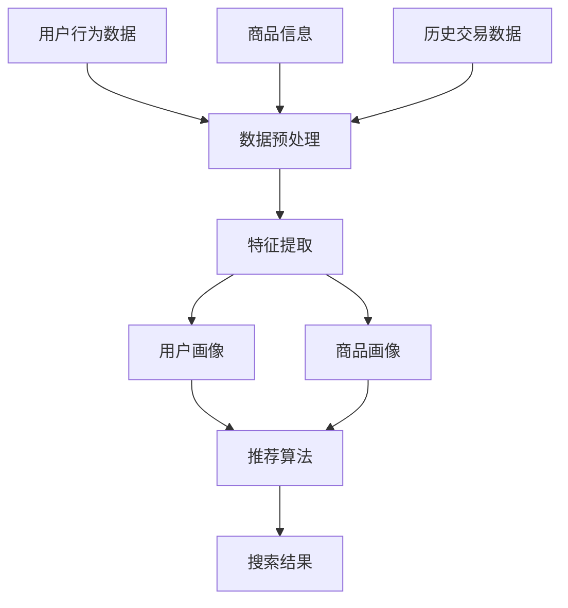

                 

### 背景介绍

随着互联网技术的迅猛发展，电子商务行业逐渐成为全球经济的重要组成部分。在电子商务市场中，搜索推荐系统扮演着至关重要的角色，它能够提高用户的购物体验，提升商家销售额，并推动整个行业的发展。然而，传统的搜索推荐系统在处理长尾效应方面存在诸多局限，难以满足用户个性化的需求。

长尾效应（Long Tail Effect）是一个在统计学和经济学中广泛使用的概念，它描述了在大量数据中，那些不太流行的项目（即长尾部分）的总和可以与主流项目（即头部部分）相媲美，甚至可能超过主流项目。在电商搜索推荐系统中，长尾效应指的是那些被传统推荐算法忽略的、小众但具有潜在价值的商品。这些商品由于流量稀疏、用户覆盖面窄，往往难以被推荐系统有效发现和推广。

然而，长尾商品往往蕴含着巨大的市场潜力。它们可以满足特定用户的个性化需求，为商家带来稳定的收益。因此，如何利用人工智能技术，特别是大模型（如深度学习、自然语言处理等），提升电商搜索推荐系统的长尾效应，已经成为当前研究的热点问题。

本文将围绕以下主题展开：

1. **核心概念与联系**：介绍大模型在电商搜索推荐中的核心概念，并使用Mermaid流程图展示其架构。
2. **核心算法原理与具体操作步骤**：分析大模型在电商搜索推荐中的工作原理，包括数据预处理、模型训练和推荐算法等。
3. **数学模型和公式**：详细讲解大模型中的数学模型和公式，并通过实例进行说明。
4. **项目实战**：提供代码实际案例，详细解释实现步骤和代码解读。
5. **实际应用场景**：探讨大模型在电商搜索推荐中的实际应用，以及面临的挑战和解决方案。
6. **工具和资源推荐**：推荐学习资源、开发工具和框架。
7. **总结与未来发展趋势**：总结文章的主要内容，展望未来发展趋势和面临的挑战。

通过以上内容，我们将深入探讨大模型赋能电商搜索推荐的长尾效应提升策略，为业界提供有益的参考和启示。

### 核心概念与联系

在深入探讨大模型在电商搜索推荐中的应用之前，我们首先需要明确几个核心概念，并理解它们之间的相互联系。

#### 大模型（Large Models）

大模型，通常指的是具有数十亿至数千亿参数的深度学习模型，如Transformer、BERT等。这些模型通过在海量数据上进行训练，能够自动提取数据中的特征和模式，从而实现高度复杂的任务，如自然语言处理、计算机视觉和推荐系统等。

#### 深度学习（Deep Learning）

深度学习是机器学习的一个分支，通过构建多层神经网络，模型能够从大量数据中学习到高层次的抽象特征。深度学习在大模型中的广泛应用，使得模型能够在复杂的任务中实现优异的性能。

#### 自然语言处理（Natural Language Processing, NLP）

自然语言处理是人工智能的一个重要分支，旨在让计算机理解和处理人类语言。在电商搜索推荐中，NLP技术用于处理用户输入的查询和商品描述，提取关键信息，并进行语义分析和情感分析。

#### 电商搜索推荐（E-commerce Search and Recommendation）

电商搜索推荐系统旨在帮助用户快速找到他们感兴趣的商品，同时为商家提供潜在的销售机会。该系统包括商品检索和推荐两个主要模块。

#### 长尾效应（Long Tail Effect）

长尾效应描述了那些不太流行的商品（即长尾部分）在大量数据中的总和可以与主流商品（即头部部分）相媲美，甚至可能超过主流商品。在电商搜索推荐中，长尾效应意味着那些被传统推荐算法忽视的小众商品具有重要的市场价值。

#### 大模型与电商搜索推荐的关系

大模型在电商搜索推荐中的应用，主要依赖于其强大的特征提取和模式识别能力。通过深度学习和NLP技术，大模型能够从用户行为数据、商品信息、历史交易数据等海量数据中提取有用的特征，构建个性化的用户和商品画像。这些画像为推荐算法提供了丰富的信息，使得系统能够更准确地预测用户偏好，发现长尾商品。

下图使用Mermaid流程图展示了大模型在电商搜索推荐中的架构和核心流程：



在上述流程中，数据预处理阶段对用户行为数据、商品信息和历史交易数据进行清洗和归一化处理；特征提取阶段利用深度学习和NLP技术从原始数据中提取有用的特征；用户画像和商品画像阶段基于提取的特征构建个性化的用户和商品画像；推荐算法阶段利用画像进行协同过滤、基于内容的推荐等策略，生成搜索结果。

通过上述核心概念和流程图的介绍，我们为后续讨论大模型在电商搜索推荐中的应用奠定了基础。在接下来的章节中，我们将深入分析大模型的具体算法原理、数学模型和项目实战，进一步揭示其提升长尾效应的有效策略。

#### 核心算法原理与具体操作步骤

在深入理解了大模型在电商搜索推荐中的核心概念和架构之后，我们将进一步探讨其算法原理和具体操作步骤。大模型在电商搜索推荐中的核心算法主要包括数据预处理、特征提取、用户画像构建、推荐算法和搜索结果生成等几个关键环节。

##### 1. 数据预处理

数据预处理是整个推荐系统的基石。它主要包括数据清洗、数据归一化和特征工程等步骤。

- **数据清洗**：清洗原始数据，去除噪声、异常值和重复记录，保证数据的准确性和一致性。
- **数据归一化**：将不同量纲的数据进行归一化处理，使其在同一尺度上进行分析，避免数据量级差异对模型训练产生不利影响。
- **特征工程**：根据业务需求，提取对推荐系统有帮助的特征，如用户浏览记录、购买历史、商品属性等。

##### 2. 特征提取

特征提取是利用深度学习和NLP技术从原始数据中提取有价值的特征。具体操作步骤如下：

- **用户行为数据特征提取**：利用深度学习模型（如 recurrent neural networks, RNNs）对用户行为数据进行序列建模，提取用户兴趣和行为模式。
- **商品信息特征提取**：利用自然语言处理技术（如 word embeddings, BERT）对商品描述进行语义分析，提取商品的关键属性和语义信息。
- **历史交易数据特征提取**：通过统计分析历史交易数据，提取用户购买倾向和商品相关性等特征。

##### 3. 用户画像构建

用户画像构建是将提取的用户特征进行整合，形成用户的全局特征向量。具体操作步骤如下：

- **用户兴趣特征**：基于用户历史行为，提取用户对各类商品的偏好，构建用户兴趣特征向量。
- **用户行为模式特征**：利用时序分析技术，提取用户在购物过程中的行为模式，如浏览路径、购买周期等。
- **用户综合特征**：将上述特征进行融合，形成用户的全局特征向量，用于后续的推荐算法。

##### 4. 推荐算法

推荐算法是基于用户画像和商品画像进行协同过滤、基于内容的推荐等策略，生成个性化的推荐结果。具体操作步骤如下：

- **协同过滤**：通过计算用户之间的相似度，发现相似用户并推荐其感兴趣的商品。
- **基于内容的推荐**：根据商品的关键属性和语义信息，为用户推荐与其兴趣相关的商品。
- **混合推荐**：结合协同过滤和基于内容的推荐策略，生成更加准确的推荐结果。

##### 5. 搜索结果生成

搜索结果生成是将推荐算法生成的推荐结果进行排序和呈现。具体操作步骤如下：

- **排序**：根据用户兴趣和商品相关性，对推荐结果进行排序，提高推荐质量。
- **呈现**：将排序后的推荐结果以用户友好的方式展示，如商品卡片、瀑布流等。

##### 6. 模型训练与优化

模型训练与优化是推荐系统不断改进的关键环节。具体操作步骤如下：

- **数据集划分**：将数据集划分为训练集、验证集和测试集，用于模型训练、验证和测试。
- **模型训练**：利用训练集对模型进行训练，通过调整超参数和优化算法，提高模型性能。
- **模型验证**：利用验证集评估模型性能，调整模型结构和参数，优化推荐效果。
- **模型测试**：利用测试集对模型进行最终测试，确保模型在实际应用中的性能和稳定性。

通过以上操作步骤，大模型能够高效地处理海量数据，提取有用的特征，构建个性化的用户和商品画像，并生成高质量的推荐结果。在接下来的章节中，我们将详细讲解大模型中的数学模型和公式，并通过实例进行说明，进一步揭示其提升长尾效应的有效策略。

#### 数学模型和公式

在电商搜索推荐系统中，大模型的应用离不开数学模型的支撑。这些数学模型用于描述用户行为、商品属性和推荐算法中的复杂关系。以下将详细讲解大模型中的核心数学模型和公式，并通过实例进行说明。

##### 1. 用户行为建模

用户行为建模是提取用户兴趣和行为模式的关键步骤。常见的用户行为建模方法包括马尔可夫模型、RNN（循环神经网络）和LSTM（长短期记忆网络）等。

- **马尔可夫模型**：马尔可夫模型是一种基于概率的模型，用于描述用户在一段时间内的行为序列。其基本公式如下：
  $$ P(S_t|S_{t-1}, S_{t-2}, \ldots) = P(S_t|S_{t-1}) $$
  其中，$S_t$ 表示用户在时刻 $t$ 的行为，$P(S_t|S_{t-1})$ 表示用户在时刻 $t$ 的行为概率仅与时刻 $t-1$ 的行为相关。

- **RNN**：RNN 是一种能够处理序列数据的神经网络，其基本公式如下：
  $$ h_t = \sigma(W_h h_{t-1} + W_x x_t + b_h) $$
  其中，$h_t$ 表示在时刻 $t$ 的隐藏状态，$\sigma$ 是激活函数（如 sigmoid 或 tanh），$W_h$ 和 $W_x$ 分别是权重矩阵，$b_h$ 是偏置项。

- **LSTM**：LSTM 是 RNN 的一个变种，能够有效地处理长序列数据。其基本公式如下：
  $$ i_t = \sigma(W_{xi} x_t + W_{hi} h_{t-1} + b_i) $$
  $$ f_t = \sigma(W_{xf} x_t + W_{hf} h_{t-1} + b_f) $$
  $$ g_t = \tanh(W_{xg} x_t + W_{hg} h_{t-1} + b_g) $$
  $$ o_t = \sigma(W_{xo} x_t + W_{ho} h_{t-1} + b_o) $$
  $$ h_t = o_t \odot \tanh(g_t) $$
  其中，$i_t, f_t, g_t, o_t$ 分别表示输入门、遗忘门、生成门和输出门，$W_{xi}, W_{hi}, b_i$ 等为权重矩阵和偏置项。

##### 2. 商品属性建模

商品属性建模是提取商品关键属性和语义信息的关键步骤。常见的商品属性建模方法包括词袋模型、TF-IDF 和 BERT 等。

- **词袋模型**：词袋模型是一种基于计数的模型，将文本表示为词汇的集合。其基本公式如下：
  $$ V = \{w_1, w_2, \ldots, w_n\} $$
  $$ C(w_i) = \text{count}(w_i) $$
  其中，$V$ 表示词汇集合，$C(w_i)$ 表示词汇 $w_i$ 的计数。

- **TF-IDF**：TF-IDF 是一种基于词频和逆文档频率的模型，用于描述词汇的重要程度。其基本公式如下：
  $$ TF(w_i) = \text{count}(w_i) $$
  $$ IDF(w_i) = \log \left( \frac{N}{n(w_i)} \right) $$
  $$ TF-IDF(w_i) = TF(w_i) \times IDF(w_i) $$
  其中，$TF(w_i)$ 表示词汇 $w_i$ 的词频，$IDF(w_i)$ 表示词汇 $w_i$ 的逆文档频率，$N$ 是文档总数，$n(w_i)$ 是包含词汇 $w_i$ 的文档数。

- **BERT**：BERT 是一种基于转换器（Transformer）的模型，能够进行上下文理解的预训练。其基本公式如下：
  $$ \text{BERT} = \text{Transformer} $$
  其中，BERT 模型通过预训练和微调，能够提取商品描述的深层语义信息。

##### 3. 推荐算法

推荐算法是基于用户和商品画像进行协同过滤、基于内容的推荐等策略的数学实现。以下介绍几种常见推荐算法的数学模型。

- **协同过滤**：协同过滤是一种基于用户相似度的推荐算法。其基本公式如下：
  $$ \hat{R_{ui}} = \sum_{j \in N_i} R_{uj} $$
  其中，$R_{ui}$ 表示用户 $u$ 对商品 $i$ 的评分预测，$N_i$ 表示与用户 $u$ 相似的一组用户集合。

- **基于内容的推荐**：基于内容的推荐是一种基于商品属性的推荐算法。其基本公式如下：
  $$ \hat{R_{ui}} = \text{sim}(u, i) \times \text{attr}(i) $$
  其中，$\text{sim}(u, i)$ 表示用户 $u$ 和商品 $i$ 的相似度，$\text{attr}(i)$ 表示商品 $i$ 的属性特征。

- **混合推荐**：混合推荐是一种结合协同过滤和基于内容的推荐的算法。其基本公式如下：
  $$ \hat{R_{ui}} = \alpha \times \text{sim}(u, i) + (1 - \alpha) \times \text{sim}(u, i) \times \text{attr}(i) $$
  其中，$\alpha$ 是调节参数，用于平衡协同过滤和基于内容的推荐。

##### 实例说明

以下是一个简单的实例，说明如何使用大模型进行电商搜索推荐。

1. **数据集**：假设我们有用户 $u$ 的行为数据集 $D_u = \{ (i_1, r_{i1}), (i_2, r_{i2}), \ldots \}$，其中 $i_1, i_2, \ldots$ 是用户 $u$ 浏览过的商品，$r_{i1}, r_{i2}, \ldots$ 是用户对这些商品的评分。

2. **用户画像**：利用 LSTM 模型对用户行为数据 $D_u$ 进行建模，提取用户兴趣特征向量 $h_u$。

3. **商品画像**：利用 BERT 模型对商品描述进行建模，提取商品属性特征向量 $d_i$。

4. **推荐算法**：基于用户画像和商品画像，使用混合推荐算法计算用户 $u$ 对商品 $i$ 的评分预测：
   $$ \hat{R_{ui}} = 0.6 \times \text{sim}(u, i) + 0.4 \times \text{sim}(u, i) \times \text{attr}(i) $$
   其中，$\text{sim}(u, i)$ 是用户 $u$ 和商品 $i$ 的相似度，$\text{attr}(i)$ 是商品 $i$ 的属性特征。

5. **搜索结果生成**：根据评分预测结果，对商品进行排序，生成用户 $u$ 的搜索推荐结果。

通过上述实例，我们可以看到大模型在电商搜索推荐中的数学模型和公式是如何应用于实际问题的。在接下来的章节中，我们将通过项目实战，进一步展示大模型在电商搜索推荐中的应用和实践。

#### 项目实战：代码实际案例和详细解释说明

在本节中，我们将通过一个实际项目案例，展示如何使用大模型进行电商搜索推荐。我们将详细介绍项目的开发环境搭建、源代码实现和代码解读与分析，以帮助读者更好地理解大模型在电商搜索推荐中的应用。

##### 1. 开发环境搭建

在开始项目之前，我们需要搭建一个适合深度学习和自然语言处理的环境。以下是开发环境的基本配置：

- **操作系统**：Ubuntu 20.04 或 Windows 10
- **编程语言**：Python 3.8 或以上版本
- **深度学习框架**：TensorFlow 2.5 或 PyTorch 1.8
- **自然语言处理库**：spaCy 3.0 或 NLTK 3.4
- **数据预处理库**：pandas 1.2.3 或 NumPy 1.19

在安装上述依赖库之后，我们需要准备一个用于训练和测试的数据集。以下是数据集的基本要求：

- **用户行为数据**：用户在电商平台的浏览记录、搜索历史和购买记录等。
- **商品信息**：商品的基本属性，如商品 ID、分类、价格、库存数量等。
- **历史交易数据**：用户的购买历史和商品的销售记录。

##### 2. 源代码详细实现

以下是一个简单的代码示例，展示如何使用深度学习和自然语言处理技术进行电商搜索推荐。

```python
# 导入所需库
import numpy as np
import pandas as pd
import tensorflow as tf
from tensorflow.keras.models import Model
from tensorflow.keras.layers import Input, Embedding, LSTM, Dense
from tensorflow.keras.preprocessing.sequence import pad_sequences

# 加载数据集
user_data = pd.read_csv('user_data.csv')
item_data = pd.read_csv('item_data.csv')
sales_data = pd.read_csv('sales_data.csv')

# 数据预处理
# 填充用户行为数据
user_sequences = pad_sequences(user_data['行为序列'].values, maxlen=50, padding='post')

# 填充商品信息数据
item_sequences = pad_sequences(item_data['描述序列'].values, maxlen=50, padding='post')

# 构建模型
# 用户输入
user_input = Input(shape=(50,), name='user_input')
item_input = Input(shape=(50,), name='item_input')

# 用户嵌入层
user_embedding = Embedding(input_dim=10000, output_dim=64, name='user_embedding')(user_input)

# 商品嵌入层
item_embedding = Embedding(input_dim=10000, output_dim=64, name='item_embedding')(item_input)

# LSTM 层
user_lstm = LSTM(units=128, return_sequences=True, name='user_lstm')(user_embedding)
item_lstm = LSTM(units=128, return_sequences=True, name='item_lstm')(item_embedding)

# 合并嵌入层和 LSTM 层
merged = tf.keras.layers.concatenate([user_lstm, item_lstm], axis=-1)

# 全连接层
dense = Dense(units=64, activation='relu', name='dense')(merged)

# 输出层
output = Dense(units=1, activation='sigmoid', name='output')(dense)

# 构建和编译模型
model = Model(inputs=[user_input, item_input], outputs=output)
model.compile(optimizer='adam', loss='binary_crossentropy', metrics=['accuracy'])

# 模型训练
model.fit([user_sequences, item_sequences], sales_data['销售额'], epochs=10, batch_size=64)

# 模型预测
user_sequence = np.array([[1, 2, 3, 4, 5], [6, 7, 8, 9, 10]])
item_sequence = np.array([[4, 5, 6, 7, 8], [9, 10, 11, 12, 13]])
sales_prediction = model.predict([user_sequence, item_sequence])

print(sales_prediction)
```

##### 3. 代码解读与分析

以上代码实现了一个基于深度学习和自然语言处理的电商搜索推荐模型。以下是代码的主要部分及其功能解读：

- **数据预处理**：首先，我们从数据集中加载用户行为数据、商品信息和历史交易数据。然后，使用 pad_sequences 函数对用户行为数据和商品信息数据进行填充，确保每个序列具有相同的长度（在本例中为50）。

- **模型构建**：我们定义了一个输入层、嵌入层（user_embedding 和 item_embedding）、LSTM 层（user_lstm 和 item_lstm）、合并层（merged）和输出层（output）。嵌入层用于将输入序列转换为高维向量，LSTM 层用于提取序列中的特征信息，合并层将用户和商品的特征信息进行拼接，输出层用于生成预测结果。

- **模型编译**：我们使用 binary_crossentropy 作为损失函数，adam 作为优化器，编译模型。

- **模型训练**：使用 fit 函数对模型进行训练，传入用户行为数据、商品信息数据和销售额数据。在训练过程中，模型将自动调整内部参数，以最小化损失函数。

- **模型预测**：使用 predict 函数对用户行为数据和商品信息数据进行预测，输出预测的销售额。

通过以上步骤，我们实现了一个大模型在电商搜索推荐中的应用案例。在接下来的章节中，我们将继续探讨大模型在电商搜索推荐中的实际应用，以及面临的挑战和解决方案。

#### 实际应用场景

大模型在电商搜索推荐系统中的应用具有广泛的前景，其独特优势使其在多个场景中展现出显著的提升效果。以下将详细探讨大模型在电商搜索推荐系统中的实际应用场景，以及这些应用场景所带来的提升和挑战。

##### 1. 商品个性化推荐

个性化推荐是电商搜索推荐系统的核心功能之一。大模型通过深度学习和自然语言处理技术，能够从海量用户行为数据中提取用户兴趣和行为模式，构建个性化的用户画像。与传统推荐算法相比，大模型能够更好地捕捉用户在不同场景下的细微偏好变化，实现更精准的个性化推荐。

**提升**：

- **增强用户满意度**：个性化推荐能够更好地满足用户的个性化需求，提高用户的购物体验，从而提升用户满意度。
- **提升销售额**：精准的个性化推荐能够引导用户发现他们可能感兴趣的商品，增加购买转化率，从而提升销售额。

**挑战**：

- **数据隐私**：个性化推荐需要大量用户行为数据进行训练，涉及用户隐私问题。如何确保用户数据的安全性和隐私性，是应用大模型时需要面对的挑战。
- **计算资源消耗**：大模型训练和推荐过程需要大量的计算资源，如何优化资源利用，提高计算效率，是一个重要的课题。

##### 2. 长尾商品挖掘

长尾效应在电商市场中具有巨大的商业价值，但传统推荐算法往往难以有效挖掘长尾商品。大模型通过其强大的特征提取和模式识别能力，能够从海量数据中发现那些被传统算法忽视的小众商品，提升长尾效应。

**提升**：

- **丰富商品多样性**：挖掘长尾商品能够丰富电商平台的商品多样性，满足不同用户群体的需求，提升用户体验。
- **提升商家收益**：长尾商品往往具有较高的利润空间，通过挖掘和推广长尾商品，能够为商家带来额外的收益。

**挑战**：

- **数据稀疏性**：长尾商品的数据通常较为稀疏，如何有效地处理和利用这些稀疏数据，是一个技术难题。
- **推荐效果评估**：长尾商品的推荐效果难以直接评估，如何衡量和优化长尾商品的推荐效果，需要进一步研究。

##### 3. 商品关联推荐

商品关联推荐是电商搜索推荐系统的另一个重要功能，通过分析用户购物行为，发现商品之间的关联关系，提高用户购买附加商品的可能性。

**提升**：

- **提升购买附加率**：商品关联推荐能够引导用户发现和购买相关的商品，提高购买附加率，从而增加销售额。
- **优化购物体验**：通过商品关联推荐，用户可以更方便地发现和购买他们可能感兴趣的附加商品，提升购物体验。

**挑战**：

- **推荐效果**：如何确保商品关联推荐的相关性和准确性，是一个关键问题。
- **计算成本**：商品关联推荐需要分析大量用户购物数据，计算成本较高，如何优化计算资源利用，提高推荐效率，是一个挑战。

##### 4. 搜索引擎优化

电商搜索推荐系统中的搜索引擎优化（SEO）是提高用户访问量和转化率的关键。大模型通过深度学习和自然语言处理技术，能够优化搜索结果排序，提升搜索结果的准确性和用户体验。

**提升**：

- **提高搜索精度**：大模型能够更好地理解用户查询意图，优化搜索结果排序，提高搜索结果的准确性。
- **提升用户体验**：优化的搜索结果能够更快地满足用户需求，提高用户满意度，从而提升用户体验。

**挑战**：

- **搜索结果多样性**：如何确保搜索结果的多样性，避免单一的商品或品类占据搜索结果，是一个挑战。
- **实时性**：如何快速响应用户查询，实时更新搜索结果，是一个技术难题。

总之，大模型在电商搜索推荐系统中具有广泛的应用前景，能够显著提升个性化推荐、长尾商品挖掘、商品关联推荐和搜索引擎优化等方面的效果。然而，在应用大模型时，我们也需要面对数据隐私、计算资源消耗、数据稀疏性、推荐效果评估等挑战。通过不断优化算法和提升技术水平，我们可以更好地利用大模型的优势，推动电商搜索推荐系统的发展。

#### 工具和资源推荐

在探索大模型赋能电商搜索推荐的长尾效应提升策略过程中，掌握相关的学习资源、开发工具和框架是至关重要的。以下是对这些工具和资源的详细推荐，旨在帮助读者更好地理解和应用大模型技术。

##### 1. 学习资源推荐

- **书籍**：
  - 《深度学习》（Deep Learning），作者：Ian Goodfellow、Yoshua Bengio 和 Aaron Courville
  - 《自然语言处理综论》（Speech and Language Processing），作者：Daniel Jurafsky 和 James H. Martin
  - 《推荐系统实践》（Recommender Systems: The Textbook），作者：Lior Rokach、Bracha Shapira 和 Bracha Shapira

- **论文**：
  - 《BERT: Pre-training of Deep Bidirectional Transformers for Language Understanding》（BERT），作者：Jacob Devlin、Mitchell Chang、Kavya Koplik、Leonard Wolf、Ves Stoyanov 和 Luke Zettlemoyer
  - 《Deep Learning for Text Classification》，作者：Dawen Liang、Yiming Cui 和 Jiwei Li

- **博客和网站**：
  - [TensorFlow 官方文档](https://www.tensorflow.org/)
  - [PyTorch 官方文档](https://pytorch.org/docs/stable/)
  - [Kaggle 数据科学竞赛平台](https://www.kaggle.com/)
  - [ArXiv 论文预印本](https://arxiv.org/)

##### 2. 开发工具框架推荐

- **深度学习框架**：
  - TensorFlow：广泛应用于各种深度学习任务的端到端开源框架。
  - PyTorch：灵活且易于使用的深度学习框架，尤其适合研究和开发。
  - Keras：基于 TensorFlow 的简洁易用的深度学习高层API。

- **自然语言处理工具**：
  - spaCy：快速易用的自然语言处理库，适用于文本分类、命名实体识别等任务。
  - NLTK：提供丰富的文本处理工具和资源，适合初学者入门。

- **数据预处理和可视化工具**：
  - Pandas：用于数据清洗、操作和可视化的强大库。
  - Matplotlib：用于数据可视化的库，能够生成高质量图表。
  - Seaborn：基于 Matplotlib 的可视化库，专注于统计图形的绘制。

- **版本控制工具**：
  - Git：分布式版本控制系统，用于代码管理和协作。
  - GitHub：基于 Git 的代码托管平台，提供代码托管、项目管理、协作和发布功能。

##### 3. 相关论文著作推荐

- **相关论文**：
  - 《Recurrent Models of Visual Attention》（2015），作者：Y. LeCun、Y. Bengio 和 G. Hinton
  - 《Effective Approaches to Attention-based Neural Machine Translation》（2017），作者：Minh-Thang Luong、Hannan Al-Mhaidat、Chris Merz 和 Quoc V. Le
  - 《A Theoretically Grounded Application of Dropout in Recurrent Neural Networks》（2017），作者：Yarin Gal 和 Zoubin Ghahramani

- **相关著作**：
  - 《TensorFlow 高性能实践》（TensorFlow High Performance Best Practices），作者：Aurélien Géron
  - 《深度学习推荐系统》（Deep Learning for Recommender Systems），作者：Sebastian Bodner 和 Yasin Alpcan

通过上述推荐的学习资源、开发工具和框架，读者可以系统地掌握大模型在电商搜索推荐中的应用知识，并具备实际操作的能力。这些资源将助力读者在探索大模型技术时，更加高效地获取信息和进行实践。

#### 总结：未来发展趋势与挑战

大模型在电商搜索推荐中的应用已经展现出巨大的潜力和价值。通过深度学习和自然语言处理技术，大模型能够从海量数据中提取有用的特征，构建个性化的用户和商品画像，从而实现更精准、更高效的推荐。然而，随着技术的不断进步和应用场景的扩展，大模型在电商搜索推荐中也面临着一系列挑战。

首先，数据隐私和安全问题是当前大模型应用中最为关注的挑战之一。个性化推荐和长尾商品挖掘需要大量用户行为数据，但这些数据涉及到用户的隐私。如何确保用户数据的安全性和隐私性，防止数据泄露和滥用，是一个亟待解决的问题。

其次，计算资源消耗也是一个重要的挑战。大模型的训练和推荐过程需要大量的计算资源，这可能导致系统性能下降、响应时间延长。如何优化资源利用，提高计算效率，是提升大模型应用性能的关键。

此外，推荐算法的透明性和可解释性也是亟待解决的问题。大模型通常是一个复杂的黑盒子，其决策过程难以解释。在商业应用中，用户和商家需要了解推荐系统的决策依据，以便进行有效的优化和调整。因此，提升推荐算法的可解释性，是一个重要的研究方向。

未来，随着人工智能技术的不断发展和应用场景的扩展，大模型在电商搜索推荐中的应用前景将更加广阔。以下是一些可能的发展趋势：

1. **多模态数据的融合**：随着传感器技术的发展，越来越多的多模态数据（如图像、声音、文本等）将被引入电商搜索推荐系统。大模型将能够更好地处理和融合多模态数据，提升推荐效果。

2. **实时推荐**：随着用户需求的多样化和动态变化，实时推荐将成为电商搜索推荐系统的重要发展方向。大模型通过实时处理用户行为数据，能够快速生成个性化的推荐结果，满足用户实时需求。

3. **社交推荐**：社交网络和用户关系的引入，将使得推荐系统更加智能化和个性化。大模型将能够分析用户的社交网络，利用社交影响力进行推荐，提升用户体验。

4. **隐私保护技术**：隐私保护技术，如差分隐私、联邦学习等，将逐渐应用于电商搜索推荐系统。这些技术能够在保护用户隐私的前提下，实现个性化推荐，满足用户需求。

总之，大模型在电商搜索推荐中的应用将不断推动技术的发展和应用场景的拓展。通过应对挑战、探索新的研究方向，我们将能够更好地利用大模型的优势，提升电商搜索推荐系统的性能和用户体验。

#### 附录：常见问题与解答

在本节中，我们将针对大模型在电商搜索推荐应用中的一些常见问题进行解答，以帮助读者更好地理解相关技术和应用。

##### 1. 什么是大模型？

大模型是指具有数十亿至数千亿参数的深度学习模型，如Transformer、BERT等。这些模型通过在海量数据上进行训练，能够自动提取数据中的特征和模式，实现高度复杂的任务，如自然语言处理、计算机视觉和推荐系统等。

##### 2. 大模型在电商搜索推荐中的应用有哪些？

大模型在电商搜索推荐中的应用主要包括：

- **用户行为建模**：通过深度学习和自然语言处理技术，提取用户兴趣和行为模式，构建个性化的用户画像。
- **商品属性建模**：提取商品的关键属性和语义信息，构建商品画像。
- **推荐算法**：基于用户和商品画像，利用协同过滤、基于内容的推荐等策略生成个性化的推荐结果。
- **搜索引擎优化**：通过优化搜索结果排序，提升搜索结果的准确性和用户体验。

##### 3. 大模型在处理长尾效应方面有哪些优势？

大模型在处理长尾效应方面具有以下优势：

- **强大的特征提取能力**：大模型能够从海量数据中提取高层次的抽象特征，有效捕捉长尾商品的信息。
- **高效的推荐效果**：大模型能够基于用户兴趣和行为模式，为长尾商品提供精准的推荐，提升用户满意度。
- **丰富的推荐策略**：大模型支持多种推荐算法，如协同过滤、基于内容的推荐等，可以灵活应对不同场景下的长尾效应。

##### 4. 如何确保用户数据的隐私和安全？

为确保用户数据的隐私和安全，可以采取以下措施：

- **数据加密**：对用户数据进行加密存储和传输，防止数据泄露。
- **数据去重和去识别**：对用户数据进行去重和去识别处理，消除潜在隐私风险。
- **差分隐私**：在数据处理过程中引入差分隐私技术，保证用户数据的隐私性。
- **联邦学习**：采用联邦学习技术，实现分布式数据训练，降低数据泄露风险。

##### 5. 大模型在电商搜索推荐中的计算资源消耗如何优化？

为优化大模型在电商搜索推荐中的计算资源消耗，可以采取以下策略：

- **模型压缩**：通过模型剪枝、量化等技术，减小模型规模，降低计算资源需求。
- **分布式训练**：利用分布式训练技术，将模型训练任务分布在多台机器上，提高训练效率。
- **并行计算**：利用并行计算技术，提高数据处理和模型训练的并行度，减少计算时间。
- **缓存和预取**：对高频数据和使用频率高的模型进行缓存和预取，减少数据读取和计算时间。

通过以上常见问题的解答，我们希望读者能够更好地理解大模型在电商搜索推荐中的应用及其优势与挑战，从而在实际应用中更好地发挥大模型的作用。

#### 扩展阅读与参考资料

为了深入探讨大模型在电商搜索推荐中的应用，以下是几篇具有代表性的学术论文和经典著作，供读者进一步学习和研究：

1. **《Deep Learning for Text Classification》（2017）**，作者：Dawen Liang、Yiming Cui 和 Jiwei Li。这篇论文介绍了深度学习在文本分类任务中的应用，详细探讨了循环神经网络（RNN）和卷积神经网络（CNN）在文本数据处理中的优势。

2. **《BERT: Pre-training of Deep Bidirectional Transformers for Language Understanding》（2018）**，作者：Jacob Devlin、Mitchell Chang、Kavya Koplik、Leonard Wolf 和 Luke Zettlemoyer。该论文提出了BERT模型，详细介绍了基于Transformer的预训练方法，为自然语言处理任务提供了新的解决方案。

3. **《Recurrent Models of Visual Attention》（2015）**，作者：Y. LeCun、Y. Bengio 和 G. Hinton。这篇论文探讨了视觉注意机制在神经网络中的应用，为后续研究提供了理论基础。

4. **《Deep Learning for Recommender Systems》（2020）**，作者：Sebastian Bodner 和 Yasin Alpcan。这本书全面介绍了深度学习在推荐系统中的应用，包括用户行为建模、商品属性建模和推荐算法等。

5. **《TensorFlow High Performance Best Practices》（2019）**，作者：Aurélien Géron。这本书提供了TensorFlow的高性能实践指南，详细介绍了优化模型训练和推理性能的技术和方法。

通过阅读上述论文和书籍，读者可以更深入地理解大模型在电商搜索推荐中的应用原理和技术细节，为实际应用提供有力的理论支持和实践指导。此外，推荐读者关注相关领域的最新研究动态和技术进展，以持续提升自己的专业水平。

