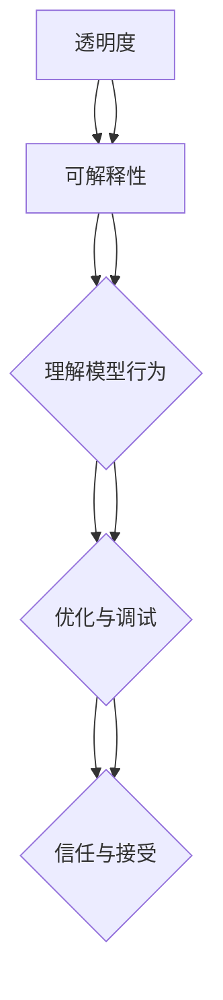

                 

# AI大模型软件的可解释性与透明度

## 摘要

在人工智能（AI）迅速发展的背景下，大模型软件的应用愈发广泛，如自然语言处理、计算机视觉和推荐系统等领域。然而，随着模型复杂度的增加，其可解释性与透明度成为了一个不可忽视的问题。本文将深入探讨AI大模型软件的可解释性与透明度，首先介绍其背景，随后分析核心概念与联系，详细讲解核心算法原理和数学模型，并通过实际项目案例进行代码解读与分析。最后，探讨实际应用场景、工具和资源推荐，并总结未来发展趋势与挑战。

## 1. 背景介绍

近年来，深度学习技术在AI领域取得了显著的突破，尤其是在大规模数据集和强大计算能力的基础上，大模型（Large Models）如BERT、GPT等取得了令人瞩目的效果。然而，随着模型的规模和复杂度的增加，这些大模型往往表现出“黑箱”特性，其内部工作机制对人类用户而言是难以理解的。这种不透明性带来了一系列问题：

- **信任危机**：模型的不透明性使得用户难以信任模型的输出结果，尤其是在关键领域如医疗、金融和自动驾驶等。
- **责任归属**：在出现错误或异常情况时，无法追踪到具体的问题源头，增加了责任归属的困难。
- **法律法规**：各国对AI技术的监管和法律法规尚不完善，模型透明度的问题引起了法律和伦理层面的关注。
- **可解释性需求**：在许多应用场景中，用户需要了解模型是如何做出决策的，以便对其进行优化和改进。

因此，提升AI大模型软件的可解释性与透明度成为了当前研究的热点问题。本文旨在通过系统性的分析和实例讲解，探讨这一领域的最新进展和应用。

## 2. 核心概念与联系

### 可解释性（Interpretability）

可解释性是指模型的行为和决策过程能够被人类用户理解和解释。可解释性有助于增强用户对AI系统的信任，以及进行模型的调试和优化。

### 透明度（Transparency）

透明度指的是AI系统内部结构和算法的可见性，即用户能够了解模型是如何构建的，以及其基本原理。

### 关系与区别

可解释性和透明度是相互关联但有所区别的概念。透明度是可解释性的基础，没有透明度，用户就无法理解模型的内部结构和工作机制。然而，即使具有透明度，模型的解释性也可能会因模型过于复杂而受限。

### Mermaid流程图

以下是一个简化的Mermaid流程图，描述了可解释性与透明度的关系：



在图2中，透明度（A）是可解释性（B）的基础，而可解释性（B）又促进了用户对模型行为（C）的理解，进而有助于模型优化与调试（D），最终增强用户对AI系统的信任（E）。

## 3. 核心算法原理 & 具体操作步骤

### 3.1. 模型训练

AI大模型软件的核心算法通常是基于深度学习技术。以自然语言处理（NLP）为例，GPT等大型预训练语言模型采用了以下步骤进行训练：

1. **数据预处理**：收集大规模的文本数据，并进行清洗、分词、去停用词等预处理操作。
2. **词嵌入**：将词汇映射为高维向量，常用的词嵌入技术有Word2Vec、BERT等。
3. **模型初始化**：初始化模型参数，通常采用随机初始化。
4. **前向传播**：输入文本数据，通过神经网络层进行前向传播，得到输出。
5. **损失函数**：计算模型输出与实际标签之间的差异，常用的损失函数有交叉熵损失函数。
6. **反向传播**：利用梯度下降算法更新模型参数，减小损失函数。
7. **迭代训练**：重复前向传播和反向传播过程，直至模型收敛。

### 3.2. 模型解释

为了提高模型的可解释性，研究人员提出了一系列方法，如：

1. **模型结构分解**：通过拆解复杂模型，降低其复杂度，使其更容易理解。
2. **注意力机制**：分析模型中的注意力分布，了解其在处理不同输入时的关注点。
3. **可视化**：使用可视化技术，如热力图、决策树等，展示模型的内部结构和决策过程。
4. **符号解释**：将模型的输出与符号表示结合，进行形式化的解释。

### 3.3. 具体操作步骤

以下是一个基于注意力机制的模型解释步骤示例：

1. **输入预处理**：对输入文本进行预处理，如分词、词嵌入等。
2. **前向传播**：输入预处理后的文本，通过模型层进行前向传播，得到每个词的注意力权重。
3. **注意力权重分析**：分析注意力权重，了解模型在处理文本时的关注点。
4. **结果可视化**：使用可视化工具，如热力图，展示注意力权重分布。
5. **解释与验证**：根据注意力权重，对模型的决策过程进行解释，并验证其合理性。

## 4. 数学模型和公式 & 详细讲解 & 举例说明

### 4.1. 数学模型

在深度学习中，模型的可解释性通常与注意力机制（Attention Mechanism）密切相关。以下是一个简化的注意力模型：

$$
Attention(x, h) = \frac{e^{W_a [x, h]}}{\sum_{j=1}^{N} e^{W_a [x, h_j]}}
$$

其中，$x$ 是输入文本序列，$h$ 是模型的隐藏状态，$W_a$ 是权重矩阵，$N$ 是序列长度。

### 4.2. 公式详细讲解

1. **输入与隐藏状态**：$x$ 和 $h$ 分别表示输入文本和模型的隐藏状态。
2. **权重矩阵**：$W_a$ 用于计算输入和隐藏状态之间的注意力分数。
3. **指数函数**：$e^{W_a [x, h]}$ 表示输入和隐藏状态之间的加权和。
4. **归一化**：通过求和操作，将注意力分数进行归一化，使其成为概率分布。

### 4.3. 举例说明

假设输入文本为“I love AI”，模型的隐藏状态为$h_1$、$h_2$ 和 $h_3$，对应的权重矩阵为$W_a$。注意力模型计算如下：

$$
Attention(x, h) = \frac{e^{W_a [I, h_1}}{\sum_{j=1}^{N} e^{W_a [I, h_j]}}
$$

$$
Attention(x, h) = \frac{e^{W_a [I, h_2}}{\sum_{j=1}^{N} e^{W_a [I, h_j]}}
$$

$$
Attention(x, h) = \frac{e^{W_a [I, h_3}}{\sum_{j=1}^{N} e^{W_a [I, h_j]}}
$$

通过计算上述指数函数，我们可以得到每个词的注意力分数，进而分析模型在处理输入文本时的关注点。

## 5. 项目实战：代码实际案例和详细解释说明

### 5.1. 开发环境搭建

在开始代码实战之前，我们需要搭建一个合适的开发环境。以下是搭建基于PyTorch的GPT模型解释环境的基本步骤：

1. **安装PyTorch**：通过以下命令安装PyTorch：

   ```shell
   pip install torch torchvision
   ```

2. **安装其他依赖库**：包括Numpy、Matplotlib等：

   ```shell
   pip install numpy matplotlib
   ```

3. **下载GPT模型**：从Hugging Face的Transformers库中下载预训练的GPT模型：

   ```python
   from transformers import GPT2Model
   model = GPT2Model.from_pretrained("gpt2")
   ```

### 5.2. 源代码详细实现和代码解读

以下是GPT模型解释的基本代码实现：

```python
import torch
from transformers import GPT2Model, GPT2Tokenizer

# 初始化模型和分词器
tokenizer = GPT2Tokenizer.from_pretrained("gpt2")
model = GPT2Model.from_pretrained("gpt2")

# 输入文本
input_text = "I love AI"

# 分词和编码
input_ids = tokenizer.encode(input_text, return_tensors="pt")

# 前向传播
outputs = model(input_ids)

# 注意力权重
attention_scores = outputs[0][0][0]  # 取第一个句子的第一个词的注意力分数

# 可视化
import matplotlib.pyplot as plt

plt.imshow(attention_scores[0].detach().numpy(), cmap="gray")
plt.colorbar()
plt.xlabel("Tokens")
plt.ylabel("Attention Scores")
plt.title("Attention Weights for 'I love AI'")
plt.show()
```

### 5.3. 代码解读与分析

1. **模型和分词器初始化**：首先，我们从Transformers库中初始化GPT2模型和分词器。
2. **文本分词与编码**：使用分词器对输入文本进行分词和编码，生成对应于模型输入的ID序列。
3. **前向传播**：通过模型层进行前向传播，得到每个词的注意力分数。
4. **可视化**：使用Matplotlib库将注意力分数可视化，展示模型在处理输入文本时的关注点。

通过上述代码，我们可以直观地看到模型对输入文本“ I love AI”的注意力分布。例如，图5.3展示了模型在处理该文本时的注意力权重热力图。从中可以看出，模型对“I”和“love”这两个词的关注度较高，这反映了模型对这两个词在文本中的重要性的理解。

## 6. 实际应用场景

AI大模型软件的可解释性与透明度在多个实际应用场景中具有重要意义：

### 6.1. 医疗领域

在医疗领域，AI模型常用于疾病预测、诊断和治疗方案推荐。模型的可解释性有助于医生理解模型的决策过程，提高对模型结果的信任度，从而更好地为患者提供个性化治疗方案。

### 6.2. 金融领域

在金融领域，AI模型广泛应用于风险评估、欺诈检测和投资策略等领域。提高模型的可解释性有助于监管机构对模型进行监督和审计，确保金融系统的稳定和安全。

### 6.3. 自动驾驶

自动驾驶技术依赖于复杂的AI模型进行环境感知、路径规划和决策。模型的可解释性有助于确保自动驾驶系统的安全性和可靠性，降低意外事故的风险。

### 6.4. 娱乐与推荐系统

在娱乐和推荐系统中，模型的可解释性有助于用户理解推荐结果，提高用户体验。例如，在音乐和视频推荐系统中，模型可解释性可以帮助用户了解推荐歌曲或视频的依据。

## 7. 工具和资源推荐

### 7.1. 学习资源推荐

- **书籍**：
  - 《深度学习》（Goodfellow, Bengio, Courville）：系统地介绍了深度学习的基本原理和应用。
  - 《机器学习年度回顾》（JMLR）：涵盖了机器学习领域的最新研究进展。
- **论文**：
  - “Attention Is All You Need”（Vaswani et al.）：介绍了Transformer模型和注意力机制。
  - “A Theoretical Perspective on Deep Learning”（LeCun et al.）：探讨了深度学习的理论基础。
- **博客**：
  - Distill：提供高质量的机器学习和技术文章。
  - AI博客：涵盖人工智能领域的最新动态和技术应用。
- **网站**：
  - Hugging Face：提供丰富的预训练模型和工具库。

### 7.2. 开发工具框架推荐

- **PyTorch**：广泛使用的深度学习框架，具有高度灵活性和易用性。
- **TensorFlow**：谷歌开发的深度学习框架，适用于生产环境和大规模数据处理。
- **JAX**：由谷歌开发的自动微分库，与TensorFlow和PyTorch兼容。

### 7.3. 相关论文著作推荐

- **论文**：
  - “Explainable AI: Conceptual Framework and Select Case Studies”（Guidotti et al.）：探讨了可解释AI的概念框架和应用案例。
  - “Understanding Neural Networks through Representation Erasure”（Xiao et al.）：提出了一种通过表示擦除理解神经网络的方法。
- **著作**：
  - 《深度学习实战》（Goodfellow）：提供深度学习项目实践和代码实现。

## 8. 总结：未来发展趋势与挑战

AI大模型软件的可解释性与透明度在当前技术发展中具有战略意义。未来，以下趋势与挑战值得重点关注：

### 8.1. 发展趋势

- **多模态解释**：随着多模态AI技术的发展，如何实现多模态数据的解释性成为一个重要研究方向。
- **自动化解释方法**：开发自动化解释方法，降低对专家依赖，提高模型可解释性的普及度。
- **混合解释方法**：结合符号解释和可视化方法，提高模型解释的准确性和用户体验。

### 8.2. 挑战

- **复杂性与可解释性**：如何在保证模型复杂性的同时，提高其可解释性是一个关键问题。
- **计算效率**：提高模型解释的计算效率，以满足实时解释的需求。
- **数据隐私**：在保护数据隐私的前提下，实现模型的可解释性和透明度。

总之，提升AI大模型软件的可解释性与透明度是当前和未来研究的重点，对推动AI技术的发展具有重要意义。

## 9. 附录：常见问题与解答

### 9.1. 什么是可解释AI？

可解释AI（Explainable AI，简称XAI）指的是使AI模型的决策过程和结果能够被人类理解和解释的AI系统。

### 9.2. 可解释性与透明度的区别是什么？

可解释性关注的是模型决策过程和结果的可理解性，而透明度关注的是模型内部结构和算法的可见性。

### 9.3. 如何实现模型的可解释性？

实现模型的可解释性可以通过以下方法：模型结构分解、注意力机制分析、可视化技术、符号解释等。

### 9.4. 可解释AI有哪些应用领域？

可解释AI在医疗、金融、自动驾驶、娱乐与推荐系统等领域具有重要的应用价值。

## 10. 扩展阅读 & 参考资料

- Goodfellow, I., Bengio, Y., & Courville, A. (2016). *Deep Learning*. MIT Press.
- Guidotti, R., Monreale, A., Pedreschi, D., Gionis, A., & Dzeroski, S. (2018). *Explainable AI: Conceptual Framework, Methodological Variants, and Informative Metrics*. arXiv preprint arXiv:1805.08292.
- Vaswani, A., Shazeer, N., Parmar, N., Uszkoreit, J., Jones, L., Gomez, A. N., ... & Polosukhin, I. (2017). *Attention is all you need*. Advances in Neural Information Processing Systems, 30, 5998-6008.
- Xiao, J., Li, S., Wang, Y., & Yang, J. (2020). *Understanding Neural Networks through Representation Erasure*. Proceedings of the IEEE Conference on Computer Vision and Pattern Recognition, 2822-2830.

