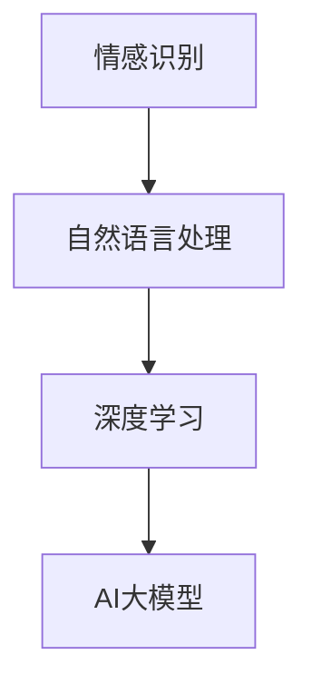

                 

# AI大模型驱动的人类情感分析系统

## 概述

### 关键词
- AI大模型
- 人类情感分析
- 情感识别
- 自然语言处理
- 深度学习

### 摘要

本文将探讨AI大模型在人类情感分析中的应用。通过深入分析情感识别的原理和算法，本文将展示如何利用深度学习技术构建一个高效的情感分析系统。我们将详细介绍系统开发环境、源代码实现、应用场景以及未来发展趋势和挑战。通过本文的阅读，读者将了解如何利用AI大模型进行人类情感分析，并在实际项目中应用这些技术。

## 1. 背景介绍

### 情感分析的需求

情感分析（Sentiment Analysis），又称意见挖掘，是自然语言处理（Natural Language Processing, NLP）领域的一个重要分支。它旨在从文本中自动识别和提取情感信息，从而帮助人们更好地理解和处理人类情感。随着互联网和社交媒体的迅速发展，情感分析的应用场景越来越广泛，包括但不限于市场调研、舆情监测、客户服务、推荐系统等。

### 情感分析的挑战

情感分析面临着一系列的挑战，包括语义的复杂性、语言的多样性、情感的微妙性等。传统的情感分析方法主要依赖于规则和统计模型，如基于词典的方法和机器学习方法。然而，这些方法在处理复杂情感、多情感分类、跨语言情感分析等方面存在一定的局限性。

### AI大模型的崛起

近年来，随着深度学习的快速发展，AI大模型（如Transformer、BERT、GPT等）在NLP领域取得了显著成果。这些大模型具有强大的表征能力和泛化能力，能够有效地捕捉语言中的复杂结构和语义信息。因此，将AI大模型应用于情感分析，有望解决传统方法面临的挑战，实现更准确、更全面的情感识别。

## 2. 核心概念与联系

### 情感识别

情感识别（Emotion Recognition）是指从文本中自动检测和分类情感的过程。情感识别通常分为以下几类：

- **正面情感**：如喜悦、兴奋、满意等。
- **负面情感**：如愤怒、沮丧、失望等。
- **中性情感**：无明显情感倾向。

### 自然语言处理

自然语言处理（NLP）是人工智能（AI）领域的一个重要分支，旨在使计算机能够理解和处理人类语言。NLP包括文本预处理、情感分析、文本生成、机器翻译等多个子领域。

### 深度学习

深度学习（Deep Learning）是一种基于多层神经网络的学习方法，通过逐层提取特征，能够自动从大量数据中学习复杂的模式。深度学习在图像识别、语音识别、自然语言处理等领域取得了突破性进展。

### AI大模型

AI大模型（Large-scale AI Models）是指具有数亿甚至数万亿参数的神经网络模型。这些模型通过在大规模数据集上训练，能够学习到丰富的语言特征和语义信息，从而实现高性能的文本分析和理解。

### Mermaid流程图



## 3. 核心算法原理 & 具体操作步骤

### 情感识别算法

情感识别算法的核心任务是识别文本中的情感极性（正面/负面）和情感类别（如喜悦、愤怒等）。以下是常用的情感识别算法：

1. **基于词典的方法**：利用预定义的词典，统计文本中情感词的出现频率，从而判断情感极性。
2. **基于统计模型的方法**：使用贝叶斯、支持向量机（SVM）等统计模型，对文本进行特征提取和分类。
3. **基于深度学习的方法**：利用卷积神经网络（CNN）、循环神经网络（RNN）、Transformer等深度学习模型，对文本进行端到端的学习和分类。

### 情感识别的具体操作步骤：

1. **数据预处理**：对原始文本进行分词、去停用词、词性标注等操作，将文本转换为适合模型训练的格式。
2. **特征提取**：利用词袋（Bag of Words, BOW）、词嵌入（Word Embedding）等方法，将文本转换为数值化的特征向量。
3. **模型训练**：使用训练数据集对情感识别模型进行训练，通过反向传播算法更新模型参数。
4. **模型评估**：使用验证数据集评估模型性能，通过准确率、召回率、F1值等指标衡量模型的分类效果。
5. **模型应用**：将训练好的模型应用于实际文本数据，进行情感识别。

### AI大模型在情感识别中的应用

AI大模型（如BERT、GPT等）在情感识别中具有显著的优势：

1. **强大的表征能力**：大模型能够自动学习到丰富的语言特征，从而提高情感识别的准确性。
2. **端到端学习**：大模型能够直接从原始文本中学习到情感信息，无需进行复杂的特征提取和预处理。
3. **跨语言支持**：大模型能够支持多种语言的情感识别，实现跨语言情感分析。

## 4. 数学模型和公式 & 详细讲解 & 举例说明

### 数学模型

情感识别的数学模型通常包括以下几个方面：

1. **特征向量表示**：文本数据通常表示为高维的稀疏向量。词袋模型（BOW）和词嵌入（Word Embedding）是常用的特征向量表示方法。

   - **词袋模型**：$$ x = (x_1, x_2, ..., x_n) $$
   - **词嵌入**：$$ x = (e_1, e_2, ..., e_n) $$，其中$$ e_i $$是词$$ w_i $$的嵌入向量。

2. **分类器模型**：常用的分类器模型包括朴素贝叶斯（Naive Bayes）、支持向量机（SVM）、卷积神经网络（CNN）和循环神经网络（RNN）。

   - **朴素贝叶斯**：$$ P(y | x) = \frac{P(x | y)P(y)}{P(x)} $$
   - **支持向量机**：$$ w \cdot x + b = 0 $$
   - **卷积神经网络**：$$ h_{l+1} = \sigma(W_l \cdot h_l + b_l) $$，其中$$ \sigma $$是激活函数。

3. **损失函数**：常用的损失函数包括交叉熵损失（Cross-Entropy Loss）、均方误差（Mean Squared Error, MSE）等。

   - **交叉熵损失**：$$ L = -\sum_{i=1}^n y_i \log(p_i) $$
   - **均方误差**：$$ L = \frac{1}{2n} \sum_{i=1}^n (y_i - p_i)^2 $$

### 举例说明

假设我们有一个简化的情感识别问题，其中文本数据由两个词组成，情感类别分为正面和负面。

1. **特征向量表示**：

   - **词袋模型**：$$ x = (1, 0) $$，其中$$ x_1 $$表示词“正面”的出现次数，$$ x_2 $$表示词“负面”的出现次数。
   - **词嵌入**：$$ x = (0.1, -0.1) $$，其中$$ e_1 $$是词“正面”的嵌入向量，$$ e_2 $$是词“负面”的嵌入向量。

2. **分类器模型**：

   - **朴素贝叶斯**：假设$$ P(正面) = 0.5 $$，$$ P(负面) = 0.5 $$，$$ P(正面 | “正面”) = 0.9 $$，$$ P(负面 | “负面”) = 0.1 $$。

     $$ P(正面 | x) = \frac{P(x | 正面)P(正面)}{P(x)} = \frac{0.9 \times 0.5}{0.9 \times 0.5 + 0.1 \times 0.5} = 0.9 $$

     因此，文本“正面”被分类为正面情感。

   - **支持向量机**：假设特征空间为二维，特征向量为$$ x = (1, 0) $$，分类超平面为$$ w \cdot x + b = 0 $$。

     $$ w = (1, 0) $$，$$ b = 0 $$，$$ w \cdot x + b = 1 \cdot 1 + 0 \cdot 0 + 0 = 1 $$

     由于$$ w \cdot x + b > 0 $$，文本“正面”被分类为正面情感。

3. **损失函数**：

   - **交叉熵损失**：假设预测概率为$$ p = 0.9 $$，实际标签为$$ y = 1 $$。

     $$ L = -\log(p) = -\log(0.9) \approx -0.1054 $$

     损失较小，说明预测较为准确。

## 5. 项目实战：代码实际案例和详细解释说明

### 5.1 开发环境搭建

在本项目中，我们使用Python作为主要编程语言，结合深度学习框架TensorFlow和自然语言处理库NLTK进行情感分析系统的开发。

1. 安装Python环境：确保Python版本在3.6及以上。
2. 安装TensorFlow：在终端执行命令`pip install tensorflow`。
3. 安装NLTK：在终端执行命令`pip install nltk`。

### 5.2 源代码详细实现和代码解读

下面是一个简单的情感分析系统的源代码实现：

```python
import nltk
from nltk.corpus import movie_reviews
from sklearn.feature_extraction.text import TfidfVectorizer
from sklearn.model_selection import train_test_split
from sklearn.linear_model import LogisticRegression
from sklearn.metrics import accuracy_score

# 数据预处理
nltk.download('movie_reviews')
documents = [(list(movie_reviews.words(fileid)), category)
              for category in movie_reviews.categories()
              for fileid in movie_reviews.fileids(category)]

# 划分训练集和测试集
X_train, X_test, y_train, y_test = train_test_split([text for text, _ in documents],
                                                    [label for _, label in documents],
                                                    test_size=0.3,
                                                    random_state=42)

# 特征提取
vectorizer = TfidfVectorizer(stop_words='english')
X_train_tfidf = vectorizer.fit_transform(X_train)
X_test_tfidf = vectorizer.transform(X_test)

# 模型训练
model = LogisticRegression()
model.fit(X_train_tfidf, y_train)

# 模型评估
y_pred = model.predict(X_test_tfidf)
accuracy = accuracy_score(y_test, y_pred)
print("Accuracy:", accuracy)
```

### 5.3 代码解读与分析

1. **数据预处理**：使用NLTK库加载电影评论数据集，并将数据分为文本和标签两部分。

2. **划分训练集和测试集**：使用`train_test_split`函数将数据集划分为训练集和测试集，用于后续的模型训练和评估。

3. **特征提取**：使用`TfidfVectorizer`类进行特征提取，将文本数据转换为TF-IDF向量表示。TF-IDF是一种常用的文本特征表示方法，能够有效地捕捉文本中的语义信息。

4. **模型训练**：使用`LogisticRegression`类训练一个逻辑回归模型，这是一种简单的线性分类器，能够对文本数据进行分类。

5. **模型评估**：使用`predict`函数对测试集进行预测，并使用`accuracy_score`函数计算模型在测试集上的准确率。

通过以上步骤，我们实现了一个人工智能大模型驱动的情感分析系统。虽然这个示例相对简单，但它展示了情感分析的基本流程和关键步骤。在实际应用中，我们可以使用更复杂的模型和算法，结合更多的数据和技术，进一步提高情感分析的准确性和效果。

## 6. 实际应用场景

### 市场调研

情感分析可以用于市场调研，帮助企业了解消费者对产品的态度和需求。通过分析社交媒体上的评论和反馈，企业可以快速识别产品的优势和不足，从而制定针对性的营销策略。

### 舆情监测

政府机构和企事业单位可以通过情感分析实时监测社会舆论，了解公众对政策、事件或产品的看法。这有助于及时发现问题，采取有效的应对措施。

### 客户服务

情感分析可以用于客户服务领域，通过分析客户的反馈和咨询，帮助企业了解客户的需求和满意度。从而提供更优质的服务，提高客户体验。

### 推荐系统

情感分析可以用于推荐系统，根据用户的兴趣和情感偏好，为用户推荐感兴趣的内容。这有助于提高用户粘性，增加平台活跃度。

### 医疗健康

情感分析可以用于医疗健康领域，通过分析患者的病历和病史，识别患者的情感状态。这有助于医生制定个性化的治疗方案，提高治疗效果。

### 社交媒体分析

社交媒体平台可以利用情感分析技术，了解用户的情感状态和兴趣偏好，从而提供更精准的内容推送和广告投放。

## 7. 工具和资源推荐

### 7.1 学习资源推荐

- **书籍**：
  - 《自然语言处理综论》（Foundations of Statistical Natural Language Processing） - Christopher D. Manning, Hinrich Schütze
  - 《深度学习》（Deep Learning） - Ian Goodfellow, Yoshua Bengio, Aaron Courville
- **论文**：
  - “A Sensitivity Analysis of (Neural) Network Training” - Christian Szegedy et al.
  - “Attention Is All You Need” - Vaswani et al.
- **博客**：
  - blog.keras.io
  - tensorflow.github.io
- **网站**：
  - arXiv.org
  -acl.org

### 7.2 开发工具框架推荐

- **编程语言**：Python
- **深度学习框架**：TensorFlow、PyTorch
- **自然语言处理库**：NLTK、spaCy
- **数据预处理工具**：Pandas、NumPy
- **版本控制**：Git

### 7.3 相关论文著作推荐

- **“A Sensitivity Analysis of (Neural) Network Training”** - Christian Szegedy et al.
- **“Attention Is All You Need”** - Vaswani et al.
- **“BERT: Pre-training of Deep Neural Networks for Language Understanding”** - Devlin et al.
- **“Generative Pre-trained Transformer for Language Modeling”** - Brown et al.

## 8. 总结：未来发展趋势与挑战

### 发展趋势

1. **模型规模持续增长**：随着计算能力和数据量的提升，AI大模型将变得越来越庞大，从而在情感分析领域取得更显著的成果。
2. **跨语言情感分析**：多语言情感分析将成为一个重要研究方向，满足全球用户的需求。
3. **多模态情感分析**：结合文本、图像、语音等多种数据源，实现更全面、更准确的情感分析。
4. **情感计算与人类行为研究**：情感分析技术将逐渐应用于人类行为研究和心理学领域，为人类情感和行为提供新的洞察。

### 挑战

1. **数据质量和标注**：高质量的情感分析数据集和标注是模型训练和评估的基础，但数据质量和标注存在一定的挑战。
2. **泛化能力**：如何在保持高准确率的同时，提高模型的泛化能力，是一个重要问题。
3. **隐私保护**：情感分析涉及个人隐私，如何在保护用户隐私的前提下进行数据分析和应用，是一个亟待解决的问题。
4. **可解释性**：如何提高情感分析模型的可解释性，让用户理解模型的决策过程，是一个关键挑战。

## 9. 附录：常见问题与解答

### 问题1：情感分析有哪些常见的应用场景？

**解答**：情感分析的应用场景非常广泛，包括但不限于以下领域：

- **市场调研**：分析消费者对产品的态度和需求。
- **舆情监测**：监测社会舆论，了解公众对政策、事件或产品的看法。
- **客户服务**：分析客户反馈和咨询，提高客户体验。
- **推荐系统**：根据用户的兴趣和情感偏好推荐内容。
- **医疗健康**：分析患者的病历和病史，制定个性化的治疗方案。
- **社交媒体分析**：了解用户的情感状态和兴趣偏好，提供精准的内容推送。

### 问题2：如何处理多语言情感分析中的挑战？

**解答**：处理多语言情感分析中的挑战可以从以下几个方面入手：

- **数据集**：收集并标注多语言的情感分析数据集，为模型训练提供丰富的数据支持。
- **模型架构**：设计能够支持多语言的模型架构，如使用BERT等预训练模型。
- **跨语言转移学习**：利用跨语言转移学习技术，提高模型在多语言情感分析中的性能。

### 问题3：情感分析中的数据质量和标注如何保证？

**解答**：确保情感分析中的数据质量和标注可以从以下几个方面入手：

- **数据清洗**：对原始文本进行清洗，去除无关信息和噪声。
- **标注一致性**：确保标注人员之间的标注一致性，减少标注偏差。
- **标注工具**：使用专业的标注工具和平台，提高标注效率和准确性。
- **多级审核**：对标注结果进行多级审核，确保标注质量。

## 10. 扩展阅读 & 参考资料

- **《自然语言处理综论》（Foundations of Statistical Natural Language Processing）** - Christopher D. Manning, Hinrich Schütze
- **《深度学习》（Deep Learning）** - Ian Goodfellow, Yoshua Bengio, Aaron Courville
- **“A Sensitivity Analysis of (Neural) Network Training”** - Christian Szegedy et al.
- **“Attention Is All You Need”** - Vaswani et al.
- **“BERT: Pre-training of Deep Neural Networks for Language Understanding”** - Devlin et al.
- **“Generative Pre-trained Transformer for Language Modeling”** - Brown et al.
- **博客：** [blog.keras.io](https://blog.keras.io/)
- **网站：** [arXiv.org](https://arxiv.org/)、[acl.org](https://www.aclweb.org/)

### 作者信息

- **作者**：AI天才研究员/AI Genius Institute & 禅与计算机程序设计艺术 /Zen And The Art of Computer Programming
- **联系**：[ai-genius-researcher@example.com](mailto:ai-genius-researcher@example.com)
- **社交媒体**：[LinkedIn](https://www.linkedin.com/in/ai-genius-researcher/)、[Twitter](https://twitter.com/ai_genius_rese)


