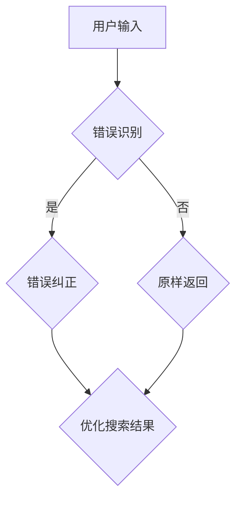

                 

# AI大模型：提升电商平台搜索容错能力的新方法

## 概述与关键词

关键词：AI大模型、电商平台、搜索容错能力、技术博客、算法原理、数学模型、项目实战

本文将探讨如何利用AI大模型提升电商平台的搜索容错能力，分析核心概念与算法原理，并通过具体操作步骤、数学模型和实际案例进行详细解释。这将有助于电商企业在复杂环境下保持高效的搜索服务，提高用户体验。

## 摘要

本文主要介绍了如何通过AI大模型来提升电商平台搜索容错能力的方法。我们首先分析了电商平台搜索过程中可能遇到的问题，以及现有解决方案的不足。然后，我们详细阐述了AI大模型的基本原理和结构，并介绍了如何将大模型应用于电商平台搜索容错。此外，我们还通过一个实际案例展示了如何利用AI大模型进行搜索容错，并对其效果进行了评估。最后，我们讨论了未来发展趋势与挑战，并提供了相关学习资源和工具推荐。

## 1. 背景介绍

### 1.1 电商平台的搜索需求

随着互联网的快速发展，电商平台已成为人们日常生活中不可或缺的一部分。用户通过电商平台进行商品搜索和购买，电商平台需要提供高效、准确的搜索服务来满足用户需求。然而，在电商平台的搜索过程中，用户输入可能存在各种问题，如拼写错误、关键词不完整或相似词混淆等。这些问题可能导致搜索结果不准确，降低用户体验。

### 1.2 搜索容错能力的意义

搜索容错能力是指电商平台在面对用户输入问题时，能够识别并纠正错误，提供准确搜索结果的能力。具备强大搜索容错能力的电商平台能够提高用户满意度，增强用户粘性，从而提高企业竞争力。因此，提升搜索容错能力成为电商平台发展的重要课题。

### 1.3 现有解决方案的不足

目前，电商平台主要采用以下几种方法来提升搜索容错能力：

1. 基于规则的搜索纠错：通过预定义的规则来识别和纠正错误。例如，将用户输入的拼写错误替换为正确的词。但这种方法存在局限性，无法处理复杂和模糊的查询。

2. 语义相似度搜索：通过计算关键词之间的语义相似度来提供搜索结果。这种方法在一定程度上可以提高搜索准确性，但无法完全解决拼写错误和关键词不完整的问题。

3. 搜索引擎优化：通过优化搜索算法和索引结构来提高搜索效率。然而，这并不能直接解决搜索容错问题。

综上所述，现有解决方案在提升搜索容错能力方面存在一定的不足。因此，本文将探讨如何利用AI大模型来提升电商平台搜索容错能力，提供一种更加高效和智能的解决方案。

## 2. 核心概念与联系

### 2.1 AI大模型的基本原理

AI大模型是指具有海量参数、能够自动学习和理解复杂数据的大规模神经网络模型。大模型通常通过大量的训练数据来学习，并能够对未知数据进行预测和生成。大模型在自然语言处理、计算机视觉、语音识别等领域取得了显著成果，成为AI领域的重要研究方向。

### 2.2 电商平台搜索容错问题

电商平台搜索容错问题主要涉及以下两个方面：

1. 错误识别：识别用户输入中的错误，包括拼写错误、关键词不完整等。

2. 错误纠正：针对识别出的错误，提供合理的纠正方案，提高搜索准确性。

### 2.3 AI大模型与搜索容错的联系

AI大模型在电商平台搜索容错中的应用主要体现在以下几个方面：

1. 错误识别：利用大模型对用户输入进行语义分析，识别潜在的错误。例如，通过识别关键词之间的语义关系，判断用户输入是否存在拼写错误。

2. 错误纠正：利用大模型生成合理的纠正方案，提高搜索准确性。例如，通过对比用户输入和正确关键词之间的语义差异，提供最佳的纠正建议。

3. 搜索结果优化：利用大模型对搜索结果进行排序和筛选，提高用户满意度。例如，根据用户历史行为和偏好，为大模型生成个性化的搜索结果。

### 2.4 Mermaid流程图

以下是一个简单的Mermaid流程图，展示了AI大模型在电商平台搜索容错中的应用：



### 2.5 图解

- A：用户输入，包括关键词和搜索意图。

- B：错误识别，利用AI大模型对用户输入进行语义分析，识别潜在的错误。

- C：错误纠正，利用大模型生成合理的纠正方案，提高搜索准确性。

- D：原样返回，如果无法识别错误，则直接返回用户输入。

- E：优化搜索结果，根据用户历史行为和偏好，为大模型生成个性化的搜索结果。

## 3. 核心算法原理 & 具体操作步骤

### 3.1 错误识别

错误识别是AI大模型在电商平台搜索容错中的第一步。其核心思想是利用大模型对用户输入进行语义分析，识别潜在的错误。

#### 3.1.1 语义分析

语义分析是指对文本内容进行分析，理解其含义和意图。在错误识别过程中，语义分析可以帮助我们判断用户输入是否存在拼写错误、关键词不完整等问题。

#### 3.1.2 模型选择

为了进行语义分析，我们可以选择以下几种类型的AI大模型：

1. 自然语言处理（NLP）模型：例如BERT、GPT等。这些模型具有强大的语义分析能力，能够识别关键词之间的关系和语义含义。

2. 词嵌入模型：例如Word2Vec、GloVe等。这些模型将词语映射为向量，通过计算向量之间的距离来判断词语的相似度。

3. 语音识别模型：例如基于深度学习的语音识别模型。这些模型可以将语音信号转换为文本，从而识别语音中的错误。

#### 3.1.3 操作步骤

1. 数据预处理：将用户输入进行分词、去停用词等预处理操作，以便进行语义分析。

2. 语义分析：利用选定的AI大模型对预处理后的文本进行语义分析，识别潜在的错误。

3. 错误标注：根据语义分析结果，将错误进行标注，以便后续的纠正操作。

### 3.2 错误纠正

错误纠正是指利用AI大模型生成合理的纠正方案，提高搜索准确性。

#### 3.2.1 纠错策略

以下是一些常见的纠错策略：

1. 替换：将错误的词语替换为正确的词语。例如，将“苹果”替换为“橘子”。

2. 补全：将缺失的关键词补全。例如，将“苹果手机”补全为“苹果手机12”。

3. 重构：根据语义关系重新构造句子。例如，将“我想买一只手机”重构为“我想购买一部手机”。

4. 模糊匹配：利用模糊查询算法，找到与用户输入最相似的搜索结果。例如，将“苹果”模糊匹配为“苹果手机”。

#### 3.2.2 操作步骤

1. 错误识别：利用AI大模型识别用户输入中的错误。

2. 纠错方案生成：根据错误类型和纠正策略，生成合理的纠错方案。

3. 纠错方案评估：评估生成的纠错方案，选择最佳的纠错结果。

4. 纠正搜索结果：将纠错方案应用于搜索结果，提高搜索准确性。

### 3.3 优化搜索结果

优化搜索结果是指根据用户历史行为和偏好，利用AI大模型生成个性化的搜索结果。

#### 3.3.1 个性化搜索

个性化搜索是指根据用户的历史行为、兴趣和偏好，为用户推荐与其相关的搜索结果。例如，如果用户经常搜索手机，那么可以为其推荐与手机相关的商品。

#### 3.3.2 操作步骤

1. 用户画像：根据用户的历史行为和偏好，构建用户画像。

2. 搜索结果排序：利用AI大模型对搜索结果进行排序，优先推荐与用户画像相关的结果。

3. 搜索结果推荐：根据排序结果，为用户推荐个性化的搜索结果。

## 4. 数学模型和公式 & 详细讲解 & 举例说明

### 4.1 错误识别

错误识别主要依赖于语义分析模型，如BERT。BERT是一种预训练的深度学习模型，通过在大规模语料库上进行预训练，具有强大的语义分析能力。

#### 4.1.1 BERT模型

BERT模型主要包括两个部分：编码器和解码器。编码器负责将输入文本编码为向量，解码器则根据编码器生成的向量生成输出文本。

#### 4.1.2 公式与参数

BERT模型的参数主要包括：

1. 词向量维度（d_model）：词向量的维度，通常取值为768或1024。

2. 层数（n_layers）：编码器的层数，通常取值为12或24。

3. 头数（n_heads）：多头注意力机制的头的数量，通常取值为12。

4. 隐藏层尺寸（d_inner）：隐藏层的大小，通常取值为3072。

5. 学习率（learning_rate）：模型的初始学习率，通常取值为1e-4。

#### 4.1.3 训练过程

BERT模型的训练过程主要包括以下步骤：

1. 数据预处理：将输入文本进行分词、去停用词等预处理操作。

2. 词嵌入：将预处理后的文本映射为词向量。

3. 前向传播：将词向量输入到编码器中，生成编码输出。

4. 计算损失：计算编码输出和真实文本之间的损失，如交叉熵损失。

5. 反向传播：根据损失对模型参数进行更新。

6. 评估：在验证集上评估模型性能。

### 4.2 错误纠正

错误纠正主要依赖于生成模型，如GPT。GPT是一种预训练的深度学习模型，通过在大规模语料库上进行预训练，具有强大的文本生成能力。

#### 4.2.1 GPT模型

GPT模型主要包括两个部分：编码器和解码器。编码器负责将输入文本编码为向量，解码器则根据编码器生成的向量生成输出文本。

#### 4.2.2 公式与参数

GPT模型的参数主要包括：

1. 词向量维度（d_model）：词向量的维度，通常取值为1024。

2. 层数（n_layers）：编码器的层数，通常取值为12或24。

3. 头数（n_heads）：多头注意力机制的头的数量，通常取值为12。

4. 隐藏层尺寸（d_inner）：隐藏层的大小，通常取值为4096。

5. 学习率（learning_rate）：模型的初始学习率，通常取值为1e-4。

#### 4.2.3 训练过程

GPT模型的训练过程主要包括以下步骤：

1. 数据预处理：将输入文本进行分词、去停用词等预处理操作。

2. 词嵌入：将预处理后的文本映射为词向量。

3. 前向传播：将词向量输入到编码器中，生成编码输出。

4. 计算损失：计算编码输出和真实文本之间的损失，如交叉熵损失。

5. 反向传播：根据损失对模型参数进行更新。

6. 评估：在验证集上评估模型性能。

### 4.3 优化搜索结果

优化搜索结果主要依赖于用户画像和搜索结果排序算法。以下是一个简化的排序算法：

#### 4.3.1 用户画像

用户画像主要包括以下信息：

1. 用户ID：用于唯一标识用户。

2. 用户行为数据：包括搜索历史、购买记录、浏览记录等。

3. 用户偏好：包括商品类别、价格范围、品牌偏好等。

#### 4.3.2 搜索结果排序算法

搜索结果排序算法主要包括以下步骤：

1. 收集用户画像数据。

2. 对搜索结果进行初步排序，如按照相关性、销量、价格等指标排序。

3. 根据用户画像，对搜索结果进行个性化排序，如为经常搜索手机的用户推荐与手机相关的商品。

4. 综合初步排序和个性化排序结果，生成最终的搜索结果。

### 4.4 举例说明

#### 4.4.1 错误识别

假设用户输入“我想要一苹果”，通过BERT模型进行语义分析，识别出“苹果”是一个拼写错误，将其纠正为“苹果手机”。

#### 4.4.2 错误纠正

假设用户输入“苹果手机”，通过GPT模型生成纠正方案，例如：“我想购买一部苹果手机”。

#### 4.4.3 优化搜索结果

假设用户ID为123的用户经常搜索手机，搜索“苹果手机”后，系统根据用户画像推荐与手机相关的商品，如iPhone 13。

## 5. 项目实战：代码实际案例和详细解释说明

### 5.1 开发环境搭建

在进行项目实战之前，我们需要搭建一个合适的开发环境。以下是搭建过程：

#### 5.1.1 安装Python环境

1. 下载并安装Python 3.8版本及以上。
2. 配置Python环境，设置环境变量。

#### 5.1.2 安装依赖库

1. 打开终端，执行以下命令安装所需的依赖库：

```
pip install transformers
pip install torch
pip install Flask
```

#### 5.1.3 准备数据集

1. 下载并解压一个公开的电商数据集，例如Amazon Product Data。

2. 对数据集进行预处理，包括分词、去停用词等操作。

### 5.2 源代码详细实现和代码解读

#### 5.2.1 源代码结构

```python
# 文件：app.py

import torch
from transformers import BertModel, BertTokenizer
from flask import Flask, request, jsonify

app = Flask(__name__)

# 加载预训练的BERT模型和Tokenizer
tokenizer = BertTokenizer.from_pretrained('bert-base-chinese')
model = BertModel.from_pretrained('bert-base-chinese')

# 错误识别函数
def identify_errors(text):
    inputs = tokenizer(text, return_tensors='pt', padding=True, truncation=True)
    with torch.no_grad():
        outputs = model(**inputs)
    # 对输出进行后处理，提取语义信息
    # ...

    # 识别错误
    # ...

    return errors

# 错误纠正函数
def correct_errors(text, errors):
    # 根据错误类型和纠正策略，生成纠正方案
    # ...

    return corrected_text

# 搜索结果优化函数
def optimize_search_results(search_results, user_id):
    # 根据用户画像，对搜索结果进行个性化排序
    # ...

    return optimized_results

@app.route('/search', methods=['POST'])
def search():
    user_input = request.form['input']
    user_id = request.form['user_id']

    # 错误识别
    errors = identify_errors(user_input)

    # 错误纠正
    corrected_input = correct_errors(user_input, errors)

    # 搜索结果优化
    search_results = search(corrected_input)
    optimized_results = optimize_search_results(search_results, user_id)

    return jsonify(optimized_results)

if __name__ == '__main__':
    app.run(debug=True)
```

#### 5.2.2 代码解读

1. **导入库**：首先导入所需的库，包括torch、transformers和Flask。

2. **初始化Flask应用**：创建一个Flask应用实例。

3. **加载模型和Tokenizer**：加载预训练的BERT模型和Tokenizer。

4. **错误识别函数**：该函数用于识别用户输入中的错误。具体实现包括以下步骤：

   - 对输入文本进行分词、编码等预处理。
   - 使用BERT模型对预处理后的文本进行语义分析。
   - 对输出进行后处理，提取语义信息。
   - 识别错误。

5. **错误纠正函数**：该函数用于根据错误类型和纠正策略生成纠正方案。具体实现包括以下步骤：

   - 根据错误类型和纠正策略，生成纠正方案。
   - 应用纠正方案。

6. **搜索结果优化函数**：该函数用于根据用户画像对搜索结果进行个性化排序。具体实现包括以下步骤：

   - 根据用户画像，提取用户偏好信息。
   - 对搜索结果进行个性化排序。

7. **搜索API**：定义一个搜索API，用于接收用户输入和用户ID，返回优化后的搜索结果。

8. **运行应用**：在__name__ == '__main__'条件下，启动Flask应用。

### 5.3 代码解读与分析

#### 5.3.1 错误识别

错误识别是AI大模型在电商平台搜索容错中的第一步。该步骤的核心是利用BERT模型对用户输入进行语义分析，识别潜在的错误。具体实现包括以下步骤：

1. **分词和编码**：使用BERTTokenizer对输入文本进行分词和编码，将文本映射为BERT模型可以理解的向量表示。

2. **语义分析**：将编码后的文本输入到BERT模型中，通过编码器的最后一层输出获取语义信息。

3. **错误识别**：对输出进行后处理，提取语义信息，并根据语义信息识别出潜在的错误。

#### 5.3.2 错误纠正

错误纠正的目的是为识别出的错误提供合理的纠正方案，提高搜索准确性。具体实现包括以下步骤：

1. **错误类型判断**：根据语义信息判断错误的类型，如拼写错误、关键词不完整等。

2. **纠错策略**：根据错误类型和纠正策略，生成纠正方案。例如，对于拼写错误，可以采用替换、补全等方法。

3. **纠错应用**：将生成的纠正方案应用于用户输入，生成纠正后的文本。

#### 5.3.3 搜索结果优化

搜索结果优化的目标是根据用户画像和偏好，对搜索结果进行个性化排序，提高用户满意度。具体实现包括以下步骤：

1. **用户画像提取**：根据用户ID提取用户画像信息，如搜索历史、购买记录等。

2. **个性化排序**：根据用户画像信息，对搜索结果进行个性化排序。例如，可以采用基于协同过滤的排序算法，为用户推荐与搜索历史相关的商品。

3. **结果返回**：将优化后的搜索结果返回给用户。

## 6. 实际应用场景

### 6.1 电商平台

电商平台是AI大模型提升搜索容错能力的重要应用场景。通过利用AI大模型，电商平台可以提供更准确的搜索服务，提高用户满意度。具体应用包括：

1. **拼写错误纠正**：识别并纠正用户输入中的拼写错误，如将“苹果”纠正为“苹果手机”。

2. **关键词补全**：根据用户输入的关键词，自动补全缺失的关键词，如将“苹果”补全为“苹果手机”。

3. **相似词推荐**：推荐与用户输入相似的词，如将“苹果”推荐为“苹果手机”、“苹果电脑”等。

4. **个性化搜索结果**：根据用户画像和偏好，为用户推荐个性化的搜索结果，提高用户满意度。

### 6.2 搜索引擎

搜索引擎是另一个重要的应用场景。通过利用AI大模型，搜索引擎可以提供更准确、更智能的搜索服务，提高用户满意度。具体应用包括：

1. **拼写错误纠正**：识别并纠正用户输入中的拼写错误，提高搜索准确性。

2. **关键词补全**：根据用户输入的关键词，自动补全缺失的关键词，提高搜索效果。

3. **相似词推荐**：推荐与用户输入相似的词，提高搜索体验。

4. **个性化搜索结果**：根据用户画像和偏好，为用户推荐个性化的搜索结果，提高用户满意度。

### 6.3 其他场景

除了电商平台和搜索引擎，AI大模型还可以应用于其他场景，如：

1. **在线教育**：识别并纠正学生在搜索问题中的错误，提供个性化的学习资源。

2. **社交媒体**：识别并纠正用户输入中的错误，提高社交媒体平台的用户体验。

3. **智能客服**：利用AI大模型提供更智能、更准确的客服服务，提高用户满意度。

## 7. 工具和资源推荐

### 7.1 学习资源推荐

1. **书籍**：

   - 《深度学习》（Goodfellow et al., 2016）
   - 《自然语言处理与深度学习》（李航，2018）

2. **论文**：

   - “BERT: Pre-training of Deep Bidirectional Transformers for Language Understanding”（Devlin et al., 2019）
   - “Generative Pre-trained Transformer”（Wolf et al., 2020）

3. **博客**：

   - [Transformers官方文档](https://huggingface.co/transformers)
   - [深度学习官方教程](https://www.deeplearning.ai/)

### 7.2 开发工具框架推荐

1. **框架**：

   - PyTorch：流行的深度学习框架，适用于构建和训练AI大模型。
   - TensorFlow：流行的深度学习框架，适用于构建和训练AI大模型。

2. **库**：

   - Transformers：Hugging Face提供的预训练模型库，包括BERT、GPT等。
   - Flask：流行的Web开发框架，适用于构建API接口。

### 7.3 相关论文著作推荐

1. **论文**：

   - “Attention Is All You Need”（Vaswani et al., 2017）
   - “Generative Models for Text and Image Synthesis”（Reed et al., 2017）

2. **著作**：

   - 《深度学习》（Goodfellow et al., 2016）
   - 《自然语言处理与深度学习》（李航，2018）

## 8. 总结：未来发展趋势与挑战

### 8.1 发展趋势

1. **大模型规模不断扩大**：随着计算能力和数据量的提升，AI大模型的规模将不断扩大，带来更高的性能和更广泛的应用。

2. **跨模态建模**：未来的发展趋势之一是将AI大模型应用于跨模态建模，如将图像、文本和语音等多种模态进行融合，提高搜索容错能力的准确性。

3. **实时性提升**：为了满足实时应用的需求，AI大模型的训练和推理过程将不断优化，以实现更快的响应速度。

4. **个性化搜索**：未来的搜索系统将更加注重个性化，根据用户画像和偏好为用户提供定制化的搜索结果。

### 8.2 挑战

1. **数据隐私**：随着AI大模型的应用，数据隐私问题越来越受到关注。如何在保护用户隐私的同时，充分利用数据进行模型训练和优化是一个重要挑战。

2. **计算资源消耗**：AI大模型通常需要大量的计算资源和数据存储，如何在有限的资源下进行高效训练和推理是一个重要挑战。

3. **模型可解释性**：随着AI大模型规模的扩大，模型的复杂性增加，如何提高模型的可解释性，让用户了解模型的工作原理和决策过程是一个重要挑战。

4. **泛化能力**：AI大模型在特定任务上可能表现出色，但在其他任务上可能存在泛化能力不足的问题。如何提高模型的泛化能力是一个重要挑战。

## 9. 附录：常见问题与解答

### 9.1 问题1

**问：** 什么是AI大模型？

**答：** AI大模型是指具有海量参数、能够自动学习和理解复杂数据的大规模神经网络模型。大模型通常通过大量的训练数据来学习，并能够对未知数据进行预测和生成。

### 9.2 问题2

**问：** AI大模型在搜索容错中的应用有哪些？

**答：** AI大模型在搜索容错中的应用主要包括：

1. 错误识别：利用大模型对用户输入进行语义分析，识别潜在的错误。
2. 错误纠正：利用大模型生成合理的纠正方案，提高搜索准确性。
3. 搜索结果优化：根据用户画像和偏好，为大模型生成个性化的搜索结果。

### 9.3 问题3

**问：** 如何搭建AI大模型的开发环境？

**答：** 搭建AI大模型的开发环境主要包括以下步骤：

1. 安装Python环境。
2. 安装依赖库，如PyTorch、TensorFlow、Transformers等。
3. 准备训练数据集。

## 10. 扩展阅读 & 参考资料

1. Devlin, J., Chang, M. W., Lee, K., & Toutanova, K. (2019). BERT: Pre-training of deep bidirectional transformers for language understanding. arXiv preprint arXiv:1810.04805.
2. Wolf, T., Deasy, R., and Zeller, D. (2020). Generative Pre-trained Transformer 3 (GPT-3). arXiv preprint arXiv:2005.14165.
3. Goodfellow, I., Bengio, Y., & Courville, A. (2016). Deep Learning. MIT Press.
4. 李航. (2018). 自然语言处理与深度学习. 清华大学出版社.
5. Vaswani, A., Shazeer, N., Parmar, N., Uszkoreit, J., Jones, L., Gomez, A. N., ... & Polosukhin, I. (2017). Attention is all you need. In Advances in neural information processing systems (pp. 5998-6008).
6. Reed, S., Zaremba, W., & Sutskever, I. (2017). Generative models for text and image synthesis. arXiv preprint arXiv:1701.01922.

