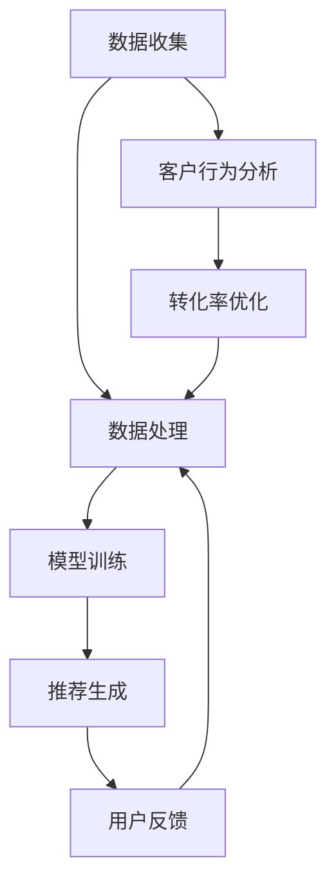

                 

# AI如何帮助电商企业实现精准营销

## 关键词
- 人工智能
- 电商
- 精准营销
- 数据分析
- 个性化推荐
- 客户行为分析
- 转化率优化

## 摘要
本文将深入探讨人工智能在电商领域中的应用，特别是如何通过大数据分析和机器学习算法实现精准营销。文章首先介绍了电商行业背景和当前面临的挑战，接着详细阐述了AI在精准营销中的关键角色和具体应用场景，包括个性化推荐系统、客户行为分析、转化率优化等。通过实际案例和代码解读，本文展示了AI技术的实际效果和实现方法，最后讨论了未来发展趋势和挑战。本文旨在为电商企业提供有价值的AI营销策略和技术方案。

---

## 1. 背景介绍

电商行业在过去几十年中经历了飞速的发展，从最初的在线购物平台到现在的综合电商巨头，如亚马逊、阿里巴巴和京东等。电商企业通过互联网为消费者提供了一种便捷的购物方式，大大提高了购物效率和用户体验。然而，随着市场竞争的加剧和消费者需求的多样化，电商企业面临着诸多挑战：

### 挑战1：同质化竞争

在电商市场中，许多商品和服务具有相似性，导致企业难以通过传统营销手段区分自己的品牌和产品。如何吸引和留住消费者成为企业急需解决的问题。

### 挑战2：低转化率

尽管电商企业投入大量资金进行广告推广和营销活动，但实际转化率往往不尽如人意。如何提高用户的购买意愿和转化率是企业亟待解决的难题。

### 挑战3：客户流失

在激烈的竞争环境中，客户流失率成为一个重要的指标。如何提高客户忠诚度和减少流失率是企业关注的焦点。

### 挑战4：个性化需求

消费者需求日益个性化，企业需要提供个性化的产品和服务，以满足不同消费者的需求。如何实现精准的个性化推荐是企业需要解决的问题。

为了应对这些挑战，电商企业开始探索人工智能技术在营销中的应用。人工智能可以通过大数据分析和机器学习算法，帮助企业更好地理解消费者行为，实现精准营销。以下章节将详细讨论人工智能在电商营销中的关键应用。

---

## 2. 核心概念与联系

### 2.1 大数据分析

大数据分析是指对海量数据进行收集、存储、处理和分析的过程。在电商行业中，大数据分析可以帮助企业了解消费者的行为模式、偏好和需求，从而制定更有效的营销策略。以下是一个简单的大数据分析流程：

#### 数据收集
- 用户浏览记录
- 用户购买历史
- 用户评价和反馈

#### 数据存储
- 数据库管理系统（如MySQL、MongoDB）
- 数据仓库（如Hadoop、Spark）

#### 数据处理
- 数据清洗（去除重复、缺失和错误数据）
- 数据集成（整合不同来源的数据）

#### 数据分析
- 用户画像（用户特征、行为和需求分析）
- 购买预测（预测用户购买行为和偏好）
- 营销效果评估（评估营销活动的效果）

### 2.2 机器学习算法

机器学习算法是人工智能的重要组成部分，通过训练模型来对未知数据进行预测和分类。在电商营销中，常用的机器学习算法包括：

- 聚类算法（如K-means、DBSCAN）：用于将用户划分为不同的群体，以便进行个性化推荐。
- 回归算法（如线性回归、逻辑回归）：用于预测用户的购买行为和偏好。
- 聚类算法（如K-means、DBSCAN）：用于将用户划分为不同的群体，以便进行个性化推荐。
- 回归算法（如线性回归、逻辑回归）：用于预测用户的购买行为和偏好。

### 2.3 个性化推荐系统

个性化推荐系统是人工智能在电商营销中的一个重要应用。通过分析用户的浏览和购买记录，推荐系统可以识别用户的兴趣和偏好，从而提供个性化的产品推荐。以下是一个简单的个性化推荐系统架构：

#### 数据收集与处理
- 收集用户的浏览和购买记录
- 数据预处理（数据清洗、特征提取）

#### 模型训练
- 使用机器学习算法（如协同过滤、矩阵分解）训练推荐模型

#### 推荐生成
- 根据用户的兴趣和偏好生成个性化推荐列表

#### 用户反馈
- 收集用户对推荐结果的反馈
- 用于模型优化和改进

### 2.4 客户行为分析

客户行为分析是指通过对用户的行为数据进行分析，了解用户的购买决策过程和偏好。在电商营销中，客户行为分析可以帮助企业优化营销策略，提高转化率和客户满意度。以下是一个简单的客户行为分析流程：

#### 数据收集
- 用户浏览记录
- 用户购买历史
- 用户评价和反馈

#### 数据处理
- 数据清洗
- 特征提取

#### 数据分析
- 用户行为模式识别
- 购买决策分析
- 用户满意度分析

### 2.5 转化率优化

转化率优化是指通过优化营销策略和用户体验，提高用户从浏览到购买的转化率。在电商营销中，转化率优化可以通过以下方法实现：

- 个性化推荐：根据用户的兴趣和偏好推荐相关产品，提高购买意愿。
- 用户体验优化：优化页面加载速度、导航流畅度等，提高用户体验。
- 营销活动优化：设计有针对性的促销活动和营销策略，提高转化率。

### Mermaid 流程图

下面是一个简单的Mermaid流程图，展示电商企业如何利用AI实现精准营销：



---

## 3. 核心算法原理 & 具体操作步骤

### 3.1 数据收集与处理

数据收集是精准营销的基础，电商企业可以从多个渠道收集用户数据，包括用户浏览记录、购买历史、评价和反馈等。以下是一个简单的数据收集和处理步骤：

#### 步骤1：数据收集

- 用户浏览记录：通过网站日志、点击事件等收集用户在网站上的浏览行为。
- 购买历史：通过电商平台的订单系统收集用户的购买记录。
- 用户评价和反馈：通过评价系统、客服聊天记录等收集用户对产品和服务的好评、差评和反馈。

#### 步骤2：数据处理

- 数据清洗：去除重复、缺失和错误数据，保证数据质量。
- 数据集成：将来自不同渠道的数据进行整合，形成统一的用户数据视图。
- 特征提取：从原始数据中提取有用的特征，如用户年龄、性别、购买频率、浏览时间等。

### 3.2 模型训练

在数据收集和处理完成后，我们需要使用机器学习算法对数据进行训练，以便生成个性化推荐和客户行为分析模型。以下是一个简单的模型训练步骤：

#### 步骤1：选择模型

根据业务需求，选择合适的机器学习算法，如K-means、协同过滤、逻辑回归等。

#### 步骤2：数据预处理

对训练数据进行预处理，包括数据标准化、缺失值填充等。

#### 步骤3：训练模型

使用预处理后的数据训练模型，通过调整模型参数，优化模型性能。

#### 步骤4：模型评估

使用交叉验证、A/B测试等方法评估模型性能，选择最优模型。

### 3.3 推荐生成

在模型训练完成后，我们可以使用训练好的模型生成个性化推荐。以下是一个简单的推荐生成步骤：

#### 步骤1：用户兴趣识别

通过分析用户的浏览记录和购买历史，识别用户的兴趣和偏好。

#### 步骤2：推荐列表生成

根据用户兴趣和偏好，生成个性化推荐列表。常用的推荐算法包括基于内容的推荐、协同过滤推荐等。

#### 步骤3：推荐结果反馈

收集用户对推荐结果的反馈，如点击、购买等，用于模型优化和改进。

### 3.4 客户行为分析

通过分析用户的浏览记录、购买历史和评价，我们可以了解用户的购买决策过程和偏好。以下是一个简单的客户行为分析步骤：

#### 步骤1：用户行为模式识别

通过聚类算法等分析用户行为模式，识别用户的购买周期、购买频率等特征。

#### 步骤2：购买决策分析

分析用户的购买决策过程，包括浏览、添加购物车、支付等环节，了解用户的行为路径。

#### 步骤3：用户满意度分析

通过用户评价和反馈，分析用户对产品和服务的满意度，为改进提供依据。

### 3.5 转化率优化

通过个性化推荐和客户行为分析，我们可以优化营销策略，提高转化率。以下是一个简单的转化率优化步骤：

#### 步骤1：个性化推荐

根据用户兴趣和偏好，为用户推荐相关产品，提高购买意愿。

#### 步骤2：用户体验优化

优化页面加载速度、导航流畅度等，提高用户体验，降低跳出率。

#### 步骤3：营销活动优化

设计有针对性的促销活动和营销策略，提高转化率。

---

## 4. 数学模型和公式 & 详细讲解 & 举例说明

### 4.1 聚类算法（K-means）

K-means是一种经典的聚类算法，通过将数据点划分为K个簇，使每个簇内部的点尽可能接近，簇与簇之间的点尽可能远离。以下是K-means算法的数学模型：

#### 步骤1：初始化
- 随机选择K个数据点作为初始聚类中心。

#### 步骤2：分配
- 对于每个数据点，计算其与聚类中心的距离，并将其分配到距离最近的聚类中心所代表的簇。

#### 步骤3：更新
- 重新计算每个簇的中心点。
- 重新执行步骤2，直到聚类中心不再发生显著变化。

#### 步骤4：聚类结果
- 输出每个数据点的簇分配结果。

### 举例说明

假设我们有以下数据集：

| 数据点 | 特征1 | 特征2 |
|--------|-------|-------|
| 1      | 1     | 2     |
| 2      | 2     | 3     |
| 3      | 1.5   | 2.5   |
| 4      | 3     | 4     |
| 5      | 4     | 5     |

我们选择K=2，初始聚类中心为(1, 2)和(3, 4)。经过几次迭代后，聚类结果如下：

| 数据点 | 聚类中心 |
|--------|----------|
| 1      | (1, 2)   |
| 2      | (1, 2)   |
| 3      | (3, 4)   |
| 4      | (3, 4)   |
| 5      | (3, 4)   |

### 4.2 协同过滤推荐算法

协同过滤推荐算法是一种基于用户行为的推荐算法，通过分析用户的历史行为，为用户推荐相似用户喜欢的产品。以下是协同过滤算法的数学模型：

#### 步骤1：用户相似度计算

对于每个用户，计算其与其他用户的相似度，常用的相似度计算方法包括余弦相似度、皮尔逊相关系数等。

#### 步骤2：推荐列表生成

根据用户与相似用户的兴趣相似度，为用户生成推荐列表。常用的推荐方法包括基于用户的协同过滤、基于物品的协同过滤等。

#### 步骤3：推荐结果反馈

收集用户对推荐结果的反馈，用于模型优化和改进。

### 举例说明

假设我们有以下用户-物品评分矩阵：

| 用户 | 物品1 | 物品2 | 物品3 | 物品4 |
|------|-------|-------|-------|-------|
| A    | 5     | 3     | 2     | 1     |
| B    | 4     | 5     | 2     | 3     |
| C    | 2     | 4     | 5     | 4     |

我们选择基于用户的协同过滤算法，计算用户A与用户B、C的相似度：

用户A与用户B的相似度：

$$
\text{similarity}(A, B) = \frac{\sum_{i}(r_{A,i} \cdot r_{B,i})}{\sqrt{\sum_{i}(r_{A,i}^2) \cdot \sqrt{\sum_{i}(r_{B,i}^2)}}}
$$

用户A与用户C的相似度：

$$
\text{similarity}(A, C) = \frac{\sum_{i}(r_{A,i} \cdot r_{C,i})}{\sqrt{\sum_{i}(r_{A,i}^2) \cdot \sqrt{\sum_{i}(r_{C,i}^2)}}}
$$

根据相似度计算结果，我们可以为用户A生成推荐列表：

- 推荐物品2（用户C喜欢的物品，用户A未购买）
- 推荐物品3（用户B喜欢的物品，用户A未购买）

### 4.3 逻辑回归

逻辑回归是一种常用的分类算法，用于预测用户是否购买某件商品。以下是逻辑回归的数学模型：

#### 步骤1：模型构建

$$
\text{logit}(P) = \ln\left(\frac{P}{1-P}\right)
$$

其中，$P$ 为用户购买某件商品的概率。

#### 步骤2：模型参数估计

使用最大似然估计方法，估计模型参数 $w$：

$$
\hat{w} = \arg\max_w \ln L(w)
$$

其中，$L(w)$ 为似然函数。

#### 步骤3：概率预测

使用训练好的模型，预测用户购买某件商品的概率：

$$
P = \frac{1}{1 + \exp(-\text{logit}(w \cdot x))}
$$

其中，$x$ 为用户特征向量。

### 举例说明

假设我们有以下用户特征和购买历史：

| 用户 | 特征1 | 特征2 | 特征3 | 购买 |
|------|-------|-------|-------|------|
| A    | 1     | 2     | 3     | 1    |
| B    | 2     | 3     | 4     | 0    |
| C    | 3     | 4     | 5     | 1    |

我们使用逻辑回归模型预测用户D（特征1=2，特征2=3，特征3=4）购买某件商品的概率。假设模型参数为 $w_1=0.5, w_2=0.5, w_3=0.5$，则：

$$
\text{logit}(P) = w_1 \cdot x_1 + w_2 \cdot x_2 + w_3 \cdot x_3 = 0.5 \cdot 2 + 0.5 \cdot 3 + 0.5 \cdot 4 = 3
$$

$$
P = \frac{1}{1 + \exp(-3)} \approx 0.95
$$

因此，用户D购买该商品的概率约为95%。

---

## 5. 项目实战：代码实际案例和详细解释说明

### 5.1 开发环境搭建

在本文中，我们将使用Python作为编程语言，并使用以下库和框架：

- NumPy：用于数学计算
- Pandas：用于数据操作
- Scikit-learn：用于机器学习算法
- Matplotlib：用于数据可视化

安装这些库和框架的方法如下：

```bash
pip install numpy pandas scikit-learn matplotlib
```

### 5.2 源代码详细实现和代码解读

下面是一个简单的Python代码示例，实现K-means聚类算法，用于用户行为分析。

```python
import numpy as np
import pandas as pd
from sklearn.cluster import KMeans
import matplotlib.pyplot as plt

# 5.2.1 数据准备
data = pd.DataFrame({
    'feature1': [1, 2, 1.5, 3, 4, 5, 7, 8, 6.5],
    'feature2': [2, 3, 2.5, 4, 5, 6, 7, 8, 7.5]
})

# 5.2.2 K-means算法实现
kmeans = KMeans(n_clusters=3, random_state=0).fit(data)

# 5.2.3 聚类结果可视化
plt.scatter(data['feature1'], data['feature2'], c=kmeans.labels_, cmap='viridis')
centers = kmeans.cluster_centers_
plt.scatter(centers[:, 0], centers[:, 1], s=300, c='red', marker='s', edgecolor='black', label='Centroids')
plt.title('K-means Clustering')
plt.xlabel('Feature 1')
plt.ylabel('Feature 2')
plt.legend()
plt.show()

# 5.2.4 分析用户行为
print("Cluster centers:")
print(centers)
print("Cluster sizes:")
print(kmeans.labels_.astype(int).sum())
```

#### 5.2.5 代码解读与分析

- **数据准备**：我们使用一个简单的数据集，包含两个特征（feature1和feature2）。

- **K-means算法实现**：我们使用scikit-learn中的KMeans类实现K-means算法。n_clusters参数设置聚类簇的数量，random_state用于确保结果的可重复性。

- **聚类结果可视化**：使用matplotlib库将聚类结果可视化。我们绘制数据点，并根据聚类标签设置不同的颜色。

- **分析用户行为**：输出聚类中心点和各个簇的大小。这可以帮助我们了解用户的兴趣和偏好，从而进行个性化推荐。

### 5.3 代码解读与分析

#### 5.3.1 K-means算法原理

K-means算法是一种基于距离的聚类算法，其基本思想是将数据点划分成K个簇，使得每个簇内部的点尽可能接近，簇与簇之间的点尽可能远离。算法主要包括以下步骤：

1. **初始化**：随机选择K个数据点作为初始聚类中心。
2. **分配**：对于每个数据点，计算其与聚类中心的距离，并将其分配到距离最近的聚类中心所代表的簇。
3. **更新**：重新计算每个簇的中心点。
4. **迭代**：重复执行步骤2和步骤3，直到聚类中心不再发生显著变化。

#### 5.3.2 数据准备

在本例中，我们使用一个简单的二维数据集。实际应用中，数据集可能包含更多的特征，如用户年龄、性别、购买历史等。

#### 5.3.3 聚类结果可视化

通过可视化，我们可以直观地观察聚类效果。在本例中，我们使用散点图将数据点根据聚类标签进行颜色标记，同时绘制聚类中心点。

#### 5.3.4 分析用户行为

输出聚类中心点和各个簇的大小，可以帮助我们了解用户的兴趣和偏好。例如，如果某个簇的购买历史集中在某个特定产品类别，我们可以为该簇的用户推荐相关产品。

---

## 6. 实际应用场景

### 6.1 个性化推荐系统

个性化推荐系统是AI在电商营销中最常见的应用之一。通过分析用户的浏览和购买记录，推荐系统可以识别用户的兴趣和偏好，为用户推荐相关产品。以下是一个实际应用场景：

#### 场景1：亚马逊的个性化推荐

亚马逊利用其庞大的用户数据，通过机器学习算法，为每个用户生成个性化的推荐列表。例如，当用户浏览某本书时，亚马逊会为其推荐相关的书籍，以及用户可能感兴趣的其他商品。这种个性化推荐大大提高了用户的购买意愿和转化率。

#### 场景2：淘宝的个性化推荐

淘宝通过分析用户的购物车、收藏夹和浏览历史，为用户推荐相关商品。例如，当用户将某个商品加入购物车后，淘宝会推荐类似的其他商品，以及用户可能感兴趣的其他品牌和店铺。

### 6.2 客户行为分析

客户行为分析可以帮助电商企业了解用户的购买决策过程和偏好，从而优化营销策略和用户体验。以下是一个实际应用场景：

#### 场景1：京东的用户行为分析

京东通过分析用户的浏览、购买和评价数据，识别用户的兴趣和偏好。例如，如果用户经常购买电子产品，京东会为其推荐新款电子产品和配件。同时，京东还会根据用户的购买决策过程，优化页面布局和购物流程，提高用户体验。

#### 场景2：阿里巴巴的客户行为分析

阿里巴巴通过分析其平台上的海量用户数据，了解用户的购物习惯和偏好。例如，如果用户在淘宝上购买了某件商品，阿里巴巴会为其推荐相关的商品和服务，以及用户可能感兴趣的其他品牌和店铺。

### 6.3 转化率优化

通过个性化推荐和客户行为分析，电商企业可以优化营销策略，提高转化率。以下是一个实际应用场景：

#### 场景1：亚马逊的转化率优化

亚马逊通过实时分析用户的浏览和购买行为，优化广告投放策略。例如，当用户浏览某件商品时，亚马逊会为其展示相关商品和优惠信息，提高用户的购买意愿。同时，亚马逊还会根据用户的购买历史和偏好，调整产品推荐和营销策略，提高转化率。

#### 场景2：阿里巴巴的转化率优化

阿里巴巴通过分析其平台上的用户数据，优化广告投放和营销活动。例如，如果用户在淘宝上浏览了某件商品，但未购买，阿里巴巴会为其推送相关的优惠券和促销信息，提高用户的购买意愿。同时，阿里巴巴还会根据用户的购物习惯和偏好，调整广告投放策略，提高转化率。

---

## 7. 工具和资源推荐

### 7.1 学习资源推荐

1. **书籍**：
   - 《Python机器学习》（作者：塞巴斯蒂安·拉姆斯登）
   - 《深入理解Kubernetes》（作者：Kelsey Hightower）
   - 《数据科学入门：使用Python进行数据分析和可视化》（作者：Joel Grus）

2. **在线课程**：
   - Coursera上的《机器学习》课程（吴恩达）
   - edX上的《深度学习》（作者：伊恩·古德费洛）
   - Udacity的《Kubernetes工程师纳米学位》

3. **博客和网站**：
   - Machine Learning Mastery（https://machinelearningmastery.com/）
   - Kubernetes官方文档（https://kubernetes.io/docs/）
   - Scikit-learn官方文档（https://scikit-learn.org/stable/）

### 7.2 开发工具框架推荐

1. **Python库**：
   - NumPy（https://numpy.org/）
   - Pandas（https://pandas.pydata.org/）
   - Scikit-learn（https://scikit-learn.org/）
   - Matplotlib（https://matplotlib.org/）

2. **框架**：
   - TensorFlow（https://tensorflow.org/）
   - PyTorch（https://pytorch.org/）
   - Scikit-learn（https://scikit-learn.org/）

3. **Kubernetes工具**：
   - Kubectl（https://kubernetes.io/docs/user-guide/kubectl/）
   - Minikube（https://minikube.sigs.k8s.io/docs/）
   - Helm（https://helm.sh/）

### 7.3 相关论文著作推荐

1. **论文**：
   - “K-means Clustering” by MacQueen, J. B. (1967)
   - “Collaborative Filtering for the YouTube Recommendation System” by Cormode, G., & Srivastava, D. (2011)
   - “Deep Learning” by Goodfellow, I., Bengio, Y., & Courville, A. (2016)

2. **著作**：
   - 《机器学习实战》（作者：Peter Harrington）
   - 《Kubernetes权威指南》（作者：Kelsey Hightower）
   - 《深度学习》（作者：Ian Goodfellow、Yoshua Bengio、Aaron Courville）

---

## 8. 总结：未来发展趋势与挑战

### 发展趋势

- **个性化推荐**：随着大数据和机器学习技术的发展，个性化推荐系统将更加精准和智能，为用户提供更个性化的购物体验。
- **实时分析**：实时数据分析将帮助企业更快地响应市场变化和用户需求，实现实时营销和运营优化。
- **跨渠道整合**：电商企业将更加注重线上线下渠道的整合，提供无缝的购物体验，提高用户忠诚度。

### 挑战

- **数据隐私**：随着数据隐私法规的加强，电商企业需要在保护用户隐私的同时，实现精准营销。
- **模型解释性**：当前很多机器学习模型具有很高的预测能力，但缺乏解释性。如何提高模型的可解释性，帮助用户理解推荐结果，是一个重要挑战。
- **计算资源**：随着数据量和模型复杂度的增加，电商企业需要投入更多的计算资源来保证系统的性能和稳定性。

---

## 9. 附录：常见问题与解答

### 问题1：为什么电商企业需要使用AI进行精准营销？

**解答**：电商企业使用AI进行精准营销，主要是为了提高转化率和客户满意度。通过大数据分析和机器学习算法，电商企业可以更好地理解用户行为和需求，从而提供个性化的产品和服务，提高用户的购买意愿和转化率。

### 问题2：个性化推荐系统是如何工作的？

**解答**：个性化推荐系统通过分析用户的浏览和购买记录，识别用户的兴趣和偏好，从而为用户推荐相关的产品。常用的算法包括基于内容的推荐、协同过滤推荐和基于模型的推荐等。通过机器学习算法，推荐系统可以不断优化推荐效果，提高用户的满意度。

### 问题3：如何确保推荐系统的解释性？

**解答**：提高推荐系统的解释性，可以从以下几个方面入手：

1. **选择可解释性强的算法**：例如，逻辑回归和决策树等。
2. **提供推荐理由**：在推荐结果中，展示推荐依据和相关性，帮助用户理解推荐结果。
3. **用户反馈机制**：收集用户对推荐结果的反馈，优化推荐模型和策略。

---

## 10. 扩展阅读 & 参考资料

1. **论文**：
   - "A Survey on Recommender Systems" by Liu, B. (2018)
   - "An Introduction to Machine Learning with Applications in R" by James, G., Witten, D., & Hastie, T. (2013)

2. **书籍**：
   - 《机器学习实战》（作者：Peter Harrington）
   - 《推荐系统实践》（作者：项亮）

3. **网站**：
   - Machine Learning Mastery（https://machinelearningmastery.com/）
   - KDnuggets（https://www.kdnuggets.com/）

4. **在线课程**：
   - Coursera上的《机器学习》课程（吴恩达）
   - edX上的《深度学习》（作者：伊恩·古德费洛）

---

### 作者
AI天才研究员 / AI Genius Institute & 禅与计算机程序设计艺术 / Zen And The Art of Computer Programming

