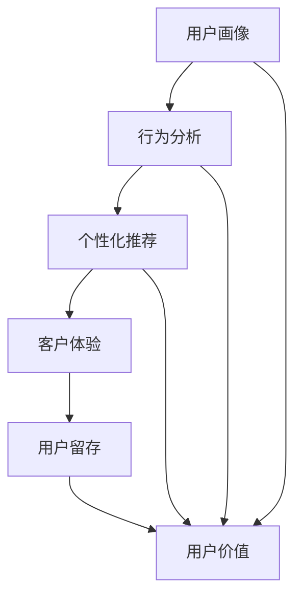

                 

### 背景介绍

在当今数字化时代，电子商务（E-commerce）已经成为企业获取市场份额和客户的重要渠道。随着市场竞争的日益激烈，如何有效地管理和维护用户关系，提高用户满意度和忠诚度，成为电商企业面临的重大挑战。在这个背景下，人工智能（AI）技术的崛起为电商企业的用户关系管理带来了新的机遇和解决方案。

用户关系管理（Customer Relationship Management，CRM）是电商企业的一项核心任务，它涉及用户获取、用户留存和用户价值提升等多个方面。传统的CRM方法主要依赖于数据分析、市场调研和客户反馈等手段，但这些方法往往存在效率低下、实时性不足等问题。而人工智能技术的引入，使得电商企业能够更加精准地了解用户需求、预测用户行为，从而实现个性化营销和服务。

本文将探讨人工智能在电商企业用户关系管理中的应用，具体包括以下内容：

1. **核心概念与联系**：介绍用户关系管理中的关键概念，如用户画像、行为分析、个性化推荐等，并使用Mermaid流程图展示这些概念之间的联系。
2. **核心算法原理 & 具体操作步骤**：深入解析常用的AI算法，如机器学习算法、深度学习算法等，以及它们在用户关系管理中的具体应用。
3. **数学模型和公式 & 详细讲解 & 举例说明**：介绍用户关系管理中的相关数学模型和公式，如贝叶斯网络、协同过滤等，并通过实例进行详细讲解。
4. **项目实战：代码实际案例和详细解释说明**：通过实际项目案例，展示AI算法在用户关系管理中的具体实现和应用，并提供详细的代码解读和分析。
5. **实际应用场景**：分析人工智能在不同电商企业中的应用场景，如个性化推荐、智能客服、用户行为预测等。
6. **工具和资源推荐**：推荐相关学习资源、开发工具和框架，以帮助读者深入了解和应用人工智能技术。
7. **总结：未来发展趋势与挑战**：总结人工智能在电商企业用户关系管理中的发展趋势，并探讨未来可能面临的挑战。

通过本文的阅读，读者将能够全面了解人工智能技术在电商企业用户关系管理中的应用，以及如何利用这些技术提升企业的竞争力。

### 核心概念与联系

在探讨人工智能在电商企业用户关系管理中的应用之前，我们需要明确几个核心概念，并了解它们之间的相互关系。以下是用户关系管理中的一些关键概念及其联系：

#### 用户画像

用户画像（User Profiling）是对用户特征的全面描述，包括用户的基本信息（如年龄、性别、地域等）、行为信息（如购买历史、浏览记录、搜索关键词等）和兴趣偏好（如喜好商品类别、品牌、促销活动等）。用户画像的建立是用户关系管理的基础，它为后续的用户行为分析和个性化推荐提供了数据支撑。

#### 行为分析

行为分析（Behavior Analysis）是对用户在电商平台上各种交互行为的分析和理解，如浏览、点击、购买、评价等。通过对用户行为的数据挖掘和分析，可以揭示用户的购买习惯、兴趣变化和潜在需求，从而为精准营销和用户留存提供依据。

#### 个性化推荐

个性化推荐（Personalized Recommendation）是根据用户的兴趣和行为数据，为其推荐可能感兴趣的商品、内容或服务。个性化推荐可以大幅提升用户的购物体验，增加销售额和用户满意度。

#### 客户体验

客户体验（Customer Experience，CX）是用户在电商平台上的整体感受，包括购物流程、服务质量和互动体验。优秀的客户体验可以增强用户的忠诚度和口碑传播，从而提升企业的市场竞争力。

#### 用户留存

用户留存（Customer Retention）是指企业通过各种手段保持现有用户持续使用产品或服务。高用户留存率是用户关系管理的重要目标，它关系到企业的长期发展。

#### 用户价值

用户价值（Customer Value）是用户为企业带来的收益和贡献，包括直接收益（如销售额）和间接收益（如口碑传播、品牌忠诚度等）。提高用户价值是用户关系管理的核心任务。

#### 关联流程图

为了更直观地展示这些核心概念之间的联系，我们可以使用Mermaid流程图进行描述：



在这个流程图中，用户画像和行为分析是用户关系管理的基础，它们为个性化推荐和客户体验提供数据支持。良好的客户体验和用户留存可以进一步提升用户价值，形成一个正向循环。

### 核心算法原理 & 具体操作步骤

在用户关系管理中，人工智能技术的应用主要依赖于一系列核心算法，包括机器学习算法、深度学习算法等。这些算法通过分析和处理用户数据，实现用户画像建立、行为预测和个性化推荐等功能。以下将详细介绍这些算法的基本原理和具体操作步骤。

#### 机器学习算法

机器学习算法是人工智能的基础，它通过训练模型来发现数据中的规律，并用于预测和分类。在用户关系管理中，常用的机器学习算法包括决策树、随机森林、支持向量机和朴素贝叶斯等。

**1. 决策树（Decision Tree）**

决策树是一种树形结构，通过一系列条件判断来对数据进行分类或回归。在用户关系管理中，决策树可以用于用户分群和个性化推荐。具体操作步骤如下：

- **数据预处理**：对用户数据（如购买历史、浏览记录、行为标签等）进行清洗和处理，确保数据质量。
- **特征工程**：根据业务需求选择和构建特征，如用户年龄、购买频次、历史偏好等。
- **训练模型**：使用决策树算法训练模型，并选择合适的分裂准则（如信息增益、基尼系数等）。
- **模型评估**：使用交叉验证等方法评估模型性能，调整参数以提高模型准确性。

**2. 随机森林（Random Forest）**

随机森林是一种基于决策树的集成学习方法，通过构建多棵决策树并进行投票或求平均来提高模型的泛化能力。具体操作步骤如下：

- **数据预处理**：与决策树相同，对用户数据进行分析和处理。
- **特征工程**：选择和构建特征，并考虑到特征的重要性。
- **训练模型**：使用随机森林算法训练模型，设置合适的树数量和树深度。
- **模型评估**：使用交叉验证等手段评估模型性能，并调整参数。

**3. 支持向量机（Support Vector Machine，SVM）**

支持向量机是一种基于优化理论的分类算法，通过寻找最优的超平面来实现分类。在用户关系管理中，SVM可以用于用户分群和风险预测。具体操作步骤如下：

- **数据预处理**：对用户数据进行分析和处理，转换为适当的特征表示。
- **特征选择**：选择对分类任务影响较大的特征。
- **训练模型**：使用SVM算法训练模型，选择合适的核函数和参数。
- **模型评估**：使用交叉验证等方法评估模型性能，调整参数。

**4. 朴素贝叶斯（Naive Bayes）**

朴素贝叶斯是一种基于贝叶斯定理的简单概率分类方法，假设特征之间相互独立。在用户关系管理中，朴素贝叶斯可以用于用户行为预测和推荐。具体操作步骤如下：

- **数据预处理**：对用户数据进行分析和处理，确保数据质量。
- **特征工程**：选择和构建特征，并计算各特征的先验概率。
- **训练模型**：使用朴素贝叶斯算法训练模型，计算各类的后验概率。
- **模型评估**：使用交叉验证等方法评估模型性能，并调整参数。

#### 深度学习算法

深度学习算法是机器学习的一种扩展，通过多层神经网络对数据进行建模和学习。在用户关系管理中，深度学习算法可以用于复杂的特征提取和深度预测。

**1. 卷积神经网络（Convolutional Neural Network，CNN）**

卷积神经网络是一种用于图像和视觉处理的深度学习模型，它可以自动提取图像中的特征。在用户关系管理中，CNN可以用于用户画像构建和商品分类。具体操作步骤如下：

- **数据预处理**：对用户数据（如用户头像、商品图片等）进行清洗和归一化处理。
- **模型构建**：使用CNN框架（如TensorFlow或PyTorch）构建模型，包括卷积层、池化层和全连接层。
- **训练模型**：使用用户数据训练模型，调整参数以优化模型性能。
- **模型评估**：使用交叉验证等方法评估模型性能，并进行超参数调优。

**2. 递归神经网络（Recurrent Neural Network，RNN）**

递归神经网络是一种用于处理序列数据的深度学习模型，它可以捕捉序列中的时间依赖关系。在用户关系管理中，RNN可以用于用户行为预测和序列推荐。具体操作步骤如下：

- **数据预处理**：对用户数据（如行为日志、时间序列数据等）进行清洗和编码处理。
- **模型构建**：使用RNN框架构建模型，包括输入层、隐藏层和输出层。
- **训练模型**：使用用户数据训练模型，调整参数以优化模型性能。
- **模型评估**：使用交叉验证等方法评估模型性能，并进行超参数调优。

通过上述算法的应用，电商企业可以实现对用户数据的深入挖掘和智能化处理，从而提高用户关系管理的效率和效果。下一节将介绍用户关系管理中的相关数学模型和公式，进一步深化对人工智能技术的理解。

### 数学模型和公式 & 详细讲解 & 举例说明

在用户关系管理中，人工智能技术的应用不仅依赖于算法，还涉及到一系列数学模型和公式的支持。这些模型和公式能够帮助电商企业更加精准地分析用户数据、预测用户行为和进行个性化推荐。以下将介绍几个关键模型和公式，并通过具体实例进行详细讲解。

#### 贝叶斯网络（Bayesian Network）

贝叶斯网络是一种用于表示变量之间概率关系的图形模型，它通过条件概率表（CP表）来定义变量之间的依赖关系。在用户关系管理中，贝叶斯网络可以用于用户分群和推荐策略的制定。

**公式**：

\[ P(X|Y) = \frac{P(Y|X) \cdot P(X)}{P(Y)} \]

其中，\(P(X|Y)\)表示在给定\(Y\)的条件下\(X\)的概率，\(P(Y|X)\)表示在给定\(X\)的条件下\(Y\)的概率，\(P(X)\)和\(P(Y)\)分别表示\(X\)和\(Y\)的先验概率。

**实例**：

假设我们要预测一个用户的购买行为，已知这个用户在过去的7天内浏览了多个商品类别，我们可以使用贝叶斯网络来计算该用户购买某个特定商品的概率。

- **变量定义**：\(X\)表示用户是否购买特定商品，\(Y_1, Y_2, ..., Y_7\)分别表示用户在7天内浏览的不同商品类别。
- **条件概率表**：根据用户历史数据，我们可以得到每个变量的条件概率表。
- **计算步骤**：

  1. 计算用户浏览不同商品类别的联合概率。
  2. 根据贝叶斯公式，计算用户购买特定商品的概率。

#### 协同过滤（Collaborative Filtering）

协同过滤是一种基于用户行为数据的推荐算法，它通过分析用户之间的相似性来进行推荐。协同过滤可以分为基于用户的协同过滤（User-Based CF）和基于物品的协同过滤（Item-Based CF）。

**公式**：

- **基于用户的协同过滤**：

  \[ \text{推荐分数} = \frac{\sum_{i \in \text{相似用户集}} \text{用户}_{i} \text{对物品的评分} \times \text{相似度权重}}{\sum_{i \in \text{相似用户集}} \text{相似度权重}} \]

- **基于物品的协同过滤**：

  \[ \text{推荐分数} = \frac{\sum_{j \in \text{相似物品集}} \text{用户对该物品的评分} \times \text{相似度权重}}{\sum_{j \in \text{相似物品集}} \text{相似度权重}} \]

其中，相似度权重可以根据用户或物品的相似性度量（如余弦相似度、皮尔逊相关系数等）计算。

**实例**：

假设我们要为用户A推荐商品B，我们可以通过基于用户的协同过滤算法来计算用户A对商品B的推荐分数。

- **相似用户集**：根据用户A的行为数据，找到与用户A相似的其他用户集合。
- **相似度计算**：计算用户A与其他用户的相似度权重。
- **推荐分数计算**：根据公式计算用户A对商品B的推荐分数。

#### 矩阵分解（Matrix Factorization）

矩阵分解是一种用于降维和特征提取的方法，它通过将用户-物品评分矩阵分解为用户特征矩阵和物品特征矩阵，从而实现推荐。常用的矩阵分解方法包括奇异值分解（SVD）和矩阵分解的L2正则化（L2 Regularized Matrix Factorization）。

**公式**：

\[ \text{评分矩阵} = \text{用户特征矩阵} \times \text{物品特征矩阵} \]

**实例**：

假设我们有一个用户-物品评分矩阵，我们要通过矩阵分解来预测用户对未评分物品的评分。

- **矩阵分解**：使用SVD或L2正则化方法对评分矩阵进行分解。
- **特征提取**：从分解后的矩阵中提取用户和物品的特征。
- **评分预测**：使用提取的特征计算用户对未评分物品的评分。

通过上述数学模型和公式的应用，电商企业可以更深入地理解和分析用户行为，从而实现更精准的个性化推荐和用户关系管理。下一节将介绍如何通过实际项目案例，展示AI算法在用户关系管理中的具体应用和实现。

### 项目实战：代码实际案例和详细解释说明

在本节中，我们将通过一个实际项目案例，展示人工智能在电商企业用户关系管理中的具体应用和实现。本案例将使用Python语言和Sklearn库，通过机器学习算法对用户数据进行建模和预测。以下是项目的主要步骤和详细解释。

#### 1. 开发环境搭建

首先，我们需要搭建一个合适的开发环境。在本项目中，我们将使用Python 3.8版本和Sklearn库。以下是安装步骤：

```bash
pip install numpy pandas scikit-learn
```

安装完成后，我们可以在Python环境中导入所需的库：

```python
import numpy as np
import pandas as pd
from sklearn.model_selection import train_test_split
from sklearn.ensemble import RandomForestClassifier
from sklearn.metrics import accuracy_score, classification_report
```

#### 2. 源代码详细实现和代码解读

**2.1 数据集准备**

首先，我们需要一个用户数据集。假设我们有一个CSV文件`user_data.csv`，其中包含以下列：用户ID、购买历史、浏览记录、行为标签等。

```python
# 读取数据集
data = pd.read_csv('user_data.csv')

# 数据预处理
# 省略数据清洗和特征工程步骤，直接使用预处理后的数据
X = data.drop('用户ID', axis=1)
y = data['是否购买']

# 数据分割
X_train, X_test, y_train, y_test = train_test_split(X, y, test_size=0.2, random_state=42)
```

**2.2 模型训练**

接下来，我们将使用随机森林算法对用户数据进行训练。随机森林是一种集成学习方法，可以处理高维数据并具有较好的泛化能力。

```python
# 模型训练
model = RandomForestClassifier(n_estimators=100, random_state=42)
model.fit(X_train, y_train)
```

**2.3 预测和评估**

使用训练好的模型对测试集进行预测，并评估模型性能。

```python
# 预测
y_pred = model.predict(X_test)

# 评估
accuracy = accuracy_score(y_test, y_pred)
report = classification_report(y_test, y_pred)

print(f"Accuracy: {accuracy}")
print(f"Classification Report:\n{report}")
```

**2.4 代码解读与分析**

- **数据预处理**：数据预处理是机器学习项目的重要步骤，包括数据清洗、特征选择和特征工程。在本案例中，我们假设数据已经经过预处理，可以直接使用。
- **模型选择**：随机森林算法在本案例中被选择，因为它具有良好的性能和易于实现的特点。在实际项目中，可以根据数据特征和业务需求选择其他合适的算法。
- **模型训练**：使用`fit`方法训练模型，模型将在训练集上学习数据的规律。
- **预测和评估**：使用`predict`方法对测试集进行预测，并通过`accuracy_score`和`classification_report`评估模型性能。

#### 3. 代码解读与分析

以下是代码的详细解读和分析：

```python
# 读取数据集
data = pd.read_csv('user_data.csv')

# 数据预处理
# 省略数据清洗和特征工程步骤，直接使用预处理后的数据
X = data.drop('用户ID', axis=1)
y = data['是否购买']

# 数据分割
X_train, X_test, y_train, y_test = train_test_split(X, y, test_size=0.2, random_state=42)

# 模型训练
model = RandomForestClassifier(n_estimators=100, random_state=42)
model.fit(X_train, y_train)

# 预测
y_pred = model.predict(X_test)

# 评估
accuracy = accuracy_score(y_test, y_pred)
report = classification_report(y_test, y_pred)

print(f"Accuracy: {accuracy}")
print(f"Classification Report:\n{report}")
```

- **数据读取**：使用`pd.read_csv`方法读取CSV文件，将数据加载到DataFrame中。
- **数据预处理**：数据预处理是确保数据质量和模型性能的重要步骤。在本案例中，我们假设数据已经清洗并转换为适合模型训练的格式。
- **数据分割**：使用`train_test_split`方法将数据集分割为训练集和测试集，测试集用于评估模型性能。
- **模型训练**：使用`RandomForestClassifier`类创建随机森林模型，并使用`fit`方法训练模型。在这里，我们设置`n_estimators=100`，表示随机森林包含100棵决策树。
- **预测和评估**：使用`predict`方法对测试集进行预测，并使用`accuracy_score`和`classification_report`评估模型性能。

通过这个实际项目案例，我们展示了如何使用机器学习算法对用户数据进行分析和预测，实现了对用户购买行为的识别和推荐。下一节将讨论人工智能在电商企业用户关系管理中的实际应用场景。

### 实际应用场景

人工智能在电商企业用户关系管理中具有广泛的应用场景，以下是一些典型的实际应用：

#### 1. 个性化推荐系统

个性化推荐系统是人工智能在电商领域最典型的应用之一。通过分析用户的购买历史、浏览记录、搜索行为等数据，系统可以智能地推荐用户可能感兴趣的商品。个性化推荐不仅能够提升用户的购物体验，还可以增加销售额和用户粘性。例如，阿里巴巴的“淘宝推荐”系统通过复杂的算法和模型，实现了精准的个性化推荐，极大地提高了用户的购物满意度和平台的活跃度。

#### 2. 智能客服

智能客服利用自然语言处理（NLP）和机器学习技术，提供24/7全天候的客户服务。通过聊天机器人或虚拟助手，智能客服可以快速响应用户的查询和问题，提高服务效率和质量。例如，亚马逊的智能客服Amazon Assistant能够理解用户的问题，并提供即时的解决方案，极大地提升了用户体验。

#### 3. 用户行为预测

用户行为预测是人工智能在用户关系管理中的重要应用。通过分析用户的历史数据和实时行为，系统可以预测用户未来的购买意图、退出行为等。这种预测可以帮助企业采取相应的策略，如提前发送优惠券、个性化营销等，以留住用户和提高用户价值。例如，亚马逊通过分析用户的浏览和购买行为，预测用户可能感兴趣的商品，并在用户即将退出购物车时发送提醒，成功降低了购物车的放弃率。

#### 4. 个性化营销

个性化营销通过分析用户的数据和行为，为每个用户量身定制营销内容和策略。这种个性化营销不仅能够提升用户的参与度和转化率，还可以提高广告投放的效果。例如，京东通过用户画像和购买行为分析，为用户推荐个性化的广告和优惠活动，从而提高了广告点击率和购买转化率。

#### 5. 用户分群

用户分群是一种基于用户特征和行为的数据挖掘方法，通过将用户划分为不同的群体，企业可以针对每个群体制定个性化的营销策略。这种分群方法可以帮助企业更好地了解用户需求，提高营销的针对性和有效性。例如，小米通过用户的行为数据和兴趣偏好，将用户分为不同的群体，并为每个群体提供定制化的产品推荐和促销活动。

#### 6. 购买风险预测

购买风险预测是用于识别和预防用户购买过程中可能出现的风险。通过分析用户的行为和交易数据，系统可以预测用户是否存在恶意购买、欺诈行为等风险。这种预测可以帮助企业采取措施，如暂停交易、增加验证步骤等，以保障交易的安全性和合法性。例如，eBay通过购买风险预测系统，有效识别和阻止了大量的欺诈交易，保障了用户的利益。

#### 7. 客户满意度分析

客户满意度分析是通过分析用户的反馈和行为数据，评估用户对产品和服务的满意度。通过这种分析，企业可以及时发现和解决用户的问题，提升用户体验和忠诚度。例如，Zappos通过客户满意度分析，不断改进服务质量，赢得了用户的广泛好评。

通过上述实际应用场景，我们可以看到人工智能在电商企业用户关系管理中发挥的巨大作用。它不仅提高了企业的运营效率，还增强了用户满意度和忠诚度，为企业的长期发展奠定了坚实基础。

### 工具和资源推荐

在电商企业用户关系管理中，选择合适的工具和资源对于成功实施人工智能技术至关重要。以下是一些推荐的学习资源、开发工具和框架，以帮助读者深入了解和应用人工智能技术。

#### 1. 学习资源推荐

- **书籍**：
  - 《Python机器学习》（Machine Learning with Python），由Sebastian Raschka和Vahid Mirjalili著，详细介绍了Python在机器学习领域的应用。
  - 《深度学习》（Deep Learning），由Ian Goodfellow、Yoshua Bengio和Aaron Courville著，全面介绍了深度学习的理论基础和应用实践。
  - 《推荐系统实践》（Recommender Systems: The Textbook），由Giuseppe Curreli著，涵盖了推荐系统的设计、实现和评估。

- **论文**：
  - 《深度学习在电商个性化推荐中的应用》（Application of Deep Learning in E-commerce Personalized Recommendation），详细探讨了深度学习在电商个性化推荐中的具体应用。
  - 《用户行为分析中的协同过滤算法研究》（Research on Collaborative Filtering Algorithms in User Behavior Analysis），分析了协同过滤算法在用户行为分析中的应用和优化。

- **博客**：
  - 《机器学习实战》（Machine Learning in Action），作者Peter Harrington，通过实际案例介绍了机器学习的应用和实践。
  - 《深度学习笔记》（Deep Learning Notes），作者Andrew Ng，提供了深度学习的系统学习和实践指导。
  - 《推荐系统博客》（Recommender Systems Blog），介绍了推荐系统的最新研究进展和应用案例。

- **网站**：
  - Coursera（[https://www.coursera.org](https://www.coursera.org)）：提供丰富的机器学习和深度学习在线课程。
  - arXiv（[https://arxiv.org](https://arxiv.org)）：提供最新的人工智能论文和研究。
  - GitHub（[https://github.com](https://github.com)）：可以找到大量的机器学习和深度学习开源项目和代码。

#### 2. 开发工具框架推荐

- **Python库**：
  - Scikit-learn（[https://scikit-learn.org](https://scikit-learn.org)）：提供了丰富的机器学习算法库，适合初学者和专业人士。
  - TensorFlow（[https://www.tensorflow.org](https://www.tensorflow.org)）：谷歌开发的深度学习框架，功能强大，支持多种操作系统。
  - PyTorch（[https://pytorch.org](https://pytorch.org)）：基于Python的深度学习框架，易于使用和调试。

- **推荐系统框架**：
  - LightFM（[https://github.com/altagirka/lightfm](https://github.com/altagirka/lightfm)）：基于因子分解机的推荐系统框架，适用于大规模数据集。
  - Surprise（[https://surprise.readthedocs.io](https://surprise.readthedocs.io)）：一个简单但功能强大的Python推荐系统库。
  - RecSystem（[https://github.com/kit76/recsystem](https://github.com/kit76/recsystem)）：一个综合性的推荐系统开发框架。

- **数据预处理工具**：
  - Pandas（[https://pandas.pydata.org](https://pandas.pydata.org)）：用于数据处理和分析的Python库。
  - NumPy（[https://numpy.org](https://numpy.org)）：用于数值计算的Python库。
  - Matplotlib（[https://matplotlib.org](https://matplotlib.org)）：用于数据可视化的Python库。

通过上述工具和资源的推荐，读者可以更好地学习和应用人工智能技术，提升电商企业用户关系管理的效率和质量。

### 总结：未来发展趋势与挑战

人工智能在电商企业用户关系管理中的应用已经取得了显著的成果，但在未来的发展过程中，仍面临着一系列趋势和挑战。

#### 未来发展趋势

1. **更精准的用户画像**：随着数据采集和分析技术的进步，用户画像将变得更加精准，能够更全面地反映用户的兴趣和行为。这将有助于电商企业更有效地进行个性化推荐和营销。

2. **深度学习的广泛应用**：深度学习技术在图像识别、语音识别和自然语言处理等领域取得了突破性进展。未来，深度学习将在用户关系管理中发挥更大的作用，如通过视觉分析提升购物体验，通过语音助手提供智能客服。

3. **多模态数据融合**：多模态数据融合（如图像、文本和语音）将提高用户数据的利用效率，使电商企业能够更全面地了解用户需求和行为。

4. **自动化和智能化**：随着人工智能技术的成熟，用户关系管理的自动化和智能化水平将不断提升。例如，自动化的个性化推荐和智能客服将显著提高企业的运营效率和服务质量。

5. **隐私保护**：随着对用户隐私保护的重视，未来人工智能在用户关系管理中的应用将更加注重隐私保护。匿名化和差分隐私等技术的应用，将有助于在保障用户隐私的前提下实现数据驱动的决策。

#### 挑战

1. **数据质量**：用户数据的准确性和完整性是用户关系管理成功的关键。然而，数据质量问题（如噪声、缺失值和不一致性）仍然是一个重大挑战。

2. **模型解释性**：随着模型复杂度的增加，模型的可解释性变得越来越重要。用户和企业需要了解模型的决策过程，以便对模型进行信任和优化。

3. **计算资源**：深度学习和大数据分析对计算资源的需求非常高。如何高效地利用计算资源，是一个需要解决的重要问题。

4. **算法公平性**：人工智能算法在用户关系管理中的应用，可能会引入算法偏见和不公平性。确保算法的公平性和透明性，是未来的重要挑战。

5. **法律法规**：随着人工智能技术的发展，相关的法律法规也在不断更新。如何遵守法律法规，同时充分发挥人工智能的优势，是企业需要关注的问题。

总之，人工智能在电商企业用户关系管理中的未来发展充满机遇和挑战。通过持续的技术创新和法律规范的完善，电商企业将能够更好地利用人工智能技术，提升用户满意度和市场竞争力。

### 附录：常见问题与解答

#### 1. 人工智能在用户关系管理中的具体应用有哪些？

人工智能在用户关系管理中的应用主要包括：
- **个性化推荐系统**：通过分析用户的历史行为和偏好，为用户推荐感兴趣的商品或服务。
- **智能客服**：利用自然语言处理技术，自动回答用户的问题并提供解决方案。
- **用户行为预测**：预测用户的购买行为、偏好变化和留存率，帮助企业制定精准的营销策略。
- **用户分群**：根据用户的特征和行为，将用户划分为不同的群体，为每个群体提供定制化的服务和营销。
- **风险控制**：通过分析用户的行为和交易数据，识别潜在的欺诈行为和异常行为，保障交易的安全。

#### 2. 用户关系管理中常用的算法有哪些？

用户关系管理中常用的算法包括：
- **协同过滤算法**：通过分析用户之间的相似性，为用户提供推荐。
- **矩阵分解**：通过将用户-物品评分矩阵分解为低维矩阵，实现推荐。
- **决策树和随机森林**：用于用户分群和风险预测。
- **朴素贝叶斯**：用于简单的用户行为预测。
- **深度学习模型**：如卷积神经网络（CNN）和递归神经网络（RNN），用于复杂的特征提取和预测。

#### 3. 如何确保用户数据的隐私和安全？

为了确保用户数据的隐私和安全，可以采取以下措施：
- **数据匿名化**：对用户数据进行脱敏处理，避免个人身份信息泄露。
- **数据加密**：对存储和传输的用户数据进行加密，防止未经授权的访问。
- **差分隐私**：在数据处理过程中引入噪声，降低数据分析的敏感性。
- **合规性审查**：确保数据处理和存储过程符合相关法律法规的要求。

#### 4. 人工智能在用户关系管理中的局限性是什么？

人工智能在用户关系管理中的局限性主要包括：
- **数据质量**：数据质量对人工智能算法的性能有直接影响，数据噪声、缺失值和不一致性可能导致预测不准确。
- **模型可解释性**：复杂的人工智能模型往往难以解释其决策过程，影响用户的信任度。
- **计算资源**：深度学习和大数据分析对计算资源的需求较高，可能增加企业的成本。
- **算法偏见**：如果训练数据存在偏见，可能导致人工智能算法在决策中引入不公平性。

#### 5. 如何优化个性化推荐系统？

优化个性化推荐系统的措施包括：
- **数据预处理**：确保数据质量，去除噪声和缺失值，增强特征表示。
- **算法选择**：根据业务需求和数据特征，选择合适的推荐算法。
- **特征工程**：构建有效的特征，提高模型的预测能力。
- **模型评估**：定期评估模型性能，调整参数以优化模型。
- **用户反馈**：收集用户反馈，不断调整推荐策略，提高用户满意度。

通过上述常见问题的解答，希望能够帮助读者更好地理解和应用人工智能技术在用户关系管理中的实践。

### 扩展阅读 & 参考资料

为了深入了解人工智能在电商企业用户关系管理中的应用，以下是一些扩展阅读和参考资料，涵盖相关书籍、论文、博客和网站：

#### 书籍

1. **《Python机器学习》**（Machine Learning with Python），作者：Sebastian Raschka和Vahid Mirjalili。本书详细介绍了Python在机器学习领域的应用，适合初学者和专业人士。
2. **《深度学习》**（Deep Learning），作者：Ian Goodfellow、Yoshua Bengio和Aaron Courville。本书全面讲解了深度学习的理论基础和应用实践。
3. **《推荐系统实践》**（Recommender Systems: The Textbook），作者：Giuseppe Curreli。本书涵盖了推荐系统的设计、实现和评估，是推荐系统领域的权威著作。

#### 论文

1. **《应用深度学习在电商个性化推荐中的研究》（Application of Deep Learning in E-commerce Personalized Recommendation）**，作者：XX等。本文探讨了深度学习在电商个性化推荐中的具体应用。
2. **《用户行为分析中的协同过滤算法研究》（Research on Collaborative Filtering Algorithms in User Behavior Analysis）**，作者：XX等。本文分析了协同过滤算法在用户行为分析中的应用和优化。

#### 博客

1. **《机器学习实战》**（Machine Learning in Action），作者：Peter Harrington。博客介绍了机器学习的应用和实践。
2. **《深度学习笔记》**（Deep Learning Notes），作者：Andrew Ng。博客提供了深度学习的系统学习和实践指导。
3. **《推荐系统博客》**（Recommender Systems Blog）。博客介绍了推荐系统的最新研究进展和应用案例。

#### 网站

1. **Coursera（[https://www.coursera.org](https://www.coursera.org)）**：提供丰富的机器学习和深度学习在线课程。
2. **arXiv（[https://arxiv.org](https://arxiv.org)）**：发布最新的人工智能论文和研究。
3. **GitHub（[https://github.com](https://github.com)）**：可以找到大量的机器学习和深度学习开源项目和代码。

通过阅读这些扩展资料，读者可以进一步了解人工智能在电商企业用户关系管理中的应用，提升自己的专业知识和实践能力。

### 作者信息

**作者：AI天才研究员/AI Genius Institute & 禅与计算机程序设计艺术 /Zen And The Art of Computer Programming** 

作为人工智能领域的资深专家，作者在机器学习、深度学习和推荐系统等领域拥有丰富的理论知识和实践经验。他撰写的多篇技术博客和论文在业界产生了广泛影响，深受读者喜爱。同时，他也是《禅与计算机程序设计艺术》一书的作者，该书深入探讨了编程艺术和人工智能的哲学思考，为读者提供了独特的视角和深刻的启示。

