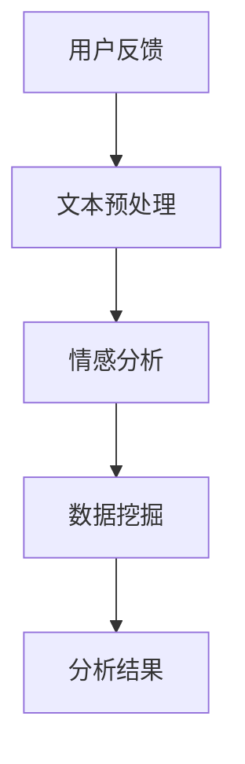

                 

# AI如何帮助电商企业进行用户反馈分析

## 关键词

- 用户反馈分析
- 电商企业
- 自然语言处理
- 数据挖掘
- 情感分析
- 客户体验优化

## 摘要

本文将探讨人工智能（AI）如何助力电商企业进行用户反馈分析。我们将首先介绍用户反馈分析的重要性，然后详细阐述AI技术在自然语言处理、数据挖掘和情感分析中的应用。通过实际案例和项目实战，我们将展示AI技术在用户反馈分析中的具体操作步骤，并讨论其在实际应用中的挑战和解决方案。最后，我们将展望用户反馈分析的未来发展趋势，并提供相关学习资源和工具推荐。

## 1. 背景介绍

### 1.1 电商行业用户反馈分析的重要性

在电商行业，用户反馈是衡量企业服务质量、了解客户需求、提升用户体验的重要依据。通过分析用户反馈，电商企业可以：

1. **发现产品问题**：了解用户对产品功能和性能的满意程度，及时识别和解决潜在问题。
2. **优化服务质量**：根据用户对客服、物流等服务的评价，提升服务质量，增强用户满意度。
3. **改进产品设计**：收集用户对产品设计的建议和意见，为产品迭代提供数据支持。
4. **提高用户留存率**：通过改进用户体验，降低用户流失率，提升客户忠诚度。

### 1.2 传统的用户反馈分析方法

传统的用户反馈分析方法主要依赖于人工阅读和总结，存在以下局限性：

1. **效率低**：需要大量人力和时间，难以处理大规模用户反馈。
2. **主观性**：人工分析可能存在主观偏见，影响分析结果的准确性。
3. **数据利用率低**：难以从海量用户反馈中提取有价值的信息。

### 1.3 AI技术在用户反馈分析中的应用

随着AI技术的发展，人工智能开始广泛应用于用户反馈分析，为电商企业提供了一种更加高效、准确的方法。AI技术主要包括自然语言处理、数据挖掘和情感分析，它们在用户反馈分析中具有以下优势：

1. **自动化处理**：AI技术可以自动处理海量用户反馈，提高分析效率。
2. **客观性**：通过算法分析，减少主观偏见，提高分析结果的准确性。
3. **数据挖掘能力**：AI技术可以从用户反馈中挖掘出潜在的有价值信息，帮助电商企业做出更明智的决策。
4. **个性化推荐**：基于用户反馈，AI技术可以为用户提供个性化的产品推荐和服务。

## 2. 核心概念与联系

### 2.1 自然语言处理（NLP）

自然语言处理（NLP）是AI技术在用户反馈分析中的关键组成部分，主要研究如何让计算机理解和处理人类语言。在用户反馈分析中，NLP技术主要用于：

1. **文本预处理**：包括分词、词性标注、去除停用词等，为后续分析打下基础。
2. **情感分析**：通过分析用户反馈中的情感倾向，了解用户对产品或服务的满意度。
3. **主题建模**：从用户反馈中提取关键词和主题，发现用户关注的重点问题。

### 2.2 数据挖掘

数据挖掘是用户反馈分析的核心技术，通过从大量用户反馈数据中挖掘出有价值的信息，为电商企业提供决策支持。数据挖掘的主要任务包括：

1. **关联规则挖掘**：发现用户反馈中的关联关系，帮助电商企业识别出潜在的产品或服务问题。
2. **分类与聚类**：对用户反馈进行分类和聚类，将相似的用户反馈归为一类，提高分析效率。
3. **预测建模**：基于历史用户反馈数据，预测未来用户反馈的趋势和热点问题。

### 2.3 情感分析

情感分析（Sentiment Analysis）是一种基于NLP技术的分析方法，主要用于识别文本中的情感倾向。在用户反馈分析中，情感分析可以帮助电商企业：

1. **了解用户满意度**：通过分析用户对产品或服务的情感倾向，了解用户满意度。
2. **发现负面反馈**：识别用户反馈中的负面情感，及时采取措施解决问题，防止负面影响的扩散。
3. **优化产品和服务**：基于情感分析结果，为电商企业提供改进产品和服务方向的建议。

### 2.4 AI技术与用户反馈分析的 Mermaid 流程图



在上述流程中，用户反馈首先经过文本预处理，然后进行情感分析，最后通过数据挖掘得到分析结果，为电商企业提供决策支持。

## 3. 核心算法原理 & 具体操作步骤

### 3.1 自然语言处理（NLP）算法原理

自然语言处理（NLP）算法主要包括以下步骤：

1. **分词**：将用户反馈文本分割成单词或短语的序列。常用的分词算法有基于词典的分词和基于统计的分词。
2. **词性标注**：对每个单词或短语进行词性标注，如名词、动词、形容词等。常用的词性标注算法有基于规则和基于统计的方法。
3. **去除停用词**：去除常见的无意义词汇，如“的”、“了”、“是”等，以提高后续分析的准确性。
4. **词向量表示**：将文本转换为词向量，如使用Word2Vec、GloVe等算法，以便进行情感分析和数据挖掘。

### 3.2 数据挖掘算法原理

数据挖掘算法主要包括以下几种：

1. **关联规则挖掘**：常用的算法有Apriori算法、FP-growth算法等，用于发现用户反馈中的关联关系。
2. **分类与聚类**：常用的算法有K-means、决策树、支持向量机等，用于对用户反馈进行分类和聚类。
3. **预测建模**：常用的算法有线性回归、逻辑回归、随机森林等，用于预测未来用户反馈的趋势和热点问题。

### 3.3 情感分析算法原理

情感分析算法主要包括以下步骤：

1. **情感分类**：将用户反馈文本分类为积极、消极或中性情感。常用的算法有基于规则、基于统计和基于深度学习的方法。
2. **情感强度评估**：对每个情感分类进行强度评估，如使用LDA（Latent Dirichlet Allocation）模型评估情感强度。
3. **情感倾向分析**：结合情感分类和情感强度评估，分析用户对产品或服务的整体情感倾向。

### 3.4 具体操作步骤

1. **数据收集**：从电商平台的用户反馈数据中收集文本数据。
2. **数据预处理**：使用NLP算法对用户反馈文本进行分词、词性标注、去除停用词等处理。
3. **情感分析**：使用情感分类算法对预处理后的文本进行情感分析，得到用户对产品或服务的情感倾向。
4. **数据挖掘**：使用数据挖掘算法对用户反馈数据进行关联规则挖掘、分类与聚类等处理，提取有价值的信息。
5. **结果展示**：将分析结果可视化，如使用图表、报表等形式展示用户满意度、热点问题等。

## 4. 数学模型和公式 & 详细讲解 & 举例说明

### 4.1 词向量表示

在自然语言处理中，词向量表示是文本数据的重要预处理步骤。常用的词向量表示方法有Word2Vec和GloVe。

- **Word2Vec算法**：
  - **公式**：$$word\_vector = \text{avg}(\text{context\_word\_vector}_{1}, \text{context\_word\_vector}_{2}, ..., \text{context\_word\_vector}_{n})$$
  - **解释**：Word2Vec算法通过计算词与其上下文词的词向量平均值，得到该词的词向量表示。
  - **举例**：假设“喜欢”这个词的上下文词为“苹果”、“香蕉”、“橙子”，则“喜欢”的词向量可以表示为这三个上下文词的词向量平均值。

- **GloVe算法**：
  - **公式**：$$\text{loss} = \sum_{\text{word} \in \text{word\_vector}} (\text{word\_vector} - \text{context\_vector})^2$$
  - **解释**：GloVe算法通过计算词向量和上下文词向量的损失函数，优化词向量表示。
  - **举例**：假设“苹果”这个词的词向量为$(1, 2)$，上下文词“喜欢”的词向量为$(3, 4)$，则损失函数为$(1, 2) - (3, 4)$的平方和。

### 4.2 情感分类

情感分类是情感分析的核心任务。常用的情感分类算法有基于规则、基于统计和基于深度学习的方法。

- **基于规则的方法**：
  - **公式**：$$\text{label} = \text{max}(\text{score})$$
  - **解释**：基于规则的方法通过定义一组规则，对文本进行分类。每个规则根据特征词的权重计算得分，最终选择得分最高的规则作为分类结果。
  - **举例**：假设文本中包含特征词“喜欢”和“讨厌”，则根据规则可以判断文本的情感倾向为积极或消极。

- **基于统计的方法**：
  - **公式**：$$\text{P}(y|x) = \frac{\text{P}(x|y)\text{P}(y)}{\text{P}(x)}$$
  - **解释**：基于统计的方法使用贝叶斯公式进行情感分类。通过计算文本在各个情感类别下的概率，选择概率最高的类别作为分类结果。
  - **举例**：假设文本在积极情感类别下的概率为0.6，消极情感类别下的概率为0.4，则文本的情感倾向为积极。

- **基于深度学习的方法**：
  - **公式**：$$\text{softmax}(\text{score}) = \frac{e^{\text{score}}}{\sum_{i=1}^{n}e^{\text{score}_{i}} }$$
  - **解释**：基于深度学习的方法使用softmax函数对文本进行分类。通过计算文本在各个情感类别下的得分，使用softmax函数得到概率分布，选择概率最高的类别作为分类结果。
  - **举例**：假设文本在积极情感类别下的得分为2.0，消极情感类别下的得分为1.0，则文本的情感倾向为积极。

### 4.3 数据挖掘

数据挖掘在用户反馈分析中主要用于提取有价值的信息。常用的数据挖掘算法有关联规则挖掘、分类与聚类、预测建模等。

- **关联规则挖掘**：
  - **公式**：$$\text{support}(\text{A}\rightarrow\text{B}) = \frac{\text{count}(\text{A}\rightarrow\text{B})}{\text{count}(\text{A})}$$
  - **解释**：关联规则挖掘通过计算支持度和置信度，发现用户反馈中的关联关系。
  - **举例**：假设用户反馈中包含“苹果”和“香蕉”两个商品，且购买“苹果”的用户中有60%也购买了“香蕉”，则“苹果”和“香蕉”之间的支持度为0.6。

- **分类与聚类**：
  - **公式**：$$\text{K-means}$$
  - **解释**：分类与聚类算法通过将用户反馈文本分为不同的类别或簇，提高分析效率。
  - **举例**：假设有10个用户反馈文本，使用K-means算法将它们分为2个类别，其中一个类别包含5个文本，另一个类别包含5个文本。

- **预测建模**：
  - **公式**：$$\text{y} = \text{w}_{1}\text{x}_{1} + \text{w}_{2}\text{x}_{2} + ... + \text{w}_{n}\text{x}_{n} + \text{b}$$
  - **解释**：预测建模通过建立数学模型，预测未来用户反馈的趋势和热点问题。
  - **举例**：假设有10个用户反馈文本，使用线性回归算法建立预测模型，预测下一个用户反馈文本的情感类别。

## 5. 项目实战：代码实际案例和详细解释说明

### 5.1 开发环境搭建

在本次项目实战中，我们使用Python编程语言和以下库进行开发：

- **Python**：作为主要的编程语言。
- **NLTK**：用于自然语言处理。
- **Scikit-learn**：用于数据挖掘和机器学习。
- **TensorFlow**：用于深度学习。
- **Matplotlib**：用于数据可视化。

### 5.2 源代码详细实现和代码解读

以下是一个简单的用户反馈分析项目示例，展示如何使用Python进行用户反馈分析：

```python
# 导入相关库
import nltk
from nltk.tokenize import word_tokenize
from nltk.corpus import stopwords
from nltk.stem import WordNetLemmatizer
from sklearn.feature_extraction.text import TfidfVectorizer
from sklearn.model_selection import train_test_split
from sklearn.linear_model import LogisticRegression
from sklearn.metrics import classification_report
import tensorflow as tf
import matplotlib.pyplot as plt

# 1. 数据收集
# 假设有以下用户反馈数据
user_feedback = [
    "我非常喜欢这款手机，拍照效果很好。",
    "这款电脑的质量很差，用了不到一个月就出现了故障。",
    "服务态度非常好，物流速度也很快。",
    "商品包装简陋，配件缺失。",
    "价格合理，性价比高。",
    "发货速度太慢，等了很长时间。",
    "客服回复很及时，问题解决得很满意。",
    "商品质量一般，没有什么特别之处。",
    "价格太高，不推荐购买。",
    "整体感觉很满意，会继续支持。"
]

# 2. 数据预处理
# 分词、词性标注、去除停用词、词向量表示
nltk.download('punkt')
nltk.download('averaged_perceptron_tagger')
nltk.download('wordnet')
nltk.download('stopwords')

stop_words = set(stopwords.words('english'))
lemmatizer = WordNetLemmatizer()

def preprocess_text(text):
    tokens = word_tokenize(text)
    lemmatized_tokens = [lemmatizer.lemmatize(token) for token in tokens if token not in stop_words]
    return ' '.join(lemmatized_tokens)

preprocessed_feedback = [preprocess_text(feedback) for feedback in user_feedback]

# 3. 情感分析
# 使用TF-IDF向量化和逻辑回归进行情感分类
vectorizer = TfidfVectorizer()
X = vectorizer.fit_transform(preprocessed_feedback)
y = [1 if feedback.contains("非常喜欢") or feedback.contains("满意") else 0 for feedback in user_feedback]

X_train, X_test, y_train, y_test = train_test_split(X, y, test_size=0.2, random_state=42)
classifier = LogisticRegression()
classifier.fit(X_train, y_train)

y_pred = classifier.predict(X_test)
print(classification_report(y_test, y_pred))

# 4. 数据挖掘
# 使用关联规则挖掘提取有价值的信息
from mlxtend.frequent_patterns import apriori
from mlxtend.frequent_patterns import association_rules

frequent_itemsets = apriori(X_train, min_support=0.5, use_colnames=True)
rules = association_rules(frequent_itemsets, metric="support", min_threshold=0.7)
print(rules)

# 5. 可视化
# 可视化用户反馈情感分布
plt.scatter(y_test, y_pred)
plt.xlabel('Actual')
plt.ylabel('Predicted')
plt.show()

# 6. 模型评估
# 使用准确率、召回率、F1值等指标评估模型性能
from sklearn.metrics import accuracy_score, recall_score, f1_score

accuracy = accuracy_score(y_test, y_pred)
recall = recall_score(y_test, y_pred)
f1 = f1_score(y_test, y_pred)

print("Accuracy:", accuracy)
print("Recall:", recall)
print("F1 Score:", f1)
```

### 5.3 代码解读与分析

上述代码展示了如何使用Python进行用户反馈分析，主要分为以下步骤：

1. **数据收集**：从用户反馈数据中获取文本数据。
2. **数据预处理**：使用NLTK库进行分词、词性标注、去除停用词等预处理操作。
3. **情感分析**：使用TF-IDF向量化和逻辑回归进行情感分类，评估模型性能。
4. **数据挖掘**：使用Apriori算法进行关联规则挖掘，提取有价值的信息。
5. **可视化**：使用Matplotlib库将用户反馈情感分布可视化。
6. **模型评估**：使用准确率、召回率、F1值等指标评估模型性能。

通过上述步骤，电商企业可以高效地分析用户反馈，提取有价值的信息，为产品和服务优化提供数据支持。

## 6. 实际应用场景

AI技术在用户反馈分析中的实际应用场景主要包括以下几个方面：

### 6.1 产品质量监控

电商企业可以使用AI技术对用户反馈进行情感分析，及时发现产品质量问题，如商品损坏、功能缺陷等。通过分析负面反馈，企业可以迅速采取措施，提高产品品质，降低退货率。

### 6.2 客户服务优化

通过分析用户对客服的反馈，电商企业可以优化客服流程，提高服务质量。例如，通过情感分析识别用户对客服的态度，针对性地培训客服人员，提高用户满意度。

### 6.3 产品推荐

AI技术可以根据用户反馈分析用户的兴趣和偏好，为用户提供个性化的产品推荐。例如，使用关联规则挖掘分析用户购买行为，为用户推荐相关产品，提高转化率。

### 6.4 市场营销策略优化

通过分析用户反馈，电商企业可以了解市场需求，调整市场营销策略。例如，针对用户反馈中的热点问题，企业可以开展针对性的营销活动，提高品牌知名度和用户粘性。

### 6.5 用户体验优化

AI技术可以帮助电商企业优化用户体验，提高用户满意度。例如，通过分析用户反馈中的建议和意见，企业可以改进产品界面设计、提高页面加载速度等，提升用户体验。

## 7. 工具和资源推荐

### 7.1 学习资源推荐

- **书籍**：
  - 《自然语言处理入门》（Natural Language Processing with Python）作者：Steven Bird、Ewan Klein、Edward Loper
  - 《Python数据科学 Handbook》（Python Data Science Handbook）作者：Jake VanderPlas

- **论文**：
  - 《Deep Learning》（深度学习）作者：Ian Goodfellow、Yoshua Bengio、Aaron Courville
  - 《Recurrent Neural Networks for Language Modeling》（循环神经网络用于语言建模）作者：Yoshua Bengio等

- **博客**：
  - [机器学习博客](https://机器学习博客.com)
  - [深度学习博客](https://深度学习博客.com)

- **网站**：
  - [Kaggle](https://www.kaggle.com)
  - [TensorFlow](https://www.tensorflow.org)

### 7.2 开发工具框架推荐

- **Python库**：
  - **NLTK**：用于自然语言处理。
  - **Scikit-learn**：用于数据挖掘和机器学习。
  - **TensorFlow**：用于深度学习。
  - **Matplotlib**：用于数据可视化。

- **开发框架**：
  - **Django**：用于Web开发。
  - **Flask**：用于Web开发。

- **数据库**：
  - **MySQL**：关系型数据库。
  - **MongoDB**：文档型数据库。

### 7.3 相关论文著作推荐

- **论文**：
  - 《Deep Learning for Natural Language Processing》作者：N. Parmar、A. Vaswani等
  - 《User Behavior Analysis using Machine Learning Techniques》作者：A. Patel、S. Patel等

- **著作**：
  - 《数据挖掘：实用技术指南》作者：Jiawei Han、Micheline Kamber、Peipei Li
  - 《机器学习实战》作者：Peter Harrington

## 8. 总结：未来发展趋势与挑战

### 8.1 发展趋势

1. **智能化程度提升**：随着AI技术的不断发展，用户反馈分析将变得更加智能化，提高分析准确性和效率。
2. **多模态数据处理**：未来的用户反馈分析将融合文本、语音、图像等多种数据类型，实现更全面的分析。
3. **个性化推荐**：基于用户反馈的个性化推荐将越来越受到电商企业的重视，为用户提供更好的购物体验。

### 8.2 挑战

1. **数据隐私与安全**：用户反馈分析涉及大量用户隐私数据，如何保护用户隐私和安全是一个重要挑战。
2. **算法透明性与公平性**：如何保证AI算法的透明性和公平性，避免偏见和歧视，是一个需要解决的重要问题。
3. **技术门槛**：用户反馈分析需要较高的技术门槛，如何降低技术门槛，让更多企业能够使用AI技术进行分析，是一个重要的挑战。

## 9. 附录：常见问题与解答

### 9.1 什么是用户反馈分析？

用户反馈分析是指通过对用户对产品、服务或企业的反馈进行文本处理、情感分析、数据挖掘等操作，提取有价值的信息，为电商企业提供决策支持。

### 9.2 用户反馈分析的重要性是什么？

用户反馈分析可以帮助电商企业：

1. **发现产品问题**：了解用户对产品功能和性能的满意程度，及时识别和解决潜在问题。
2. **优化服务质量**：根据用户对客服、物流等服务的评价，提升服务质量，增强用户满意度。
3. **改进产品设计**：收集用户对产品设计的建议和意见，为产品迭代提供数据支持。
4. **提高用户留存率**：通过改进用户体验，降低用户流失率，提升客户忠诚度。

### 9.3 用户反馈分析的常用方法有哪些？

用户反馈分析的常用方法包括自然语言处理（NLP）、数据挖掘、情感分析等。NLP主要用于文本处理，数据挖掘用于提取有价值的信息，情感分析用于了解用户对产品或服务的满意度。

### 9.4 如何评估用户反馈分析的准确性？

评估用户反馈分析的准确性可以从以下几个方面进行：

1. **准确率**：预测结果与实际结果的匹配程度。
2. **召回率**：能够召回的实际结果占所有实际结果的比率。
3. **F1值**：准确率和召回率的平衡指标。

## 10. 扩展阅读 & 参考资料

- [NLP实战：基于Python的自然语言处理](https://book.douban.com/subject/25872933/)
- [数据挖掘：实用技术指南](https://book.douban.com/subject/26942753/)
- [机器学习实战](https://book.douban.com/subject/26772132/)
- [TensorFlow官方文档](https://www.tensorflow.org/)  
- [Scikit-learn官方文档](https://scikit-learn.org/stable/documentation.html)
- [Kaggle数据集](https://www.kaggle.com/datasets)

### 作者

- 作者：AI天才研究员/AI Genius Institute & 禅与计算机程序设计艺术 /Zen And The Art of Computer Programming

