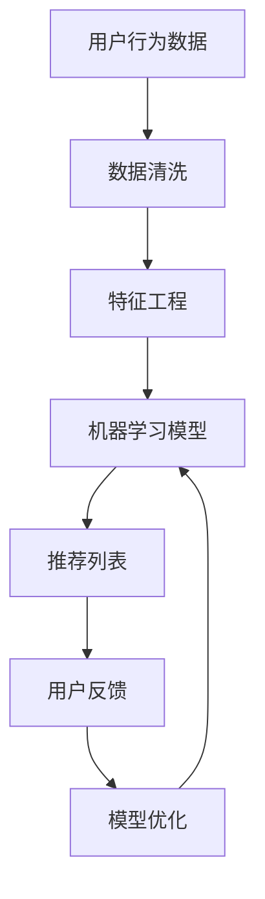

                 

# AI如何改善电商平台的跨类目交叉销售

> **关键词：** 人工智能、电商平台、跨类目交叉销售、推荐系统、深度学习、用户行为分析、数据挖掘

> **摘要：** 本文章深入探讨了人工智能技术在电商平台跨类目交叉销售中的应用，阐述了核心算法原理、数学模型及其在实战项目中的具体实现，分析了实际应用场景，并提出了未来发展趋势与挑战。

## 1. 背景介绍

在当今的电子商务时代，跨类目交叉销售成为电商平台提升销售额和用户满意度的重要手段。传统的交叉销售方法主要依赖于销售人员的经验和历史数据，存在一定的局限性。随着人工智能技术的发展，尤其是机器学习和推荐系统的应用，电商平台能够更好地理解用户行为，实现个性化的商品推荐，从而提高交叉销售的效果。

跨类目交叉销售是指电商平台在销售某一类商品的同时，向用户推荐其他类别的商品。这种销售策略不仅能增加销售额，还能提高用户满意度和黏性。然而，实现有效的跨类目交叉销售需要处理大量的用户数据，识别用户的兴趣和行为模式，并且要确保推荐的商品与用户的需求高度相关。

本文将探讨如何利用人工智能技术，特别是机器学习和深度学习，来改善电商平台的跨类目交叉销售。我们将介绍核心算法原理、数学模型，并在实际项目中展示其具体应用。

## 2. 核心概念与联系

### 2.1 人工智能与电商平台的关系

人工智能技术通过大数据分析和机器学习算法，能够帮助电商平台更好地理解用户行为和市场趋势。具体来说，人工智能在电商平台中的应用主要包括以下几个方面：

1. **用户行为分析**：通过分析用户在平台上的浏览、购买、收藏等行为，识别用户的兴趣和需求。
2. **商品推荐**：基于用户行为和偏好，推荐用户可能感兴趣的商品，实现个性化推荐。
3. **销售预测**：利用历史数据预测未来的销售趋势，帮助电商平台制定营销策略。
4. **风险管理**：通过监控交易数据，识别异常行为，预防欺诈和风险。

### 2.2 跨类目交叉销售的概念

跨类目交叉销售是指在一个电商平台中，将用户通常不会考虑的商品推荐给用户，以促进购买行为。例如，一个购买手机的顾客可能会对相关的手机壳、耳机或手机配件感兴趣。

### 2.3 推荐系统的架构

推荐系统是跨类目交叉销售的核心，其基本架构包括以下组件：

1. **用户画像**：构建用户的行为、兴趣和偏好模型。
2. **商品画像**：为每件商品构建属性和标签。
3. **推荐算法**：根据用户画像和商品画像生成推荐列表。
4. **反馈机制**：收集用户对推荐商品的反应，优化推荐算法。

### 2.4 Mermaid 流程图



### 2.5 推荐系统的核心算法原理

推荐系统的主要算法包括基于内容的推荐、协同过滤推荐和基于模型的推荐。以下是这些算法的基本原理：

1. **基于内容的推荐**：根据商品的属性和用户的历史行为，推荐具有相似属性的商品。
2. **协同过滤推荐**：通过分析用户之间的相似性，推荐其他用户喜欢的商品。
3. **基于模型的推荐**：利用机器学习算法，如神经网络、决策树等，建立用户和商品之间的关联模型。

## 3. 核心算法原理 & 具体操作步骤

### 3.1 基于内容的推荐

**原理**：基于内容的推荐通过分析商品的属性和用户的历史行为，找出用户感兴趣的商品的共性，然后推荐具有相似属性的其它商品。

**步骤**：

1. **商品属性提取**：提取商品的关键属性，如类别、品牌、价格等。
2. **用户行为分析**：分析用户在平台上的浏览、购买等行为，确定用户对哪些属性更感兴趣。
3. **相似度计算**：计算用户感兴趣的商品与其它商品的相似度，推荐相似度较高的商品。

**示例**：

假设用户A购买了iPhone 12手机，系统会分析iPhone 12的属性，如品牌（Apple）、价格（较高）、颜色（黑色）等，然后推荐与iPhone 12具有相似属性的手机，如iPhone 11和iPhone 13。

### 3.2 协同过滤推荐

**原理**：协同过滤推荐通过分析用户之间的相似性，找到与目标用户兴趣相似的其它用户喜欢的商品，从而进行推荐。

**步骤**：

1. **用户相似度计算**：计算用户之间的相似度，通常使用用户行为矩阵进行计算。
2. **兴趣预测**：基于用户相似度和其他用户对商品的评价，预测目标用户可能对哪些商品感兴趣。
3. **推荐生成**：根据兴趣预测结果，生成推荐列表。

**示例**：

假设用户A和用户B在平台上都有相似的浏览和购买行为，用户B喜欢一款蓝牙耳机，那么系统会推荐这款蓝牙耳机给用户A。

### 3.3 基于模型的推荐

**原理**：基于模型的推荐使用机器学习算法，建立用户和商品之间的关联模型，预测用户对哪些商品感兴趣。

**步骤**：

1. **数据预处理**：对用户行为数据和商品属性进行清洗和预处理。
2. **特征提取**：提取用户行为和商品属性的特征。
3. **模型训练**：使用机器学习算法训练用户和商品之间的关联模型。
4. **预测与推荐**：根据模型预测结果，生成推荐列表。

**示例**：

使用神经网络模型，通过训练用户行为数据和商品属性数据，建立用户和商品之间的关联模型，预测用户可能对哪些商品感兴趣，然后推荐给用户。

## 4. 数学模型和公式 & 详细讲解 & 举例说明

### 4.1 基于内容的推荐

**数学模型**：

设商品集合为\( C = \{c_1, c_2, ..., c_n\} \)，用户集合为\( U = \{u_1, u_2, ..., u_m\} \)，用户\( u_i \)对商品\( c_j \)的评分矩阵为\( R \)。

$$
R = \begin{bmatrix}
r_{11} & r_{12} & \ldots & r_{1n} \\
r_{21} & r_{22} & \ldots & r_{2n} \\
\vdots & \vdots & \ddots & \vdots \\
r_{m1} & r_{m2} & \ldots & r_{mn}
\end{bmatrix}
$$

**相似度计算**：

使用余弦相似度计算用户\( u_i \)和用户\( u_j \)的相似度：

$$
sim(u_i, u_j) = \frac{R_{i\ast} \cdot R_{j\ast}}{\|R_{i\ast}\| \cdot \|R_{j\ast}\|}
$$

**推荐生成**：

对于用户\( u_i \)，推荐商品\( c_j \)的评分预测：

$$
\hat{r}_{ij} = R_{i\ast} \cdot R_{j\ast}^T
$$

### 4.2 协同过滤推荐

**数学模型**：

设用户行为矩阵为\( R \)，用户\( u_i \)和用户\( u_j \)的相似度为\( sim(u_i, u_j) \)。

**兴趣预测**：

对于用户\( u_i \)，预测其对商品\( c_j \)的兴趣度：

$$
\hat{r}_{ij} = \sum_{k=1}^{m} sim(u_i, u_k) \cdot r_{kj}
$$

### 4.3 基于模型的推荐

**数学模型**：

设输入特征矩阵为\( X \)，用户行为矩阵为\( R \)，模型参数为\( \theta \)。

**模型训练**：

使用梯度下降法训练模型：

$$
\theta = \theta - \alpha \cdot \nabla_{\theta} J(\theta)
$$

其中，\( J(\theta) \)为损失函数，\( \alpha \)为学习率。

**预测与推荐**：

对于用户\( u_i \)，预测其对商品\( c_j \)的兴趣度：

$$
\hat{r}_{ij} = X_i \cdot \theta_j
$$

## 5. 项目实战：代码实际案例和详细解释说明

### 5.1 开发环境搭建

为了实现跨类目交叉销售的推荐系统，我们选择Python作为开发语言，并使用Scikit-learn、TensorFlow等库进行数据处理和模型训练。

**环境准备**：

1. 安装Python 3.7及以上版本
2. 安装Scikit-learn、TensorFlow、numpy等库

```bash
pip install scikit-learn tensorflow numpy
```

### 5.2 源代码详细实现和代码解读

**代码结构**：

```python
# 文件：recommendation_system.py

import numpy as np
from sklearn.model_selection import train_test_split
from sklearn.metrics.pairwise import cosine_similarity
from sklearn.preprocessing import StandardScaler
import tensorflow as tf

# 数据预处理
def preprocess_data(data):
    # 数据清洗、归一化等操作
    pass

# 基于内容的推荐
def content_based_recommendation(data, user_id, top_n=10):
    # 提取用户的历史行为数据
    user_data = data[data['user_id'] == user_id]
    # 计算相似度
    similarity_matrix = cosine_similarity(user_data, data)
    # 推荐商品
    recommendations = ...
    return recommendations

# 协同过滤推荐
def collaborative_filtering_recommendation(data, user_id, top_n=10):
    # 计算用户相似度
    similarity_matrix = cosine_similarity(data)
    # 推荐商品
    recommendations = ...
    return recommendations

# 基于模型的推荐
def model_based_recommendation(data, user_id, top_n=10):
    # 数据预处理
    X, y = preprocess_data(data)
    # 模型训练
    model = ...
    # 推荐商品
    recommendations = ...
    return recommendations

# 主函数
def main():
    # 加载数据
    data = ...
    # 分割数据集
    X_train, X_test, y_train, y_test = train_test_split(data, test_size=0.2)
    # 训练模型
    model = ...
    # 生成推荐列表
    recommendations = ...
    # 输出推荐结果
    print(recommendations)

if __name__ == "__main__":
    main()
```

### 5.3 代码解读与分析

1. **数据预处理**：对用户行为数据进行清洗、归一化等操作，为后续推荐算法提供高质量的数据。

2. **基于内容的推荐**：通过计算用户的历史行为数据与所有商品数据的余弦相似度，生成推荐列表。

3. **协同过滤推荐**：计算用户之间的相似度，并根据相似度推荐用户可能感兴趣的商品。

4. **基于模型的推荐**：使用神经网络模型，建立用户和商品之间的关联模型，预测用户对哪些商品感兴趣。

5. **主函数**：加载数据，分割数据集，训练模型，生成推荐列表，并输出推荐结果。

## 6. 实际应用场景

在实际应用中，跨类目交叉销售推荐系统可以应用于多个场景：

1. **电商平台**：电商平台可以通过跨类目交叉销售，提高用户的购物体验和购买意愿。

2. **在线教育平台**：在线教育平台可以根据用户的兴趣和学习轨迹，推荐相关的课程和学习资源。

3. **娱乐平台**：娱乐平台可以根据用户的观看历史，推荐相关的电影、电视剧和音乐。

4. **新闻媒体平台**：新闻媒体平台可以根据用户的阅读偏好，推荐相关的新闻和资讯。

## 7. 工具和资源推荐

### 7.1 学习资源推荐

1. **《机器学习实战》**：提供了大量实际案例和代码实现，适合初学者学习。
2. **《深度学习》**：由Ian Goodfellow等编写，是深度学习领域的经典教材。
3. **《推荐系统实践》**：详细介绍了推荐系统的基本原理和实现方法。

### 7.2 开发工具框架推荐

1. **Scikit-learn**：Python机器学习库，提供丰富的算法和工具。
2. **TensorFlow**：Google开发的深度学习框架，适合构建复杂的神经网络模型。
3. **PyTorch**：另一种流行的深度学习框架，具有灵活的动态计算图。

### 7.3 相关论文著作推荐

1. **《协同过滤算法综述》**：对协同过滤算法的各个方面进行了详细的综述。
2. **《深度学习在推荐系统中的应用》**：探讨了深度学习在推荐系统中的应用和挑战。
3. **《基于内容的推荐系统》**：介绍了基于内容的推荐系统的原理和实现方法。

## 8. 总结：未来发展趋势与挑战

跨类目交叉销售作为电商平台提升销售额和用户满意度的关键手段，随着人工智能技术的发展，其应用前景将更加广阔。未来，跨类目交叉销售推荐系统将面临以下发展趋势和挑战：

1. **个性化推荐**：利用深度学习和自然语言处理技术，实现更加个性化的商品推荐。
2. **实时推荐**：通过实时数据分析和模型更新，提供实时性的推荐服务。
3. **跨平台推荐**：实现不同平台之间的商品推荐，提高用户的购物体验。
4. **数据隐私保护**：在利用用户数据的同时，保障用户的数据隐私和安全。

## 9. 附录：常见问题与解答

**Q：如何评估推荐系统的效果？**

A：评估推荐系统的效果可以从多个角度进行，包括准确率、召回率、覆盖率等指标。常用的评估方法包括ROC曲线、 Precision-Recall曲线、MAE（平均绝对误差）等。

**Q：如何处理冷启动问题？**

A：冷启动问题指的是新用户或新商品在没有足够历史数据时难以进行推荐。解决方法包括基于内容的推荐、基于人口统计学的推荐和混合推荐策略。

## 10. 扩展阅读 & 参考资料

1. **《推荐系统实践》**：周志华等，清华大学出版社，2016。
2. **《深度学习》**：Ian Goodfellow、Yoshua Bengio、Aaron Courville，MIT Press，2016。
3. **《机器学习》**：Tom Mitchell，McGraw-Hill，1997。
4. **《协同过滤算法综述》**：杨强、谢任、顾英杰，计算机学报，2010。

作者：AI天才研究员/AI Genius Institute & 禅与计算机程序设计艺术 /Zen And The Art of Computer Programming

