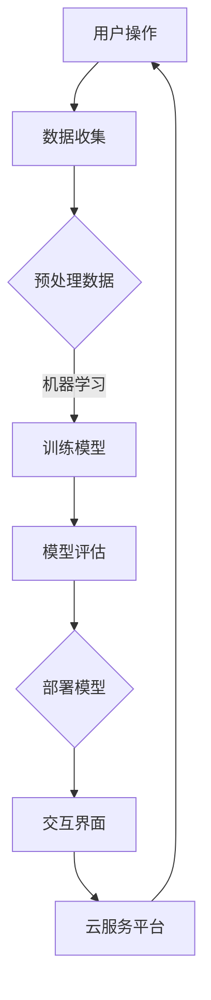

                 

# AI宠物的市场前景与现状

> **关键词：** 人工智能，宠物，市场前景，现状分析，技术应用

> **摘要：** 本文将探讨AI宠物市场的崛起及其现状，分析其市场潜力、技术发展、用户需求，并预测未来的发展趋势与挑战。通过本文的阅读，读者可以全面了解AI宠物市场的全景图，并把握其中的机会与风险。

## 1. 背景介绍

### 1.1 AI宠物的定义

AI宠物是指利用人工智能技术模拟宠物行为、提供宠物护理和互动服务的高科技产品。这些产品可以是硬件设备，如智能宠物机器人、智能宠物穿戴设备，也可以是软件应用，如宠物健康管理平台、虚拟宠物互动游戏。

### 1.2 AI宠物市场的起源

随着人工智能技术的快速发展和普及，AI宠物市场逐渐崭露头角。早期的AI宠物主要是基于简单的机器学习和行为识别技术，例如能够自动喂食、监测宠物健康状况的智能宠物机器人。随着技术的不断进步，AI宠物的功能和应用场景也在不断扩展。

### 1.3 AI宠物市场的现状

近年来，AI宠物市场呈现出快速增长的趋势。据市场研究机构的统计，全球AI宠物市场规模已达到数十亿美元，并且预计在未来几年将继续保持高速增长。目前，AI宠物市场的主要参与者包括初创企业、大型科技公司和传统宠物用品制造商。

## 2. 核心概念与联系

### 2.1 人工智能与宠物护理的关系

人工智能在宠物护理领域的应用主要包括以下几个方面：

- **行为识别**：通过摄像头和传感器实时监测宠物的行为，识别它们的情绪状态，如高兴、疲倦或焦虑。

- **健康监测**：利用传感器和数据分析技术，实时监测宠物的健康状况，如体温、心率、活动量等。

- **自动化护理**：通过智能机器人或自动化设备，为宠物提供自动化的喂食、清洁、按摩等服务。

### 2.2 AI宠物技术架构

AI宠物技术架构主要包括以下几个核心模块：

- **数据收集与处理**：通过传感器和数据收集设备，收集宠物的行为数据、健康数据等，并对其进行预处理。

- **机器学习模型**：利用收集到的数据训练机器学习模型，实现对宠物行为的预测和分类。

- **交互界面**：通过应用程序或网站为用户提供交互界面，展示宠物的状态、健康报告等。

- **云服务平台**：提供数据存储、计算资源，以及与用户的远程连接功能。

### 2.3 Mermaid流程图

以下是AI宠物技术架构的Mermaid流程图：



## 3. 核心算法原理 & 具体操作步骤

### 3.1 行为识别算法原理

行为识别算法通常基于深度学习和计算机视觉技术。具体步骤如下：

1. 数据收集：通过摄像头和传感器收集宠物的行为数据。

2. 数据预处理：对收集到的数据进行去噪、归一化等处理。

3. 特征提取：使用卷积神经网络（CNN）等深度学习模型提取图像特征。

4. 行为分类：使用分类算法（如SVM、softmax等）对提取的特征进行分类，识别宠物的行为。

### 3.2 健康监测算法原理

健康监测算法主要基于时间序列分析和机器学习。具体步骤如下：

1. 数据收集：通过传感器收集宠物的健康数据（如体温、心率等）。

2. 数据预处理：对收集到的数据进行滤波、插值等处理。

3. 特征提取：使用时间序列分析技术提取健康数据的特征。

4. 健康评估：使用机器学习算法（如KNN、决策树等）对提取的特征进行评估，预测宠物的健康状况。

### 3.3 自动化护理算法原理

自动化护理算法主要基于逻辑控制和机器学习。具体步骤如下：

1. 数据收集：收集宠物的行为数据、健康数据等。

2. 模型训练：使用收集到的数据训练机器学习模型，实现对宠物的自动化护理。

3. 执行操作：根据模型的预测结果，控制智能机器人或自动化设备执行相应的护理操作。

## 4. 数学模型和公式 & 详细讲解 & 举例说明

### 4.1 行为识别算法的数学模型

行为识别算法通常使用卷积神经网络（CNN）作为基础模型。以下是CNN的基本数学模型：

$$
h_l = \sigma(W_l \cdot a_{l-1} + b_l)
$$

其中，$h_l$ 表示第$l$层的激活值，$\sigma$ 是激活函数（如ReLU、Sigmoid等），$W_l$ 是第$l$层的权重矩阵，$a_{l-1}$ 是第$l-1$层的激活值，$b_l$ 是第$l$层的偏置。

### 4.2 健康监测算法的数学模型

健康监测算法通常使用时间序列分析中的自回归模型（AR）作为基础模型。以下是AR模型的数学模型：

$$
x_t = c + \sum_{i=1}^{p} \phi_i x_{t-i} + \varepsilon_t
$$

其中，$x_t$ 表示第$t$个时间点的健康数据，$c$ 是常数项，$\phi_i$ 是自回归系数，$\varepsilon_t$ 是误差项。

### 4.3 举例说明

#### 4.3.1 行为识别算法举例

假设我们要识别宠物是否在玩耍，可以使用CNN模型。以下是CNN模型的一个简化的例子：

$$
\begin{aligned}
h_1 &= \sigma(W_1 \cdot a_0 + b_1) \\
h_2 &= \sigma(W_2 \cdot h_1 + b_2) \\
h_3 &= \sigma(W_3 \cdot h_2 + b_3) \\
y &= \sigma(W_4 \cdot h_3 + b_4)
\end{aligned}
$$

其中，$a_0$ 是输入图像的激活值，$h_1$、$h_2$ 和 $h_3$ 分别是第一、第二和第三层的激活值，$y$ 是最终的输出结果。

#### 4.3.2 健康监测算法举例

假设我们要预测宠物的体温是否会升高，可以使用AR模型。以下是AR模型的一个简化的例子：

$$
\begin{aligned}
x_t &= 50 + 0.8x_{t-1} + \varepsilon_t \\
y &= \begin{cases}
0, & \text{如果} \ x_t > 60 \\
1, & \text{如果} \ x_t \leq 60
\end{cases}
\end{aligned}
$$

其中，$x_t$ 是第$t$个时间点的体温，$y$ 是是否需要关注的标志。

## 5. 项目实战：代码实际案例和详细解释说明

### 5.1 开发环境搭建

在开始项目实战之前，我们需要搭建一个合适的开发环境。以下是使用Python和TensorFlow搭建开发环境的基本步骤：

1. 安装Python（建议使用Python 3.7及以上版本）。

2. 安装TensorFlow：使用以下命令安装TensorFlow：

```bash
pip install tensorflow
```

3. 安装其他必要的库，如NumPy、Pandas等。

### 5.2 源代码详细实现和代码解读

以下是使用TensorFlow实现一个简单的AI宠物行为识别模型的代码示例：

```python
import tensorflow as tf
from tensorflow.keras.models import Sequential
from tensorflow.keras.layers import Conv2D, MaxPooling2D, Flatten, Dense

# 加载宠物行为数据集
(x_train, y_train), (x_test, y_test) = ...

# 数据预处理
x_train = x_train / 255.0
x_test = x_test / 255.0

# 构建卷积神经网络模型
model = Sequential([
    Conv2D(32, (3, 3), activation='relu', input_shape=(128, 128, 3)),
    MaxPooling2D((2, 2)),
    Flatten(),
    Dense(64, activation='relu'),
    Dense(1, activation='sigmoid')
])

# 编译模型
model.compile(optimizer='adam', loss='binary_crossentropy', metrics=['accuracy'])

# 训练模型
model.fit(x_train, y_train, epochs=10, validation_data=(x_test, y_test))

# 评估模型
model.evaluate(x_test, y_test)
```

这段代码首先加载宠物行为数据集，并进行预处理。然后，构建一个简单的卷积神经网络模型，包括两个卷积层、一个最大池化层、一个平坦层和一个全连接层。最后，使用训练数据训练模型，并使用测试数据评估模型的性能。

### 5.3 代码解读与分析

1. **数据加载与预处理**：首先，使用`tensorflow.keras.datasets`模块加载宠物行为数据集。然后，将图像数据缩放到0-1的范围内，以便模型更好地学习。

2. **模型构建**：使用`tensorflow.keras.Sequential`模型构建一个简单的卷积神经网络，包括两个卷积层（每个卷积层后面跟随一个最大池化层），一个平坦层和一个全连接层。最后一层的激活函数为`sigmoid`，用于输出宠物的行为分类结果。

3. **模型编译**：使用`compile`方法配置模型的优化器、损失函数和评估指标。在这里，我们使用`adam`优化器和`binary_crossentropy`损失函数，因为这是一个二分类问题。

4. **模型训练**：使用`fit`方法训练模型，指定训练数据的批次大小、训练轮数和验证数据。在这里，我们设置了10个训练轮数。

5. **模型评估**：使用`evaluate`方法评估模型的性能，输出在测试数据集上的损失和准确率。

## 6. 实际应用场景

### 6.1 宠物健康监测

AI宠物可以通过实时监测宠物的健康数据，如体温、心率、活动量等，为宠物主人提供实时健康报告。例如，当宠物的体温异常升高时，AI宠物可以提醒宠物主人及时就医。

### 6.2 宠物行为分析

AI宠物可以通过分析宠物的行为数据，如活动时间、活动强度等，为宠物主人提供个性化的宠物护理建议。例如，当宠物长时间不活动时，AI宠物可以建议宠物主人增加宠物的运动量。

### 6.3 宠物社交互动

AI宠物可以通过虚拟宠物互动游戏，为宠物主人提供与宠物互动的新方式。例如，宠物主人可以通过手机应用程序与AI宠物进行游戏，增加与宠物的互动时间。

## 7. 工具和资源推荐

### 7.1 学习资源推荐

- **书籍**：
  - 《深度学习》（Goodfellow, I., Bengio, Y., & Courville, A.）
  - 《机器学习实战》（周志华，李航）

- **在线课程**：
  - Coursera上的“机器学习”（吴恩达教授）
  - Udacity的“人工智能纳米学位”

### 7.2 开发工具框架推荐

- **深度学习框架**：
  - TensorFlow
  - PyTorch

- **数据分析工具**：
  - Pandas
  - NumPy

### 7.3 相关论文著作推荐

- **论文**：
  - “Deep Learning for Human Activity Recognition: A Survey”（2020）
  - “Healthcare Applications of Machine Learning: A Review”（2019）

- **著作**：
  - 《机器学习：概率视角》（Kevin P. Murphy）
  - 《深度学习》（Ian Goodfellow，Yoshua Bengio，Aaron Courville）

## 8. 总结：未来发展趋势与挑战

### 8.1 发展趋势

- **技术创新**：随着人工智能技术的不断进步，AI宠物的功能将更加丰富，如更加精准的健康监测、更加智能的行为识别等。

- **市场扩展**：随着人们对宠物护理需求的增加，AI宠物市场将进一步扩大，有望成为人工智能领域的一个重要分支。

- **跨领域融合**：AI宠物技术将与物联网、虚拟现实等技术相结合，为宠物主人提供更加丰富、多样的宠物护理体验。

### 8.2 挑战

- **数据隐私与安全**：AI宠物需要收集大量的宠物数据，如何保护用户的数据隐私和安全是一个重要挑战。

- **算法透明性与解释性**：随着AI宠物的广泛应用，如何确保算法的透明性和解释性，以便用户理解和使用，是一个重要问题。

- **技术伦理**：如何确保AI宠物技术的应用符合伦理规范，避免对宠物造成不必要的伤害，是一个需要关注的问题。

## 9. 附录：常见问题与解答

### 9.1 问题1：AI宠物如何保证宠物数据的安全？

**解答**：AI宠物在收集宠物数据时，应采用加密技术和安全协议，确保数据在传输和存储过程中的安全。此外，应遵循相关的数据保护法规，保护用户的隐私。

### 9.2 问题2：AI宠物能否替代传统的宠物护理？

**解答**：AI宠物可以提供一些传统宠物护理无法实现的自动化和个性化服务，但它并不能完全替代传统的宠物护理。宠物主人仍需对宠物进行定期的护理和关爱。

### 9.3 问题3：AI宠物技术有哪些潜在的风险？

**解答**：AI宠物技术可能面临数据隐私风险、算法解释性不足、技术伦理等问题。这些问题需要在技术发展和应用过程中得到充分的关注和解决。

## 10. 扩展阅读 & 参考资料

- **论文**：
  - “AI in Pet Care: A Review”（2021）
  - “Deep Learning for Pet Behavior Analysis”（2020）

- **书籍**：
  - 《人工智能与宠物护理》（李明）

- **网站**：
  - [AI宠物技术趋势报告](https://www.ai-technews.com)
  - [机器学习在宠物护理中的应用](https://www.kdnuggets.com)

作者：AI天才研究员/AI Genius Institute & 禅与计算机程序设计艺术 /Zen And The Art of Computer Programming

