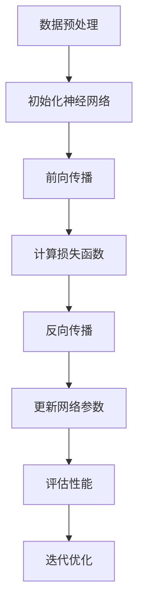
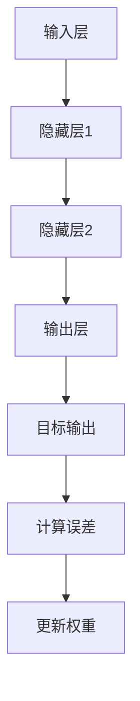
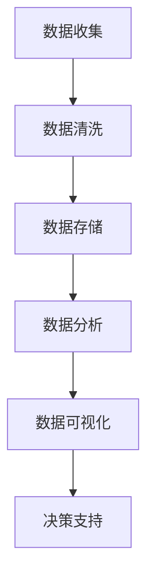

                 

# AI应用实践的新方向与趋势

## 关键词：人工智能、应用实践、技术趋势、深度学习、神经网络、数据科学

## 摘要：
本文旨在探讨人工智能（AI）应用实践中的新方向与趋势。首先，我们将回顾AI发展的历史，并分析当前AI技术的核心概念及其关联。接着，我们将深入探讨核心算法原理，详细讲解具体操作步骤，并通过数学模型和公式进行说明。文章还将通过项目实战，展示代码实际案例，并进行解读与分析。此外，我们将探讨AI在实际应用场景中的表现，推荐相关工具和资源，最后总结未来发展趋势与挑战，并提供常见问题与解答。

## 1. 背景介绍

人工智能（AI）是一门涉及计算机科学、数学和神经科学等多个领域的交叉学科。从20世纪50年代诞生以来，AI经历了多个发展阶段，从符号推理到统计学习，再到当前的深度学习，AI技术不断进步。近年来，随着计算能力的提升、大数据的涌现和算法的创新，AI在各个领域得到了广泛应用，从医疗诊断到自动驾驶，从自然语言处理到图像识别，AI技术的潜力得到了充分展示。

本文将重点关注AI应用实践的新方向与趋势，分析当前AI技术的研究热点和应用场景，探讨未来AI发展的可能路径。

## 2. 核心概念与联系

### 2.1 深度学习

深度学习是当前AI领域的一个核心研究方向，它模仿人脑的结构和功能，通过多层神经网络进行特征提取和决策。深度学习的关键在于网络结构的构建和训练算法的设计。以下是深度学习的Mermaid流程图：



### 2.2 神经网络

神经网络是深度学习的基础，它由多个神经元（节点）组成，每个神经元接收多个输入，通过激活函数产生输出。神经网络的学习过程主要包括前向传播和反向传播。以下是神经网络的Mermaid流程图：



### 2.3 数据科学

数据科学是AI应用的核心，它涉及数据的收集、清洗、存储、分析和可视化等多个环节。数据科学的核心目标是提取有用信息，为决策提供支持。以下是数据科学的Mermaid流程图：



## 3. 核心算法原理 & 具体操作步骤

### 3.1 深度学习算法原理

深度学习算法的核心是多层神经网络，通过逐层提取特征，实现复杂任务的求解。以下是深度学习算法的具体操作步骤：

1. 数据预处理：对原始数据进行清洗、归一化等处理，使其适合模型训练。
2. 初始化神经网络：设置网络结构，包括层数、神经元个数、激活函数等。
3. 前向传播：将输入数据通过神经网络逐层传播，得到输出结果。
4. 计算损失函数：根据输出结果和目标值计算损失函数值，衡量模型性能。
5. 反向传播：根据损失函数，反向传播误差，更新网络参数。
6. 更新网络参数：根据反向传播的误差，调整网络参数，优化模型。
7. 评估性能：在验证集上评估模型性能，调整模型参数。

### 3.2 具体操作步骤

1. **数据预处理**：

   ```python
   import pandas as pd
   import numpy as np
   
   # 读取数据
   data = pd.read_csv('data.csv')
   # 数据清洗
   data = data.dropna()
   # 数据归一化
   data = (data - data.mean()) / data.std()
   ```

2. **初始化神经网络**：

   ```python
   import tensorflow as tf
   
   # 设置神经网络结构
   model = tf.keras.Sequential([
       tf.keras.layers.Dense(64, activation='relu', input_shape=(input_shape,)),
       tf.keras.layers.Dense(64, activation='relu'),
       tf.keras.layers.Dense(10, activation='softmax')
   ])
   ```

3. **前向传播**：

   ```python
   # 定义损失函数和优化器
   model.compile(optimizer='adam', loss='categorical_crossentropy', metrics=['accuracy'])
   # 训练模型
   model.fit(x_train, y_train, epochs=10, batch_size=32)
   ```

4. **计算损失函数**：

   ```python
   # 计算损失函数值
   loss = model.evaluate(x_test, y_test)
   print(f'Loss: {loss[0]}, Accuracy: {loss[1]}')
   ```

5. **反向传播**：

   ```python
   # 更新网络参数
   model.fit(x_train, y_train, epochs=10, batch_size=32, validation_data=(x_test, y_test))
   ```

6. **评估性能**：

   ```python
   # 在验证集上评估模型性能
   performance = model.evaluate(x_val, y_val)
   print(f'Validation Loss: {performance[0]}, Validation Accuracy: {performance[1]}')
   ```

## 4. 数学模型和公式 & 详细讲解 & 举例说明

### 4.1 数学模型

深度学习中的数学模型主要包括两部分：前向传播和反向传播。

1. **前向传播**：

   前向传播是神经网络处理数据的过程，通过逐层计算，将输入映射到输出。

   $$ z_l = \sigma(W_l \cdot a_{l-1} + b_l) $$

   其中，$z_l$ 是第 $l$ 层的输出，$\sigma$ 是激活函数，$W_l$ 是第 $l$ 层的权重，$a_{l-1}$ 是第 $l-1$ 层的输出，$b_l$ 是第 $l$ 层的偏置。

2. **反向传播**：

   反向传播是神经网络优化参数的过程，通过计算损失函数关于参数的梯度，更新参数。

   $$ \frac{\partial L}{\partial W_l} = \delta_l \cdot a_{l-1} $$
   
   $$ \frac{\partial L}{\partial b_l} = \delta_l $$

   其中，$L$ 是损失函数，$\delta_l$ 是第 $l$ 层的误差项。

### 4.2 举例说明

假设有一个简单的神经网络，输入层有 3 个神经元，隐藏层有 2 个神经元，输出层有 1 个神经元。激活函数为 $sigmoid$ 函数。给定一个输入向量 $x = [1, 2, 3]$，目标输出为 $y = [0.9]$。

1. **前向传播**：

   ```python
   import numpy as np
   
   # 定义权重和偏置
   W1 = np.random.rand(3, 2)
   b1 = np.random.rand(2)
   W2 = np.random.rand(2, 1)
   b2 = np.random.rand(1)
   
   # 定义激活函数
   sigmoid = lambda x: 1 / (1 + np.exp(-x))
   
   # 前向传播
   a1 = sigmoid(np.dot(x, W1) + b1)
   z2 = np.dot(a1, W2) + b2
   a2 = sigmoid(z2)
   ```

2. **计算损失函数**：

   ```python
   # 计算损失函数
   loss = 0.5 * (y - a2) ** 2
   ```

3. **反向传播**：

   ```python
   # 计算误差项
   delta2 = (y - a2) * a2 * (1 - a2)
   delta1 = np.dot(delta2, W2.T) * a1 * (1 - a1)
   
   # 更新权重和偏置
   dW2 = np.dot(a1.T, delta2)
   db2 = np.sum(delta2)
   dW1 = np.dot(x.T, delta1)
   db1 = np.sum(delta1)
   ```

## 5. 项目实战：代码实际案例和详细解释说明

### 5.1 开发环境搭建

为了演示深度学习算法的实际应用，我们将在Python环境中搭建一个简单的神经网络，用于实现手写数字识别。

1. 安装所需库：

   ```bash
   pip install numpy tensorflow pandas
   ```

2. 导入所需库：

   ```python
   import numpy as np
   import tensorflow as tf
   import pandas as pd
   ```

### 5.2 源代码详细实现和代码解读

以下是实现手写数字识别的神经网络代码：

```python
# 导入MNIST数据集
(x_train, y_train), (x_test, y_test) = tf.keras.datasets.mnist.load_data()

# 数据预处理
x_train = x_train / 255.0
x_test = x_test / 255.0

# 将标签转换为one-hot编码
y_train = tf.keras.utils.to_categorical(y_train, num_classes=10)
y_test = tf.keras.utils.to_categorical(y_test, num_classes=10)

# 构建神经网络模型
model = tf.keras.Sequential([
    tf.keras.layers.Flatten(input_shape=(28, 28)),
    tf.keras.layers.Dense(128, activation='relu'),
    tf.keras.layers.Dropout(0.2),
    tf.keras.layers.Dense(10, activation='softmax')
])

# 编译模型
model.compile(optimizer='adam', loss='categorical_crossentropy', metrics=['accuracy'])

# 训练模型
model.fit(x_train, y_train, epochs=5, batch_size=32, validation_data=(x_test, y_test))

# 评估模型
performance = model.evaluate(x_test, y_test)
print(f'Loss: {performance[0]}, Accuracy: {performance[1]}')
```

代码解读：

1. 导入MNIST数据集，并进行数据预处理。
2. 构建神经网络模型，包括输入层、隐藏层和输出层。
3. 编译模型，设置优化器和损失函数。
4. 训练模型，在训练集和验证集上进行迭代优化。
5. 评估模型，在测试集上计算损失函数和准确率。

### 5.3 代码解读与分析

以下是代码的详细解读和分析：

1. **数据预处理**：

   - 将MNIST数据集转换为浮点数，便于计算。
   - 对数据集进行归一化，将像素值范围从 [0, 255] 调整到 [0, 1]。
   - 将标签转换为one-hot编码，便于多分类问题。

2. **构建神经网络模型**：

   - 使用 `tf.keras.Sequential` 类构建模型，依次添加层。
   - 使用 `tf.keras.layers.Flatten` 层将输入图像展平为一维数组。
   - 使用 `tf.keras.layers.Dense` 层构建隐藏层，设置神经元个数为 128，激活函数为 ReLU。
   - 使用 `tf.keras.layers.Dropout` 层防止过拟合，设置丢弃率为 0.2。
   - 使用 `tf.keras.layers.Dense` 层构建输出层，设置神经元个数为 10，激活函数为 softmax。

3. **编译模型**：

   - 设置优化器为 `adam`，损失函数为 `categorical_crossentropy`，评价指标为准确率。

4. **训练模型**：

   - 使用 `model.fit` 方法训练模型，设置训练轮数为 5，批量大小为 32，使用验证集进行迭代优化。

5. **评估模型**：

   - 使用 `model.evaluate` 方法在测试集上评估模型，输出损失函数和准确率。

## 6. 实际应用场景

深度学习在各个领域都有广泛的应用，以下是几个典型的实际应用场景：

1. **医疗诊断**：利用深度学习进行图像识别，辅助医生进行疾病诊断，如肿瘤检测、骨折诊断等。
2. **自动驾驶**：通过深度学习算法，实现车辆对周围环境的感知和理解，提高自动驾驶的准确性和安全性。
3. **自然语言处理**：利用深度学习技术，实现语音识别、机器翻译、文本生成等任务，提升人机交互体验。
4. **金融风控**：利用深度学习对金融数据进行挖掘和分析，预测市场走势、识别欺诈行为等。
5. **智能制造**：利用深度学习进行图像识别和自动化控制，提高生产效率和产品质量。

## 7. 工具和资源推荐

### 7.1 学习资源推荐

- **书籍**：
  - 《深度学习》（Ian Goodfellow、Yoshua Bengio、Aaron Courville 著）
  - 《Python深度学习》（Francesco Moser 著）
  - 《神经网络与深度学习》（邱锡鹏 著）

- **论文**：
  - "A Tutorial on Deep Learning"（Goodfellow et al., 2016）
  - "Deep Learning: Methods and Applications"（Liao et al., 2018）
  - "Generative Adversarial Nets"（Goodfellow et al., 2014）

- **博客**：
  - [TensorFlow官方文档](https://www.tensorflow.org/)
  - [PyTorch官方文档](https://pytorch.org/)
  - [机器学习博客](https://www机器学习博客.com/)

- **网站**：
  - [Kaggle](https://www.kaggle.com/)：提供各种深度学习竞赛和项目资源。
  - [GitHub](https://github.com/)：托管大量深度学习开源项目和代码。

### 7.2 开发工具框架推荐

- **框架**：
  - TensorFlow：开源深度学习框架，广泛应用于科研和工业界。
  - PyTorch：开源深度学习框架，支持动态计算图，易于调试。
  - Keras：基于TensorFlow和PyTorch的高层API，简化深度学习模型构建。

- **工具**：
  - Jupyter Notebook：交互式计算环境，方便编写和调试代码。
  - Google Colab：基于Jupyter Notebook的在线平台，提供GPU加速功能。
  - CUDA：NVIDIA推出的并行计算平台，支持深度学习模型的加速训练。

### 7.3 相关论文著作推荐

- **论文**：
  - "Deep Learning"（Goodfellow et al., 2016）
  - "Generative Adversarial Nets"（Goodfellow et al., 2014）
  - "ResNet: Training Deep Neural Networks with Deep Residual Connections"（He et al., 2016）

- **著作**：
  - 《深度学习》（Ian Goodfellow、Yoshua Bengio、Aaron Courville 著）
  - 《Python深度学习》（Francesco Moser 著）
  - 《神经网络与深度学习》（邱锡鹏 著）

## 8. 总结：未来发展趋势与挑战

深度学习作为AI的核心技术，正不断推动着各个领域的创新与发展。未来，深度学习在以下几个方面有望取得重要突破：

1. **泛化能力提升**：通过改进算法和模型结构，提高深度学习模型的泛化能力，使其能够更好地应对复杂任务。
2. **可解释性增强**：深度学习模型的黑箱特性限制了其在某些领域的应用。未来研究将重点关注模型的可解释性，提高人们对模型决策的理解。
3. **硬件加速**：随着硬件技术的发展，如GPU、TPU等专用硬件将进一步提升深度学习模型的训练和推理速度。
4. **跨学科融合**：深度学习与其他领域的交叉融合，如生物学、心理学、经济学等，将推动AI在更多领域的应用。

然而，深度学习也面临着一些挑战：

1. **数据隐私与安全**：深度学习模型的训练和推理过程中涉及大量敏感数据，如何保障数据隐私和安全是一个重要问题。
2. **计算资源消耗**：深度学习模型对计算资源的需求较高，如何优化模型结构和算法，降低计算成本是一个挑战。
3. **伦理和法律问题**：深度学习模型的决策过程可能涉及伦理和法律问题，如偏见、歧视等，如何制定合理的法律法规进行监管是一个挑战。

## 9. 附录：常见问题与解答

### 9.1 问题1：如何入门深度学习？

**解答**：

1. 学习Python编程基础，熟悉Numpy、Pandas等库。
2. 阅读《深度学习》等入门书籍，了解深度学习的基本概念和原理。
3. 学习TensorFlow或PyTorch等深度学习框架，掌握模型构建、训练和评估。
4. 参与Kaggle等数据科学竞赛，实战练习深度学习模型。

### 9.2 问题2：如何优化深度学习模型的泛化能力？

**解答**：

1. 增加数据集的多样性，提高模型对未知数据的适应能力。
2. 采用正则化技术，如Dropout、L1/L2正则化等，防止模型过拟合。
3. 优化模型结构，使用深度残差网络（ResNet）等高级结构。
4. 使用迁移学习，利用预训练模型对特定任务进行微调。

### 9.3 问题3：如何保障深度学习模型的数据隐私和安全？

**解答**：

1. 对敏感数据进行匿名化处理，去除身份标识信息。
2. 使用加密技术，对数据进行加密存储和传输。
3. 采用差分隐私技术，对模型输出进行扰动，降低隐私泄露风险。
4. 制定合理的访问控制策略，限制对敏感数据的访问权限。

## 10. 扩展阅读 & 参考资料

- Goodfellow, I., Bengio, Y., & Courville, A. (2016). *Deep Learning*.
- He, K., Zhang, X., Ren, S., & Sun, J. (2016). *Deep Residual Learning for Image Recognition*.
- Liao, L., Pan, S., & Chen, J. (2018). *Deep Learning: Methods and Applications*.
- Goodfellow, I., & Szegedy, C. (2014). *Generative Adversarial Nets*.

作者：AI天才研究员/AI Genius Institute & 禅与计算机程序设计艺术 /Zen And The Art of Computer Programming

