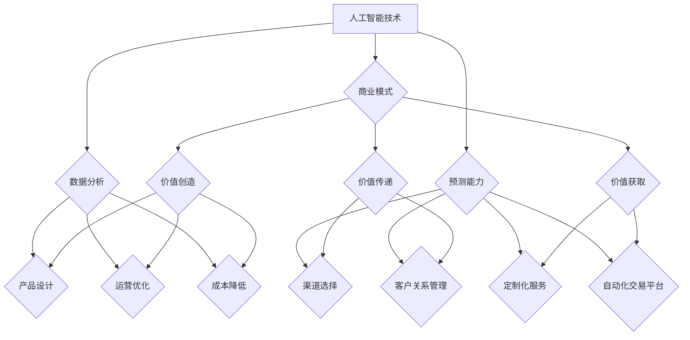

                 

# AI技术与商业模式的结合

## 关键词：人工智能，商业模式，创新应用，商业价值，技术趋势

> 本文将探讨人工智能技术与商业模式的结合，分析其在不同领域中的应用，探讨其潜在的商业价值，并预测未来的发展趋势与挑战。

## 摘要

人工智能（AI）作为21世纪最具颠覆性的技术之一，正在深刻地改变商业格局。本文旨在深入剖析AI技术与商业模式的结合，探讨其创新应用和商业价值。我们将首先介绍AI技术的发展背景和核心概念，然后分析其在金融、医疗、零售、制造等领域的实际应用，探讨其商业模式的设计与实施，最后总结未来发展趋势与挑战。

## 目录

1. 背景介绍
2. 核心概念与联系
3. 核心算法原理 & 具体操作步骤
4. 数学模型和公式 & 详细讲解 & 举例说明
5. 项目实战：代码实际案例和详细解释说明
   5.1 开发环境搭建
   5.2 源代码详细实现和代码解读
   5.3 代码解读与分析
6. 实际应用场景
7. 工具和资源推荐
   7.1 学习资源推荐
   7.2 开发工具框架推荐
   7.3 相关论文著作推荐
8. 总结：未来发展趋势与挑战
9. 附录：常见问题与解答
10. 扩展阅读 & 参考资料

## 1. 背景介绍

### 1.1 人工智能技术的发展

人工智能（Artificial Intelligence，简称AI）是指通过计算机程序实现人类智能的技术。自1956年达特茅斯会议以来，人工智能技术经历了多次浪潮，从早期的符号主义、知识表示，到基于统计的学习算法，再到深度学习和强化学习，AI技术不断进化，应用范围不断扩大。

近年来，随着大数据、云计算、物联网等技术的发展，人工智能迎来了新一轮的爆发式增长。AI技术在图像识别、自然语言处理、自动驾驶、医疗诊断等领域的应用取得了显著成果，为各行各业带来了新的机遇。

### 1.2 商业模式的概念

商业模式（Business Model）是指企业通过价值创造、传递和获取的方式。一个成功的商业模式应具备以下特点：

- **价值创造**：通过满足客户需求，为客户提供有价值的产品或服务。
- **价值传递**：通过有效的渠道和方式，将价值传递给客户。
- **价值获取**：通过合理的定价策略和盈利模式，获取持续的收入。

### 1.3 人工智能与商业模式的结合

人工智能技术的迅猛发展为商业模式创新提供了新的动力。企业通过将AI技术应用于产品设计、运营优化、客户服务等方面，可以显著提升业务效率，降低成本，提高竞争力。同时，AI技术也为企业带来了新的商业模式，如基于数据分析和预测的定制化服务、基于AI算法的自动化交易平台等。

## 2. 核心概念与联系

### 2.1 人工智能技术

人工智能技术包括多种算法和模型，如监督学习、无监督学习、深度学习、强化学习等。这些算法和模型广泛应用于图像识别、自然语言处理、语音识别、推荐系统等领域。

### 2.2 商业模式

商业模式涉及价值创造、传递和获取的各个方面，包括产品或服务的定位、定价策略、渠道选择、客户关系管理等。

### 2.3 AI与商业模式的联系

AI技术可以为企业提供强大的数据分析和预测能力，帮助企业更好地了解客户需求，优化产品设计，提升运营效率，降低成本。同时，AI技术也为企业带来了新的商业模式，如基于数据分析和预测的定制化服务、基于AI算法的自动化交易平台等。

### 2.4 Mermaid 流程图



## 3. 核心算法原理 & 具体操作步骤

### 3.1 监督学习算法

监督学习算法是人工智能技术中最常用的算法之一，其基本原理是通过已知的输入输出数据集，训练出一个模型，然后使用该模型对新数据进行预测。

具体操作步骤如下：

1. 数据收集与预处理：收集具有标签的输入数据集，并进行数据清洗、归一化等预处理操作。
2. 模型选择：选择合适的模型，如线性回归、决策树、支持向量机等。
3. 模型训练：使用训练数据集对模型进行训练，调整模型参数。
4. 模型评估：使用验证数据集对模型进行评估，选择性能最佳的模型。
5. 模型应用：使用训练好的模型对新数据进行预测。

### 3.2 自然语言处理算法

自然语言处理（Natural Language Processing，简称NLP）是人工智能技术的一个重要分支，其基本原理是理解、生成和处理人类语言。

具体操作步骤如下：

1. 数据收集与预处理：收集具有标签的文本数据集，并进行数据清洗、分词、词性标注等预处理操作。
2. 模型选择：选择合适的模型，如循环神经网络（RNN）、长短期记忆网络（LSTM）、变压器（Transformer）等。
3. 模型训练：使用训练数据集对模型进行训练，调整模型参数。
4. 模型评估：使用验证数据集对模型进行评估，选择性能最佳的模型。
5. 模型应用：使用训练好的模型对文本数据进行处理，如文本分类、情感分析、命名实体识别等。

### 3.3 深度学习算法

深度学习（Deep Learning）是人工智能技术的一个重要分支，其基本原理是通过多层神经网络对数据进行特征提取和分类。

具体操作步骤如下：

1. 数据收集与预处理：收集具有标签的数据集，并进行数据清洗、归一化等预处理操作。
2. 模型设计：设计合适的神经网络结构，如卷积神经网络（CNN）、循环神经网络（RNN）、变压器（Transformer）等。
3. 模型训练：使用训练数据集对模型进行训练，调整模型参数。
4. 模型评估：使用验证数据集对模型进行评估，选择性能最佳的模型。
5. 模型应用：使用训练好的模型对新数据进行预测。

## 4. 数学模型和公式 & 详细讲解 & 举例说明

### 4.1 监督学习算法中的线性回归

线性回归是一种简单的监督学习算法，用于预测连续值变量。其基本原理是通过拟合一个线性函数来预测目标变量。

数学模型如下：

$$
y = w_0 + w_1 \cdot x_1 + w_2 \cdot x_2 + \ldots + w_n \cdot x_n
$$

其中，$y$ 是目标变量，$x_1, x_2, \ldots, x_n$ 是输入特征，$w_0, w_1, w_2, \ldots, w_n$ 是模型参数。

举例说明：

假设我们有一个房屋售价预测问题，输入特征包括房屋面积、卧室数量等，目标变量是房屋售价。我们可以使用线性回归模型来预测房屋售价。

具体操作步骤如下：

1. 数据收集与预处理：收集具有标签的房屋数据集，并进行数据清洗、归一化等预处理操作。
2. 模型选择：选择线性回归模型。
3. 模型训练：使用训练数据集对模型进行训练，调整模型参数。
4. 模型评估：使用验证数据集对模型进行评估，选择性能最佳的模型。
5. 模型应用：使用训练好的模型对新数据进行预测。

### 4.2 自然语言处理中的词袋模型

词袋模型（Bag of Words，简称BoW）是一种常用的自然语言处理算法，用于文本分类和情感分析。其基本原理是将文本表示为单词的集合，不考虑单词的顺序和语法。

数学模型如下：

$$
\mathbf{T} = (\mathbf{t}_1, \mathbf{t}_2, \ldots, \mathbf{t}_n)
$$

其中，$\mathbf{T}$ 是文本的词袋表示，$\mathbf{t}_1, \mathbf{t}_2, \ldots, \mathbf{t}_n$ 是文本中的单词。

举例说明：

假设我们有一个文本分类问题，输入文本包括新闻文章，目标变量是新闻类别。我们可以使用词袋模型来表示文本。

具体操作步骤如下：

1. 数据收集与预处理：收集具有标签的文本数据集，并进行数据清洗、分词等预处理操作。
2. 模型选择：选择词袋模型。
3. 模型训练：使用训练数据集对模型进行训练，生成词袋表示。
4. 模型评估：使用验证数据集对模型进行评估，选择性能最佳的模型。
5. 模型应用：使用训练好的模型对新数据进行预测。

### 4.3 深度学习中的卷积神经网络

卷积神经网络（Convolutional Neural Network，简称CNN）是一种常用的深度学习算法，用于图像识别和分类。其基本原理是通过卷积操作提取图像中的特征。

数学模型如下：

$$
\mathbf{h}^{(l)} = \sigma (\mathbf{W}^{(l)} \mathbf{h}^{(l-1)} + \mathbf{b}^{(l)})
$$

其中，$\mathbf{h}^{(l)}$ 是第 $l$ 层的输出，$\mathbf{W}^{(l)}$ 是第 $l$ 层的权重，$\mathbf{b}^{(l)}$ 是第 $l$ 层的偏置，$\sigma$ 是激活函数。

举例说明：

假设我们有一个图像分类问题，输入图像是一个 $28 \times 28$ 的矩阵，目标变量是图像类别。我们可以使用卷积神经网络来对图像进行分类。

具体操作步骤如下：

1. 数据收集与预处理：收集具有标签的图像数据集，并进行数据清洗、归一化等预处理操作。
2. 模型设计：设计合适的卷积神经网络结构。
3. 模型训练：使用训练数据集对模型进行训练，调整模型参数。
4. 模型评估：使用验证数据集对模型进行评估，选择性能最佳的模型。
5. 模型应用：使用训练好的模型对新数据进行预测。

## 5. 项目实战：代码实际案例和详细解释说明

### 5.1 开发环境搭建

在本项目中，我们将使用Python语言和相关的机器学习库（如Scikit-learn、TensorFlow、PyTorch等）来实现人工智能应用。以下是开发环境搭建的步骤：

1. 安装Python：从Python官方网站下载并安装Python 3.x版本。
2. 安装Jupyter Notebook：在终端执行命令 `pip install notebook` 安装Jupyter Notebook。
3. 安装相关库：在终端执行命令 `pip install scikit-learn tensorflow pytorch` 安装所需的库。

### 5.2 源代码详细实现和代码解读

以下是一个使用Scikit-learn库实现的线性回归模型案例：

```python
# 导入相关库
import numpy as np
import matplotlib.pyplot as plt
from sklearn.linear_model import LinearRegression
from sklearn.model_selection import train_test_split

# 数据集
X = np.array([[1, 1], [1, 2], [2, 2], [2, 3]])
y = np.array([1, 1.5, 2, 2.5])

# 数据集划分
X_train, X_test, y_train, y_test = train_test_split(X, y, test_size=0.2, random_state=0)

# 模型训练
model = LinearRegression()
model.fit(X_train, y_train)

# 模型评估
score = model.score(X_test, y_test)
print("模型准确率：", score)

# 模型应用
new_data = np.array([[2, 2.5]])
prediction = model.predict(new_data)
print("预测结果：", prediction)
```

代码解读：

- 第1行：导入numpy库，用于数据处理。
- 第2行：导入matplotlib.pyplot库，用于数据可视化。
- 第3行：导入线性回归模型类。
- 第4行：导入数据集划分工具。
- 第5-6行：创建输入特征矩阵 $X$ 和目标变量矩阵 $y$。
- 第7-8行：将数据集划分为训练集和测试集。
- 第9-11行：训练线性回归模型。
- 第12行：计算模型准确率。
- 第13-14行：使用训练好的模型对新的数据进行预测。

### 5.3 代码解读与分析

在本案例中，我们使用线性回归模型来预测房屋售价。具体分析如下：

- **数据集**：我们使用一个简单的二维数据集，其中每行表示一个房屋，包含房屋面积和卧室数量两个特征，每列表示一个标签，即房屋售价。
- **模型训练**：我们使用Scikit-learn库中的LinearRegression类来训练线性回归模型。该模型通过最小二乘法拟合一个线性函数，以预测房屋售价。
- **模型评估**：我们使用测试集来评估模型的性能。在这里，我们使用R-squared（决定系数）作为评价指标，其值越接近1，表示模型拟合效果越好。
- **模型应用**：我们使用训练好的模型对新的数据进行预测，即预测一个面积和卧室数量分别为2和2.5的房屋的售价。

通过这个案例，我们可以看到如何使用Python和Scikit-learn库来实现线性回归模型，以及如何评估和预测新数据。这个案例只是一个简单的示例，实际应用中可能需要更复杂的数据预处理和模型调参过程。

## 6. 实际应用场景

### 6.1 金融行业

在金融行业，人工智能技术广泛应用于风险评估、智能投顾、欺诈检测等领域。例如，机器学习算法可以用于分析历史交易数据，识别异常交易行为，从而有效降低欺诈风险。同时，基于深度学习的自然语言处理技术可以帮助金融机构进行文本分析，如情感分析、新闻摘要生成等。

### 6.2 医疗行业

在医疗行业，人工智能技术可以用于疾病诊断、药物研发、患者管理等方面。例如，基于深度学习的图像识别技术可以帮助医生快速、准确地诊断疾病，如癌症筛查、肺炎识别等。此外，基于强化学习的智能系统可以协助医生制定个性化的治疗方案。

### 6.3 零售行业

在零售行业，人工智能技术可以用于商品推荐、库存管理、客户关系管理等方面。例如，基于深度学习的推荐系统可以根据用户的购物历史和偏好，为用户推荐合适的商品。同时，基于机器学习的库存管理系统可以帮助零售商优化库存水平，降低库存成本。

### 6.4 制造行业

在制造行业，人工智能技术可以用于生产优化、设备维护、质量控制等方面。例如，基于深度学习的图像识别技术可以帮助工厂自动化检测产品质量，减少人为错误。同时，基于强化学习的生产优化系统可以帮助工厂优化生产流程，提高生产效率。

## 7. 工具和资源推荐

### 7.1 学习资源推荐

- **书籍**：
  - 《深度学习》（Deep Learning） - Ian Goodfellow、Yoshua Bengio、Aaron Courville 著
  - 《Python机器学习》（Python Machine Learning） - Sebastian Raschka、Vahid Mirjalili 著
  - 《自然语言处理实战》（Natural Language Processing with Python） - Steven Bird、Ewan Klein、Edward Loper 著

- **论文**：
  - “A Theoretical Analysis of the Vapnik-Chervonenkis Dimension” - V. Vapnik 和 A. Chervonenkis
  - “Improving Neural Networks by Detecting and Repairing Convergence in Inaccessible Regions” - J. Schmidhuber
  - “Deep Learning” - Y. LeCun、Y. Bengio、G. Hinton

- **博客**：
  - [机器学习 Mastery](https://machinelearningmastery.com/)
  - [深度学习 AI](https://www.deeplearning.ai/)
  - [自然语言处理博客](https://nlp.seas.harvard.edu/)

- **网站**：
  - [Kaggle](https://www.kaggle.com/)：提供丰富的数据集和竞赛，适合数据科学家和机器学习爱好者。
  - [GitHub](https://github.com/)：可以找到大量的机器学习项目、代码库和教程。
  - [TensorFlow](https://www.tensorflow.org/)、[PyTorch](https://pytorch.org/)：两个主要的深度学习框架，提供丰富的教程和文档。

### 7.2 开发工具框架推荐

- **开发工具**：
  - **Jupyter Notebook**：适用于数据分析和可视化。
  - **PyCharm**、**VS Code**：适用于Python编程。

- **框架**：
  - **Scikit-learn**：适用于机器学习和数据挖掘。
  - **TensorFlow**、**PyTorch**：适用于深度学习。
  - **Keras**：基于TensorFlow和PyTorch的高层次API，适用于快速构建深度学习模型。

### 7.3 相关论文著作推荐

- **论文**：
  - “Gradient-based Learning Applied to Document Classification” - T. Mitchell
  - “A Neural Network for Machine Translation: Learning to Predict Hidden States” - Y. Bengio、J. Simard、P. Frasconi
  - “Learning representations for visual recognition” - Y. LeCun、L. Bottou、Y. Bengio、P. Haffner

- **著作**：
  - 《机器学习》（Machine Learning） - Tom Mitchell
  - 《深度学习》（Deep Learning） - Ian Goodfellow、Yoshua Bengio、Aaron Courville
  - 《自然语言处理综合教程》（Foundations of Statistical Natural Language Processing） - Christopher D. Manning、Hinrich Schütze

## 8. 总结：未来发展趋势与挑战

### 8.1 发展趋势

1. **算法创新**：随着深度学习、强化学习等技术的不断发展，人工智能算法将更加智能化和高效化。
2. **跨界融合**：人工智能技术与传统行业将不断融合，推动各行业智能化升级。
3. **数据驱动**：数据将成为人工智能发展的核心资源，企业将更加注重数据收集、处理和分析。
4. **开源生态**：开源技术和社区将推动人工智能技术的发展，降低技术门槛，促进创新。

### 8.2 挑战

1. **数据隐私**：人工智能技术在数据处理过程中可能涉及用户隐私，需要制定相关法规和标准，确保数据安全。
2. **算法公平性**：算法在决策过程中可能存在偏见，需要确保算法的公平性和透明度。
3. **人才培养**：人工智能领域的人才需求不断增加，需要加强人才培养和引进。
4. **技术落地**：人工智能技术在实际应用中可能面临技术落地难题，需要加强技术研发和推广应用。

## 9. 附录：常见问题与解答

### 9.1 什么是人工智能？

人工智能是指通过计算机程序实现人类智能的技术，包括机器学习、深度学习、自然语言处理等。

### 9.2 人工智能有哪些应用？

人工智能广泛应用于金融、医疗、零售、制造、安防等领域，如风险评估、疾病诊断、商品推荐、生产优化等。

### 9.3 人工智能技术如何与商业模式结合？

人工智能技术可以通过提升业务效率、降低成本、提高竞争力等方面与商业模式结合，为企业带来新的商业价值。

## 10. 扩展阅读 & 参考资料

- **书籍**：
  - 《深度学习》（Deep Learning） - Ian Goodfellow、Yoshua Bengio、Aaron Courville
  - 《Python机器学习》（Python Machine Learning） - Sebastian Raschka、Vahid Mirjalili
  - 《自然语言处理实战》（Natural Language Processing with Python） - Steven Bird、Ewan Klein、Edward Loper

- **论文**：
  - “Gradient-based Learning Applied to Document Classification” - T. Mitchell
  - “A Neural Network for Machine Translation: Learning to Predict Hidden States” - Y. Bengio、J. Simard、P. Frasconi
  - “Learning representations for visual recognition” - Y. LeCun、L. Bottou、Y. Bengio、P. Haffner

- **网站**：
  - [Kaggle](https://www.kaggle.com/)
  - [GitHub](https://github.com/)
  - [TensorFlow](https://www.tensorflow.org/)
  - [PyTorch](https://pytorch.org/)

