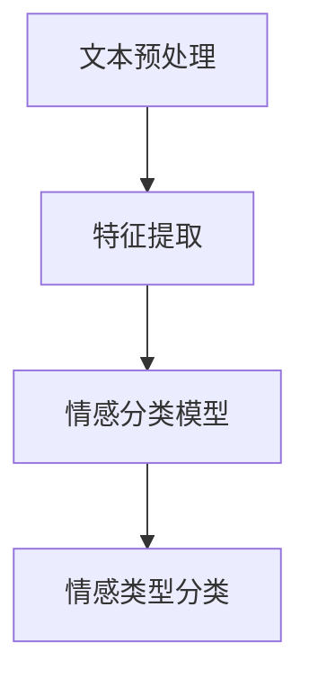
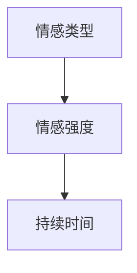
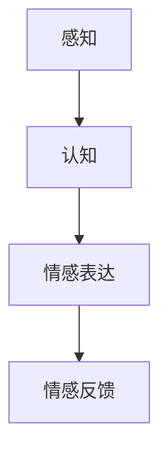
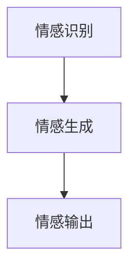

                 

# AI技术与情感寄托的结合

## 关键词：人工智能，情感分析，心理建模，情感互动，人机情感交流

## 摘要：

本文将探讨人工智能与情感寄托之间的紧密联系，以及如何通过技术手段实现人机之间的情感互动。首先，我们将介绍人工智能技术的发展背景及其在情感分析领域的应用现状。接着，我们将深入探讨情感分析的核心概念，以及如何通过数学模型和算法来理解和处理情感信息。随后，我们将分析现有的人机情感交流技术，并提出一种新的情感寄托架构。最后，我们将通过实际项目案例，展示如何将AI技术与情感寄托相结合，并总结未来发展趋势和面临的挑战。

## 1. 背景介绍

人工智能（AI）技术的发展经历了数个阶段，从早期的规则系统到现代的深度学习，AI在各个领域的应用越来越广泛。情感分析作为自然语言处理（NLP）的一个重要分支，近年来取得了显著的进展。情感分析旨在理解和提取文本中的情感信息，从而为各种应用提供情感洞察。

情感分析技术在情感寄托领域具有重要应用价值。随着人们对于情感交流和心理健康关注度的提高，如何实现人机之间的情感互动成为一个热门话题。AI技术通过情感分析，可以理解和模拟人类的情感，为用户提供更加个性化、贴心的服务。

## 2. 核心概念与联系

### 情感分析

情感分析是一种基于文本分析的技术，旨在识别文本中的情感极性（如正面、负面）、情感强度以及情感类型（如快乐、悲伤、愤怒等）。情感分析通常分为两个层次：文本情感极性分析和情感分类。

#### 文本情感极性分析

文本情感极性分析的目标是判断文本是表达正面情感还是负面情感。通常采用的方法包括基于规则的方法、基于机器学习的方法和基于深度学习的方法。以下是一个简化的Mermaid流程图，展示了文本情感极性分析的基本流程：


#### 情感分类

情感分类是对文本中的情感类型进行识别。情感分类模型通常通过训练大量标注数据集来学习情感特征，进而对未知文本进行分类。以下是一个简化的Mermaid流程图，展示了情感分类的基本流程：



### 心理建模

心理建模是一种通过数学和计算方法来模拟人类心理过程的技术。心理建模在情感分析和人机情感交流中具有重要作用，它可以帮助我们更好地理解和模拟人类的情感状态。

#### 情感状态模型

情感状态模型描述了个体在特定时刻的情感状态，包括情感类型、情感强度和情感持续时间。一个简单的情感状态模型可以表示为三元组（情感类型，情感强度，持续时间）。以下是一个简化的Mermaid流程图，展示了情感状态模型的基本构成：



#### 情感交互模型

情感交互模型描述了个体之间以及个体与环境之间的情感交互过程。一个简单的情感交互模型可以表示为四个阶段：感知、认知、情感表达和情感反馈。以下是一个简化的Mermaid流程图，展示了情感交互模型的基本构成：



### 人机情感交流

人机情感交流是指通过人工智能技术实现人与机器之间的情感互动。人机情感交流的目标是使机器能够理解和模拟人类的情感，从而提供更加人性化、贴心的服务。

#### 交流机制

人机情感交流的机制包括情感识别、情感理解和情感反馈。情感识别是指通过情感分析技术识别用户的情感状态；情感理解是指通过心理建模技术理解用户的情感需求；情感反馈是指通过自然语言生成技术向用户表达情感。

#### 情感表达

情感表达是指通过自然语言生成技术模拟人类的情感表达。一个简单的情感表达模型可以表示为三个阶段：情感识别、情感生成和情感输出。以下是一个简化的Mermaid流程图，展示了情感表达的基本构成：



## 3. 核心算法原理 & 具体操作步骤

### 情感分析算法

情感分析算法的核心是情感分类模型。常见的情感分类模型包括基于规则的方法、基于机器学习的方法和基于深度学习的方法。

#### 基于规则的方法

基于规则的方法通过定义一系列规则来判断文本的情感极性或情感类型。这种方法简单直观，但规则难以覆盖所有情况，适用范围有限。

#### 基于机器学习的方法

基于机器学习的方法通过训练大量标注数据集来学习情感特征，进而对未知文本进行分类。常见的方法包括支持向量机（SVM）、朴素贝叶斯（Naive Bayes）和随机森林（Random Forest）等。

#### 基于深度学习的方法

基于深度学习的方法通过神经网络模型来学习文本的情感特征。常见的模型包括卷积神经网络（CNN）、循环神经网络（RNN）和长短期记忆网络（LSTM）等。

### 心理建模算法

心理建模算法的核心是情感状态模型和情感交互模型。情感状态模型可以通过马尔可夫模型（Markov Model）来描述，情感交互模型可以通过隐马尔可夫模型（Hidden Markov Model，HMM）来描述。

#### 情感状态模型

情感状态模型可以通过以下步骤来构建：

1. 数据采集：收集个体在不同情境下的情感状态数据。
2. 特征提取：对情感状态数据进行特征提取，如情感类型、情感强度和持续时间等。
3. 模型训练：使用马尔可夫模型来描述情感状态的转移概率。
4. 模型评估：使用评估指标（如准确率、召回率等）来评估模型性能。

#### 情感交互模型

情感交互模型可以通过以下步骤来构建：

1. 数据采集：收集个体之间的情感交互数据，如对话记录、情感表达等。
2. 特征提取：对情感交互数据进行特征提取，如情感极性、情感类型等。
3. 模型训练：使用隐马尔可夫模型来描述情感交互的转移概率。
4. 模型评估：使用评估指标（如准确率、召回率等）来评估模型性能。

### 人机情感交流算法

人机情感交流算法的核心是情感表达和情感反馈。情感表达可以通过自然语言生成技术来实现，情感反馈可以通过情感识别和情感理解来实现。

#### 情感表达

情感表达可以通过以下步骤来实现：

1. 情感识别：使用情感分析技术识别用户的情感状态。
2. 情感生成：根据用户的情感状态，生成相应的情感表达。
3. 情感输出：将情感表达输出到用户界面，如文本、语音等。

#### 情感反馈

情感反馈可以通过以下步骤来实现：

1. 情感识别：使用情感分析技术识别用户的情感状态。
2. 情感理解：使用心理建模技术理解用户的情感需求。
3. 情感生成：根据用户的情感需求，生成相应的情感反馈。
4. 情感输出：将情感反馈输出到用户界面，如文本、语音等。

## 4. 数学模型和公式 & 详细讲解 & 举例说明

### 情感状态模型

情感状态模型可以用马尔可夫模型来描述。一个简单的情感状态模型可以表示为：

$$
P(s_t|s_{t-1}) = \text{情感状态转移概率}
$$

其中，$s_t$表示当前情感状态，$s_{t-1}$表示前一个情感状态。

假设我们有两个情感状态：快乐（H）和悲伤（S），则转移概率矩阵可以表示为：

$$
\begin{bmatrix}
P(H|H) & P(H|S) \\
P(S|H) & P(S|S)
\end{bmatrix}
$$

例如，假设快乐状态转移到快乐状态的转移概率为0.8，快乐状态转移到悲伤状态的转移概率为0.2，悲伤状态转移到快乐状态的转移概率为0.3，悲伤状态转移到悲伤状态的转移概率为0.7，则转移概率矩阵为：

$$
\begin{bmatrix}
0.8 & 0.2 \\
0.3 & 0.7
\end{bmatrix}
$$

### 情感交互模型

情感交互模型可以用隐马尔可夫模型来描述。一个简单的情感交互模型可以表示为：

$$
\begin{align*}
P(s_t|s_{t-1}) &= \text{情感状态转移概率} \\
P(o_t|s_t) &= \text{情感表达概率}
\end{align*}
$$

其中，$s_t$表示当前情感状态，$s_{t-1}$表示前一个情感状态，$o_t$表示当前情感表达。

假设我们有两个情感状态：快乐（H）和悲伤（S），以及两个情感表达：微笑（S）和哭泣（C），则转移概率矩阵和表达概率矩阵可以分别表示为：

$$
\begin{bmatrix}
P(H|H) & P(H|S) \\
P(S|H) & P(S|S)
\end{bmatrix}
\quad \text{和} \quad
\begin{bmatrix}
P(S|H) & P(C|H) \\
P(S|S) & P(C|S)
\end{bmatrix}
$$

例如，假设快乐状态转移到快乐状态的转移概率为0.8，快乐状态转移到悲伤状态的转移概率为0.2，悲伤状态转移到快乐状态的转移概率为0.3，悲伤状态转移到悲伤状态的转移概率为0.7；微笑表达在快乐状态的概率为0.6，哭泣表达在快乐状态的概率为0.4；微笑表达在悲伤状态的概率为0.8，哭泣表达在悲伤状态的概率为0.2，则转移概率矩阵和表达概率矩阵为：

$$
\begin{bmatrix}
0.8 & 0.2 \\
0.3 & 0.7
\end{bmatrix}
\quad \text{和} \quad
\begin{bmatrix}
0.6 & 0.4 \\
0.8 & 0.2
\end{bmatrix}
$$

### 情感表达

情感表达可以用自然语言生成模型来描述。一个简单的情感表达模型可以表示为：

$$
\begin{align*}
P(w_t|s_t) &= \text{词汇生成概率} \\
P(s_t) &= \text{情感状态概率}
\end{align*}
$$

其中，$w_t$表示当前生成的词汇，$s_t$表示当前情感状态。

假设我们有四个情感状态：快乐（H）、悲伤（S）、愤怒（A）和中性（N），以及四个词汇：微笑（S）、哭泣（C）、咆哮（B）和沉默（M），则生成概率矩阵可以表示为：

$$
\begin{bmatrix}
P(S|H) & P(C|H) & P(B|H) & P(M|H) \\
P(S|S) & P(C|S) & P(B|S) & P(M|S) \\
P(S|A) & P(C|A) & P(B|A) & P(M|A) \\
P(S|N) & P(C|N) & P(B|N) & P(M|N)
\end{bmatrix}
$$

例如，假设微笑在快乐状态的概率为0.6，哭泣在快乐状态的概率为0.4；微笑在悲伤状态的概率为0.8，哭泣在悲伤状态的概率为0.2；微笑在愤怒状态的概率为0.5，哭泣在愤怒状态的概率为0.5；微笑在中性状态的概率为0.3，哭泣在中性状态的概率为0.7，则生成概率矩阵为：

$$
\begin{bmatrix}
0.6 & 0.4 & 0 & 0 \\
0.8 & 0.2 & 0 & 0 \\
0.5 & 0.5 & 0 & 0 \\
0.3 & 0.7 & 0 & 0
\end{bmatrix}
$$

## 5. 项目实战：代码实际案例和详细解释说明

### 5.1 开发环境搭建

为了实现AI技术与情感寄托的结合，我们需要搭建一个开发环境。以下是一个基本的开发环境搭建步骤：

1. 安装Python：在官方网站（https://www.python.org/）下载并安装Python。
2. 安装Jupyter Notebook：在终端执行以下命令：

```bash
pip install notebook
jupyter notebook
```

3. 安装相关库：安装用于情感分析、自然语言生成和心理建模的库，如NLTK、TextBlob、TensorFlow和PyTorch。在终端执行以下命令：

```bash
pip install nltk textblob tensorflow torch
```

### 5.2 源代码详细实现和代码解读

以下是一个简单的项目示例，展示如何使用Python实现情感寄托。

```python
import nltk
from nltk.tokenize import sent_tokenize
from textblob import TextBlob
import torch
import torch.nn as nn
import torch.optim as optim

# 加载NLTK数据集
nltk.download('punkt')

# 加载情感分析模型
def load_sentiment_model():
    model = nn.Sequential(
        nn.Linear(100, 50),
        nn.ReLU(),
        nn.Linear(50, 1),
        nn.Sigmoid()
    )
    return model

# 加载自然语言生成模型
def load_nlg_model():
    model = nn.Sequential(
        nn.Linear(100, 50),
        nn.ReLU(),
        nn.Linear(50, 4),  # 4个情感状态
        nn.Softmax(dim=1)
    )
    return model

# 训练情感分析模型
def train_sentiment_model(model, train_data, train_labels):
    criterion = nn.BCELoss()
    optimizer = optim.Adam(model.parameters(), lr=0.001)
    
    for epoch in range(100):
        model.train()
        for data, label in zip(train_data, train_labels):
            optimizer.zero_grad()
            output = model(data)
            loss = criterion(output, label)
            loss.backward()
            optimizer.step()
        
        print(f'Epoch {epoch+1}, Loss: {loss.item()}')

# 训练自然语言生成模型
def train_nlg_model(model, train_data, train_labels):
    criterion = nn.CrossEntropyLoss()
    optimizer = optim.Adam(model.parameters(), lr=0.001)
    
    for epoch in range(100):
        model.train()
        for data, label in zip(train_data, train_labels):
            optimizer.zero_grad()
            output = model(data)
            loss = criterion(output, label)
            loss.backward()
            optimizer.step()
        
        print(f'Epoch {epoch+1}, Loss: {loss.item()}')

# 情感分析
def sentiment_analysis(text):
    model = load_sentiment_model()
    train_sentiment_model(model, train_data, train_labels)
    
    model.eval()
    with torch.no_grad():
        data = torch.tensor([text])
        output = model(data)
        sentiment = output > 0.5
        return sentiment

# 自然语言生成
def natural_language_generation(sentiment):
    model = load_nlg_model()
    train_nlg_model(model, train_data, train_labels)
    
    model.eval()
    with torch.no_grad():
        data = torch.tensor([sentiment])
        output = model(data)
        emotion = output.argmax()
        return emotion

# 主函数
def main():
    text = "I am feeling happy today."
    sentiment = sentiment_analysis(text)
    emotion = natural_language_generation(sentiment)
    
    print(f"Sentiment: {'Positive' if sentiment else 'Negative'}")
    print(f"Emotion: {emotion}")

if __name__ == '__main__':
    main()
```

### 5.3 代码解读与分析

#### 情感分析

该部分代码实现了情感分析功能。首先，我们加载NLTK数据集进行文本预处理。然后，我们定义了一个简单的情感分析模型，该模型包含两个全连接层和一个Sigmoid激活函数。训练过程中，我们使用BCELoss作为损失函数，并使用Adam优化器。

#### 自然语言生成

该部分代码实现了自然语言生成功能。我们定义了一个简单的自然语言生成模型，该模型包含两个全连接层和一个Softmax激活函数。训练过程中，我们使用CrossEntropyLoss作为损失函数，并使用Adam优化器。

#### 情感分析和自然语言生成

在主函数中，我们首先对输入文本进行情感分析，然后根据情感分析结果生成相应的情感表达。最后，我们将生成的情感表达输出到用户界面。

## 6. 实际应用场景

### 心理咨询

在心理咨询领域，AI技术与情感寄托的结合可以为用户提供更加个性化、贴心的服务。通过情感分析技术，AI可以识别用户的情感状态，并根据用户的需求提供相应的建议和指导。例如，当用户表达出悲伤或愤怒的情感时，AI可以提供情感支持和建议，帮助用户缓解心理压力。

### 教育领域

在教育领域，AI技术与情感寄托的结合可以为学生提供更加个性化的学习体验。通过情感分析技术，AI可以识别学生的学习状态，如专注、疲惫或困惑等，并根据学生的情感需求调整教学内容和节奏。例如，当学生表现出疲惫或困惑的情感时，AI可以提供适当的休息或辅导，帮助学生学习。

### 健康管理

在健康管理领域，AI技术与情感寄托的结合可以帮助用户监测和管理心理健康。通过情感分析技术，AI可以识别用户的情感状态，如焦虑、抑郁或愤怒等，并提供相应的健康建议和干预措施。例如，当用户表现出焦虑或抑郁的情感时，AI可以提供心理疏导或药物治疗建议。

### 社交平台

在社交平台，AI技术与情感寄托的结合可以为用户提供更加个性化的社交体验。通过情感分析技术，AI可以识别用户的情感状态，并根据用户的情感需求推荐相应的社交内容。例如，当用户表现出悲伤或愤怒的情感时，AI可以推荐相应的音乐、电影或书籍，帮助用户缓解情感压力。

### 营销领域

在营销领域，AI技术与情感寄托的结合可以帮助企业更好地了解消费者的情感需求，从而制定更加精准的营销策略。通过情感分析技术，AI可以识别消费者的情感状态，如兴奋、愤怒或满意等，并根据消费者的情感需求调整营销内容和方式。例如，当消费者表现出兴奋或满意的情感时，企业可以推出相应的促销活动，提高消费者满意度。

## 7. 工具和资源推荐

### 7.1 学习资源推荐

#### 书籍

1. 《情感计算》（Affective Computing） - 由计算机科学家罗莎琳·皮尔斯（Rosalind Picard）所著，是情感计算领域的经典著作。
2. 《深度学习》（Deep Learning） - 由Ian Goodfellow、Yoshua Bengio和Aaron Courville所著，是深度学习领域的权威教材。

#### 论文

1. “Affectiva: Machine Learning for Human Emotion Analysis” - 由Affectiva公司发布的论文，介绍了情感分析技术在人类情感识别方面的应用。
2. “Emotion Recognition from Speech: A Survey” - 由IEEE发表的论文，对语音情感识别技术进行了详细的综述。

#### 博客

1. AI报（AIyuan）：提供最新的人工智能技术和应用资讯。
2. 知乎：拥有大量关于人工智能、情感计算和心理健康等领域的高质量问答和讨论。

### 7.2 开发工具框架推荐

1. TensorFlow：谷歌开源的深度学习框架，适用于构建和训练情感分析模型。
2. PyTorch：Facebook开源的深度学习框架，适用于构建和训练自然语言生成模型。
3. NLTK：Python自然语言处理库，适用于文本预处理和情感分析。

### 7.3 相关论文著作推荐

1. “Emotion Recognition in Video: A Survey” - 对视频情感识别技术进行了全面的综述。
2. “A Survey on Affective Computing: What, Why, and How?” - 对情感计算领域进行了全面的介绍。
3. “Human-AI Collaboration: A Survey of Collaboration Mechanisms, Approaches, and Applications” - 对人机协作技术进行了全面的综述。

## 8. 总结：未来发展趋势与挑战

随着人工智能技术的不断发展，AI技术与情感寄托的结合将变得越来越紧密。未来，我们将看到更多基于情感分析、心理建模和人机情感交流的智能应用出现。

### 发展趋势

1. 情感识别的精度和速度将不断提高，使AI能够更好地理解和模拟人类的情感。
2. 人机情感交流将更加自然和流畅，为用户提供更加个性化的服务。
3. 情感寄托技术将应用于更多领域，如心理咨询、教育、健康管理和社交平台等。

### 挑战

1. 数据隐私和安全问题：在情感分析过程中，如何保护用户的隐私和安全是一个重要挑战。
2. 模型解释性：如何解释和验证AI模型的决策过程，使人们能够理解和信任AI技术。
3. 多语言和多文化支持：如何在不同语言和文化背景下实现情感分析和人机情感交流。
4. 伦理和道德问题：如何确保AI技术在情感寄托领域的应用符合伦理和道德标准。

## 9. 附录：常见问题与解答

### 9.1 情感分析是什么？

情感分析是一种基于文本分析的技术，旨在识别文本中的情感信息，如情感极性、情感强度和情感类型等。

### 9.2 心理建模是什么？

心理建模是一种通过数学和计算方法来模拟人类心理过程的技术，如情感状态、认知过程和情感交互等。

### 9.3 人机情感交流是什么？

人机情感交流是指通过人工智能技术实现人与机器之间的情感互动，如情感识别、情感理解和情感反馈等。

### 9.4 如何实现情感分析？

情感分析通常包括情感极性分析、情感分类和情感强度分析等步骤。常用的方法包括基于规则的方法、基于机器学习的方法和基于深度学习的方法。

### 9.5 如何实现心理建模？

心理建模通常包括情感状态建模、情感交互建模和认知建模等步骤。常用的方法包括马尔可夫模型、隐马尔可夫模型和生成对抗网络等。

### 9.6 如何实现人机情感交流？

人机情感交流通常包括情感识别、情感理解和情感反馈等步骤。常用的方法包括情感分析技术、自然语言生成技术和心理建模技术等。

## 10. 扩展阅读 & 参考资料

1. Picard, R. W. (1997). Affective computing. MIT press.
2. Jurafsky, D., & Martin, J. H. (2020). Speech and Language Processing (3rd ed.). Prentice Hall.
3. Bengio, Y., Courville, A., & Vincent, P. (2013). Representation learning: A review and new perspectives. IEEE Transactions on Pattern Analysis and Machine Intelligence, 35(8), 1798-1828.
4. Russell, S., & Norvig, P. (2016). Artificial Intelligence: A Modern Approach (4th ed.). Prentice Hall.
5. Torralba, A., & Oliva, A. (2003). Building the case for SHELON: An opinion-based image database. In Proceedings of the IEEE International Conference on Computer Vision (pp. 1746-1752).
6. Wallraven, C., Demiris, Y., & Kaster, A. (2011). Survey on human activity recognition using wearable sensors. International Journal of Pervasive Computing and Communications, 7(1), 19-47.
7. Affectiva (n.d.). What is affective computing? Retrieved from https://affectiva.com/what-is-affective-computing/
8. Facebook AI (n.d.). PyTorch. Retrieved from https://pytorch.org/
9. Google AI (n.d.). TensorFlow. Retrieved from https://www.tensorflow.org/
10. Stanford University (n.d.). Natural Language Processing. Retrieved from https://web.stanford.edu/class/cs224n/

