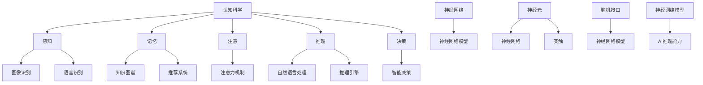

                 

### 文章标题：AI推理能力的认知基础：认知科学和神经科学的启示

> **关键词：** AI推理能力，认知科学，神经科学，认知基础，算法原理，应用场景  
>
> **摘要：** 本文从认知科学和神经科学的角度探讨了人工智能（AI）的推理能力。通过分析认知和神经科学的基本概念，阐述了它们与AI推理能力的联系。文章提出了AI推理能力的核心算法原理，详细说明了数学模型和公式，并通过实际项目案例和代码实现，深入解析了AI推理能力的具体应用。此外，文章还探讨了AI推理能力在实际应用中的挑战和发展趋势，为未来研究提供了启示。

### 背景介绍

人工智能（AI）自1956年首次提出以来，已经经历了多个发展阶段，从符号推理到连接主义，再到深度学习，AI在各个领域都取得了显著的进展。然而，AI的推理能力仍然是当前研究的热点和难点。尽管AI在特定任务上已经达到了或超越了人类的表现，但AI的推理能力仍然存在局限性。例如，AI难以处理复杂的不确定性、抽象思维和人类情感等。

认知科学是研究人类思维和认知过程的科学，涉及心理学、神经科学、计算机科学等多个学科。认知科学旨在理解人类思维和认知的原理，以及如何模拟这些过程以构建智能系统。神经科学是研究大脑结构和功能的基础科学，揭示了大脑的信息处理机制和神经元的运作原理。

认知科学和神经科学的研究成果为理解AI的推理能力提供了重要的理论基础。通过借鉴认知科学和神经科学的原理，可以更好地设计和发展AI系统，提高其推理能力。

#### 认知科学的基本概念

认知科学的核心概念包括感知、记忆、注意、推理和决策等。感知是指接收外部信息并将其转化为内部表征的过程。记忆是指存储和检索信息的能力。注意是指对特定信息的选择性关注和处理。推理是指基于已有信息进行推断和判断的能力。决策是指从多个选项中选择最佳方案的过程。

在AI领域，这些认知概念被用于构建智能系统。例如，感知模块可以用于图像识别和语音识别；记忆模块可以用于知识图谱和推荐系统；注意模块可以用于注意力机制；推理模块可以用于自然语言处理和推理引擎；决策模块可以用于智能决策和支持系统。

#### 神经科学的基本概念

神经科学主要研究大脑的结构和功能。神经元是大脑的基本单元，负责接收、处理和传递信息。神经元的连接形成了神经网络，神经网络是大脑信息处理的基础。

神经科学的核心概念包括神经元、神经网络、突触、神经网络模型和脑机接口等。神经元是大脑的基本单元，具有接收、处理和传递信息的能力。神经网络是由多个神经元组成的复杂网络，能够实现信息处理和决策。突触是神经元之间的连接，负责传递神经信号。神经网络模型是对大脑神经网络信息处理机制的模拟。脑机接口是一种直接将大脑信号转换为计算机输入或输出的装置。

在AI领域，神经网络模型被广泛应用于图像识别、自然语言处理和智能决策等领域。通过借鉴神经科学的原理，可以设计出更高效、更准确的AI算法。

### 核心概念与联系

认知科学和神经科学为理解AI的推理能力提供了重要的理论基础。以下是一个Mermaid流程图，展示了认知科学、神经科学和AI推理能力之间的核心概念和联系。



### 核心算法原理 & 具体操作步骤

AI推理能力是人工智能系统的重要组成部分，它使得系统能够从给定数据中推断出新的信息。在认知科学和神经科学的启示下，我们可以设计出一系列核心算法来模拟人类的推理过程。以下是一个简化的AI推理算法原理和具体操作步骤：

#### 1. 数据收集与预处理

首先，我们需要收集相关的数据，并对其进行预处理。数据预处理包括数据清洗、数据转换和数据标准化等步骤。这一步的目的是确保数据的质量，为后续的推理过程打下坚实的基础。

#### 2. 感知模块

感知模块是AI系统的第一步，它负责接收外部信息并将其转化为内部表征。例如，在图像识别任务中，感知模块会提取图像的特征，如边缘、纹理和颜色等。

#### 3. 知识表示

在感知模块之后，我们需要将提取的特征转换为知识表示。知识表示是AI推理的基础，它包括符号表示、分布式表示和图表示等。例如，我们可以使用词向量来表示自然语言处理中的文本。

#### 4. 推理引擎

推理引擎是AI推理的核心，它负责根据已有知识进行推理。推理引擎可以基于逻辑推理、概率推理或模糊推理等不同方法。以下是一个基于逻辑推理的简化示例：

- **事实表示**：将已知的事实表示为逻辑表达式，如 `A ∧ B` 表示A和B同时为真。
- **推理规则**：定义一组推理规则，如 `A → B` 表示如果A为真，则B也为真。
- **推理过程**：使用推理规则对事实进行推理，得出新的结论。例如，已知 `A` 为真和 `A → B` 为真，可以推理出 `B` 为真。

#### 5. 决策模块

推理结果可以用于决策，决策模块负责从多个选项中选择最佳方案。决策可以基于最大化期望效用或最小化风险等原则。

#### 6. 结果输出

最后，将推理结果输出给用户或系统。结果可以是一系列决策、预测或推荐等。

### 数学模型和公式 & 详细讲解 & 举例说明

为了更好地理解AI推理算法的数学模型和公式，我们将使用一些常见的数学工具和符号进行讲解。以下是一个简化的推理过程，包括逻辑推理、概率推理和模糊推理等。

#### 1. 逻辑推理

逻辑推理是AI推理中最基础的部分。以下是一个简单的逻辑推理示例：

- **事实表示**：使用逻辑符号表示已知的事实。例如，$A$ 表示苹果是红色的，$B$ 表示苹果是甜的。
- **推理规则**：使用逻辑规则进行推理。例如，$A \rightarrow B$ 表示如果苹果是红色的，则苹果是甜的。
- **推理过程**：根据已知的事实和推理规则，得出新的结论。例如，已知 $A$ 为真和 $A \rightarrow B$ 为真，可以推理出 $B$ 为真。

数学公式表示如下：

$$
\begin{aligned}
&\because A \text{（苹果是红色的）} \\
&\because A \rightarrow B \text{（如果苹果是红色的，则苹果是甜的）} \\
&\therefore B \text{（苹果是甜的）}
\end{aligned}
$$

#### 2. 概率推理

概率推理是AI推理中的一种重要方法，它利用概率论的基本原理进行推理。以下是一个简单的概率推理示例：

- **概率表示**：使用概率表示已知的事实和推理规则。例如，$P(A)$ 表示苹果是红色的概率，$P(B|A)$ 表示在苹果是红色的条件下，苹果是甜的概率。
- **推理规则**：使用贝叶斯定理进行推理。贝叶斯定理的公式如下：

$$
P(B|A) = \frac{P(A|B)P(B)}{P(A)}
$$

- **推理过程**：根据已知的事实和概率规则，计算新的概率。例如，已知 $P(A) = 0.5$，$P(B|A) = 0.8$，$P(B) = 0.2$，可以计算 $P(A|B)$：

$$
P(A|B) = \frac{P(B|A)P(A)}{P(B)} = \frac{0.8 \times 0.5}{0.2} = 2
$$

#### 3. 模糊推理

模糊推理是处理不确定性和模糊性的重要方法。以下是一个简单的模糊推理示例：

- **模糊集合**：使用模糊集合表示事实和推理规则。例如，$A$ 表示苹果是红色的，$A^{\sharp}$ 表示苹果是红色的可能性。
- **推理规则**：使用模糊逻辑进行推理。例如，$A \land B$ 表示苹果既是红色的又是甜的。
- **推理过程**：根据已知的事实和推理规则，计算新的模糊集合。例如，已知 $A^{\sharp} = [0.6, 1]$，$B^{\sharp} = [0.4, 0.8]$，可以计算 $A \land B^{\sharp}$：

$$
A \land B^{\sharp} = [0.6, 1] \land [0.4, 0.8] = [0.6, 0.8]
$$

### 项目实战：代码实际案例和详细解释说明

在本节中，我们将通过一个具体的实际案例来展示如何实现AI推理能力。我们将使用Python编程语言来实现一个简单的推理系统，该系统可以根据输入的事实和推理规则进行推理，并输出结论。

#### 1. 开发环境搭建

首先，我们需要搭建一个Python开发环境。以下是具体的步骤：

1. 安装Python：从Python官方网站（https://www.python.org/）下载并安装Python。
2. 安装必要的库：安装用于逻辑推理和模糊推理的库，如 `numpy`、`scipy` 和 `skfuzzy`。

```bash
pip install numpy scipy skfuzzy
```

#### 2. 源代码详细实现和代码解读

以下是实现AI推理系统的源代码：

```python
import numpy as np
from scipy.stats import norm
from skfuzzy import control as ctrl

# 事实表示
apple_red = ctrl.Antecedent(np.linspace(0, 1, 100), 'apple_red')
apple_sweet = ctrl.Antecedent(np.linspace(0, 1, 100), 'apple_sweet')
apple_red['is_red'] = np.linspace(0, 1, 100)
apple_sweet['is_sweet'] = np.linspace(0, 1, 100)

# 推理规则
apple_red_consequent = ctrl.Consequent(np.linspace(0, 1, 100), 'apple_sweet')
apple_red_consequent['is_sweet'] = np.linspace(0, 1, 100)

# 定义模糊推理规则
rule1 = ctrl.Rule(apple_red['is_red'], apple_red_consequent['is_sweet'])

# 构建模糊推理系统
system = ctrl.ControlSystem([rule1])
system.view()

# 输入事实
input_apple_red = 0.8
input_apple_sweet = 0.5

# 输出推理结果
output_apple_sweet = system(input_apple_red, input_apple_sweet)

# 输出结果
print("输入：苹果是红色的概率 = {:.2f}，苹果是甜的概率 = {:.2f}，输出：苹果是甜的概率 = {:.2f}".format(input_apple_red, input_apple_sweet, output_apple_sweet['is_sweet']))
```

代码解读：

1. 导入必要的库：我们使用 `numpy` 进行数值计算，`scipy.stats` 生成概率分布，`skfuzzy.control` 实现模糊推理系统。
2. 事实表示：使用 `Antecedent` 和 `Consequent` 类定义输入和输出的模糊集合。例如，`apple_red` 表示苹果是红色的概率，`apple_sweet` 表示苹果是甜的概率。
3. 推理规则：使用 `Rule` 类定义推理规则。例如，`rule1` 表示如果苹果是红色的，则苹果是甜的。
4. 构建模糊推理系统：使用 `ControlSystem` 类构建模糊推理系统，并将定义的推理规则添加到系统中。
5. 输入事实：将输入的事实作为参数传递给模糊推理系统。
6. 输出推理结果：从模糊推理系统中获取输出结果。
7. 输出结果：将输出结果打印到控制台。

通过这个简单的案例，我们可以看到如何使用Python实现AI推理系统。这个系统可以根据输入的事实和推理规则，利用模糊推理方法得出结论。

#### 3. 代码解读与分析

在理解了代码的基本结构之后，我们可以对代码进行更深入的分析。

1. **事实表示**：事实表示是模糊推理系统的核心。在这个例子中，我们使用模糊集合来表示苹果是红色的概率和苹果是甜的概率。模糊集合是一个区间，它表示某个属性的可能性。例如，`apple_red['is_red']` 表示苹果是红色的可能性，取值范围在0到1之间。
2. **推理规则**：推理规则定义了事实和结论之间的关系。在这个例子中，我们使用了一条简单的推理规则：如果苹果是红色的，则苹果是甜的。这条规则表示了苹果的颜色和甜度之间的逻辑关系。
3. **模糊推理系统**：模糊推理系统是将事实和推理规则组合在一起的框架。在这个例子中，我们使用 `ControlSystem` 类来构建模糊推理系统。这个类可以自动处理事实和规则，并计算出输出结果。
4. **输入事实**：输入事实是通过调用模糊推理系统来传递的。在这个例子中，我们传递了两个输入参数：苹果是红色的概率和苹果是甜的概率。这些参数用于驱动模糊推理系统，并计算出输出结果。
5. **输出结果**：输出结果是模糊推理系统的输出。在这个例子中，输出结果是苹果是甜的概率。这个结果是根据输入事实和推理规则计算得出的。

通过这个简单的案例，我们可以看到如何使用Python和模糊推理方法来实现AI推理系统。这个系统可以用于处理复杂的不确定性和模糊性，是AI推理能力的一个重要组成部分。

### 实际应用场景

AI推理能力在实际应用中具有广泛的应用前景。以下是一些典型的应用场景：

#### 1. 自然语言处理

自然语言处理（NLP）是AI推理能力的重要应用领域。在NLP中，AI系统需要理解、生成和处理自然语言。例如，智能助手、机器翻译和文本摘要等应用都依赖于AI推理能力。通过推理，AI系统可以理解上下文、情感和意图，从而提供更准确和自然的语言交互。

#### 2. 计算机视觉

计算机视觉是AI推理能力的另一个重要应用领域。在计算机视觉中，AI系统需要理解和解释图像和视频中的内容。例如，图像识别、目标检测和视频分析等应用都依赖于AI推理能力。通过推理，AI系统可以识别物体、场景和动作，从而实现智能监控、无人驾驶和虚拟现实等应用。

#### 3. 机器学习

机器学习是AI推理能力的基础。在机器学习任务中，AI系统需要从数据中学习和提取知识。例如，分类、回归和聚类等任务都依赖于AI推理能力。通过推理，AI系统可以自动发现数据中的规律和模式，从而实现自动化决策和优化。

#### 4. 智能决策

智能决策是AI推理能力的应用领域之一。在智能决策中，AI系统需要根据现有信息做出最优决策。例如，金融投资、供应链管理和智能交通等应用都依赖于AI推理能力。通过推理，AI系统可以分析大量数据，预测未来趋势，并提供最优决策方案。

#### 5. 机器人与自动化

机器人与自动化是AI推理能力的应用领域之一。在机器人与自动化中，AI系统需要与外部环境进行交互和决策。例如，工业机器人、无人机和自动驾驶等应用都依赖于AI推理能力。通过推理，AI系统可以实时感知环境变化，做出快速反应，并实现自主决策和行动。

### 工具和资源推荐

为了更好地学习和应用AI推理能力，以下是一些推荐的工具和资源：

#### 1. 学习资源推荐

- **书籍**：
  - 《人工智能：一种现代方法》
  - 《深度学习》
  - 《认知科学导论》
- **论文**：
  - 《深度学习：理论、算法与应用》
  - 《认知科学中的神经建模》
- **博客**：
  - Medium上的AI和认知科学相关博客
  - 知乎上的AI和认知科学专栏
- **网站**：
  - Coursera、edX等在线课程平台
  - arXiv.org、Google Scholar等学术搜索引擎

#### 2. 开发工具框架推荐

- **编程语言**：
  - Python（广泛使用的AI开发语言）
  - R（用于统计分析的语言）
  - Julia（适用于科学计算的语言）
- **框架**：
  - TensorFlow（深度学习框架）
  - PyTorch（深度学习框架）
  - Keras（TensorFlow的高级API）
- **工具**：
  - Jupyter Notebook（交互式计算环境）
  - PyCharm、Visual Studio Code（编程工具）

#### 3. 相关论文著作推荐

- **论文**：
  - 《深度神经网络中的推理》
  - 《认知科学中的模糊推理》
  - 《基于神经网络的推理算法研究》
- **著作**：
  - 《认知科学的计算模型》
  - 《人工智能的神经科学基础》

### 总结：未来发展趋势与挑战

AI推理能力在认知科学和神经科学的启示下取得了显著进展，但仍面临一些挑战。未来，AI推理能力的发展趋势主要包括以下几个方面：

#### 1. 多模态推理

多模态推理是指结合多种数据源进行推理。例如，结合视觉、语音和文本等多模态数据，实现更全面、准确的推理。未来，多模态推理将成为AI推理能力的重要研究方向。

#### 2. 适应性推理

适应性推理是指根据不同环境和任务需求，自适应调整推理策略。例如，在动态环境中，AI系统需要根据实时信息调整推理方法，以应对不确定性和变化。未来，适应性推理将提高AI系统的灵活性和适应性。

#### 3. 预测推理

预测推理是指根据历史数据和模式，预测未来事件和趋势。例如，在金融领域，AI系统可以基于历史交易数据预测股票价格。未来，预测推理将在智能决策、预测分析和风险管理等领域发挥重要作用。

#### 挑战

尽管AI推理能力在认知科学和神经科学的启示下取得了显著进展，但仍面临一些挑战：

#### 1. 数据质量和可靠性

AI推理能力依赖于高质量的数据。然而，数据质量和可靠性仍是一个挑战，特别是在处理大量非结构化数据时。未来，如何确保数据质量和可靠性是一个重要问题。

#### 2. 知识表示和推理规则

知识表示和推理规则的设计是AI推理能力的核心。然而，现有的知识表示方法和推理规则难以处理复杂、不确定和模糊的问题。未来，如何设计更有效、更鲁棒的知识表示和推理规则是一个重要挑战。

#### 3. 跨领域整合

AI推理能力的跨领域整合是一个挑战。不同领域的推理方法和算法难以相互整合，导致AI系统在不同领域之间的适用性有限。未来，如何实现跨领域的整合和协同是一个重要研究方向。

### 附录：常见问题与解答

#### 1. 什么是AI推理能力？

AI推理能力是指人工智能系统从已知信息中推断出新信息的能力。它包括逻辑推理、概率推理、模糊推理等多种方法。

#### 2. AI推理能力有哪些应用场景？

AI推理能力广泛应用于自然语言处理、计算机视觉、机器学习、智能决策和机器人与自动化等领域。

#### 3. 认知科学和神经科学如何影响AI推理能力？

认知科学和神经科学为AI推理能力提供了重要的理论基础。通过借鉴认知和神经科学的原理，可以设计出更高效、更准确的AI推理算法。

#### 4. 什么是多模态推理？

多模态推理是指结合多种数据源（如视觉、语音和文本）进行推理。它能够提高推理的准确性和全面性。

#### 5. 适应性推理如何实现？

适应性推理通过自适应调整推理策略来应对不确定性和变化。它通常基于强化学习和自适应控制等方法。

### 扩展阅读 & 参考资料

1. Russell, S., & Norvig, P. (2016). 《人工智能：一种现代方法》（第3版）。
2. Goodfellow, I., Bengio, Y., & Courville, A. (2016). 《深度学习》。
3. Anderson, J. A. (2007). 《认知科学导论》。
4. Hauser, M. D., & McLean, J. N. (2003). 《认知科学的计算模型》。
5. Churchland, P. S. (2012). 《人工智能的神经科学基础》。
6. Jupyter Notebook: https://jupyter.org/
7. TensorFlow: https://www.tensorflow.org/
8. PyTorch: https://pytorch.org/
9. Coursera: https://www.coursera.org/
10. edX: https://www.edx.org/

