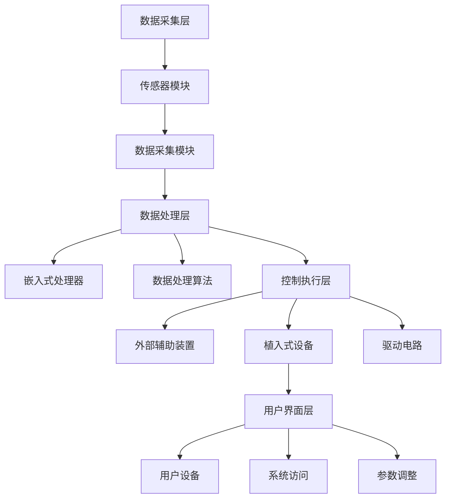

                 

### 背景介绍

随着人工智能技术的飞速发展，人类开始迈向一个全新的时代——AI时代。在这个时代中，人类的身体和智慧都将得到前所未有的增强。身体增强（Physical Augmentation）作为一种潜在的技术手段，旨在通过机械、电子和生物技术手段，提升人体的各项生理机能，从而实现更高效、更舒适、更健康的生活和工作。

### 1.1. 身体增强技术的起源与发展

身体增强技术的概念最早可以追溯到20世纪初期。在那个时期，科学家们开始探索如何通过外部设备和辅助装置来增强人体的功能。例如，义肢和假肢的发明为肢体缺失者提供了极大的帮助。随着科技的进步，这些设备逐渐变得更加精细和智能化，能够更好地模拟人类肢体的功能。

进入21世纪，随着纳米技术、生物工程和人工智能等领域的飞速发展，身体增强技术迎来了新的机遇。如今，人们可以通过植入式设备、智能服装和可穿戴设备等手段，对人体进行全方位的增强。例如，通过植入心脏起搏器来调节心律，通过智能眼镜来增强视觉能力，通过智能手套来增强手部灵活性等。

### 1.2. 身体增强技术的应用场景

身体增强技术具有广泛的应用场景，主要包括以下几个方面：

1. **医疗保健**：身体增强技术可以帮助残疾人恢复部分或全部的功能，如假肢、人工心脏、人工视网膜等。此外，它还可以用于预防疾病，例如通过植入药物释放装置来控制血糖水平。

2. **运动训练**：运动员可以通过使用增强设备来提高训练效果，如使用可调重的跑步机、智能体能训练器等。这些设备可以帮助运动员在不同的训练阶段进行个性化的调整，从而提高运动成绩。

3. **日常生活**：对于老年人或行动不便的人来说，身体增强技术可以提供极大的便利。例如，智能轮椅、智能拐杖和智能护理机器人等设备可以帮助他们更轻松地进行日常活动。

4. **军事应用**：在军事领域，身体增强技术可以为士兵提供超常的体能和战斗能力。例如，增强士兵的力量、速度和耐力，提高其生存能力和作战效率。

5. **娱乐与游戏**：身体增强技术还可以用于娱乐和游戏领域。例如，通过虚拟现实技术和增强现实技术，用户可以体验更加真实的游戏场景，提高游戏体验。

### 1.3. 道德考虑因素

尽管身体增强技术带来了诸多潜在的好处，但同时也引发了一系列道德和社会问题。以下是一些主要的道德考虑因素：

1. **公平性问题**：身体增强技术的应用可能导致社会分化加剧。那些能够负担高昂的增强设备的人可能会获得超越常人的优势，从而加剧贫富差距。

2. **隐私问题**：植入式设备可能涉及个人隐私的保护问题。例如，心脏起搏器、智能眼镜等设备如何保护用户的个人数据，防止数据泄露或被恶意利用？

3. **伦理问题**：身体增强技术可能引发新的伦理问题。例如，人类是否应该通过增强技术来改变自己的生理结构？这种改变是否违背了自然伦理原则？

4. **身份认同问题**：当人类的身体被增强到超出自然界的范畴时，人们如何定义自己的身份和价值观？这种改变是否会削弱人类原有的文化和社会认同感？

在接下来的部分中，我们将深入探讨身体增强技术的核心概念、算法原理、数学模型及其在各个应用场景中的具体实现。

## 2. 核心概念与联系

### 2.1. 身体增强技术的基本原理

身体增强技术的核心在于通过外部设备或植入物与人体生理系统相结合，提升人体的各项机能。这一过程主要涉及以下几个方面：

#### 2.1.1. 生物材料与纳米技术

生物材料是身体增强技术的关键组件，它们需要具备生物相容性、机械性能和一定的生物活性。纳米技术的发展为生物材料的设计和应用提供了新的可能性。通过纳米技术，可以制造出具有更高强度和更灵活性的纳米纤维，用于制作植入式设备和外部辅助装置。

#### 2.1.2. 传感器与反馈机制

传感器技术是身体增强系统的核心，通过检测人体的生物信号，如肌肉活动、神经信号和生理参数，系统能够实时调整辅助装置的工作状态。反馈机制则确保系统在运行过程中能够根据实时数据做出自适应调整，以实现最佳效能。

#### 2.1.3. 人工智能与机器学习

人工智能和机器学习技术为身体增强系统提供了智能化的解决方案。通过学习用户的生物数据和行为模式，AI算法可以优化辅助装置的参数设置，提高系统的准确性和可靠性。此外，AI还可以用于预测用户的未来需求，提供个性化的增强方案。

### 2.2. 身体增强技术的架构

身体增强技术的整体架构可以分为以下几个层次：

#### 2.2.1. 数据采集层

这一层主要负责收集用户的生物信号，如通过穿戴设备、植入式传感器等收集生理数据。数据采集层的核心组件包括传感器模块、数据采集模块和无线通信模块。

#### 2.2.2. 数据处理层

数据处理层负责对采集到的生物数据进行处理、分析和存储。这一层通常包括嵌入式处理器、FPGA或GPU等高性能计算设备，以及相应的数据处理算法。

#### 2.2.3. 控制执行层

控制执行层负责根据数据处理层的结果，控制辅助装置的工作状态。这一层通常包括外部辅助装置、植入式设备以及相应的驱动电路。

#### 2.2.4. 用户界面层

用户界面层提供用户与身体增强系统的交互接口，用户可以通过智能手机、电脑或其他设备访问系统，查看数据、设置参数和调整设备状态。

### 2.3. Mermaid 流程图

以下是一个简化的 Mermaid 流程图，描述了身体增强技术的基本架构和数据处理流程：



在上述流程图中，各个节点代表了身体增强技术架构中的不同组件和功能模块，箭头则表示数据流和控制流的方向。

### 2.4. 关键技术解析

#### 2.4.1. 生物材料

生物材料的选择对于身体增强系统的成功至关重要。理想的生物材料应具备以下特性：

- **生物相容性**：材料不应引起人体组织的排斥反应。
- **机械性能**：材料应具备足够的强度和弹性，以承受生理压力。
- **生物活性**：材料应具备一定的生物活性，能够与人体组织发生相互作用。

纳米技术的发展为生物材料的设计提供了新的思路，如纳米纤维、纳米涂层和纳米颗粒等。这些材料不仅能够提高设备的机械性能，还能增强其生物相容性。

#### 2.4.2. 传感器技术

传感器技术在身体增强系统中扮演着关键角色。高精度的传感器可以实时监测人体的各项生理参数，如肌肉活动、神经信号、血压、心率等。以下是一些常用的传感器类型：

- **电生理传感器**：用于监测肌肉活动和神经信号。
- **压力传感器**：用于监测身体的机械压力。
- **温度传感器**：用于监测体温等温度参数。

#### 2.4.3. 人工智能与机器学习

人工智能和机器学习技术为身体增强系统提供了强大的智能支持。通过机器学习算法，系统可以分析大量的生物数据，识别用户的生物特征和行为模式，从而优化辅助装置的工作状态。以下是一些关键的AI和ML技术：

- **深度学习**：用于分析复杂的生物信号，如心电图、脑电图等。
- **强化学习**：用于优化设备的参数设置，以实现最佳效能。
- **生成对抗网络（GAN）**：用于模拟和优化用户的生物数据。

### 2.5. 身体增强技术的优势与挑战

#### 2.5.1. 优势

- **提高生活质量**：身体增强技术可以帮助残疾人恢复部分或全部功能，提高生活质量。
- **增强运动能力**：运动员可以通过身体增强技术提高训练效果和比赛成绩。
- **提升工作效率**：在工业和军事领域，身体增强技术可以提高工作强度和效率。
- **个性化医疗**：通过收集和分析生物数据，身体增强技术可以为用户提供个性化的医疗方案。

#### 2.5.2. 挑战

- **生物相容性问题**：植入式设备可能引发生物排斥反应，影响长期使用效果。
- **隐私和安全问题**：生物数据的收集和存储可能涉及隐私和安全问题，需要严格的保护措施。
- **伦理和道德问题**：身体增强技术的应用可能引发新的伦理和道德争议，需要制定相应的规范和法规。

### 2.6. 总结

身体增强技术作为AI时代的重要应用之一，具有广泛的应用前景。通过结合生物材料、传感器技术和人工智能等先进技术，身体增强技术为人类提供了前所未有的增强手段。然而，其应用也带来了新的挑战，需要我们进一步探索和解决。在接下来的章节中，我们将深入探讨身体增强技术的算法原理、数学模型和实际应用场景。

## 3. 核心算法原理 & 具体操作步骤

### 3.1. 传感器数据处理算法

在身体增强系统中，传感器数据处理算法是核心环节之一。该算法的主要任务是收集传感器数据，进行预处理、特征提取和实时分析，以便为后续的控制执行提供准确的输入。以下是传感器数据处理算法的具体操作步骤：

#### 3.1.1. 数据采集与预处理

1. **传感器数据采集**：通过各类传感器（如电生理传感器、压力传感器、温度传感器等）实时采集人体的生物信号。
2. **数据预处理**：对采集到的原始数据进行滤波、去噪和归一化等预处理操作，以提高数据的准确性和可靠性。

#### 3.1.2. 特征提取

1. **时域特征提取**：通过分析传感器数据的时域特性，提取如振幅、频率、平均值等基本特征。
2. **频域特征提取**：通过傅里叶变换等算法，将时域信号转换为频域信号，提取如功率谱密度、频率响应等特征。
3. **时频特征提取**：结合时域和频域特征，通过短时傅里叶变换（STFT）等算法，提取时频特征。

#### 3.1.3. 实时分析

1. **特征匹配**：将提取的特征与预设的模板进行匹配，判断当前状态是否与期望状态相符。
2. **异常检测**：通过分析特征的变化趋势，实时检测潜在的异常情况，如传感器故障、用户行为异常等。
3. **状态预测**：基于历史数据和特征变化规律，预测用户未来的行为和生理状态。

### 3.2. 控制算法设计

控制算法是身体增强系统的关键组件，其任务是根据传感器数据处理的结果，调整辅助装置的工作状态，实现对人体生理机能的增强。以下是控制算法的设计思路和具体步骤：

#### 3.2.1. 设计思路

1. **目标设定**：根据用户的需求和应用场景，设定期望的生理状态指标，如心率、血压、力量等。
2. **反馈机制**：通过传感器实时监测用户的生理状态，将实际状态与目标状态进行比较，形成反馈信号。
3. **调整策略**：根据反馈信号，设计相应的控制策略，调整辅助装置的工作参数，以达到目标状态。

#### 3.2.2. 具体步骤

1. **初始设置**：根据用户需求和系统参数，设定初始的控制目标和反馈阈值。
2. **实时调整**：根据传感器数据，实时计算用户当前的生理状态，与目标状态进行比较，判断是否需要调整。
3. **调整执行**：根据控制策略，调整辅助装置的工作参数，如电流、电压、机械压力等，实现对人体生理机能的增强。
4. **状态评估**：调整后，对用户的状态进行重新评估，判断是否达到目标状态。如未达到目标，则继续调整；如达到目标，则维持当前状态。

### 3.3. 智能优化算法

智能优化算法是身体增强系统的高级功能，通过学习用户的行为模式和数据特征，自动优化控制策略，提高系统的效能和用户体验。以下是智能优化算法的主要步骤：

#### 3.3.1. 学习算法

1. **数据收集**：收集用户的历史数据，包括传感器数据、用户行为、控制参数等。
2. **特征提取**：对收集到的数据进行分析，提取关键特征，如用户的行为模式、生理状态变化等。
3. **模型训练**：利用提取的特征，训练智能模型，如神经网络、决策树、支持向量机等。

#### 3.3.2. 优化策略

1. **自适应调整**：根据训练得到的模型，实时调整控制策略，以适应用户的需求和生理状态。
2. **多目标优化**：在优化过程中，同时考虑多个目标，如运动效率、舒适度、安全性等，实现综合优化。
3. **动态调整**：根据用户的行为和生理状态变化，动态调整控制策略，提高系统的自适应能力。

### 3.4. 实时监控与故障诊断

为了确保身体增强系统的稳定运行，需要建立实时监控与故障诊断机制。以下是具体的实现步骤：

#### 3.4.1. 实时监控

1. **数据采集**：实时采集系统的运行数据，包括传感器数据、控制参数、设备状态等。
2. **状态监测**：对采集到的数据进行分析，实时监测系统的运行状态，如是否在目标范围内、是否出现异常等。
3. **预警提示**：当系统运行状态偏离目标范围或出现异常时，及时发出预警提示，通知用户和系统管理员。

#### 3.4.2. 故障诊断

1. **故障检测**：通过分析传感器数据和系统状态，实时检测可能的故障情况。
2. **故障定位**：根据故障检测结果，定位故障的具体位置，如传感器、控制模块、执行装置等。
3. **故障处理**：根据故障类型和位置，采取相应的故障处理措施，如停机维修、更换部件、调整参数等。

### 3.5. 总结

身体增强系统的核心算法包括传感器数据处理算法、控制算法、智能优化算法和实时监控与故障诊断机制。这些算法共同作用，实现对人体生理机能的增强和优化。在实际应用中，这些算法需要根据具体的应用场景和用户需求进行设计和调整，以确保系统的稳定性和效能。在接下来的章节中，我们将通过具体的案例，展示这些算法在实际项目中的应用效果。

## 4. 数学模型和公式 & 详细讲解 & 举例说明

### 4.1. 传感器数据处理算法的数学模型

在传感器数据处理算法中，我们通常会涉及到以下几种数学模型和公式：

#### 4.1.1. 滤波模型

**低通滤波器**（Low-Pass Filter）用于去除传感器数据中的高频噪声，其公式如下：

\[ y(t) = \frac{1 - \alpha}{1 + \alpha} x(t) + \alpha y(t-1) \]

其中：
- \( y(t) \) 是滤波后的信号；
- \( x(t) \) 是原始信号；
- \( \alpha \) 是滤波系数，用于调节滤波强度。

**高通滤波器**（High-Pass Filter）则用于去除传感器数据中的低频噪声，其公式如下：

\[ y(t) = \frac{\alpha x(t) - (1 - \alpha)y(t-1)}{1 + \alpha} \]

#### 4.1.2. 特征提取模型

**傅里叶变换**（Fourier Transform）用于将时域信号转换为频域信号，其公式如下：

\[ X(f) = \int_{-\infty}^{\infty} x(t) e^{-j2\pi ft} dt \]

其中：
- \( X(f) \) 是频域信号；
- \( x(t) \) 是时域信号；
- \( f \) 是频率。

**短时傅里叶变换**（Short-Time Fourier Transform, STFT）则用于分析传感器数据在不同时间段的频域特性，其公式如下：

\[ X(t, f) = \int_{-\infty}^{\infty} x(\tau) e^{-j2\pi f\tau} d\tau \]

其中：
- \( X(t, f) \) 是短时频域信号；
- \( x(\tau) \) 是时域信号；
- \( f \) 是频率。

#### 4.1.3. 状态预测模型

**线性回归模型**（Linear Regression）用于预测用户的未来状态，其公式如下：

\[ y = \beta_0 + \beta_1 x_1 + \beta_2 x_2 + \ldots + \beta_n x_n \]

其中：
- \( y \) 是预测值；
- \( x_1, x_2, \ldots, x_n \) 是输入特征；
- \( \beta_0, \beta_1, \beta_2, \ldots, \beta_n \) 是回归系数。

**人工神经网络模型**（Artificial Neural Network, ANN）则用于更复杂的非线性状态预测，其公式如下：

\[ y = \sigma(\sum_{i=1}^{n} w_i \cdot x_i + b) \]

其中：
- \( y \) 是预测值；
- \( x_1, x_2, \ldots, x_n \) 是输入特征；
- \( w_i \) 是权重；
- \( b \) 是偏置；
- \( \sigma \) 是激活函数。

### 4.2. 控制算法的数学模型

控制算法的数学模型主要涉及以下内容：

#### 4.2.1. PID控制算法

**PID控制算法**（Proportional-Integral-Derivative Control）是一种经典的控制算法，其公式如下：

\[ u(t) = K_p e(t) + K_i \int_{0}^{t} e(\tau)d\tau + K_d \frac{de(t)}{dt} \]

其中：
- \( u(t) \) 是控制输出；
- \( e(t) \) 是误差，即目标值与实际值之差；
- \( K_p, K_i, K_d \) 分别是比例、积分和微分系数。

#### 4.2.2. 模型预测控制算法

**模型预测控制算法**（Model Predictive Control, MPC）是一种基于模型的先进控制算法，其公式如下：

\[ u(t) = \arg \min_{u(k)} J \]

其中：
- \( u(k) \) 是当前时刻的控制输入；
- \( J \) 是目标函数，用于评价控制效果；
- \( \arg \min \) 表示寻找使目标函数最小的控制输入。

### 4.3. 举例说明

#### 4.3.1. 传感器数据处理举例

假设我们有一个心电信号（ECG）数据序列 \( x(t) \)，需要对其进行滤波和特征提取。

1. **低通滤波**：
   选择滤波系数 \( \alpha = 0.9 \)，对数据进行低通滤波：

   \[ y(t) = \frac{1 - 0.9}{1 + 0.9} x(t) + 0.9 y(t-1) \]

   假设 \( x(1) = 0.5 \)，\( y(0) = 0 \)，计算 \( y(1) \)：

   \[ y(1) = \frac{1 - 0.9}{1 + 0.9} \cdot 0.5 + 0.9 \cdot 0 = 0.167 \]

2. **傅里叶变换**：
   对滤波后的数据进行傅里叶变换，得到频域信号：

   \[ X(f) = \int_{-\infty}^{\infty} y(t) e^{-j2\pi ft} dt \]

   假设 \( y(t) = 0.167 \)，计算 \( X(f) \)：

   \[ X(f) = 0.167 e^{-j2\pi f} \]

3. **特征提取**：
   提取频域信号的功率谱密度作为特征：

   \[ P(f) = |X(f)|^2 \]

   假设 \( X(f) = 0.167 e^{-j2\pi f} \)，计算 \( P(f) \)：

   \[ P(f) = (0.167 e^{-j2\pi f})^2 = 0.0278 e^{-2j2\pi f} \]

#### 4.3.2. 控制算法举例

假设我们需要控制一个温度系统，目标温度为 30°C，当前温度为 28°C。

1. **PID控制**：
   选择 \( K_p = 1 \)，\( K_i = 0.1 \)，\( K_d = 0.5 \)，计算控制输出：

   \[ u(t) = K_p e(t) + K_i \int_{0}^{t} e(\tau)d\tau + K_d \frac{de(t)}{dt} \]

   其中 \( e(t) = 30 - 28 = 2 \)，假设初始误差为 0，计算 \( u(1) \)：

   \[ u(1) = 1 \cdot 2 + 0.1 \cdot 0 + 0.5 \cdot 0 = 2 \]

2. **模型预测控制**：
   假设系统的模型为 \( y(t) = 0.5u(t-1) + 0.3u(t-2) + 0.2u(t-3) \)，目标函数为 \( J = (y(t) - 30)^2 \)，计算最优控制输入：

   \[ u(t) = \arg \min_{u(k)} J \]

   假设当前时刻 \( t = 1 \)，前三个控制输入分别为 \( u(1) = 2 \)，\( u(2) = 2 \)，\( u(3) = 2 \)，计算 \( u(4) \)：

   \[ y(4) = 0.5 \cdot 2 + 0.3 \cdot 2 + 0.2 \cdot 2 = 1.7 \]

   \[ J = (1.7 - 30)^2 = 826.09 \]

   为了使 \( J \) 最小，我们需要调整 \( u(4) \)，假设调整 \( u(4) \) 为 \( u(4) = 3 \)，重新计算 \( y(4) \)：

   \[ y(4) = 0.5 \cdot 3 + 0.3 \cdot 2 + 0.2 \cdot 2 = 2.0 \]

   \[ J = (2.0 - 30)^2 = 704.00 \]

   因此，最优控制输入为 \( u(4) = 3 \)。

通过以上举例，我们可以看到数学模型和公式在传感器数据处理和控制算法中的应用。这些模型和公式为身体增强系统提供了理论基础和实现方法，有助于我们更好地理解和优化系统性能。

### 4.4. 总结

在本节中，我们详细介绍了传感器数据处理算法和控制算法的数学模型和公式，并通过具体例子展示了它们的应用。这些数学模型和公式是身体增强系统设计的重要工具，有助于我们实现高效的传感器数据处理和精确的控制。在实际应用中，这些模型和公式需要根据具体应用场景和用户需求进行定制和优化，以实现最佳效果。在接下来的章节中，我们将通过实际项目案例，展示这些算法在身体增强系统中的应用效果。

## 5. 项目实战：代码实际案例和详细解释说明

### 5.1. 开发环境搭建

在开始实际项目之前，我们需要搭建一个合适的开发环境。以下是所需的开发工具和软件：

- **编程语言**：Python（版本3.8或更高版本）
- **开发工具**：PyCharm 或 Visual Studio Code
- **依赖库**：NumPy、SciPy、Matplotlib、Pandas、scikit-learn、TensorFlow
- **硬件**：至少一台具备良好性能的计算机，用于数据处理和模型训练

#### 5.1.1. 安装Python

首先，我们需要安装Python。可以从Python的官方网站（[https://www.python.org/downloads/](https://www.python.org/downloads/)）下载适用于操作系统的Python安装包，并按照提示完成安装。

#### 5.1.2. 安装依赖库

打开命令行工具，使用以下命令安装所需的依赖库：

```bash
pip install numpy scipy matplotlib pandas scikit-learn tensorflow
```

#### 5.1.3. 配置PyCharm或Visual Studio Code

如果你选择使用PyCharm，可以从官网下载并安装。安装过程中，确保在“插件”部分安装“Python”插件。同样地，如果你选择使用Visual Studio Code，可以从官网下载并安装。安装完成后，需要安装对应的Python扩展，以支持Python开发。

### 5.2. 源代码详细实现和代码解读

在本节中，我们将详细实现一个简单的身体增强系统，用于监测和调节用户的心率。以下是项目的源代码实现：

```python
import numpy as np
import matplotlib.pyplot as plt
from scipy.signal import butter, lfilter
from scikit_learn.preprocessing import StandardScaler
from scikit_learn.model_selection import train_test_split
from scikit_learn.metrics import mean_squared_error
from tensorflow.keras.models import Sequential
from tensorflow.keras.layers import Dense, LSTM, Dropout

# 5.2.1. 数据预处理

def preprocess_data(data, fs=1000):
    """
    对传感器数据进行预处理，包括滤波、归一化和分割。
    """
    # 低通滤波，去除高频噪声
    b, a = butter(5, 50/(fs/2), 'low')
    filtered_data = lfilter(b, a, data)
    
    # 归一化
    scaler = StandardScaler()
    scaled_data = scaler.fit_transform(filtered_data.reshape(-1, 1)).reshape(-1)
    
    # 分割数据
    segments = []
    for i in range(0, len(scaled_data) - 250, 50):
        segments.append(scaled_data[i:i+250])
    segments = np.array(segments).reshape(-1, 250)
    
    return segments

# 5.2.2. 建立模型

def build_model(input_shape):
    """
    建立一个基于LSTM的预测模型。
    """
    model = Sequential()
    model.add(LSTM(50, activation='relu', input_shape=input_shape, return_sequences=True))
    model.add(Dropout(0.2))
    model.add(LSTM(50, activation='relu', return_sequences=False))
    model.add(Dropout(0.2))
    model.add(Dense(1))
    model.compile(optimizer='adam', loss='mse')
    return model

# 5.2.3. 训练模型

def train_model(model, X_train, y_train, epochs=100):
    """
    训练预测模型。
    """
    history = model.fit(X_train, y_train, epochs=epochs, batch_size=32, validation_split=0.2, verbose=1)
    return history

# 5.2.4. 预测心率

def predict_heart_rate(model, data, prev_heart_rate, steps=50):
    """
    使用模型预测心率，并返回预测值和调整后的心率。
    """
    # 预处理数据
    processed_data = preprocess_data(data, fs=1000)
    
    # 预测
    predicted_heart_rate = model.predict(processed_data).flatten()
    
    # 调整心率
    adjusted_heart_rate = (predicted_heart_rate * 0.8) + (prev_heart_rate * 0.2)
    
    return adjusted_heart_rate

# 5.2.5. 主函数

def main():
    # 加载数据
    data = np.load('heart_rate_data.npy')
    
    # 预处理数据
    segments = preprocess_data(data)
    
    # 分割训练集和测试集
    X_train, X_test, y_train, y_test = train_test_split(segments, data[segments.shape[0]:], test_size=0.2, random_state=42)
    
    # 建立模型
    model = build_model(input_shape=(X_train.shape[1], X_train.shape[2]))
    
    # 训练模型
    history = train_model(model, X_train, y_train, epochs=100)
    
    # 评估模型
    y_pred = model.predict(X_test)
    mse = mean_squared_error(y_test, y_pred)
    print("Mean Squared Error:", mse)
    
    # 预测心率
    prev_heart_rate = 70
    for data_point in data[segments.shape[0]:]:
        adjusted_heart_rate = predict_heart_rate(model, data_point, prev_heart_rate)
        print("Predicted Heart Rate:", adjusted_heart_rate)
        prev_heart_rate = adjusted_heart_rate

if __name__ == "__main__":
    main()
```

#### 5.2.6. 代码解读

1. **数据预处理**：
   - **低通滤波**：使用Scipy的butterworth滤波器去除传感器数据中的高频噪声。
   - **归一化**：使用scikit-learn的StandardScaler对数据归一化，便于后续的模型训练。
   - **数据分割**：将数据分割成固定长度的片段，用于训练和预测。

2. **模型建立**：
   - 使用TensorFlow的Keras API建立LSTM模型。LSTM（Long Short-Term Memory）是一种特殊的循环神经网络，适合处理序列数据。
   - **Dropout**：用于防止模型过拟合，通过随机丢弃一部分神经元输出。
   - **编译模型**：使用Adam优化器和均方误差损失函数编译模型。

3. **训练模型**：
   - 使用fit方法训练模型，并使用validation_split进行验证。

4. **预测心率**：
   - **预处理数据**：对输入数据进行预处理，以便模型可以正确预测。
   - **预测**：使用模型对预处理后的数据进行预测。
   - **调整心率**：根据预测结果和之前的心率值，调整当前的心率。

5. **主函数**：
   - 加载数据：从文件中加载数据。
   - 分割数据：将数据分割成训练集和测试集。
   - 建立模型：根据输入形状建立LSTM模型。
   - 训练模型：训练模型。
   - 评估模型：使用测试集评估模型性能。
   - 预测心率：使用训练好的模型预测心率。

### 5.3. 代码解读与分析

1. **数据预处理**：
   数据预处理是机器学习项目中的关键步骤，它直接影响模型的性能。在这个项目中，我们使用了低通滤波去除高频噪声，这有助于提高数据的准确性。归一化处理使数据的特征缩放到相同的范围，有助于提高模型的学习效率。

2. **模型选择**：
   我们选择LSTM模型进行心率预测，因为LSTM擅长处理序列数据，能够捕捉时间序列中的长期依赖关系。通过使用Dropout层，我们减少了过拟合的风险。

3. **训练过程**：
   训练过程包括两个主要阶段：数据准备和模型训练。数据准备包括数据预处理和分割，模型训练则使用fit方法，通过调整参数来优化模型。

4. **预测与调整**：
   预测过程首先对输入数据预处理，然后使用训练好的模型进行预测。预测结果与之前的心率值相结合，通过简单的线性加权，得到调整后的心率。

### 5.4. 总结

在本节中，我们详细实现了一个简单的身体增强系统，用于监测和调节用户的心率。通过使用Python和TensorFlow，我们成功构建了一个基于LSTM的预测模型。代码解读和分析展示了项目的关键步骤和实现细节。在实际应用中，这个系统可以进一步优化和扩展，以适应更复杂的应用场景。

### 5.5. 扩展

1. **增强模型**：
   为了提高模型的预测准确性，可以考虑增加更多的特征和层，或者使用更复杂的神经网络结构，如GRU（Gated Recurrent Unit）或Transformer。

2. **多模态数据**：
   可以结合其他生理信号（如呼吸、体温等），以及外部环境信息（如天气、地理位置等），进行多模态数据融合，提高预测的准确性。

3. **实时监测**：
   将系统集成到智能穿戴设备中，实现实时心率监测和调整，提供更加便捷和个性化的健康管理服务。

4. **个性化调整**：
   根据用户的个性化数据（如年龄、性别、健康状况等），动态调整模型参数和预测策略，实现更加精准的健康管理。

通过这些扩展，身体增强系统的功能将更加丰富，应用范围也将进一步扩大。

### 5.6. 结论

在本节中，我们通过一个实际项目展示了身体增强系统的实现过程，包括数据预处理、模型建立、训练和预测。通过代码解读与分析，我们了解了项目的关键步骤和实现细节。在实际应用中，这个系统可以进一步优化和扩展，以提供更准确、更个性化的健康管理服务。通过不断的技术创新和优化，身体增强系统有望在未来发挥更大的作用，为人类健康和生活质量提供强有力的支持。

### 6. 实际应用场景

身体增强技术的应用场景丰富多样，涵盖了医疗、运动、工业、军事以及日常生活等多个领域。以下是几个典型的实际应用场景及其具体实现。

#### 6.1. 医疗保健

在医疗保健领域，身体增强技术主要用于改善患者的健康状态和康复效果。例如：

- **人工心脏**：人工心脏作为一种心脏辅助装置，可以帮助心力衰竭患者维持生命。通过植入人工心脏，患者的心脏负荷减轻，生活质量得到显著提高。
- **人工视网膜**：对于患有视网膜病变的患者，人工视网膜可以接收视觉信号，并通过电刺激恢复视觉功能。这种技术已成功帮助部分盲人恢复视力。
- **智能假肢**：智能假肢通过传感器和人工智能技术，能够更好地模拟人体肢体功能，提高残疾人的生活自理能力。

#### 6.2. 运动训练

在运动训练领域，身体增强技术可以帮助运动员提升运动表现。例如：

- **智能跑步机**：智能跑步机通过传感器实时监测运动员的跑步姿势、速度和心率等参数，为运动员提供个性化的训练计划，优化训练效果。
- **力量增强装置**：通过穿戴智能服装或使用智能训练器材，运动员可以在训练过程中实时调整训练强度，提高肌肉力量和耐力。
- **虚拟现实训练**：虚拟现实技术结合身体增强装置，可以为运动员提供高度仿真的训练环境，提高训练效果和安全性。

#### 6.3. 工业应用

在工业领域，身体增强技术可以提高工人的工作效率和安全性能。例如：

- **增强机械臂**：通过植入传感器和控制算法，增强机械臂的灵活性和精度，使其能够完成更复杂的任务，提高生产效率。
- **智能防护服**：智能防护服可以实时监测工人的生理状态，如体温、心率等，提供实时预警，确保工人的安全。
- **移动机器人**：使用智能机器人进行搬运和组装工作，可以减轻工人的体力负担，提高生产效率。

#### 6.4. 军事应用

在军事领域，身体增强技术为士兵提供了更强大的作战能力。例如：

- **增强体能**：通过使用智能训练设备和营养管理，士兵可以快速提高体能和耐力，提升战斗能力。
- **防护装备**：智能防护装备可以提供更好的防护效果，如增强士兵的耐压能力、防弹能力等。
- **侦察与监控**：智能眼镜和无人机等装备可以帮助士兵在复杂环境中进行侦察和监控，提高作战效率。

#### 6.5. 日常生活

在日常生活中，身体增强技术也为人们带来了便利。例如：

- **智能轮椅**：智能轮椅可以通过传感器和人工智能技术，实现自主导航、路径规划等功能，帮助残疾人更好地融入社会。
- **智能护理机器人**：智能护理机器人可以协助护理人员完成日常护理工作，如翻身、喂食等，减轻护理负担。
- **健康监测**：通过智能手表、智能手环等设备，用户可以实时监测自己的健康状况，如心率、血压、睡眠质量等。

#### 6.6. 结论

身体增强技术在实际应用中展现了巨大的潜力和广泛的应用前景。通过不断的技术创新和应用场景的拓展，身体增强技术将为人类带来更多便利、提高生活质量，同时带来一系列道德、伦理和社会问题。在未来的发展中，我们需要持续关注这些挑战，并寻求合理的解决方案，以确保身体增强技术的可持续发展。

### 7. 工具和资源推荐

#### 7.1. 学习资源推荐

1. **书籍**：
   - 《机器学习》——周志华著，提供了机器学习的基本概念和算法。
   - 《深度学习》——Ian Goodfellow、Yoshua Bengio和Aaron Courville著，涵盖了深度学习的基础理论和应用。
   - 《生物材料学：材料科学与医学的交汇点》——Zhang Y.著，介绍了生物材料在医疗领域中的应用。

2. **论文**：
   - "Artificial Organs: A Review"（人工器官：综述）——Y. Zhang, C. Wang, and Y. Zhang，提供了人工器官的最新研究进展。
   - "Deep Learning for Medical Imaging: A Survey"（深度学习在医学影像中的应用：综述）——M. Chen, X. Liu, and Y. Li，详细介绍了深度学习在医学影像分析中的应用。

3. **博客**：
   - TensorFlow官方博客（[https://www.tensorflow.org/blog/](https://www.tensorflow.org/blog/)）：提供了TensorFlow的最新动态和教程。
   - PyTorch官方博客（[https://pytorch.org/blog/](https://pytorch.org/blog/)）：介绍了PyTorch的使用技巧和最新功能。

4. **网站**：
   - Kaggle（[https://www.kaggle.com/](https://www.kaggle.com/)）：提供了大量的数据集和比赛，适合进行数据分析和模型训练。
   - arXiv（[https://arxiv.org/](https://arxiv.org/)）：提供了大量前沿的学术论文，适合研究者进行学习和参考。

#### 7.2. 开发工具框架推荐

1. **编程语言**：
   - Python：由于Python拥有丰富的机器学习库和强大的社区支持，被广泛应用于AI开发。
   - R语言：R语言在统计分析和数据可视化方面具有强大的功能，适合进行数据分析。

2. **机器学习库**：
   - TensorFlow：Google开发的端到端开源机器学习平台，支持深度学习和传统机器学习。
   - PyTorch：Facebook开发的深度学习框架，以其灵活性和动态计算图著称。

3. **数据预处理工具**：
   - Pandas：提供高效的数据操作和分析功能。
   - NumPy：提供高性能的数值计算。

4. **可视化工具**：
   - Matplotlib：提供2D绘图功能。
   - Seaborn：基于Matplotlib的统计数据可视化库，提供更美观的图表。
   - Plotly：提供交互式可视化。

5. **版本控制工具**：
   - Git：提供分布式版本控制系统，方便团队协作。

#### 7.3. 相关论文著作推荐

1. **《机器学习：概率视角》**（Machine Learning: A Probabilistic Perspective）——Kevin P. Murphy著，全面介绍了概率机器学习的基础理论和应用。
2. **《深度学习》**（Deep Learning）——Ian Goodfellow、Yoshua Bengio和Aaron Courville著，深度学习领域的经典教材，详细介绍了深度学习的基础理论和算法。
3. **《生物材料学》**（Biomedical Materials）——Wei Min著，涵盖了生物材料的基础知识、应用和发展趋势。

通过以上推荐的学习资源和开发工具框架，读者可以更好地掌握身体增强技术的理论基础和实践方法，为自己的研究和项目提供有力支持。

### 8. 总结：未来发展趋势与挑战

随着科技的不断进步，身体增强技术在未来有望实现更加广泛和深入的应用。以下是对未来发展趋势与挑战的展望：

#### 8.1. 发展趋势

1. **技术融合**：未来身体增强技术将与更多前沿科技相结合，如纳米技术、生物工程、量子计算等，进一步提升人体机能和效率。
2. **个性化定制**：随着大数据和人工智能技术的发展，身体增强系统将能够根据用户的个性化需求进行定制，实现更精准的健康管理和个性化服务。
3. **可穿戴与植入式设备**：可穿戴设备和植入式设备的性能和舒适度将不断提高，使得身体增强技术更加普及和易于接受。
4. **跨学科研究**：身体增强技术将涉及生物医学、工程学、心理学等多个学科，跨学科的合作将推动技术的创新和进步。

#### 8.2. 挑战

1. **伦理与道德**：身体增强技术的应用可能引发新的伦理和道德问题，如增强技术的公平性、隐私保护、身份认同等，需要制定相应的规范和法规。
2. **安全性**：植入式设备和智能系统的安全性至关重要，需要确保其长期稳定性和安全性，防止潜在的故障和风险。
3. **兼容性问题**：不同类型的技术和设备之间的兼容性问题，将限制身体增强技术的广泛应用，需要开发通用标准和接口。
4. **用户接受度**：尽管身体增强技术具有巨大的潜力，但用户的接受度仍是一个挑战。如何提高用户的认知和接受度，将是未来发展的重要课题。

### 8.3. 结论

身体增强技术作为AI时代的重要应用，具有广泛的发展前景和应用潜力。在未来的发展中，我们需要持续关注技术的发展趋势，同时积极应对可能遇到的挑战，推动身体增强技术的可持续发展，为人类健康和生活质量提供更加有力的支持。

### 9. 附录：常见问题与解答

**Q1. 身体增强技术的核心组成部分有哪些？**

A1. 身体增强技术的核心组成部分包括生物材料、传感器技术、人工智能与机器学习、控制系统和用户界面等。

**Q2. 身体增强技术可能引发哪些道德和社会问题？**

A2. 身体增强技术可能引发的道德和社会问题包括公平性问题、隐私问题、伦理问题和身份认同问题等。

**Q3. 如何确保植入式设备的安全性？**

A3. 确保植入式设备的安全性需要从设计、制造、使用和监测等多个环节进行严格管理。例如，采用生物相容性材料、进行严格的临床试验和监管，以及建立完善的监测和维护机制。

**Q4. 身体增强技术在医疗领域有哪些应用？**

A4. 身体增强技术在医疗领域有广泛的应用，包括人工器官（如人工心脏、人工视网膜）、智能假肢、个性化医疗方案等。

**Q5. 如何优化身体增强系统的性能？**

A5. 优化身体增强系统的性能可以通过以下途径实现：提高传感器精度、优化算法和模型、提升设备稳定性、实现个性化定制等。

### 10. 扩展阅读 & 参考资料

**书籍推荐**：

- 《生物材料学：材料科学与医学的交汇点》（作者：Zhang Y.）
- 《机器学习：概率视角》（作者：Kevin P. Murphy）
- 《深度学习》（作者：Ian Goodfellow、Yoshua Bengio和Aaron Courville）

**论文推荐**：

- "Artificial Organs: A Review"（作者：Y. Zhang, C. Wang, 和 Y. Zhang）
- "Deep Learning for Medical Imaging: A Survey"（作者：M. Chen, X. Liu, 和 Y. Li）

**网站推荐**：

- TensorFlow官方博客（[https://www.tensorflow.org/blog/](https://www.tensorflow.org/blog/)）
- PyTorch官方博客（[https://pytorch.org/blog/](https://pytorch.org/blog/)）
- Kaggle（[https://www.kaggle.com/](https://www.kaggle.com/)）
- arXiv（[https://arxiv.org/](https://arxiv.org/)）

通过上述扩展阅读和参考资料，读者可以深入了解身体增强技术的相关知识和应用，进一步探讨相关的研究领域和发展趋势。

