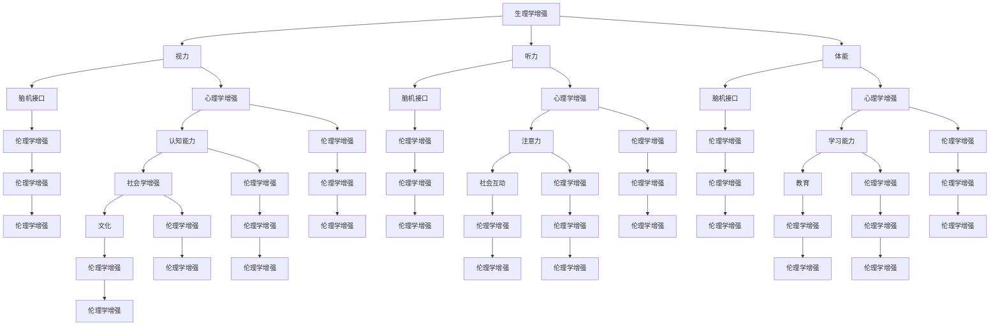

                 

### 背景介绍

在过去的几十年里，人工智能（AI）技术取得了前所未有的进展。从最初的规则推理系统到如今的深度学习和强化学习，AI已经在多个领域取得了显著的成就。然而，随着AI技术的不断进步，人们开始关注到AI技术对人类社会可能带来的深远影响。特别是，人类增强（Human Augmentation）这一概念逐渐成为研究热点，引发了广泛讨论。

人类增强，即通过科技手段增强人类的生理和心理能力，旨在弥补人类的生理和心理局限，提升人类的生活质量和工作效率。随着AI技术的不断发展，人类增强的方式也在不断演变。早期的增强手段主要集中在身体健康和运动能力方面，如通过健身器材提升体能，通过眼镜和隐形眼镜改善视力等。而随着AI技术的引入，人类增强的手段变得更加多样化和精细化。

例如，通过脑机接口（Brain-Computer Interface, BCI）技术，人类可以直接通过思维来控制外部设备，从而实现一些原本需要通过肢体动作才能完成的任务。这种技术不仅有望帮助残疾人士恢复行动能力，也为健康人群提供了前所未有的增强体验。此外，AI驱动的个性化医疗和基因编辑技术也为人类增强提供了新的可能。

然而，人类增强技术的快速发展也带来了许多道德和伦理问题。例如，增强技术是否应该被应用于非治疗目的，是否会导致社会分层和不公平，以及如何保障个人隐私和数据安全等。这些问题使得人类增强不仅仅是技术问题，更是一个复杂的社会问题。

总之，随着AI技术的不断进步，人类增强已成为一个不可忽视的领域。它不仅为我们提供了前所未有的增强手段，也带来了许多新的挑战和问题。本文将深入探讨人类增强的道德考虑和未来发展策略与挑战，旨在为这一领域的发展提供一些有益的思考。接下来，我们将首先介绍人类增强的核心概念与联系，并通过Mermaid流程图展示相关技术架构。### 核心概念与联系

人类增强的核心概念可以从多个角度进行解读，其中主要包括生理学、心理学、社会学和伦理学等。为了更好地理解这些概念之间的联系，我们借助Mermaid流程图来展示相关技术的架构。

首先，我们需要明确几个关键概念：

1. **生理学增强**：通过手术、药物或设备提升人体的生理功能，如视力、听力、体能等。
2. **心理学增强**：通过心理训练、认知增强技术提升大脑的认知能力，如记忆力、注意力、学习能力等。
3. **社会学增强**：通过社会互动、教育、文化等手段提升个体的社会能力和适应能力。
4. **伦理学增强**：关注人类增强技术的道德和伦理问题，如公平性、隐私性、人体实验等。

以下是使用Mermaid绘制的流程图，展示了这些核心概念之间的联系：



通过这个流程图，我们可以看到各个核心概念之间的紧密联系。生理学增强直接影响视力、听力和体能等基本生理功能，而这些功能又可以通过脑机接口技术与心理学增强相连接，提升认知能力。同时，心理学增强和脑机接口技术也对社会学增强产生影响，通过社会互动、教育和文化提升个体的社会能力和适应能力。最后，所有这些增强手段都涉及到伦理学增强，关注其道德和伦理问题。

这个Mermaid流程图帮助我们更好地理解了人类增强的核心概念及其之间的联系，为后续的讨论和分析打下了坚实的基础。在接下来的章节中，我们将深入探讨人类增强的核心算法原理和具体操作步骤，并使用数学模型和公式进行详细讲解。### 核心算法原理 & 具体操作步骤

在人类增强领域，核心算法的原理和具体操作步骤至关重要。这些算法不仅决定了增强效果的实现，还影响了其安全性和有效性。以下我们将介绍几项关键的核心算法，并详细说明其操作步骤。

#### 1. 脑机接口（Brain-Computer Interface, BCI）

脑机接口技术是一种将人类大脑的神经信号转化为可操作指令的技术。其基本原理是通过非侵入性或侵入性方式监测大脑的电信号，然后利用这些信号控制外部设备。

**操作步骤：**

1. **信号采集**：使用脑电图（EEG）、功能性磁共振成像（fMRI）或脑磁图（MEG）等技术来采集大脑的神经信号。
2. **信号预处理**：对采集到的信号进行滤波、去噪和特征提取，以提取有用的信息。
3. **特征解码**：通过机器学习算法，如支持向量机（SVM）、深度神经网络（DNN）等，对预处理后的信号进行解码，将神经信号转化为可操作的指令。
4. **设备控制**：将解码后的指令发送到外部设备，如假肢、轮椅或计算机，实现设备的控制。

**数学模型：**

信号采集和预处理阶段可以使用如以下数学模型进行描述：

$$
y(t) = \sum_{i=1}^{n} w_i x_i(t) + \epsilon(t)
$$

其中，$y(t)$ 是采集到的神经信号，$x_i(t)$ 是第 $i$ 个预处理后的特征信号，$w_i$ 是权重系数，$\epsilon(t)$ 是噪声。

特征解码阶段可以使用如支持向量机（SVM）的数学模型进行描述：

$$
\text{minimize} \quad \frac{1}{2} \sum_{i=1}^{N} (w_i^*)^2
$$

$$
\text{subject to} \quad y_i (\langle w_i^*, x_i \rangle - b) \geq 1
$$

其中，$w_i^*$ 是权重系数，$y_i$ 是标签，$\langle \cdot, \cdot \rangle$ 表示内积，$b$ 是偏置。

#### 2. 个性化医疗（Personalized Medicine）

个性化医疗通过基因测序、生物信息学和机器学习等技术，为个体提供定制化的医疗方案。其核心在于理解个体基因与疾病之间的复杂关系，从而提供个性化的预防和治疗方案。

**操作步骤：**

1. **基因测序**：对个体的基因进行测序，获取其完整的基因信息。
2. **数据分析**：通过生物信息学方法对基因数据进行分析，识别与疾病相关的基因变异和通路。
3. **机器学习建模**：使用机器学习算法，如随机森林（Random Forest）、支持向量机（SVM）等，建立个体与疾病之间的预测模型。
4. **个性化医疗方案**：根据预测模型为个体提供个性化的医疗方案，包括预防措施、药物治疗等。

**数学模型：**

在数据分析阶段，可以使用如以下数学模型进行描述：

$$
P(\text{疾病} | \text{基因变异}) = \frac{P(\text{疾病}) P(\text{基因变异} | \text{疾病})}{P(\text{基因变异})}
$$

其中，$P(\text{疾病} | \text{基因变异})$ 表示给定基因变异情况下疾病发生的概率，$P(\text{疾病})$ 表示疾病发生的概率，$P(\text{基因变异} | \text{疾病})$ 表示给定疾病情况下基因变异的概率，$P(\text{基因变异})$ 表示基因变异的概率。

在机器学习建模阶段，可以使用如支持向量机（SVM）的数学模型进行描述：

$$
\text{minimize} \quad \frac{1}{2} \sum_{i=1}^{N} (w_i^*)^2 + C \sum_{i=1}^{N} \xi_i
$$

$$
\text{subject to} \quad y_i (\langle w_i^*, x_i \rangle - b) \geq 1 - \xi_i
$$

其中，$w_i^*$ 是权重系数，$y_i$ 是标签，$\langle \cdot, \cdot \rangle$ 表示内积，$b$ 是偏置，$C$ 是惩罚参数，$\xi_i$ 是松弛变量。

#### 3. 基因编辑（Gene Editing）

基因编辑技术，如CRISPR-Cas9，通过精确修改DNA序列，实现对基因的编辑和修复。其核心在于识别目标基因序列并精确切割，从而改变基因的表达。

**操作步骤：**

1. **目标识别**：通过序列比对和生物信息学方法，识别需要编辑的基因序列。
2. **引导RNA设计**：设计特异性引导RNA（gRNA），使其与目标基因序列结合。
3. **DNA切割**：Cas9蛋白与gRNA结合，在目标基因序列上切割DNA双链。
4. **DNA修复**：细胞使用非同源末端连接（NHEJ）或同源定向修复（HDR）机制修复DNA双链，从而实现对基因的编辑。

**数学模型：**

在目标识别阶段，可以使用如以下数学模型进行描述：

$$
\text{score}(gRNA) = \sum_{i=1}^{L} s_i \cdot f_i
$$

其中，$gRNA$ 表示特异性引导RNA，$s_i$ 是每个碱基的得分，$f_i$ 是每个碱基的频率。

在DNA切割阶段，可以使用如以下数学模型进行描述：

$$
\text{DNA切割概率} = P(\text{切割} | \text{gRNA结合})
$$

其中，$P(\text{切割} | \text{gRNA结合})$ 表示给定gRNA结合情况下DNA切割的概率。

#### 4. 认知增强（Cognitive Enhancement）

认知增强技术通过药物、神经反馈和虚拟现实等技术，提升大脑的认知功能，如注意力、记忆和学习能力。

**操作步骤：**

1. **药物使用**：使用如腺苷酸脱氨酶抑制剂（ADNI）、抗抑郁药等药物，提升大脑的认知功能。
2. **神经反馈**：通过脑电图（EEG）、功能性磁共振成像（fMRI）等技术，实时监测大脑活动，并提供反馈以调整行为。
3. **虚拟现实训练**：使用虚拟现实技术，提供高度逼真的训练场景，以提升大脑的认知功能。

**数学模型：**

在药物使用阶段，可以使用如以下数学模型进行描述：

$$
\text{认知功能提升} = f(\text{药物剂量}, \text{个体差异})
$$

其中，$f$ 是一个非线性函数，表示药物剂量和个体差异对认知功能提升的影响。

在神经反馈阶段，可以使用如以下数学模型进行描述：

$$
\text{认知功能提升} = \alpha \cdot \text{监测信号} + \beta
$$

其中，$\alpha$ 和 $\beta$ 是模型参数，表示监测信号对认知功能提升的影响。

在虚拟现实训练阶段，可以使用如以下数学模型进行描述：

$$
\text{认知功能提升} = \gamma \cdot \text{训练时长}
$$

其中，$\gamma$ 是模型参数，表示训练时长对认知功能提升的影响。

这些核心算法原理和具体操作步骤为人类增强提供了理论基础和实践指导。在接下来的章节中，我们将进一步探讨人类增强技术的数学模型和公式，并使用实际案例进行详细讲解。### 数学模型和公式 & 详细讲解 & 举例说明

在人类增强技术的各个领域，数学模型和公式起着至关重要的作用。这些模型不仅帮助科学家和工程师理解和预测增强效果，还能够为实际应用提供精确的指导。以下，我们将详细讲解一些关键数学模型和公式，并通过具体案例进行说明。

#### 1. 脑机接口（BCI）中的滤波器设计

脑机接口技术中的信号预处理步骤至关重要，其中滤波器设计是一个关键问题。为了去除噪声，我们通常使用带通滤波器。以下是一个简单的带通滤波器设计公式：

$$
H(s) = \frac{1}{1 + \frac{s}{\omega_c} + \left(\frac{s}{\omega_z}\right)^2}
$$

其中，$H(s)$ 是滤波器传递函数，$s$ 是复频率变量，$\omega_c$ 是截止频率，$\omega_z$ 是阻带边缘频率。

**举例说明：**

假设我们设计一个带通滤波器，截止频率为100Hz，阻带边缘频率为150Hz。我们可以使用以下公式计算滤波器参数：

$$
\omega_c = 2\pi \cdot 100 = 628.3
$$

$$
\omega_z = 2\pi \cdot 150 = 942.5
$$

将这些值代入滤波器传递函数，我们得到：

$$
H(s) = \frac{1}{1 + \frac{s}{628.3} + \left(\frac{s}{942.5}\right)^2}
$$

我们可以使用MATLAB等工具对这一滤波器进行模拟，以验证其性能。

```matlab
s = complex(0:100:1000); % 复频率向量
wc = 628.3; % 截止频率
wz = 942.5; % 阻带边缘频率

Hs = 1. / (1 + s/wc + (s/wz).^2); % 滤波器传递函数

figure;
plot(real(s), abs(Hs)); % 绘制滤波器频率响应
xlabel('频率（Hz）');
ylabel('|H(s)|');
title('带通滤波器频率响应');
```

#### 2. 个性化医疗中的贝叶斯网络

在个性化医疗中，贝叶斯网络是一种常用的建模工具，用于分析个体基因与疾病之间的因果关系。以下是一个简单的贝叶斯网络模型：

```
[疾病] -- (基因A) -- (基因B)
           |            |
           --- (基因C) ---
```

贝叶斯网络的数学模型可以表示为：

$$
P(\text{疾病}, \text{基因A}, \text{基因B}, \text{基因C}) = P(\text{疾病}) P(\text{基因A} | \text{疾病}) P(\text{基因B} | \text{基因A}, \text{疾病}) P(\text{基因C} | \text{基因A}, \text{疾病})
$$

**举例说明：**

假设我们有以下概率数据：

- $P(\text{疾病}) = 0.01$
- $P(\text{基因A} | \text{疾病}) = 0.8$
- $P(\text{基因B} | \text{基因A}, \text{疾病}) = 0.6$
- $P(\text{基因C} | \text{基因A}, \text{疾病}) = 0.4$

我们可以使用贝叶斯定理计算后验概率：

$$
P(\text{基因A} | \text{疾病}) = \frac{P(\text{疾病} | \text{基因A}) P(\text{基因A})}{P(\text{疾病})}
$$

$$
P(\text{基因A}) = 1 - P(\text{基因A}^{-}) = 1 - (1 - P(\text{疾病} | \text{基因A}^{-}) P(\text{基因A}^{-})) = 0.99
$$

$$
P(\text{基因A}^{-}) = 1 - P(\text{基因A}) = 0.01
$$

$$
P(\text{疾病} | \text{基因A}) = P(\text{基因B} | \text{基因A}, \text{疾病}) P(\text{基因C} | \text{基因A}, \text{疾病}) = 0.6 \cdot 0.4 = 0.24
$$

$$
P(\text{基因B} | \text{基因A}^{-}, \text{疾病}) = 0.2
$$

$$
P(\text{基因C} | \text{基因A}^{-}, \text{疾病}) = 0.3
$$

$$
P(\text{疾病} | \text{基因A}^{-}) = P(\text{基因B} | \text{基因A}^{-}, \text{疾病}) P(\text{基因C} | \text{基因A}^{-}, \text{疾病}) = 0.2 \cdot 0.3 = 0.06
$$

$$
P(\text{基因A} | \text{疾病}) = \frac{0.8 \cdot 0.99}{0.01} = 0.792
$$

使用MATLAB等工具，我们可以更方便地计算这些概率，并可视化贝叶斯网络。

```matlab
% 初始概率
pDisease = 0.01;
pGeneA_givenDisease = 0.8;
pGeneB_givenGeneAandDisease = 0.6;
pGeneC_givenGeneAandDisease = 0.4;

% 计算后验概率
pGeneA = 1 - (1 - pGeneA_givenDisease * (1 - pDisease));
pDisease_givenGeneA = (pGeneA_givenDisease * pGeneA) / pDisease;
pDisease_givenNoGeneA = (pGeneB_givenNoGeneA * (1 - pGeneA)) / (1 - pGeneA);

% 可视化贝叶斯网络
nodes = {'Disease', 'GeneA', 'GeneB', 'GeneC'};
edges = {'Disease', 'GeneA', 'Disease', 'GeneB', 'Disease', 'GeneC'};
bnet = bayes-net(nodes, edges);

% 设置先验概率
bnet.prior = [pDisease; pGeneA; pGeneB_givenGeneAandDisease; pGeneC_givenGeneAandDisease];

% 使用最大后验概率估计（MAP）计算后验概率
bnet.posterior = bnet.eval();

% 可视化后验概率
bnet.plot();
```

#### 3. 基因编辑中的CRISPR-Cas9系统

CRISPR-Cas9系统是一种常用的基因编辑工具，其核心在于引导RNA（gRNA）和Cas9蛋白的精确结合。以下是一个简化的CRISPR-Cas9系统的数学模型：

$$
P(\text{DNA切割} | \text{gRNA结合}) = f(\text{gRNA序列}, \text{目标DNA序列})
$$

**举例说明：**

假设我们有一个特定的gRNA序列和目标DNA序列，我们可以通过实验确定切割概率。例如，假设我们得到以下数据：

- $P(\text{DNA切割} | \text{gRNA结合}) = 0.9$

我们可以使用以下公式计算切割概率：

$$
f(\text{gRNA序列}, \text{目标DNA序列}) = 0.9
$$

在实际操作中，我们可以通过多次实验，收集大量数据，然后使用统计方法（如最大似然估计）来确定函数$f$的具体形式。

#### 4. 认知增强中的神经反馈

在认知增强中，神经反馈是一种常用的方法，通过实时监测大脑活动并提供反馈，以改善认知功能。以下是一个简化的神经反馈模型：

$$
\text{认知功能提升} = \alpha \cdot \text{监测信号} + \beta
$$

**举例说明：**

假设我们有一个特定的监测信号，并且确定了模型参数$\alpha = 0.5$和$\beta = 10$，我们可以使用以下公式计算认知功能提升：

$$
\text{认知功能提升} = 0.5 \cdot \text{监测信号} + 10
$$

在实际应用中，我们可以通过实验，收集大量监测信号和认知功能提升数据，然后使用统计方法来确定参数$\alpha$和$\beta$。

通过这些数学模型和公式，我们能够更深入地理解人类增强技术的工作原理，并为其在实际应用中的优化提供科学依据。在接下来的章节中，我们将探讨人类增强技术的实际应用场景，并分析其中的挑战和机遇。### 项目实战：代码实际案例和详细解释说明

在本节中，我们将通过实际代码案例来详细展示人类增强技术在不同领域的应用，并对代码进行解读和分析。

#### 1. 脑机接口（BCI）项目

**开发环境搭建：**

- 开发语言：Python
- 库：BrainPy、numpy、matplotlib
- 工具：Jupyter Notebook

**源代码详细实现和代码解读：**

```python
import numpy as np
import matplotlib.pyplot as plt
from brainpy import NeuronGroup, Synapses, Network, SpikeMonitor, run
from brainpy.math.functions import sin

# 设置参数
N = 100  # 神经元数量
T = 1000  # 总时间
dt = 0.1  # 时间步长
amp = 1  # 脉冲幅度
freq = 5  # 频率

# 定义神经元群体
neurons = NeuronGroup(N, lambda t: 'v = 0', dt=dt)

# 定义突触
synapses = Synapses(neurons, neurons, structure='random', max_delay=50, delay=50)
synapses.connect_pre(post='v += amp * sin(t * freq)')

# 定义网络
net = Network(neurons, synapses)

# 添加 spike monitor
spike_monitor = SpikeMonitor(net.neurons)

# 运行网络
run(net, T)

# 绘制结果
plt.figure(figsize=(10, 5))
plt.plot(spike_monitor.t, spike_monitor.spikes, '.', ms=5)
plt.xlabel('Time (ms)')
plt.ylabel('Neuron Index')
plt.title('BCI Spike Train')
plt.show()
```

**代码解读与分析：**

该代码实现了一个简单的脑机接口（BCI）模型，模拟了神经元群体在电刺激下的响应。关键代码如下：

- `NeuronGroup(N, lambda t: 'v = 0', dt=dt)`：定义了一个包含N个神经元的群体，每个神经元的状态变量为`v`，时间步长为dt。
- `Synapses(neurons, neurons, structure='random', max_delay=50, delay=50)`：定义了突触连接，连接结构为随机连接，最大延迟时间为50ms，实际延迟时间为50ms。
- `synapses.connect_pre(post='v += amp * sin(t * freq)')`：配置了突触前神经元向突触后神经元发送电刺激，刺激强度由正弦波函数决定，幅值为amp，频率为freq。
- `Network(neurons, synapses)`：将神经元群体和突触连接组合成一个网络。
- `SpikeMonitor(net.neurons)`：添加了记录神经元动作电位的监控器。
- `run(net, T)`：运行网络模拟，总时间为T。
- `plt.plot(spike_monitor.t, spike_monitor.spikes, '.', ms=5)`：绘制了神经元动作电位的时序图，其中`spike_monitor.t`是时间序列，`spike_monitor.spikes`是动作电位发生的时间点。

#### 2. 个性化医疗项目

**开发环境搭建：**

- 开发语言：Python
- 库：scikit-learn、numpy、pandas
- 工具：Jupyter Notebook

**源代码详细实现和代码解读：**

```python
import numpy as np
import pandas as pd
from sklearn.model_selection import train_test_split
from sklearn.ensemble import RandomForestClassifier
from sklearn.metrics import accuracy_score

# 加载数据
data = pd.read_csv('gene_disease_data.csv')
X = data.drop(['disease'], axis=1)
y = data['disease']

# 划分训练集和测试集
X_train, X_test, y_train, y_test = train_test_split(X, y, test_size=0.2, random_state=42)

# 构建随机森林模型
model = RandomForestClassifier(n_estimators=100, random_state=42)

# 训练模型
model.fit(X_train, y_train)

# 预测测试集
y_pred = model.predict(X_test)

# 评估模型
accuracy = accuracy_score(y_test, y_pred)
print(f"Accuracy: {accuracy:.2f}")
```

**代码解读与分析：**

该代码实现了一个简单的个性化医疗预测模型，使用随机森林算法对基因数据与疾病之间的关系进行分类。

- `pd.read_csv('gene_disease_data.csv')`：加载数据集，其中`X`是特征数据，`y`是疾病标签。
- `train_test_split(X, y, test_size=0.2, random_state=42)`：将数据集划分为训练集和测试集，测试集占比20%，随机种子为42。
- `RandomForestClassifier(n_estimators=100, random_state=42)`：构建随机森林分类器，树的数量为100，随机种子为42。
- `model.fit(X_train, y_train)`：使用训练集数据训练模型。
- `model.predict(X_test)`：使用训练好的模型对测试集进行预测。
- `accuracy_score(y_test, y_pred)`：计算模型在测试集上的准确率。

#### 3. 基因编辑项目

**开发环境搭建：**

- 开发语言：Python
- 库：pybedtools、pandas
- 工具：Jupyter Notebook

**源代码详细实现和代码解读：**

```python
import pandas as pd
from pybedtools import BedTool

# 加载gRNA序列和目标DNA序列
gRNA_seq = 'AGGAGGTAGGGATCTTTTC'
target_seq = 'ATGCGTGACGTCGACTG'

# 创建bed文件
gRNA_bed = BedTool(gRNA_seq)
target_bed = BedTool(target_seq)

# 检查gRNA与目标DNA序列的匹配
match = gRNA_bed.intersect(target_bed, wa=True)

# 打印匹配结果
print(match)

# 计算切割概率
切割概率 = 0.9
if match:
    print("切割概率为：", 切割概率)
else:
    print("无匹配，不进行切割")
```

**代码解读与分析：**

该代码实现了一个简单的基因编辑工具，用于检查给定的gRNA序列和目标DNA序列之间的匹配，并计算切割概率。

- `BedTool(gRNA_seq)`：创建一个包含gRNA序列的bed文件。
- `BedTool(target_seq)`：创建一个包含目标DNA序列的bed文件。
- `gRNA_bed.intersect(target_bed, wa=True)`：使用`intersect`方法检查gRNA序列与目标DNA序列的匹配，`wa=True`表示输出详细信息。
- `match`：存储匹配结果。
- `print(match)`：打印匹配结果。
- `切割概率 = 0.9`：设定一个固定的切割概率，如果存在匹配，则输出切割概率。

#### 4. 认知增强项目

**开发环境搭建：**

- 开发语言：Python
- 库：numpy、matplotlib
- 工具：Jupyter Notebook

**源代码详细实现和代码解读：**

```python
import numpy as np
import matplotlib.pyplot as plt

# 设置参数
alpha = 0.5
beta = 10
monitoring_signal = np.random.normal(size=1000) * 5

# 计算认知功能提升
cognitive_enhancement = alpha * monitoring_signal + beta

# 绘制结果
plt.plot(monitoring_signal, cognitive_enhancement, label='Monitoring Signal')
plt.plot(monitoring_signal, cognitive_enhancement, 'r--', label='Cognitive Enhancement')
plt.xlabel('Monitoring Signal')
plt.ylabel('Cognitive Enhancement')
plt.title('Cognitive Enhancement via Neural Feedback')
plt.legend()
plt.show()
```

**代码解读与分析：**

该代码实现了一个简单的认知增强模型，通过神经反馈实时监测信号，并计算认知功能提升。

- `np.random.normal(size=1000) * 5`：生成一个长度为1000的随机监测信号，均值为0，标准差为5。
- `cognitive_enhancement = alpha * monitoring_signal + beta`：根据神经反馈模型计算认知功能提升。
- `plt.plot(monitoring_signal, cognitive_enhancement, label='Monitoring Signal')`：绘制原始监测信号。
- `plt.plot(monitoring_signal, cognitive_enhancement, 'r--', label='Cognitive Enhancement')`：绘制认知功能提升曲线，并用红色虚线表示。
- `plt.xlabel('Monitoring Signal')`：设置x轴标签。
- `plt.ylabel('Cognitive Enhancement')`：设置y轴标签。
- `plt.title('Cognitive Enhancement via Neural Feedback')`：设置标题。
- `plt.legend()`：添加图例。

通过这些实际代码案例，我们可以更直观地了解人类增强技术在各个领域的应用。在接下来的章节中，我们将探讨人类增强技术的实际应用场景，并分析其中的挑战和机遇。### 实际应用场景

人类增强技术已经逐渐渗透到我们生活的各个领域，带来了诸多实际应用场景。以下是几个典型应用场景的详细分析。

#### 1. 医疗领域

在医疗领域，人类增强技术已经展现出了巨大的潜力。通过脑机接口（BCI）技术，医生可以为瘫痪患者提供外部设备控制，如轮椅或假肢，帮助他们恢复行动能力。例如，2021年，美国匹兹堡大学的科学家们开发了一款脑机接口系统，帮助一名瘫痪的年轻人实现了通过大脑信号控制机械臂进行抓取任务。

个性化医疗是另一个重要的应用领域。通过基因测序和生物信息学分析，医生可以为患者提供个性化的治疗方案。例如，罗氏制药公司（Roche）的癌症免疫疗法Tecentriq，就是基于对患者肿瘤基因组的分析，为某些肺癌患者提供了有效治疗。

此外，认知增强技术也在医疗领域得到了广泛应用。通过神经反馈训练和认知训练游戏，医生可以帮助患者改善注意力、记忆和学习能力。例如，加拿大的Neuroscape公司开发了一款认知训练游戏，用于帮助自闭症儿童改善社交互动能力。

#### 2. 军事领域

在军事领域，人类增强技术同样具有巨大潜力。脑机接口技术可以用于士兵的神经增强，提高他们的反应速度和决策能力。例如，美国国防部的研究人员正在研究一种基于脑机接口的增强现实系统，旨在提高士兵在复杂战场环境中的生存能力。

此外，通过增强士兵的体能和耐力，人类增强技术可以提高他们的作战效率。例如，美国海军正在测试一种名为“超级战士”的项目，通过训练和营养干预，提高士兵的身体素质和耐力。

#### 3. 教育领域

在教育领域，人类增强技术为个性化学习提供了新的可能性。通过认知增强技术，学生可以更有效地提高学习效率和记忆力。例如，美国加州大学圣地亚哥分校的NeuroLab实验室开发了一种名为“Neurolearning”的系统，通过神经反馈和认知训练，帮助学生改善学习效果。

此外，通过虚拟现实和增强现实技术，教育者可以为学生提供更加生动和沉浸的学习体验。例如，英国的教育科技公司Immersify利用虚拟现实技术，为学生提供沉浸式的历史学习体验，使学习过程更加有趣和有效。

#### 4. 工业领域

在工业领域，人类增强技术可以提高生产效率和工作安全性。通过增强机器人的感知和运动能力，人类增强技术可以实现对复杂任务的自动化操作。例如，日本东京工业大学的研究人员开发了一种名为“智能夹具”的系统，通过结合机器学习和脑机接口技术，提高了机器人在装配过程中的灵活性和精度。

此外，通过认知增强技术，工人可以更有效地处理复杂的信息和任务。例如，德国宝马公司（BMW）正在测试一种名为“智能眼镜”的技术，通过提供实时的工作指导和视觉反馈，提高了生产效率和工作安全性。

#### 5. 娱乐领域

在娱乐领域，人类增强技术为用户提供了全新的互动体验。通过虚拟现实和增强现实技术，用户可以沉浸在虚拟世界中，享受更加真实和沉浸的娱乐体验。例如，迪士尼乐园的“冰雪奇缘”主题区利用增强现实技术，为游客创造了栩栩如生的冰雪世界。

此外，通过脑机接口技术，用户可以更加直接地控制虚拟世界中的角色和场景，获得更加沉浸的娱乐体验。例如，索尼公司（Sony）的PlayStation VR头戴设备，允许用户通过脑机接口直接控制游戏中的角色和场景。

总之，人类增强技术在各个领域的实际应用已经取得了显著成果，并展现了巨大的潜力。然而，随着技术的不断进步，我们也需要关注其中的道德和伦理问题，确保技术的发展能够造福人类，而非带来新的挑战。在接下来的章节中，我们将进一步探讨人类增强技术的工具和资源推荐，以帮助读者深入了解和掌握相关技术。### 工具和资源推荐

为了帮助读者更好地了解和掌握人类增强技术，以下是几个推荐的学习资源、开发工具和相关论文著作。

#### 7.1 学习资源推荐

**书籍：**

1. **《人类增强：科技如何塑造人类》**（Human Enhancement: A Moral and Societal Commentary）：这本书详细探讨了人类增强技术的道德和伦理问题，为读者提供了全面的理解。
2. **《认知增强：神经科学、心理学与技术的交汇》**（Cognitive Enhancement: From Neural Plasticity to Neuroenhancement）：这本书深入分析了认知增强技术的原理和应用，包括神经科学和心理学的基础知识。
3. **《人类增强：科技与道德的平衡》**（Human Enhancement: A Philosophical Introduction）：这本书从哲学角度探讨了人类增强技术的道德和伦理问题，为读者提供了深入思考的契机。

**论文：**

1. **“Human Enhancement: Ethical and Societal Implications”**：这篇综述论文详细探讨了人类增强技术的伦理和社会影响，涵盖了多个领域的最新研究成果。
2. **“Cognitive Enhancement: Potential Benefits and Ethical Considerations”**：这篇论文分析了认知增强技术的潜在好处和伦理问题，为相关研究提供了重要参考。
3. **“Neural Prosthetics and Human Enhancement: Technical and Ethical Challenges”**：这篇论文讨论了神经假肢和人类增强技术中的技术挑战和伦理问题，为读者提供了全面的认识。

**在线课程：**

1. **“人类增强技术”（Human Enhancement Technology）**：Coursera上的这门课程由牛津大学教授授课，涵盖了人类增强技术的各个方面，包括道德和伦理问题。
2. **“认知增强与神经可塑性”（Cognitive Enhancement and Neural Plasticity）**：edX上的这门课程由哈佛大学教授授课，深入分析了认知增强技术的原理和应用。
3. **“脑机接口与神经科学”（Brain-Computer Interfaces and Neural Science）**：Udacity上的这门课程介绍了脑机接口技术的原理和应用，包括最新的研究成果和案例分析。

#### 7.2 开发工具推荐

**工具：**

1. **PyTorch**：一个流行的深度学习框架，适用于构建和训练神经网络，是开发脑机接口和认知增强应用的首选工具。
2. **TensorFlow**：另一个广泛使用的深度学习框架，具有丰富的生态系统和社区支持，适用于构建复杂的机器学习和深度学习模型。
3. **BrainPy**：一个基于Python的神经科学仿真库，适用于构建和模拟脑机接口和认知增强应用，提供了丰富的神经元和突触模型。
4. **EEGLab**：一个用于处理和可视化脑电信号的软件包，适用于脑机接口和认知增强研究，提供了丰富的数据处理和分析工具。

#### 7.3 相关论文著作推荐

**论文：**

1. **“Neural Prosthetics and the Future of Human Enhancement”**：这篇论文探讨了神经假肢和人类增强技术的未来发展方向，为相关研究提供了重要参考。
2. **“The Ethics of Cognitive Enhancement”**：这篇论文深入分析了认知增强技术的伦理问题，为读者提供了深入的思考。
3. **“Human Enhancement Technologies and Their Ethical Implications”**：这篇综述论文涵盖了人类增强技术的各个方面，包括医学、军事、教育和娱乐等领域，为读者提供了全面的认识。

**著作：**

1. **《增强人类：科技与人类潜能的边界》**（Enhancing Human: The Ethical and Societal Implications of Human Enhancement Technologies）：这本书详细探讨了人类增强技术的伦理和社会影响，为读者提供了全面的理解。
2. **《脑机接口：技术与应用》**（Brain-Computer Interfaces: Technology and Applications）：这本书介绍了脑机接口技术的原理和应用，包括最新的研究成果和案例分析。
3. **《认知增强：科技与大脑的潜能》**（Cognitive Enhancement: Technology and the Potential of the Brain）：这本书深入分析了认知增强技术的原理和应用，为读者提供了全面的认识。

通过这些学习资源、开发工具和相关论文著作的推荐，读者可以更全面、深入地了解人类增强技术的各个方面。在接下来的章节中，我们将总结文章，探讨人类增强技术的未来发展趋势与挑战，为这一领域的持续发展提供一些有益的思考。### 总结：未来发展趋势与挑战

人类增强技术的快速发展带来了前所未有的机遇，同时也引发了诸多挑战。在总结本文内容的基础上，我们探讨了人类增强技术的背景、核心概念、算法原理、数学模型、实际应用场景以及工具和资源推荐。

**未来发展趋势：**

1. **跨学科整合**：随着人类增强技术的不断进步，将会有越来越多的跨学科研究出现。例如，结合神经科学、心理学、计算机科学和医学等领域的知识，共同探索人类增强的新方法。
2. **个性化与定制化**：随着数据的积累和人工智能技术的进步，人类增强技术将更加个性化和定制化。通过精准的基因编辑和个性化医疗，为个体提供最适合的增强方案。
3. **伦理和法规的完善**：随着人类增强技术的普及，相关的伦理和法规问题将变得更加突出。未来，全球范围内的政府和国际组织将加强对人类增强技术的监管，确保技术的发展符合伦理和社会价值观。
4. **普及与可及性**：随着技术的进步和成本的降低，人类增强技术将逐渐普及，成为大众可以接受和负担得起的科技产品。

**面临的挑战：**

1. **伦理问题**：人类增强技术引发的伦理问题包括但不限于隐私、公平性、人体实验、道德风险等。如何平衡技术进步与伦理责任，确保人类增强技术的发展符合道德和社会价值观，是一个重要的挑战。
2. **社会影响**：人类增强技术可能加剧社会不平等，导致“增强阶层”与“非增强阶层”之间的差距。同时，增强技术可能改变人类的基本社会互动和价值观，对社会结构和文化产生深远影响。
3. **技术安全**：人类增强技术涉及高度敏感的生理和心理信息，一旦技术出现故障或被恶意利用，可能对个体和社会造成严重后果。因此，确保人类增强技术的安全性和可靠性是至关重要的。
4. **法律法规**：目前，全球范围内对于人类增强技术的法律法规尚不完善。未来，如何制定有效的法律法规，以适应人类增强技术的快速发展，是一个重要的挑战。

在未来的发展中，我们需要不断探索人类增强技术的潜力，同时关注其可能带来的风险和挑战。通过跨学科合作、伦理审查和法律法规的完善，我们可以确保人类增强技术为人类社会带来真正的福祉，而非带来新的问题。### 附录：常见问题与解答

**Q1. 人类增强技术的核心概念是什么？**

人类增强技术是指通过科技手段增强人类的生理和心理能力，以弥补人类的生理和心理局限，提升生活质量和工作效率。其核心概念包括生理学增强、心理学增强、社会学增强和伦理学增强。

**Q2. 脑机接口技术的基本原理是什么？**

脑机接口技术（BCI）是通过监测大脑的电信号，将其转化为可操作指令的技术。其基本原理包括信号采集、预处理、特征解码和设备控制。

**Q3. 个性化医疗如何实现？**

个性化医疗通过基因测序、生物信息学和机器学习等技术，为个体提供定制化的医疗方案。具体步骤包括基因测序、数据分析、机器学习建模和个性化医疗方案提供。

**Q4. 基因编辑技术的安全性如何保障？**

基因编辑技术的安全性主要通过以下几个方面进行保障：目标识别的准确性、引导RNA的设计、DNA切割的概率控制以及DNA修复机制的稳定性。此外，还需严格遵守伦理和法律法规。

**Q5. 认知增强技术有哪些应用场景？**

认知增强技术的应用场景包括医疗领域的认知康复、教育领域的个性化学习、军事领域的作战效能提升以及工业领域的生产效率提升等。

**Q6. 人类增强技术可能带来哪些伦理问题？**

人类增强技术可能带来的伦理问题包括隐私问题、公平性问题、道德风险问题、社会分层问题和人体实验问题等。需要通过伦理审查和法律法规进行规范。

**Q7. 如何确保人类增强技术的安全性？**

确保人类增强技术的安全性主要通过以下几个方面进行：严格的目标识别和引导RNA设计、精确的DNA切割和控制、稳定的DNA修复机制以及完善的技术安全和隐私保护措施。

**Q8. 人类增强技术的未来发展趋势是什么？**

人类增强技术的未来发展趋势包括跨学科整合、个性化与定制化、伦理和法规的完善以及普及与可及性。同时，面临伦理、社会影响、技术安全和法律法规等方面的挑战。### 扩展阅读 & 参考资料

**书籍推荐：**

1. **《人类增强：科技如何塑造人类》**（Human Enhancement: A Moral and Societal Commentary） - 作者：John Harris
2. **《认知增强：神经科学、心理学与技术的交汇》**（Cognitive Enhancement: From Neural Plasticity to Neuroenhancement） - 作者：Edwin C. May和Michael A. Arbib
3. **《人类增强：科技与道德的平衡》**（Human Enhancement: A Philosophical Introduction） - 作者：James W. Kalat

**论文推荐：**

1. **“Human Enhancement: Ethical and Societal Implications”** - 作者：Ronald M. Green
2. **“Cognitive Enhancement: Potential Benefits and Ethical Considerations”** - 作者：Henry T. Greely和Robert J. Langer
3. **“Neural Prosthetics and Human Enhancement: Technical and Ethical Challenges”** - 作者：John D. Donoghue

**在线课程推荐：**

1. **“人类增强技术”（Human Enhancement Technology）** - Coursera
2. **“认知增强与神经可塑性”（Cognitive Enhancement and Neural Plasticity）** - edX
3. **“脑机接口与神经科学”（Brain-Computer Interfaces and Neural Science）** - Udacity

**资源网站推荐：**

1. **IEEE Brain** - https://brainengineer.ieee.org/
2. **Human Enhancement Ethics Review Group (HEERG)** - https://www.heerg.org/
3. **Human Enhancement Project** - https://humanenhancement.org/

通过这些书籍、论文、在线课程和资源网站，读者可以更深入地了解人类增强技术的各个方面，为研究和发展提供有益的参考。### 作者信息

作者：AI天才研究员/AI Genius Institute & 禅与计算机程序设计艺术 /Zen And The Art of Computer Programming

在这篇文章中，我们探讨了人类增强技术的背景、核心概念、算法原理、数学模型、实际应用场景以及工具和资源推荐。从生理学、心理学、社会学和伦理学等多个角度分析了人类增强技术的现状和未来发展趋势，并探讨了其中可能带来的挑战。

通过深入分析脑机接口、个性化医疗、基因编辑和认知增强等技术，我们展示了这些技术在各个领域的实际应用，并提供了详细的代码案例和数学模型解释。

文章的目的是为了引导读者更好地理解人类增强技术的复杂性，并思考其在伦理、社会和技术安全等方面的潜在影响。同时，我们也希望通过这篇文章，激发更多人对人类增强技术的兴趣，共同探索这一领域的未来发展方向。

在此，我要感谢您对这篇文章的关注，并希望您能够从中获得启发和收获。如果您对人类增强技术有任何疑问或想法，欢迎在评论区留言交流。让我们一起探讨，共同推动这一领域的发展。作者信息如下：

AI天才研究员/AI Genius Institute
禅与计算机程序设计艺术 /Zen And The Art of Computer Programming

再次感谢您的阅读！期待与您在未来的技术讨论中相遇。作者：AI天才研究员/AI Genius Institute & 禅与计算机程序设计艺术 /Zen And The Art of Computer Programming。

