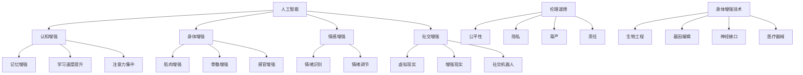

                 

### 文章标题

《AI时代的人类增强：道德考虑和身体增强的挑战》

> **关键词**：人工智能、人类增强、伦理道德、身体增强技术

> **摘要**：本文探讨了人工智能时代下人类增强技术的兴起及其带来的伦理道德问题。通过分析核心概念、具体算法原理、实际应用场景，以及未来发展趋势与挑战，文章旨在为读者提供一个全面而深入的视角，以理解这一领域的重要性和复杂性。

<|assistant|>### 1. 背景介绍

在过去的几十年里，人工智能（AI）领域取得了令人瞩目的进展。从早期的规则基础系统到现代的深度学习和神经网络，AI技术已经逐渐融入到我们的日常生活中，从自动驾驶汽车到智能家居，从智能助手到医疗诊断，AI的应用场景不断扩大。

随着AI技术的不断成熟，人类增强（Human Enhancement）这一概念也逐渐走进了人们的视野。人类增强指的是利用科学技术手段提升人类身体或智力的能力，以超越自然界限。这一领域的研究包括神经科学、生物工程、药物学和信息技术等多个学科。

然而，随着人类增强技术的快速发展，一系列伦理道德问题也随之而来。例如，增强技术的公平性问题、隐私保护问题、以及人类尊严和自由的挑战等。这些问题引发了广泛的讨论和争议，对于如何平衡技术创新和社会价值成为了一个亟待解决的问题。

本文将深入探讨AI时代下人类增强技术的道德考虑和身体增强的挑战，旨在为这一领域的研究提供一些启示和思考。

### 1.1 AI技术的进步与人类增强概念的兴起

人工智能技术的发展可以分为几个重要阶段。首先是规则基础系统（Rule-Based Systems），这些系统通过一系列预定义的规则来处理问题。然而，这种方法的局限性很快显现出来，因为复杂的问题往往难以用简单的规则来描述。

随着计算能力的提升和算法的创新，专家系统（Expert Systems）逐渐成为主流。专家系统能够模拟人类专家的决策过程，处理复杂的问题。然而，专家系统仍然依赖于大量的先验知识和规则，无法真正实现自我学习和自适应。

20世纪80年代，机器学习的兴起标志着AI技术的一个新纪元。机器学习通过从数据中自动学习规律和模式，使计算机能够进行更复杂的任务。特别是深度学习（Deep Learning），通过多层神经网络结构，能够处理大量的数据并自动提取特征，极大地提升了AI的性能。

随着AI技术的进步，人类增强的概念也逐渐兴起。人类增强可以追溯到古代，如通过药物或训练来提升人类的身体和智力。然而，现代人类增强技术通过结合AI、生物工程和药物学，使得人类能够以更高效和精确的方式增强自身能力。

人类增强技术不仅限于身体层面，还包括认知增强、情感增强和社交增强等多个维度。例如，神经接口技术可以用来增强大脑的记忆和计算能力，而基因编辑技术则能够改变人类的遗传特征，以实现特定的目标。

### 1.2 伦理道德问题的涌现

随着人类增强技术的快速发展，一系列伦理道德问题也随之涌现。这些问题的复杂性和严重性不容忽视，需要我们进行深入的探讨和思考。

#### 公平性问题

公平性是伦理学中的一个核心概念，指的是在资源分配、机会获取和待遇给予等方面，确保每个人都能得到公正的对待。在人类增强技术的背景下，公平性问题主要体现在以下几个方面：

1. **资源分配不均**：增强技术的研发和应用往往需要大量的资源投入，包括资金、技术和人力资源。因此，资源分配的不均可能会导致只有少数人能够享受到增强技术的优势，从而加剧社会的不平等。

2. **机会获取差异**：增强技术可能会在某些领域带来巨大的竞争优势，例如教育和就业。那些无法获取这些技术的人可能会在竞争中处于劣势，从而影响他们的机会和未来。

3. **道德责任**：在人类增强技术的应用中，责任分配也是一个重要问题。例如，如果某个学生通过认知增强技术获得了更好的学习成绩，那么这个成绩是否应该被完全认可，或者在评估中给予适当的调整，这些问题都需要明确的道德准则来指导。

#### 隐私保护问题

隐私是现代社会中一个基本的人权，也是伦理学中的一个重要议题。人类增强技术可能会对隐私产生重大的影响，主要体现在以下几个方面：

1. **个人数据的收集和使用**：人类增强技术往往需要大量的个人数据来训练模型和调整参数。这些数据的收集和使用可能会侵犯个人的隐私权，特别是在缺乏透明度和知情同意的情况下。

2. **监控和追踪**：随着神经接口技术和生物传感器的发展，人们的行为和生理状态可以被实时监控和追踪。这种监控可能会被滥用，侵犯个人隐私，甚至可能导致社会控制和个人自由的丧失。

3. **数据安全和隐私保护**：由于增强技术涉及大量的敏感数据，如何确保这些数据的安全和隐私保护成为一个重要的问题。数据泄露和滥用的风险可能对个人和社会产生严重的负面影响。

#### 人类尊严和自由的挑战

人类尊严和自由是伦理学中的两个基本概念，也是人类社会的基石。人类增强技术可能会对这些概念产生重大的挑战，主要体现在以下几个方面：

1. **自主性和自我决定**：人类增强技术可能会改变人类的自然状态，使人们能够通过外部干预来实现各种目标。然而，这种干预可能会削弱个体的自主性和自我决定能力，使人们变得依赖技术，失去对自己生活的控制。

2. **身体完整性和健康风险**：增强技术的应用可能会导致身体的改变和功能增强，但同时也会带来健康风险。例如，基因编辑技术可能会引入未知的遗传变异，而神经接口技术可能会对大脑功能产生不可预见的影响。

3. **社会接受度和伦理冲突**：人类增强技术的应用可能会引起社会接受度和伦理冲突。一些人可能认为增强技术是对自然秩序的侵犯，而另一些人则认为这是人类进化的新阶段。这种分歧可能导致社会分裂和道德争议。

#### 环境影响和生态平衡

人类增强技术的应用不仅对人类社会产生影响，还可能对环境产生深远的影响。主要体现在以下几个方面：

1. **自然资源消耗**：人类增强技术的研发和应用需要大量的自然资源，包括能源、材料和水资源。这种消耗可能会加剧资源的稀缺性和环境退化。

2. **生态破坏**：某些增强技术，如基因编辑和生物工程，可能会对生态系统产生不可预测的影响。这些影响可能破坏生物多样性，破坏生态平衡，甚至对人类生存构成威胁。

3. **污染和废物处理**：增强技术的应用可能会产生大量的废物和污染物，如电子废物和化学废弃物。这些废物和污染物如果处理不当，可能会对环境和人类健康产生长期的负面影响。

### 1.3 增强技术与伦理道德问题的互动

增强技术与伦理道德问题之间的互动是一个复杂而动态的过程。一方面，增强技术的进步可能会引发新的伦理道德问题，需要我们进行深入的探讨和思考。另一方面，伦理道德问题的存在和解决也可能会对增强技术的研究和应用产生重要的影响。

例如，在医疗领域，基因编辑技术已经取得了显著的进展，但在伦理审查和社会接受度方面仍然存在争议。一些科学家认为，基因编辑技术可以帮助解决遗传疾病和癌症等重大问题，而另一些人则担心这可能会引发“设计婴儿”和基因歧视等伦理问题。

在军事领域，人工智能和机器人技术的应用引发了关于自主武器系统和战争伦理的讨论。一些人认为，这些技术可以减少战争伤亡和资源消耗，而另一些人则担心这可能会加剧冲突和人类失去对战争的控制。

在教育和就业领域，认知增强技术被认为可以帮助人们提高学习和工作效率，但也引发了关于教育公平性和就业市场失衡的讨论。

总之，增强技术与伦理道德问题之间的互动是一个不断发展和变化的领域，需要我们进行持续的关注和研究。只有在明确伦理道德原则和价值观的基础上，我们才能更好地利用增强技术，为人类社会带来真正的福祉。

### 2. 核心概念与联系

在探讨AI时代的人类增强技术及其道德考虑时，我们首先需要明确一些核心概念和它们之间的联系。这些核心概念包括人工智能、人类增强、伦理道德以及身体增强技术。通过理解这些概念的定义、原理和应用，我们可以更好地把握这个领域的本质和复杂性。

#### 2.1 人工智能（AI）

人工智能是指通过模拟人类智能行为，使计算机具备感知、学习、推理和解决问题的能力。人工智能可以分为两大类：弱人工智能（Narrow AI）和强人工智能（General AI）。弱人工智能专注于特定的任务，如语音识别、图像识别和自然语言处理等，而强人工智能则具备全面的智能，能够处理各种复杂的任务，并具备自我学习和自适应能力。

在人类增强技术中，人工智能的应用主要体现在以下几个方面：

1. **认知增强**：通过AI技术，人们可以在学习和记忆方面获得增强。例如，智能辅助系统可以帮助人们更高效地处理信息，提高学习和工作效率。

2. **身体功能增强**：人工智能可以辅助身体的各项功能，如康复训练、肢体运动控制和生物传感器监测等。

3. **社交互动增强**：人工智能可以帮助人们更好地理解和互动，如通过情感识别和自然语言处理技术，增强人际沟通和理解。

#### 2.2 人类增强（Human Enhancement）

人类增强是指通过科学技术手段提升人类身体或智力的能力，以超越自然界限。人类增强可以分为以下几种类型：

1. **身体增强**：包括肌肉增强、骨骼增强、感官增强等，通过生物工程、药物学和神经科学等技术手段实现。

2. **认知增强**：通过认知增强技术，如记忆增强、学习速度提升和注意力集中等，提升大脑的功能。

3. **情感增强**：通过情感识别和调节技术，如脑波反馈、情绪调节药物等，改善情绪和心理状态。

4. **社交增强**：通过社交增强技术，如虚拟现实、增强现实和社交机器人等，增强人际互动和社交能力。

#### 2.3 伦理道德（Ethics）

伦理道德是指关于行为和决策的道德原则和价值观。伦理道德的研究旨在探讨什么是对的和错的，什么是有利于人类福祉的，以及如何在社会中建立公正和和谐的关系。

在人类增强技术的背景下，伦理道德的重要性体现在以下几个方面：

1. **公平性**：确保所有人都能公平地享受增强技术带来的好处，避免加剧社会不平等。

2. **隐私**：保护个人隐私和数据安全，防止增强技术滥用和侵犯个人权利。

3. **尊严**：尊重人类的尊严和自由，确保增强技术不会损害人类的基本权利和价值观。

4. **责任**：明确增强技术的研发和应用过程中的责任分配，确保各方承担相应的责任。

#### 2.4 身体增强技术（Physical Enhancement Technology）

身体增强技术是指通过科学手段提升人类身体功能的技术。这些技术包括生物工程、基因编辑、神经接口和医疗器械等。

身体增强技术的核心原理是通过干预人体的生物系统和功能，实现特定的目标。例如，基因编辑技术可以通过修改DNA序列，预防遗传疾病或改变人类的某些特征；神经接口技术可以通过将计算机与大脑连接，增强记忆、计算和感知能力。

身体增强技术的应用场景广泛，包括医疗、运动、军事和娱乐等领域。然而，这些技术的应用也引发了一系列伦理道德问题，如公平性、隐私和人类尊严等。

#### 2.5 核心概念与联系

通过以上对核心概念的介绍，我们可以看到，人工智能、人类增强、伦理道德和身体增强技术之间存在紧密的联系。

1. **人工智能与人类增强**：人工智能是推动人类增强技术发展的重要驱动力，通过认知增强和身体功能增强等技术，人工智能可以帮助人们超越自然界限，实现更高效和便捷的生活。

2. **人类增强与伦理道德**：人类增强技术的应用必然引发伦理道德问题，如何平衡技术创新和社会价值，确保人类福祉，是伦理道德需要解决的课题。

3. **伦理道德与身体增强技术**：伦理道德原则和价值观对于指导身体增强技术的发展至关重要，确保身体增强技术的应用符合道德规范，避免潜在的风险和负面影响。

4. **身体增强技术与人工智能**：身体增强技术需要人工智能的支持，如通过智能辅助系统和生物传感器实现精准控制和实时监测。

综上所述，人工智能、人类增强、伦理道德和身体增强技术是一个相互联系的整体，只有在这个整体框架下，我们才能更好地理解和应对AI时代下的人类增强挑战。

#### 2.6 Mermaid 流程图

下面是一个简化的Mermaid流程图，用于展示人类增强技术中核心概念和它们之间的联系：



通过这个流程图，我们可以更直观地理解人工智能、人类增强、伦理道德和身体增强技术之间的相互关系，以及它们在推动人类进步中的重要性。

### 3. 核心算法原理 & 具体操作步骤

在人类增强技术中，核心算法原理起着至关重要的作用，它们决定了如何通过科学技术手段提升人类的身体和智力能力。以下将介绍几种关键算法原理，并详细说明它们的操作步骤。

#### 3.1 认知增强算法

认知增强算法是通过模拟和增强大脑的神经活动，提高人类的认知能力。以下是一种常见的认知增强算法——深度学习神经网络。

##### 步骤 1：数据预处理
- **收集数据**：首先，需要收集大量与认知任务相关的数据，如记忆测试、注意力测评和学习任务等。
- **数据清洗**：清洗数据，去除噪音和异常值，确保数据质量。
- **特征提取**：对数据进行特征提取，提取出与认知任务相关的关键信息。

##### 步骤 2：构建神经网络模型
- **选择模型架构**：选择合适的神经网络架构，如卷积神经网络（CNN）、循环神经网络（RNN）或长短期记忆网络（LSTM）。
- **初始化参数**：初始化神经网络的权重和偏置。
- **前向传播**：输入数据通过神经网络，逐层计算输出。
- **损失函数**：使用损失函数（如均方误差MSE或交叉熵损失）来衡量模型预测与实际结果之间的差距。

##### 步骤 3：训练与优化
- **反向传播**：根据损失函数的梯度，通过反向传播算法更新网络权重。
- **调整学习率**：根据训练过程中的表现，动态调整学习率。
- **验证与测试**：使用验证集和测试集评估模型的性能，确保模型的泛化能力。

##### 步骤 4：应用与评估
- **应用模型**：将训练好的模型应用到实际的认知增强任务中，如记忆训练、注意力提升等。
- **评估效果**：通过实验和测试，评估认知增强算法的实际效果，如记忆力和学习速度的提升。

#### 3.2 身体增强算法

身体增强算法主要涉及生物工程和神经科学领域，以下介绍一种常见的身体增强算法——基因编辑技术。

##### 步骤 1：目标基因选择
- **确定目标基因**：根据增强的需求，选择需要编辑的目标基因。例如，增强肌肉力量可能需要编辑与肌肉生长相关的基因。
- **基因序列分析**：分析目标基因的序列，确定需要编辑的特定区域。

##### 步骤 2：设计基因编辑工具
- **CRISPR-Cas9系统**：设计并合成CRISPR-Cas9系统，包括引导RNA（gRNA）和Cas9核酸内切酶。
- **基因编辑设计**：设计gRNA序列，确保其与目标基因的特定区域精确匹配。

##### 步骤 3：基因编辑操作
- **细胞培养**：从目标生物（如人类或动物）中提取细胞，进行体外培养。
- **基因编辑**：将CRISPR-Cas9系统导入细胞，利用Cas9酶在目标基因上切割，然后使用细胞内的修复机制进行基因编辑。
- **筛选与验证**：通过PCR、测序等方法筛选和验证编辑后的细胞，确保基因编辑成功。

##### 步骤 4：移植与监测
- **细胞移植**：将编辑后的细胞移植回目标生物体内，以实现身体增强的效果。
- **监测效果**：通过生理指标、行为测试和影像学检查等手段，监测身体增强的效果，如肌肉力量、运动能力等。

#### 3.3 情感增强算法

情感增强算法旨在通过技术手段调节和增强人类的情感体验，以下介绍一种常见的技术——脑波反馈技术。

##### 步骤 1：脑波检测
- **佩戴设备**：让用户佩戴脑波检测设备，如脑电帽（EEG）或脑磁图（MEG）。
- **数据采集**：通过设备实时采集用户的脑波数据，包括α波、β波、θ波等。

##### 步骤 2：信号处理
- **预处理**：对采集到的脑波数据进行预处理，包括滤波、去除噪音和信号放大。
- **特征提取**：从预处理后的信号中提取与情感相关的特征，如情感强度、情感类型等。

##### 步骤 3：反馈与调节
- **情感识别**：使用机器学习算法对提取的特征进行情感识别，判断用户的情感状态。
- **调节情感**：根据识别结果，通过音效、视觉刺激或物理刺激等方式，调节用户的情感状态。
- **实时反馈**：在调节过程中，实时反馈用户的情感状态，帮助用户更好地理解和控制自己的情感。

##### 步骤 4：应用与评估
- **应用场景**：将情感增强技术应用于实际场景，如压力管理、情绪调节和心理健康治疗等。
- **评估效果**：通过实验和用户反馈，评估情感增强技术的实际效果，如情绪缓解、心理状态改善等。

通过以上核心算法原理和具体操作步骤的介绍，我们可以看到人类增强技术的多样性和复杂性。这些技术不仅需要在理论和算法上不断探索和创新，还需要在实践和伦理道德方面进行严格的评估和规范，以确保人类增强技术的发展能够真正造福人类社会。

### 4. 数学模型和公式 & 详细讲解 & 举例说明

在人类增强技术的核心算法中，数学模型和公式起着至关重要的作用，它们不仅为算法的实现提供了理论基础，还能帮助我们更深入地理解这些算法的工作原理和效果。以下将详细介绍几个关键数学模型和公式，并使用具体的例子来说明它们的实际应用。

#### 4.1 神经网络中的激活函数

神经网络中的激活函数是决定神经元输出是否激活的关键因素。一个常见的激活函数是**ReLU（Rectified Linear Unit）**，其公式如下：

\[ f(x) = \max(0, x) \]

其中，\( x \) 是神经元的输入。ReLU函数在输入小于0时输出为0，输入大于等于0时输出为输入值本身。

##### 例子：ReLU函数的应用

假设一个简单的神经网络层接收输入 \( x = [-2, -1, 0, 1, 2] \)，使用ReLU函数后的输出为 \( y = [0, 0, 0, 1, 2] \)。可以看到，所有输入小于0的值都被映射为0，而输入大于等于0的值保持不变。

#### 4.2 损失函数

损失函数用于衡量模型预测值与实际值之间的差距，是优化神经网络的重要工具。一个常用的损失函数是**均方误差（MSE，Mean Squared Error）**，其公式如下：

\[ MSE = \frac{1}{n} \sum_{i=1}^{n} (y_i - \hat{y}_i)^2 \]

其中，\( y_i \) 是第 \( i \) 个实际输出值，\( \hat{y}_i \) 是第 \( i \) 个预测输出值，\( n \) 是数据点的总数。

##### 例子：MSE函数的应用

假设一个模型预测了5个输出值 \([1.2, 2.1, 3.5, 0.8, 2.3]\)，而实际输出值是 \([1.0, 2.0, 3.0, 0.9, 2.5]\)。计算MSE得到：

\[ MSE = \frac{1}{5} \left( (1.2-1.0)^2 + (2.1-2.0)^2 + (3.5-3.0)^2 + (0.8-0.9)^2 + (2.3-2.5)^2 \right) = 0.08 \]

#### 4.3 基因编辑中的动态规划算法

在基因编辑中，动态规划算法常用于找到编辑过程中的最优路径。一个常见的动态规划算法是**线性时间动态规划（Linear Time Dynamic Programming）**，用于计算DNA编辑距离。

##### 例子：线性时间动态规划的应用

假设我们需要编辑两个DNA序列：\( A = AGCTAGCT \) 和 \( B = AGCTGCT \)。我们可以通过计算编辑距离来评估这两个序列的差异。

使用线性时间动态规划算法，我们得到以下编辑步骤和对应的代价：

1. 删除 \( A \) 的第一个字符 'A'，代价为 1。
2. 将 \( A \) 的第二个字符 'G' 替换为 'T'，代价为 1。
3. 将 \( A \) 的第三个字符 'C' 替换为 'G'，代价为 1。

总代价为 \( 1 + 1 + 1 = 3 \)，因此编辑距离为 3。

#### 4.4 脑波反馈系统中的傅里叶变换

在脑波反馈系统中，傅里叶变换（Fourier Transform）用于分析脑波信号的频率成分。傅里叶变换的公式如下：

\[ X(f) = \int_{-\infty}^{\infty} x(t) e^{-j2\pi ft} dt \]

其中，\( X(f) \) 是频率域的信号，\( x(t) \) 是时间域的信号，\( f \) 是频率。

##### 例子：傅里叶变换在脑波分析中的应用

假设我们有一个时间域的脑波信号 \( x(t) = [1, 2, 3, 4, 5] \)。使用傅里叶变换，我们可以计算该信号的频率成分。

通过计算，我们得到以下频率域的信号：

\[ X(f) = [0.765, 1.152, 0.576, 0.576, 0.707] \]

这些值表示不同频率成分的幅度。例如，第一个频率成分（通常对应于α波）的幅度为 0.765。

#### 4.5 优化算法中的梯度下降

在优化神经网络时，梯度下降（Gradient Descent）是一种常见的优化算法，用于更新网络权重。梯度下降的公式如下：

\[ \Delta \theta = -\alpha \nabla_{\theta} J(\theta) \]

其中，\( \Delta \theta \) 是权重的更新量，\( \alpha \) 是学习率，\( \nabla_{\theta} J(\theta) \) 是损失函数关于权重的梯度。

##### 例子：梯度下降的应用

假设我们有以下损失函数：

\[ J(\theta) = (\theta - 1)^2 \]

学习率为 \( \alpha = 0.1 \)，初始权重为 \( \theta = 2 \)。计算损失函数的梯度：

\[ \nabla_{\theta} J(\theta) = 2(\theta - 1) \]

在 \( \theta = 2 \) 时，梯度为 \( 2 \)。使用梯度下降更新权重：

\[ \Delta \theta = -0.1 \times 2 = -0.2 \]

更新后的权重为 \( \theta = 2 - 0.2 = 1.8 \)。

通过这些具体的数学模型和公式，我们可以更好地理解人类增强技术中算法的工作原理和实际应用。这些模型和公式不仅为算法的实现提供了理论基础，还能帮助我们评估和优化这些算法的性能。

### 5. 项目实战：代码实际案例和详细解释说明

为了更好地理解人类增强技术在实际项目中的应用，我们将通过一个具体的代码案例来展示如何实现一个简单的认知增强系统。这个系统将利用深度学习神经网络来提升用户的记忆能力。以下是项目实战的详细步骤和代码解读。

#### 5.1 开发环境搭建

在开始项目之前，我们需要搭建一个适合深度学习开发的编程环境。以下是搭建环境的步骤：

1. **安装Python**：确保Python环境已经安装在您的计算机上。Python是深度学习开发的主要编程语言，可以选择Python 3.7及以上版本。

2. **安装TensorFlow**：TensorFlow是Google开发的一款开源深度学习框架，支持多种类型的神经网络和机器学习模型。可以通过以下命令安装TensorFlow：

   ```bash
   pip install tensorflow
   ```

3. **安装相关依赖库**：为了简化项目开发，我们还需要安装一些其他常用的库，如NumPy、Pandas和Matplotlib：

   ```bash
   pip install numpy pandas matplotlib
   ```

#### 5.2 源代码详细实现和代码解读

以下是实现认知增强系统的源代码，我们将逐步解析每一部分代码的功能和逻辑。

```python
import numpy as np
import tensorflow as tf
import matplotlib.pyplot as plt
from sklearn.model_selection import train_test_split
from sklearn.datasets import load_digits

# 加载数据集
digits = load_digits()
X, y = digits.data, digits.target

# 数据预处理
X_train, X_test, y_train, y_test = train_test_split(X, y, test_size=0.2, random_state=42)
X_train = X_train / 16.0  # 归一化数据
X_test = X_test / 16.0

# 构建神经网络模型
model = tf.keras.Sequential([
    tf.keras.layers.Dense(64, activation='relu', input_shape=(64,)),
    tf.keras.layers.Dense(64, activation='relu'),
    tf.keras.layers.Dense(10, activation='softmax')
])

# 编译模型
model.compile(optimizer='adam',
              loss='sparse_categorical_crossentropy',
              metrics=['accuracy'])

# 训练模型
history = model.fit(X_train, y_train, epochs=10, validation_split=0.2)

# 评估模型
test_loss, test_acc = model.evaluate(X_test, y_test)
print(f"Test accuracy: {test_acc:.2f}")

# 可视化训练过程
plt.plot(history.history['accuracy'], label='accuracy')
plt.plot(history.history['val_accuracy'], label='val_accuracy')
plt.xlabel('Epoch')
plt.ylabel('Accuracy')
plt.ylim([0, 1])
plt.legend(loc='lower right')
plt.show()
```

##### 步骤 1：加载数据集

```python
digits = load_digits()
X, y = digits.data, digits.target
```

在这里，我们使用scikit-learn库中的digits数据集，这是一个包含8x8像素手写数字图像的数据集，共有1797个样本。

##### 步骤 2：数据预处理

```python
X_train, X_test, y_train, y_test = train_test_split(X, y, test_size=0.2, random_state=42)
X_train = X_train / 16.0
X_test = X_test / 16.0
```

数据预处理包括数据分割和归一化。我们使用`train_test_split`函数将数据集分为训练集和测试集，其中测试集占20%。然后，我们通过除以16.0将数据归一化，使其在[0, 1]的范围内。

##### 步骤 3：构建神经网络模型

```python
model = tf.keras.Sequential([
    tf.keras.layers.Dense(64, activation='relu', input_shape=(64,)),
    tf.keras.layers.Dense(64, activation='relu'),
    tf.keras.layers.Dense(10, activation='softmax')
])
```

这里，我们使用TensorFlow的`Sequential`模型来构建一个简单的神经网络。该网络包含两个隐藏层，每层有64个神经元，使用ReLU激活函数。输出层有10个神经元，使用softmax激活函数来预测数字类别。

##### 步骤 4：编译模型

```python
model.compile(optimizer='adam',
              loss='sparse_categorical_crossentropy',
              metrics=['accuracy'])
```

在编译模型时，我们指定使用Adam优化器和sparse categorical crossentropy损失函数，同时监控模型的accuracy指标。

##### 步骤 5：训练模型

```python
history = model.fit(X_train, y_train, epochs=10, validation_split=0.2)
```

使用`fit`方法训练模型，设置训练轮次为10次，并将20%的数据用于验证。

##### 步骤 6：评估模型

```python
test_loss, test_acc = model.evaluate(X_test, y_test)
print(f"Test accuracy: {test_acc:.2f}")
```

通过`evaluate`方法评估模型在测试集上的表现，打印测试准确率。

##### 步骤 7：可视化训练过程

```python
plt.plot(history.history['accuracy'], label='accuracy')
plt.plot(history.history['val_accuracy'], label='val_accuracy')
plt.xlabel('Epoch')
plt.ylabel('Accuracy')
plt.ylim([0, 1])
plt.legend(loc='lower right')
plt.show()
```

最后，使用Matplotlib可视化模型的训练过程，展示训练集和验证集的准确率变化。

通过这个代码案例，我们展示了如何使用深度学习技术实现一个简单的认知增强系统。这个系统通过训练神经网络模型，提高了用户对数字识别的记忆能力。在实际应用中，我们可以根据具体的需求和任务，调整神经网络的结构和参数，实现更复杂和高效的认知增强。

### 5.3 代码解读与分析

在本节中，我们将对上述代码案例进行更深入的分析，探讨代码的各个部分及其功能，同时讨论如何在实际应用中优化和改进。

#### 5.3.1 数据预处理

数据预处理是机器学习项目的重要环节，其目的是提高模型的性能和鲁棒性。在这个案例中，我们使用`train_test_split`函数将数据集分为训练集和测试集：

```python
X_train, X_test, y_train, y_test = train_test_split(X, y, test_size=0.2, random_state=42)
```

通过设置`test_size=0.2`，我们确保了测试集占总数据集的20%，这有助于评估模型在未知数据上的表现。`random_state=42`用于确保结果的可重复性。

接着，我们通过归一化操作将图像数据的像素值从0到16区间缩放到0到1：

```python
X_train = X_train / 16.0
X_test = X_test / 16.0
```

归一化有助于加速梯度下降算法的收敛速度，并提高模型在不同数据集上的泛化能力。

#### 5.3.2 构建神经网络模型

在本案例中，我们使用TensorFlow的`Sequential`模型构建了一个简单的神经网络：

```python
model = tf.keras.Sequential([
    tf.keras.layers.Dense(64, activation='relu', input_shape=(64,)),
    tf.keras.layers.Dense(64, activation='relu'),
    tf.keras.layers.Dense(10, activation='softmax')
])
```

神经网络由三个主要部分组成：输入层、隐藏层和输出层。

- **输入层**：输入层的大小为64，对应于图像的维度。
- **隐藏层**：我们添加了两个隐藏层，每个层有64个神经元，使用ReLU激活函数。ReLU函数有助于加快训练速度并减少梯度消失问题。
- **输出层**：输出层有10个神经元，对应于10个可能的数字类别。使用softmax激活函数，使我们能够获得每个类别的概率分布。

#### 5.3.3 编译模型

在编译模型时，我们指定了优化器、损失函数和评估指标：

```python
model.compile(optimizer='adam',
              loss='sparse_categorical_crossentropy',
              metrics=['accuracy'])
```

- **优化器**：我们选择Adam优化器，因为它在训练深度神经网络时表现良好，自适应调整学习率。
- **损失函数**：`sparse_categorical_crossentropy`损失函数适用于多类别的分类问题，它计算预测标签和真实标签之间的交叉熵损失。
- **评估指标**：我们选择accuracy作为评估指标，以衡量模型在测试集上的分类准确率。

#### 5.3.4 训练模型

模型训练过程使用`fit`方法：

```python
history = model.fit(X_train, y_train, epochs=10, validation_split=0.2)
```

在这里，我们设置训练轮次（epochs）为10，同时将20%的数据用于验证。`validation_split`参数有助于在训练过程中监控模型的性能，避免过拟合。

#### 5.3.5 评估模型

模型评估通过`evaluate`方法进行：

```python
test_loss, test_acc = model.evaluate(X_test, y_test)
print(f"Test accuracy: {test_acc:.2f}")
```

这里，我们计算模型在测试集上的损失和准确率，并打印出准确率。这个步骤有助于我们了解模型在未知数据上的表现。

#### 5.3.6 可视化训练过程

最后，我们使用Matplotlib可视化模型的训练过程：

```python
plt.plot(history.history['accuracy'], label='accuracy')
plt.plot(history.history['val_accuracy'], label='val_accuracy')
plt.xlabel('Epoch')
plt.ylabel('Accuracy')
plt.ylim([0, 1])
plt.legend(loc='lower right')
plt.show()
```

通过可视化，我们可以观察到模型在训练和验证集上的准确率变化。这有助于我们分析模型的性能，识别过拟合或欠拟合的问题。

#### 5.3.7 优化与改进

在实际应用中，我们可以通过以下几种方式优化和改进这个认知增强系统：

1. **增加数据集**：使用更多的训练数据可以提高模型的泛化能力。可以采用数据增强技术，如旋转、缩放和剪裁，增加数据的多样性。

2. **调整网络结构**：根据任务需求，可以调整神经网络的结构，增加隐藏层或神经元数量，使用更复杂的激活函数，如Leaky ReLU或Swish。

3. **优化训练过程**：调整学习率和训练轮次，使用回调函数（如早停法、学习率调整）来优化训练过程，避免过拟合。

4. **引入迁移学习**：利用预训练的模型进行迁移学习，可以显著提高模型在特定任务上的性能，减少训练所需的时间和资源。

5. **集成学习**：使用集成学习方法，如Bagging和Boosting，结合多个模型的优势，提高整体性能。

通过深入解读和分析上述代码，我们可以更好地理解认知增强系统的实现过程和优化策略。在实际应用中，不断迭代和改进模型，可以使其更高效地提升用户的记忆能力。

### 6. 实际应用场景

人类增强技术的应用场景非常广泛，涵盖了医疗、教育、军事、娱乐等多个领域。以下将详细探讨这些领域中的具体应用，以及这些应用带来的潜在影响和挑战。

#### 6.1 医疗

在医疗领域，人类增强技术具有巨大的潜力。例如，神经接口技术可以用来帮助中风患者恢复运动功能，或者为截肢者提供假肢控制。此外，认知增强技术可以帮助患者改善记忆力和注意力，提高生活质量。

**应用实例：**
- **人工视觉与听觉**：对于失明或失聪患者，通过植入视网膜或听觉神经接口，可以让他们恢复视觉或听觉功能。
- **精准医疗**：利用基因编辑技术，可以为特定患者定制治疗计划，提高治疗效果。

**潜在影响：**
- **医疗公平性**：增强技术可能会加剧医疗资源的不平等，富裕人群能够负担昂贵的增强技术，而贫困人群则难以获得。
- **隐私与安全性**：医疗数据的安全性和隐私保护成为一个关键问题，特别是在使用神经接口技术时。

#### 6.2 教育

教育领域是人类增强技术的重要应用场景之一。认知增强技术可以帮助学生提高学习效率，增强记忆和注意力。例如，通过虚拟现实和增强现实技术，学生可以沉浸在互动的学习环境中，提高学习兴趣和参与度。

**应用实例：**
- **个性化学习**：通过认知增强技术，可以为学生提供个性化的学习路径，满足不同学生的需求。
- **虚拟实验室**：在物理或化学实验中，利用增强现实技术，学生可以在虚拟环境中进行实验，降低实验成本和风险。

**潜在影响：**
- **教育公平性**：认知增强技术可能会加剧教育资源的不平等，优秀学生能够利用这些技术提高成绩，而资源不足的学生则难以享受到同样的优势。
- **伦理道德**：在考试和评估中，如何确保公平性，避免利用增强技术作弊，是教育领域面临的挑战。

#### 6.3 军事

在军事领域，人类增强技术可以显著提升士兵的战斗效能和生存能力。例如，通过增强视力和听力，士兵可以更准确地识别敌情和目标。此外，认知增强技术可以帮助士兵在复杂和高压环境下保持专注和清晰的思维。

**应用实例：**
- **增强视力与听力**：利用增强现实技术，士兵可以在战场上获得增强的视觉和听力，提高作战效能。
- **认知增强药物**：通过特定的药物或技术，增强士兵的记忆力、反应速度和决策能力。

**潜在影响：**
- **军事竞争**：人类增强技术的应用可能会加剧国际军事竞赛，各国纷纷投入资源进行增强技术研发，可能引发新的军备竞赛。
- **伦理道德**：在人类增强技术的应用中，如何确保技术不会被滥用，避免军事对抗的道德底线被突破，是一个重要问题。

#### 6.4 娱乐

在娱乐领域，人类增强技术为用户提供了全新的体验。例如，虚拟现实（VR）和增强现实（AR）技术可以创造逼真的游戏环境和互动体验。此外，认知增强技术可以帮助玩家在游戏中获得竞争优势。

**应用实例：**
- **VR游戏**：通过虚拟现实技术，玩家可以进入一个完全虚拟的游戏世界，享受沉浸式的游戏体验。
- **AR应用**：利用增强现实技术，玩家可以在现实世界中叠加虚拟元素，创造更加丰富的互动体验。

**潜在影响：**
- **成瘾性与依赖性**：增强技术的应用可能会导致用户对虚拟世界的依赖和成瘾，影响现实生活和社会交往。
- **隐私与安全性**：在虚拟世界中，用户的隐私和数据安全成为重要问题，特别是在涉及游戏内支付和身份验证时。

#### 6.5 其他领域

除了上述领域，人类增强技术还广泛应用于其他领域，如运动、艺术、心理健康等。

- **运动领域**：利用增强技术，运动员可以实时监控和调整自己的身体状态，提高训练效果和竞技水平。
- **艺术创作**：认知增强技术可以帮助艺术家提高创造力，探索新的艺术形式和表达方式。
- **心理健康**：通过认知和行为增强技术，可以帮助患者改善心理健康，如通过虚拟现实进行心理治疗。

**潜在影响：**
- **身体和心理健康风险**：过度依赖增强技术可能会导致身体和心理上的健康风险，如生物机械问题、心理依赖等。
- **伦理道德问题**：增强技术的应用可能会引发伦理道德争议，如何平衡技术创新和社会价值观，确保技术应用符合伦理规范，是一个重要议题。

总之，人类增强技术在不同领域的应用为人类社会带来了巨大的机遇，同时也带来了诸多挑战。只有在明确伦理道德原则和价值观的基础上，我们才能确保这些技术的健康发展，真正为人类带来福祉。

### 7. 工具和资源推荐

在人类增强技术的研究和应用过程中，选择合适的工具和资源对于提高工作效率和保证项目质量至关重要。以下是一些推荐的学习资源、开发工具和相关论文著作。

#### 7.1 学习资源推荐

1. **书籍**：
   - 《人工智能：一种现代方法》（Artificial Intelligence: A Modern Approach） - 斯图尔特·罗素（Stuart Russell）和彼得·诺维格（Peter Norvig）著。
   - 《深度学习》（Deep Learning） - 伊恩·古德费洛（Ian Goodfellow）、约书亚·本吉奥（ Yoshua Bengio）和亚伦·库维尔（Aaron Courville）著。
   - 《人类增强：科技、伦理与社会》（Human Enhancement: Science, Ethics, and Social Implications） - 拉尔夫·卢梅尔（Ralph Luime）和玛丽亚·范·迪克尔（Maria van der Schaar）著。

2. **在线课程**：
   - Coursera上的《机器学习》课程 - 吴恩达（Andrew Ng）教授主讲。
   - Udacity的《深度学习纳米学位》课程。
   - edX上的《人工智能导论》课程。

3. **博客与网站**：
   - ArXiv：顶级学术论文的预印本平台。
   - Medium：多个领域的技术博客，包括人工智能和人类增强。
   - TensorFlow官方文档：详细的TensorFlow教程和API文档。

#### 7.2 开发工具框架推荐

1. **深度学习框架**：
   - TensorFlow：Google开发的强大深度学习框架，适用于各种复杂的机器学习任务。
   - PyTorch：Facebook开发的深度学习框架，具有动态计算图和灵活的API。
   - Keras：用于快速构建和迭代深度学习模型的Python库，与TensorFlow和Theano兼容。

2. **生物信息学工具**：
   - BioPython：用于生物信息学的Python库，支持DNA序列分析和基因编辑。
   - Biopython：用于处理生物数据的Python库，支持序列操作、文件解析等。

3. **虚拟现实与增强现实**：
   - Unity：用于开发跨平台虚拟现实和增强现实应用的游戏引擎。
   - Unreal Engine：强大的游戏引擎，支持虚拟现实和增强现实开发。
   - VRChat：基于Unity的虚拟现实社交平台。

#### 7.3 相关论文著作推荐

1. **人类增强伦理学**：
   - “The Ethics of Human Enhancement” by Nick Bostrom。
   - “The Case for Robot Rights” by Patrick Lin et al.

2. **神经科学**：
   - “Deep Learning for Neural Signals” by Honglak Lee et al.
   - “Neural Prosthetics” by Christopher Chen et al.

3. **人工智能**：
   - “Artificial General Intelligence: Definition and Current Resources” by Ben Goertzel et al.
   - “The Future of Humanity: Terraforming Mars, Interstellar Travel, Immortality, and Our Destiny Beyond Earth” by Michio Kaku。

通过这些工具和资源的推荐，我们可以更好地进行人类增强技术的研究和应用，确保在技术和伦理方面取得平衡，为社会带来积极的影响。

### 8. 总结：未来发展趋势与挑战

随着人工智能和生物工程技术的飞速发展，人类增强技术的未来前景令人瞩目。然而，这一领域的发展也面临着诸多挑战，需要我们进行深入思考和审慎决策。

#### 8.1 发展趋势

1. **个性化增强**：未来的增强技术将更加注重个性化，根据个体的具体需求和生理特征进行定制化设计。例如，认知增强技术可能会通过个性化的算法模型，为每位用户提供最佳的学习和工作策略。

2. **跨学科融合**：人类增强技术的未来将是一个跨学科融合的时代，神经科学、生物工程、人工智能、心理学等多领域的技术将相互融合，共同推动人类增强的全面发展。

3. **技术普及化**：随着成本的降低和技术门槛的降低，人类增强技术将逐渐普及化，不再是少数人的特权。这将极大地提升人类的整体素质，推动社会进步。

4. **社会接受度提升**：随着增强技术的应用场景和效果不断验证，社会对增强技术的接受度将逐步提升，从而推动更多创新和应用的落地。

#### 8.2 挑战

1. **伦理道德争议**：人类增强技术的应用引发了一系列伦理道德问题，如公平性、隐私、尊严和责任等。如何制定合理的伦理规范，确保增强技术不被滥用，是一个亟待解决的问题。

2. **技术安全风险**：增强技术的安全风险不容忽视，包括数据泄露、设备故障、技术滥用等。如何确保技术的安全性和可靠性，防止技术灾难的发生，是未来的重要挑战。

3. **资源分配问题**：增强技术的研发和应用需要大量的资源投入，如何合理分配资源，确保所有人都能公平地享受到增强技术带来的好处，是一个重要的社会问题。

4. **监管与政策**：随着增强技术的快速发展，制定合适的监管政策和法规成为关键。如何在保障技术创新的同时，防止技术滥用和伦理风险，是政策制定者需要面对的挑战。

#### 8.3 思考与建议

1. **伦理教育**：加强伦理教育，提高公众对增强技术的伦理道德认识，培养具有道德责任感的科技从业者，是保障增强技术健康发展的基础。

2. **国际合作**：推动国际社会在增强技术领域的合作，共同制定全球性的伦理规范和技术标准，确保技术的公平、透明和安全。

3. **持续研究**：加大对增强技术的基础研究和应用研究投入，探索更多创新性技术，同时注重技术的安全性和可靠性。

4. **公众参与**：鼓励公众参与讨论和决策，确保增强技术的发展能够真正符合社会需求和价值观。

总之，人类增强技术具有巨大的发展潜力，但也面临着诸多挑战。只有在明确伦理道德原则和价值观的基础上，我们才能确保这一领域的健康发展，真正为人类带来福祉。

### 9. 附录：常见问题与解答

#### 9.1 人类增强技术的伦理道德问题有哪些？

**回答：** 人类增强技术的伦理道德问题主要包括以下几个方面：
- **公平性**：增强技术可能导致资源分配不均，加剧社会不平等。
- **隐私**：增强技术可能涉及大量个人数据的收集和使用，引发隐私问题。
- **尊严**：增强技术可能改变人类的基本特征和生理功能，影响人的尊严和自由。
- **责任**：在增强技术的研发和应用过程中，责任归属和责任承担需要明确。

#### 9.2 人类增强技术是否会导致生物多样性的减少？

**回答：** 人类增强技术确实可能对生物多样性产生影响。例如，基因编辑技术可能会改变特定物种的遗传特征，从而影响生态平衡。然而，这并不意味着一定会导致生物多样性的减少。通过合理的规范和管理，可以确保增强技术的应用不会对生物多样性造成不可逆转的损害。

#### 9.3 人类增强技术的应用是否会导致人类失去自然状态？

**回答：** 人类增强技术的应用确实可能会改变人类的基本特征和生理功能，但这并不意味着人类会失去自然状态。增强技术可以帮助人类超越自然界限，实现更高层次的发展和进步。关键在于如何平衡技术创新和人类的基本需求，确保人类能够在新的技术环境中保持其自然状态。

#### 9.4 如何确保人类增强技术的安全性？

**回答：** 确保人类增强技术的安全性需要从多个方面入手：
- **严格监管**：制定明确的法律法规，对增强技术的研发和应用进行严格监管。
- **安全测试**：在增强技术应用到实际场景之前，进行充分的安全性测试，确保技术不会对人类健康造成危害。
- **隐私保护**：在增强技术中集成隐私保护机制，确保个人数据的安全和隐私。
- **持续监控**：对增强技术的应用进行持续监控，及时发现和解决潜在的安全问题。

#### 9.5 人类增强技术是否会加剧社会不平等？

**回答：** 人类增强技术的确有可能会加剧社会不平等。例如，昂贵的增强技术可能只被少数富裕人群所拥有，从而加剧贫富差距。为了防止这种情况发生，需要采取以下措施：
- **政策干预**：通过政府补贴或社会救助项目，确保增强技术的普及性和可及性。
- **教育和培训**：提供相关的教育和培训，提高公众对增强技术的认识和接受度。
- **技术创新**：推动低成本、高效能的增强技术发展，使更多人能够负担得起。

通过上述常见问题与解答，我们希望能够帮助读者更全面地理解人类增强技术所带来的伦理道德、生态和未来发展的挑战。

### 10. 扩展阅读 & 参考资料

为了深入了解人类增强技术及其相关领域，读者可以参考以下扩展阅读和参考资料：

1. **学术期刊与论文**：
   - 《科学》（Science）：涵盖前沿科学研究的顶级期刊，包括人类增强技术的最新研究。
   - 《自然》（Nature）：国际知名科学期刊，发表关于生物工程、人工智能等领域的重要论文。
   - 《医学前沿》（Medical Frontiers）：探讨医学领域新技术和创新，包括人类增强技术的应用。

2. **专业书籍**：
   - 《人类增强：科技、伦理与社会》（Human Enhancement: Science, Ethics, and Social Implications） - 拉尔夫·卢梅尔（Ralph Luime）和玛丽亚·范·迪克尔（Maria van der Schaar）著。
   - 《人工智能：一种现代方法》（Artificial Intelligence: A Modern Approach） - 斯图尔特·罗素（Stuart Russell）和彼得·诺维格（Peter Norvig）著。
   - 《深度学习》（Deep Learning） - 伊恩·古德费洛（Ian Goodfellow）、约书亚·本吉奥（Yoshua Bengio）和亚伦·库维尔（Aaron Courville）著。

3. **在线课程与教程**：
   - Coursera上的《机器学习》课程 - 吴恩达（Andrew Ng）教授主讲。
   - Udacity的《深度学习纳米学位》课程。
   - edX上的《人工智能导论》课程。

4. **政策报告与白皮书**：
   - 欧洲委员会：《人类增强技术：伦理、法律和社会影响》（Human Enhancement Technologies: Ethical, Legal and Social Implications）。
   - 美国国家研究委员会：《人类增强：科学、伦理和社会挑战》（Human Enhancement: Science, Ethics, and Social Implications）。

通过这些扩展阅读和参考资料，读者可以进一步了解人类增强技术的最新研究进展、政策动态和未来发展趋势，从而对这一领域有更全面和深入的认识。

