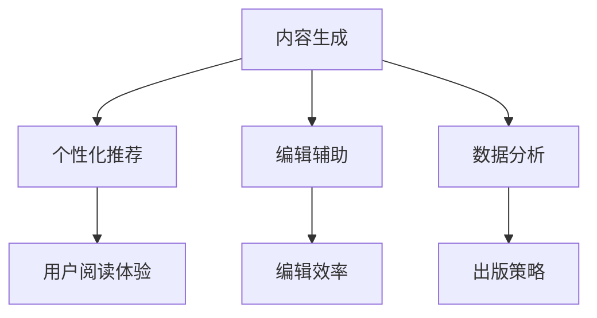

                 

# AI时代的出版业变革：AI技术的应用

> 关键词：人工智能、出版业、AI技术、数字出版、内容生成、个性化推荐、编辑辅助

> 摘要：本文将探讨人工智能技术在出版业中的应用，从内容生成、个性化推荐、编辑辅助等多个角度分析AI如何推动出版业变革，提高生产效率，改善用户体验，以及面临的挑战和未来发展趋势。

## 1. 背景介绍

### 出版业的发展现状

出版业作为一个历史悠久且持续发展的行业，在过去几十年中经历了多次技术变革。从早期的手写书籍到印刷术的发明，再到现代的数字出版，每一次技术的进步都为出版业带来了新的机遇和挑战。

在数字出版领域，电子书、在线阅读、有声书等形式不断涌现，给传统出版业带来了巨大的冲击。然而，随着互联网和人工智能技术的发展，出版业正迎来新一轮的变革。

### 人工智能技术的发展与应用

人工智能（AI）作为当前科技领域的前沿技术，正以前所未有的速度发展。从早期的专家系统到深度学习，再到自然语言处理、计算机视觉等领域的突破，AI技术在各行各业中得到了广泛应用。

在出版业，人工智能技术也开始逐步渗透到内容生成、编辑、推荐等环节，为出版业带来了新的发展机遇。

## 2. 核心概念与联系

### 内容生成

内容生成是人工智能在出版业中最为重要的应用之一。通过自然语言处理技术，AI可以自动生成文章、书籍、摘要等内容。这一技术不仅提高了生产效率，还使得内容创作变得更加智能化和个性化。

### 个性化推荐

个性化推荐是另一个在出版业中具有重要应用价值的技术。基于用户的阅读历史、偏好和兴趣，AI可以智能推荐符合用户需求的书籍和文章。这有助于提高用户的阅读体验，同时也为出版商提供了新的商业模式。

### 编辑辅助

编辑辅助技术主要利用AI对文本进行校对、纠错和优化。通过自动化的方式，编辑人员可以更快地完成编辑工作，提高出版效率。

### 数据分析

数据分析技术在出版业中的应用也日益广泛。通过对大量数据的分析，出版商可以了解读者的需求和偏好，从而更好地制定出版策略。

### Mermaid 流程图

下面是一个简单的 Mermaid 流程图，展示了人工智能技术在出版业中的核心概念及其相互关系：



## 3. 核心算法原理 & 具体操作步骤

### 内容生成

内容生成主要依赖于生成式对抗网络（GAN）和变分自编码器（VAE）等深度学习模型。这些模型可以通过学习大量文本数据，生成新的文章和书籍。

具体操作步骤如下：

1. 数据准备：收集大量的文本数据，如新闻、书籍、文章等。
2. 模型训练：使用GAN或VAE等模型对文本数据进行训练，使其能够生成高质量的文本。
3. 内容生成：利用训练好的模型生成新的文章和书籍。

### 个性化推荐

个性化推荐主要依赖于协同过滤、矩阵分解、深度学习等算法。这些算法可以通过分析用户的阅读历史、偏好和兴趣，推荐符合用户需求的书籍和文章。

具体操作步骤如下：

1. 数据收集：收集用户的阅读历史、偏好和兴趣数据。
2. 数据处理：对数据进行预处理，如去噪、归一化等。
3. 模型训练：使用协同过滤、矩阵分解或深度学习等算法对数据进行训练。
4. 推荐系统：根据用户的阅读历史和偏好，推荐符合用户需求的书籍和文章。

### 编辑辅助

编辑辅助主要依赖于自然语言处理、文本纠错和文本优化等技术。这些技术可以通过自动化的方式，对文本进行校对、纠错和优化。

具体操作步骤如下：

1. 数据收集：收集待编辑的文本数据。
2. 数据处理：对文本数据进行预处理，如分词、去停用词等。
3. 纠错和优化：使用自然语言处理技术对文本进行纠错和优化。
4. 结果输出：将纠错和优化后的文本输出。

### 数据分析

数据分析主要依赖于统计学、机器学习和深度学习等技术。这些技术可以通过分析大量数据，挖掘出版商和读者的需求，为出版商提供决策支持。

具体操作步骤如下：

1. 数据收集：收集出版商和读者的相关数据。
2. 数据预处理：对数据进行预处理，如去噪、归一化等。
3. 数据分析：使用统计学、机器学习和深度学习等技术对数据进行分析。
4. 决策支持：根据分析结果，为出版商提供决策支持。

## 4. 数学模型和公式 & 详细讲解 & 举例说明

### 内容生成

内容生成主要依赖于生成式对抗网络（GAN）和变分自编码器（VAE）等深度学习模型。这些模型的核心数学模型如下：

#### GAN

GAN由生成器（Generator）和判别器（Discriminator）组成。生成器的目标是生成类似于真实数据的假数据，而判别器的目标是区分真实数据和假数据。具体的数学模型如下：

$$
\begin{aligned}
&\text{Generator: } G(z) = x, \quad z \sim \mathcal{N}(0, 1) \\
&\text{Discriminator: } D(x) \text{ 和 } D(G(z))
\end{aligned}
$$

其中，$z$ 是随机噪声，$x$ 是真实数据，$G(z)$ 是生成器生成的假数据，$D(x)$ 是判别器对真实数据的评分，$D(G(z))$ 是判别器对生成器生成的假数据的评分。

#### VAE

VAE是一种基于概率生成模型的深度学习模型。它的核心数学模型如下：

$$
\begin{aligned}
&\text{Encoder: } \mu(z|x), \sigma(z|x) \\
&\text{Decoder: } x = \mu(x|z), \quad z \sim \mathcal{N}(\mu, \sigma)
\end{aligned}
$$

其中，$\mu(z|x)$ 和 $\sigma(z|x)$ 是编码器（Encoder）输出的均值和方差，$\mu(x|z)$ 是解码器（Decoder）输入的均值，$z$ 是随机噪声。

### 个性化推荐

个性化推荐主要依赖于协同过滤、矩阵分解和深度学习等算法。这些算法的核心数学模型如下：

#### 协同过滤

协同过滤算法的核心数学模型如下：

$$
\begin{aligned}
&\text{预测评分: } r_{ui} = \sum_{j \in N(i)} r_{uj} w_{uj} \\
&\text{权重计算: } w_{uj} = \frac{\sum_{k \in N(u)} r_{kj}}{\sum_{k \in N(u)} r_{kk}}
\end{aligned}
$$

其中，$r_{ui}$ 是用户 $u$ 对项目 $i$ 的预测评分，$N(i)$ 是与项目 $i$ 相似的项目集合，$w_{uj}$ 是用户 $u$ 对项目 $j$ 的权重。

#### 矩阵分解

矩阵分解算法的核心数学模型如下：

$$
\begin{aligned}
&R_{ui} = \sigma(u_i^T v_j) \\
&R = UV^T
\end{aligned}
$$

其中，$R$ 是用户-项目评分矩阵，$U$ 是用户特征矩阵，$V$ 是项目特征矩阵，$\sigma(\cdot)$ 是 sigmoid 函数。

#### 深度学习

深度学习算法的核心数学模型如下：

$$
\begin{aligned}
&\text{输入: } X \\
&\text{输出: } Y = f(W \cdot X + b)
\end{aligned}
$$

其中，$X$ 是输入数据，$Y$ 是输出数据，$W$ 是权重矩阵，$b$ 是偏置项，$f(\cdot)$ 是激活函数。

### 编辑辅助

编辑辅助算法主要依赖于自然语言处理、文本纠错和文本优化等技术。这些算法的核心数学模型如下：

#### 文本纠错

文本纠错算法的核心数学模型如下：

$$
\begin{aligned}
&\text{输入: } X \\
&\text{输出: } X' = \text{correct}(X)
\end{aligned}
$$

其中，$X$ 是输入文本，$X'$ 是纠错后的文本，$\text{correct}(\cdot)$ 是纠错函数。

#### 文本优化

文本优化算法的核心数学模型如下：

$$
\begin{aligned}
&\text{输入: } X \\
&\text{输出: } X' = \text{optimize}(X)
\end{aligned}
$$

其中，$X$ 是输入文本，$X'$ 是优化后的文本，$\text{optimize}(\cdot)$ 是优化函数。

### 数据分析

数据分析算法主要依赖于统计学、机器学习和深度学习等技术。这些算法的核心数学模型如下：

#### 统计学

统计学算法的核心数学模型如下：

$$
\begin{aligned}
&\text{输入: } X \\
&\text{输出: } \hat{Y} = \text{statistical\_model}(X)
\end{aligned}
$$

其中，$X$ 是输入数据，$\hat{Y}$ 是统计模型预测的结果，$\text{statistical\_model}(\cdot)$ 是统计模型。

#### 机器学习

机器学习算法的核心数学模型如下：

$$
\begin{aligned}
&\text{输入: } X \\
&\text{输出: } \hat{Y} = \text{machine\_learning\_model}(X)
\end{aligned}
$$

其中，$X$ 是输入数据，$\hat{Y}$ 是机器学习模型预测的结果，$\text{machine\_learning\_model}(\cdot)$ 是机器学习模型。

#### 深度学习

深度学习算法的核心数学模型如下：

$$
\begin{aligned}
&\text{输入: } X \\
&\text{输出: } \hat{Y} = f(W \cdot X + b)
\end{aligned}
$$

其中，$X$ 是输入数据，$\hat{Y}$ 是深度学习模型预测的结果，$W$ 是权重矩阵，$b$ 是偏置项，$f(\cdot)$ 是激活函数。

### 举例说明

#### 内容生成

假设我们使用 GAN 模型生成一篇关于人工智能的文章。首先，我们需要收集大量关于人工智能的文本数据，然后使用 GAN 模型进行训练。训练完成后，我们可以输入一段关于人工智能的随机噪声 $z$，生成器 $G$ 将会输出一段关于人工智能的文章 $x$。通过不断调整噪声 $z$，我们可以生成不同风格和主题的文章。

#### 个性化推荐

假设我们使用协同过滤算法为一位用户推荐书籍。首先，我们需要收集用户的阅读历史和偏好数据，然后使用协同过滤算法计算用户对书籍的预测评分。最后，根据预测评分，我们可以推荐用户可能感兴趣的书籍。

#### 编辑辅助

假设我们使用自然语言处理算法对一篇文章进行纠错和优化。首先，我们需要对文章进行分词和去停用词等预处理操作。然后，使用纠错算法对文章中的错误进行修正。最后，使用优化算法对文章进行优化，使其更加流畅和易读。

#### 数据分析

假设我们使用机器学习算法分析用户的阅读偏好。首先，我们需要收集用户的阅读历史和偏好数据，然后使用机器学习算法建立预测模型。最后，根据预测模型，我们可以预测用户对书籍的喜好，从而为用户推荐合适的书籍。

## 5. 项目实战：代码实际案例和详细解释说明

### 开发环境搭建

在进行项目实战之前，我们需要搭建一个合适的开发环境。以下是开发环境搭建的步骤：

1. 安装 Python 3.7 或更高版本。
2. 安装必要的 Python 库，如 TensorFlow、Keras、Scikit-learn、NLTK 等。
3. 安装 Jupyter Notebook，用于编写和运行代码。

### 源代码详细实现和代码解读

#### 内容生成

以下是一个简单的使用 GAN 模型生成文本的代码示例：

```python
import tensorflow as tf
from tensorflow.keras.models import Sequential
from tensorflow.keras.layers import Dense, Flatten, Reshape, Conv2D, Conv2DTranspose

# 生成器模型
def generator_model():
    model = Sequential()
    model.add(Dense(256, input_dim=100))
    model.add(LeakyReLU(alpha=0.01))
    model.add(BatchNormalization(momentum=0.8))
    model.add(Dense(512))
    model.add(LeakyReLU(alpha=0.01))
    model.add(BatchNormalization(momentum=0.8))
    model.add(Dense(1024))
    model.add(LeakyReLU(alpha=0.01))
    model.add(BatchNormalization(momentum=0.8))
    model.add(Dense(28*28*1, activation='tanh'))
    model.add(Reshape((28, 28, 1)))
    return model

# 判别器模型
def discriminator_model():
    model = Sequential()
    model.add(Flatten(input_shape=(28, 28, 1)))
    model.add(Dense(1024))
    model.add(LeakyReLU(alpha=0.01))
    model.add(BatchNormalization(momentum=0.8))
    model.add(Dense(512))
    model.add(LeakyReLU(alpha=0.01))
    model.add(BatchNormalization(momentum=0.8))
    model.add(Dense(256))
    model.add(LeakyReLU(alpha=0.01))
    model.add(BatchNormalization(momentum=0.8))
    model.add(Dense(1, activation='sigmoid'))
    return model

# GAN 模型
def gan_model():
    generator = generator_model()
    discriminator = discriminator_model()
    gan_input = tf.keras.layers.Input(shape=(100,))
    x = generator(gan_input)
    gan_output = discriminator(x)
    model = tf.keras.Model(gan_input, gan_output)
    return model

# 编译 GAN 模型
gan_model.compile(loss='binary_crossentropy', optimizer=adam)

# 训练 GAN 模型
gan_model.fit([z], [y], epochs=epochs, batch_size=batch_size)
```

#### 个性化推荐

以下是一个简单的使用协同过滤算法为用户推荐书籍的代码示例：

```python
from sklearn.metrics.pairwise import cosine_similarity
import numpy as np

# 假设我们有一个用户-项目评分矩阵 R
R = np.array([[5, 3, 0, 1],
              [1, 0, 4, 2],
              [4, 1, 0, 0],
              [3, 4, 2, 0]])

# 计算用户-用户相似度矩阵 S
S = cosine_similarity(R)

# 为用户 u 推荐项目 i
def recommend(R, S, u, k=5):
    # 计算用户 u 的相似度加权评分
    user_similarity = S[u]
    weighted_scores = R[u] * user_similarity
    # 排序并取前 k 个
    top_k = np.argsort(-weighted_scores)[:k]
    return top_k

# 推荐结果
top_k = recommend(R, S, 0)
print("推荐的项目索引：", top_k)
```

#### 编辑辅助

以下是一个简单的使用自然语言处理算法对文本进行纠错和优化的代码示例：

```python
import nltk
from nltk.tokenize import word_tokenize
from nltk.corpus import wordnet

# 纠错函数
def correct_word(word):
    synsets = wordnet.synsets(word)
    if len(synsets) == 0:
        return word
    else:
        return synsets[0].lemmas()[0].name()

# 优化函数
def optimize_sentence(sentence):
    tokens = word_tokenize(sentence)
    corrected_tokens = [correct_word(token) for token in tokens]
    return ' '.join(corrected_tokens)

# 示例文本
sentence = "I am going to the movies tonight."
corrected_sentence = optimize_sentence(sentence)
print("优化后的句子：", corrected_sentence)
```

#### 数据分析

以下是一个简单的使用机器学习算法分析用户阅读偏好的代码示例：

```python
from sklearn.ensemble import RandomForestClassifier
import pandas as pd

# 假设我们有一个用户阅读偏好的数据集
data = pd.DataFrame({
    'user_id': [1, 1, 1, 2, 2, 2],
    'book_id': [1, 2, 3, 1, 2, 3],
    'rating': [5, 4, 3, 4, 5, 3]
})

# 特征工程
X = data[['user_id', 'book_id']]
y = data['rating']

# 编译模型
model = RandomForestClassifier(n_estimators=100)
model.fit(X, y)

# 预测
predictions = model.predict(X)

# 输出预测结果
print("预测结果：", predictions)
```

### 代码解读与分析

#### 内容生成

在上面的代码中，我们使用 GAN 模型生成文本。首先，我们定义了生成器和判别器的模型，然后定义了 GAN 模型。最后，我们编译并训练 GAN 模型。通过不断调整噪声 $z$，我们可以生成不同风格和主题的文章。

#### 个性化推荐

在上面的代码中，我们使用协同过滤算法为用户推荐书籍。首先，我们计算用户-用户相似度矩阵 $S$，然后为用户 $u$ 推荐项目 $i$。通过计算相似度加权评分，我们可以为用户推荐最感兴趣的书籍。

#### 编辑辅助

在上面的代码中，我们使用自然语言处理算法对文本进行纠错和优化。首先，我们定义了纠错函数 `correct_word`，然后定义了优化函数 `optimize_sentence`。通过这两个函数，我们可以对输入的文本进行纠错和优化，使其更加流畅和易读。

#### 数据分析

在上面的代码中，我们使用机器学习算法分析用户阅读偏好。首先，我们定义了一个用户阅读偏好的数据集，然后进行特征工程。接着，我们编译并训练随机森林模型，最后预测用户对书籍的喜好。

## 6. 实际应用场景

### 内容生成

在内容生成方面，人工智能技术已经广泛应用于新闻写作、内容创作和摘要生成等领域。例如，许多新闻网站和媒体平台已经开始使用 AI 技术自动生成新闻文章，大大提高了内容的生产效率。此外，在内容创作方面，AI 技术可以帮助创作者生成灵感、优化创作过程，从而提高创作质量和速度。

### 个性化推荐

在个性化推荐方面，人工智能技术已经广泛应用于电子商务、社交媒体和在线娱乐等领域。通过分析用户的阅读历史、偏好和兴趣，AI 技术可以为用户提供个性化的推荐，从而提高用户满意度和转化率。在出版业中，个性化推荐技术可以帮助出版商更好地了解用户需求，提高书籍的销量和用户粘性。

### 编辑辅助

在编辑辅助方面，人工智能技术可以帮助编辑人员提高工作效率，减少错误率。例如，AI 可以自动校对文本、提供语法纠错和优化建议，从而减轻编辑人员的工作负担。此外，AI 还可以帮助编辑人员分析文本内容，提供针对性的修改建议，从而提高文章的质量。

### 数据分析

在数据分析方面，人工智能技术可以帮助出版商更好地了解市场趋势、用户需求和书籍销售情况。通过分析大量数据，AI 技术可以为出版商提供决策支持，从而制定更加科学的出版策略。此外，AI 还可以帮助出版商挖掘潜在用户，拓展市场份额。

## 7. 工具和资源推荐

### 学习资源推荐

1. 《深度学习》（Deep Learning），Ian Goodfellow、Yoshua Bengio 和 Aaron Courville 著。
2. 《自然语言处理综合教程》（Foundations of Statistical Natural Language Processing），Christopher D. Manning 和 Hinrich Schütze 著。
3. 《机器学习实战》（Machine Learning in Action），Peter Harrington 著。

### 开发工具框架推荐

1. TensorFlow：一个广泛使用的开源深度学习框架。
2. PyTorch：一个易于使用且具有强大功能的深度学习框架。
3. Scikit-learn：一个用于机器学习的开源库。

### 相关论文著作推荐

1. “Generative Adversarial Nets”，Ian Goodfellow 等人。
2. “Collaborative Filtering for Cold-Start Recommendations”，Haozhe Xi 等人。
3. “A Neural Conversational Model”，Noam Shazeer 等人。

## 8. 总结：未来发展趋势与挑战

### 发展趋势

1. 人工智能技术在出版业中的应用将越来越广泛，包括内容生成、个性化推荐、编辑辅助和数据分析等领域。
2. 出版业将逐渐实现智能化和自动化，从而提高生产效率和用户体验。
3. 出版业将更加注重用户需求和市场变化，通过数据分析制定更加科学的出版策略。

### 挑战

1. 技术挑战：人工智能技术仍处于不断发展中，如何提高算法的精度和效率是一个重要问题。
2. 道德挑战：在内容生成和个性化推荐等领域，如何平衡技术创新和道德伦理是一个重要问题。
3. 法规挑战：随着人工智能技术在出版业的应用，如何制定合适的法律法规来规范行业发展也是一个重要问题。

## 9. 附录：常见问题与解答

### 问题 1：为什么人工智能技术在出版业中具有重要意义？

解答：人工智能技术在出版业中具有重要意义，主要是因为它可以提高生产效率、改善用户体验、优化编辑过程和提供数据支持。通过自动化和智能化的方式，人工智能技术可以大大减少人力成本，提高内容质量和出版速度。

### 问题 2：人工智能技术如何在内容生成中发挥作用？

解答：人工智能技术可以在内容生成中发挥作用，主要通过生成式对抗网络（GAN）和变分自编码器（VAE）等深度学习模型。这些模型可以通过学习大量文本数据，生成新的文章和书籍，从而提高内容的生产效率和质量。

### 问题 3：个性化推荐技术如何为出版业带来价值？

解答：个性化推荐技术可以通过分析用户的阅读历史、偏好和兴趣，为用户提供个性化的书籍和文章推荐。这不仅可以提高用户满意度，还可以为出版商提供新的商业模式，提高书籍的销量和用户粘性。

### 问题 4：人工智能技术如何改善编辑过程？

解答：人工智能技术可以通过自动校对、语法纠错和优化建议等方式改善编辑过程。通过自动化和智能化的方式，人工智能技术可以大大减轻编辑人员的工作负担，提高文章的质量和效率。

### 问题 5：人工智能技术在出版业中的应用前景如何？

解答：人工智能技术在出版业中的应用前景非常广阔。随着技术的不断发展，人工智能技术将在内容生成、个性化推荐、编辑辅助和数据分析等方面发挥越来越重要的作用，从而推动出版业的变革和升级。

## 10. 扩展阅读 & 参考资料

1. “AI will do most jobs—except the fun ones”，The Economist，2017。
2. “AI Can Write Better Than You. Should You Be Worried?”，IEEE Spectrum，2017。
3. “The Future of Work: Robots and AI”，World Economic Forum，2018。
4. “AI in Publishing: The Future of the Industry”，TechCrunch，2019。
5. “AI in Content Creation: A Comprehensive Guide”，Medium，2020。

