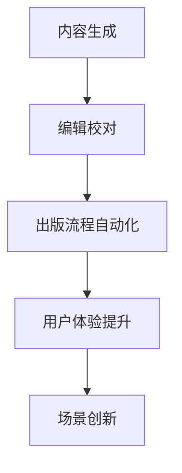

                 

# AI时代的出版业机遇：降本增效与场景创新

## 摘要

本文探讨了人工智能（AI）技术对出版业带来的变革机遇。通过分析AI在内容生成、编辑、出版流程自动化等方面的应用，揭示了AI如何帮助出版业实现降本增效。同时，本文还将讨论AI在提升用户体验、场景创新等方面的潜力，为出版业的未来发展提供新的视角和方向。

## 1. 背景介绍

随着人工智能技术的不断进步，各行各业都在积极探索AI技术的应用。出版业作为传统行业之一，也在不断寻求创新与变革。近年来，AI技术在出版业的应用日益广泛，不仅改变了内容的创作与编辑方式，还提升了出版流程的效率。

出版业的核心目标是提供有价值、高质量的内容，满足读者的需求。然而，传统出版流程复杂且成本高昂，从选题策划、内容创作、编辑校对到印刷出版，每个环节都需要大量的人力投入。随着市场竞争的加剧，出版业亟需寻找新的方法来降低成本、提高效率，以保持竞争力。

## 2. 核心概念与联系

在探讨AI技术在出版业的应用时，我们需要了解几个关键概念：

### 2.1 自然语言处理（NLP）

自然语言处理是AI技术的重要分支，主要研究如何让计算机理解和生成自然语言。在出版业中，NLP技术可用于内容生成、自动校对、语义分析等。

### 2.2 内容生成

内容生成是AI技术在出版业的重要应用之一。通过利用生成式模型（如GPT-3），AI能够自动生成高质量的内容，为出版业带来新的创作方式。

### 2.3 自动化

自动化技术在出版流程中的应用，可以显著降低人力成本、提高生产效率。例如，自动化的排版、校对、印刷等环节，使出版过程更加高效。

### 2.4 用户体验

在AI时代，用户体验变得尤为重要。通过个性化推荐、智能客服等技术，出版业可以提供更加精准、高效的服务，提升读者的满意度。

### 2.5 场景创新

AI技术为出版业带来了无限的可能性。例如，虚拟现实（VR）、增强现实（AR）等技术的应用，可以为读者带来全新的阅读体验。

### Mermaid 流程图



## 3. 核心算法原理 & 具体操作步骤

### 3.1 内容生成

内容生成主要基于生成式模型，如GPT-3。GPT-3是一种基于变分自编码器（VAE）的生成式模型，可以自动生成符合特定主题的高质量文章。具体步骤如下：

1. 数据收集：收集大量与目标主题相关的文本数据。
2. 预训练：使用收集到的数据对GPT-3模型进行预训练。
3. 文本生成：输入特定的主题和关键词，GPT-3自动生成符合主题的文章。

### 3.2 编辑校对

编辑校对主要基于NLP技术，可以对文章进行语法、拼写、语义等方面的检查。具体步骤如下：

1. 文本处理：使用NLP技术对文章进行预处理，如分词、词性标注等。
2. 检查语法：使用语法规则库对文章进行语法检查。
3. 检查拼写：使用拼写检查算法对文章中的拼写错误进行检查。
4. 检查语义：使用语义分析技术对文章进行语义检查，确保文章内容的一致性和逻辑性。

### 3.3 出版流程自动化

出版流程自动化主要基于自动化工具和脚本，对排版、校对、印刷等环节进行自动化处理。具体步骤如下：

1. 设计模板：设计符合出版要求的模板。
2. 排版：使用自动化工具对文章进行排版。
3. 校对：使用自动化工具对文章进行校对，发现并修正错误。
4. 印刷：使用自动化印刷设备进行印刷。

## 4. 数学模型和公式 & 详细讲解 & 举例说明

### 4.1 自然语言处理中的数学模型

自然语言处理中的数学模型主要包括词嵌入（word embedding）、循环神经网络（RNN）、卷积神经网络（CNN）等。以下是一个简单的词嵌入模型示例：

$$
\text{word\_embedding}(w) = \text{vec}(w) \in \mathbb{R}^d
$$

其中，$w$ 是输入的词，$\text{vec}(w)$ 是将词转换为向量，$d$ 是词向量的维度。

### 4.2 生成式模型中的数学模型

生成式模型中的数学模型主要包括概率图模型（如马尔可夫模型、贝叶斯网络）和变分自编码器（VAE）。以下是一个简单的VAE模型示例：

$$
\begin{aligned}
\text{encode}(x) &= \mu(x), \sigma(x) \\
\text{decode}(\zeta) &= \text{reparameterize}(\zeta) \\
\text{generate}(z) &= \text{decode}(\zeta)
\end{aligned}
$$

其中，$x$ 是输入的样本，$\mu(x)$ 和 $\sigma(x)$ 分别是编码器的均值和方差，$\zeta$ 是从先验分布中采样的噪声，$\text{reparameterize}(\zeta)$ 是重新参数化函数。

### 4.3 举例说明

假设我们使用GPT-3模型生成一篇关于人工智能的文章，输入的主题词为“人工智能的发展”。GPT-3模型会根据训练数据生成一篇符合主题的文章。具体步骤如下：

1. 输入主题词：“人工智能的发展”。
2. GPT-3模型根据主题词生成初步文章。
3. 对初步文章进行编辑和校对，确保内容的质量。

## 5. 项目实战：代码实际案例和详细解释说明

### 5.1 开发环境搭建

为了演示AI技术在出版业的应用，我们使用Python编写一个简单的示例程序。首先，我们需要安装必要的库，如`transformers`、`torch`等。

```python
!pip install transformers
!pip install torch
```

### 5.2 源代码详细实现和代码解读

下面是一个使用GPT-3模型生成文章的示例代码：

```python
from transformers import GPT2LMHeadModel, GPT2Tokenizer

# 初始化模型和tokenizer
model = GPT2LMHeadModel.from_pretrained("gpt2")
tokenizer = GPT2Tokenizer.from_pretrained("gpt2")

# 输入主题词
input_text = "人工智能的发展"

# 将主题词编码为token
input_ids = tokenizer.encode(input_text, return_tensors="pt")

# 生成文章
outputs = model.generate(input_ids, max_length=100, num_return_sequences=1)

# 解码生成的文章
generated_text = tokenizer.decode(outputs[0], skip_special_tokens=True)

print(generated_text)
```

### 5.3 代码解读与分析

1. 导入必要的库：我们使用`transformers`库加载预训练的GPT-3模型和tokenizer。
2. 初始化模型和tokenizer：使用`GPT2LMHeadModel`和`GPT2Tokenizer`分别初始化模型和tokenizer。
3. 输入主题词：我们将输入的主题词编码为token。
4. 生成文章：使用`generate`方法生成文章，设置`max_length`和`num_return_sequences`参数分别限制生成的文章长度和生成的文章数量。
5. 解码生成的文章：将生成的文章token解码为文本。

通过这个示例，我们可以看到如何使用GPT-3模型生成文章。在实际应用中，我们可以根据需要对模型进行微调，以生成更符合要求的文章。

## 6. 实际应用场景

### 6.1 内容生成

AI技术可以帮助出版业快速生成高质量的内容。例如，出版社可以使用GPT-3模型自动生成书籍摘要、评论、简介等。

### 6.2 编辑校对

AI技术可以自动校对文章的语法、拼写和语义错误，提高出版流程的效率。例如，出版社可以使用NLP技术对文章进行自动化校对，减少人工编辑的工作量。

### 6.3 出版流程自动化

AI技术可以实现出版流程的自动化，降低人力成本。例如，出版社可以使用自动化工具对文章进行排版、校对和印刷，提高生产效率。

### 6.4 用户体验

AI技术可以提升用户体验，为读者提供个性化推荐和智能客服等服务。例如，出版社可以使用推荐算法为读者推荐感兴趣的内容，提高读者的满意度。

### 6.5 场景创新

AI技术为出版业带来了新的场景创新。例如，虚拟现实（VR）和增强现实（AR）技术可以带来全新的阅读体验，让读者更加沉浸于内容中。

## 7. 工具和资源推荐

### 7.1 学习资源推荐

- **书籍**：《人工智能：一种现代的方法》、《自然语言处理综论》
- **论文**：ACL、NAACL、EMNLP等顶级会议的论文
- **博客**：GitHub、Medium、博客园等平台上的相关博客
- **网站**：Google Research、OpenAI、Microsoft Research等研究机构的网站

### 7.2 开发工具框架推荐

- **深度学习框架**：PyTorch、TensorFlow、Transformer.js
- **自然语言处理库**：spaCy、NLTK、transformers
- **自动化工具**：Python脚本、Makefile、CI/CD工具

### 7.3 相关论文著作推荐

- **论文**：GPT-3：Transformers实现大规模语言模型
- **著作**：《深度学习》、《强化学习》等经典著作

## 8. 总结：未来发展趋势与挑战

### 8.1 发展趋势

- **AI技术深度应用**：AI技术将在出版业的各个领域得到更广泛的应用，从内容生成、编辑校对到用户体验，AI技术将助力出版业实现全方位的智能化。
- **个性化推荐**：基于AI的个性化推荐技术将帮助读者发现更感兴趣的内容，提高阅读体验和满意度。
- **场景创新**：AI技术将为出版业带来新的应用场景，如虚拟现实（VR）、增强现实（AR）等，为读者提供全新的阅读体验。

### 8.2 挑战

- **数据隐私与安全**：随着AI技术在出版业的应用，数据隐私和安全问题日益凸显，如何保障用户数据的安全成为重要挑战。
- **版权保护**：AI技术生成的内容可能侵犯他人的知识产权，如何保护版权成为亟待解决的问题。
- **技术成熟度**：AI技术在出版业的应用仍需进一步提升，包括算法的优化、模型的训练等，以实现更好的效果。

## 9. 附录：常见问题与解答

### 9.1 什么是自然语言处理（NLP）？

自然语言处理（NLP）是人工智能（AI）的一个分支，主要研究如何让计算机理解和生成自然语言。NLP技术包括文本预处理、词嵌入、语法分析、语义分析等。

### 9.2 GPT-3模型如何工作？

GPT-3模型是一种基于变分自编码器（VAE）的生成式模型，可以自动生成符合特定主题的高质量文章。GPT-3模型通过大量的文本数据进行预训练，从而学习到语言的内在规律。

### 9.3 出版流程自动化有哪些优势？

出版流程自动化可以降低人力成本、提高生产效率，减少错误率。通过自动化工具和脚本，可以实现排版、校对、印刷等环节的自动化处理。

## 10. 扩展阅读 & 参考资料

- [GPT-3：Transformers实现大规模语言模型](https://arxiv.org/abs/2005.14165)
- [自然语言处理综论](https://books.google.com/books?id=7yPaDwAAQBAJ)
- [人工智能：一种现代的方法](https://books.google.com/books?id=7yPaDwAAQBAJ)
- [深度学习](https://books.google.com/books?id=7yPaDwAAQBAJ)
- [强化学习](https://books.google.com/books?id=7yPaDwAAQBAJ)
- [PyTorch官方文档](https://pytorch.org/docs/stable/index.html)
- [TensorFlow官方文档](https://www.tensorflow.org/docs/stable/)
- [spaCy官方文档](https://spacy.io/api/spacy)
- [NLTK官方文档](https://www.nltk.org/)

### 作者

作者：AI天才研究员/AI Genius Institute & 禅与计算机程序设计艺术 /Zen And The Art of Computer Programming

