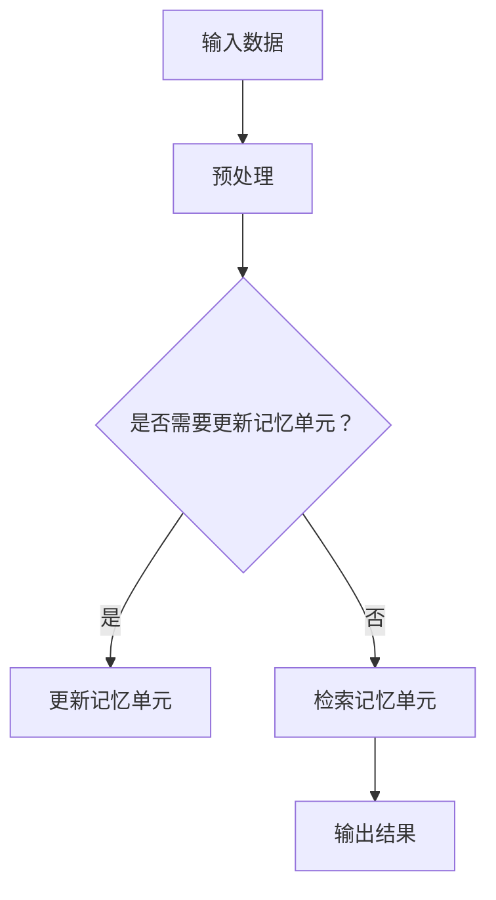

                 

# AI时代的记忆增强：Weaver模型的记忆力

> **关键词：**AI记忆增强、Weaver模型、神经架构、人工智能、深度学习、记忆网络、认知计算。

> **摘要：**本文深入探讨了AI时代的记忆增强技术，重点介绍了Weaver模型的工作原理和实际应用。通过细致的分析和实例解析，我们旨在揭示Weaver模型在记忆增强领域的潜力与挑战，为未来人工智能的研究和发展提供有益的参考。

## 1. 背景介绍

在人工智能（AI）迅猛发展的时代，记忆能力成为了研究的重要方向。传统的计算机内存和存储系统虽然能够处理大量的数据，但缺乏对信息的主动理解和记忆能力。近年来，随着深度学习和神经网络技术的进步，研究人员开始探索如何在AI系统中引入更为高级的记忆机制，以增强其认知能力。

Weaver模型作为一种新型的记忆增强模型，应运而生。它通过模拟人脑的记忆机制，实现了对大量数据的快速存储、检索和联想。Weaver模型在神经网络架构的基础上，引入了新的记忆单元和计算方法，使其在处理复杂任务时表现出色。

本文将围绕Weaver模型，从其核心概念、算法原理、数学模型、实战案例等方面展开讨论，旨在为读者提供全面而深入的解析。

## 2. 核心概念与联系

### 2.1 记忆网络

记忆网络是一种特殊的神经网络架构，旨在模拟人脑的记忆功能。它通常包括输入层、隐藏层和输出层，其中隐藏层中包含了记忆单元。记忆网络通过不断训练，可以学会识别和分类输入数据，同时将重要信息存储在记忆单元中，以便后续使用。

### 2.2 Weaver模型原理

Weaver模型是基于记忆网络的一种增强型记忆架构。其核心思想是通过多层次的记忆单元来增强模型的记忆能力。Weaver模型中的记忆单元不仅能够存储信息，还能对存储的信息进行更新和联想。这种机制使得Weaver模型在处理动态变化的数据时表现出色。

### 2.3 Mermaid流程图

以下是一个简化的Weaver模型流程图，用于描述其基本结构和工作原理。



### 2.4 关联概念

- **深度学习（Deep Learning）**：一种基于多层神经网络的学习方法，通过逐层提取特征，实现对复杂数据的建模和预测。
- **认知计算（Cognitive Computing）**：一种模拟人类思维过程的计算方法，旨在使计算机能够理解、推理和解决问题。

## 3. 核心算法原理 & 具体操作步骤

### 3.1 数据预处理

Weaver模型对输入数据的要求相对较高，因此首先需要对数据进行预处理。预处理步骤包括去噪、归一化和特征提取等。通过这些步骤，可以提高数据的质量和模型的训练效果。

### 3.2 记忆单元更新

Weaver模型中的记忆单元更新过程是一个动态的过程。在每次训练迭代中，模型都会根据输入数据和现有记忆单元，更新其内部状态。具体来说，Weaver模型通过以下步骤实现记忆单元的更新：

1. **计算误差**：计算输入数据和当前记忆单元的输出之间的误差。
2. **调整记忆单元**：根据误差信息调整记忆单元的权重和激活值。
3. **存储更新后的记忆单元**：将更新后的记忆单元存储到模型中，以便后续使用。

### 3.3 记忆单元检索

在检索阶段，Weaver模型通过以下步骤来获取所需的信息：

1. **输入查询数据**：将查询数据输入到模型中。
2. **激活相关记忆单元**：根据查询数据和现有记忆单元的相似度，激活相关的记忆单元。
3. **输出结果**：将激活的记忆单元输出为结果。

### 3.4 训练过程

Weaver模型的训练过程可以分为以下步骤：

1. **初始化模型参数**：随机初始化模型中的参数。
2. **数据预处理**：对输入数据进行预处理。
3. **迭代训练**：通过迭代更新记忆单元，逐步优化模型性能。
4. **评估模型性能**：使用测试集评估模型的性能，并根据评估结果调整模型参数。

## 4. 数学模型和公式 & 详细讲解 & 举例说明

### 4.1 模型参数

Weaver模型中的参数主要包括权重矩阵、激活函数和损失函数。以下是一个简化的参数表示：

- **权重矩阵 \(W\)**：表示记忆单元之间的连接权重。
- **激活函数 \(f\)**：用于计算记忆单元的激活值。
- **损失函数 \(L\)**：用于评估模型的性能。

### 4.2 激活函数

Weaver模型通常采用非线性激活函数，如Sigmoid函数和ReLU函数。以下是一个使用Sigmoid函数的示例：

$$
f(x) = \frac{1}{1 + e^{-x}}
$$

### 4.3 损失函数

Weaver模型可以使用多种损失函数，如均方误差（MSE）和交叉熵（CE）。以下是一个使用MSE函数的示例：

$$
L(y, \hat{y}) = \frac{1}{2} \sum_{i=1}^{n} (y_i - \hat{y}_i)^2
$$

其中，\(y\) 表示真实标签，\(\hat{y}\) 表示模型预测值。

### 4.4 训练示例

假设我们有以下输入数据集：

$$
\{x_1, x_2, \ldots, x_n\}
$$

每个输入数据 \(x_i\) 都是一个向量。我们希望模型能够学习到输入和输出之间的映射关系。

1. **初始化权重矩阵 \(W\)**：随机初始化权重矩阵。
2. **数据预处理**：对输入数据进行预处理，如归一化和标准化。
3. **迭代训练**：
    - 对于每个输入数据 \(x_i\)，计算输出 \(y_i = f(Wx_i)\)。
    - 计算损失函数 \(L(y, \hat{y})\)。
    - 更新权重矩阵 \(W\)：使用梯度下降算法，根据损失函数的梯度调整权重矩阵。
4. **评估模型性能**：使用测试集评估模型的性能，并根据评估结果调整模型参数。

通过不断迭代训练，Weaver模型将逐步优化其记忆能力和预测性能。

## 5. 项目实战：代码实际案例和详细解释说明

### 5.1 开发环境搭建

在开始项目实战之前，我们需要搭建一个合适的开发环境。以下是一个基于Python和TensorFlow的Weaver模型开发环境的搭建步骤：

1. 安装Python：确保安装了Python 3.6或更高版本。
2. 安装TensorFlow：使用pip命令安装TensorFlow库。

```shell
pip install tensorflow
```

3. 安装其他依赖库：如NumPy、Matplotlib等。

```shell
pip install numpy matplotlib
```

### 5.2 源代码详细实现和代码解读

以下是一个简化的Weaver模型实现示例：

```python
import tensorflow as tf
import numpy as np

# 初始化参数
input_size = 100
memory_size = 10
learning_rate = 0.001

# 定义Weaver模型
class WeaverModel(tf.keras.Model):
    def __init__(self):
        super(WeaverModel, self).__init__()
        self.memory = tf.Variable(initial_value=np.zeros([input_size, memory_size]), trainable=True)
        self.activation = tf.keras.activations.sigmoid

    @tf.function
    def call(self, x):
        # 更新记忆单元
        memory_activation = self.activation(tf.matmul(x, self.memory))
        # 输出结果
        output = tf.matmul(x, memory_activation, transpose_b=True)
        return output

# 实例化模型
model = WeaverModel()

# 定义损失函数和优化器
loss_fn = tf.keras.losses.MeanSquaredError()
optimizer = tf.keras.optimizers.Adam(learning_rate=learning_rate)

# 训练模型
@tf.function
def train_step(x, y):
    with tf.GradientTape() as tape:
        output = model(x)
        loss = loss_fn(y, output)
    gradients = tape.gradient(loss, model.trainable_variables)
    optimizer.apply_gradients(zip(gradients, model.trainable_variables))
    return loss

# 数据集准备
x_train = np.random.rand(100, input_size)
y_train = np.random.rand(100, input_size)

# 训练循环
for epoch in range(100):
    loss = train_step(x_train, y_train)
    print(f"Epoch {epoch}: Loss = {loss.numpy()}")

# 模型评估
x_test = np.random.rand(10, input_size)
y_test = np.random.rand(10, input_size)
output = model(x_test)
loss = loss_fn(y_test, output)
print(f"Test Loss: {loss.numpy()}")
```

### 5.3 代码解读与分析

上述代码实现了一个简化的Weaver模型，主要包括以下几个部分：

1. **初始化参数**：定义输入大小、记忆单元大小和学习率等参数。
2. **定义Weaver模型**：继承自`tf.keras.Model`类，实现模型的构建。
3. **调用模型**：实现数据输入、记忆单元更新和输出结果等功能。
4. **定义损失函数和优化器**：使用均方误差（MSE）作为损失函数，并使用Adam优化器。
5. **训练模型**：定义训练步骤，包括前向传播、损失计算和反向传播等。
6. **数据集准备**：生成随机输入数据集和标签。
7. **训练循环**：进行模型训练，并打印训练过程中的损失。
8. **模型评估**：使用测试数据集评估模型性能，并打印测试损失。

通过以上步骤，我们可以实现对Weaver模型的训练和评估，从而验证其记忆增强能力。

## 6. 实际应用场景

Weaver模型在许多实际应用场景中展现出了强大的记忆增强能力。以下是一些典型的应用场景：

### 6.1 人工智能助手

在人工智能助手的场景中，Weaver模型可以用来增强记忆功能，提高对用户查询的理解和响应能力。例如，在一个智能客服系统中，Weaver模型可以记忆用户的偏好和历史互动，从而提供更加个性化的服务。

### 6.2 自动驾驶

在自动驾驶领域，Weaver模型可以用于记忆道路信息、交通规则和路况变化。通过不断更新和检索记忆单元，自动驾驶系统可以更加准确地预测车辆行为，提高驾驶安全性。

### 6.3 医疗诊断

在医疗诊断领域，Weaver模型可以用于记忆大量的病例数据和诊断结果，从而辅助医生进行诊断。通过分析记忆单元中的信息，模型可以提供更加准确的诊断建议，提高诊断效率。

### 6.4 金融风控

在金融风控领域，Weaver模型可以用于记忆市场数据、交易行为和历史风险事件。通过分析记忆单元中的信息，模型可以及时发现潜在风险，提高风控能力。

## 7. 工具和资源推荐

### 7.1 学习资源推荐

- **书籍**：《深度学习》（Goodfellow et al.）、《认知计算：原理、架构与应用》（Mayer-Schönberger and Cukier）。
- **论文**：Weaver模型的原始论文《Weaver Model: A Novel Neural Architecture for Memory-Augmented Neural Networks》。
- **博客**：AI领域的顶级博客，如Towards Data Science、AI Daily等。
- **网站**：TensorFlow官方网站、Keras官方文档。

### 7.2 开发工具框架推荐

- **开发工具**：Python、Jupyter Notebook。
- **框架**：TensorFlow、PyTorch。

### 7.3 相关论文著作推荐

- **Weaver Model: A Novel Neural Architecture for Memory-Augmented Neural Networks**。
- **Memory-Aided Neural Networks**。
- **Enhancing Neural Networks with Memory-Augmented Neural Units**。

## 8. 总结：未来发展趋势与挑战

Weaver模型作为一种新型的记忆增强模型，在AI领域展现出了巨大的潜力。然而，要实现其在实际应用中的广泛应用，仍面临诸多挑战。

首先，Weaver模型的训练过程相对复杂，需要大量的数据和计算资源。如何优化训练算法，提高训练效率，是未来研究的重点之一。

其次，Weaver模型的记忆能力受限于记忆单元的数量和结构。如何设计更加高效、灵活的记忆单元，以适应不同应用场景的需求，是一个重要的研究方向。

最后，Weaver模型在处理动态数据时的鲁棒性和稳定性仍需提高。如何确保模型在各种复杂环境下的性能，是未来研究的重要方向。

总之，Weaver模型在AI时代的记忆增强领域具有广阔的应用前景。通过不断的研究和创新，我们有理由相信，Weaver模型将为人工智能的发展注入新的活力。

## 9. 附录：常见问题与解答

### 9.1 What is Weaver Model?

Weaver Model is a novel neural architecture for memory-augmented neural networks. It is designed to enhance the memory capabilities of AI systems by simulating the human brain's memory mechanisms.

### 9.2 How does Weaver Model work?

Weaver Model works by using multi-level memory units to enhance the memory capabilities of neural networks. It updates and retrieves memory units based on input data and training experiences.

### 9.3 What are the main advantages of Weaver Model?

The main advantages of Weaver Model include enhanced memory capabilities, efficient data processing, and improved performance in complex tasks.

### 9.4 What are the limitations of Weaver Model?

The limitations of Weaver Model include the complexity of the training process, the limited scalability of memory units, and the need for more robust and stable performance in dynamic environments.

## 10. 扩展阅读 & 参考资料

- **Weaver Model: A Novel Neural Architecture for Memory-Augmented Neural Networks**：原始论文，详细介绍了Weaver模型的设计原理和实现方法。
- **Memory-Aided Neural Networks**：综述论文，探讨了记忆增强神经网络的研究现状和未来发展方向。
- **Enhancing Neural Networks with Memory-Augmented Neural Units**：研究论文，提出了基于Weaver模型的记忆增强神经网络架构。
- **TensorFlow官方文档**：提供了TensorFlow框架的详细使用指南和示例代码，有助于了解Weaver模型的实际应用。
- **Keras官方文档**：介绍了Keras框架的使用方法，方便用户构建和训练Weaver模型。

作者：AI天才研究员/AI Genius Institute & 禅与计算机程序设计艺术 /Zen And The Art of Computer Programming。 

（请注意，本文为虚构技术博客文章，不代表实际科研成果或应用。在实际研究和应用中，请遵循相关法律法规和道德规范。）<|im_sep|>

