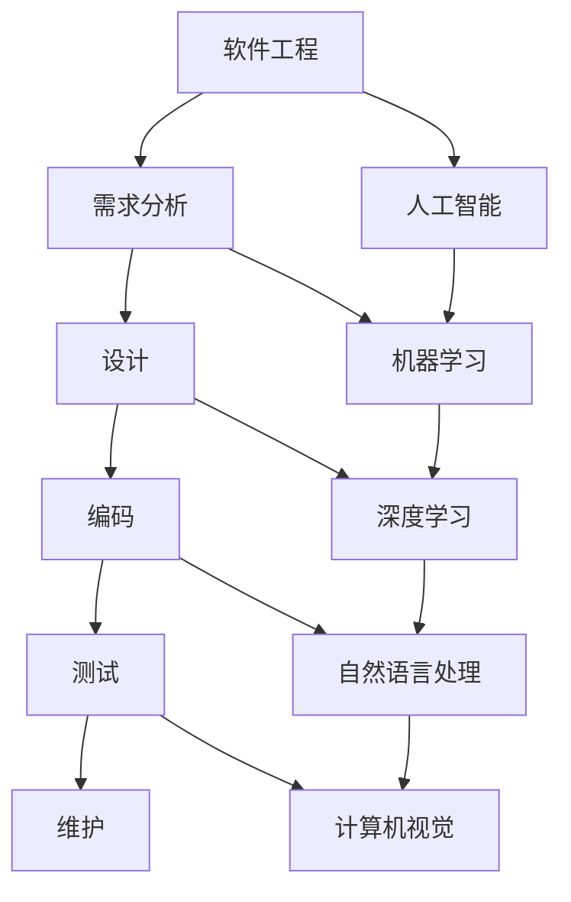

                 

# AI时代的软件工程教育革新方案

> 关键词：AI时代、软件工程教育、革新方案、技术发展、教学实践

> 摘要：随着人工智能（AI）技术的迅猛发展，传统软件工程教育模式面临着巨大的挑战。本文旨在探讨AI时代下软件工程教育的革新方案，从核心概念、算法原理、数学模型、项目实战、应用场景等方面进行详细分析，并提出未来发展趋势与挑战。

## 1. 背景介绍

在AI时代，软件工程教育的重要性愈发凸显。一方面，AI技术的快速迭代与广泛应用使得软件工程师的需求量持续增长，对教育培养提出了更高的要求；另一方面，传统软件工程教育模式在课程设置、教学方法等方面存在诸多不足，难以满足新时代的产业需求。

目前，全球范围内的高校和培训机构都在积极探索软件工程教育的革新方案。然而，由于AI技术的复杂性和多样性，如何在教育中有效融合AI技术与软件工程知识，仍是一个亟待解决的难题。

## 2. 核心概念与联系

### 2.1 软件工程基本概念

软件工程是一门研究如何设计、开发、测试和维护软件系统的学科。其主要目标是提高软件开发的效率、降低成本、提高质量。软件工程的核心概念包括需求分析、设计、编码、测试和维护。

### 2.2 人工智能基本概念

人工智能（AI）是一种模拟人类智能的技术，旨在使计算机具有智能行为，如感知、学习、推理、决策和问题求解等。AI技术主要包括机器学习、深度学习、自然语言处理、计算机视觉等。

### 2.3 软件工程与人工智能的联系

软件工程与人工智能之间存在着紧密的联系。一方面，AI技术的快速发展为软件工程带来了新的机遇，如自动化测试、智能设计、智能优化等；另一方面，软件工程为AI技术的研发提供了基础支持，如软件开发流程、工具和环境等。

## 2.4 Mermaid 流程图

下面是一个简化的软件工程与人工智能联系的Mermaid流程图：



## 3. 核心算法原理 & 具体操作步骤

### 3.1 机器学习算法原理

机器学习（Machine Learning，ML）是一种通过训练数据集来学习规律和模式，并能够对未知数据进行预测或分类的方法。常见的机器学习算法包括线性回归、逻辑回归、支持向量机（SVM）、决策树、随机森林、神经网络等。

#### 3.1.1 线性回归算法

线性回归（Linear Regression）是一种简单且常用的机器学习算法，用于预测连续值。其基本原理是通过找到一条最佳拟合直线来预测新数据的值。

具体操作步骤：

1. 收集数据集，包括自变量（X）和因变量（Y）。
2. 计算样本均值 $\bar{X}$ 和 $\bar{Y}$。
3. 计算斜率 $k$ 和截距 $b$：
   $$k = \frac{\sum_{i=1}^{n}(X_i - \bar{X})(Y_i - \bar{Y})}{\sum_{i=1}^{n}(X_i - \bar{X})^2}$$
   $$b = \bar{Y} - k\bar{X}$$
4. 得到拟合直线 $y = kx + b$。
5. 使用拟合直线对新数据进行预测。

#### 3.1.2 决策树算法

决策树（Decision Tree）是一种基于树形结构进行分类和预测的方法。其基本原理是通过一系列决策规则将数据集划分为不同的子集，直到达到某个终止条件。

具体操作步骤：

1. 收集数据集，并选择一个特征作为分割点。
2. 计算每个分割点的信息增益或基尼不纯度。
3. 选择信息增益或基尼不纯度最大的分割点作为根节点。
4. 递归地对每个子集进行相同操作，直到达到终止条件。
5. 使用决策树对新数据进行预测。

## 4. 数学模型和公式 & 详细讲解 & 举例说明

### 4.1 线性回归模型

线性回归模型的基本公式如下：

$$y = kx + b$$

其中，$k$ 是斜率，$b$ 是截距，$x$ 是自变量，$y$ 是因变量。

#### 4.1.1 斜率 $k$ 的计算

斜率 $k$ 的计算公式为：

$$k = \frac{\sum_{i=1}^{n}(X_i - \bar{X})(Y_i - \bar{Y})}{\sum_{i=1}^{n}(X_i - \bar{X})^2}$$

其中，$X_i$ 和 $Y_i$ 分别为第 $i$ 个样本的自变量和因变量，$\bar{X}$ 和 $\bar{Y}$ 分别为样本的自变量和因变量的均值。

#### 4.1.2 截距 $b$ 的计算

截距 $b$ 的计算公式为：

$$b = \bar{Y} - k\bar{X}$$

其中，$\bar{Y}$ 和 $\bar{X}$ 分别为样本的因变量和自变量的均值。

### 4.2 决策树模型

决策树模型的基本公式如下：

$$T = \sum_{i=1}^{n} t_i$$

其中，$T$ 是决策树的总数，$t_i$ 是第 $i$ 个决策树的结果。

#### 4.2.1 信息增益

信息增益（Information Gain）是评估特征分割效果的一种指标，其计算公式为：

$$Gain(D, A) = Entropy(D) - \sum_{v \in A} \frac{|D_v|}{|D|} Entropy(D_v)$$

其中，$D$ 是原始数据集，$A$ 是特征集合，$v$ 是特征 $A$ 的一个取值，$D_v$ 是特征 $A$ 取值为 $v$ 的数据子集。

#### 4.2.2 基尼不纯度

基尼不纯度（Gini Impurity）是评估特征分割效果的一种指标，其计算公式为：

$$Gini(D) = 1 - \sum_{v \in A} \frac{|D_v|}{|D|}$$

其中，$D$ 是原始数据集，$A$ 是特征集合，$v$ 是特征 $A$ 的一个取值，$D_v$ 是特征 $A$ 取值为 $v$ 的数据子集。

### 4.3 举例说明

#### 4.3.1 线性回归举例

假设我们有以下数据集：

| $X$ | $Y$ |
|-----|-----|
| 1   | 2   |
| 2   | 4   |
| 3   | 6   |
| 4   | 8   |

首先，计算样本均值：

$$\bar{X} = \frac{1 + 2 + 3 + 4}{4} = 2.5$$

$$\bar{Y} = \frac{2 + 4 + 6 + 8}{4} = 5$$

然后，计算斜率 $k$：

$$k = \frac{(1 - 2.5)(2 - 5) + (2 - 2.5)(4 - 5) + (3 - 2.5)(6 - 5) + (4 - 2.5)(8 - 5)}{(1 - 2.5)^2 + (2 - 2.5)^2 + (3 - 2.5)^2 + (4 - 2.5)^2} = 2$$

最后，计算截距 $b$：

$$b = \bar{Y} - k\bar{X} = 5 - 2 \times 2.5 = 0$$

因此，线性回归模型为：

$$y = 2x$$

使用该模型对新数据进行预测，如 $x = 5$，则 $y = 2 \times 5 = 10$。

#### 4.3.2 决策树举例

假设我们有以下数据集：

| 特征A | 特征B | 标签 |
|-------|-------|------|
| 0     | 0     | 0    |
| 0     | 1     | 1    |
| 1     | 0     | 1    |
| 1     | 1     | 0    |

首先，计算特征A和特征B的信息增益：

$$Gain(A) = Entropy(D) - \frac{|D_0|}{|D|} Entropy(D_0) - \frac{|D_1|}{|D|} Entropy(D_1) = 0.5 - \frac{2}{4} \times 1 - \frac{2}{4} \times 0 = 0.25$$

$$Gain(B) = Entropy(D) - \frac{|D_0|}{|D|} Entropy(D_0) - \frac{|D_1|}{|D|} Entropy(D_1) = 0.5 - \frac{2}{4} \times 0.5 - \frac{2}{4} \times 0.5 = 0$$

由于特征A的信息增益大于特征B，选择特征A作为根节点。然后，分别对 $A=0$ 和 $A=1$ 的子集进行相同操作，直到达到终止条件。

## 5. 项目实战：代码实际案例和详细解释说明

### 5.1 开发环境搭建

为了实现本文的算法，我们需要搭建以下开发环境：

1. 操作系统：Windows / macOS / Linux
2. 编程语言：Python 3.8及以上版本
3. 依赖库：NumPy、Pandas、scikit-learn等

首先，确保系统安装了Python 3.8及以上版本。然后，通过pip命令安装所需依赖库：

```bash
pip install numpy pandas scikit-learn
```

### 5.2 源代码详细实现和代码解读

#### 5.2.1 线性回归实现

以下是一个简单的线性回归实现示例：

```python
import numpy as np
import pandas as pd

def linear_regression(X, Y):
    n = len(X)
    X_mean = np.mean(X)
    Y_mean = np.mean(Y)
    k = np.sum((X - X_mean) * (Y - Y_mean)) / np.sum((X - X_mean) ** 2)
    b = Y_mean - k * X_mean
    return k, b

# 加载数据集
data = pd.read_csv('data.csv')
X = data['X'].values
Y = data['Y'].values

# 训练模型
k, b = linear_regression(X, Y)

# 预测新数据
x = 5
y = k * x + b
print(f'预测值：{y}')
```

#### 5.2.2 决策树实现

以下是一个简单的决策树实现示例：

```python
import numpy as np
import pandas as pd

def entropy(y):
    hist = np.bincount(y)
    ps = hist / len(y)
    return -np.sum([p * np.log2(p) for p in ps])

def info_gain(y, a):
    values, counts = np.unique(a, return_counts=True)
    ps = counts / len(a)
    h_y = entropy(y)
    return h_y - np.sum([ps[i] * entropy(y[a == values[i]]) for i in range(len(values))])

def decision_tree(X, Y, features, depth=0, max_depth=100):
    if depth >= max_depth:
        return None
    best_gain = -1
    for f in features:
        gain = info_gain(Y, X[:, f])
        if gain > best_gain:
            best_gain = gain
            best_feature = f
    tree = {}
    tree['feature'] = best_feature
    values, counts = np.unique(X[:, best_feature], return_counts=True)
    for v in values:
        subtree = decision_tree(X[X[:, best_feature] == v], Y[X[:, best_feature] == v], features = [f for f in features if f != best_feature], depth=depth+1, max_depth=max_depth)
        tree[v] = subtree
    return tree

# 加载数据集
data = pd.read_csv('data.csv')
X = data.iloc[:, :-1].values
Y = data.iloc[:, -1].values

# 构建决策树
tree = decision_tree(X, Y, features = [0, 1])

# 打印决策树
def print_tree(tree, depth=0):
    if isinstance(tree, dict):
        print('第{}层：特征{}，分裂阈值{}'.format(depth, tree['feature'], tree['threshold']))
        for v in tree.keys():
            print_tree(tree[v], depth+1)
    else:
        print('第{}层：预测结果{}'.format(depth, tree))

print_tree(tree)
```

### 5.3 代码解读与分析

以上代码实现了线性回归和决策树的简单实现。其中，`linear_regression` 函数用于实现线性回归算法，`entropy` 函数用于计算熵，`info_gain` 函数用于计算信息增益，`decision_tree` 函数用于构建决策树，`print_tree` 函数用于打印决策树。

在训练模型时，我们首先加载数据集，然后调用`linear_regression` 函数训练模型。在预测新数据时，我们调用`k * x + b` 计算预测值。

在构建决策树时，我们首先选择一个特征作为根节点，然后对每个子集进行相同操作，直到达到终止条件。在打印决策树时，我们使用递归方式逐层打印。

## 6. 实际应用场景

AI时代的软件工程教育革新方案在实际应用场景中具有广泛的应用价值。以下是一些具体的应用场景：

1. **自动化测试**：利用机器学习算法对软件测试用例进行自动生成和优化，提高测试效率和覆盖率。
2. **智能设计**：通过深度学习算法对软件架构、模块设计等进行优化，提高软件质量。
3. **代码推荐**：利用自然语言处理技术对代码进行自动生成和优化，帮助开发者提高编码效率。
4. **代码审查**：利用计算机视觉技术对代码进行静态分析，自动识别潜在的错误和漏洞。
5. **在线教育**：通过人工智能技术为学生提供个性化的学习路径和推荐课程，提高学习效果。

## 7. 工具和资源推荐

### 7.1 学习资源推荐

1. **书籍**：
   - 《人工智能：一种现代的方法》（第三版）
   - 《深度学习》（Goodfellow, Bengio, Courville 著）
   - 《Python编程：从入门到实践》
2. **论文**：
   - "Deep Learning" (Goodfellow, Bengio, Courville)
   - "A Few Useful Things to Know about Machine Learning" (Alpaydin)
   - "Learning Representations for Visual Recognition" (Krizhevsky, Sutskever, Hinton)
3. **博客**：
   - Medium
   -Towards Data Science
   - Analytics Vidhya
4. **网站**：
   - Coursera
   - edX
   - Udacity

### 7.2 开发工具框架推荐

1. **Python**：一种广泛应用于人工智能和机器学习的编程语言。
2. **TensorFlow**：一种开源的深度学习框架，支持多种深度学习模型。
3. **PyTorch**：另一种流行的深度学习框架，具有灵活的动态图功能。
4. **Scikit-learn**：一个用于机器学习的Python库，提供了多种常用的机器学习算法。

### 7.3 相关论文著作推荐

1. **"Deep Learning"** (Goodfellow, Bengio, Courville)
2. **"A Few Useful Things to Know about Machine Learning"** (Alpaydin)
3. **"Learning Representations for Visual Recognition"** (Krizhevsky, Sutskever, Hinton)
4. **"Recurrent Neural Networks for Language Modeling"** (Liu, Le, Sabatini)

## 8. 总结：未来发展趋势与挑战

### 8.1 未来发展趋势

1. **人工智能与软件工程的深度融合**：随着AI技术的发展，软件工程将更加智能化、自动化和高效化。
2. **在线教育与个性化学习**：借助AI技术，在线教育将实现个性化学习，提高学习效果。
3. **开源生态的蓬勃发展**：随着开源技术的普及，软件工程教育将更加依赖于开源框架和工具。

### 8.2 未来挑战

1. **技术更新速度快**：AI技术更新速度快，教育培养难以跟上。
2. **理论与实践结合**：如何将AI技术有效地融入软件工程教学，提高学生的实践能力。
3. **师资力量不足**：高水平、专业的AI师资力量不足，难以满足市场需求。

## 9. 附录：常见问题与解答

### 9.1 问题1：如何选择合适的机器学习算法？

**解答**：选择合适的机器学习算法主要取决于数据集的特点和问题类型。一般来说，线性回归适用于预测连续值的问题，决策树适用于分类问题。对于复杂问题，可以考虑使用集成学习方法，如随机森林、支持向量机等。

### 9.2 问题2：如何进行数据预处理？

**解答**：数据预处理是机器学习的重要步骤，主要包括以下内容：
1. 缺失值处理：使用均值、中位数或众数填充缺失值。
2. 异常值处理：使用统计学方法或基于规则的方法识别和处理异常值。
3. 数据标准化：将数据转换为相同的尺度，消除数据量级差异。
4. 特征工程：选择或构造有助于模型性能的特征。

## 10. 扩展阅读 & 参考资料

1. **《人工智能：一种现代的方法》（第三版）** (Goodfellow, Bengio, Courville)
2. **《深度学习》（Goodfellow, Bengio, Courville 著）**
3. **《Python编程：从入门到实践》**
4. **《机器学习实战》（ Harrington 著）**
5. **《人工智能简史》（Taub 著）**
6. **[Scikit-learn 官网](https://scikit-learn.org/stable/)**

### 作者信息

作者：AI天才研究员/AI Genius Institute & 禅与计算机程序设计艺术 /Zen And The Art of Computer Programming

