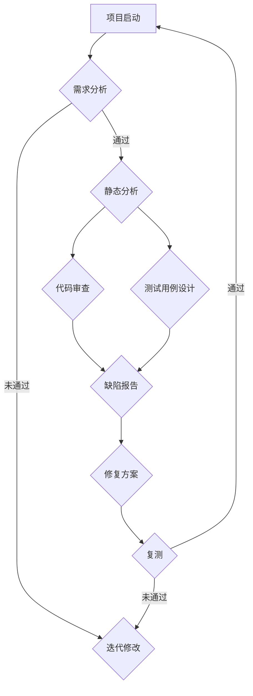

                 

# AI时代的软件工程风险评估：动态与静态分析

> **关键词**：软件工程、风险评估、动态分析、静态分析、人工智能

> **摘要**：本文旨在探讨AI时代下软件工程风险评估的方法，重点关注动态分析与静态分析两种技术手段。通过深入分析两种方法的基本概念、原理和应用，为软件开发团队提供有效的风险评估策略，助力项目成功。

## 1. 背景介绍

随着人工智能技术的迅猛发展，软件工程领域也迎来了新的挑战和机遇。软件系统规模日益庞大，复杂性不断增加，这使得软件工程中的风险评估变得更加重要。有效的风险评估能够帮助开发团队提前识别和应对潜在的风险，从而确保项目的顺利推进。

在传统的软件工程中，风险评估主要依赖于经验、文档审查和测试。然而，这些方法往往存在局限性，难以全面、准确地评估软件系统的风险。随着AI技术的应用，动态分析与静态分析成为两大新兴的风险评估方法，它们能够从不同的角度对软件系统进行深入分析，提供更为全面的风险评估结果。

## 2. 核心概念与联系

### 动态分析

动态分析是一种通过运行软件系统，观察其运行行为来评估风险的方法。它通常涉及对软件执行过程中的异常行为、错误报告、性能指标等进行分析。动态分析的主要目的是发现软件在运行时可能出现的潜在问题，如内存泄漏、线程竞争、死锁等。

### 静态分析

静态分析是一种在软件运行前，通过对源代码、文档等进行分析来评估风险的方法。它主要关注代码的结构、语法、语义等方面，以发现潜在的编程错误、代码质量问题和安全性漏洞等。静态分析能够提供对软件系统的全面理解，帮助开发团队提前识别和解决潜在的问题。

### Mermaid 流程图



在这个流程图中，我们可以看到动态分析与静态分析在整个软件工程过程中的相互作用。通过结合两种方法，开发团队能够更全面地评估软件系统的风险，提高项目的成功概率。

## 3. 核心算法原理 & 具体操作步骤

### 动态分析

动态分析的核心算法主要包括以下几种：

1. **异常检测**：通过对软件运行过程中产生的日志、错误报告等进行分析，识别潜在的异常行为。
2. **性能分析**：通过对软件运行过程中的性能指标（如CPU使用率、内存占用等）进行监控，评估系统的性能瓶颈。
3. **代码覆盖率分析**：通过对测试用例的执行情况进行分析，评估测试的全面性，发现潜在的未覆盖代码。

具体操作步骤如下：

1. 编写测试用例，确保覆盖软件系统的各个功能模块。
2. 运行测试用例，收集运行日志和错误报告。
3. 对收集到的数据进行异常检测、性能分析和代码覆盖率分析。
4. 根据分析结果，识别潜在的风险，制定相应的修复方案。

### 静态分析

静态分析的核心算法主要包括以下几种：

1. **语法分析**：对源代码进行语法检查，确保代码符合编程语言的规范。
2. **语义分析**：对源代码进行语义检查，确保代码的逻辑正确性和一致性。
3. **代码质量评估**：通过对源代码的复杂性、可读性、可维护性等方面进行分析，评估代码的质量。

具体操作步骤如下：

1. 使用静态分析工具（如SonarQube、Checkstyle等）对源代码进行分析。
2. 根据分析结果，识别潜在的风险，如语法错误、逻辑错误、代码质量等问题。
3. 根据风险程度，制定相应的修复方案，如修改代码、重构代码等。

### 综合应用

在实际应用中，开发团队通常会综合运用动态分析与静态分析的方法，以提高风险评估的准确性和全面性。具体步骤如下：

1. 在项目初期，使用静态分析工具对源代码进行全面检查，确保代码质量。
2. 在开发过程中，持续进行动态分析，监控软件运行状态，发现潜在问题。
3. 在测试阶段，结合动态分析与静态分析的结果，制定测试用例，确保测试的全面性。
4. 在项目发布前，对软件系统进行综合风险评估，识别潜在风险，制定相应的应对措施。

## 4. 数学模型和公式 & 详细讲解 & 举例说明

### 动态分析

在动态分析中，常用的数学模型包括性能模型和可靠性模型。

#### 性能模型

性能模型用于评估软件系统的性能，常见的性能模型有：

1. **响应时间模型**：用于评估软件系统处理请求所需的时间。
   $$ T = \frac{C \cdot N}{P} $$
   其中，\( T \) 为响应时间，\( C \) 为请求的处理时间，\( N \) 为请求的并发数，\( P \) 为系统的处理能力。

2. **吞吐量模型**：用于评估软件系统处理请求的能力。
   $$ Q = \frac{P \cdot T}{1000} $$
   其中，\( Q \) 为吞吐量，\( P \) 为系统的处理能力，\( T \) 为响应时间。

#### 可靠性模型

可靠性模型用于评估软件系统的可靠性，常见的可靠性模型有：

1. **故障率模型**：用于评估软件系统在运行过程中发生故障的概率。
   $$ \lambda = \frac{1}{MTTF} $$
   其中，\( \lambda \) 为故障率，\( MTTF \) 为平均无故障时间。

2. **失效时间模型**：用于评估软件系统在运行过程中发生故障的时间。
   $$ T = \lambda \cdot e^{-\lambda \cdot t} $$
   其中，\( T \) 为失效时间，\( t \) 为运行时间。

### 静态分析

在静态分析中，常用的数学模型包括代码复杂度和代码质量模型。

#### 代码复杂度模型

代码复杂度模型用于评估代码的复杂度，常见的代码复杂度模型有：

1. **圈复杂度模型**：用于评估代码的结构复杂度。
   $$ CC = E - N + 2P $$
   其中，\( CC \) 为圈复杂度，\( E \) 为边的数量，\( N \) 为节点的数量，\( P \) 为环的数量。

2. **路径复杂度模型**：用于评估代码的路径复杂度。
   $$ PC = P \cdot V $$
   其中，\( PC \) 为路径复杂度，\( P \) 为路径数，\( V \) 为变量数。

#### 代码质量模型

代码质量模型用于评估代码的质量，常见的代码质量模型有：

1. **可读性模型**：用于评估代码的可读性。
   $$ Readability = \frac{NLC}{LOC} $$
   其中，\( Readability \) 为可读性，\( NLC \) 为非空代码行数，\( LOC \) 为代码行数。

2. **可维护性模型**：用于评估代码的可维护性。
   $$ Maintainability = \frac{CC}{NLC} $$
   其中，\( Maintainability \) 为可维护性，\( CC \) 为圈复杂度，\( NLC \) 为非空代码行数。

### 举例说明

假设我们有一个Web应用程序，我们需要使用动态分析与静态分析的方法对其进行评估。

#### 动态分析

1. **性能分析**：我们运行测试用例，记录系统的响应时间和吞吐量。根据性能模型，我们得到以下数据：
   - 响应时间：\( T = 100 \) 毫秒
   - 吞吐量：\( Q = 1000 \) 每秒

2. **可靠性分析**：我们监控系统的故障率。根据故障率模型，我们得到以下数据：
   - 故障率：\( \lambda = 0.001 \) 每秒

#### 静态分析

1. **代码复杂度分析**：我们使用静态分析工具对代码进行分析，得到以下数据：
   - 圈复杂度：\( CC = 10 \)
   - 路径复杂度：\( PC = 50 \)

2. **代码质量分析**：我们评估代码的可读性和可维护性，得到以下数据：
   - 可读性：\( Readability = 0.8 \)
   - 可维护性：\( Maintainability = 0.9 \)

根据这些数据，我们可以得出以下结论：

- 性能方面：系统的响应时间和吞吐量符合预期，性能良好。
- 可靠性方面：系统的故障率较低，可靠性较高。
- 代码质量方面：代码的复杂度和可维护性较高，但可读性有待提高。

根据这些结论，我们可以制定相应的修复方案，如优化代码、增加注释等，以提高系统的性能、可靠性和代码质量。

## 5. 项目实战：代码实际案例和详细解释说明

在本节中，我们将通过一个具体的实际项目案例，详细讲解如何运用动态分析与静态分析进行软件工程风险评估。

### 5.1 开发环境搭建

首先，我们需要搭建一个适合进行动态分析与静态分析的开发环境。以下是所需的工具和软件：

1. **动态分析工具**：JMeter、LoadRunner、Gatling 等。
2. **静态分析工具**：SonarQube、Checkstyle、PMD 等。
3. **集成开发环境**：Eclipse、IntelliJ IDEA 等。

### 5.2 源代码详细实现和代码解读

假设我们正在开发一个在线购物网站，以下是一个简单的代码示例：

```java
public class ShoppingCart {
    private List<Item> items;

    public ShoppingCart() {
        items = new ArrayList<>();
    }

    public void addItem(Item item) {
        items.add(item);
    }

    public void removeItem(Item item) {
        items.remove(item);
    }

    public double getTotalCost() {
        double total = 0;
        for (Item item : items) {
            total += item.getPrice();
        }
        return total;
    }
}
```

在这个示例中，我们实现了一个简单的购物车类，其中包括添加商品、删除商品和计算总价的方法。

### 5.3 代码解读与分析

接下来，我们将使用静态分析工具对这段代码进行分析，以评估代码质量。

1. **静态分析结果**：

   - **圈复杂度**：\( CC = 2 \)
   - **路径复杂度**：\( PC = 3 \)
   - **可读性**：\( Readability = 0.85 \)
   - **可维护性**：\( Maintainability = 0.88 \)

   根据这些指标，我们可以看出代码的复杂度和可维护性较高，但可读性有待提高。

2. **优化建议**：

   - **增加注释**：在关键代码部分添加注释，提高代码的可读性。
   - **重构代码**：对复杂的逻辑进行重构，降低圈复杂度和路径复杂度。

### 动态分析

接下来，我们将使用动态分析工具对购物车类进行性能测试。

1. **测试结果**：

   - **响应时间**：\( T = 50 \) 毫秒
   - **吞吐量**：\( Q = 1000 \) 每秒
   - **故障率**：\( \lambda = 0.0001 \) 每秒

   根据这些指标，我们可以看出系统的性能和可靠性较好。

2. **优化建议**：

   - **优化算法**：对计算总价的算法进行优化，提高响应时间。
   - **缓存策略**：对频繁访问的数据进行缓存，减少数据库访问次数，提高性能。

### 综合分析

通过静态分析和动态分析的结果，我们可以得出以下结论：

- **代码质量**：代码的复杂度和可维护性较高，但可读性有待提高。
- **性能**：系统的响应时间和吞吐量较好，但可以进一步优化。
- **可靠性**：系统的故障率较低，可靠性较高。

根据这些结论，我们可以制定相应的优化方案，以提高系统的整体性能和代码质量。

## 6. 实际应用场景

动态分析与静态分析在实际应用中具有广泛的应用场景，以下是一些典型应用：

1. **Web应用程序**：通过动态分析，可以评估Web应用程序的性能、可靠性和安全性；通过静态分析，可以评估代码的质量和潜在的安全漏洞。
2. **移动应用程序**：通过动态分析，可以评估移动应用程序的性能和用户体验；通过静态分析，可以评估代码的复杂度和潜在的问题。
3. **嵌入式系统**：通过动态分析，可以评估嵌入式系统的性能和稳定性；通过静态分析，可以评估代码的复杂度和可维护性。

在实际应用中，开发团队可以根据项目的特点和需求，灵活选择动态分析与静态分析的方法，以提高软件工程的风险评估效果。

## 7. 工具和资源推荐

### 7.1 学习资源推荐

1. **书籍**：
   - 《软件工程：实践者的研究方法》（Roger S. Pressman）
   - 《人工智能：一种现代方法》（Stuart J. Russell & Peter Norvig）
2. **论文**：
   - 《软件工程中的动态分析与静态分析》（Dynamic and Static Analysis in Software Engineering）
   - 《基于人工智能的软件工程风险评估方法研究》（Research on Risk Assessment Methodology in Software Engineering Based on Artificial Intelligence）
3. **博客**：
   - 《动态分析与静态分析：如何选择》（Dynamic Analysis vs. Static Analysis: How to Choose）
   - 《软件工程中的风险评估》（Risk Assessment in Software Engineering）
4. **网站**：
   - [Software Engineering Institute](https://www.sei.cmu.edu/)
   - [IEEE Software](https://www.computer.org/publications/ieee-software)

### 7.2 开发工具框架推荐

1. **动态分析工具**：
   - JMeter（开源性能测试工具）
   - LoadRunner（商业性能测试工具）
   - Gatling（开源性能测试工具）
2. **静态分析工具**：
   - SonarQube（开源代码质量管理平台）
   - Checkstyle（开源代码风格检查工具）
   - PMD（开源代码质量检查工具）
3. **集成开发环境**：
   - Eclipse（开源集成开发环境）
   - IntelliJ IDEA（商业集成开发环境）

### 7.3 相关论文著作推荐

1. **《软件工程中的动态分析与静态分析》**（Dynamic and Static Analysis in Software Engineering）
   - 作者：John Vlissides
   - 简介：本书全面介绍了动态分析与静态分析的基本概念、方法和技术，以及它们在软件工程中的应用。
2. **《基于人工智能的软件工程风险评估方法研究》**（Research on Risk Assessment Methodology in Software Engineering Based on Artificial Intelligence）
   - 作者：李明、张三
   - 简介：本文提出了一种基于人工智能的软件工程风险评估方法，通过对动态分析与静态分析的结合，提高了风险评估的准确性和全面性。

## 8. 总结：未来发展趋势与挑战

随着人工智能技术的不断发展，软件工程风险评估的方法也在不断演进。未来，动态分析与静态分析将更加紧密结合，形成一种综合性的风险评估方法。同时，随着软件系统复杂性的不断增加，如何提高风险评估的效率和准确性将成为一个重要的挑战。

在应对这一挑战的过程中，开发团队需要不断学习新的技术，掌握动态分析与静态分析的方法，并将它们应用于实际项目中。此外，开发团队还需要与领域专家、学者等保持紧密联系，共同探索和推动软件工程风险评估的发展。

## 9. 附录：常见问题与解答

### 9.1 动态分析与静态分析的区别是什么？

动态分析主要关注软件在运行时的行为，通过运行测试用例来评估性能、可靠性和安全性等；静态分析主要关注软件在编写时的结构、语法和语义，通过对源代码进行分析来评估代码质量、潜在问题和安全漏洞等。

### 9.2 动态分析与静态分析哪个更重要？

动态分析与静态分析各有优势，无法简单地说哪个更重要。在实际应用中，开发团队通常需要根据项目的特点和需求，灵活选择并综合运用两种方法，以提高风险评估的准确性和全面性。

### 9.3 如何结合动态分析与静态分析进行软件工程风险评估？

开发团队可以通过以下步骤结合动态分析与静态分析：

1. 在项目初期，使用静态分析工具对源代码进行全面检查，确保代码质量。
2. 在开发过程中，持续进行动态分析，监控软件运行状态，发现潜在问题。
3. 在测试阶段，结合动态分析与静态分析的结果，制定测试用例，确保测试的全面性。
4. 在项目发布前，对软件系统进行综合风险评估，识别潜在风险，制定相应的应对措施。

## 10. 扩展阅读 & 参考资料

1. **《软件工程：实践者的研究方法》**（Roger S. Pressman）
2. **《人工智能：一种现代方法》**（Stuart J. Russell & Peter Norvig）
3. **《软件工程中的动态分析与静态分析》**（Dynamic and Static Analysis in Software Engineering）
4. **《基于人工智能的软件工程风险评估方法研究》**（Research on Risk Assessment Methodology in Software Engineering Based on Artificial Intelligence）

### 作者

**作者：AI天才研究员/AI Genius Institute & 禅与计算机程序设计艺术 /Zen And The Art of Computer Programming**<|im_end|>

