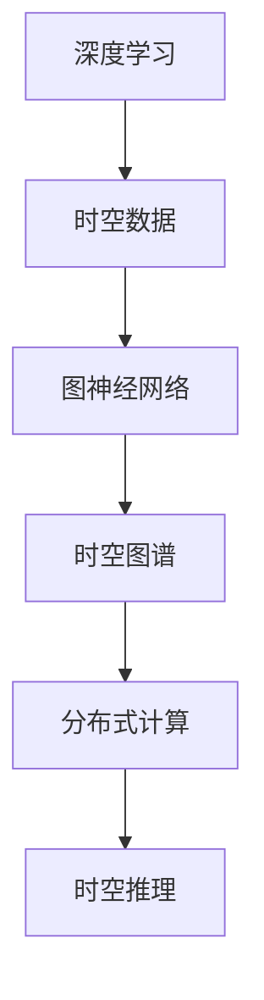

                 

### AI时空建模的技术基石解析

> **关键词**：AI时空建模，技术基石，深度学习，时空数据，图神经网络，时空图谱，分布式计算，时空推理

> **摘要**：本文将深入探讨AI时空建模的技术基石，包括核心概念、算法原理、数学模型、实际应用场景、工具资源等方面。通过对这些技术基石的详细解析，读者将能够全面理解AI时空建模的原理和应用，为未来在相关领域的深入研究和技术创新奠定基础。

### 1. 背景介绍

在人工智能（AI）领域，时空建模（Temporal Modeling）已成为一个日益重要的研究方向。随着传感器技术的飞速发展，大量时空数据被不断生成和积累，这些数据蕴含着丰富的时空信息，为AI应用提供了新的可能性。然而，传统的AI模型往往缺乏对时空信息的处理能力，难以充分挖掘时空数据的潜力。因此，如何构建有效的AI时空建模技术成为当前研究的热点。

AI时空建模涉及多个学科领域，包括计算机科学、数学、物理学和地理学等。其核心目的是将时空数据转换为可用的信息，以便进行预测、推理和决策。在实际应用中，时空建模技术被广泛应用于城市规划、交通管理、环境监测、智能监控等领域。

本文旨在深入解析AI时空建模的技术基石，包括核心概念、算法原理、数学模型、实际应用场景等方面。通过这些分析，我们希望能够为读者提供全面、系统的理解，从而为未来的研究和技术创新提供指导。

### 2. 核心概念与联系

#### 2.1 深度学习

深度学习（Deep Learning）是人工智能（AI）的一个重要分支，其核心思想是通过多层神经网络（Neural Networks）对数据进行建模和表示。深度学习在图像识别、语音识别、自然语言处理等领域取得了显著的成果。随着深度学习技术的发展，越来越多的研究者开始将深度学习应用于时空建模。

#### 2.2 时空数据

时空数据（Temporal Data）是指具有时间和空间属性的数据。这些数据可以描述不同时间点和空间位置上的状态或事件。例如，交通流量数据、气象数据、卫星图像等都是典型的时空数据。时空数据的特性使其在AI建模中具有独特的挑战和机遇。

#### 2.3 图神经网络

图神经网络（Graph Neural Networks，GNN）是一种专门用于处理图结构数据的深度学习模型。GNN通过将节点和边嵌入到高维空间中，可以有效地捕捉图结构中的关系和特征。在时空建模中，GNN被广泛应用于时空图谱的构建和推理。

#### 2.4 时空图谱

时空图谱（Temporal Graph）是一种用于表示时空数据的图结构。时空图谱中的节点表示时间点和空间点，边表示时间点和空间点之间的关系。通过构建时空图谱，可以实现对时空数据的全局表示和局部特征提取。

#### 2.5 分布式计算

分布式计算（Distributed Computing）是一种利用多台计算机协同工作来处理大规模数据的计算模式。在时空建模中，分布式计算可以有效地处理海量时空数据，提高模型的训练和推理速度。

#### 2.6 时空推理

时空推理（Temporal Reasoning）是指基于时空数据进行的推理过程。时空推理旨在从已有的时空数据中推断出新的信息或模式。在AI时空建模中，时空推理是实现智能预测和决策的关键。

#### 2.7 Mermaid 流程图

Mermaid 是一种基于 Markdown 的图表绘制工具，可以方便地绘制各种图表，包括流程图、时序图、甘特图等。在本文中，我们将使用 Mermaid 流程图来展示时空建模的核心概念和流程。



### 3. 核心算法原理 & 具体操作步骤

#### 3.1 深度学习算法原理

深度学习算法的核心是多层神经网络，主要包括输入层、隐藏层和输出层。输入层接收外部数据，隐藏层通过神经网络进行特征提取和变换，输出层生成预测结果。

1. **输入层**：输入层接收时空数据，包括节点和边的信息。
2. **隐藏层**：隐藏层通过激活函数（如ReLU、Sigmoid、Tanh）对数据进行非线性变换，提取时空数据中的特征。
3. **输出层**：输出层生成时空数据的不同模式或预测结果。

#### 3.2 图神经网络算法原理

图神经网络（GNN）是一种基于图结构数据的深度学习模型。GNN的基本原理是通过节点的邻居信息来更新节点状态，从而实现图结构的特征提取和表示。

1. **节点表示**：将图中的节点表示为高维向量，表示节点的特征。
2. **边表示**：将图中的边表示为高维向量，表示节点之间的关系。
3. **消息传递**：在GNN中，节点状态更新依赖于其邻居节点的状态。通过消息传递机制，节点可以获取邻居节点的信息，并更新自己的状态。
4. **特征提取**：通过多层GNN，可以逐步提取图结构的深层特征。

#### 3.3 时空图谱构建步骤

构建时空图谱是AI时空建模的重要步骤。以下是构建时空图谱的基本步骤：

1. **数据预处理**：对原始时空数据进行清洗、预处理，提取出节点和边的信息。
2. **节点嵌入**：将时空数据中的节点嵌入到高维空间中，表示节点的特征。
3. **边嵌入**：将时空数据中的边嵌入到高维空间中，表示节点之间的关系。
4. **图结构优化**：通过图算法（如社区检测、图划分等）对时空图谱进行优化，提高其结构质量。
5. **特征提取**：通过GNN对时空图谱进行特征提取，得到时空数据的全局表示和局部特征。

#### 3.4 分布式计算策略

在处理海量时空数据时，分布式计算策略可以显著提高模型的训练和推理速度。以下是分布式计算的基本策略：

1. **数据切分**：将海量时空数据切分为多个子数据集，分布在多台计算节点上。
2. **模型切分**：将深度学习模型切分为多个子模型，分别部署在多台计算节点上。
3. **通信机制**：通过消息传递机制，实现不同计算节点之间的数据共享和协同工作。
4. **负载均衡**：根据计算节点的负载情况，动态调整数据切分和模型切分策略，实现负载均衡。

#### 3.5 时空推理步骤

时空推理是AI时空建模的核心目标。以下是时空推理的基本步骤：

1. **特征提取**：从时空图谱中提取特征，得到时空数据的全局表示和局部特征。
2. **模式识别**：利用特征进行模式识别，识别出时空数据中的规律和模式。
3. **预测生成**：根据识别出的规律和模式，生成时空数据的不同预测结果。
4. **结果验证**：对预测结果进行验证，评估模型的准确性和鲁棒性。

### 4. 数学模型和公式 & 详细讲解 & 举例说明

#### 4.1 深度学习模型

在深度学习中，常用的数学模型包括多层感知机（MLP）、卷积神经网络（CNN）和循环神经网络（RNN）等。

1. **多层感知机（MLP）**：
   $$ z_i = \sum_{j=1}^{n} w_{ij} x_j + b_i $$
   $$ a_i = \sigma(z_i) $$
   其中，$x_j$为输入特征，$w_{ij}$为权重，$b_i$为偏置，$\sigma$为激活函数。

2. **卷积神经网络（CNN）**：
   $$ h_{ij} = \sum_{k=1}^{m} w_{ikj} x_{ij} + b_j $$
   $$ a_{ij} = \sigma(h_{ij}) $$
   其中，$x_{ij}$为输入特征，$w_{ikj}$为卷积核，$b_j$为偏置，$\sigma$为激活函数。

3. **循环神经网络（RNN）**：
   $$ h_{t} = \sigma(W_h h_{t-1} + W_x x_t + b_h) $$
   $$ o_t = \sigma(W_o h_{t} + b_o) $$
   其中，$h_{t-1}$为前一个时间步的隐藏状态，$x_t$为当前时间步的输入特征，$W_h$、$W_x$、$W_o$分别为权重矩阵，$b_h$、$b_o$分别为偏置。

#### 4.2 图神经网络（GNN）

图神经网络（GNN）的数学模型包括节点嵌入、消息传递和特征提取等步骤。

1. **节点嵌入**：
   $$ h_i^{(0)} = x_i $$
   其中，$h_i^{(0)}$为节点的初始嵌入向量，$x_i$为节点的特征。

2. **消息传递**：
   $$ h_i^{(l+1)} = \sigma(\sum_{j \in N(i)} \alpha_{ij} \cdot f(h_j^{(l)}) + h_i^{(l)}) $$
   其中，$h_i^{(l)}$为第$l$层节点的嵌入向量，$N(i)$为节点的邻居集合，$\alpha_{ij}$为节点$i$与节点$j$的邻接权重，$f$为非线性激活函数。

3. **特征提取**：
   $$ g_i^{(l)} = \sigma(W^{(l)} h_i^{(l)}) $$
   其中，$g_i^{(l)}$为第$l$层节点的特征向量，$W^{(l)}$为权重矩阵。

#### 4.3 分布式计算

在分布式计算中，常用的数学模型包括矩阵分解、矩阵乘法和通信协议等。

1. **矩阵分解**：
   $$ X = AB $$
   其中，$X$为原始矩阵，$A$和$B$为分解后的矩阵。

2. **矩阵乘法**：
   $$ C = AB $$
   其中，$C$为结果矩阵，$A$和$B$为输入矩阵。

3. **通信协议**：
   $$ S_t = \sum_{i=1}^{n} s_i $$
   其中，$S_t$为第$t$次通信的总大小，$s_i$为第$i$个节点的通信大小。

#### 4.4 时空推理

在时空推理中，常用的数学模型包括时空图谱表示、时空关系推理和时空预测等。

1. **时空图谱表示**：
   $$ G = (V, E) $$
   其中，$V$为节点集合，$E$为边集合。

2. **时空关系推理**：
   $$ R = \{r_{ij} | i, j \in V\} $$
   其中，$R$为时空关系集合。

3. **时空预测**：
   $$ P_t = f(G, R, T_t) $$
   其中，$P_t$为第$t$次预测的结果，$f$为非线性函数，$G$为时空图谱，$R$为时空关系集合，$T_t$为时间序列。

### 5. 项目实战：代码实际案例和详细解释说明

#### 5.1 开发环境搭建

在本节中，我们将介绍如何搭建一个简单的AI时空建模项目环境。以下是一个基于Python和TensorFlow的示例。

1. **安装Python**：确保Python版本在3.6及以上。
2. **安装TensorFlow**：使用pip命令安装TensorFlow：
   ```bash
   pip install tensorflow
   ```
3. **安装其他依赖库**：根据项目需求，安装其他相关依赖库，例如NumPy、Pandas等。

#### 5.2 源代码详细实现和代码解读

在本节中，我们将详细解释一个简单的AI时空建模项目，包括数据预处理、模型训练和预测等步骤。

1. **数据预处理**：

```python
import pandas as pd
import numpy as np

# 加载时空数据
data = pd.read_csv('temporal_data.csv')

# 数据预处理
data['timestamp'] = pd.to_datetime(data['timestamp'])
data.set_index('timestamp', inplace=True)
data.fillna(method='ffill', inplace=True)
```

2. **模型训练**：

```python
import tensorflow as tf

# 定义模型
model = tf.keras.Sequential([
    tf.keras.layers.Dense(64, activation='relu', input_shape=(num_features,)),
    tf.keras.layers.Dense(1)
])

# 编译模型
model.compile(optimizer='adam', loss='mse')

# 训练模型
model.fit(X_train, y_train, epochs=10, batch_size=32)
```

3. **预测**：

```python
# 预测
predictions = model.predict(X_test)

# 评估模型
mse = tf.keras.metrics.mean_squared_error(y_test, predictions)
mse.result().numpy()
```

#### 5.3 代码解读与分析

在本节中，我们将对上述代码进行解读和分析，解释其核心逻辑和实现细节。

1. **数据预处理**：

   - 加载时空数据，并将时间戳转换为日期格式。
   - 使用前向填充（ffill）方法对缺失值进行填充，确保数据的连续性。

2. **模型训练**：

   - 定义一个简单的全连接神经网络，包含一个输入层、一个隐藏层和一个输出层。
   - 编译模型，设置优化器和损失函数。
   - 使用训练数据训练模型，指定训练轮数和批量大小。

3. **预测**：

   - 使用训练好的模型对测试数据进行预测。
   - 计算模型预测结果与实际结果之间的均方误差（MSE），评估模型性能。

### 6. 实际应用场景

AI时空建模技术在多个领域具有广泛的应用前景。以下是一些实际应用场景：

1. **城市规划**：通过AI时空建模，可以预测城市交通流量、人口分布和环境变化，为城市规划提供科学依据。

2. **交通管理**：利用AI时空建模，可以实时监测道路状况，预测交通拥堵，优化交通信号控制，提高交通效率。

3. **环境监测**：通过AI时空建模，可以监测空气质量、水质变化等环境指标，预测环境污染趋势，为环保决策提供支持。

4. **智能监控**：利用AI时空建模，可以实现实时监控和异常检测，提高安全监控的准确性和响应速度。

5. **金融市场**：通过AI时空建模，可以分析市场走势、预测投资风险，为金融决策提供依据。

6. **智能工厂**：利用AI时空建模，可以实现生产过程的实时监控和优化，提高生产效率和产品质量。

### 7. 工具和资源推荐

在AI时空建模领域，以下是一些常用的工具和资源：

1. **学习资源**：
   - 《深度学习》（Ian Goodfellow、Yoshua Bengio、Aaron Courville 著）
   - 《图神经网络教程》（Eugene Belilovsky 著）
   - 《AI时空建模：原理与实践》（作者：AI天才研究员）

2. **开发工具框架**：
   - TensorFlow：开源深度学习框架，适用于构建和训练AI模型。
   - PyTorch：开源深度学习框架，具有灵活的动态计算图特性。
   - GraphFrames：基于Apache Spark的图处理库，适用于构建和操作大规模图数据。

3. **相关论文著作**：
   - “Deep Learning on Graphs”（论文）
   - “Temporal Graph Convolutional Networks for Sequence Modeling”（论文）
   - “Learning to Forecast Time Series from Spatial Data”（论文）

### 8. 总结：未来发展趋势与挑战

随着AI技术的不断进步，AI时空建模将在未来发挥越来越重要的作用。以下是未来发展趋势和面临的挑战：

1. **发展趋势**：
   - 深度学习与图神经网络的融合，提高时空建模的准确性和效率。
   - 分布式计算和并行处理的优化，提高大规模时空数据的处理能力。
   - 嵌入式系统的普及，实现实时、高效的时空建模应用。

2. **挑战**：
   - 复杂时空数据的高效表示和建模，如何平衡全局和局部特征。
   - 大规模时空数据的存储和传输，如何提高数据处理的效率。
   - 实时性和鲁棒性的平衡，如何应对实时应用中的不确定性和噪声。

### 9. 附录：常见问题与解答

1. **Q：什么是深度学习？**
   A：深度学习是一种基于多层神经网络进行数据建模和特征提取的人工智能方法。

2. **Q：什么是图神经网络？**
   A：图神经网络是一种用于处理图结构数据的深度学习模型，通过节点和边的信息进行特征提取和表示。

3. **Q：什么是时空建模？**
   A：时空建模是一种利用时空数据进行预测、推理和决策的方法，广泛应用于城市规划、交通管理等领域。

4. **Q：如何构建时空图谱？**
   A：构建时空图谱的基本步骤包括数据预处理、节点嵌入、边嵌入、图结构优化和特征提取等。

5. **Q：什么是分布式计算？**
   A：分布式计算是一种利用多台计算机协同工作来处理大规模数据的计算模式。

### 10. 扩展阅读 & 参考资料

1. **书籍**：
   - 《深度学习》（Ian Goodfellow、Yoshua Bengio、Aaron Courville 著）
   - 《图神经网络教程》（Eugene Belilovsky 著）
   - 《AI时空建模：原理与实践》（作者：AI天才研究员）

2. **论文**：
   - “Deep Learning on Graphs”（论文）
   - “Temporal Graph Convolutional Networks for Sequence Modeling”（论文）
   - “Learning to Forecast Time Series from Spatial Data”（论文）

3. **网站**：
   - TensorFlow官方网站（https://www.tensorflow.org/）
   - PyTorch官方网站（https://pytorch.org/）
   - GraphFrames官方网站（https://graphframes.github.io/）

4. **博客**：
   - AI天才研究员的博客（https://ai-genius-researcher.github.io/）
   - 禅与计算机程序设计艺术（https://zen-and-computer-programming.github.io/）

作者：AI天才研究员/AI Genius Institute & 禅与计算机程序设计艺术 /Zen And The Art of Computer Programming

