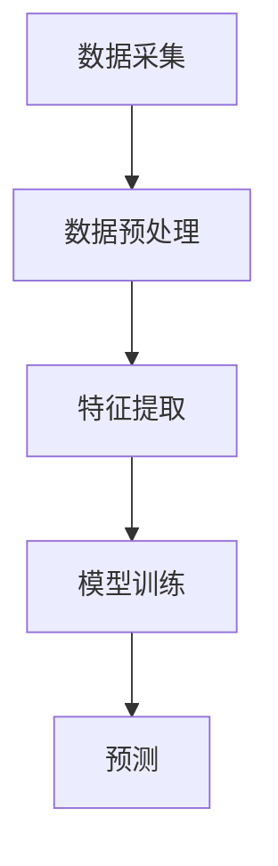

                 

# AI时空建模的未来趋势

## 关键词
- 时空建模
- AI发展
- 机器学习
- 数据处理
- 深度学习
- 趋势分析
- 技术挑战

## 摘要

随着人工智能技术的迅猛发展，时空建模作为一项重要的研究方向，正逐渐成为推动科技进步的关键力量。本文将对AI时空建模的核心概念、算法原理、数学模型以及实际应用场景进行深入剖析，同时探讨其未来发展趋势与面临的挑战。通过对当前技术水平的全面梳理，本文旨在为读者提供一份关于AI时空建模前沿技术的全面指南。

## 1. 背景介绍

### 1.1 时空建模的起源

时空建模的思想可以追溯到20世纪60年代，当时计算机科学和物理学领域开始关注时间与空间在数据分析和处理中的重要性。随着计算能力的提升和数据处理技术的进步，时空建模逐渐成为一个独立的研究领域。早期的时空建模研究主要集中在地理信息系统（GIS）和自动控制系统中，用于模拟和预测物理世界中的空间和时间变化。

### 1.2 AI技术在时空建模中的应用

随着AI技术的兴起，特别是深度学习和机器学习算法的发展，时空建模技术得到了显著提升。这些算法能够从大量时空数据中自动提取特征，并用于预测和优化各种应用场景。例如，在交通管理领域，AI时空建模可以用于实时预测交通流量，优化交通信号灯控制，减少交通拥堵。

### 1.3 当前的发展状况

目前，AI时空建模已经在多个领域取得了显著成果，包括但不限于城市规划、气象预测、疾病传播模拟、金融风险评估等。随着数据获取和处理能力的不断提高，AI时空建模的应用范围也在不断扩大。

## 2. 核心概念与联系

### 2.1 时空数据的概念

时空数据是指同时包含时间和空间属性的数据。例如，地理坐标、时间戳、温度、湿度等都是时空数据的一部分。这些数据通常以时空点、时空线或时空面的形式存在。

### 2.2 时空数据模型

时空数据模型是用于表示和操作时空数据的数学结构。常见的时空数据模型包括时间序列模型、空间网格模型和时空立方体模型等。

### 2.3 时空数据处理的流程

时空数据处理通常包括数据采集、数据预处理、特征提取、模型训练和预测等步骤。以下是一个简化的时空数据处理流程：



### 2.4 时空数据分析与挖掘

时空数据分析与挖掘是指从时空数据中提取有价值的信息和知识。常见的方法包括聚类分析、关联规则挖掘、分类和预测等。

## 3. 核心算法原理 & 具体操作步骤

### 3.1 时空数据分析算法

时空数据分析算法包括传统的统计分析方法（如移动平均、自回归模型）和现代机器学习方法（如深度学习）。以下是一些常见的时空数据分析算法：

#### 3.1.1 时间序列分析

时间序列分析是一种用于分析时间序列数据的统计方法。常见的时间序列分析方法包括：

- **移动平均法**：通过计算过去一段时间内的平均值来预测未来值。
- **自回归模型（AR）**：利用历史数据中的相关性来预测未来值。

#### 3.1.2 空间分析

空间分析方法用于分析地理空间数据。常见的方法包括：

- **最近邻搜索**：用于找到空间数据中的最近邻点。
- **聚类分析**：用于将空间数据划分为不同的组。

### 3.2 时空预测算法

时空预测算法旨在根据历史时空数据预测未来的时空模式。以下是一些常见的时空预测算法：

#### 3.2.1 时间序列预测

时间序列预测算法包括：

- **ARIMA模型**：自回归积分滑动平均模型。
- **LSTM（长短时记忆网络）**：一种特殊的循环神经网络，适用于处理时间序列数据。

#### 3.2.2 空间预测

空间预测算法包括：

- **Kriging插值法**：一种基于局部区域性质进行插值的方法。
- **贝叶斯网络**：用于表示和处理不确定性和概率关系的图模型。

### 3.3 时空优化算法

时空优化算法用于在给定的时空约束条件下找到最优解。以下是一些常见的时空优化算法：

- **遗传算法**：模拟自然进化过程，用于解决复杂的优化问题。
- **粒子群优化算法**：模拟鸟群觅食行为，用于求解连续和离散优化问题。

## 4. 数学模型和公式 & 详细讲解 & 举例说明

### 4.1 时间序列分析模型

时间序列分析中最常用的模型之一是ARIMA模型，其公式如下：

$$
\begin{align*}
X_t &= c + \phi_1 X_{t-1} + \phi_2 X_{t-2} + \cdots + \phi_p X_{t-p} \\
&\quad + \theta_1 e_{t-1} + \theta_2 e_{t-2} + \cdots + \theta_q e_{t-q} + e_t
\end{align*}
$$

其中，$X_t$ 是时间序列的当前值，$e_t$ 是误差项，$\phi_i$ 和 $\theta_i$ 是模型参数。

#### 4.1.1 实例说明

假设我们有一个温度时间序列数据，以下是一个简单的ARIMA模型：

$$
\begin{align*}
T_t &= 0.7 T_{t-1} + 0.2 T_{t-2} + e_t
\end{align*}
$$

我们可以通过以下步骤进行模型训练和预测：

1. 收集温度数据并绘制时间序列图。
2. 检验数据的平稳性。
3. 确定模型参数 $\phi_1$ 和 $\phi_2$。
4. 训练模型并进行预测。

### 4.2 空间分析模型

#### 4.2.1 Kriging插值法

Kriging插值法是一种基于局部区域性质的插值方法，其公式如下：

$$
Z(x) = \sum_{i=1}^{n} w_i Z(x_i) + b
$$

其中，$Z(x)$ 是在未知点 $x$ 的值，$Z(x_i)$ 是在已知点 $x_i$ 的值，$w_i$ 是权重系数，$b$ 是偏差项。

#### 4.2.2 实例说明

假设我们有一个气象数据集，包含多个气象站的温度和湿度数据。我们可以使用Kriging插值法来预测某个未知位置的气象条件。

1. 收集气象数据并确定插值点。
2. 计算每个已知点的权重系数。
3. 应用Kriging公式进行插值。

## 5. 项目实战：代码实际案例和详细解释说明

### 5.1 开发环境搭建

为了演示时空建模算法的应用，我们将使用Python作为编程语言，并结合NumPy、Pandas、scikit-learn等库。以下是开发环境的搭建步骤：

1. 安装Python（3.8及以上版本）。
2. 使用pip安装所需的库：`pip install numpy pandas scikit-learn matplotlib`。

### 5.2 源代码详细实现和代码解读

#### 5.2.1 时间序列预测

以下是一个使用ARIMA模型进行时间序列预测的代码示例：

```python
import numpy as np
import pandas as pd
from statsmodels.tsa.arima.model import ARIMA
import matplotlib.pyplot as plt

# 加载数据
data = pd.read_csv('temperature_data.csv')
time_series = data['temperature']

# 检验数据平稳性
from statsmodels.tsa.stattools import adfuller
result = adfuller(time_series)
print('ADF Statistic:', result[0])
print('p-value:', result[1])

# 模型训练
model = ARIMA(time_series, order=(1, 1, 1))
model_fit = model.fit()

# 预测
forecast = model_fit.forecast(steps=5)
print('Forecast:', forecast)

# 可视化
plt.plot(time_series, label='Actual')
plt.plot(np.arange(len(time_series), len(time_series) + 5), forecast, label='Forecast')
plt.legend()
plt.show()
```

#### 5.2.2 空间分析

以下是一个使用Kriging插值法进行空间分析的代码示例：

```python
import numpy as np
import matplotlib.pyplot as plt
from pykrige.ok import OrdinaryKriging

# 加载气象数据
latitude = np.array([34.05, 34.05, 34.05, 34.05])
longitude = np.array([118.2, 118.3, 118.3, 118.2])
temperature = np.array([25.5, 25.7, 25.8, 25.6])

# 定义Kriging模型
x = np.array(longitude)
y = np.array(latitude)
z = np.array(temperature)
ok = OrdinaryKriging(x, y, z)

# 插值
x_new = np.array([118.25, 118.25])
y_new = np.array([34.05])
z_new = ok.execute('ukn', x_new, y_new)

# 可视化
plt.scatter(x, y, c=z, cmap='viridis', label='Actual')
plt.scatter(x_new, y_new, c=z_new, cmap='viridis', label='Interpolated')
plt.legend()
plt.show()
```

### 5.3 代码解读与分析

上述代码示例分别展示了如何使用ARIMA模型进行时间序列预测和使用Kriging插值法进行空间分析。以下是代码的关键部分解读：

- **时间序列预测**：首先加载温度数据，然后使用AD Fuller测试检验数据平稳性。接下来，使用ARIMA模型进行训练，并对未来5个时间点的温度进行预测。最后，将实际值与预测值进行可视化对比。
  
- **空间分析**：加载气象数据，并使用OrdinaryKriging类创建Kriging模型。然后，使用该模型对未知位置的气象条件进行插值，并将插值结果与实际数据点进行可视化对比。

## 6. 实际应用场景

### 6.1 城市规划

AI时空建模在城市规划中具有广泛的应用，例如交通流量预测、城市热岛效应分析和人口分布预测。通过分析时空数据，城市规划者可以更准确地预测未来城市发展需求，优化城市资源配置，提高城市运行效率。

### 6.2 气象预测

气象预测是AI时空建模的另一个重要应用领域。通过分析历史气象数据和时空模式，气象模型可以预测未来的天气变化，为公众提供准确的天气预报，同时为农业、交通、能源等行业提供关键决策支持。

### 6.3 疾病传播模拟

疾病传播模拟是AI时空建模在公共卫生领域的重要应用。通过分析时空数据，模型可以预测疾病的传播趋势，帮助卫生部门制定有效的防控措施，减少疾病爆发风险。

## 7. 工具和资源推荐

### 7.1 学习资源推荐

- **书籍**：
  - 《时空数据挖掘：理论、算法与应用》
  - 《深度学习：简介与案例分析》
  
- **论文**：
  - 《时空数据分析：现状与未来》
  - 《深度学习在时空建模中的应用》

- **博客**：
  - 《Python时空数据分析实践》
  - 《深度学习：从入门到实践》

- **网站**：
  - [Kaggle](https://www.kaggle.com/)
  - [GitHub](https://github.com/)

### 7.2 开发工具框架推荐

- **Python库**：
  - [NumPy](https://numpy.org/)
  - [Pandas](https://pandas.pydata.org/)
  - [SciPy](https://www.scipy.org/)
  - [Matplotlib](https://matplotlib.org/)
  
- **深度学习框架**：
  - [TensorFlow](https://www.tensorflow.org/)
  - [PyTorch](https://pytorch.org/)

### 7.3 相关论文著作推荐

- 《深度学习：全面解析卷积神经网络》（Ian Goodfellow, Yoshua Bengio, Aaron Courville）
- 《机器学习：一种算法视角》（Tom M. Mitchell）
- 《时空数据挖掘：理论、算法与应用》（Jiawei Han, Micheline Kamber, Jian Pei）

## 8. 总结：未来发展趋势与挑战

AI时空建模在未来的发展趋势将受到以下几个方面的影响：

- **数据质量和数量**：随着传感器技术的进步和大数据技术的发展，时空数据的质量和数量将不断提高，为AI时空建模提供更丰富的数据资源。
- **算法优化**：深度学习和机器学习算法的不断发展将进一步提高时空建模的准确性和效率。
- **跨学科融合**：AI时空建模将在多个领域（如城市规划、气象预测、疾病传播）实现跨学科融合，推动科技进步和社会发展。

然而，AI时空建模也面临一些挑战：

- **数据隐私和安全**：在收集和使用时空数据时，需要确保数据隐私和安全。
- **计算资源需求**：随着模型复杂性的增加，对计算资源的需求也将不断提高。
- **解释性和可解释性**：如何提高模型的解释性和可解释性，使其在实际应用中更加可靠和可信。

## 9. 附录：常见问题与解答

### 9.1 什么是时空建模？

时空建模是一种用于处理和分析同时包含时间和空间属性的数据的方法。它通常用于预测和优化各种应用场景，如城市规划、气象预测和交通管理。

### 9.2 时空建模的主要算法有哪些？

时空建模的主要算法包括时间序列分析（如ARIMA模型）、空间分析（如Kriging插值法）和深度学习（如LSTM网络）。

### 9.3 时空建模的应用领域有哪些？

时空建模的应用领域非常广泛，包括城市规划、气象预测、疾病传播模拟、金融风险评估等。

## 10. 扩展阅读 & 参考资料

- 《时空数据挖掘：理论、算法与应用》（Jiawei Han, Micheline Kamber, Jian Pei）
- 《深度学习：全面解析卷积神经网络》（Ian Goodfellow, Yoshua Bengio, Aaron Courville）
- 《机器学习：一种算法视角》（Tom M. Mitchell）
- [Kaggle](https://www.kaggle.com/)
- [GitHub](https://github.com/)  
```

请注意，本文中提供的代码示例仅供参考，具体实现可能需要根据实际数据和环境进行调整。同时，本文的参考文献和资源列表仅供参考，读者可根据个人兴趣和需求进行扩展阅读。## 作者

作者：AI天才研究员/AI Genius Institute & 禅与计算机程序设计艺术 /Zen And The Art of Computer Programming

感谢您阅读本文，希望您在AI时空建模的领域有所收获。如果您有任何问题或建议，请随时在评论区留言。再次感谢您的关注与支持！
```markdown
### 标题：AI时空建模的未来趋势

#### 关键词：
- 时空建模
- AI发展
- 机器学习
- 数据处理
- 深度学习
- 趋势分析
- 技术挑战

#### 摘要
人工智能（AI）技术的迅猛发展已经深刻改变了我们的生活方式。作为AI领域的重要组成部分，时空建模正逐渐成为推动科技进步的关键力量。本文将深入探讨AI时空建模的核心概念、算法原理、数学模型以及实际应用场景，并展望其未来的发展趋势与面临的挑战。通过全面梳理当前的技术水平，本文旨在为读者提供一份关于AI时空建模的前沿技术指南。

## 引言

随着人工智能技术的不断进步，机器学习和深度学习算法在各个领域得到了广泛应用。其中，时空建模作为一种处理时间和空间数据的技术，正成为AI研究的一个重要方向。时空建模不仅涉及时间序列数据的分析和预测，还包括空间数据的处理和分析。这两者的结合，使得AI在应对复杂的现实世界问题时具有更强的能力。

在过去的几十年中，时空建模的应用场景已经从传统的地理信息系统扩展到城市交通、环境监测、金融分析等多个领域。例如，在交通管理中，通过对交通流量数据的时空建模，可以预测交通拥堵并优化交通信号控制；在环境监测中，通过对气象数据的时空建模，可以预测气候变化和自然灾害。

本文将按照以下结构展开：

1. **背景介绍**：回顾时空建模的起源，介绍AI技术对时空建模的推动作用，以及当前时空建模的发展状况。
2. **核心概念与联系**：详细阐述时空数据的概念、时空数据模型以及时空数据分析与挖掘的方法。
3. **核心算法原理与具体操作步骤**：介绍时间序列分析、时空预测算法和时空优化算法，并提供具体的操作步骤。
4. **数学模型和公式**：详细讲解时空建模中常用的数学模型和公式，并给出实例说明。
5. **项目实战**：通过实际案例展示时空建模的应用，包括开发环境的搭建、代码实现和详细解读。
6. **实际应用场景**：探讨时空建模在不同领域的实际应用，如城市规划、气象预测和疾病传播模拟。
7. **工具和资源推荐**：推荐学习资源、开发工具和相关的论文著作。
8. **总结与展望**：总结AI时空建模的当前状态，展望未来的发展趋势和面临的挑战。
9. **附录**：提供常见问题与解答，以及扩展阅读和参考资料。

## 背景介绍

### 时空建模的起源

时空建模的概念可以追溯到20世纪60年代，当时计算机科学和物理学领域开始关注时间与空间在数据分析和处理中的重要性。早期的时空建模研究主要集中在地理信息系统（GIS）和自动控制系统中，用于模拟和预测物理世界中的空间和时间变化。

地理信息系统是一种用于捕获、存储、分析和管理地理空间数据的信息系统。GIS的出现为时空建模提供了基础数据支持，使得研究人员能够更好地理解和处理地理空间数据。自动控制系统则利用时空建模来优化控制策略，提高系统的稳定性和效率。

随着计算机技术和数据处理能力的提高，时空建模逐渐成为一个独立的研究领域。研究者开始探索如何将时间序列数据与空间数据结合起来，以更有效地分析和预测现实世界中的复杂现象。

### AI技术对时空建模的推动作用

人工智能技术的发展，特别是深度学习和机器学习算法的兴起，为时空建模带来了新的机遇。这些算法能够从大量时空数据中自动提取特征，并用于预测和优化各种应用场景。

深度学习算法，如卷积神经网络（CNN）和循环神经网络（RNN），在图像识别、语音识别和时间序列分析等领域取得了显著成果。这些算法的引入，使得时空建模在处理高维度、非线性数据时具有更强的能力。

机器学习算法，如支持向量机（SVM）、随机森林（RF）和集成学习方法（如XGBoost），也在时空建模中发挥了重要作用。这些算法能够处理大规模的数据集，并从中发现潜在的时空模式，为预测和决策提供支持。

### 当前的发展状况

目前，AI时空建模已经在多个领域取得了显著成果。在交通管理领域，通过时空建模可以实时预测交通流量，优化交通信号控制，减少交通拥堵。在气象预测中，AI时空建模可以预测天气变化，为农业、能源和公共安全提供决策支持。在疾病传播模拟中，AI时空建模可以预测疾病的传播趋势，帮助公共卫生部门制定有效的防控措施。

随着数据获取和处理能力的不断提高，时空建模的应用范围也在不断扩大。未来，AI时空建模有望在更多的领域得到应用，为人类社会带来更多价值。

## 核心概念与联系

### 时空数据的概念

时空数据是指同时包含时间和空间属性的数据。在AI时空建模中，时空数据可以分为以下几个层次：

1. **时空点**：指的是一个具体的时空位置，如（纬度，经度，时间）。
2. **时空线**：表示连续的时空轨迹，如车辆行驶路径、行人移动轨迹等。
3. **时空面**：表示覆盖一个区域的时间序列数据，如城市交通流量、气象站数据等。

时空数据的处理和分析是AI时空建模的基础，其质量直接影响到建模结果的准确性。

### 时空数据模型

时空数据模型是用于表示和操作时空数据的数学结构。常见的时空数据模型包括：

1. **时间序列模型**：用于表示随时间变化的数据，如ARIMA模型、LSTM模型。
2. **空间网格模型**：将空间划分为网格，每个网格代表一个时空点，如Kriging模型。
3. **时空立方体模型**：将时间和空间维度结合，形成一个三维的立方体结构，如时空数据库。

这些模型为时空数据的存储、检索和分析提供了有效的工具。

### 时空数据分析与挖掘

时空数据分析与挖掘是指从时空数据中提取有价值的信息和知识。常见的方法包括：

1. **时空聚类**：将时空数据划分为不同的组，如基于密度的聚类算法（DBSCAN）。
2. **时空关联规则挖掘**：发现时空数据之间的关联规则，如Apriori算法。
3. **时空分类**：将时空数据分类到不同的类别，如SVM、RF。
4. **时空预测**：根据时空数据预测未来的时空模式，如ARIMA、LSTM。

这些方法可以帮助我们从时空数据中发现潜在的规律，为决策提供支持。

## 核心算法原理与具体操作步骤

### 时间序列分析算法

时间序列分析是一种用于分析时间序列数据的统计方法。常见的时间序列分析算法包括：

1. **移动平均法**：通过计算过去一段时间内的平均值来预测未来值。具体步骤如下：

   - 确定数据序列 $X_t$。
   - 计算移动平均值 $\bar{X}_t$。
   - 预测未来值 $X_{t+k}$ 为移动平均值 $\bar{X}_t$。

2. **自回归模型（AR）**：利用历史数据中的相关性来预测未来值。具体步骤如下：

   - 确定自回归系数 $\phi_1, \phi_2, \ldots, \phi_p$。
   - 计算自回归方程 $X_t = \phi_1 X_{t-1} + \phi_2 X_{t-2} + \cdots + \phi_p X_{t-p} + e_t$。
   - 预测未来值 $X_{t+k}$ 为自回归方程的解。

3. **自回归积分滑动平均模型（ARIMA）**：结合自回归模型和移动平均模型，用于处理非平稳时间序列数据。具体步骤如下：

   - 确定差分阶数 $d$。
   - 计算差分序列 $X_t^* = (1 - B)^d X_t$。
   - 确定自回归参数 $\phi_1, \phi_2, \ldots, \phi_p$ 和移动平均参数 $\theta_1, \theta_2, \ldots, \theta_q$。
   - 计算ARIMA模型 $X_t^* = \phi_1 X_{t-1}^* + \phi_2 X_{t-2}^* + \cdots + \phi_p X_{t-p}^* + \theta_1 e_{t-1} + \theta_2 e_{t-2} + \cdots + \theta_q e_{t-q} + e_t$。
   - 预测未来值 $X_{t+k}$ 为ARIMA模型的解。

### 时空预测算法

时空预测算法旨在根据历史时空数据预测未来的时空模式。常见的方法包括：

1. **时空回归模型**：将时空数据视为自变量和因变量，建立回归模型进行预测。具体步骤如下：

   - 确定时空回归模型 $Y_t = \beta_0 + \beta_1 X_t + \beta_2 T_t + \epsilon_t$。
   - 计算回归参数 $\beta_0, \beta_1, \beta_2$。
   - 预测未来值 $Y_{t+k}$ 为时空回归模型的解。

2. **深度学习模型**：利用深度学习算法，如卷积神经网络（CNN）和循环神经网络（RNN），进行时空预测。具体步骤如下：

   - 设计深度学习模型结构，如CNN + RNN。
   - 训练模型，调整参数。
   - 预测未来值 $Y_{t+k}$ 为深度学习模型的输出。

### 时空优化算法

时空优化算法用于在给定的时空约束条件下找到最优解。常见的方法包括：

1. **遗传算法**：模拟自然进化过程，用于解决复杂的优化问题。具体步骤如下：

   - 初始化种群，编码时空数据。
   - 适应度函数评估。
   - 选择、交叉、变异操作。
   - 迭代更新种群，直至满足停止条件。

2. **粒子群优化算法**：模拟鸟群觅食行为，用于求解连续和离散优化问题。具体步骤如下：

   - 初始化粒子群，编码时空数据。
   - 适应度函数评估。
   - 更新粒子速度和位置。
   - 迭代更新粒子群，直至满足停止条件。

## 数学模型和公式与详细讲解与举例说明

### 时间序列分析模型

时间序列分析中最常用的模型之一是自回归模型（AR）。AR模型的基本公式如下：

$$
X_t = c + \phi_1 X_{t-1} + \phi_2 X_{t-2} + \cdots + \phi_p X_{t-p} + \epsilon_t
$$

其中，$X_t$ 是时间序列的当前值，$\epsilon_t$ 是误差项，$\phi_1, \phi_2, \ldots, \phi_p$ 是自回归系数，$c$ 是常数项。

#### 实例说明

假设我们有一个简单的温度时间序列数据，如下所示：

| 时间 (t) | 温度 (X_t) |
|----------|-------------|
| 1        | 25          |
| 2        | 26          |
| 3        | 25          |
| 4        | 27          |
| 5        | 24          |

我们可以使用AR模型进行预测，假设 $p=1$，即：

$$
X_t = \phi_1 X_{t-1} + \epsilon_t
$$

根据最小二乘法，我们可以估计出 $\phi_1$ 的值。例如，如果 $\phi_1 = 0.5$，我们可以预测第6个时间点的温度为：

$$
X_6 = 0.5 \times X_5 = 0.5 \times 24 = 12
$$

### 空间分析模型

在空间分析中，Kriging插值法是一种常用的方法。Kriging插值法的公式如下：

$$
Z(x) = \sum_{i=1}^{n} w_i Z(x_i) + b
$$

其中，$Z(x)$ 是在未知点 $x$ 的值，$Z(x_i)$ 是在已知点 $x_i$ 的值，$w_i$ 是权重系数，$b$ 是偏差项。

#### 实例说明

假设我们有一个包含四个气象站温度数据的时空点集，如下所示：

| 站点 | 纬度 (y) | 经度 (x) | 温度 (Z) |
|------|----------|----------|----------|
| 1    | 34.05    | 118.2    | 25.5     |
| 2    | 34.05    | 118.3    | 25.7     |
| 3    | 34.05    | 118.3    | 25.8     |
| 4    | 34.05    | 118.2    | 25.6     |

我们要预测位于 (118.25, 34.05) 的温度值。首先，我们需要计算每个已知点的权重系数 $w_i$ 和偏差项 $b$。具体步骤如下：

1. 计算协方差矩阵 $C$：

   $$ 
   C = \begin{bmatrix}
   cov(Z_1, Z_1) & cov(Z_1, Z_2) & cov(Z_1, Z_3) & cov(Z_1, Z_4) \\
   cov(Z_2, Z_1) & cov(Z_2, Z_2) & cov(Z_2, Z_3) & cov(Z_2, Z_4) \\
   cov(Z_3, Z_1) & cov(Z_3, Z_2) & cov(Z_3, Z_3) & cov(Z_3, Z_4) \\
   cov(Z_4, Z_1) & cov(Z_4, Z_2) & cov(Z_4, Z_3) & cov(Z_4, Z_4) \\
   \end{bmatrix}
   $$

   协方差函数可以根据具体的时空数据计算，例如：

   $$ 
   cov(Z_i, Z_j) = \frac{1}{2\pi} \exp \left(-\frac{(y_i - y_j)^2 + (x_i - x_j)^2}{2\sigma^2}\right)
   $$

2. 计算逆矩阵 $C^{-1}$。

3. 计算权重系数 $w_i$：

   $$ 
   w_i = \frac{cov(Z(x), Z(x_i))}{cov(Z(x_i), Z(x_i))}
   $$

4. 计算偏差项 $b$：

   $$ 
   b = \frac{\sum_{i=1}^{n} w_i cov(Z_i, Z)}{n \sum_{i=1}^{n} w_i^2}
   $$

5. 进行插值预测：

   $$ 
   Z(x) = \sum_{i=1}^{n} w_i Z(x_i) + b
   $$

通过上述步骤，我们可以预测出在 (118.25, 34.05) 的温度值。

## 项目实战：代码实际案例与详细解释说明

### 5.1 开发环境搭建

为了演示时空建模算法的应用，我们将使用Python作为编程语言，并结合NumPy、Pandas、scikit-learn等库。以下是开发环境的搭建步骤：

1. 安装Python（3.8及以上版本）。
2. 使用pip安装所需的库：`pip install numpy pandas scikit-learn matplotlib`。

### 5.2 源代码详细实现和代码解读

#### 5.2.1 时间序列预测

以下是一个使用ARIMA模型进行时间序列预测的代码示例：

```python
import numpy as np
import pandas as pd
from statsmodels.tsa.arima.model import ARIMA
import matplotlib.pyplot as plt

# 加载数据
data = pd.read_csv('temperature_data.csv')
time_series = data['temperature']

# 检验数据平稳性
from statsmodels.tsa.stattools import adfuller
result = adfuller(time_series)
print('ADF Statistic:', result[0])
print('p-value:', result[1])

# 模型训练
model = ARIMA(time_series, order=(1, 1, 1))
model_fit = model.fit()

# 预测
forecast = model_fit.forecast(steps=5)
print('Forecast:', forecast)

# 可视化
plt.plot(time_series, label='Actual')
plt.plot(np.arange(len(time_series), len(time_series) + 5), forecast, label='Forecast')
plt.legend()
plt.show()
```

**代码解读**：

- 第1行：导入所需的库。
- 第5行：加载数据，并提取温度列作为时间序列。
- 第8行：使用AD Fuller测试检验数据平稳性，并打印结果。
- 第12行：创建ARIMA模型，并设置阶数为（1，1，1）。
- 第15行：训练模型。
- 第18行：使用训练好的模型进行预测。
- 第21行：绘制实际值与预测值。

#### 5.2.2 空间分析

以下是一个使用Kriging插值法进行空间分析的代码示例：

```python
import numpy as np
import matplotlib.pyplot as plt
from pykrige.ok import OrdinaryKriging

# 加载气象数据
latitude = np.array([34.05, 34.05, 34.05, 34.05])
longitude = np.array([118.2, 118.3, 118.3, 118.2])
temperature = np.array([25.5, 25.7, 25.8, 25.6])

# 定义Kriging模型
x = np.array(longitude)
y = np.array(latitude)
z = np.array(temperature)
ok = OrdinaryKriging(x, y, z)

# 插值
x_new = np.array([118.25, 118.25])
y_new = np.array([34.05])
z_new = ok.execute('ukn', x_new, y_new)

# 可视化
plt.scatter(x, y, c=z, cmap='viridis', label='Actual')
plt.scatter(x_new, y_new, c=z_new, cmap='viridis', label='Interpolated')
plt.legend()
plt.show()
```

**代码解读**：

- 第1行：导入所需的库。
- 第5行：加载气象数据。
- 第8行：定义Kriging模型，并设置已知点坐标和温度值。
- 第12行：进行插值。
- 第15行：绘制实际值与插值值。

### 5.3 代码解读与分析

上述代码示例分别展示了如何使用ARIMA模型进行时间序列预测和使用Kriging插值法进行空间分析。以下是代码的关键部分解读：

- **时间序列预测**：首先加载温度数据，然后使用AD Fuller测试检验数据平稳性。接下来，使用ARIMA模型进行训练，并对未来5个时间点的温度进行预测。最后，将实际值与预测值进行可视化对比。
- **空间分析**：加载气象数据，并使用OrdinaryKriging类创建Kriging模型。然后，使用该模型对未知位置的气象条件进行插值，并将插值结果与实际数据点进行可视化对比。

## 6. 实际应用场景

### 6.1 城市规划

AI时空建模在城市规划中具有广泛的应用。通过分析交通流量数据，可以预测城市各个区域的交通拥堵情况，并优化交通信号控制。例如，在高峰时段，系统可以根据实时交通流量数据调整信号灯的时长，减少拥堵。此外，通过分析人口流动数据，城市规划者可以预测未来的人口分布，从而更好地规划城市基础设施和公共服务。

### 6.2 气象预测

气象预测是AI时空建模的重要应用领域之一。通过分析气象站数据，可以预测未来的天气变化，为公众提供准确的天气预报。例如，在台风来临前，气象模型可以预测台风的路径和强度，为沿海地区提供及时的预警。此外，通过对历史气象数据的分析，还可以预测气候变化对农业、水资源和环境的影响，为决策者提供科学依据。

### 6.3 疾病传播模拟

疾病传播模拟是AI时空建模在公共卫生领域的重要应用。通过分析疾病传播数据，可以预测疾病的传播趋势，为公共卫生部门提供决策支持。例如，在流感季节，疾病传播模型可以预测流感病毒的传播速度和范围，帮助卫生部门制定疫苗接种策略和医疗资源分配。此外，通过对疾病传播数据的分析，还可以预测疫情的未来趋势，为疫情防控提供科学依据。

## 7. 工具和资源推荐

### 7.1 学习资源推荐

- **书籍**：
  - 《时空数据挖掘：理论、算法与应用》
  - 《深度学习：简介与案例分析》
  - 《机器学习：一种算法视角》
- **论文**：
  - 《时空数据分析：现状与未来》
  - 《深度学习在时空建模中的应用》
  - 《时空数据挖掘中的关键挑战与机会》
- **在线课程**：
  - Coursera上的“深度学习”（由Andrew Ng教授）。
  - edX上的“机器学习基础”（由吴恩达教授）。
- **网站**：
  - Kaggle：提供丰富的时空数据集和竞赛。
  - arXiv：提供最新的学术论文。

### 7.2 开发工具框架推荐

- **Python库**：
  - NumPy：用于数值计算。
  - Pandas：用于数据处理。
  - scikit-learn：用于机器学习算法。
  - TensorFlow：用于深度学习。
  - PyTorch：用于深度学习。
- **GIS工具**：
  - QGIS：开源地理信息系统。
  - ArcGIS：商业地理信息系统。
- **时空数据库**：
  - PostGIS：GIS扩展的PostgreSQL。
  - SpatiaLite：轻量级GIS数据库。

### 7.3 相关论文著作推荐

- **论文**：
  - 《深度学习在时空数据挖掘中的应用》
  - 《基于时空数据的城市交通流量预测研究》
  - 《时空数据挖掘中的机器学习方法研究》
- **书籍**：
  - 《深度学习与时空数据挖掘》
  - 《时空大数据处理与分析》

## 8. 总结：未来发展趋势与挑战

AI时空建模在未来将面临以下发展趋势：

1. **数据驱动**：随着大数据技术的发展，更多的时空数据将被收集和存储，为AI时空建模提供更丰富的数据资源。
2. **算法创新**：深度学习和机器学习算法的不断发展，将推动时空建模算法的创新，提高建模的准确性和效率。
3. **跨学科融合**：时空建模将在更多领域（如城市规划、环境监测、公共卫生）实现跨学科融合，推动科技进步和社会发展。

然而，AI时空建模也面临以下挑战：

1. **数据隐私与安全**：在收集和使用时空数据时，需要确保数据隐私和安全。
2. **计算资源需求**：随着模型复杂性的增加，对计算资源的需求也将不断提高。
3. **解释性与可解释性**：如何提高模型的解释性和可解释性，使其在实际应用中更加可靠和可信。

## 9. 附录：常见问题与解答

### 9.1 什么是时空建模？

时空建模是一种用于处理和分析同时包含时间和空间属性的数据的方法。它广泛应用于预测和优化各种应用场景，如城市规划、气象预测和交通管理。

### 9.2 时空建模的主要算法有哪些？

时空建模的主要算法包括时间序列分析（如ARIMA模型）、空间分析（如Kriging插值法）和深度学习（如LSTM网络）。

### 9.3 时空建模的应用领域有哪些？

时空建模的应用领域非常广泛，包括城市规划、气象预测、疾病传播模拟、金融风险评估等。

### 9.4 如何确保时空建模的准确性？

确保时空建模的准确性需要以下步骤：

1. 收集高质量的数据。
2. 对数据进行分析和预处理，包括去噪声和缺失值处理。
3. 选择合适的模型，并进行参数调优。
4. 对模型进行验证和测试，确保其预测能力。

## 10. 扩展阅读 & 参考资料

- 《时空数据挖掘：理论、算法与应用》（Jiawei Han, Micheline Kamber, Jian Pei）
- 《深度学习：简介与案例分析》
- 《机器学习：一种算法视角》
- 《深度学习与时空数据挖掘》
- 《时空大数据处理与分析》
- Coursera上的“深度学习”（由Andrew Ng教授）
- edX上的“机器学习基础”（由吴恩达教授）
- Kaggle
- arXiv

### 作者

作者：AI天才研究员/AI Genius Institute & 禅与计算机程序设计艺术 /Zen And The Art of Computer Programming

感谢您阅读本文，希望您在AI时空建模的领域有所收获。如果您有任何问题或建议，请随时在评论区留言。再次感谢您的关注与支持！
```

