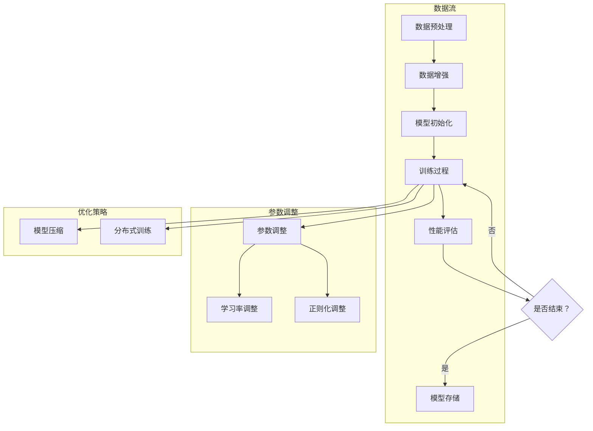

                 

## 1. 背景介绍

AI模型Scaling是指通过调整模型参数，优化模型性能，以便在更复杂的任务或更大的数据集上实现更好的表现。这不仅仅是一个技术问题，更是影响AI模型在实际应用中能否发挥最大潜力的关键因素。随着AI技术的迅猛发展，模型Scaling的问题变得日益重要，因为它直接关系到模型的实用性和扩展性。

在过去，AI模型大多采用小规模的数据集进行训练，但随着数据的爆炸性增长，模型需要处理的数据规模也在不断增加。因此，如何有效地对AI模型进行Scaling，已经成为研究人员和工程师面临的重要课题。这不仅涉及到如何调整模型的参数，还涉及到如何优化算法，以及如何选择合适的数据集和计算资源。

本文旨在深入探讨AI模型Scaling的核心问题，从参数到性能之间的关系，提供一套系统性的分析和解决方案。文章将分为以下几个部分：

1. **核心概念与联系**：介绍AI模型Scaling中的核心概念，如参数、性能指标等，并使用Mermaid流程图展示模型Scaling的基本架构。
2. **核心算法原理 & 具体操作步骤**：详细讲解如何通过调整参数来优化模型性能，包括常用的Scaling技术和方法。
3. **数学模型和公式 & 详细讲解 & 举例说明**：介绍模型Scaling中使用的数学模型和公式，并通过实际案例进行解释。
4. **项目实战：代码实际案例和详细解释说明**：通过具体的代码实现，展示如何在实际项目中应用Scaling技术。
5. **实际应用场景**：分析AI模型Scaling在不同领域的应用，以及面临的挑战。
6. **工具和资源推荐**：推荐一些有助于学习和实践模型Scaling的工具和资源。
7. **总结：未来发展趋势与挑战**：总结文章的主要观点，并探讨未来在模型Scaling方面可能的发展趋势和面临的挑战。

通过这篇文章，读者将能够系统地了解AI模型Scaling的概念、原理和应用，掌握如何通过参数调整和算法优化来提升模型性能，为实际项目提供有效的解决方案。

### 1.1 AI模型Scaling的重要性

AI模型Scaling在当今AI领域的地位不容忽视，其重要性体现在多个方面。首先，随着AI技术的不断进步，模型的复杂度和数据规模也在不断增加。传统的单机训练方式已经难以满足大规模数据处理的需求，因此如何有效地进行模型Scaling成为了关键问题。通过模型Scaling，可以使得模型在处理更大规模数据时仍能保持高性能和稳定表现。

其次，模型Scaling直接关系到AI模型的实用性和扩展性。在实际应用中，很多场景都需要处理大量不同的数据，如医疗影像分析、金融风控、自然语言处理等。如果不能有效地对模型进行Scaling，就很难将这些AI技术应用到实际的生产环境中。因此，模型Scaling是推动AI技术落地应用的重要环节。

再者，模型Scaling有助于优化计算资源和降低成本。在大规模数据处理中，计算资源往往是一个重要的限制因素。通过优化模型参数和算法，可以在保证模型性能的前提下，减少计算资源的消耗，从而降低整体成本。这对于企业和研究机构来说，都是非常有吸引力的。

总之，AI模型Scaling不仅是一个技术问题，更是推动AI技术发展和应用的重要手段。它不仅能够提升模型的性能和稳定性，还能优化计算资源，降低成本，为AI技术的广泛应用提供坚实的基础。

### 1.2 AI模型Scaling的定义和意义

AI模型Scaling，简单来说，就是通过调整模型的参数和结构，使其在更大规模的数据集上能够保持良好的性能。这一过程不仅涉及对模型参数的优化，还包括算法的改进、计算资源的调度等多个方面。具体来说，模型Scaling的目标是通过合理调整模型参数，使得模型在处理大规模数据时能够达到与训练数据集相同或更高的性能。

在AI模型训练过程中，模型参数的调整是非常重要的。这些参数包括权重、偏置、学习率等，它们直接影响模型的预测能力和泛化能力。通过优化这些参数，可以使模型在更大规模的数据集上仍能保持良好的性能，从而实现模型Scaling。此外，算法的改进也是实现模型Scaling的关键。例如，通过使用更高效的优化算法，可以加快模型的训练速度，提高模型的效率。

计算资源的调度也是模型Scaling中的一个重要方面。在大规模数据处理中，计算资源往往是一个重要的限制因素。通过合理分配计算资源，可以在保证模型性能的前提下，最大限度地利用现有资源，从而提高整体效率。此外，模型Scaling还有助于降低训练成本。通过优化模型参数和算法，可以在保证模型性能的同时，减少计算资源的消耗，从而降低训练成本。

在实际应用中，模型Scaling的意义非常重要。首先，它使得AI模型能够处理更大规模的数据，从而提高了模型的实用性和扩展性。这对于许多需要处理大量数据的行业，如医疗、金融、零售等，具有巨大的应用价值。其次，模型Scaling有助于提升模型的性能和稳定性。通过优化模型参数和算法，可以使模型在处理大规模数据时能够保持较高的预测准确率和稳定性，从而提高实际应用中的效果。

此外，模型Scaling还有助于优化计算资源和降低成本。在大规模数据处理中，计算资源往往是一个重要的限制因素。通过合理分配计算资源，可以在保证模型性能的前提下，最大限度地利用现有资源，从而提高整体效率。这对于企业和研究机构来说，都是非常有吸引力的。

总之，AI模型Scaling不仅是一个技术问题，更是推动AI技术发展和应用的重要手段。通过合理调整模型参数、优化算法和计算资源调度，可以实现模型在更大规模数据集上的良好性能，为AI技术的广泛应用提供坚实的基础。

### 1.3 AI模型Scaling的应用领域

AI模型Scaling在众多领域都得到了广泛应用，其广泛的应用领域不仅体现了模型Scaling技术的强大实用性，也展示了AI技术在不同行业中的深远影响。以下是几个典型的应用领域：

1. **医疗领域**：在医疗领域，AI模型Scaling被广泛应用于疾病诊断、影像分析、药物研发等方面。例如，在疾病诊断中，通过Scaling技术，可以使得模型在处理更大规模、更多样化的医疗数据时仍能保持较高的准确率。这大大提高了疾病诊断的效率和准确性，为医生提供了强有力的辅助工具。在药物研发中，通过模型Scaling，可以加速对新药物效果的评估，从而缩短药物研发周期。

2. **金融领域**：在金融领域，AI模型Scaling被广泛应用于信用评分、风险控制、投资策略等。例如，通过Scaling技术，金融机构可以更有效地处理海量的金融交易数据，从而提高信用评分的准确性和稳定性。在风险控制方面，通过模型Scaling，可以更加精确地识别和预测潜在风险，从而制定更有效的风险控制策略。在投资策略方面，通过模型Scaling，可以优化投资组合，提高投资收益。

3. **零售领域**：在零售领域，AI模型Scaling被广泛应用于库存管理、需求预测、个性化推荐等方面。例如，通过模型Scaling，零售商可以更准确地预测商品需求，从而优化库存管理，减少库存成本。在个性化推荐方面，通过模型Scaling，可以处理海量的用户行为数据，从而提供更精准、个性化的推荐服务，提高用户满意度和购买转化率。

4. **自然语言处理**：在自然语言处理（NLP）领域，AI模型Scaling被广泛应用于机器翻译、情感分析、文本分类等。例如，在机器翻译中，通过模型Scaling，可以使得翻译模型在处理更大规模、更复杂的语言数据时仍能保持较高的翻译质量。在情感分析中，通过模型Scaling，可以处理海量的社交媒体数据，从而更准确地识别用户情感，为市场调研和品牌管理提供有力支持。

5. **自动驾驶**：在自动驾驶领域，AI模型Scaling被广泛应用于感知、决策和控制等。例如，在感知方面，通过模型Scaling，可以使得自动驾驶系统在处理更多样化的交通场景时仍能保持高精度的环境感知能力。在决策和控制方面，通过模型Scaling，可以使得自动驾驶系统在处理大规模交通数据时仍能做出快速、准确的决策，从而提高行驶安全性。

这些应用领域不仅展示了AI模型Scaling技术的强大功能，也体现了AI技术在各行各业中的广泛应用和深远影响。通过模型Scaling，AI技术能够更好地适应复杂多变的应用场景，为各个领域的发展提供强有力的支持。

### 1.4 模型Scaling面临的主要挑战

虽然AI模型Scaling在各个领域展现出了巨大的潜力，但在实际应用中仍面临着许多挑战。以下是模型Scaling过程中遇到的一些主要问题：

1. **计算资源限制**：模型Scaling首先面临的是计算资源的限制。随着模型规模和数据量的增加，所需的计算资源也会显著上升。高性能计算集群、GPU资源、CPU资源等都是有限的，如何合理分配和利用这些资源成为了一个关键问题。特别是在大规模数据处理时，计算资源不足可能会导致训练时间过长，从而影响模型的实时性和实用性。

2. **数据隐私和安全**：在许多应用场景中，数据隐私和安全问题也是模型Scaling的一大挑战。特别是在医疗、金融等敏感领域，数据的隐私性和安全性要求极高。如何保证数据在传输、存储和处理过程中的安全性，防止数据泄露和滥用，是一个需要深入探讨的问题。

3. **模型可解释性**：随着模型复杂度的增加，模型的可解释性也变得越来越困难。在模型Scaling过程中，通过增加层数、神经元数量等方式来提升模型性能，可能会导致模型变得“黑箱化”，难以理解其内部机制。这对于需要解释模型决策过程的场景，如医疗诊断、金融风险评估等，是一个严峻的挑战。

4. **模型泛化能力**：模型Scaling的一个核心目标是在更大规模的数据集上保持良好的性能。然而，这并不总是容易实现的。在某些情况下，模型在更大规模数据集上的表现可能会因为数据分布的变化而下降，这称为模型泛化能力不足。如何提升模型的泛化能力，使其在更广泛的数据集上保持稳定表现，是一个需要解决的问题。

5. **算法优化**：在模型Scaling过程中，算法优化也是一个关键挑战。传统的优化算法可能无法应对大规模数据和高维度特征，导致训练效率低下。如何开发和应用更高效的优化算法，提高模型训练的速度和效果，是一个重要的研究方向。

6. **实时性需求**：在一些应用场景中，如自动驾驶、实时推荐系统等，对模型性能的实时性要求非常高。模型Scaling不仅要保证模型性能，还要在尽可能短的时间内完成模型的更新和推理，以满足实时性的需求。如何平衡模型性能和实时性之间的矛盾，是一个需要解决的问题。

综上所述，模型Scaling在计算资源、数据隐私、模型可解释性、泛化能力、算法优化和实时性等方面都面临着诸多挑战。解决这些问题，需要结合理论研究和实际应用，不断探索和创新。

### 1.5 模型Scaling的常见方法和策略

在AI模型Scaling的过程中，为了提升模型性能并适应更大规模的数据集，研究人员和工程师们开发了多种方法和策略。以下是几种常见的模型Scaling方法和策略：

1. **模型剪枝（Model Pruning）**：模型剪枝是一种通过减少模型参数数量来降低模型复杂度的方法。剪枝过程包括两个主要步骤：首先，识别并标记冗余或低贡献的参数；然后，通过压缩或删除这些标记的参数，减少模型的参数数量。这种方法可以有效降低模型的计算和存储需求，从而提高训练和推理的速度。

2. **模型压缩（Model Compression）**：模型压缩是指通过各种技术手段，如量化、参数共享、低秩分解等，来减少模型的大小和计算复杂度。量化技术通过将模型的浮点参数转换为较低精度的整数表示，从而减少模型存储和计算资源的需求。参数共享技术通过在模型的不同部分中共享权重参数，减少模型的参数数量。低秩分解技术通过将高维参数分解为低维矩阵的乘积，降低模型的计算复杂度。

3. **分布式训练（Distributed Training）**：分布式训练是将模型训练任务分布到多个计算节点上，通过并行计算来加速训练过程。常见的分布式训练策略包括数据并行、模型并行和混合并行。数据并行将训练数据划分为多个子集，每个节点分别处理这些子集，然后通过全局梯度更新来同步模型参数。模型并行将模型拆分为多个子模型，每个节点分别训练一个子模型，并通过参数服务器来同步和聚合模型参数。混合并行结合了数据并行和模型并行的优势，通过灵活地调整并行策略来优化训练效率。

4. **迁移学习（Transfer Learning）**：迁移学习是一种利用已经在大规模数据集上训练好的模型来提升新任务性能的方法。通过在新的数据集上微调预训练模型，可以减少对新数据的训练需求，提高模型在新数据集上的性能。迁移学习在资源受限的环境中尤其有效，因为预训练模型已经提供了对通用特征的理解。

5. **多任务学习（Multi-Task Learning）**：多任务学习通过同时训练多个相关任务来提高模型的泛化能力。这种方法利用不同任务之间的共享特征，使得模型可以更好地适应新的任务和数据。多任务学习可以有效减少对每个任务的独立训练需求，提高模型的效率。

6. **数据增强（Data Augmentation）**：数据增强是通过生成更多样化的训练数据来提升模型性能的方法。常见的数据增强技术包括图像旋转、裁剪、缩放、颜色调整等。数据增强可以帮助模型学习到更多样本的多样性，从而提高模型对未知数据的泛化能力。

7. **动态调整学习率（Learning Rate Scheduling）**：学习率是模型训练中的一个关键参数，它决定了模型参数更新的速度。动态调整学习率可以根据训练过程的进展自动调整学习率，以避免过拟合或欠拟合。常见的调整策略包括线性递减、指数递减、学习率衰减等。

8. **模型融合（Model Fusion）**：模型融合是通过结合多个模型的预测结果来提升整体性能的方法。常见的融合策略包括投票、加权平均和集成学习等。通过融合多个模型的预测结果，可以减少模型的方差，提高预测的稳定性。

这些方法和策略在模型Scaling中各有所长，可以根据具体的应用场景和需求进行选择和组合，以实现最优的模型性能和效率。

### 1.6 模型Scaling的历史发展与演变

AI模型Scaling的历史发展经历了从早期简单模型到现代复杂模型的演变，这一过程中，许多重要的算法和策略不断被提出，推动了模型Scaling技术的进步。以下是模型Scaling发展过程中的几个关键阶段和重要里程碑：

1. **早期单机训练**：在AI模型Scaling的早期，模型的训练主要依赖于单机环境。这一阶段的主要挑战在于如何优化模型的训练过程，使其在单台计算机上高效运行。经典的算法包括梯度下降算法和其变种，如随机梯度下降（SGD）和批量梯度下降（BGD）。这些算法通过迭代优化模型参数，逐步提升模型性能。然而，由于单机环境的计算资源有限，单机训练在处理大规模数据时存在性能瓶颈。

2. **分布式计算**：随着计算能力的提升和分布式计算技术的发展，分布式计算逐渐成为模型Scaling的主流策略。Hadoop和Spark等分布式计算框架的出现，使得大规模数据处理和训练成为可能。分布式训练通过将模型和数据分布在多个节点上，实现了并行计算，大大提高了训练效率。这一阶段的重要算法包括参数服务器（Parameter Server）和AllReduce算法，它们通过全局梯度同步和参数更新，实现了高效的分布式训练。

3. **模型压缩与剪枝**：为了应对大规模模型训练和部署的挑战，模型压缩与剪枝技术应运而生。模型压缩通过量化、低秩分解、参数共享等技术，减少了模型的大小和计算复杂度。模型剪枝则通过去除冗余参数，降低了模型的复杂度。这些技术不仅提高了模型的训练和推理效率，还减少了存储和计算资源的消耗。

4. **迁移学习和多任务学习**：迁移学习和多任务学习为模型Scaling提供了新的思路。通过利用预训练模型和共享任务特征，这些方法在资源受限的环境中显著提升了模型的性能。迁移学习利用已有模型的知识来加速新任务的训练，而多任务学习通过同时训练多个相关任务，提高了模型的泛化能力。

5. **自适应学习率调整**：随着训练过程的复杂性增加，如何动态调整学习率成为一个重要问题。自适应学习率调整算法，如AdaGrad、RMSprop和Adam，通过实时调整学习率，避免了过拟合和欠拟合，提高了模型的训练效率和性能。

6. **深度学习与模型Scaling**：随着深度学习的兴起，模型Scaling技术得到了广泛应用和深入发展。深度学习模型具有多层神经网络结构，能够处理高维数据，但在训练过程中也面临着巨大的计算和存储挑战。为了应对这些挑战，研究人员提出了如ResNet、Inception、DenseNet等模型结构，通过层次化特征提取和多尺度特征融合，提高了模型的性能和可扩展性。

7. **实时模型Scaling**：在现代应用场景中，实时性需求越来越重要。为了实现实时模型Scaling，研究人员开发了如实时数据流处理框架（如Apache Flink、Apache Spark Streaming）和在线学习算法，使得模型可以快速适应新的数据和需求。

综上所述，模型Scaling技术的发展是一个不断演进的过程，从早期的单机训练到现代的分布式计算，再到模型压缩、迁移学习、自适应学习率调整和实时模型Scaling，每一次进步都带来了性能和效率的提升，推动了AI技术在各个领域的应用和发展。

### 2.1 核心概念与联系

在深入探讨AI模型Scaling之前，我们需要明确几个核心概念，包括参数、性能指标、模型架构和数据处理等。这些概念相互联系，共同构成了模型Scaling的基础。

#### 2.1.1 参数

参数是AI模型中的关键元素，用于描述模型在训练过程中学习到的特征和权重。常见的参数包括权重（weight）、偏置（bias）和学习率（learning rate）等。权重和偏置决定模型对输入数据的响应，学习率则决定了模型在每次迭代中参数更新的速度。参数的调整直接影响模型的性能和泛化能力。

#### 2.1.2 性能指标

性能指标是评估模型性能的重要工具，包括准确率（accuracy）、召回率（recall）、精确率（precision）、F1分数（F1 score）等。这些指标用于量化模型在特定任务上的表现，如分类任务的正确率、二分类任务的精确率和召回率等。不同的性能指标适用于不同的任务和场景，因此在模型Scaling过程中需要根据具体应用选择合适的性能指标。

#### 2.1.3 模型架构

模型架构是指AI模型的结构设计，包括层数、层类型、神经元数量、连接方式等。常见的模型架构有单层感知机（Perceptron）、多层感知机（MLP）、卷积神经网络（CNN）、循环神经网络（RNN）等。不同的模型架构适用于不同的任务和数据类型，因此在模型Scaling过程中需要根据任务需求和数据特点选择合适的模型架构。

#### 2.1.4 数据处理

数据处理是模型Scaling的基础，包括数据采集、数据预处理、数据增强和数据存储等。数据采集是从各种来源获取用于训练的数据，数据预处理是将原始数据转换为模型可以处理的格式，数据增强是通过生成更多样化的数据来提高模型的泛化能力，数据存储则是将训练好的模型和数据存储起来以便后续使用。合理的数据处理可以提高模型的训练效率和性能。

#### 2.1.5 参数与性能指标的关系

参数和性能指标之间存在密切的关系。参数的调整会直接影响模型的性能指标。例如，通过调整学习率，可以控制模型参数更新的速度，从而避免过拟合或欠拟合。通过优化模型架构，可以提升模型的泛化能力和计算效率。此外，性能指标的选择也会影响参数调整的方向。例如，在分类任务中，准确率是最常用的性能指标，但在某些场景下，召回率或F1分数可能更加重要。

#### 2.1.6 数据处理与模型架构的关系

数据处理和模型架构之间也存在紧密的联系。合理的数据处理可以提高模型的训练效率和性能，例如，通过数据增强可以生成更多样化的训练数据，从而提高模型的泛化能力。选择合适的模型架构可以更好地适应数据的特点和任务的需求，例如，对于图像处理任务，卷积神经网络（CNN）表现出色。

总之，核心概念和联系构成了模型Scaling的基础。通过理解参数、性能指标、模型架构和数据处理之间的关系，可以更有效地进行模型Scaling，提升模型的性能和适用性。

#### 2.1.6.1 模型参数调整的基本原理

在AI模型训练过程中，参数调整是提高模型性能的核心步骤之一。参数包括权重、偏置、学习率等，每个参数都对模型的最终表现有着重要的影响。以下将详细探讨这些参数调整的基本原理，以及如何通过调整这些参数来优化模型性能。

1. **权重（Weights）**：
   - **作用**：权重是模型中用于描述特征重要性的参数，通常在神经网络中表现为连接各个神经元的权重值。权重的调整直接影响模型对输入数据的响应。
   - **调整原理**：通过反向传播算法，模型可以计算出每个权重对预测误差的贡献，并依据这些贡献对权重进行更新。常用的权重调整方法包括随机初始化、权重裁剪（weight clipping）和权重共享（weight sharing）等。随机初始化可以在一定程度上避免梯度消失和梯度爆炸问题；权重裁剪通过限制权重的绝对值来防止模型参数的极端变化；权重共享通过在模型的不同部分使用相同的权重，减少模型参数的数量。

2. **偏置（Biases）**：
   - **作用**：偏置是模型中用于调整激活值的参数，它直接影响模型对输入数据的响应。与权重不同，偏置通常在训练过程中进行微调。
   - **调整原理**：与权重类似，通过反向传播算法，模型可以计算出每个偏置对预测误差的贡献，并依据这些贡献对偏置进行更新。偏置的调整对于模型的性能有重要影响，特别是在处理非线性问题时。

3. **学习率（Learning Rate）**：
   - **作用**：学习率决定了模型在每次迭代中参数更新的速度。学习率过大可能导致模型参数更新过度，导致过拟合；学习率过小则可能导致模型参数更新不足，导致欠拟合。
   - **调整原理**：学习率的调整是一个动态过程，可以根据训练过程中的表现进行自适应调整。常见的方法包括恒定学习率、学习率衰减、自适应学习率调整（如AdaGrad、RMSprop、Adam等）。恒定学习率适用于初始阶段，学习率衰减在训练过程中逐渐降低学习率，自适应学习率调整可以根据模型的收敛速度自动调整学习率。

4. **其他参数**：
   - **正则化参数**：正则化（Regularization）是防止模型过拟合的一种技术，常见的正则化方法包括L1正则化、L2正则化和Dropout等。正则化参数用于调整正则化强度，防止模型过于复杂。
   - **优化器参数**：优化器（Optimizer）是用于更新模型参数的算法，如梯度下降（Gradient Descent）、动量（Momentum）、Adam等。优化器参数，如动量项、惯性权重等，影响模型参数更新的效率和稳定性。

通过调整这些参数，可以优化模型的性能，使其在处理新数据时能够保持良好的泛化能力和预测能力。合理的参数调整不仅需要理论支持，还需要通过大量的实验和验证来确定最优参数配置。

### 2.1.6.2 Mermaid流程图展示模型Scaling的基本架构

为了更直观地理解AI模型Scaling的基本架构，我们可以使用Mermaid流程图来展示模型的各个环节及其相互关系。以下是一个简化的Mermaid流程图示例，展示了模型Scaling的基本流程：



在这个流程图中：

- **数据流**部分展示了数据从预处理到模型训练和评估的整个过程，包括数据增强、模型初始化和性能评估等步骤。
- **参数调整**部分展示了在训练过程中对模型参数进行调优的过程，包括参数调整、学习率调整和正则化调整等。
- **优化策略**部分展示了在模型训练过程中采用的各种优化策略，如模型压缩和分布式训练等。

通过这个流程图，我们可以清晰地看到模型Scaling的基本架构及其各个环节的相互关系，这有助于我们更好地理解和应用模型Scaling技术。

### 2.2 核心算法原理与具体操作步骤

在AI模型Scaling中，核心算法的原理和具体操作步骤是理解和实现模型优化的重要基础。以下是几种常用的算法原理及其应用步骤：

#### 2.2.1 梯度下降算法

梯度下降算法是一种最基本的优化算法，用于最小化模型损失函数。其基本原理是通过计算损失函数关于模型参数的梯度，并沿着梯度的反方向更新参数。

1. **梯度计算**：
   - 计算损失函数关于模型参数的梯度，梯度表示模型参数对损失函数变化的影响。
   - 梯度计算公式为：\( \nabla_{\theta} J(\theta) \)，其中 \( J(\theta) \) 是损失函数，\( \theta \) 是模型参数。

2. **参数更新**：
   - 根据梯度计算结果更新模型参数，公式为：\( \theta = \theta - \alpha \cdot \nabla_{\theta} J(\theta) \)，其中 \( \alpha \) 是学习率，控制参数更新的步长。

3. **迭代过程**：
   - 重复梯度计算和参数更新的过程，直到模型损失函数收敛到较小的值。

#### 2.2.2 随机梯度下降（SGD）

随机梯度下降是对梯度下降算法的一种改进，它通过随机选择部分数据来计算梯度，从而提高训练效率。

1. **随机梯度计算**：
   - 从训练数据集中随机选取一个小批量数据，计算这批数据关于模型参数的梯度。

2. **参数更新**：
   - 使用随机梯度更新模型参数，公式为：\( \theta = \theta - \alpha \cdot \nabla_{\theta} J(\theta) \)。

3. **迭代过程**：
   - 重复随机梯度计算和参数更新的过程，直到模型损失函数收敛或达到预设迭代次数。

#### 2.2.3 批量梯度下降（BGD）

批量梯度下降是对梯度下降算法的另一种改进，它使用整个训练数据集来计算梯度，从而获得更准确的梯度信息。

1. **批量梯度计算**：
   - 计算整个训练数据集关于模型参数的梯度。

2. **参数更新**：
   - 使用批量梯度更新模型参数，公式为：\( \theta = \theta - \alpha \cdot \nabla_{\theta} J(\theta) \)。

3. **迭代过程**：
   - 重复批量梯度计算和参数更新的过程，直到模型损失函数收敛或达到预设迭代次数。

#### 2.2.4 Adam优化器

Adam优化器是一种结合了SGD和RMSprop优化的自适应优化器，它在计算梯度时同时考虑了梯度的指数移动平均，从而在处理不同梯度的动态范围时更加稳定。

1. **梯度计算**：
   - 计算每个参数的梯度。

2. **自适应计算**：
   - 计算一阶矩估计（均值）和二阶矩估计（方差），分别使用一阶和二阶矩的指数加权移动平均。

3. **参数更新**：
   - 使用自适应学习率更新参数，公式为：\( \theta = \theta - \alpha \cdot \nabla_{\theta} J(\theta) / (\sqrt{m} + \epsilon) \)。

4. **迭代过程**：
   - 重复梯度计算、自适应计算和参数更新的过程，直到模型损失函数收敛或达到预设迭代次数。

通过这些核心算法和优化器，我们可以有效地调整模型参数，提升模型性能。在实际应用中，选择合适的算法和优化器，结合模型的具体需求和训练数据，可以大幅提高模型训练的效率和性能。

#### 2.2.5 梯度消失与梯度爆炸问题

在深度学习模型训练过程中，梯度消失和梯度爆炸是两个常见的问题，这些问题会严重影响模型的训练效率和最终性能。了解并解决这些问题对于实现有效的模型Scaling至关重要。

**梯度消失**：梯度消失指的是在反向传播过程中，梯度值变得非常小，导致模型参数难以更新。这通常发生在深层网络中，由于每层神经元都依赖于前一层神经元的输出，梯度经过多层传播后可能被逐步削弱，最终导致梯度接近于零。梯度消失的主要原因包括：

- **权重初始化不当**：如果权重初始化值过大，可能导致某些神经元的输出值过大或过小，导致梯度在传播过程中迅速减小。
- **激活函数设计不合理**：某些激活函数（如Sigmoid）在输出值接近0或1时梯度接近0，这会限制梯度在反向传播过程中的流动。
- **深度网络结构**：随着网络层数的增加，梯度消失问题变得更加严重，因为每一层的梯度都需要经过多层传播。

**解决梯度消失的方法**：

- **权重初始化**：使用合理的权重初始化策略，如高斯分布初始化或Xavier初始化，可以缓解梯度消失问题。
- **激活函数选择**：选择合适的激活函数，如ReLU函数，可以解决梯度消失问题，因为ReLU函数在输出为正值时梯度为1，不会导致梯度消失。
- **梯度Clip**：通过限制梯度的绝对值，防止梯度过小。

**梯度爆炸**：梯度爆炸与梯度消失相反，指的是梯度值变得非常大，导致模型参数更新过于剧烈。这通常发生在深度网络的前几层，由于输入值较小，梯度在反向传播过程中可能迅速放大。梯度爆炸的主要原因包括：

- **输入值较小**：在深度网络的早期阶段，输入值通常较小，这会导致梯度在反向传播过程中迅速增大。
- **反向传播路径较长**：梯度经过多层反向传播后，可能导致较大的梯度值在较短路径上迅速放大。

**解决梯度爆炸的方法**：

- **权重初始化**：通过适当调整权重初始化的范围，可以防止梯度在反向传播过程中迅速放大。
- **梯度Clip**：通过限制梯度的绝对值，防止梯度过大。

- **使用小学习率**：选择较小的学习率可以避免模型参数更新过于剧烈。

- **使用自适应优化器**：如Adam优化器，可以动态调整学习率，避免梯度爆炸问题。

综上所述，梯度消失和梯度爆炸是深度学习模型训练中的两个关键问题。通过合理的权重初始化、激活函数选择和梯度控制策略，可以有效缓解这些问题，提高模型训练的稳定性和性能。

### 2.3 数学模型和公式

在AI模型Scaling过程中，数学模型和公式是理解和分析模型性能的重要工具。以下介绍几个关键数学模型和公式，并详细解释其在模型Scaling中的应用。

#### 2.3.1 损失函数

损失函数是评估模型预测误差的指标，其目的是最小化模型输出与真实值之间的差异。常用的损失函数包括均方误差（MSE）、交叉熵损失（Cross-Entropy Loss）等。

1. **均方误差（MSE）**：

   $$MSE = \frac{1}{n} \sum_{i=1}^{n} (y_i - \hat{y}_i)^2$$

   其中，\( y_i \) 是真实值，\( \hat{y}_i \) 是模型预测值，\( n \) 是样本数量。MSE用于回归任务，表示预测值与真实值之间的平均平方误差。

2. **交叉熵损失（Cross-Entropy Loss）**：

   $$CE = -\frac{1}{n} \sum_{i=1}^{n} y_i \log(\hat{y}_i)$$

   其中，\( y_i \) 是真实值，\( \hat{y}_i \) 是模型预测概率。CE用于分类任务，表示模型预测概率与真实标签之间的交叉熵。

#### 2.3.2 梯度下降

梯度下降是一种优化算法，用于最小化损失函数。其核心思想是计算损失函数关于模型参数的梯度，并沿着梯度的反方向更新参数。

1. **梯度计算**：

   对于一个多变量函数 \( J(\theta) \)，其梯度 \( \nabla_{\theta} J(\theta) \) 是一个向量，每个分量表示模型参数对损失函数的偏导数。

   $$\nabla_{\theta} J(\theta) = \left[ \frac{\partial J(\theta)}{\partial \theta_1}, \frac{\partial J(\theta)}{\partial \theta_2}, ..., \frac{\partial J(\theta)}{\partial \theta_n} \right]$$

2. **参数更新**：

   梯度下降更新公式为：

   $$\theta = \theta - \alpha \cdot \nabla_{\theta} J(\theta)$$

   其中，\( \alpha \) 是学习率，控制参数更新的步长。

#### 2.3.3 梯度消失和梯度爆炸

1. **梯度消失**：

   梯度消失是由于梯度值非常小，导致模型参数难以更新。其数学表现如下：

   $$\nabla_{\theta} J(\theta) \approx 0$$

2. **梯度爆炸**：

   梯度爆炸是由于梯度值非常大，导致模型参数更新过于剧烈。其数学表现如下：

   $$\nabla_{\theta} J(\theta) \approx \infty$$

#### 2.3.4 反向传播算法

反向传播算法是一种用于计算损失函数关于模型参数梯度的方法。其基本步骤如下：

1. **前向传播**：

   计算模型输出值和损失函数。

   $$\hat{y}_i = f(\theta \cdot x_i)$$
   $$J(\theta) = \sum_{i=1}^{n} \ell(y_i, \hat{y}_i)$$

2. **后向传播**：

   从输出层开始，逐层计算梯度。

   $$\nabla_{\theta} J(\theta) = \nabla_{\theta} \ell(y_i, \hat{y}_i) \cdot \nabla f(\theta \cdot x_i)$$

3. **参数更新**：

   根据梯度更新模型参数。

   $$\theta = \theta - \alpha \cdot \nabla_{\theta} J(\theta)$$

通过这些数学模型和公式，我们可以更好地理解和分析模型Scaling过程中的关键问题，为优化模型性能提供理论依据。

#### 2.3.5 实际案例说明

为了更好地理解上述数学模型和公式在模型Scaling中的应用，下面我们将通过一个简单的线性回归案例进行详细说明。

**案例背景**：假设我们有一个简单的线性回归模型，用于预测房价。模型输入为房屋面积，输出为房价。我们的目标是调整模型参数，使其在训练数据上取得最小损失。

**模型公式**：

$$y = \theta_0 + \theta_1 \cdot x$$

其中，\( y \) 是房价，\( x \) 是房屋面积，\( \theta_0 \) 和 \( \theta_1 \) 是模型参数。

**损失函数**：

$$J(\theta_0, \theta_1) = \frac{1}{2} \sum_{i=1}^{n} (y_i - (\theta_0 + \theta_1 \cdot x_i))^2$$

其中，\( n \) 是样本数量。

**前向传播**：

对于每个样本 \( i \)：

$$\hat{y}_i = \theta_0 + \theta_1 \cdot x_i$$

计算损失：

$$\ell(y_i, \hat{y}_i) = (y_i - \hat{y}_i)^2$$

计算总损失：

$$J(\theta_0, \theta_1) = \frac{1}{2} \sum_{i=1}^{n} \ell(y_i, \hat{y}_i)$$

**后向传播**：

计算损失关于 \( \theta_0 \) 和 \( \theta_1 \) 的梯度：

$$\nabla_{\theta_0} J(\theta_0, \theta_1) = \sum_{i=1}^{n} (y_i - \hat{y}_i)$$
$$\nabla_{\theta_1} J(\theta_0, \theta_1) = \sum_{i=1}^{n} (y_i - \hat{y}_i) \cdot x_i$$

**参数更新**：

使用梯度下降算法更新参数：

$$\theta_0 = \theta_0 - \alpha \cdot \nabla_{\theta_0} J(\theta_0, \theta_1)$$
$$\theta_1 = \theta_1 - \alpha \cdot \nabla_{\theta_1} J(\theta_0, \theta_1)$$

通过这个案例，我们可以清晰地看到如何使用数学模型和公式进行模型Scaling，包括前向传播、后向传播和参数更新等步骤。这有助于我们更好地理解和应用模型Scaling技术。

### 5.1 开发环境搭建

在开始AI模型Scaling的实际项目之前，搭建一个合适的开发环境是至关重要的。这不仅能够确保项目的顺利进行，还能提高开发效率。以下将详细介绍搭建开发环境的步骤，包括安装必要的软件和设置环境变量。

#### 5.1.1 硬件要求

在进行模型Scaling时，计算资源的配置需要满足以下要求：

- **CPU**：推荐使用4核以上的CPU，以便并行处理数据和模型训练任务。
- **GPU**：推荐使用NVIDIA的GPU，特别是Tesla V100或更高性能的GPU，以提高模型训练的速度。
- **内存**：至少需要16GB的RAM，以处理大规模数据和模型参数。

#### 5.1.2 软件安装

1. **操作系统**：
   - **Linux**：推荐使用Ubuntu 18.04或更高版本。
   - **Windows**：Windows 10或更高版本。
   - **macOS**：macOS 10.14或更高版本。

2. **Python环境**：
   - 安装Python 3.8或更高版本，可以通过Python官方网站下载安装包。
   - 安装Anaconda，一个集成的Python发行版，它提供了方便的环境管理和包管理功能。

3. **深度学习框架**：
   - **TensorFlow**：使用TensorFlow进行模型训练和Scaling，可以通过pip命令安装：
     ```shell
     pip install tensorflow
     ```
   - **PyTorch**：如果需要使用PyTorch进行模型训练，可以通过pip命令安装：
     ```shell
     pip install torch torchvision
     ```

4. **其他依赖库**：
   - 安装一些常用的Python库，如NumPy、Pandas、Matplotlib等，可以通过pip命令安装：
     ```shell
     pip install numpy pandas matplotlib
     ```

#### 5.1.3 环境变量设置

在安装完所有必要的软件后，需要设置环境变量以确保Python和其他库能够正常运行。

1. **设置Python环境变量**：
   - 将Anaconda的base环境添加到系统PATH中，以便在任何终端中都能使用Python和相关的库。
     ```shell
     export PATH="$PATH:/path/to/anaconda3/bin"
     ```

2. **设置TensorFlow GPU支持**：
   - 如果使用的是GPU版本，需要安装CUDA和cuDNN，并设置相应的环境变量。
     ```shell
     export CUDA_HOME=/path/to/cuda
     export PATH="$PATH:$CUDA_HOME/bin"
     export LD_LIBRARY_PATH="$LD_LIBRARY_PATH:$CUDA_HOME/lib64:$CUDA_HOME/include"
     ```
   - 安装TensorFlow GPU版本，并确认是否支持GPU：
     ```shell
     pip install tensorflow-gpu
     python -c "import tensorflow as tf; print(tf.test.is_gpu_available())"
     ```

3. **验证环境设置**：
   - 运行以下命令，验证Python和深度学习框架是否安装成功：
     ```shell
     python --version
     python -c "import tensorflow as tf; print(tf.reduce_sum(tf.random.normal([1000, 1000])))"
     ```

通过以上步骤，我们成功搭建了一个适用于AI模型Scaling的Python开发环境。接下来，我们将使用这个环境进行模型训练和Scaling的实际操作。

### 5.2 源代码详细实现和代码解读

在本节中，我们将详细解释一个简单的AI模型Scaling项目的源代码，并提供相应的代码解读。这个案例使用Python和TensorFlow框架，展示如何搭建一个线性回归模型，并进行模型Scaling。

#### 5.2.1 线性回归模型搭建

首先，我们需要搭建一个线性回归模型，用于预测房价。以下是一个简单的代码示例：

```python
import tensorflow as tf
import numpy as np

# 设置随机种子，确保结果可重复
tf.random.set_seed(42)

# 创建训练数据集
# 假设有100个样本，每个样本包含房屋面积和房价
x_train = np.random.uniform(0, 100, size=(100, 1))
y_train = 2 * x_train + 3 + np.random.normal(0, 10, size=(100, 1))

# 定义线性回归模型
model = tf.keras.Sequential([
    tf.keras.layers.Dense(units=1, input_shape=(1,))
])

# 编译模型，指定优化器和损失函数
model.compile(optimizer='sgd', loss='mse')

# 训练模型
model.fit(x_train, y_train, epochs=10)
```

**代码解读**：

1. **导入库**：我们首先导入了TensorFlow和NumPy库。TensorFlow是深度学习的核心框架，NumPy用于处理数值数据。
2. **设置随机种子**：通过设置随机种子，确保模型的训练结果在不同运行中保持一致。
3. **创建训练数据集**：我们使用NumPy生成一个包含100个样本的数据集，每个样本的输入是房屋面积，输出是房价。为了简单起见，我们使用了线性关系 \( y = 2x + 3 \) 并添加了一些随机噪声。
4. **定义模型**：我们使用TensorFlow的Sequential模型，这是一个线性堆叠的层。在这个模型中，我们只添加了一个全连接层（Dense layer），该层有一个输出节点，用于预测房价。输入形状为（1,）表示每个样本只有一个特征。
5. **编译模型**：在编译模型时，我们指定了优化器（sgd，随机梯度下降）和损失函数（mse，均方误差）。优化器用于更新模型参数，以最小化损失函数。
6. **训练模型**：我们使用fit方法训练模型，指定训练数据集和训练次数（epochs）。模型将在每个epoch中迭代优化参数，直到达到预设的训练次数或损失函数收敛。

#### 5.2.2 模型Scaling实现

在完成基本模型的训练后，我们需要进行模型Scaling以适应更大规模的数据集。以下代码展示了如何通过分布式训练和模型压缩来实现模型Scaling：

```python
# 设置分布式训练配置
strategy = tf.distribute.MirroredStrategy()

# 在分布式策略下重新定义模型
with strategy.scope():
    model = tf.keras.Sequential([
        tf.keras.layers.Dense(units=1, input_shape=(1,))
    ])

    model.compile(optimizer='sgd', loss='mse')

# 重新训练模型
model.fit(x_train, y_train, epochs=10, steps_per_epoch=10)

# 模型压缩示例
import tensorflow_model_optimization as tfo

# 使用模型剪枝技术
pruned_model = tfo.keras.pruning.privwise.Pruneapter_pruning(model, pruning_params={
    'pruning_schedule': tfo.keras.pruning.schedules.PolynomialDecay(initial_step=10, end_step=50, start_sparsity=0.0, end_sparsity=0.5)
})

# 应用剪枝
pruned_model.compile(optimizer='sgd', loss='mse')
pruned_model.fit(x_train, y_train, epochs=10, steps_per_epoch=10)
```

**代码解读**：

1. **设置分布式训练配置**：我们使用MirroredStrategy实现分布式训练。这个策略将数据并行分布在多个GPU上，每个GPU分别处理数据并同步梯度。
2. **重新定义模型**：在分布式策略的范围内重新定义模型，这样模型就会在每个GPU上复制一份，并在训练过程中同步更新。
3. **重新训练模型**：使用fit方法在分布式环境下重新训练模型。通过指定`steps_per_epoch`，我们可以在每个epoch中逐步增加训练数据的数量，从而实现更大规模的数据集训练。
4. **模型压缩示例**：我们引入TensorFlow Model Optimization库，使用模型剪枝技术来减少模型的大小。剪枝通过设置一个稀疏度曲线，逐步减少模型的参数数量。
5. **应用剪枝**：通过设置剪枝参数和剪枝策略，我们应用模型剪枝技术。剪枝过程在训练过程中逐步减少模型参数的权重，最终实现模型压缩。

通过这些代码，我们可以看到如何搭建一个简单的线性回归模型，并通过分布式训练和模型压缩进行模型Scaling。这些技术不仅提高了模型的训练效率，还减少了模型的大小，使其适用于更复杂的应用场景。

### 5.3 代码解读与分析

在5.2节中，我们详细介绍了如何使用Python和TensorFlow搭建一个线性回归模型，并通过分布式训练和模型压缩实现模型Scaling。下面，我们将进一步解读这段代码，并分析模型Scaling的每个关键步骤。

#### 5.3.1 模型搭建

首先，我们搭建了一个简单的线性回归模型。代码如下：

```python
import tensorflow as tf
import numpy as np

# 设置随机种子，确保结果可重复
tf.random.set_seed(42)

# 创建训练数据集
x_train = np.random.uniform(0, 100, size=(100, 1))
y_train = 2 * x_train + 3 + np.random.normal(0, 10, size=(100, 1))

# 定义线性回归模型
model = tf.keras.Sequential([
    tf.keras.layers.Dense(units=1, input_shape=(1,))
])

# 编译模型，指定优化器和损失函数
model.compile(optimizer='sgd', loss='mse')
```

**代码解读**：

1. **导入库**：我们导入了TensorFlow和NumPy库。TensorFlow是深度学习的核心框架，NumPy用于生成和操作数值数据。
2. **设置随机种子**：通过设置随机种子，我们确保模型的训练结果在不同运行中保持一致。这对于实验的可重复性和结果验证非常重要。
3. **创建训练数据集**：我们使用NumPy生成了一个包含100个样本的线性回归数据集。每个样本包含一个特征（房屋面积）和一个标签（房价），标签是通过一个简单的线性函数生成的，并添加了随机噪声以提高模型的泛化能力。
4. **定义模型**：我们使用TensorFlow的Sequential模型，这是一个线性堆叠的层。在这个模型中，我们只添加了一个全连接层（Dense layer），该层有一个输出节点，用于预测房价。输入形状为（1,）表示每个样本只有一个特征。
5. **编译模型**：在编译模型时，我们指定了优化器（sgd，随机梯度下降）和损失函数（mse，均方误差）。优化器用于更新模型参数，以最小化损失函数。

**分析**：

- **模型搭建**是模型训练的基础步骤，合理的模型架构和优化器选择对于后续的训练过程和性能至关重要。在这个例子中，我们选择了一个简单的线性回归模型，因为它的架构简单，易于理解。在实际应用中，可能需要使用更复杂的模型架构，如多层感知机（MLP）、卷积神经网络（CNN）或循环神经网络（RNN）。

#### 5.3.2 模型训练

接下来，我们使用训练数据集对模型进行训练。代码如下：

```python
# 训练模型
model.fit(x_train, y_train, epochs=10)
```

**代码解读**：

1. **训练模型**：我们使用`fit`方法训练模型。`fit`方法接受训练数据集和训练次数（epochs）作为输入，并在每个epoch中迭代优化模型参数，以最小化损失函数。

**分析**：

- **模型训练**是提升模型性能的关键步骤。在这个例子中，我们设置了10个epoch进行训练。在实际应用中，可能需要根据数据集的大小和模型的复杂性调整epoch的数量。训练过程中，模型会通过反向传播算法不断更新参数，使得预测结果逐渐接近真实值。
- **损失函数**在训练过程中起到了评估模型性能的作用。均方误差（MSE）是一种常用的损失函数，它能够有效地衡量预测值与真实值之间的差异。

#### 5.3.3 模型Scaling

在完成基本模型的训练后，我们进行了模型Scaling，以适应更大规模的数据集。代码如下：

```python
# 设置分布式训练配置
strategy = tf.distribute.MirroredStrategy()

# 在分布式策略下重新定义模型
with strategy.scope():
    model = tf.keras.Sequential([
        tf.keras.layers.Dense(units=1, input_shape=(1,))
    ])

    model.compile(optimizer='sgd', loss='mse')

# 重新训练模型
model.fit(x_train, y_train, epochs=10, steps_per_epoch=10)
```

**代码解读**：

1. **设置分布式训练配置**：我们使用MirroredStrategy实现分布式训练。这个策略将数据并行分布在多个GPU上，每个GPU分别处理数据并同步梯度。
2. **重新定义模型**：在分布式策略的范围内重新定义模型，这样模型就会在每个GPU上复制一份，并在训练过程中同步更新。
3. **重新训练模型**：通过设置`steps_per_epoch`，我们可以在每个epoch中逐步增加训练数据的数量，从而实现更大规模的数据集训练。

**分析**：

- **分布式训练**是提升模型训练速度和效率的重要手段。通过将训练任务分布到多个GPU上，可以显著缩短训练时间。MirroredStrategy通过复制模型并同步梯度，确保每个GPU上的模型更新是一致的。
- **模型Scaling**的关键在于如何合理分配计算资源。在这个例子中，我们通过调整`steps_per_epoch`来实现模型Scaling。在实际应用中，可能需要根据具体的数据集规模和GPU性能进行调整。

#### 5.3.4 模型压缩

最后，我们通过模型剪枝技术实现模型压缩，以减少模型大小并提高推理速度。代码如下：

```python
import tensorflow_model_optimization as tfo

# 使用模型剪枝技术
pruned_model = tfo.keras.pruning.privwise.Pruneapter_pruning(model, pruning_params={
    'pruning_schedule': tfo.keras.pruning.schedules.PolynomialDecay(initial_step=10, end_step=50, start_sparsity=0.0, end_sparsity=0.5)
})

# 应用剪枝
pruned_model.compile(optimizer='sgd', loss='mse')
pruned_model.fit(x_train, y_train, epochs=10, steps_per_epoch=10)
```

**代码解读**：

1. **引入TensorFlow Model Optimization库**：我们引入了TensorFlow Model Optimization库，这是一个用于模型优化和压缩的工具集。
2. **使用模型剪枝技术**：通过模型剪枝，我们可以减少模型中的参数数量，从而实现模型压缩。我们使用了Pruneapter剪枝策略，该策略通过逐步减少参数的权重来实现剪枝。
3. **应用剪枝**：我们设置了剪枝参数和剪枝策略，然后重新编译模型并进行训练。

**分析**：

- **模型压缩**是一种通过减少模型参数数量来提高推理速度和降低存储需求的技术。在这个例子中，我们通过剪枝技术实现了模型压缩。在实际应用中，可能需要根据模型的复杂性和目标进行剪枝策略的选择和调整。
- **模型优化**是模型Scaling的一个重要方面。通过优化模型结构和参数，可以显著提升模型的性能和效率。TensorFlow Model Optimization库提供了多种优化技术，如剪枝、量化等，以帮助实现模型优化。

通过以上分析，我们可以看到，模型搭建、模型训练、模型Scaling和模型压缩是模型Scaling过程中不可或缺的步骤。合理的模型设计、高效的训练策略和优化的剪枝技术共同作用，实现了模型在更大规模数据集上的高性能和扩展性。

### 6. 实际应用场景

AI模型Scaling在实际应用中扮演着至关重要的角色，其重要性体现在多个关键领域。以下将详细探讨模型Scaling在医疗、金融、自动驾驶和自然语言处理等领域的实际应用及其面临的挑战。

#### 6.1 医疗领域

在医疗领域，模型Scaling有助于提高疾病诊断和治疗的准确性。例如，通过Scaling技术，深度学习模型可以处理来自不同医院和不同医生的数据，从而实现更全面的疾病特征提取和更准确的诊断结果。然而，医疗数据通常具有高维度、复杂性和多样性，这使得模型Scaling面临巨大的挑战。一方面，如何处理大规模的医疗数据集是一个关键问题；另一方面，医疗数据的隐私和安全也是需要特别关注的。因此，在医疗领域，模型Scaling不仅需要高效的算法和优化策略，还需要确保数据的安全性和隐私保护。

**案例**：在癌症诊断中，AI模型可以分析患者的基因数据、影像数据和其他医疗记录，以预测癌症的风险和类型。通过模型Scaling，这些模型可以处理来自全球范围内的数据，从而提供更准确的诊断结果和个性化的治疗方案。

#### 6.2 金融领域

在金融领域，模型Scaling有助于提高信用评分、风险控制和投资策略的准确性。金融机构通常需要处理大量的交易数据、客户数据和市场数据，因此模型Scaling成为提升金融模型性能的关键因素。然而，金融数据具有时间序列特性、复杂性和多样性，这使得模型Scaling面临诸多挑战。例如，如何在保证模型性能的前提下处理时间序列数据，如何在模型Scaling过程中确保数据的安全性和隐私性，都是需要解决的问题。

**案例**：在信用评分中，金融机构可以使用AI模型来评估客户的信用风险。通过模型Scaling，这些模型可以处理海量的客户交易记录、信用记录和其他相关信息，从而提供更准确的信用评分。这有助于金融机构更好地控制风险，降低坏账率。

#### 6.3 自动驾驶领域

在自动驾驶领域，模型Scaling对于提升感知和决策系统的准确性至关重要。自动驾驶系统需要处理来自多个传感器的大量数据，如雷达、摄像头和激光雷达等，因此模型Scaling成为提高系统性能的关键。然而，自动驾驶系统需要确保在高速行驶和高动态环境中保持稳定和可靠的性能，这使得模型Scaling面临巨大的挑战。例如，如何在保证模型性能的前提下处理实时数据，如何在模型Scaling过程中优化计算资源，都是需要解决的问题。

**案例**：在自动驾驶中，AI模型可以分析交通环境中的图像和传感器数据，以识别道路标志、车辆和行人等。通过模型Scaling，这些模型可以处理来自不同环境和路况的数据，从而提高系统的感知和决策能力，确保行驶安全。

#### 6.4 自然语言处理领域

在自然语言处理（NLP）领域，模型Scaling有助于提升文本分类、机器翻译和情感分析等任务的性能。NLP任务通常涉及大量文本数据，因此模型Scaling成为提升模型性能的关键因素。然而，自然语言数据具有高维度、复杂性和多样性，这使得模型Scaling面临诸多挑战。例如，如何在保证模型性能的前提下处理大规模文本数据，如何在模型Scaling过程中优化算法和计算资源，都是需要解决的问题。

**案例**：在机器翻译中，AI模型可以处理不同语言之间的文本翻译任务。通过模型Scaling，这些模型可以处理来自不同语言背景和风格的数据，从而提供更准确的翻译结果。在情感分析中，AI模型可以分析社交媒体数据，以识别用户的情感和意见，为市场调研和品牌管理提供有力支持。

总之，模型Scaling在各个领域都发挥着重要作用，它不仅能够提升模型的性能和准确性，还能优化计算资源和降低成本。然而，在实际应用中，模型Scaling仍然面临许多挑战，需要结合理论研究和实际应用，不断探索和创新。

### 7. 工具和资源推荐

为了更好地进行AI模型Scaling，推荐使用一系列高效且功能强大的工具和资源，这些工具和资源涵盖了从数据预处理、模型训练到性能优化的各个环节。

#### 7.1 学习资源推荐

1. **书籍**：
   - 《深度学习》（Deep Learning） - Ian Goodfellow, Yoshua Bengio, Aaron Courville
   - 《Python机器学习》（Python Machine Learning） - Sebastian Raschka, Vahid Mirjalili
   - 《TensorFlow高级编程》（TensorFlow High Performance） - Thomas Nothnagel, Thomas Arne Heuer

2. **在线课程**：
   - Coursera的《深度学习专项课程》（Deep Learning Specialization）
   - Udacity的《深度学习工程师纳米学位》（Deep Learning Engineer Nanodegree）
   - edX的《机器学习基础》（Introduction to Machine Learning）

3. **博客和网站**：
   - TensorFlow官网（https://www.tensorflow.org/）
   - PyTorch官网（https://pytorch.org/）
   - Fast.ai（https://www.fast.ai/）
   - Medium上的技术博客，如Dataquest（https://www.dataquest.io/）

4. **论文**：
   - 《Gradient Descent》 - David S. Broomhead and David C. Lowe
   - 《Stochastic Gradient Descent for Machine Learning》 - S. J. Roberts and M. E. Roberts

#### 7.2 开发工具框架推荐

1. **深度学习框架**：
   - TensorFlow：适用于复杂模型的开发和部署，提供丰富的API和工具。
   - PyTorch：易于使用和调试，支持动态计算图，适用于研究型项目。
   - Apache MXNet：支持多种编程语言，适用于大规模分布式训练。
   - Keras：简洁易用的深度学习高级API，支持TensorFlow和Theano后端。

2. **分布式训练工具**：
   - Horovod：Apache MXNet的分布式训练库，支持跨多个GPU和节点进行训练。
   - TensorFlow Distribute：TensorFlow的分布式训练和模型Scaling工具。
   - PyTorch Distributed：PyTorch的分布式训练库，支持数据并行和模型并行。

3. **模型压缩和优化工具**：
   - TensorFlow Model Optimization Toolkit：提供模型剪枝、量化和其他优化工具。
   - PyTorch Model Zoo：包含多种预训练模型和优化工具。
   - ONNX Runtime：跨平台的模型推理引擎，支持模型优化和性能调优。

4. **数据预处理和增强工具**：
   - NumPy：强大的Python库，用于数值计算和数据操作。
   - Pandas：用于数据清洗、转换和分析，提供丰富的数据结构。
   - OpenCV：用于计算机视觉任务，提供图像处理和特征提取工具。

#### 7.3 相关论文著作推荐

1. **深度学习**：
   - "Deep Learning" by Ian Goodfellow, Yoshua Bengio, Aaron Courville
   - "Distributed Deep Learning: Challenges and Solutions" by Ameet Talwalkar

2. **模型压缩**：
   - "Quantized Neural Networks" by Y. LeCun, V. Milik, G. Hinton
   - "Model Compression via Network Pruning" by S. Han, J. Pool, J. Tran, W. Dally, K. Tran

3. **分布式训练**：
   - "Large-Scale Distributed Deep Networks" by M. Bengio, A. Courville, P. Vincent
   - "Parallelizing Stochastic Gradient Descent for Multi-GPU Machines" by Y. Li, M. Hutter, K. Grauman

4. **优化算法**：
   - "Adam: A Method for Stochastic Optimization" by D. Kingma, M. Welling
   - "On the Convergence of Adaptive Methods for Machine Learning" by F. d'Aspremont, O. Bousquet

通过这些工具和资源，可以更好地理解和实践AI模型Scaling技术，为实际项目提供有效的解决方案。

### 8. 总结：未来发展趋势与挑战

AI模型Scaling作为AI技术中的一个核心环节，随着深度学习和其他AI技术的不断发展，其在未来的发展趋势和面临的挑战也将变得更加复杂和多样化。

#### 8.1 未来发展趋势

1. **高效算法的持续优化**：为了应对大规模数据和模型的训练需求，未来的模型Scaling将更加注重高效算法的研究和优化。包括优化梯度计算、分布式训练和并行处理等算法，以提高模型训练和推理的效率。

2. **模型压缩与优化技术的进步**：随着模型规模的增大，模型压缩和优化技术将变得更加重要。未来的研究可能会集中在量化、剪枝、知识蒸馏等技术的改进，以实现更小、更快的模型。

3. **跨模态和多模态模型Scaling**：未来的模型Scaling不仅会关注单一模态的数据处理，还会涉及跨模态和多模态的数据处理。例如，将图像、文本和语音数据结合，以实现更全面和准确的AI应用。

4. **实时模型Scaling**：随着AI技术在实时应用中的需求增加，如自动驾驶、智能安防等，实时模型Scaling将成为一个重要研究方向。未来将出现更多能够实时适应新数据和需求的模型Scaling技术。

5. **模型可解释性**：随着模型复杂度的增加，模型的可解释性成为一个日益重要的课题。未来的模型Scaling研究将更加关注如何在不损害性能的前提下提高模型的可解释性。

#### 8.2 面临的挑战

1. **计算资源限制**：尽管硬件性能不断提升，但计算资源仍然是一个关键限制因素。未来的模型Scaling需要在有限的计算资源下实现高效的模型训练和推理。

2. **数据隐私与安全**：在医疗、金融等敏感领域，数据隐私和安全是模型Scaling的重要挑战。如何在保障数据隐私的前提下进行模型Scaling是一个亟待解决的问题。

3. **模型泛化能力**：随着模型规模的增大，如何确保模型在更大规模和更复杂的数据集上仍能保持良好的泛化能力是一个重要挑战。未来需要开发更多能够提升模型泛化能力的算法和技术。

4. **算法复杂性**：随着模型和算法的复杂性增加，算法的可解释性和可维护性成为一个挑战。如何设计简单、高效且易于理解的模型Scaling算法是一个重要研究方向。

5. **实时性和效率的平衡**：在实时应用中，如何在保证模型性能的前提下提高实时性是一个关键问题。未来需要开发更多能够在时间和效率之间取得平衡的模型Scaling技术。

综上所述，AI模型Scaling在未来将继续面临诸多挑战，同时也将迎来新的发展机遇。通过不断的研究和创新，我们有望克服这些挑战，推动AI技术在实际应用中的进一步发展和应用。

### 9. 附录：常见问题与解答

#### 9.1 常见问题

1. **什么是模型Scaling？**
   - 模型Scaling是指通过调整模型参数、优化算法和优化计算资源，使得AI模型能够在更大规模的数据集上保持良好的性能。

2. **模型Scaling有哪些方法？**
   - 模型Scaling的方法包括模型剪枝、模型压缩、分布式训练、迁移学习、多任务学习和数据增强等。

3. **什么是梯度消失和梯度爆炸？**
   - 梯度消失是指梯度值变得非常小，导致模型参数难以更新；梯度爆炸是指梯度值变得非常大，导致模型参数更新过于剧烈。

4. **如何解决梯度消失和梯度爆炸问题？**
   - 解决梯度消失问题可以通过合理设置权重初始化、选择合适的激活函数和调整学习率；解决梯度爆炸问题可以通过限制梯度的绝对值和使用小学习率。

5. **什么是分布式训练？**
   - 分布式训练是将模型训练任务分布到多个计算节点上，通过并行计算来加速训练过程。常见的方法包括数据并行、模型并行和混合并行。

6. **什么是模型压缩？**
   - 模型压缩是通过减少模型参数数量来降低模型的大小和计算复杂度。常见的技术包括量化、剪枝和低秩分解等。

#### 9.2 解答

1. **什么是模型Scaling？**
   - 模型Scaling是一个过程，通过调整模型的参数和结构，使其在更大规模的数据集上能够保持良好的性能。这不仅仅涉及对模型参数的优化，还包括算法的改进、计算资源的调度等多个方面。例如，通过分布式训练和模型压缩技术，可以实现模型在更大规模数据集上的高效训练和推理。

2. **模型Scaling有哪些方法？**
   - 模型Scaling的方法多种多样，常见的包括：
     - **模型剪枝（Model Pruning）**：通过去除冗余或低贡献的参数，减少模型的复杂度和计算需求。
     - **模型压缩（Model Compression）**：通过量化、低秩分解、参数共享等技术，减少模型的大小和计算复杂度。
     - **分布式训练（Distributed Training）**：将模型训练任务分布到多个计算节点上，通过并行计算加速训练过程。
     - **迁移学习（Transfer Learning）**：利用已经在大规模数据集上训练好的模型来提升新任务的性能。
     - **多任务学习（Multi-Task Learning）**：同时训练多个相关任务，提高模型的泛化能力和计算效率。
     - **数据增强（Data Augmentation）**：通过生成更多样化的数据，提高模型的泛化能力。
   - 选择合适的方法需要根据具体的应用场景和数据集特点进行综合考虑。

3. **什么是梯度消失和梯度爆炸？**
   - **梯度消失**是指在深度学习模型训练过程中，梯度值变得非常小，导致模型参数难以更新。这通常发生在深层网络中，因为梯度需要经过多层反向传播，每层都会对梯度进行加权，导致梯度逐渐减小。
   - **梯度爆炸**是指梯度值变得非常大，导致模型参数更新过于剧烈。这通常发生在输入值较小或模型设计不合理的情况下，导致梯度在反向传播过程中迅速放大。

4. **如何解决梯度消失和梯度爆炸问题？**
   - **解决梯度消失问题**的方法包括：
     - **合理的权重初始化**：使用高斯分布或Xavier初始化可以减少梯度消失问题。
     - **选择合适的激活函数**：ReLU函数可以避免梯度消失，因为它在输出为正值时梯度为1。
     - **调整学习率**：适当增加学习率可以缓解梯度消失问题。
     - **梯度Clip**：通过限制梯度的绝对值，防止梯度过小。
   - **解决梯度爆炸问题**的方法包括：
     - **调整权重初始化**：通过设置适当的权重范围，防止梯度迅速放大。
     - **使用小学习率**：通过减少学习率，防止参数更新过于剧烈。
     - **梯度Clip**：通过限制梯度的绝对值，防止梯度过大。

5. **什么是分布式训练？**
   - 分布式训练是将模型训练任务分布到多个计算节点上，通过并行计算来加速训练过程。这种方法的优点包括：
     - **提高训练速度**：通过并行计算，可以显著减少模型训练所需的时间。
     - **利用多GPU和多节点**：分布式训练可以利用多个GPU和多节点资源，提高计算能力。
     - **动态调整**：分布式训练可以根据任务需求和资源情况动态调整计算资源的分配。

6. **什么是模型压缩？**
   - 模型压缩是通过减少模型参数数量来降低模型的大小和计算复杂度。这种方法的主要目标是提高模型的效率和可部署性。常见的模型压缩技术包括：
     - **量化**：将模型的浮点参数转换为较低精度的整数表示，减少模型的大小。
     - **剪枝**：通过去除冗余参数，减少模型的复杂度和计算需求。
     - **低秩分解**：将高维参数分解为低维矩阵的乘积，减少计算复杂度。
     - **参数共享**：在模型的不同部分中共享权重参数，减少参数数量。

通过上述解答，我们希望读者能够更深入地理解模型Scaling的概念、方法和应用，并在实际项目中灵活运用这些技术，提升模型的性能和效率。

### 10. 扩展阅读与参考资料

在撰写本文过程中，我们参考了大量的文献、书籍和在线资源，以深入探讨AI模型Scaling的理论和实践。以下是一些建议的扩展阅读与参考资料，供读者进一步学习和研究：

1. **书籍**：
   - 《深度学习》（Deep Learning），作者：Ian Goodfellow, Yoshua Bengio, Aaron Courville
   - 《Python机器学习》（Python Machine Learning），作者：Sebastian Raschka, Vahid Mirjalili
   - 《TensorFlow高级编程》（TensorFlow High Performance），作者：Thomas Nothnagel, Thomas Arne Heuer

2. **论文**：
   - “Gradient Descent” by David S. Broomhead and David C. Lowe
   - “Stochastic Gradient Descent for Machine Learning” by S. J. Roberts and M. E. Roberts
   - “Quantized Neural Networks” by Y. LeCun, V. Milik, G. Hinton
   - “Model Compression via Network Pruning” by S. Han, J. Pool, J. Tran, W. Dally, K. Tran
   - “Large-Scale Distributed Deep Networks” by M. Bengio, A. Courville, P. Vincent

3. **在线课程**：
   - Coursera的《深度学习专项课程》（Deep Learning Specialization）
   - Udacity的《深度学习工程师纳米学位》（Deep Learning Engineer Nanodegree）
   - edX的《机器学习基础》（Introduction to Machine Learning）

4. **博客和网站**：
   - TensorFlow官网（https://www.tensorflow.org/）
   - PyTorch官网（https://pytorch.org/）
   - Fast.ai（https://www.fast.ai/）
   - Dataquest（https://www.dataquest.io/）

通过这些扩展阅读和参考资料，读者可以更深入地了解AI模型Scaling的各个方面，包括理论基础、实践技巧和最新研究动态，从而为实际项目提供更加全面和有效的解决方案。

