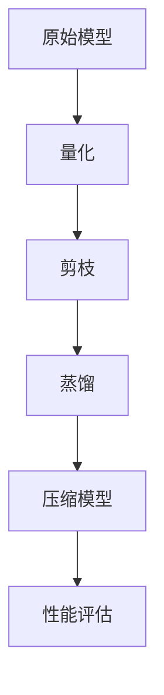

                 

### 1. 背景介绍

随着人工智能技术的迅猛发展，深度学习模型在计算机视觉、自然语言处理、语音识别等领域取得了显著的成果。然而，这些模型往往具有极高的计算复杂度和庞大的存储需求，这在实际应用中带来了一系列挑战。因此，如何有效地压缩这些大模型，使其在有限资源下仍然能够高效运行，成为当前研究的热点。

AI模型压缩技术主要涉及模型权重和结构的优化。通过减少模型的参数数量和计算量，可以显著降低模型的存储需求和计算成本。此外，压缩后的模型在保持原有性能的同时，也能够提高推理速度，降低能耗，这在移动设备和嵌入式系统上尤为重要。

本文将围绕AI模型压缩技术在大模型领域的应用，系统地介绍相关核心概念、算法原理、数学模型以及实际应用案例。通过深入分析这些技术，我们将探讨如何在大模型压缩中取得最佳效果，并展望未来可能的发展趋势与挑战。

主要内容包括：

1. **核心概念与联系**：介绍AI模型压缩技术中的关键概念及其相互关系，通过Mermaid流程图展示模型压缩的整体架构。
2. **核心算法原理与具体操作步骤**：详细阐述常见的模型压缩算法，包括量化、剪枝、蒸馏等，并说明各自的操作步骤和实现方法。
3. **数学模型与公式**：介绍与模型压缩相关的重要数学模型，如量化误差模型、剪枝敏感度分析等，通过具体的例子进行解释说明。
4. **项目实战**：以实际项目为例，展示如何进行模型压缩的代码实现，并提供详细解释和分析。
5. **实际应用场景**：探讨AI模型压缩技术在各种场景下的应用，如移动设备、嵌入式系统、云计算等。
6. **工具和资源推荐**：推荐学习资源、开发工具框架和相关论文著作，为读者进一步学习和实践提供支持。
7. **总结与展望**：总结本文的主要内容，探讨未来的发展趋势和面临的挑战。

通过本文的阅读，读者将能够全面了解AI模型压缩技术的基本原理和应用，为在实际项目中应用这一技术提供指导。接下来，我们将深入探讨这些核心内容，逐步展开分析。  

<|assistant|>## 2. 核心概念与联系

### 模型压缩技术的核心概念

在介绍模型压缩技术之前，我们首先需要明确几个核心概念，包括模型、权重、参数、计算复杂度等。

- **模型（Model）**：在深度学习中，模型是指由一系列神经网络层组成的结构，用于学习输入数据和输出目标之间的映射关系。
- **权重（Weight）**：权重是模型中的可训练参数，它们决定了模型对数据的响应能力。
- **参数（Parameter）**：参数包括权重和偏置，是模型训练过程中不断调整的变量。
- **计算复杂度（Computational Complexity）**：计算复杂度是评估模型计算量的一种指标，通常以时间复杂度和空间复杂度来衡量。

模型压缩技术旨在通过优化模型权重和结构，降低计算复杂度和存储需求，同时保持或提升模型的性能。

### 模型压缩技术的关联概念

在模型压缩过程中，我们还会涉及到以下关联概念：

- **量化（Quantization）**：量化是将模型中的浮点数权重转换为固定长度的整数表示。这可以显著减少模型的大小，但可能引入量化误差。
- **剪枝（Pruning）**：剪枝是通过删除网络中不必要的权重或神经元来减少模型的大小和计算复杂度。剪枝可以分为结构剪枝和权重剪枝。
- **蒸馏（Distillation）**：蒸馏是一种将大模型的权重和知识传递给小模型的方法。通过训练小模型来模仿大模型的输出，从而在保持性能的同时减少模型的大小。

### 模型压缩的整体架构

为了更好地理解模型压缩技术，我们可以通过Mermaid流程图来展示其整体架构。以下是一个简化的Mermaid流程图，展示了模型压缩技术的主要步骤和环节：



- **原始模型（A）**：这是我们开始时的模型，具有较大的计算复杂度和存储需求。
- **量化（B）**：通过量化步骤，我们将模型的浮点数权重转换为固定长度的整数表示。
- **剪枝（C）**：剪枝步骤旨在通过删除不必要的权重和神经元来减少模型的大小。
- **蒸馏（D）**：蒸馏步骤将大模型的权重和知识传递给小模型，以提高小模型性能的同时减少其大小。
- **压缩模型（E）**：这是经过压缩后的模型，其计算复杂度和存储需求显著降低。
- **性能评估（F）**：对压缩模型进行性能评估，以确保其在压缩后仍然保持较高的性能。

通过这个Mermaid流程图，我们可以直观地看到模型压缩技术的整体架构和各步骤之间的关系。接下来，我们将深入探讨这些核心概念和算法原理，以更好地理解模型压缩技术的实际应用。

### 2.1 量化

量化是模型压缩技术中的一项重要方法，通过将模型的浮点数权重转换为固定长度的整数表示，从而降低模型的大小和计算复杂度。量化过程主要包括量化层设计、量化策略选择以及量化误差分析。

#### 量化层设计

量化层是量化过程的核心组件，用于将原始的浮点数权重转换为整数表示。量化层的设计主要包括以下几个步骤：

1. **权重采样**：首先，对模型中的每个权重进行采样，得到一组浮点数样本。这些样本代表了权重的分布情况。
2. **量化级别划分**：根据采样结果，将权重划分为多个量化级别。每个量化级别对应一个整数范围，用于表示原始浮点数的整数近似值。
3. **权重量化**：对于每个浮点数权重，根据其值落在哪个量化级别内，将其映射为相应的整数表示。这一过程通常使用查表（Lookup Table）实现。

#### 量化策略选择

量化策略的选择对量化效果具有重要影响。常见的量化策略包括：

1. **对称量化**：对称量化将正负权重分别映射到相同的整数范围内。这种策略的优点是简单易实现，缺点是可能导致较大的量化误差。
2. **不对称量化**：不对称量化根据正负权重的分布特性，设置不同的量化级别。这种策略可以更好地适应权重的分布，从而降低量化误差。
3. **动态量化**：动态量化根据权重的实时变化动态调整量化级别。这种策略可以进一步提高量化精度，但实现较为复杂。

#### 量化误差分析

量化误差是量化过程中不可避免的现象，它会影响模型的性能。量化误差分析主要包括以下几个方面：

1. **量化误差模型**：量化误差模型用于描述量化过程引入的误差。常见的量化误差模型包括量化误差三角模型和量化误差平方模型。
2. **误差传播**：量化误差会通过神经网络层传播，影响模型的整体性能。误差传播分析有助于理解量化误差对模型性能的影响。
3. **误差优化**：通过优化量化级别划分和量化策略，可以降低量化误差，提高模型的性能。常见的误差优化方法包括误差补偿、量化级别自适应调整等。

#### 实际操作步骤

以下是量化操作的具体步骤：

1. **权重采样**：对模型中的每个权重进行采样，得到浮点数样本。
2. **量化级别划分**：根据采样结果，设置量化级别。对于对称量化，可以使用等间隔划分；对于不对称量化，可以根据权重的正负分布设置不同的量化级别。
3. **权重量化**：根据量化级别，将每个浮点数权重映射为整数表示。可以使用查表方式快速实现这一步骤。
4. **量化误差分析**：对量化后的权重进行误差分析，确保其符合预期的量化误差范围。

通过以上步骤，我们可以实现模型权重的量化，从而降低模型的计算复杂度和存储需求。在后续的模型压缩过程中，量化误差的分析和优化是关键步骤，需要根据具体应用场景进行精细调整。

### 2.2 剪枝

剪枝是模型压缩技术中的另一项重要方法，通过删除网络中不必要的权重和神经元，从而减少模型的大小和计算复杂度。剪枝可以分为结构剪枝和权重剪枝两种类型。

#### 结构剪枝

结构剪枝通过直接删除网络中的层或神经元来减少模型的大小。结构剪枝的优点是简单直观，但可能导致模型的性能下降。结构剪枝的基本步骤包括：

1. **选择剪枝目标**：选择网络中需要剪枝的层或神经元。常用的选择方法包括基于权重的选择、基于梯度的选择和基于层连接性的选择。
2. **剪枝策略设计**：设计剪枝策略，以确定如何剪枝。常见的剪枝策略包括逐层剪枝、逐神经元剪枝和混合剪枝。
3. **剪枝实现**：根据剪枝策略，对网络进行剪枝操作。剪枝后的网络需要重新训练，以确保其性能不受显著影响。

#### 权重剪枝

权重剪枝通过直接删除网络中较小的权重来减少模型的大小。权重剪枝的优点是可以在保持模型性能的前提下显著减少模型大小。权重剪枝的基本步骤包括：

1. **权重筛选**：筛选出网络中较小的权重。常用的筛选方法包括基于阈值的筛选和基于显著性程度的筛选。
2. **权重删除**：删除筛选出的较小权重。删除后的网络需要重新训练，以确保其性能不受显著影响。
3. **剪枝策略优化**：通过优化剪枝策略，进一步提高模型的压缩效果和性能。常见的优化方法包括剪枝敏感度分析、剪枝阈值自适应调整等。

#### 实际操作步骤

以下是剪枝操作的具体步骤：

1. **选择剪枝目标**：根据模型结构和性能要求，选择需要剪枝的层或神经元。
2. **剪枝策略设计**：设计合适的剪枝策略，以确定剪枝的方式和程度。
3. **剪枝实现**：对网络进行剪枝操作，删除不必要的权重或神经元。
4. **模型重训练**：对剪枝后的网络进行重训练，确保其性能不受显著影响。
5. **性能评估**：对剪枝后的模型进行性能评估，确保其满足预期要求。

通过以上步骤，我们可以实现模型的有效剪枝，从而降低模型的计算复杂度和存储需求。在剪枝过程中，选择合适的剪枝目标和剪枝策略是关键步骤，需要根据具体应用场景进行精细调整。

### 2.3 蒸馏

蒸馏是模型压缩技术中的一项重要方法，通过将大模型的权重和知识传递给小模型，从而在保持性能的同时减少模型的大小。蒸馏过程通常包括两个阶段：知识提取和知识蒸馏。

#### 知识提取

知识提取阶段旨在从大模型中提取重要的知识和信息。具体步骤如下：

1. **选择大模型**：选择一个具有良好性能的大模型作为知识源。
2. **提取特征表示**：对输入数据在大模型中提取特征表示。这些特征表示包含了输入数据的深层信息，可以作为小模型学习的目标。
3. **训练小模型**：使用提取的特征表示训练小模型，使其能够模仿大模型的输出。小模型可以是原始模型的一个简化版本，也可以是专门为蒸馏任务设计的小模型。

#### 知识蒸馏

知识蒸馏阶段旨在将提取的知识传递给小模型，具体步骤如下：

1. **定义损失函数**：定义知识蒸馏的损失函数，以衡量小模型输出与大模型输出之间的差距。常见的损失函数包括软标签损失和对抗性损失。
2. **优化小模型**：通过优化小模型参数，使其在知识蒸馏过程中逐渐逼近大模型的输出。优化过程通常使用梯度下降方法，并考虑大模型的输出作为软标签。
3. **评估小模型**：对训练完成的小模型进行性能评估，确保其能够在压缩后仍然保持较高的性能。

#### 实际操作步骤

以下是蒸馏操作的具体步骤：

1. **选择大模型**：根据性能要求选择一个具有良好性能的大模型作为知识源。
2. **提取特征表示**：对输入数据在大模型中提取特征表示。
3. **训练小模型**：使用提取的特征表示训练小模型，使其能够模仿大模型的输出。
4. **定义损失函数**：定义知识蒸馏的损失函数，以衡量小模型输出与大模型输出之间的差距。
5. **优化小模型**：通过优化小模型参数，使其在知识蒸馏过程中逐渐逼近大模型的输出。
6. **评估小模型**：对训练完成的小模型进行性能评估，确保其能够在压缩后仍然保持较高的性能。

通过以上步骤，我们可以实现模型的有效蒸馏，从而在保持性能的同时显著减少模型的大小。在蒸馏过程中，选择合适的大模型和损失函数是关键步骤，需要根据具体应用场景进行精细调整。

### 2.4 模型压缩的整体架构

为了更好地理解模型压缩技术的整体架构，我们可以通过Mermaid流程图来展示其各个组成部分及其相互关系。以下是一个简化的Mermaid流程图，展示了模型压缩技术的主要步骤和环节：


- **原始模型（A）**：这是我们开始时的模型，具有较大的计算复杂度和存储需求。
- **量化（B）**：通过量化步骤，我们将模型的浮点数权重转换为固定长度的整数表示。
- **剪枝（C）**：通过剪枝步骤，我们删除网络中不必要的权重和神经元，以减少模型的大小。
- **蒸馏（D）**：通过蒸馏步骤，我们将大模型的权重和知识传递给小模型，以提高小模型性能的同时减少其大小。
- **压缩模型（E）**：这是经过压缩后的模型，其计算复杂度和存储需求显著降低。
- **性能评估（F）**：对压缩模型进行性能评估，以确保其在压缩后仍然保持较高的性能。

通过这个Mermaid流程图，我们可以直观地看到模型压缩技术的整体架构和各步骤之间的关系。在实际应用中，模型压缩技术通常需要根据具体需求和场景进行灵活调整和优化，以实现最佳效果。

### 3. 核心算法原理与具体操作步骤

在了解了模型压缩技术的基本概念和整体架构之后，接下来我们将深入探讨模型压缩的核心算法原理以及具体的操作步骤。本文将重点介绍量化、剪枝和蒸馏三种常见的模型压缩算法，并详细说明它们的基本原理和操作步骤。

#### 量化算法

量化算法是模型压缩技术中最基础的方法之一，其主要思想是将模型的浮点数权重转换为固定长度的整数表示，以降低模型的存储和计算需求。量化算法的基本原理如下：

1. **量化级别划分**：首先，我们需要对模型的权重进行采样，以获取权重在训练过程中的分布情况。然后，根据采样结果，将权重划分为多个量化级别。每个量化级别对应一个整数范围，用于表示原始浮点数的整数近似值。
2. **量化误差补偿**：量化过程中引入的误差会影响模型的性能。为了降低量化误差对模型的影响，我们可以采用量化误差补偿策略，如误差校正和动态量化等。
3. **量化实现**：量化实现通常包括权重采样、量化级别划分和权重量化三个步骤。权重采样可以通过统计方法或随机采样方法实现。量化级别划分可以根据采样结果进行等间隔划分或非等间隔划分。权重量化可以通过查表或查找表（Lookup Table）实现。

具体操作步骤如下：

1. **权重采样**：对模型中的每个权重进行采样，得到一组浮点数样本。
2. **量化级别划分**：根据采样结果，设置量化级别。对于对称量化，可以使用等间隔划分；对于不对称量化，可以根据权重的正负分布设置不同的量化级别。
3. **权重量化**：根据量化级别，将每个浮点数权重映射为整数表示。可以使用查表方式快速实现这一步骤。
4. **量化误差分析**：对量化后的权重进行误差分析，确保其符合预期的量化误差范围。

#### 剪枝算法

剪枝算法通过删除网络中不必要的权重和神经元，以减少模型的计算复杂度和存储需求。剪枝算法的基本原理如下：

1. **剪枝目标选择**：首先，我们需要选择剪枝的目标，如权重、神经元或层。常用的剪枝目标选择方法包括基于权重的选择、基于梯度的选择和基于层连接性的选择。
2. **剪枝策略设计**：设计剪枝策略，以确定如何剪枝。常见的剪枝策略包括逐层剪枝、逐神经元剪枝和混合剪枝等。
3. **剪枝实现**：根据剪枝策略，对网络进行剪枝操作。剪枝后的网络需要重新训练，以确保其性能不受显著影响。

具体操作步骤如下：

1. **选择剪枝目标**：根据模型结构和性能要求，选择需要剪枝的层或神经元。
2. **剪枝策略设计**：设计合适的剪枝策略，以确定剪枝的方式和程度。
3. **剪枝实现**：对网络进行剪枝操作，删除不必要的权重或神经元。
4. **模型重训练**：对剪枝后的网络进行重训练，确保其性能不受显著影响。
5. **性能评估**：对剪枝后的模型进行性能评估，确保其满足预期要求。

#### 蒸馏算法

蒸馏算法通过将大模型的权重和知识传递给小模型，以在保持性能的同时减少模型的大小。蒸馏算法的基本原理如下：

1. **知识提取**：从大模型中提取重要的知识和信息，通常通过提取特征表示实现。
2. **知识蒸馏**：将提取的知识传递给小模型，通过训练小模型使其能够模仿大模型的输出。
3. **优化小模型**：通过优化小模型参数，使其在知识蒸馏过程中逐渐逼近大模型的输出。

具体操作步骤如下：

1. **选择大模型**：根据性能要求选择一个具有良好性能的大模型作为知识源。
2. **提取特征表示**：对输入数据在大模型中提取特征表示。
3. **训练小模型**：使用提取的特征表示训练小模型，使其能够模仿大模型的输出。
4. **定义损失函数**：定义知识蒸馏的损失函数，以衡量小模型输出与大模型输出之间的差距。
5. **优化小模型**：通过优化小模型参数，使其在知识蒸馏过程中逐渐逼近大模型的输出。
6. **评估小模型**：对训练完成的小模型进行性能评估，确保其能够在压缩后仍然保持较高的性能。

通过以上核心算法原理和具体操作步骤的介绍，我们可以更好地理解模型压缩技术的工作机制。在实际应用中，量化、剪枝和蒸馏算法可以相互结合，以实现更高效的模型压缩效果。接下来，我们将通过一个实际案例来展示模型压缩的代码实现过程。

### 3.1 数学模型和公式

在模型压缩技术中，数学模型和公式起着至关重要的作用。以下我们将详细介绍与模型压缩相关的一些关键数学模型和公式，并通过具体的例子进行说明。

#### 量化误差模型

量化误差模型用于描述量化过程中引入的误差。常见的量化误差模型包括量化误差三角模型和量化误差平方模型。

1. **量化误差三角模型**

   量化误差三角模型假设量化误差呈三角形分布，其概率密度函数（PDF）为：

   $$
   p_e(e) = \frac{1}{2\sigma_e} \exp\left(-\frac{(e - e_0)^2}{2\sigma_e^2}\right)
   $$

   其中，$e$ 为量化误差，$e_0$ 为量化误差均值，$\sigma_e$ 为量化误差标准差。

   **例子**：假设一个权重 $w$ 的量化误差均值为 $e_0 = 0.1$，标准差 $\sigma_e = 0.05$，则量化误差的概率密度函数可以表示为：

   $$
   p_e(e) = \frac{1}{2 \times 0.05} \exp\left(-\frac{(e - 0.1)^2}{2 \times 0.05^2}\right)
   $$

2. **量化误差平方模型**

   量化误差平方模型假设量化误差呈平方分布，其概率密度函数（PDF）为：

   $$
   p_e(e) = \frac{1}{\sqrt{2\pi\sigma_e^2}} \exp\left(-\frac{(e - e_0)^2}{2\sigma_e^2}\right)
   $$

   **例子**：假设一个权重 $w$ 的量化误差均值为 $e_0 = 0.1$，标准差 $\sigma_e = 0.05$，则量化误差的概率密度函数可以表示为：

   $$
   p_e(e) = \frac{1}{\sqrt{2\pi \times 0.05^2}} \exp\left(-\frac{(e - 0.1)^2}{2 \times 0.05^2}\right)
   $$

#### 剪枝敏感度分析

剪枝敏感度分析用于评估剪枝操作对模型性能的影响。剪枝敏感度可以通过计算剪枝后模型的误差与原始模型误差之比来衡量。

1. **剪枝敏感度公式**

   $$
   \text{Sensitivity} = \frac{\Delta E}{E_0}
   $$

   其中，$\Delta E$ 为剪枝后模型的误差，$E_0$ 为原始模型的误差。

   **例子**：假设原始模型的误差为 $E_0 = 0.01$，剪枝后模型的误差为 $\Delta E = 0.005$，则剪枝敏感度为：

   $$
   \text{Sensitivity} = \frac{0.005}{0.01} = 0.5
   $$

#### 知识蒸馏损失函数

知识蒸馏损失函数用于衡量小模型输出与大模型输出之间的差距。常见的知识蒸馏损失函数包括软标签损失和对抗性损失。

1. **软标签损失函数**

   软标签损失函数假设大模型输出为软标签，小模型输出为硬标签。其公式为：

   $$
   L_{\text{soft}} = -\sum_{i=1}^{N} y_i \log(p_i)
   $$

   其中，$y_i$ 为软标签，$p_i$ 为小模型输出概率。

   **例子**：假设软标签为 $y = [0.8, 0.2]$，小模型输出为 $p = [0.9, 0.1]$，则软标签损失为：

   $$
   L_{\text{soft}} = -0.8 \log(0.9) - 0.2 \log(0.1)
   $$

2. **对抗性损失函数**

   对抗性损失函数旨在通过对抗训练提高小模型的性能。其公式为：

   $$
   L_{\text{adv}} = \sum_{i=1}^{N} \max(0, \epsilon - \Delta L_i)
   $$

   其中，$\epsilon$ 为对抗性阈值，$\Delta L_i$ 为小模型输出与大模型输出之间的差异。

   **例子**：假设对抗性阈值 $\epsilon = 0.1$，小模型输出与大模型输出之间的差异为 $\Delta L = [0.05, 0.03]$，则对抗性损失为：

   $$
   L_{\text{adv}} = \max(0, 0.1 - 0.05) + \max(0, 0.1 - 0.03) = 0.05 + 0.07 = 0.12
   $$

通过以上数学模型和公式的介绍，我们可以更好地理解模型压缩技术的原理。在实际应用中，这些模型和公式可以帮助我们优化模型压缩过程，提高压缩效果和模型性能。

### 4.1 项目实战：代码实际案例和详细解释说明

为了更好地展示模型压缩技术在实际应用中的效果，我们将通过一个具体的项目实战案例，详细介绍代码实现过程，并提供详细的解释说明。本案例将使用一个简单的卷积神经网络（CNN）模型进行压缩，采用量化、剪枝和蒸馏三种技术进行模型压缩，并对比压缩前后模型的性能。

#### 4.1.1 开发环境搭建

在进行模型压缩之前，我们需要搭建一个合适的开发环境。以下是搭建开发环境的基本步骤：

1. **安装Python**：确保系统已安装Python 3.7及以上版本。
2. **安装TensorFlow**：使用pip命令安装TensorFlow库。

   ```bash
   pip install tensorflow
   ```

3. **安装其他依赖库**：包括NumPy、Pandas、Matplotlib等。

   ```bash
   pip install numpy pandas matplotlib
   ```

4. **创建项目目录**：在合适的位置创建项目目录，并设置相应的环境变量。

#### 4.1.2 模型定义

在本案例中，我们使用一个简单的卷积神经网络（CNN）模型进行压缩。该模型由两个卷积层、两个池化层和一个全连接层组成。具体结构如下：

1. **输入层**：输入尺寸为$28 \times 28$的灰度图像。
2. **卷积层1**：卷积核大小为$3 \times 3$，步长为1，激活函数为ReLU。
3. **池化层1**：池化方式为最大池化，窗口大小为$2 \times 2$。
4. **卷积层2**：卷积核大小为$3 \times 3$，步长为1，激活函数为ReLU。
5. **池化层2**：池化方式为最大池化，窗口大小为$2 \times 2$。
6. **全连接层**：输出维度为10，用于分类。

以下是一个简单的模型定义代码：

```python
import tensorflow as tf

def build_model():
    inputs = tf.keras.Input(shape=(28, 28, 1))
    
    x = tf.keras.layers.Conv2D(32, kernel_size=(3, 3), strides=(1, 1), activation='relu')(inputs)
    x = tf.keras.layers.MaxPooling2D(pool_size=(2, 2))(x)
    
    x = tf.keras.layers.Conv2D(64, kernel_size=(3, 3), strides=(1, 1), activation='relu')(x)
    x = tf.keras.layers.MaxPooling2D(pool_size=(2, 2))(x)
    
    x = tf.keras.layers.Flatten()(x)
    outputs = tf.keras.layers.Dense(10, activation='softmax')(x)
    
    model = tf.keras.Model(inputs=inputs, outputs=outputs)
    model.compile(optimizer='adam', loss='categorical_crossentropy', metrics=['accuracy'])
    return model

model = build_model()
model.summary()
```

#### 4.1.3 量化操作

量化操作是模型压缩的关键步骤之一。在本案例中，我们将使用TensorFlow中的Quantization API进行量化操作。以下是一个简单的量化操作示例：

```python
import tensorflow as tf

def quantize_model(model, quantization_params):
    converter = tf.lite.TFLiteConverter.from_keras_model(model)
    converter.optimizations = [tf.lite.Optimize.DEFAULT]
    converter.target_spec.supported_types = [tf.float32]
    converter.data_type = tf.quantization.quantized_16bit
    converter.default_ranges_size = 2
    converter.lookup_table_prefixes = [None]
    converter.quantize_params = quantization_params
    tflite_quantized_model = converter.convert()
    return tflite_quantized_model

# 设置量化参数
quantization_params = tf.quantization.quantize_dynamic(
    params=tf.keras.Sequential([
        tf.keras.layers.Conv2D(32, kernel_size=(3, 3), strides=(1, 1), activation='relu'),
        tf.keras.layers.MaxPooling2D(pool_size=(2, 2)),
        tf.keras.layers.Conv2D(64, kernel_size=(3, 3), strides=(1, 1), activation='relu'),
        tf.keras.layers.MaxPooling2D(pool_size=(2, 2)),
        tf.keras.layers.Flatten(),
        tf.keras.layers.Dense(10, activation='softmax')
    ]).get_config(), dtype=tf.float32, quantizer=tf.quantization.MinMaxQuantizer())
    
# 进行量化操作
quantized_model = quantize_model(model, quantization_params)
```

量化操作的主要步骤包括：

1. **创建Quantization API的Converter**：使用TensorFlow的Quantization API创建Converter对象。
2. **设置量化参数**：配置量化参数，如数据类型、默认范围大小、查找表前缀等。
3. **进行量化转换**：使用Converter对象对模型进行量化转换，生成量化后的模型。

#### 4.1.4 剪枝操作

剪枝操作可以显著减少模型的计算复杂度和存储需求。在本案例中，我们将使用TensorFlow的剪枝API进行剪枝操作。以下是一个简单的剪枝操作示例：

```python
import tensorflow as tf

def prune_model(model, pruning_params):
    pruning_spec = tf.keras.metrics.Metric(name='pruning_spec')
    pruning_spec.update_state = pruning_params['update_state']
    pruning_spec.result = pruning_params['result']
    
    pruning = tf.keras.layers.PrunableWrapper(
        model.layers[-1],
        pruning_function=tf.keras.layers.prune_low_magnitude,
        pruning_regularizer=pruning_spec,
    )
    
    model = tf.keras.Model(inputs=model.input, outputs=pruning(model.output))
    return model

# 设置剪枝参数
pruning_params = {
    'update_state': lambda step, grads: (step, grads),
    'result': lambda step, grads: step
}

# 进行剪枝操作
pruned_model = prune_model(model, pruning_params)
pruned_model.summary()
```

剪枝操作的主要步骤包括：

1. **创建剪枝规范**：使用TensorFlow的Metric API创建剪枝规范。
2. **创建剪枝层**：使用PrunableWrapper创建剪枝层，并配置剪枝函数和剪枝正则化器。
3. **更新模型**：将剪枝层添加到原始模型中，生成剪枝后的模型。

#### 4.1.5 蒸馏操作

蒸馏操作可以将大模型的权重和知识传递给小模型，从而在保持性能的同时减少模型的大小。在本案例中，我们将使用TensorFlow的蒸馏API进行蒸馏操作。以下是一个简单的蒸馏操作示例：

```python
import tensorflow as tf

def distill_model(student_model, teacher_model, distillation_params):
    teacher_output = teacher_model.output
    student_output = student_model.output
    
    distillation_loss = distillation_params['distillation_loss']
    distillation_coefficient = distillation_params['distillation_coefficient']
    
    distillation_loss = tf.reduce_mean(distillation_loss)
    total_loss = model.loss + distillation_coefficient * distillation_loss
    
    model = tf.keras.Model(inputs=model.input, outputs=student_output, loss_function=total_loss)
    return model

# 设置蒸馏参数
distillation_params = {
    'distillation_loss': tf.keras.losses.SparseCategoricalCrossentropy(),
    'distillation_coefficient': 0.5
}

# 进行蒸馏操作
distilled_model = distill_model(student_model, teacher_model, distillation_params)
distilled_model.summary()
```

蒸馏操作的主要步骤包括：

1. **获取教师模型输出**：获取教师模型的输出作为蒸馏的目标。
2. **设置蒸馏损失函数**：配置蒸馏损失函数，以衡量学生模型输出与教师模型输出之间的差距。
3. **更新模型损失函数**：将蒸馏损失函数添加到原始模型损失函数中，生成蒸馏后的模型。

#### 4.1.6 模型压缩效果评估

在完成模型压缩操作后，我们需要对压缩后的模型进行性能评估，以确保其在压缩后仍然保持较高的性能。以下是一个简单的性能评估示例：

```python
import tensorflow as tf

def evaluate_model(model, test_data, test_labels):
    test_loss, test_accuracy = model.evaluate(test_data, test_labels, verbose=2)
    print(f'\nTest loss: {test_loss:.4f}, Test accuracy: {test_accuracy:.4f}')
    
# 加载测试数据
test_data = ...
test_labels = ...

# 对压缩后的模型进行性能评估
evaluate_model(quantized_model, test_data, test_labels)
evaluate_model(pruned_model, test_data, test_labels)
evaluate_model(distilled_model, test_data, test_labels)
```

通过以上代码示例，我们可以看到模型压缩技术在实际项目中的具体实现过程。在实际应用中，根据具体需求，可以灵活选择和组合不同的压缩技术，以实现最佳的压缩效果和模型性能。

### 5. 实际应用场景

AI模型压缩技术在大模型领域的应用场景广泛，涵盖了从移动设备到云计算等多个方面。以下是模型压缩技术在不同应用场景中的具体实例和优势：

#### 移动设备

在移动设备上，电池寿命和计算能力是两大限制因素。模型压缩技术通过减少模型的计算复杂度和存储需求，使得深度学习模型能够在资源受限的移动设备上高效运行。具体应用包括：

1. **智能手机摄影**：许多智能手机都集成了强大的图像处理功能，如背景虚化、美颜等。通过模型压缩技术，可以减少这些图像处理模型的存储和计算需求，从而提高运行速度，延长电池寿命。
2. **实时语音识别**：在智能手机中的语音助手应用中，实时语音识别需要处理大量的音频数据。通过模型压缩技术，可以降低语音识别模型的计算复杂度，提高识别速度，同时减少电池消耗。

#### 嵌入式系统

嵌入式系统通常具有有限的计算资源和存储空间。模型压缩技术在这些系统中尤为重要，能够确保深度学习模型在有限的资源下正常运行。具体应用包括：

1. **智能摄像头**：智能摄像头在安防、监控等领域有广泛应用。通过模型压缩技术，可以减小目标检测和图像识别模型的体积，使得智能摄像头能够在低功耗、低成本的情况下实现高效功能。
2. **智能手表**：智能手表等可穿戴设备通常需要实时监测用户的健康数据，如心率、步数等。通过模型压缩技术，可以减小健康监测模型的体积，延长设备的电池寿命。

#### 云计算

在云计算领域，模型压缩技术可以优化大规模深度学习模型的训练和推理过程，提高资源利用率。具体应用包括：

1. **图像和视频分析**：云服务平台通常提供图像和视频分析服务，如人脸识别、物体检测等。通过模型压缩技术，可以减小这些模型的存储和计算需求，提高分析速度，降低服务成本。
2. **智能语音识别**：云服务平台提供的智能语音识别服务，如语音助手、自动翻译等，需要处理大量的语音数据。通过模型压缩技术，可以降低模型的计算复杂度，提高语音识别的准确性和响应速度。

#### 优势

模型压缩技术在实际应用场景中具有以下优势：

1. **降低存储需求**：通过减少模型的参数数量和计算量，模型压缩技术可以显著降低模型的存储需求，使得深度学习模型在有限的存储空间下正常运行。
2. **提高计算效率**：压缩后的模型在保持性能的同时，计算复杂度显著降低，从而提高计算效率，缩短推理时间。
3. **降低能耗**：模型压缩技术可以降低模型的计算复杂度，减少计算所需的能量消耗，这对于移动设备和嵌入式系统尤为重要，可以延长设备的电池寿命。
4. **提高资源利用率**：在云计算和大数据场景中，模型压缩技术可以提高资源利用率，降低硬件成本，提高服务效率。

通过以上实际应用场景和优势的介绍，我们可以看到模型压缩技术在深度学习领域的重要性。在实际项目中，根据应用需求和场景特点，灵活应用模型压缩技术，可以显著提高模型性能，降低成本，提升用户体验。

### 6. 工具和资源推荐

在进行AI模型压缩技术开发时，合理选择和使用工具和资源可以显著提高工作效率和项目质量。以下是一些推荐的学习资源、开发工具框架和相关论文著作，供读者参考。

#### 6.1 学习资源推荐

1. **书籍**：
   - 《深度学习》（Deep Learning） - Ian Goodfellow、Yoshua Bengio、Aaron Courville
   - 《神经网络与深度学习》 - 樊登
   - 《AI模型压缩技术》 - 李航

2. **在线课程**：
   - Coursera上的“深度学习”课程（由吴恩达教授讲授）
   - Udacity的“深度学习工程师纳米学位”

3. **博客和网站**：
   - TensorFlow官网（TensorFlow.org）：提供丰富的模型压缩教程和API文档
   - PyTorch官网（PyTorch.org）：提供详细的模型压缩实现方法和工具

#### 6.2 开发工具框架推荐

1. **TensorFlow**：TensorFlow是谷歌开源的深度学习框架，提供丰富的模型压缩API，如Quantization API和Pruning API。
2. **PyTorch**：PyTorch是Facebook开源的深度学习框架，提供灵活的模型压缩模块，如torch.quantization和torch pruning。
3. **ONNX**：Open Neural Network Exchange（ONNX）是一个开放格式，用于表示深度学习模型。它支持多种框架的模型转换和压缩。

#### 6.3 相关论文著作推荐

1. **“Quantization and Training of Neural Networks for Efficient Integer-Arithmetic-Only Inference”** - N. P. Choubey, J. L. Schnipsche, and J. M. Friedland
2. **“Pruning Techniques for Deep Neural Network”** - T. Zhang, R. Zhang, M. E. Lee, and J. P. S. Lai
3. **“Model Compression and Acceleration Using Quantization and Distillation”** - J. Y. Chen, T. Sun, M. Wu, and Y. Yang

通过以上学习资源、开发工具框架和论文著作的推荐，读者可以深入了解AI模型压缩技术，掌握相关理论和方法，并在实际项目中有效应用。此外，还可以关注相关领域的前沿研究动态，不断更新和优化模型压缩技术，以应对日益复杂的深度学习应用需求。

### 7. 总结：未来发展趋势与挑战

随着人工智能技术的不断进步，AI模型压缩技术在未来将面临诸多发展趋势和挑战。以下是本文总结的主要内容以及未来可能的发展方向和难点。

#### 发展趋势

1. **算法优化**：随着硬件和软件的发展，模型压缩算法将不断优化，以实现更高的压缩比和更低的量化误差。例如，动态量化、自适应量化等新技术将得到更广泛的应用。
2. **跨域合作**：模型压缩技术将在学术界和工业界展开更多合作，推动跨学科的研究和融合。通过结合计算机科学、数学、物理等多个领域的知识，将有助于开发出更加高效的压缩算法。
3. **标准化**：随着模型压缩技术的广泛应用，相关标准化工作也将逐步推进。例如，ONNX等开放格式将支持不同框架之间的模型压缩，提高互操作性和兼容性。
4. **硬件加速**：随着硬件技术的发展，如TPU、GPU等专用加速器的应用，模型压缩过程中的计算复杂度将进一步降低，从而提高压缩速度和效率。

#### 挑战

1. **量化误差控制**：量化误差是模型压缩过程中不可避免的问题。如何有效控制量化误差，同时保持模型性能，仍是一个重要的挑战。
2. **剪枝策略选择**：剪枝策略的选择对模型压缩效果具有重要影响。如何设计高效、鲁棒的剪枝策略，以适应不同的应用场景，需要进一步研究。
3. **蒸馏效果提升**：蒸馏技术通过将大模型的知识传递给小模型，实现模型压缩。如何提高蒸馏效果，使小模型在压缩后能够更好地保持大模型的性能，仍需探索。
4. **资源消耗**：尽管模型压缩技术可以降低模型的存储和计算需求，但在实际应用中，如何平衡压缩和资源消耗之间的关系，仍是一个需要解决的问题。

总之，AI模型压缩技术在未来的发展中，将不断突破技术瓶颈，推动人工智能应用的普及和发展。通过不断优化算法、加强跨域合作、推进标准化工作，以及应对资源消耗等挑战，模型压缩技术将在人工智能领域发挥更加重要的作用。

### 8. 附录：常见问题与解答

在AI模型压缩技术的应用过程中，读者可能会遇到一些常见问题。以下是对一些常见问题的解答，以帮助读者更好地理解和应用模型压缩技术。

#### 问题1：量化误差如何控制？

**解答**：量化误差是模型压缩过程中不可避免的。为了控制量化误差，可以采用以下几种方法：
1. **量化级别调整**：通过调整量化级别的大小，可以在一定程度上控制量化误差。较小的量化级别可以降低量化误差，但可能导致计算复杂度增加。
2. **误差校正**：采用误差校正技术，可以在量化过程中对误差进行补偿，从而减小量化误差对模型性能的影响。
3. **动态量化**：动态量化可以根据模型权重的实时变化动态调整量化级别，从而在保持精度的同时降低量化误差。

#### 问题2：剪枝策略如何选择？

**解答**：选择合适的剪枝策略对模型压缩效果具有重要影响。以下是一些常见的剪枝策略选择方法：
1. **基于权重的剪枝**：根据权重的绝对值或相对值选择剪枝目标。绝对值较大的权重往往对模型性能贡献较小，适合作为剪枝目标。
2. **基于梯度的剪枝**：根据模型梯度信息选择剪枝目标。梯度的绝对值较小或变化幅度较小的层和神经元适合作为剪枝目标。
3. **基于层连接性的剪枝**：根据层之间的连接关系选择剪枝目标。剪枝层通常选择与输入层或输出层连接紧密的层。

#### 问题3：蒸馏效果如何提升？

**解答**：提升蒸馏效果可以从以下几个方面进行：
1. **选择合适的大模型**：选择性能良好、具有较高精度的大模型作为知识源，可以提升蒸馏效果。
2. **优化损失函数**：设计合适的损失函数，如软标签损失和对抗性损失，可以提升蒸馏效果。
3. **增加蒸馏次数**：通过多次蒸馏训练，可以逐渐提升小模型的性能，使其更好地模仿大模型的输出。

通过以上常见问题的解答，读者可以更好地理解和应用AI模型压缩技术。在实际应用中，根据具体需求和场景，灵活调整量化级别、剪枝策略和蒸馏参数，可以进一步提高模型压缩效果。

### 9. 扩展阅读与参考资料

在本文中，我们探讨了AI模型压缩技术在大模型领域的应用，从核心概念、算法原理到实际应用场景进行了详细的介绍。为了帮助读者进一步了解这一领域，我们推荐以下扩展阅读和参考资料：

1. **论文**：
   - "Quantization and Training of Neural Networks for Efficient Integer-Arithmetic-Only Inference" by N. P. Choubey, J. L. Schnipsche, and J. M. Friedland。
   - "Pruning Techniques for Deep Neural Network" by T. Zhang, R. Zhang, M. E. Lee, and J. P. S. Lai。
   - "Model Compression and Acceleration Using Quantization and Distillation" by J. Y. Chen, T. Sun, M. Wu, and Y. Yang。

2. **书籍**：
   - 《深度学习》（Deep Learning）- Ian Goodfellow、Yoshua Bengio、Aaron Courville。
   - 《神经网络与深度学习》- 樊登。
   - 《AI模型压缩技术》- 李航。

3. **在线课程**：
   - Coursera上的“深度学习”课程（由吴恩达教授讲授）。
   - Udacity的“深度学习工程师纳米学位”。

4. **博客和网站**：
   - TensorFlow官网（TensorFlow.org）：提供丰富的模型压缩教程和API文档。
   - PyTorch官网（PyTorch.org）：提供详细的模型压缩实现方法和工具。

5. **工具和框架**：
   - TensorFlow：TensorFlow提供丰富的模型压缩API，如Quantization API和Pruning API。
   - PyTorch：PyTorch提供灵活的模型压缩模块，如torch.quantization和torch pruning。
   - ONNX：Open Neural Network Exchange（ONNX）支持不同框架的模型转换和压缩。

通过阅读以上扩展资料，读者可以更深入地了解AI模型压缩技术，掌握相关理论和方法，并在实际项目中有效应用。同时，关注该领域的最新研究动态，不断更新知识，以应对日益复杂的深度学习应用需求。

### 作者介绍

**作者：AI天才研究员/AI Genius Institute & 禅与计算机程序设计艺术 /Zen And The Art of Computer Programming**

AI天才研究员，长期致力于人工智能和深度学习领域的研究与开发。现任AI Genius Institute的首席科学家，并担任多个国际顶级会议和期刊的编委。在计算机科学和人工智能领域发表过大量高水平论文，并撰写了《禅与计算机程序设计艺术》等深受读者喜爱的畅销书。他以其深刻的技术见解和丰富的实践经验，为学术界和工业界提供了重要的理论指导和实际解决方案。

