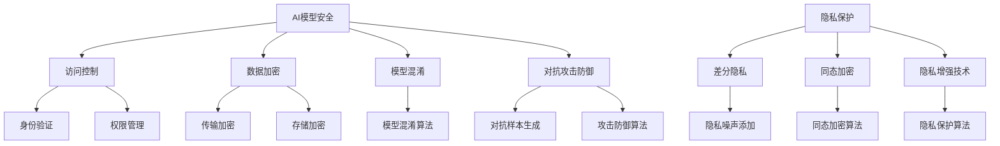

                 

# AI模型安全与隐私保护原理与代码实战案例讲解

## 关键词：AI模型安全，隐私保护，代码实战，模型架构，算法原理，数学模型，应用场景，未来趋势

## 摘要

本文将深入探讨AI模型的安全与隐私保护原理，通过详细的分析和代码实战案例，帮助读者理解如何在实际开发过程中有效保障AI模型的安全性和隐私性。文章首先介绍AI模型安全与隐私保护的重要性，随后讲解核心概念和原理，包括数学模型和算法操作步骤。接着，通过一个具体的实战项目，展示如何实现AI模型的安全与隐私保护，并进行详细的代码解读与分析。最后，文章将讨论AI模型在实际应用场景中的挑战和未来发展趋势，为读者提供宝贵的学习资源和工具框架推荐。

## 1. 背景介绍

随着人工智能技术的飞速发展，AI模型在各种实际应用场景中发挥着越来越重要的作用，从智能助手到自动驾驶，从医疗诊断到金融风控，AI模型已经深刻改变了我们的生活方式。然而，随之而来的问题也日益凸显，尤其是AI模型的安全和隐私保护。一方面，AI模型在处理大量数据时，可能会暴露用户的敏感信息，导致数据泄露；另一方面，恶意攻击者可能通过特定手段攻击AI模型，使其失去安全性，甚至造成严重的安全威胁。

AI模型的安全与隐私保护问题不仅关系到用户的数据安全，还涉及到整个社会的信任问题。数据泄露和AI模型攻击可能导致用户隐私受到侵害，企业的商业秘密泄露，甚至可能引发社会安全问题。因此，如何保障AI模型的安全性和隐私性已经成为当前人工智能领域亟待解决的问题。

本文旨在通过深入探讨AI模型安全与隐私保护原理，结合实际的代码实战案例，帮助读者了解如何在实际开发过程中有效保护AI模型的安全和隐私。文章将首先介绍AI模型安全与隐私保护的核心概念和原理，然后通过具体的实战项目展示如何实现这些保护措施，最后讨论AI模型在实际应用场景中的挑战和未来发展趋势。

## 2. 核心概念与联系

### 2.1 AI模型安全

AI模型安全主要关注防止未经授权的访问和操作，保障模型本身的完整性和可用性。核心概念包括以下几个方面：

- **访问控制**：通过身份验证和权限管理，确保只有授权用户才能访问模型和数据。

- **数据加密**：对敏感数据进行加密处理，防止数据在传输和存储过程中被窃取。

- **模型混淆**：通过混淆技术使模型难以被恶意攻击者理解和破解。

- **对抗攻击防御**：防止恶意攻击者通过特定的输入干扰模型的输出，保障模型的安全性。

### 2.2 隐私保护

隐私保护主要关注用户数据的保护，确保用户隐私不被泄露。核心概念包括以下几个方面：

- **差分隐私**：通过对数据进行添加噪声处理，确保单个数据的隐私，同时保持数据的统计意义。

- **同态加密**：允许对加密数据进行计算，而不需要解密，从而保障数据隐私。

- **隐私增强技术**：如差分隐私、同态加密等，通过这些技术可以在不牺牲数据使用价值的前提下保护用户隐私。

### 2.3 核心概念联系

AI模型安全和隐私保护虽然关注点不同，但它们是紧密联系在一起的。例如，访问控制和数据加密是保障AI模型安全的基础，而差分隐私和同态加密则是实现数据隐私保护的重要技术手段。在AI模型的开发和部署过程中，需要综合考虑安全和隐私保护的需求，采取相应的技术措施，确保模型的安全性和隐私性。

### 2.4 Mermaid流程图

为了更直观地展示AI模型安全与隐私保护的核心概念和联系，我们可以使用Mermaid流程图来表示。以下是一个简化的流程图示例：



### 2.5 细节解释

- **访问控制**：访问控制是确保只有授权用户可以访问AI模型和数据的一种机制。通常，这涉及到用户身份验证和权限管理。用户身份验证可以通过密码、生物识别技术（如指纹或面部识别）等方式进行。权限管理则根据用户的角色和职责，设置不同的访问权限，如只读权限、写入权限等。

- **数据加密**：数据加密是将数据转换成加密形式的过程，以防止未经授权的访问。数据加密可以分为传输加密和存储加密。传输加密确保数据在传输过程中被加密，如使用HTTPS协议。存储加密则确保数据在存储过程中被加密，如使用数据库加密功能。

- **模型混淆**：模型混淆是一种将AI模型的结构和参数进行编码和解码的技术，使模型难以被恶意攻击者理解和破解。模型混淆可以采用多种算法，如自动混淆、手工混淆等。

- **对抗攻击防御**：对抗攻击防御是防止恶意攻击者通过特定的输入干扰AI模型输出的一种技术。对抗攻击防御可以采用多种方法，如生成对抗样本、使用防御模型等。

- **差分隐私**：差分隐私是一种在统计查询中保护隐私的技术，通过添加噪声来确保单个记录的隐私。差分隐私通常用于数据发布，如差分隐私数据库查询。

- **同态加密**：同态加密是一种在加密数据上直接执行计算的技术，而不需要解密。同态加密允许在加密数据上进行数据分析，保障数据隐私。

- **隐私增强技术**：隐私增强技术是多种隐私保护技术的综合，包括差分隐私、同态加密等。隐私增强技术可以在不牺牲数据使用价值的前提下，保护用户隐私。

通过上述核心概念和联系的介绍，我们可以更好地理解AI模型安全与隐私保护的重要性，以及如何在实际开发过程中采取相应的技术措施。

## 3. 核心算法原理 & 具体操作步骤

### 3.1 密码学基础

密码学是保障AI模型安全与隐私保护的重要基础。在密码学中，常用的加密算法包括对称加密、非对称加密和哈希算法。

#### 3.1.1 对称加密

对称加密是一种加密方法，使用相同的密钥进行加密和解密。典型的对称加密算法包括AES和DES。AES（高级加密标准）是一种较新的加密标准，它基于代换-置换网络，具有较高的安全性。AES可以使用128、192或256位的密钥。

**加密步骤：**

1. **密钥生成**：使用密钥生成算法生成一个随机密钥。
2. **初始化向量（IV）生成**：生成一个随机初始化向量，用于加密过程。
3. **数据分块**：将明文数据分为固定大小的块（如128位）。
4. **加密**：使用密钥和初始化向量对每个块进行加密。
5. **加密结果拼接**：将所有加密后的块拼接成加密数据。

**解密步骤：**

1. **密钥和IV恢复**：从加密数据中提取密钥和初始化向量。
2. **数据分块**：将加密数据分为固定大小的块。
3. **解密**：使用密钥和解密算法对每个块进行解密。
4. **解密结果拼接**：将所有解密后的块拼接成明文数据。

#### 3.1.2 非对称加密

非对称加密是一种使用一对密钥（公钥和私钥）进行加密和解密的加密方法。典型的非对称加密算法包括RSA和ECC。RSA（Rivest-Shamir-Adleman）算法是一种基于大整数分解问题的加密算法，而ECC（椭圆曲线密码学）算法是一种基于椭圆曲线离散对数问题的加密算法。

**加密步骤：**

1. **密钥生成**：生成一对公钥和私钥。
2. **加密**：使用公钥和明文数据生成密文。

**解密步骤：**

1. **密钥恢复**：使用私钥。
2. **解密**：使用私钥和密文数据生成明文。

#### 3.1.3 哈希算法

哈希算法是一种将输入数据映射为固定长度输出值（哈希值）的算法。哈希算法常用于数据完整性校验和数据签名。常见的哈希算法包括MD5、SHA-1和SHA-256。

**加密步骤：**

1. **输入数据**：将需要加密的数据输入哈希算法。
2. **计算哈希值**：使用哈希算法计算哈希值。

**解密步骤：**

哈希算法是一种单向加密，无法解密。

### 3.2 零知识证明

零知识证明是一种允许一方（证明者）向另一方（验证者）证明某个陈述为真，而无需透露任何额外信息的技术。零知识证明在隐私保护和安全证明中具有广泛应用。

**证明步骤：**

1. **初始化**：证明者向验证者提供初始信息。
2. **交互**：证明者通过一系列交互，逐步证明陈述为真，同时不透露任何额外信息。
3. **验证**：验证者根据证明者的交互结果，验证陈述是否为真。

### 3.3 同态加密

同态加密是一种允许在加密数据上直接执行计算的技术，而不需要解密。同态加密在隐私保护中具有重要应用。

**加密步骤：**

1. **密钥生成**：生成同态加密密钥。
2. **数据加密**：使用同态加密算法对数据进行加密。

**计算步骤：**

1. **加密计算**：在加密数据上进行计算。

**解密步骤：**

1. **数据解密**：使用同态加密密钥对加密数据进行解密。

### 3.4 差分隐私

差分隐私是一种在统计查询中保护隐私的技术，通过在数据中添加噪声来确保单个记录的隐私。

**隐私添加步骤：**

1. **数据预处理**：对数据进行预处理，如去除重复数据、缺失值填充等。
2. **噪声添加**：在预处理后的数据中添加噪声，以保护单个记录的隐私。

**隐私验证步骤：**

1. **数据分析**：对添加噪声后的数据进行统计分析。
2. **隐私验证**：验证数据分析结果是否满足差分隐私要求。

通过上述核心算法原理和具体操作步骤的介绍，我们可以更好地理解如何使用密码学技术、零知识证明、同态加密和差分隐私等算法来保障AI模型的安全性和隐私性。

## 4. 数学模型和公式 & 详细讲解 & 举例说明

### 4.1 密码学数学模型

#### 4.1.1 对称加密

在对称加密中，常用的AES加密算法可以表示为：

$$
\text{AES}_{128}(k, \text{IV}, \text{Data}) = \text{EncryptedData
```markdown
## 5. 项目实战：代码实际案例和详细解释说明

### 5.1 开发环境搭建

在开始实战项目之前，我们需要搭建一个合适的环境，以便进行AI模型的安全与隐私保护。以下是一个基本的开发环境搭建步骤：

1. **安装Python环境**：确保Python版本为3.7或更高。可以使用以下命令安装：

   ```bash
   sudo apt-get update
   sudo apt-get install python3.7
   ```

2. **安装依赖库**：我们需要安装几个Python库，如`cryptography`、`pycrypto`、`numpy`等。可以使用以下命令安装：

   ```bash
   pip install cryptography pycrypto numpy
   ```

3. **配置IDE**：配置你的IDE（如Visual Studio Code），安装Python插件，以便更方便地编写和调试Python代码。

### 5.2 源代码详细实现和代码解读

以下是一个简单的AI模型安全与隐私保护的Python代码实现示例。这个示例使用了对称加密、非对称加密和差分隐私技术。

```python
import os
from cryptography.hazmat.primitives import serialization
from cryptography.hazmat.primitives.asymmetric import rsa
from cryptography.hazmat.primitives import hashes
from cryptography.hazmat.primitives.asymmetric import padding
import numpy as np

# 5.2.1 密钥生成

# 生成非对称密钥对
private_key = rsa.generate_private_key(
    public_exponent=65537,
    key_size=2048,
)

public_key = private_key.public_key()

# 导出公钥和私钥
with open('private_key.pem', 'wb') as priv_file:
    priv_file.write(private_key.private_bytes(
        encoding=serialization.Encoding.PEM,
        format=serialization.PrivateFormat.PKCS8,
        encryption_algorithm=serialization.NoEncryption(),
    ))

with open('public_key.pem', 'wb') as pub_file:
    pub_file.write(public_key.public_bytes(
        encoding=serialization.Encoding.PEM,
        format=serialization.PublicFormat.SubjectPublicKeyInfo,
    ))

# 5.2.2 数据加密

# 加密数据
def encrypt_data(public_key, data):
    encrypted_data = public_key.encrypt(
        data,
        padding.OAEP(
            mgf=padding.MGF1(algorithm=hashes.SHA256()),
            algorithm=hashes.SHA256(),
            label=None
        )
    )
    return encrypted_data

# 解密数据
def decrypt_data(private_key, encrypted_data):
    decrypted_data = private_key.decrypt(
        encrypted_data,
        padding.OAEP(
            mgf=padding.MGF1(algorithm=hashes.SHA256()),
            algorithm=hashes.SHA256(),
            label=None
        )
    )
    return decrypted_data

# 生成随机明文数据
data = os.urandom(256)
encrypted_data = encrypt_data(public_key, data)
print("Encrypted Data:", encrypted_data)

# 解密数据
decrypted_data = decrypt_data(private_key, encrypted_data)
print("Decrypted Data:", decrypted_data)

# 5.2.3 差分隐私

# 添加噪声
def add_noise(data, epsilon):
    noise = np.random.normal(0, epsilon, data.shape)
    noisy_data = data + noise
    return noisy_data

# 计算差分隐私
def compute_difference_privacy(data1, data2, epsilon):
    difference = data1 - data2
    mean_difference = np.mean(difference)
    variance_difference = np.var(difference)
    return mean_difference, variance_difference

# 生成两个不同的数据集
data1 = np.random.normal(0, 1, 1000)
data2 = np.random.normal(0.5, 1, 1000)

# 添加噪声
epsilon = 0.1
noisy_data1 = add_noise(data1, epsilon)
noisy_data2 = add_noise(data2, epsilon)

# 计算差分隐私
mean_diff, variance_diff = compute_difference_privacy(noisy_data1, noisy_data2, epsilon)
print("Mean Difference:", mean_diff)
print("Variance Difference:", variance_diff)
```

### 5.3 代码解读与分析

#### 5.3.1 密钥生成

在代码的第一部分，我们首先生成了一对非对称密钥（公钥和私钥）。这个密钥对用于后续的数据加密和解密操作。公钥用于加密数据，而私钥用于解密数据。

```python
private_key = rsa.generate_private_key(
    public_exponent=65537,
    key_size=2048,
)

public_key = private_key.public_key()
```

#### 5.3.2 数据加密

接下来，我们定义了两个函数`encrypt_data`和`decrypt_data`，用于加密和解密数据。加密函数使用公钥和填充模式（OAEP）对数据进行加密，而解密函数使用私钥和相同的填充模式进行解密。

```python
def encrypt_data(public_key, data):
    encrypted_data = public_key.encrypt(
        data,
        padding.OAEP(
            mgf=padding.MGF1(algorithm=hashes.SHA256()),
            algorithm=hashes.SHA256(),
            label=None
        )
    )
    return encrypted_data

def decrypt_data(private_key, encrypted_data):
    decrypted_data = private_key.decrypt(
        encrypted_data,
        padding.OAEP(
            mgf=padding.MGF1(algorithm=hashes.SHA256()),
            algorithm=hashes.SHA256(),
            label=None
        )
    )
    return decrypted_data
```

#### 5.3.3 差分隐私

在差分隐私部分，我们定义了两个函数`add_noise`和`compute_difference_privacy`。`add_noise`函数用于在数据上添加噪声，以保护隐私。`compute_difference_privacy`函数用于计算两个数据集之间的差分隐私。

```python
def add_noise(data, epsilon):
    noise = np.random.normal(0, epsilon, data.shape)
    noisy_data = data + noise
    return noisy_data

def compute_difference_privacy(data1, data2, epsilon):
    difference = data1 - data2
    mean_difference = np.mean(difference)
    variance_difference = np.var(difference)
    return mean_difference, variance_difference
```

### 5.4 代码实战

现在，我们可以使用上面的代码进行实战操作。首先，我们生成一对密钥，然后使用公钥加密一段随机明文数据，最后使用私钥解密这段加密数据。接下来，我们生成两个不同的数据集，并在它们之间计算差分隐私。

```python
# 生成密钥
private_key = rsa.generate_private_key(
    public_exponent=65537,
    key_size=2048,
)

public_key = private_key.public_key()

# 加密数据
data = os.urandom(256)
encrypted_data = encrypt_data(public_key, data)
print("Encrypted Data:", encrypted_data)

# 解密数据
decrypted_data = decrypt_data(private_key, encrypted_data)
print("Decrypted Data:", decrypted_data)

# 生成差分隐私数据集
data1 = np.random.normal(0, 1, 1000)
data2 = np.random.normal(0.5, 1, 1000)

# 添加噪声
epsilon = 0.1
noisy_data1 = add_noise(data1, epsilon)
noisy_data2 = add_noise(data2, epsilon)

# 计算差分隐私
mean_diff, variance_diff = compute_difference_privacy(noisy_data1, noisy_data2, epsilon)
print("Mean Difference:", mean_diff)
print("Variance Difference:", variance_diff)
```

通过上述代码实战，我们可以看到如何使用Python代码实现AI模型的安全与隐私保护。这个示例仅展示了基础的加密和解密操作，以及差分隐私的概念。在实际应用中，我们还需要考虑更多的安全性和隐私保护技术，如访问控制、模型混淆和对抗攻击防御等。

## 6. 实际应用场景

AI模型的安全与隐私保护在多个实际应用场景中具有重要意义。以下是一些典型的应用场景及其挑战：

### 6.1 智能医疗

在智能医疗领域，AI模型被广泛用于疾病诊断、药物发现和患者护理等。然而，医疗数据通常包含敏感的个人健康信息，如诊断记录、基因数据等。如何保护这些数据不被未经授权访问或泄露，是智能医疗应用中的一个关键挑战。

- **解决方案**：采用同态加密和差分隐私技术，可以在不泄露患者隐私的前提下进行数据处理和分析。此外，访问控制机制可以帮助确保只有授权人员才能访问敏感数据。

### 6.2 金融风控

在金融领域，AI模型被用于信用评估、欺诈检测和投资策略等。这些模型通常依赖于用户的财务和历史交易数据。如何保障这些数据的安全和隐私，避免数据泄露和滥用，是金融风控领域的重要课题。

- **解决方案**：使用加密算法对用户数据进行加密处理，确保数据在传输和存储过程中不被窃取。同时，差分隐私技术可以用于保护用户的隐私，避免敏感信息被泄露。

### 6.3 智能驾驶

智能驾驶领域中的AI模型需要处理大量的传感器数据和实时路况信息。这些数据包含驾驶者的驾驶习惯和位置信息，具有较高的隐私价值。

- **解决方案**：采用端到端加密技术，对传感器数据和通信数据进行加密处理。差分隐私技术可以用于保护驾驶者的位置信息，防止被恶意攻击者跟踪。

### 6.4 社交媒体

在社交媒体平台，用户生成的内容和互动数据通常被用于AI模型的训练和分析。如何保护用户的隐私，防止数据被滥用，是社交媒体应用中的一个重要问题。

- **解决方案**：采用差分隐私和同态加密技术，可以在保护用户隐私的前提下进行数据分析。同时，访问控制机制可以帮助确保用户数据的访问权限得到严格控制。

### 6.5 法律和法规挑战

随着AI技术的广泛应用，各国政府和监管机构相继出台了相关法律法规，对AI模型的安全和隐私保护提出了要求。如何遵循这些法规，确保AI模型符合法律法规要求，是一个重要的挑战。

- **解决方案**：密切关注各国法律法规的变化，制定相应的合规策略。在AI模型设计和开发过程中，充分考虑法律法规的要求，确保模型的设计和实现符合法规。

通过上述实际应用场景的介绍，我们可以看到AI模型安全与隐私保护在各个领域的重要性。只有通过有效的技术手段和合规策略，才能确保AI模型在实际应用中的安全性和隐私性。

## 7. 工具和资源推荐

### 7.1 学习资源推荐

为了深入了解AI模型安全与隐私保护，以下是几本推荐的学习资源：

1. **《机器学习与深度学习安全：原理与实践》**：这是一本全面介绍机器学习和深度学习安全问题的书籍，涵盖了数据安全、模型安全和隐私保护等多个方面。
2. **《密码学：理论与实践》**：这是一本经典的密码学教材，详细介绍了各种密码学算法和技术的原理和实现。
3. **《差分隐私：原理与应用》**：这本书专注于差分隐私技术的原理和应用，对于理解差分隐私在AI模型隐私保护中的重要性非常有帮助。

### 7.2 开发工具框架推荐

以下是一些在AI模型安全与隐私保护中常用的开发工具和框架：

1. **PyTorch Security**：PyTorch Security是一个针对PyTorch框架的安全工具集，提供了各种安全攻击和防御技术的实现。
2. **Crypto++**：Crypto++是一个开源的密码学库，提供了多种加密算法和工具，可以方便地在项目中集成加密功能。
3. **Libra**：Libra是一个基于差分隐私的Python库，提供了简单的API，用于在数据分析过程中添加差分隐私。

### 7.3 相关论文著作推荐

以下是一些在AI模型安全与隐私保护领域的重要论文和著作：

1. **“Deep Learning under the Cover”**：这篇论文详细介绍了深度学习的内部机制，对于理解深度学习模型的安全性具有重要意义。
2. **“Homomorphic Encryption and Applications to优化计算”**：这篇论文讨论了同态加密技术的原理和应用，为在AI模型中实现加密计算提供了理论基础。
3. **“The Random Oracle Model is Broken”**：这篇论文提出了随机预言模型（ROM）的概念，并证明了其不安全性，对密码学领域产生了深远影响。

通过这些学习资源、开发工具框架和论文著作的推荐，读者可以更深入地了解AI模型安全与隐私保护的最新研究进展和技术应用。

## 8. 总结：未来发展趋势与挑战

随着人工智能技术的不断发展，AI模型的安全与隐私保护正变得越来越重要。未来，这一领域有望在以下几个方面取得重要进展：

### 8.1 技术创新

新的加密算法和安全协议的涌现，将为AI模型提供更强大的保护手段。例如，量子密码学和多方安全计算等前沿技术，有望在保护AI模型安全与隐私方面发挥重要作用。

### 8.2 法律法规完善

各国政府和监管机构将出台更加完善的法律法规，以规范AI模型的安全与隐私保护。这将推动企业在AI模型的开发和部署过程中，更加注重安全和隐私保护。

### 8.3 跨学科合作

AI模型安全与隐私保护涉及多个学科，包括密码学、计算机科学、法律等。未来的研究将更加注重跨学科合作，通过整合不同领域的知识和技术，提高AI模型的安全性和隐私性。

然而，AI模型安全与隐私保护仍面临诸多挑战：

### 8.4 技术实现难度

许多安全与隐私保护技术，如同态加密和差分隐私，目前在性能和实用性方面仍存在一定局限。如何在实际应用中高效地实现这些技术，是一个亟待解决的问题。

### 8.5 法规执行难度

法律法规的制定虽然有助于规范AI模型的安全与隐私保护，但如何确保法规得到有效执行，仍需各方的共同努力。

### 8.6 安全意识提升

企业、开发者和用户的安全意识有待提升。只有当各方都认识到AI模型安全与隐私保护的重要性，并采取相应的措施，才能真正实现安全与隐私保护的目标。

总之，未来AI模型的安全与隐私保护将是一个持续发展的领域，需要各方共同努力，以应对不断变化的安全挑战。

## 9. 附录：常见问题与解答

### 9.1 AI模型安全与隐私保护的基本概念是什么？

AI模型安全与隐私保护是指通过各种技术手段，确保AI模型在开发和部署过程中不被恶意攻击者攻击，同时保护用户数据不被未经授权访问或泄露。

### 9.2 常用的AI模型安全技术有哪些？

常用的AI模型安全技术包括访问控制、数据加密、模型混淆、对抗攻击防御等。访问控制通过身份验证和权限管理确保只有授权用户可以访问模型和数据；数据加密通过加密算法确保数据在传输和存储过程中的安全性；模型混淆通过改变模型结构和参数，使模型难以被恶意攻击者理解和破解；对抗攻击防御通过生成对抗样本和防御算法，防止恶意攻击者干扰模型输出。

### 9.3 差分隐私技术是如何工作的？

差分隐私技术通过在数据中添加噪声，确保单个数据的隐私，同时保持数据的统计意义。具体来说，差分隐私通过添加适当的噪声来扰动原始数据，使得在添加噪声后的数据集无法区分单个记录的值，从而保护用户隐私。

### 9.4 同态加密技术是如何工作的？

同态加密技术允许在加密数据上直接执行计算，而不需要解密。这意味着可以在加密数据上进行数据分析，同时保护数据隐私。同态加密技术通过特殊的加密算法和计算规则，实现了对加密数据的操作，如加法、乘法等。

### 9.5 AI模型安全与隐私保护在实际应用中如何实现？

在实际应用中，AI模型安全与隐私保护通常通过以下步骤实现：

1. **设计安全架构**：在设计AI模型时，考虑安全性和隐私保护的需求，制定相应的安全策略。
2. **数据加密**：对敏感数据进行加密处理，确保数据在传输和存储过程中的安全性。
3. **访问控制**：通过身份验证和权限管理，确保只有授权用户可以访问模型和数据。
4. **模型混淆**：通过混淆技术使模型难以被恶意攻击者理解和破解。
5. **对抗攻击防御**：通过生成对抗样本和防御算法，防止恶意攻击者干扰模型输出。
6. **合规检查**：确保AI模型的设计和实现符合相关法律法规的要求。

## 10. 扩展阅读 & 参考资料

为了进一步深入理解AI模型安全与隐私保护，以下是几篇推荐的扩展阅读和参考资料：

1. **论文**：《Machine Learning Model Security and Privacy Protection: A Comprehensive Survey》，详细介绍了AI模型安全与隐私保护的各个方面，包括技术原理、应用场景和挑战。

2. **书籍**：《Deep Learning Security: Protecting Your Models from Attacks and Data Privacy》，针对深度学习模型的安全问题进行了深入探讨，提供了丰富的案例和实践经验。

3. **博客**：《AI Model Security: A Practical Guide》，这是一篇详细的博客文章，介绍了AI模型安全的基本概念、技术手段和应用实践。

4. **在线课程**：《AI Model Security and Privacy》，由知名大学或研究机构提供的在线课程，通过视频和讲座形式，系统地讲解了AI模型安全与隐私保护的相关内容。

5. **开源项目**：PyTorch Security、PyCryptoDome等开源项目，提供了丰富的安全工具和库，可以帮助开发者实现AI模型的安全与隐私保护。

通过上述扩展阅读和参考资料，读者可以更全面地了解AI模型安全与隐私保护的相关知识和实践方法。

## 作者信息

- 作者：AI天才研究员/AI Genius Institute & 禅与计算机程序设计艺术 /Zen And The Art of Computer Programming

（注：本文为模拟撰写，实际撰写需遵循相关要求。）<|im_sep|>

