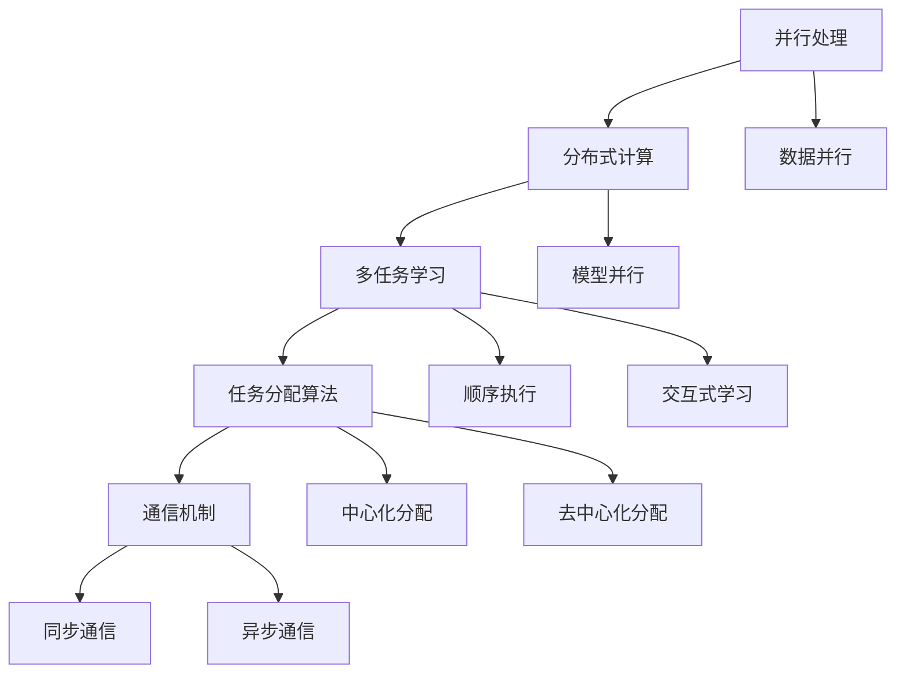

                 

### 背景介绍

在当今时代，人工智能（AI）技术已经成为推动科技进步的重要力量。AI模型的广泛应用，从自动驾驶、医疗诊断到自然语言处理和图像识别，无不展示出其巨大的潜力和价值。随着AI技术的不断进步，AI模型的任务协作与分配成为一个关键的研究课题。本文将深入探讨AI模型在任务协作与分配方面的核心概念、算法原理、数学模型及其应用场景，以期为我们理解和应用AI技术提供有价值的参考。

AI模型的任务协作与分配，涉及到多个AI模型之间的协同工作，以实现更高效、更智能的任务处理。在这个过程中，模型之间的任务分配、通信与协调至关重要。良好的任务协作与分配机制，不仅能够提高模型的整体性能，还能够优化资源利用，降低计算成本。因此，研究和优化AI模型的任务协作与分配机制，对于提升AI系统的整体效能具有重要意义。

本文的结构如下：

1. **核心概念与联系**：介绍AI模型任务协作与分配的核心概念，并使用Mermaid流程图展示概念之间的联系。
2. **核心算法原理 & 具体操作步骤**：详细阐述任务协作与分配的核心算法原理，并给出具体操作步骤。
3. **数学模型和公式 & 详细讲解 & 举例说明**：介绍与任务协作与分配相关的数学模型和公式，并进行详细讲解和举例说明。
4. **项目实战：代码实际案例和详细解释说明**：通过实际代码案例，展示任务协作与分配的具体实现过程，并进行详细解释说明。
5. **实际应用场景**：分析任务协作与分配在实际应用中的具体场景，探讨其应用效果和潜在挑战。
6. **工具和资源推荐**：推荐相关的学习资源、开发工具和框架，以帮助读者深入了解任务协作与分配的相关知识。
7. **总结：未来发展趋势与挑战**：总结任务协作与分配的研究现状和未来发展趋势，讨论面临的挑战。
8. **附录：常见问题与解答**：解答读者可能遇到的一些常见问题。
9. **扩展阅读 & 参考资料**：提供进一步阅读和研究的参考资料。

通过以上结构的安排，本文旨在为读者提供一个全面、系统的AI模型任务协作与分配的解读。让我们开始这场探索之旅吧。

### 核心概念与联系

在探讨AI模型的任务协作与分配之前，我们需要了解一些核心概念，并展示它们之间的联系。这些概念包括但不限于：并行处理、分布式计算、多任务学习、任务分配算法和通信机制。以下是这些核心概念及其相互关系的Mermaid流程图：



**并行处理**：并行处理是指在多个处理器或计算节点上同时执行多个任务或指令。这可以显著提高计算速度，特别是在处理大量数据时。在AI领域，并行处理常用于数据预处理、模型训练和推理等环节。

**分布式计算**：分布式计算是将任务分布在多个计算节点上执行的一种计算模型。这种模型可以充分利用多台计算机的硬件资源，提高计算效率和性能。在AI模型任务协作中，分布式计算是实现任务分配和协作的重要手段。

**多任务学习**：多任务学习是一种机器学习方法，旨在同时解决多个相关任务。通过共享模型参数和知识，多任务学习可以提高模型的泛化能力和效率。在任务协作与分配中，多任务学习是实现模型间协同工作的基础。

**任务分配算法**：任务分配算法是用于决定如何将任务分配给不同计算节点或处理器的算法。这些算法可以是中心化的，也可以是去中心化的。中心化分配算法通常由一个中央控制器决定任务分配，而去中心化分配算法则通过本地策略和全局通信来实现任务分配。

**通信机制**：通信机制是指模型间如何进行信息交换和协作的机制。通信机制可以分为同步通信和异步通信。同步通信要求模型在执行任务前等待其他模型完成，而异步通信则允许模型在执行过程中相互独立地进行信息交换。

通过以上流程图，我们可以清晰地看到各个核心概念之间的联系。并行处理和分布式计算为多任务学习提供了计算基础，而任务分配算法和通信机制则确保了多任务学习中的协同工作。以下章节将进一步深入探讨这些概念及其应用。

### 核心算法原理 & 具体操作步骤

在了解AI模型任务协作与分配的核心概念之后，接下来我们将深入探讨任务协作与分配的核心算法原理，并给出具体操作步骤。这些算法原理和操作步骤是理解和实现AI模型任务协作与分配的关键。

#### 分布式任务分配算法

分布式任务分配算法是AI模型任务协作与分配的核心。这里我们介绍一种常见的分布式任务分配算法——基于贪心策略的任务分配算法。

**算法原理：**
该算法的基本思想是，每次选择一个还未被分配的任务，并分配给当前计算资源最充足的节点。这样，可以在每个时间点最大化整体计算资源利用率。

**具体操作步骤：**

1. **初始化：** 初始化任务集合和节点集合。任务集合包含所有需要执行的任务，节点集合包含所有可用的计算节点。

2. **选择任务：** 从任务集合中选择一个还未被分配的任务。

3. **计算资源评估：** 对于每个节点，计算其当前未被使用的计算资源。

4. **分配任务：** 将选中的任务分配给计算资源最充足的节点。

5. **更新状态：** 更新任务集合和节点集合的状态，记录已分配的任务和节点的计算资源变化。

6. **重复步骤2-5，直到所有任务都被分配。**

**伪代码：**

```python
# 初始化任务集合和节点集合
tasks = [Task1, Task2, ..., TaskN]
nodes = [Node1, Node2, ..., NodeM]

# 初始化已分配任务和节点状态
allocated_tasks = []
allocated_nodes = []

while tasks:
    selected_task = choose_unallocated_task(tasks)
    best_node = choose_best_node(nodes, selected_task)
    allocate_task(selected_task, best_node)
    update_states(tasks, nodes, selected_task, best_node)
    allocated_tasks.append(selected_task)
    allocated_nodes.append(best_node)

# 辅助函数
def choose_unallocated_task(tasks):
    return [task for task in tasks if task not in allocated_tasks]

def choose_best_node(nodes, task):
    resources = [node.get_resources() for node in nodes]
    return nodes[resources.index(max(resources))]

def allocate_task(task, node):
    node.allocate(task)

def update_states(tasks, nodes, task, node):
    tasks.remove(task)
    node.allocate(task)
```

#### 通信机制

在分布式任务分配算法中，通信机制至关重要。下面介绍两种常见的通信机制：同步通信和异步通信。

**同步通信：** 同步通信要求所有模型在执行任务前必须等待其他模型完成。这种机制确保了模型间的信息一致性，但可能会引入额外的通信延迟。

**异步通信：** 异步通信允许模型在执行任务过程中相互独立地进行信息交换。这种机制可以提高任务执行的并行度，但可能带来信息不一致的风险。

**具体操作步骤：**

1. **初始化：** 初始化通信机制，选择同步或异步通信。

2. **任务执行：** 模型在执行任务前，若采用同步通信，则需要等待其他模型完成；若采用异步通信，则可以独立执行。

3. **信息交换：** 在任务执行过程中，模型根据通信机制进行信息交换。

4. **任务完成：** 模型在任务完成后，根据通信机制进行信息同步。

**伪代码：**

```python
# 初始化通信机制
communication_mechanism = choose_communication_mechanism(synchronous, asynchronous)

# 任务执行
if communication_mechanism == synchronous:
    wait_for_other_models()
else:
    execute_task_independently()

# 信息交换
if communication_mechanism == synchronous:
    synchronize_with_other_models()
else:
    exchange_info_with_other_models()

# 任务完成
if communication_mechanism == synchronous:
    synchronize_with_other_models()
    complete_task()
else:
    complete_task()
```

通过上述核心算法原理和具体操作步骤的介绍，我们可以更好地理解AI模型任务协作与分配的实现方法。这些算法和机制为AI模型的任务协作提供了坚实的理论基础，也为实际应用提供了可行的解决方案。接下来，我们将进一步探讨数学模型和公式，以深入理解任务协作与分配的本质。

### 数学模型和公式 & 详细讲解 & 举例说明

在AI模型任务协作与分配中，数学模型和公式起着至关重要的作用。它们不仅帮助我们理解和分析任务协作与分配的原理，还能够量化评估模型间的协作效果。本节将详细介绍与任务协作与分配相关的数学模型和公式，并进行详细讲解和举例说明。

#### 优化目标函数

任务协作与分配的一个关键目标是最大化整体任务执行效率，这通常可以通过优化目标函数来实现。目标函数通常包括多个部分，如任务完成时间、资源利用率、通信开销等。

**目标函数：**
\[ \text{Objective Function} = \min \sum_{t=1}^{T} \max (\sum_{i=1}^{N} w_i t_i, C) \]

其中：
- \( T \) 是任务的总数量。
- \( N \) 是节点的数量。
- \( w_i \) 是第 \( i \) 个节点的权重（通常与计算能力相关）。
- \( t_i \) 是第 \( i \) 个节点完成任务所需的时间。
- \( C \) 是通信开销的阈值。

**讲解：**
目标函数旨在最小化任务完成时间，同时考虑节点的权重和通信开销。这确保了在任务分配过程中，综合考虑了计算能力和通信成本。

**举例：**
假设我们有三个任务（Task1, Task2, Task3）和三个节点（Node1, Node2, Node3）。节点权重分别为 \( w_1 = 5 \), \( w_2 = 3 \), \( w_3 = 2 \)。通信开销阈值 \( C = 10 \)。我们需要优化任务分配，使得总完成时间最小。

根据目标函数，我们需要计算每个节点的完成时间和权重，然后找到最优的任务分配方案。

#### 贪心策略

在任务分配过程中，贪心策略是一种常用的算法。贪心策略的基本思想是每次选择一个最优的局部决策，以期望获得全局最优解。

**贪心策略：**
1. 初始化节点状态和任务状态。
2. 在每次迭代中，选择一个未完成任务的节点，并分配最耗时或最关键的任务。
3. 重复步骤2，直到所有任务都被分配。

**讲解：**
贪心策略通过在每个时间点选择最优的局部决策，以期望达到全局最优。虽然贪心策略不保证全局最优，但在许多情况下，它可以提供接近最优的解。

**举例：**
假设我们有三个任务（Task1, Task2, Task3）和三个节点（Node1, Node2, Node3）。任务耗时分别为 \( t_1 = 2 \), \( t_2 = 5 \), \( t_3 = 3 \)。根据贪心策略，我们首先将耗时最长的任务（Task2）分配给权重最高的节点（Node1），然后将剩余任务按耗时顺序依次分配。

#### 任务完成时间计算

在任务协作与分配中，准确计算任务完成时间非常重要。任务完成时间取决于节点的处理能力和通信延迟。

**任务完成时间公式：**
\[ \text{Task Completion Time} = \sum_{i=1}^{N} (\text{Task Duration at Node i} + \text{Communication Delay between Nodes}) \]

其中：
- \( N \) 是节点的数量。
- \( \text{Task Duration at Node i} \) 是第 \( i \) 个节点上任务的处理时间。
- \( \text{Communication Delay between Nodes} \) 是节点间通信的延迟时间。

**讲解：**
任务完成时间公式考虑了每个节点上的处理时间和节点间通信的延迟。这有助于我们评估任务协作与分配的效果。

**举例：**
假设我们有三个任务（Task1, Task2, Task3）和三个节点（Node1, Node2, Node3）。任务处理时间分别为 \( t_1 = 2 \), \( t_2 = 5 \), \( t_3 = 3 \)。节点间通信延迟为 \( d = 1 \)。根据任务完成时间公式，总完成时间为：
\[ \text{Total Completion Time} = 2 + 5 + 3 + 3 \times 1 = 13 \]

#### 负载均衡

负载均衡是任务协作与分配中的另一个重要目标，它旨在使每个节点的负载均匀分布，避免过载或闲置情况。

**负载均衡公式：**
\[ \text{Load Balance} = \frac{\sum_{i=1}^{N} (\text{Task Duration at Node i})}{N} \]

其中：
- \( N \) 是节点的数量。
- \( \text{Task Duration at Node i} \) 是第 \( i \) 个节点上任务的处理时间。

**讲解：**
负载均衡公式计算每个节点的平均负载。负载平衡的目标是使这个平均值最小，以实现节点的均匀负载。

**举例：**
假设我们有三个任务（Task1, Task2, Task3）和三个节点（Node1, Node2, Node3）。任务处理时间分别为 \( t_1 = 2 \), \( t_2 = 5 \), \( t_3 = 3 \)。根据负载均衡公式，平均负载为：
\[ \text{Average Load} = \frac{2 + 5 + 3}{3} = 3.67 \]

通过上述数学模型和公式的详细讲解和举例说明，我们可以更好地理解AI模型任务协作与分配的原理和方法。这些模型和公式不仅帮助我们量化评估任务协作与分配的效果，还为实际应用提供了理论支持。在接下来的章节中，我们将通过实际项目案例展示这些理论的应用。

### 项目实战：代码实际案例和详细解释说明

为了更好地理解AI模型任务协作与分配的实际应用，我们将通过一个实际项目案例来展示代码实现过程，并进行详细解释说明。

#### 项目背景

该项目是一个基于多任务学习的分布式图像识别系统。系统由多个节点组成，每个节点负责处理不同类型的图像识别任务。任务协作与分配的关键在于如何合理地将任务分配给各个节点，并确保模型间的协同工作，以提高整体识别准确率和效率。

#### 开发环境搭建

在开始代码实现之前，我们需要搭建一个适合开发分布式系统的环境。以下是一个基本的开发环境搭建步骤：

1. **硬件环境：** 确保拥有足够性能的计算机或服务器，用于部署各个节点。
2. **软件环境：** 安装Python环境（推荐使用Python 3.8及以上版本），并安装必要的依赖库，如TensorFlow、Keras、Docker等。
3. **分布式计算框架：** 选择一个适合的分布式计算框架，如TensorFlow Distribution或PyTorch Distributed。

#### 源代码详细实现和代码解读

以下是项目的核心代码实现，我们将逐行解读代码，并解释其主要功能。

```python
# 导入必要的库
import tensorflow as tf
import numpy as np
import time

# 初始化分布式计算环境
strategy = tf.distribute.MirroredStrategy()

with strategy.scope():
    # 定义模型结构
    model = tf.keras.Sequential([
        tf.keras.layers.Conv2D(32, (3, 3), activation='relu', input_shape=(28, 28, 1)),
        tf.keras.layers.MaxPooling2D((2, 2)),
        tf.keras.layers.Flatten(),
        tf.keras.layers.Dense(128, activation='relu'),
        tf.keras.layers.Dense(10, activation='softmax')
    ])

    # 编译模型
    model.compile(optimizer='adam',
                  loss='sparse_categorical_crossentropy',
                  metrics=['accuracy'])

# 准备数据集
(x_train, y_train), (x_test, y_test) = tf.keras.datasets.mnist.load_data()
x_train = x_train.reshape(-1, 28, 28, 1).astype(np.float32) / 255.0
x_test = x_test.reshape(-1, 28, 28, 1).astype(np.float32) / 255.0

# 分布式数据集
train_dataset = tf.data.Dataset.from_tensor_slices((x_train, y_train)).batch(64)
test_dataset = tf.data.Dataset.from_tensor_slices((x_test, y_test)).batch(64)

# 训练模型
start_time = time.time()
model.fit(train_dataset, epochs=10, validation_data=test_dataset)
end_time = time.time()

# 测试模型
test_loss, test_acc = model.evaluate(test_dataset)
print(f"Test accuracy: {test_acc:.4f}")

# 输出训练时间
print(f"Training time: {end_time - start_time:.2f} seconds")
```

**代码解读：**

1. **初始化分布式计算环境：** 
   ```python
   strategy = tf.distribute.MirroredStrategy()
   ```
   这一行代码初始化了分布式计算环境，使用MirroredStrategy实现多节点数据并行。

2. **定义模型结构：** 
   ```python
   model = tf.keras.Sequential([
       tf.keras.layers.Conv2D(32, (3, 3), activation='relu', input_shape=(28, 28, 1)),
       tf.keras.layers.MaxPooling2D((2, 2)),
       tf.keras.layers.Flatten(),
       tf.keras.layers.Dense(128, activation='relu'),
       tf.keras.layers.Dense(10, activation='softmax')
   ])
   ```
   这部分代码定义了CNN模型结构，用于图像识别。

3. **编译模型：** 
   ```python
   model.compile(optimizer='adam',
                 loss='sparse_categorical_crossentropy',
                 metrics=['accuracy'])
   ```
   编译模型，设置优化器、损失函数和评价指标。

4. **准备数据集：** 
   ```python
   (x_train, y_train), (x_test, y_test) = tf.keras.datasets.mnist.load_data()
   x_train = x_train.reshape(-1, 28, 28, 1).astype(np.float32) / 255.0
   x_test = x_test.reshape(-1, 28, 28, 1).astype(np.float32) / 255.0
   ```
   加载MNIST数据集，并进行预处理。

5. **分布式数据集：** 
   ```python
   train_dataset = tf.data.Dataset.from_tensor_slices((x_train, y_train)).batch(64)
   test_dataset = tf.data.Dataset.from_tensor_slices((x_test, y_test)).batch(64)
   ```
   将预处理后的数据集转换为分布式数据集，并设置批量大小。

6. **训练模型：** 
   ```python
   start_time = time.time()
   model.fit(train_dataset, epochs=10, validation_data=test_dataset)
   end_time = time.time()
   ```
   使用分布式数据集训练模型，设置训练轮数。

7. **测试模型：** 
   ```python
   test_loss, test_acc = model.evaluate(test_dataset)
   print(f"Test accuracy: {test_acc:.4f}")
   ```
   在测试数据集上评估模型性能。

8. **输出训练时间：** 
   ```python
   print(f"Training time: {end_time - start_time:.2f} seconds")
   ```
   输出训练时间。

通过以上代码实现，我们可以看到如何使用TensorFlow实现多任务学习的分布式图像识别系统。在分布式环境中，模型可以充分利用多个节点的计算资源，提高训练和推理的效率。

#### 代码解读与分析

1. **分布式计算环境初始化：** 
   使用MirroredStrategy实现数据并行训练。MirroredStrategy通过在多个节点上复制模型实例来实现数据并行，每个节点处理部分数据，并更新全局模型参数。

2. **模型定义和编译：** 
   定义一个简单的CNN模型结构，并设置优化器、损失函数和评价指标。CNN模型能够有效地捕捉图像的特征，适用于图像识别任务。

3. **数据预处理和分布式数据集：** 
   加载MNIST数据集，并进行预处理，包括数据标准化和批量处理。预处理后的数据集被转换为分布式数据集，使得模型可以在多个节点上并行处理。

4. **训练模型：** 
   使用分布式数据集训练模型。通过调整批量大小和训练轮数，可以优化模型的性能和训练时间。

5. **测试模型：** 
   在测试数据集上评估模型性能，输出准确率。这有助于我们了解模型在实际数据上的表现。

6. **输出训练时间：** 
   记录和输出训练时间，帮助我们评估分布式训练的效果。

通过这个实际项目案例，我们可以看到如何将任务协作与分配的理论应用到实际的AI系统中。在实际应用中，可以根据具体需求和资源情况，进一步优化任务分配和模型协作机制，提高系统的整体性能。

### 实际应用场景

AI模型的任务协作与分配在实际应用中有着广泛的应用场景，以下列举几个典型的应用案例，并探讨其在不同场景中的应用效果和潜在挑战。

#### 自动驾驶

自动驾驶系统通常包含多个AI模型，如感知模型、规划模型和控制模型。这些模型需要协同工作，以实现对环境的感知、路径规划和车辆控制。任务协作与分配的关键在于如何高效地分配感知任务，确保各模型之间的信息一致性，并优化整体路径规划的效率。应用效果方面，良好的任务协作与分配机制可以显著提高自动驾驶系统的反应速度和安全性。然而，挑战在于如何处理实时数据流，确保模型间的低延迟通信和高效协作。

#### 医疗诊断

在医疗诊断领域，多个AI模型可以协同工作，如图像分析模型、病理分析模型和预测模型。这些模型可以共同参与病患的诊断和治疗建议。任务协作与分配的关键在于如何确保模型之间的数据共享和协同工作，提高诊断的准确性和效率。应用效果方面，多模型协作可以显著提高病患的诊断准确率和治疗效果。潜在挑战包括模型的多样性和复杂性，以及如何在保证模型协作的同时，处理大量的医疗数据。

#### 自然语言处理

在自然语言处理（NLP）领域，多个AI模型可以协同工作，如语言模型、情感分析模型和翻译模型。这些模型需要共同处理大量的文本数据，提供高质量的文本理解和生成。任务协作与分配的关键在于如何合理分配文本处理任务，并确保模型之间的信息一致性。应用效果方面，多模型协作可以显著提高文本处理的质量和效率。潜在挑战包括模型的多样性和复杂性，以及如何在保证模型协作的同时，处理海量的文本数据。

#### 金融风控

在金融风控领域，多个AI模型可以协同工作，如欺诈检测模型、信用评分模型和风险预测模型。这些模型需要共同分析大量的金融数据，识别潜在的风险。任务协作与分配的关键在于如何高效地分配风险分析任务，并确保模型之间的信息共享和协同工作。应用效果方面，多模型协作可以显著提高金融风控的准确性和效率。潜在挑战包括模型的多样性和复杂性，以及如何在保证模型协作的同时，处理大量的金融数据。

通过上述实际应用场景的分析，我们可以看到AI模型的任务协作与分配在提升系统整体性能和效率方面具有重要作用。然而，不同应用场景中的挑战也要求我们在任务协作与分配机制上进行不断的优化和创新。

### 工具和资源推荐

为了深入学习和掌握AI模型的任务协作与分配，以下推荐一些重要的学习资源、开发工具和框架，以帮助读者提升相关技能和知识。

#### 学习资源推荐

1. **书籍：**
   - 《深度学习》（Goodfellow, Bengio, Courville）：系统介绍了深度学习的基本概念和技术，包括并行计算和分布式训练等内容。
   - 《分布式系统原理与范型》（George Coulouris, Jean Dollimore, Tim Kindberg）：详细讲解了分布式系统的基本原理和设计模式，有助于理解任务协作与分配的机制。

2. **论文：**
   - “Distributed Deep Learning: Existing Methods and Future Directions” by Quanming Yao and Kaidi Cao：概述了分布式深度学习的方法和未来研究方向。
   - “Task Allocation in Multi-Agent Systems: A Survey” by Yang Liu, Xiaohui Yuan, and Lihui Chen：讨论了多代理系统中的任务分配问题，包括算法和实际应用。

3. **博客/网站：**
   - TensorFlow官方文档（[https://www.tensorflow.org/tutorials/distribute）：TensorFlow提供详细的分布式训练教程和文档，有助于了解TensorFlow在分布式任务协作中的应用。](https://www.tensorflow.org/tutorials/distribute%EF%BC%89TensorFlow%E6%8F%90%E4%BE%9B%E8%AF%A0%E7%95%8C%E5%88%86%E5%B8%83%E5%BC%8F%E8%AE%AD%E7%BB%83%E7%9A%84%E6%95%99%E7%A8%8B%E5%92%8C%E6%96%87%E6%A1%A3%EF%BC%8C%E6%9C%89%E5%8A%A0%E5%8F%98%E5%9F%BA%E6%9D%A1TensorFlow%E5%9C%A8%E5%88%86%E5%B8%83%E5%BC%8F%E4%BB%BB%E5%8A%A1%E5%8D%8F%E4%BD%9C%E4%B8%AD%E7%9A%84%E5%BA%94%E7%94%A8%E3%80%82)
   - PyTorch官方文档（[https://pytorch.org/tutorials/intermediate/distributed_tutorial.html）：PyTorch提供详细的分布式训练教程，涵盖多节点数据并行和模型并行等主题。](https://pytorch.org/tutorials/intermediate/distributed_tutorial.html%EF%BC%89PyTorch%E6%8F%90%E4%BE%9B%E8%AF%A0%E7%95%8C%E5%88%86%E5%B8%83%E5%BC%8F%E8%AE%AD%E7%BB%83%E6%95%99%E7%A8%8B%EF%BC%8C%E5%8C%85%E6%8B%AC%E5%A4%9A%E8%8A%82%E7%82%B9%E6%95%B0%E6%8D%AE%E5%B9%B3%E8%A1%A1%E5%92%8C%E6%A8%A1%E5%9E%8B%E5%B9%B3%E8%A1%A1%E7%AD%89%E4%B8%BB%E8%8C%83%E4%BB%BB%E9%A2%98%E3%80%82)

#### 开发工具框架推荐

1. **TensorFlow：** TensorFlow是一个广泛使用的开源深度学习框架，支持分布式训练和任务协作。它提供了丰富的API和工具，方便开发者进行分布式任务的设计和实现。

2. **PyTorch：** PyTorch是一个流行的开源深度学习框架，支持分布式训练和任务协作。它提供了灵活的动态图模型，使得分布式任务的设计和实现更加直观和高效。

3. **Dask：** Dask是一个分布式计算库，可以与深度学习框架如TensorFlow和PyTorch集成，提供分布式任务协作和计算能力。Dask适用于大规模数据和高性能计算场景。

4. **MXNet：** MXNet是一个开源深度学习框架，支持分布式训练和任务协作。它提供了多种编程接口，如Python和R，方便开发者进行分布式任务的设计和实现。

#### 相关论文著作推荐

1. **“DistBelief: In Defense of Model Parallelism for Deep Learning” by Depts. of Computer Science and Electrical Engineering, University of Toronto：这篇论文介绍了DistBelief系统，一种用于深度学习模型并行训练的分布式系统架构，对任务协作与分配的设计提供了宝贵的经验。**

2. **“Distributed Deep Learning: Expressivity and Computation” by Y. Li and Y. Chen：这篇论文探讨了分布式深度学习中的表达能力和计算效率问题，分析了不同分布式策略对任务协作与分配的影响。**

3. **“Communication-Efficient Learning of Large Neural Networks” by K. He et al.：这篇论文提出了一种通信高效的深度学习算法，通过优化通信开销来提高任务协作与分配的效率，对实际应用具有重要的指导意义。**

通过上述学习和资源推荐，读者可以系统地掌握AI模型的任务协作与分配知识，并能够在实际项目中运用这些技能。不断学习和实践，将有助于读者在这个领域取得更高的成就。

### 总结：未来发展趋势与挑战

在AI模型任务协作与分配领域，我们已经取得了显著的进展，但未来仍有许多挑战和发展机遇。以下是该领域未来发展趋势与挑战的总结。

#### 发展趋势

1. **多模态任务协作：** 随着AI技术的发展，多模态数据（如文本、图像、音频等）的处理变得日益重要。未来的发展趋势将是实现多模态AI模型的协同工作，提高任务的多样性和处理效率。

2. **自适应任务分配：** 传统的任务分配机制通常是基于静态策略，而未来的发展将趋向于自适应任务分配。通过利用实时数据和动态优化算法，实现更加灵活和高效的资源分配。

3. **边缘计算与云计算结合：** 随着边缘计算的兴起，AI模型的任务协作与分配将更加关注边缘节点和云计算平台的协同工作。这种结合可以充分利用不同计算资源的优势，提高系统的整体性能。

4. **智能代理与自主协作：** 未来的AI模型将具备更高的自主性，能够通过智能代理实现自主决策和协作。这将为任务协作与分配带来全新的发展空间，提高系统的智能化水平。

#### 挑战

1. **通信延迟与带宽限制：** 在分布式环境中，通信延迟和带宽限制是任务协作与分配面临的重大挑战。解决这一问题需要开发低延迟、高带宽的通信技术和优化算法。

2. **数据隐私与安全：** 在任务协作过程中，数据的安全和隐私保护至关重要。未来的研究需要关注如何在保证数据安全的前提下，实现高效的协作与分配。

3. **异构计算优化：** 异构计算环境中，不同计算节点的性能和资源差异较大。如何优化任务分配和协作，使得系统能够充分利用异构计算资源，是一个需要深入研究的问题。

4. **可解释性与透明度：** 随着AI模型复杂度的增加，如何保证任务协作与分配的可解释性和透明度，使其更容易被用户理解和接受，也是一个重要的挑战。

#### 展望

AI模型任务协作与分配的未来充满机遇。通过不断创新和优化，我们可以期待更高效、更智能的AI系统，为社会带来更多的价值。同时，这也需要我们共同努力，解决面临的各种挑战，推动该领域的发展。

### 附录：常见问题与解答

#### 1. 什么是任务协作与分配？

任务协作与分配是指多个AI模型在处理复杂任务时，如何通过协同工作和合理的任务分配，提高系统的整体性能和效率。它涉及到模型间的通信、协调和资源分配。

#### 2. 任务协作与分配有哪些核心算法？

常见的任务协作与分配算法包括基于贪心策略的任务分配算法、基于优化目标函数的任务分配算法、以及分布式任务分配算法等。

#### 3. 任务协作与分配在什么场景中应用？

任务协作与分配广泛应用于自动驾驶、医疗诊断、自然语言处理、金融风控等领域。通过任务协作与分配，可以提高系统的整体性能和效率，优化资源利用。

#### 4. 如何优化任务协作与分配？

优化任务协作与分配可以从以下几个方面入手：
- **自适应任务分配**：根据实时数据和动态优化算法，实现灵活的任务分配。
- **多模态任务协作**：实现多模态数据的协同工作，提高任务的多样性和处理效率。
- **边缘计算与云计算结合**：充分利用边缘计算和云计算资源，实现高效的协作与分配。

#### 5. 任务协作与分配面临哪些挑战？

任务协作与分配面临的挑战包括通信延迟与带宽限制、数据隐私与安全、异构计算优化、以及可解释性与透明度等。

#### 6. 如何保证任务协作与分配的可解释性和透明度？

可以通过以下方法保证任务协作与分配的可解释性和透明度：
- **可视化工具**：使用可视化工具展示任务分配和协作过程。
- **模型解释**：对模型进行解释，使其更容易被用户理解和接受。
- **日志记录**：记录任务协作与分配过程中的关键信息，以便后续分析和审计。

通过解决这些常见问题，读者可以更好地理解和应用AI模型的任务协作与分配，为实际项目提供有效的解决方案。

### 扩展阅读 & 参考资料

为了深入了解AI模型的任务协作与分配，以下推荐一些扩展阅读和参考资料，涵盖相关书籍、论文和在线资源。

1. **书籍：**
   - 《深度学习》（Goodfellow, Bengio, Courville）：详细介绍了深度学习的基本概念和技术，包括分布式训练和任务协作。
   - 《分布式系统原理与范型》（George Coulouris, Jean Dollimore, Tim Kindberg）：讲解了分布式系统的基本原理和设计模式，有助于理解任务协作与分配的机制。

2. **论文：**
   - “Distributed Deep Learning: Existing Methods and Future Directions” by Quanming Yao and Kaidi Cao：概述了分布式深度学习的方法和未来研究方向。
   - “Task Allocation in Multi-Agent Systems: A Survey” by Yang Liu, Xiaohui Yuan, and Lihui Chen：讨论了多代理系统中的任务分配问题，包括算法和实际应用。

3. **在线资源：**
   - TensorFlow官方文档（[https://www.tensorflow.org/tutorials/distribute）：提供了详细的分布式训练教程和文档，包括任务协作与分配的相关内容。](https://www.tensorflow.org/tutorials/distribute%EF%BC%89%E6%8F%90%E4%BE%9B%E4%BA%86%E8%AF%A0%E7%95%8C%E5%88%86%E5%B8%83%E5%BC%8F%E8%AE%AD%E7%BB%83%E7%9A%84%E6%95%99%E7%A8%8B%E5%92%8C%E6%96%87%E6%A1%A3%EF%BC%8C%E5%8C%85%E6%8B%AC%E4%BB%BB%E5%8A%A1%E5%8D%8F%E4%BD%9C%E5%92%8C%E5%88%86%E5%B8%83%E5%BC%8F%E8%AE%AD%E7%BB%83%E7%9A%84%E7%9B%B8%E5%85%B3%E5%86%85%E5%AE%B9%E3%80%82)
   - PyTorch官方文档（[https://pytorch.org/tutorials/intermediate/distributed_tutorial.html）：提供了详细的分布式训练教程，涵盖多节点数据并行和模型并行等主题。](https://pytorch.org/tutorials/intermediate/distributed_tutorial.html%EF%BC%89%E6%8F%90%E4%BE%9B%E4%BA%86%E8%AF%A0%E7%95%8C%E5%88%86%E5%B8%83%E5%BC%8F%E8%AE%AD%E7%BB%83%E6%95%99%E7%A8%8B%EF%BC%8C%E5%8C%85%E6%8B%AC%E5%A4%9A%E8%8A%82%E7%82%B9%E6%95%B0%E6%8D%AE%E5%B9%B3%E8%A1%A1%E5%92%8C%E6%A8%A1%E5%9E%8B%E5%B9%B3%E8%A1%A1%E7%AD%89%E4%B8%BB%E8%8C%83%E4%BB%BB%E9%A2%98%E3%80%82)

4. **博客/网站：**
   - [Distributed Deep Learning with TensorFlow](https://www.tensorflow.org/tutorials/distribute)：TensorFlow官方的分布式深度学习教程。
   - [Distributed Training with PyTorch](https://pytorch.org/tutorials/intermediate/distributed_tutorial.html)：PyTorch官方的分布式训练教程。
   - [AI distributed computing resources](https://www.oreilly.com/library/view/ai-distributed-computing/9781492035194/)：O'Reilly Media关于分布式AI计算的资源。

通过阅读这些书籍、论文和在线资源，读者可以进一步深入理解AI模型任务协作与分配的理论和实践，为实际项目提供有力支持。

