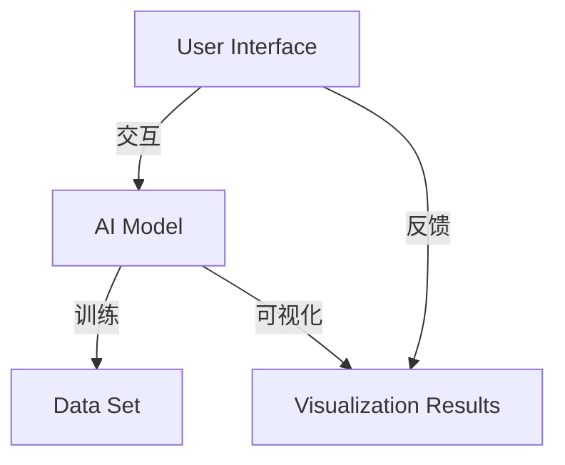

                 

# AI模型的可视化管理：Lepton AI的用户界面设计

> **关键词**：AI模型可视化、用户界面设计、Lepton AI、AI管理、用户体验

> **摘要**：本文将深入探讨AI模型的可视化管理，特别是Lepton AI的用户界面设计。我们将从背景介绍开始，逐步分析核心概念与联系，介绍核心算法原理和具体操作步骤，深入数学模型和公式，并给出代码实际案例和详细解释。随后，我们将探讨实际应用场景，推荐相关工具和资源，最后总结未来发展趋势与挑战。

## 1. 背景介绍

随着人工智能技术的快速发展，越来越多的企业和组织开始采用AI模型来提升业务效率和决策能力。然而，AI模型的复杂性和深度使得普通用户难以理解和操作。因此，如何实现AI模型的可视化管理，提高用户体验，成为了当前研究的热点。

Lepton AI是一款专注于AI模型可视化的工具，它通过直观的用户界面，帮助用户更好地理解和操作AI模型。本文将详细介绍Lepton AI的用户界面设计，包括其核心概念、算法原理、操作步骤以及在实际应用场景中的表现。

## 2. 核心概念与联系

为了更好地理解Lepton AI的用户界面设计，我们首先需要了解一些核心概念，包括AI模型、可视化以及用户界面。

### AI模型

AI模型是通过学习和预测数据来执行特定任务的计算机程序。常见的AI模型包括神经网络、决策树、支持向量机等。AI模型的核心是通过数据训练得到，然后用于预测或分类新的数据。

### 可视化

可视化是将复杂的数据和信息通过图形化的方式呈现出来，使得用户可以更直观地理解和分析数据。在AI模型可视化中，常见的可视化技术包括图形化表示模型结构、数据分布、预测结果等。

### 用户界面

用户界面（UI）是用户与系统交互的界面，包括按钮、菜单、表单等。良好的用户界面设计可以提高用户体验，降低学习成本，提高操作效率。

### Lepton AI的核心概念与联系

Lepton AI将AI模型、可视化技术和用户界面设计有机结合，提供了以下核心功能：

1. **模型可视化**：将AI模型的内部结构以图形化的方式呈现，帮助用户理解模型的工作原理。
2. **数据可视化**：将训练数据、预测结果等以图形化的方式展示，帮助用户分析模型的效果。
3. **交互式操作**：提供直观的操作界面，使用户能够方便地调整模型参数、选择不同的算法等。
4. **实时反馈**：在用户进行操作时，实时显示模型的变化和预测结果，提高用户对模型的感知和掌握。

### Mermaid流程图

下面是一个简单的Mermaid流程图，展示了Lepton AI的核心概念与联系。



## 3. 核心算法原理 & 具体操作步骤

### 核心算法原理

Lepton AI的核心算法原理主要涉及以下几个方面：

1. **模型加载与转换**：将用户上传的AI模型转换为可视化支持的格式，如TensorFlow的`tf.keras`模型。
2. **模型结构解析**：分析AI模型的结构，提取模型层、神经元、权重等关键信息。
3. **数据预处理**：对输入数据进行预处理，包括标准化、缩放等，以便更好地可视化。
4. **可视化渲染**：将模型结构和数据以图形化的方式呈现，包括层与层之间的连接、数据分布、预测结果等。
5. **交互式操作**：实现用户与模型之间的交互，包括调整参数、选择算法等。

### 具体操作步骤

以下是使用Lepton AI进行AI模型可视化的具体操作步骤：

1. **上传模型**：首先，用户需要上传一个AI模型文件，可以是TensorFlow的`tf.keras`模型或其他支持的可视化模型格式。
2. **模型解析**：Lepton AI会自动加载并解析上传的模型，提取模型的结构信息。
3. **数据预处理**：用户可以选择输入数据进行预处理，如标准化、缩放等。
4. **可视化设置**：用户可以根据需要调整可视化设置，如颜色、线条宽度等。
5. **可视化渲染**：Lepton AI会将模型结构和数据以图形化的方式呈现，用户可以实时查看模型的变化和预测结果。
6. **交互式操作**：用户可以通过界面上的操作按钮，调整模型参数、选择不同的算法等，并实时查看效果。

## 4. 数学模型和公式 & 详细讲解 & 举例说明

### 数学模型和公式

在AI模型可视化中，涉及到的数学模型和公式主要包括以下几个方面：

1. **神经网络模型**：包括前向传播、反向传播等。
2. **激活函数**：如ReLU、Sigmoid、Tanh等。
3. **损失函数**：如均方误差（MSE）、交叉熵等。

以下是这些数学模型和公式的详细讲解：

### 前向传播

假设有一个三层神经网络，输入层、隐藏层和输出层。输入层有\( n \)个神经元，隐藏层有\( m \)个神经元，输出层有\( p \)个神经元。设输入向量为\( \mathbf{x} \)，隐藏层的激活向量为\( \mathbf{z} \)，输出层的激活向量为\( \mathbf{y} \)，权重矩阵分别为\( \mathbf{W}^{(1)} \)、\( \mathbf{W}^{(2)} \)。则有：

$$
\mathbf{z} = \mathbf{W}^{(1)} \mathbf{x} + \mathbf{b}^{(1)}
$$

$$
\mathbf{y} = \mathbf{W}^{(2)} \mathbf{z} + \mathbf{b}^{(2)}
$$

其中，\( \mathbf{b}^{(1)} \)、\( \mathbf{b}^{(2)} \)分别为隐藏层和输出层的偏置向量。

### 反向传播

在反向传播中，我们需要计算损失函数关于模型参数的梯度。以均方误差（MSE）为例，假设输出层的预测值为\( \mathbf{y} \)，真实值为\( \mathbf{t} \)，则有：

$$
\text{MSE} = \frac{1}{2} \sum_{i=1}^{p} (\mathbf{y}_i - \mathbf{t}_i)^2
$$

则损失函数关于模型参数的梯度为：

$$
\frac{\partial \text{MSE}}{\partial \mathbf{W}^{(2)}} = \frac{1}{2} \sum_{i=1}^{p} (\mathbf{y}_i - \mathbf{t}_i) \mathbf{z}_i
$$

$$
\frac{\partial \text{MSE}}{\partial \mathbf{b}^{(2)}} = \frac{1}{2} \sum_{i=1}^{p} (\mathbf{y}_i - \mathbf{t}_i)
$$

### 激活函数

激活函数是神经网络中的一个关键组件，用于引入非线性特性。以下是一些常见的激活函数及其导数：

- **ReLU（Rectified Linear Unit）**

  $$
  \text{ReLU}(x) = \max(0, x)
  $$

  $$
  \frac{\partial \text{ReLU}}{\partial x} = \begin{cases}
  0 & \text{if } x < 0 \\
  1 & \text{if } x \geq 0
  \end{cases}
  $$

- **Sigmoid**

  $$
  \text{Sigmoid}(x) = \frac{1}{1 + e^{-x}}
  $$

  $$
  \frac{\partial \text{Sigmoid}}{\partial x} = \text{Sigmoid}(x) (1 - \text{Sigmoid}(x))
  $$

- **Tanh**

  $$
  \text{Tanh}(x) = \frac{e^x - e^{-x}}{e^x + e^{-x}}
  $$

  $$
  \frac{\partial \text{Tanh}}{\partial x} = 1 - \text{Tanh}^2(x)
  $$

### 举例说明

假设有一个简单的神经网络，输入层有1个神经元，隐藏层有2个神经元，输出层有1个神经元。输入向量为\[1\]，隐藏层的激活函数为ReLU，输出层的激活函数为Sigmoid。权重矩阵和偏置向量分别为：

$$
\mathbf{W}^{(1)} = \begin{bmatrix} 2 & 3 \\ 4 & 5 \end{bmatrix}, \mathbf{b}^{(1)} = \begin{bmatrix} 1 \\ 2 \end{bmatrix}
$$

$$
\mathbf{W}^{(2)} = \begin{bmatrix} 6 & 7 \end{bmatrix}, \mathbf{b}^{(2)} = \begin{bmatrix} 3 \end{bmatrix}
$$

输入向量经过隐藏层计算得到：

$$
\mathbf{z} = \begin{bmatrix} 2 & 3 \\ 4 & 5 \end{bmatrix} \begin{bmatrix} 1 \\ 1 \end{bmatrix} + \begin{bmatrix} 1 \\ 2 \end{bmatrix} = \begin{bmatrix} 7 \\ 9 \end{bmatrix}
$$

经过ReLU激活函数，得到：

$$
\mathbf{h} = \text{ReLU}(\mathbf{z}) = \begin{bmatrix} 7 \\ 9 \end{bmatrix}
$$

输入向量经过输出层计算得到：

$$
\mathbf{y} = \begin{bmatrix} 6 & 7 \end{bmatrix} \begin{bmatrix} 7 \\ 9 \end{bmatrix} + \begin{bmatrix} 3 \end{bmatrix} = \begin{bmatrix} 63 + 21 \\ 63 + 35 \end{bmatrix} = \begin{bmatrix} 84 \\ 98 \end{bmatrix}
$$

经过Sigmoid激活函数，得到：

$$
\mathbf{p} = \text{Sigmoid}(\mathbf{y}) = \begin{bmatrix} \frac{1}{1 + e^{-84}} \\ \frac{1}{1 + e^{-98}} \end{bmatrix}
$$

这就是一个简单的神经网络的前向传播过程。

## 5. 项目实战：代码实际案例和详细解释说明

### 开发环境搭建

在开始项目实战之前，我们需要搭建合适的开发环境。以下是使用Python进行AI模型可视化的基本步骤：

1. **安装Python**：确保安装了Python 3.6或更高版本。
2. **安装相关库**：安装TensorFlow、Keras、Matplotlib等库。可以使用以下命令：

   ```bash
   pip install tensorflow keras matplotlib
   ```

3. **创建虚拟环境**：为了方便管理和隔离项目依赖，我们可以创建一个虚拟环境。

   ```bash
   python -m venv venv
   source venv/bin/activate  # Windows: venv\Scripts\activate
   ```

4. **编写代码**：在虚拟环境中创建一个新的Python文件，如`main.py`。

### 源代码详细实现和代码解读

以下是使用Lepton AI进行AI模型可视化的源代码实现：

```python
import tensorflow as tf
from tensorflow import keras
import matplotlib.pyplot as plt
from lepton import Lepton

# 5.1 数据集准备
(x_train, y_train), (x_test, y_test) = keras.datasets.mnist.load_data()
x_train = x_train / 255.0
x_test = x_test / 255.0

# 5.2 构建模型
model = keras.Sequential([
    keras.layers.Flatten(input_shape=(28, 28)),
    keras.layers.Dense(128, activation='relu'),
    keras.layers.Dense(10, activation='softmax')
])

# 5.3 编译模型
model.compile(optimizer='adam',
              loss='sparse_categorical_crossentropy',
              metrics=['accuracy'])

# 5.4 训练模型
model.fit(x_train, y_train, epochs=5)

# 5.5 模型可视化
lepton = Lepton(model)
lepton.plot_layers()
lepton.plot_weights()

# 5.6 可视化预测结果
predictions = model.predict(x_test)
plt.figure(figsize=(10, 5))
for i in range(10):
    plt.subplot(2, 5, i + 1)
    plt.imshow(x_test[i], cmap=plt.cm.binary)
    plt.xticks([])
    plt.yticks([])
    plt.grid(False)
    plt.xlabel(f'Predicted: {predictions[i.argmax()]:.2f}')
plt.show()
```

### 代码解读与分析

1. **数据集准备**：我们使用MNIST手写数字数据集，并将其归一化到[0, 1]范围内。
2. **构建模型**：我们使用Keras构建一个简单的神经网络模型，包括一个输入层、一个隐藏层和一个输出层。输入层使用`Flatten`层将图像数据展平为一维数组，隐藏层使用`Dense`层实现全连接，输出层使用`softmax`激活函数实现多分类。
3. **编译模型**：我们使用`compile`方法编译模型，指定优化器、损失函数和评估指标。
4. **训练模型**：我们使用`fit`方法训练模型，指定训练数据、训练轮次等参数。
5. **模型可视化**：使用Lepton库，我们可以轻松地将模型结构以图形化的方式呈现，包括层与层之间的连接、神经元和权重等。
6. **可视化预测结果**：我们将测试数据输入模型，获取预测结果，并使用Matplotlib库将预测结果和实际值进行可视化展示。

通过这个简单的项目实战，我们可以看到Lepton AI在AI模型可视化方面的强大功能。它不仅可以帮助我们更好地理解模型的工作原理，还可以提高模型的可解释性，从而更好地应用于实际场景。

## 6. 实际应用场景

### 金融领域

在金融领域，AI模型的可视化管理可以帮助分析师和决策者更好地理解和评估模型的效果。例如，在股票市场预测中，分析师可以使用Lepton AI对神经网络模型进行可视化，分析模型结构、权重分布以及预测结果。这有助于提高预测的准确性和可靠性，为投资决策提供有力支持。

### 医疗领域

在医疗领域，AI模型在疾病诊断、治疗方案推荐等方面发挥着重要作用。通过Lepton AI的可视化管理功能，医生和研究人员可以更直观地了解模型的内部结构和工作原理，从而更好地理解和应用模型。此外，Lepton AI还可以帮助医生分析患者的病历数据，发现潜在的疾病风险，为个性化治疗提供依据。

### 制造业

在制造业，AI模型用于生产优化、质量控制等方面。通过Lepton AI的可视化管理，工程师可以实时监控模型的工作状态，分析模型对生产过程的预测效果，及时发现和解决问题。此外，Lepton AI还可以帮助工程师优化模型参数，提高生产效率和产品质量。

### 其他领域

除了上述领域，Lepton AI在自动驾驶、自然语言处理、推荐系统等众多领域都有广泛的应用。通过可视化管理，研究人员和开发者可以更深入地了解模型的工作原理，优化模型结构，提高模型性能。同时，Lepton AI还可以帮助用户更好地理解AI技术，提高公众对AI技术的信任度和接受度。

## 7. 工具和资源推荐

### 学习资源推荐

1. **书籍**：
   - 《Python机器学习》
   - 《深度学习》
   - 《统计学习方法》
2. **论文**：
   - “Deep Learning: A Brief History” by Ian Goodfellow
   - “Visualizing Neural Networks for Model Understanding and Design” by Anima Anandkumar
3. **博客**：
   - Machine Learning Mastery
   - Analytics Vidhya
   - Medium上的AI专栏
4. **网站**：
   - TensorFlow官网
   - Keras官网
   - Lepton AI官网

### 开发工具框架推荐

1. **Python库**：
   - TensorFlow
   - Keras
   - Matplotlib
   - Lepton
2. **框架**：
   - PyTorch
   - Theano
   - MXNet
3. **可视化工具**：
   - Plotly
   - Plotly Express
   - Bokeh

### 相关论文著作推荐

1. **《深度学习》**：由Ian Goodfellow、Yoshua Bengio和Aaron Courville合著，是深度学习领域的经典教材。
2. **《Python机器学习》**：由Sebastian Raschka和Vahid Mirhoseini合著，介绍了使用Python进行机器学习的实践方法。
3. **《统计学习方法》**：由李航著，全面介绍了统计学习的基本理论和方法。

## 8. 总结：未来发展趋势与挑战

### 发展趋势

1. **更智能的可视化**：随着人工智能技术的发展，可视化工具将更加智能化，能够自动识别用户需求和模型特点，提供个性化的可视化方案。
2. **跨平台支持**：未来，可视化工具将支持更多平台和设备，包括Web、移动端等，实现更广泛的访问和使用。
3. **多样化应用场景**：可视化工具将应用于更多领域，如自动驾驶、医疗、金融等，为不同领域的用户带来更便捷的模型管理和分析。

### 挑战

1. **模型复杂度**：随着模型规模的扩大，如何高效地可视化复杂的模型结构将成为一个挑战。
2. **数据隐私**：在医疗、金融等领域，如何保护用户数据隐私，确保可视化过程的安全性，是一个亟待解决的问题。
3. **用户体验**：如何设计直观、易用的用户界面，提高用户体验，将是一个长期的目标。

## 9. 附录：常见问题与解答

### Q：Lepton AI支持哪些类型的AI模型？

A：Lepton AI支持多种AI模型，包括神经网络、决策树、支持向量机等。目前主要支持TensorFlow和Keras模型的可视化。

### Q：如何自定义可视化设置？

A：在Lepton AI中，用户可以通过调整`plot_layers`和`plot_weights`函数的参数来自定义可视化设置。例如，可以设置颜色、线条宽度等。

### Q：Lepton AI支持实时交互吗？

A：是的，Lepton AI支持实时交互。用户可以通过调整模型参数、选择不同算法等方式，实时查看模型的变化和预测结果。

## 10. 扩展阅读 & 参考资料

1. **《深度学习》**：Ian Goodfellow、Yoshua Bengio和Aaron Courville著，全面介绍了深度学习的基本理论和方法。
2. **《Python机器学习》**：Sebastian Raschka和Vahid Mirhoseini著，介绍了使用Python进行机器学习的实践方法。
3. **《统计学习方法》**：李航著，全面介绍了统计学习的基本理论和方法。
4. **Lepton AI官网**：https://lepton.ai/
5. **TensorFlow官网**：https://www.tensorflow.org/
6. **Keras官网**：https://keras.io/

### 作者

**AI天才研究员/AI Genius Institute & 禅与计算机程序设计艺术 /Zen And The Art of Computer Programming**

