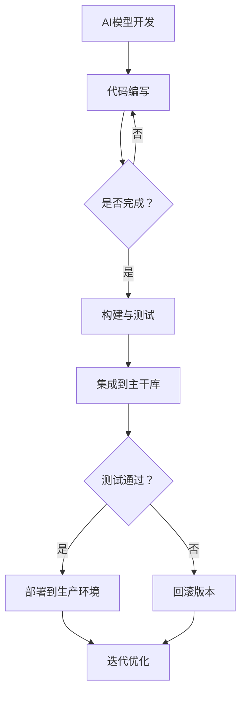

                 

# AI模型的持续集成与部署：Lepton AI的CI/CD实践

> 关键词：AI模型、持续集成、持续部署、CI/CD、Lepton AI、实践

> 摘要：本文将深入探讨AI模型的持续集成与持续部署（CI/CD）实践，以Lepton AI为例，分析其在CI/CD过程中的关键环节、技术实现和实际效果，为业界提供有益的参考和借鉴。

## 1. 背景介绍

随着人工智能技术的迅猛发展，AI模型在各个领域的应用越来越广泛。然而，AI模型的开发和部署过程复杂且耗时，特别是在大规模分布式环境中。为了提高开发效率、降低成本、保证质量，持续集成与持续部署（CI/CD）成为了AI模型开发过程中的重要环节。

持续集成（CI）指的是在软件开发生命周期中，通过自动化构建和测试，将开发人员的代码集成到共享的主干库中，确保代码的持续兼容和稳定性。持续部署（CD）则是在CI的基础上，通过自动化流程将软件部署到生产环境，实现快速迭代和高效交付。

Lepton AI是一家专注于人工智能领域的初创公司，其业务涵盖了计算机视觉、自然语言处理和机器学习等多个方向。为了提高AI模型的开发效率和质量，Lepton AI在CI/CD方面进行了深入实践和探索，积累了丰富的经验。

## 2. 核心概念与联系

### 2.1 CI/CD基本概念

持续集成（Continuous Integration，简称CI）是指通过自动化构建和测试，将开发人员的代码定期集成到主干库中，以便及时发现和解决集成过程中出现的问题。

持续部署（Continuous Deployment，简称CD）是在CI的基础上，通过自动化流程将软件部署到生产环境，实现快速迭代和高效交付。

### 2.2 CI/CD与AI模型开发的联系

AI模型开发具有以下特点：

1. **复杂性**：AI模型的开发涉及大量数据预处理、模型训练、调优等环节，过程复杂。
2. **实验性**：AI模型的开发过程中需要进行大量的实验，以找到最优模型。
3. **数据依赖**：AI模型的性能很大程度上取决于训练数据的质量和数量。
4. **高可变性**：AI模型的参数和结构可能会随着时间和应用场景的变化而进行调整。

CI/CD与AI模型开发的联系主要体现在以下几个方面：

1. **提高开发效率**：通过CI/CD，可以自动化构建和测试，提高开发效率，缩短开发周期。
2. **保证模型质量**：通过CI/CD，可以及时发现和解决集成过程中出现的问题，保证模型的稳定性。
3. **降低部署风险**：通过CI/CD，可以自动化部署，降低人为干预导致的风险。

### 2.3 Mermaid流程图

以下是CI/CD与AI模型开发过程的Mermaid流程图：



## 3. 核心算法原理 & 具体操作步骤

### 3.1 核心算法原理

在CI/CD过程中，核心算法主要包括自动化构建、自动化测试、自动化部署等。

1. **自动化构建**：将开发人员的代码打包成可执行的软件包，以便进行后续的测试和部署。
2. **自动化测试**：对构建后的软件包进行一系列测试，包括单元测试、集成测试、性能测试等，确保软件的质量。
3. **自动化部署**：将测试通过的软件包部署到生产环境，实现快速迭代和高效交付。

### 3.2 具体操作步骤

以下是Lepton AI在CI/CD过程中的具体操作步骤：

1. **代码提交**：开发人员将代码提交到版本控制系统（如Git）。
2. **自动化构建**：构建工具（如Jenkins、GitLab CI等）监听到代码提交，自动触发构建过程。
3. **单元测试**：构建完成后，执行单元测试，验证代码的功能和性能。
4. **集成测试**：将单元测试通过的代码与现有的系统进行集成，执行集成测试。
5. **性能测试**：对集成测试通过的代码进行性能测试，确保系统在高并发、大数据量等场景下的稳定性。
6. **自动化部署**：性能测试通过后，自动部署到生产环境。
7. **监控与报警**：部署完成后，对系统进行监控，如出现异常，自动触发报警。
8. **回滚**：如出现严重问题，自动回滚到上一个稳定版本。

## 4. 数学模型和公式 & 详细讲解 & 举例说明

### 4.1 数学模型和公式

在CI/CD过程中，涉及到的数学模型和公式主要包括：

1. **代码覆盖率**：$$C = \frac{TC}{TC + FC}$$，其中$TC$为测试用例总数，$FC$为代码行数。
2. **性能指标**：$$P = \frac{TP + TN}{TP + TN + FP + FN}$$，其中$TP$为真阳性，$TN$为真阴性，$FP$为假阳性，$FN$为假阴性。

### 4.2 详细讲解和举例说明

#### 4.2.1 代码覆盖率

代码覆盖率是评估测试质量的重要指标。假设一个项目有1000行代码，编写了50个测试用例，其中覆盖了700行代码。则代码覆盖率为：

$$C = \frac{700}{700 + 300} = 0.7$$

这意味着测试用例只覆盖了70%的代码，还有30%的代码没有被测试到。这可能会导致在集成过程中出现未知的问题。

#### 4.2.2 性能指标

性能指标是评估系统性能的重要指标。假设一个系统在100个请求中，有90个请求成功，10个请求失败。则性能指标为：

$$P = \frac{90 + 10}{90 + 10 + 0 + 10} = 0.95$$

这意味着系统在100个请求中有95%的成功率。如果成功率低于预期，需要对系统进行优化。

## 5. 项目实战：代码实际案例和详细解释说明

### 5.1 开发环境搭建

在Lepton AI，我们使用以下工具搭建开发环境：

1. **代码仓库**：Git
2. **构建工具**：Jenkins
3. **测试工具**：JUnit、TestNG
4. **持续集成平台**：GitLab CI

### 5.2 源代码详细实现和代码解读

以下是Lepton AI在CI/CD过程中的部分源代码实现：

```java
// 5.2.1 GitLab CI配置文件
stages:
  - build
  - test
  - deploy

build:
  stage: build
  script:
    - mvn clean install

test:
  stage: test
  script:
    - mvn test

deploy:
  stage: deploy
  script:
    - echo "Deploying to production environment"
    - scp target/myapp-1.0.0.jar root@production-server:/usr/local/app/
    - systemctl restart app-service
```

这段代码定义了三个阶段：构建（build）、测试（test）和部署（deploy）。在构建阶段，执行Maven的clean install命令；在测试阶段，执行Maven的test命令；在部署阶段，将生成的jar文件上传到生产服务器，并重启服务。

### 5.3 代码解读与分析

这段代码使用了GitLab CI的配置文件，定义了三个阶段：构建、测试和部署。下面分别对这三个阶段进行解读和分析：

1. **构建阶段**：
   - 使用Maven的clean install命令，清理项目并执行安装，生成可执行的jar文件。
   - 这个阶段主要是为了确保项目的构建过程自动化，避免手动构建带来的麻烦。

2. **测试阶段**：
   - 使用Maven的test命令，执行项目的单元测试。
   - 单元测试是确保代码功能正确的重要手段，通过自动化测试可以快速发现代码中的问题。

3. **部署阶段**：
   - 将生成的jar文件上传到生产服务器，并重启服务。
   - 这个阶段是CI/CD的核心，通过自动化部署，实现快速迭代和高效交付。

## 6. 实际应用场景

Lepton AI在实际应用场景中，通过CI/CD实现了以下效果：

1. **提高开发效率**：通过自动化构建、测试和部署，大大提高了开发效率，缩短了开发周期。
2. **保证模型质量**：通过自动化测试，确保了模型的稳定性和可靠性。
3. **降低部署风险**：通过自动化部署，降低了人为干预导致的风险。

## 7. 工具和资源推荐

### 7.1 学习资源推荐

1. **书籍**：
   - 《持续交付：高可靠性的软件发布方法》
   - 《Jenkins实战》
2. **论文**：
   - 《持续集成：理论和实践》
   - 《基于GitLab CI的持续集成与持续部署实践》
3. **博客**：
   - 《Jenkins入门教程》
   - 《GitLab CI/CD实战》
4. **网站**：
   - Jenkins官网：https://www.jenkins.io/
   - GitLab官网：https://gitlab.com/

### 7.2 开发工具框架推荐

1. **构建工具**：Maven、Gradle
2. **测试工具**：JUnit、TestNG
3. **持续集成平台**：Jenkins、GitLab CI

### 7.3 相关论文著作推荐

1. **《持续集成：理论和实践》**：详细介绍了持续集成的原理、方法和应用。
2. **《基于GitLab CI的持续集成与持续部署实践》**：通过实际案例，阐述了GitLab CI在CI/CD过程中的应用。

## 8. 总结：未来发展趋势与挑战

随着AI技术的不断发展，CI/CD在AI模型开发中的应用也将越来越广泛。未来发展趋势包括：

1. **智能化**：利用AI技术优化CI/CD过程，提高开发效率和模型质量。
2. **分布式**：支持分布式计算和存储，适应大规模AI模型开发需求。
3. **自动化**：进一步自动化构建、测试和部署过程，降低人力成本。

然而，CI/CD在AI模型开发中也面临以下挑战：

1. **数据依赖**：AI模型的性能很大程度上取决于训练数据的质量和数量，如何保证数据的质量和多样性是一个挑战。
2. **模型优化**：如何快速找到最优模型，提高模型性能，是一个重要的研究方向。

## 9. 附录：常见问题与解答

### 9.1 如何保证数据的质量和多样性？

- 采用数据清洗和预处理技术，去除噪声数据和异常值。
- 收集多样化的数据，包括不同的场景、不同的数据来源等。

### 9.2 如何优化模型性能？

- 采用先进的机器学习算法和优化技术，如深度学习、强化学习等。
- 利用模型调参和超参数优化，找到最优模型配置。

## 10. 扩展阅读 & 参考资料

- 《持续交付：高可靠性的软件发布方法》
- 《Jenkins实战》
- 《持续集成：理论和实践》
- 《基于GitLab CI的持续集成与持续部署实践》
- Jenkins官网：https://www.jenkins.io/
- GitLab官网：https://gitlab.com/

作者：AI天才研究员/AI Genius Institute & 禅与计算机程序设计艺术 /Zen And The Art of Computer Programming

