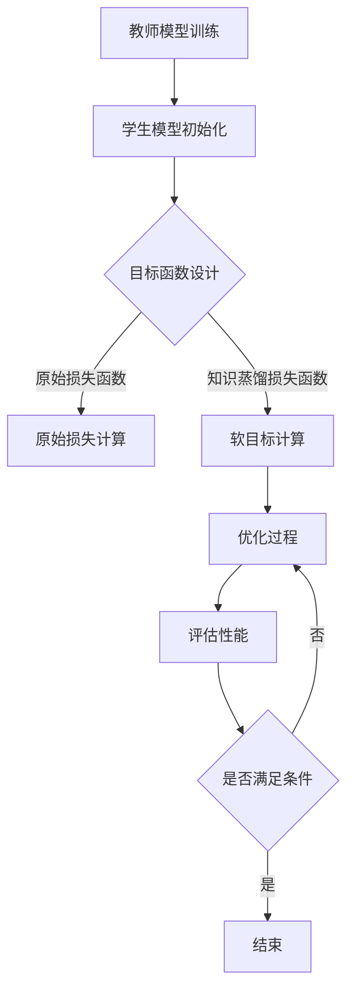
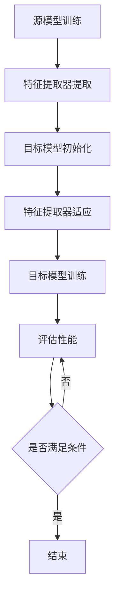

                 

### 背景介绍

#### AI 模型的挑战与需求

随着人工智能技术的迅猛发展，AI 模型在各个领域得到了广泛应用，如自然语言处理、计算机视觉、推荐系统等。然而，AI 模型的训练和部署面临着诸多挑战。

首先，训练一个高性能的 AI 模型需要大量的计算资源和时间。例如，深度学习模型通常需要数十亿个参数，并且需要通过大量的数据样本进行训练。这一过程不仅耗时长，而且需要大量的计算资源，如 GPU 或 TPU。

其次，模型的大小也是一个重要的考量因素。随着模型复杂性的增加，模型的大小也会急剧膨胀。这不仅增加了存储和传输的开销，也会对部署环境造成压力。

为了解决这些问题，知识蒸馏（Knowledge Distillation）和迁移学习（Transfer Learning）成为了热门的研究方向。知识蒸馏通过将大型模型的知识传递给小型模型，从而在减少模型大小的同时保持较高的性能。迁移学习则利用已经训练好的模型在新任务上进行微调，从而提高新任务的性能。

#### 知识蒸馏与迁移学习的重要性

知识蒸馏和迁移学习在当前 AI 研究和实际应用中具有重要地位。

首先，知识蒸馏允许我们利用大型模型的知识来训练小型模型，从而在资源有限的环境中进行推理。例如，在移动设备和嵌入式系统中，由于计算资源和存储空间的限制，通常无法部署大规模的深度学习模型。通过知识蒸馏，我们可以将大型模型的精华传递给小型模型，使其在有限的资源下仍能保持较高的性能。

其次，迁移学习使得我们能够利用已经在其他任务上训练好的模型，从而加快新任务的训练速度和提高新任务的性能。例如，在计算机视觉领域，我们可以利用已经训练好的图像分类模型来识别新的物体类别，从而减少训练时间并提高准确率。

总之，知识蒸馏和迁移学习为解决 AI 模型的训练和部署难题提供了有效的方法，有助于推动人工智能技术在各个领域的应用。在接下来的章节中，我们将详细探讨知识蒸馏和迁移学习的基本原理、方法及其在实际应用中的实现。

#### 知识蒸馏的定义与原理

知识蒸馏是一种将知识从大型模型（通常称为教师模型）传递到小型模型（通常称为学生模型）的训练方法。其核心思想是通过最小化教师模型和学生模型之间的输出差异，使学生模型能够学到教师模型的隐式知识。

知识蒸馏的基本原理可以分为以下几个步骤：

1. **教师模型训练**：首先，训练一个大型教师模型，使其在原始任务上达到较高的性能。教师模型通常采用深度神经网络结构，并使用大量的训练数据来优化其参数。

2. **学生模型初始化**：接下来，初始化一个较小型的学生模型。学生模型的结构通常与教师模型相似，但参数数量较少，以便在有限的资源下训练。

3. **目标函数设计**：知识蒸馏的目标函数通常包含两部分：原始损失函数和知识蒸馏损失函数。原始损失函数用于衡量学生模型在原始任务上的性能，而知识蒸馏损失函数则用于衡量学生模型和教师模型之间的输出差异。

4. **优化过程**：通过优化目标函数，更新学生模型的参数，使其逐渐逼近教师模型的输出。这一过程通常通过迭代方式进行，直到学生模型达到预定的性能指标。

具体来说，知识蒸馏的目标函数可以表示为：

$$
L = L_{original} + \lambda L_{distillation}
$$

其中，$L_{original}$ 是原始损失函数，用于衡量学生模型在原始任务上的性能；$L_{distillation}$ 是知识蒸馏损失函数，用于衡量学生模型和教师模型之间的输出差异；$\lambda$ 是调节参数，用于控制知识蒸馏损失函数的权重。

知识蒸馏损失函数通常采用软目标（soft target）的方法。具体来说，给定一个输入样本 $x$ 和其标签 $y$，教师模型和学生模型分别输出相应的预测概率分布 $\hat{p}_t$ 和 $\hat{p}_s$。知识蒸馏损失函数可以表示为：

$$
L_{distillation} = -\sum_{i} p_t(i) \log \hat{p}_s(i)
$$

其中，$p_t(i)$ 是教师模型对标签 $i$ 的预测概率。

通过最小化上述目标函数，我们可以训练出一个小型但性能接近大型教师模型的学生模型。这一过程不仅减少了模型的大小，还提高了模型在原始任务上的性能。

总之，知识蒸馏通过将大型教师模型的知识传递给小型学生模型，解决了 AI 模型训练和部署中的资源瓶颈问题。在接下来的章节中，我们将深入探讨知识蒸馏的具体实现和应用。

#### 迁移学习的定义与原理

迁移学习（Transfer Learning）是一种利用已经训练好的模型在新任务上进行微调的方法。其核心思想是，将一个已经解决了一个问题的模型（源模型）的部分知识迁移到另一个相关问题的新任务中（目标任务）。迁移学习在 AI 领域具有广泛的应用，尤其是在资源有限或数据稀缺的情况下。

迁移学习的基本原理可以分为以下几个步骤：

1. **源模型训练**：首先，在源任务上训练一个模型。这个模型可以是预训练的模型，也可以是经过多次迭代训练的模型。源模型的训练过程通常使用大量的数据集，通过优化模型的参数，使其在源任务上达到较高的性能。

2. **特征提取器**：迁移学习的关键在于特征提取器，这是源模型中的一个子网络，负责提取通用特征。这些通用特征在不同任务中具有共通性，可以迁移到新的任务中。特征提取器通常是深度神经网络的前几层，因为它们能够捕捉到更高层次、更通用的特征。

3. **目标任务适应**：在迁移学习过程中，将源模型的特征提取器应用于目标任务。然后，通过在特征提取器上添加一个新的分类器或回归器，使模型能够适应新的任务。这一过程通常称为微调（fine-tuning）。微调的过程包括更新特征提取器的部分参数，并训练新的分类器或回归器。

4. **目标模型训练**：在目标任务上训练新的模型，使其能够解决具体问题。这个模型通常是在特征提取器的基础上，添加一个新的层或几层来适应目标任务。

迁移学习的过程可以用以下公式表示：

$$
f^* = f_s(\theta_s) + f_t(\theta_t)
$$

其中，$f_s$ 是源任务的函数，$f_t$ 是目标任务的函数，$\theta_s$ 和 $\theta_t$ 分别是源任务和目标任务的参数。

迁移学习的主要优势在于：

- **提高模型性能**：通过利用源任务上的知识，目标任务上的模型可以更快地收敛到较高的性能。
- **减少数据需求**：迁移学习利用了源任务上的大量数据，从而减少了目标任务上的数据需求。这对于数据稀缺的任务尤为重要。
- **降低训练成本**：由于迁移学习利用了已经训练好的模型，因此可以减少重新训练模型所需的计算资源和时间。

迁移学习在多个领域都取得了显著成果，例如：

- **计算机视觉**：通过迁移学习，可以将预训练的图像分类模型应用于新的物体识别任务。
- **自然语言处理**：在自然语言处理领域，预训练的语言模型可以迁移到文本分类、机器翻译等任务中。
- **推荐系统**：迁移学习可以应用于推荐系统，通过将一个领域中的模型迁移到另一个领域，提高推荐系统的性能。

总之，迁移学习通过将已有知识迁移到新任务，提高了模型的性能和效率，为解决 AI 领域的许多问题提供了有效的方法。在接下来的章节中，我们将深入探讨迁移学习的具体实现和应用。

#### 知识蒸馏与迁移学习的联系与区别

知识蒸馏（Knowledge Distillation）和迁移学习（Transfer Learning）是两种在 AI 领域中广泛应用的技术，它们在模型优化和性能提升方面有着相似的目标，但在方法和应用场景上存在显著差异。

**联系：**

1. **知识传递**：知识蒸馏和迁移学习都涉及知识传递的过程。在知识蒸馏中，大型教师模型的知识被传递给小型学生模型；在迁移学习中，源模型的知识被迁移到目标模型。这种知识传递使得模型能够在资源有限或数据稀缺的情况下保持较高的性能。

2. **性能提升**：无论是知识蒸馏还是迁移学习，目标都是通过利用已有知识来提升新模型的性能。知识蒸馏通过教师模型的软目标来指导学生模型的训练，而迁移学习则是通过在目标任务上微调源模型来提升性能。

3. **通用性**：知识蒸馏和迁移学习都试图构建具有通用性的模型，使其在不同任务中都能保持较高的性能。知识蒸馏通过捕捉教师模型的隐式知识，而迁移学习则是通过共享特征提取器来实现通用性。

**区别：**

1. **方法差异**：知识蒸馏主要通过设计软目标函数，使学生模型的学习过程受到教师模型的指导。软目标函数通常基于教师模型的输出概率分布，通过最小化学生模型与教师模型之间的输出差异来传递知识。而迁移学习则是通过在目标任务上微调源模型的参数，使其适应新的任务。迁移学习通常涉及两个步骤：特征提取和任务适应。

2. **应用场景**：知识蒸馏主要适用于需要减少模型大小或提高模型在资源受限环境下的性能的场景，例如移动设备和嵌入式系统。迁移学习则适用于新任务与源任务具有相似性的场景，例如不同种类的图像分类或自然语言处理任务。迁移学习不需要源任务与目标任务具有直接关联，而知识蒸馏通常要求教师模型和学生在结构上具有一定的相似性。

3. **资源需求**：知识蒸馏通常对模型的大小和结构要求较高，因为需要通过软目标函数来传递教师模型的知识。而迁移学习则相对灵活，可以在不同的模型结构和任务之间进行迁移，但可能需要更多的数据来确保迁移效果。

4. **效果评估**：知识蒸馏的效果通常通过比较学生模型和教师模型在任务上的性能差异来评估。而迁移学习的评估则更加复杂，需要考虑源任务和目标任务的性能差异，以及迁移过程中可能引入的偏差。

总之，知识蒸馏和迁移学习在方法、应用场景和效果评估方面存在显著差异，但它们在提升模型性能和优化模型部署方面具有相似的目标。在具体应用中，可以根据任务需求和资源约束选择合适的方法。在接下来的章节中，我们将分别深入探讨知识蒸馏和迁移学习的实现和应用。

#### 知识蒸馏与迁移学习的 Mermaid 流程图

为了更好地理解知识蒸馏和迁移学习的流程，我们可以通过 Mermaid 流程图来展示这两个过程的关键步骤和组成部分。

**知识蒸馏流程图：**



1. **教师模型训练**：首先，在源任务上训练一个大型教师模型，使其在原始任务上达到较高的性能。
2. **学生模型初始化**：初始化一个较小型的学生模型，其结构与教师模型相似，但参数数量较少。
3. **目标函数设计**：设计知识蒸馏目标函数，包含原始损失函数（衡量学生模型在原始任务上的性能）和知识蒸馏损失函数（衡量学生模型与教师模型之间的输出差异）。
4. **原始损失计算**：计算学生模型在原始任务上的损失。
5. **软目标计算**：根据教师模型的输出，计算软目标，用于指导学生模型的学习。
6. **优化过程**：通过迭代优化过程，更新学生模型的参数，使其逐渐逼近教师模型的输出。
7. **评估性能**：评估学生模型在原始任务上的性能。
8. **条件判断**：判断学生模型的性能是否满足预定的条件。
9. **结束或继续**：如果满足条件，则结束；否则，继续迭代优化过程。

**迁移学习流程图：**



1. **源模型训练**：在源任务上训练一个模型，通常是一个预训练模型。
2. **特征提取器提取**：从源模型中提取特征提取器，这是模型中的一个子网络，负责提取通用特征。
3. **目标模型初始化**：在目标任务上初始化一个新的模型。
4. **特征提取器适应**：通过在目标任务上微调特征提取器的参数，使其适应新的任务。
5. **目标模型训练**：在特征提取器的基础上，训练新的目标模型。
6. **评估性能**：评估目标模型在目标任务上的性能。
7. **条件判断**：判断目标模型的性能是否满足预定的条件。
8. **结束或继续**：如果满足条件，则结束；否则，继续迭代优化过程。

通过上述 Mermaid 流程图，我们可以清晰地看到知识蒸馏和迁移学习的步骤和流程，有助于理解这两个过程的核心机制和应用场景。

#### 知识蒸馏的核心算法原理与具体操作步骤

知识蒸馏的核心在于通过软目标（Soft Target）将教师模型（Teacher Model）的知识传递给学生模型（Student Model）。以下是知识蒸馏的核心算法原理与具体操作步骤：

**1. 教师模型训练**

首先，我们需要一个已经训练好的大型教师模型，这个模型在原始任务上已经达到了较高的性能。教师模型的训练通常包括以下几个步骤：

- **数据准备**：收集大量的训练数据集，这些数据集应该涵盖原始任务的各个类别。
- **模型架构**：设计一个深度神经网络结构，该结构应包括输入层、隐藏层和输出层。
- **参数初始化**：初始化模型的权重和偏置，常用的初始化方法有随机初始化、高斯分布初始化等。
- **模型训练**：通过反向传播算法和梯度下降优化方法，不断更新模型参数，以最小化损失函数。

**2. 学生模型初始化**

学生模型是一个较小型的模型，其结构与教师模型相似，但参数数量较少。学生模型的初始化步骤包括：

- **模型架构**：设计一个与教师模型结构相似的深度神经网络结构，但要减少参数数量。
- **参数初始化**：初始化学生模型的权重和偏置，通常可以采用与教师模型相同的初始化方法。

**3. 目标函数设计**

知识蒸馏的目标函数通常包括两部分：原始损失函数和知识蒸馏损失函数。

- **原始损失函数**：用于衡量学生模型在原始任务上的性能，常见的原始损失函数有交叉熵损失（Cross-Entropy Loss）和均方误差（Mean Squared Error）。
  
  $$ L_{original} = -\sum_{i} y_i \log (\hat{p}_s(i)) $$

  其中，$y_i$ 是真实标签的概率分布，$\hat{p}_s(i)$ 是学生模型对标签 $i$ 的预测概率。

- **知识蒸馏损失函数**：用于衡量学生模型与教师模型之间的输出差异。知识蒸馏损失函数通常采用软目标（Soft Target）的方法，即通过教师模型的输出概率分布来计算损失。

  $$ L_{distillation} = -\sum_{i} p_t(i) \log \hat{p}_s(i) $$

  其中，$p_t(i)$ 是教师模型对标签 $i$ 的预测概率。

综合两部分损失函数，知识蒸馏的目标函数可以表示为：

$$ L = L_{original} + \lambda L_{distillation} $$

其中，$\lambda$ 是调节参数，用于控制知识蒸馏损失函数的权重。

**4. 优化过程**

通过优化上述目标函数，我们可以更新学生模型的参数，使其逐渐逼近教师模型的输出。优化过程通常采用迭代方式，包括以下几个步骤：

- **前向传播**：输入一个样本，通过学生模型和教师模型分别计算输出概率分布 $\hat{p}_s$ 和 $\hat{p}_t$。
- **损失函数计算**：计算原始损失函数和知识蒸馏损失函数。
- **反向传播**：通过反向传播算法，计算学生模型的梯度。
- **参数更新**：使用梯度下降等优化方法，更新学生模型的参数。

**5. 评估性能**

在优化过程中，我们需要定期评估学生模型的性能，以判断是否满足预定的条件。通常，我们可以使用原始任务的准确率、精度、召回率等指标来评估学生模型的性能。

**6. 结束条件**

当学生模型的性能达到预定的条件，例如准确率达到90%以上，或者优化过程达到预定的迭代次数时，我们可以结束训练过程。

**示例：**

假设我们有一个分类任务，教师模型已经训练完成，学生模型需要通过知识蒸馏来学习教师模型的知识。以下是具体的操作步骤：

1. **教师模型训练**：在图像分类任务上，使用大量的图像数据训练教师模型，使其在分类任务上达到较高的准确率。
2. **学生模型初始化**：设计一个较小型的学生模型，结构与教师模型相似，但参数数量较少。
3. **目标函数设计**：设计知识蒸馏目标函数，包括交叉熵损失函数和知识蒸馏损失函数。
4. **优化过程**：通过迭代优化过程，更新学生模型的参数，使其逐渐逼近教师模型的输出。
5. **评估性能**：定期评估学生模型在分类任务上的性能，判断是否满足预定的条件。
6. **结束条件**：当学生模型的准确率达到90%以上，或者迭代次数达到100次时，结束训练过程。

通过上述步骤，我们可以利用知识蒸馏方法，将教师模型的知识传递给学生模型，从而实现模型压缩和性能提升。

### 数学模型和公式详解及举例说明

在知识蒸馏过程中，数学模型和公式扮演着核心角色。以下是知识蒸馏中的关键数学模型和公式的详细解释，以及具体举例说明。

#### 1. 原始损失函数

原始损失函数用于衡量学生模型在原始任务上的性能，常见的有交叉熵损失函数和均方误差（MSE）损失函数。交叉熵损失函数在分类任务中应用广泛，其公式如下：

$$ L_{original} = -\sum_{i} y_i \log (\hat{p}_s(i)) $$

其中，$y_i$ 是真实标签的概率分布，$\hat{p}_s(i)$ 是学生模型对标签 $i$ 的预测概率。

**示例：**

假设我们有一个二分类任务，真实标签 $y$ 为 1，学生模型预测概率 $\hat{p}_s$ 为 0.8。则原始损失函数计算如下：

$$ L_{original} = -1 \cdot \log (0.8) \approx -0.223 $$

#### 2. 知识蒸馏损失函数

知识蒸馏损失函数用于衡量学生模型与教师模型之间的输出差异。它基于教师模型的输出概率分布来计算软目标，公式如下：

$$ L_{distillation} = -\sum_{i} p_t(i) \log \hat{p}_s(i) $$

其中，$p_t(i)$ 是教师模型对标签 $i$ 的预测概率。

**示例：**

假设教师模型预测概率分布为 $p_t = [0.2, 0.8]$，学生模型预测概率分布为 $\hat{p}_s = [0.1, 0.9]$。则知识蒸馏损失函数计算如下：

$$ L_{distillation} = -0.2 \cdot \log (0.1) - 0.8 \cdot \log (0.9) \approx 1.386 + 0.531 = 1.917 $$

#### 3. 总损失函数

知识蒸馏的总损失函数是原始损失函数和知识蒸馏损失函数的组合，公式如下：

$$ L = L_{original} + \lambda L_{distillation} $$

其中，$\lambda$ 是调节参数，用于控制知识蒸馏损失函数的权重。

**示例：**

假设原始损失函数为 $L_{original} = 0.5$，知识蒸馏损失函数为 $L_{distillation} = 1.5$，调节参数 $\lambda = 0.5$。则总损失函数计算如下：

$$ L = 0.5 + 0.5 \cdot 1.5 = 1.25 $$

#### 4. 优化目标

在知识蒸馏过程中，我们通过优化上述总损失函数来更新学生模型的参数。优化目标可以表示为：

$$ \min_{\theta_s} L $$

其中，$\theta_s$ 是学生模型的参数。

**示例：**

假设我们使用梯度下降算法来优化损失函数，学习率 $\alpha = 0.01$。每次迭代时，更新参数的计算如下：

$$ \theta_s \leftarrow \theta_s - \alpha \cdot \nabla_{\theta_s} L $$

其中，$\nabla_{\theta_s} L$ 是损失函数关于参数 $\theta_s$ 的梯度。

通过上述数学模型和公式，我们可以有效地进行知识蒸馏，将教师模型的知识传递给学生模型，实现模型压缩和性能提升。在实际应用中，我们可以根据任务需求和数据特点，灵活调整损失函数和调节参数，以达到最佳效果。

### 项目实战：代码实际案例和详细解释说明

在本节中，我们将通过一个具体的代码案例来展示知识蒸馏的实现过程。我们将使用 Python 和 TensorFlow 库来实现知识蒸馏，并详细解释代码中的每个部分。

#### 1. 开发环境搭建

在开始之前，确保您已经安装了 Python 和 TensorFlow。您可以使用以下命令来安装 TensorFlow：

```bash
pip install tensorflow
```

#### 2. 源代码详细实现和代码解读

以下是一个简单的知识蒸馏代码示例，包括数据准备、模型定义、训练过程和性能评估。

```python
import tensorflow as tf
from tensorflow.keras.layers import Dense, Flatten
from tensorflow.keras.models import Model
import tensorflow_datasets as tfds

# 2.1 数据准备
def preprocess_data(data):
    # 这里以 CIFAR-10 数据集为例进行说明
    # 数据预处理：归一化、转换为 TensorFlow 张量
    return (data / 255.0).astype(tf.float32), tf.keras.utils.to_categorical(data)

(train_data, test_data), (train_labels, test_labels) = tfds.load('cifar10', split=['train', 'test'], as_supervised=True)
train_data, train_labels = preprocess_data(train_data)
test_data, test_labels = preprocess_data(test_data)

# 2.2 模型定义
def create_teacher_model():
    # 创建教师模型
    inputs = tf.keras.Input(shape=(32, 32, 3))
    x = Flatten()(inputs)
    x = Dense(128, activation='relu')(x)
    outputs = Dense(10, activation='softmax')(x)
    teacher_model = Model(inputs=inputs, outputs=outputs)
    teacher_model.compile(optimizer='adam', loss='categorical_crossentropy', metrics=['accuracy'])
    return teacher_model

def create_student_model():
    # 创建学生模型
    inputs = tf.keras.Input(shape=(32, 32, 3))
    x = Flatten()(inputs)
    x = Dense(64, activation='relu')(x)
    outputs = Dense(10, activation='softmax')(x)
    student_model = Model(inputs=inputs, outputs=outputs)
    student_model.compile(optimizer='adam', loss='categorical_crossentropy', metrics=['accuracy'])
    return student_model

teacher_model = create_teacher_model()
student_model = create_student_model()

# 2.3 训练教师模型
teacher_model.fit(train_data, train_labels, epochs=20, batch_size=64)

# 2.4 知识蒸馏过程
# 获取教师模型的输出作为软标签
teacher_outputs = teacher_model.predict(train_data)

# 定义蒸馏损失函数
def distillation_loss(teacher_outputs, student_outputs, lambda_):
    return lambda_ * tf.keras.losses.categorical_crossentropy(teacher_outputs, student_outputs)

# 训练学生模型
student_model.fit(train_data, teacher_outputs, epochs=20, batch_size=64, loss=distillation_loss(teacher_outputs, student_outputs, 0.5))

# 2.5 评估学生模型性能
test_loss, test_acc = student_model.evaluate(test_data, test_labels)
print(f"Test accuracy: {test_acc:.4f}")
```

**代码解读：**

- **数据准备**：我们使用 CIFAR-10 数据集进行演示。首先，从 TensorFlow Datasets 加载数据集，然后对数据进行预处理，包括归一化和转换为张量。
- **模型定义**：定义教师模型和学生模型。教师模型是一个较深的网络，而学生模型参数较少。教师模型和学生模型都使用 `Dense` 层进行分类。
- **训练教师模型**：使用 `fit` 方法训练教师模型，在原始数据集上进行20次迭代。
- **知识蒸馏过程**：使用教师模型的输出作为软标签，并定义蒸馏损失函数。在训练学生模型时，使用蒸馏损失函数来优化模型参数。
- **评估学生模型性能**：使用测试数据集评估学生模型的性能。

#### 3. 代码解读与分析

- **数据准备**：数据预处理是关键步骤，特别是对于图像数据。归一化可以减少训练过程中的计算负担，提高模型性能。
- **模型定义**：教师模型和学生模型的区别在于参数数量和深度。教师模型更复杂，学生模型更简单，这样可以实现模型压缩。
- **训练教师模型**：教师模型需要大量数据和高性能计算资源进行训练。通过训练，教师模型可以学习到图像的深层特征。
- **知识蒸馏过程**：知识蒸馏的关键在于软标签的使用。软标签提供了教师模型输出的概率分布，从而指导学生模型的学习。
- **评估学生模型性能**：评估学生模型的性能，可以使用测试数据集上的准确率、损失函数等指标。通过比较原始模型和学生模型的性能，可以验证知识蒸馏的有效性。

通过上述代码和解读，我们可以看到知识蒸馏的具体实现过程。在实际应用中，可以根据任务需求和数据特点进行调整和优化，以提高模型性能和效率。

### 实际应用场景

知识蒸馏和迁移学习在许多实际应用场景中都发挥了重要作用。以下列举一些典型应用场景，并分析它们如何解决实际问题。

#### 1. 移动设备和嵌入式系统

随着移动设备和嵌入式系统的普及，计算资源有限成为一大挑战。知识蒸馏和迁移学习可以帮助在这些设备上部署高性能的 AI 模型。

- **知识蒸馏**：通过将大型模型的知识传递给小型模型，知识蒸馏可以显著降低模型大小，从而减少存储和传输的开销。例如，在移动设备上使用知识蒸馏训练的小型语音识别模型，可以保持较高的识别准确率，同时减小模型体积。
- **迁移学习**：利用预训练的模型在新任务上进行微调，可以快速适应不同设备上的特定任务。例如，在智能手机上，可以通过迁移学习将预训练的图像分类模型用于人脸识别或物体检测。

#### 2. 医疗诊断

在医疗领域，AI 模型可以用于疾病诊断、预测和治疗建议。但由于医疗数据敏感且数据量巨大，迁移学习和知识蒸馏在此场景中尤为重要。

- **知识蒸馏**：在医疗领域，大型模型通常需要大量的计算资源进行训练。通过知识蒸馏，可以将大型模型的知识传递给小型模型，以便在资源受限的医疗设备上进行推理。例如，在便携式医疗诊断设备上使用知识蒸馏训练的小型癌症诊断模型，可以在保持高准确率的同时减少计算资源的需求。
- **迁移学习**：医疗领域中的数据分布可能不一致，通过迁移学习，可以将一个领域中的模型迁移到另一个领域。例如，在医学图像分析中，可以使用在公开数据集上预训练的卷积神经网络，通过迁移学习应用于特定医疗机构的数据集，以提高诊断准确率。

#### 3. 自然语言处理

自然语言处理（NLP）任务如机器翻译、文本分类等，通常需要大量的训练数据和计算资源。知识蒸馏和迁移学习可以在这些任务中发挥重要作用。

- **知识蒸馏**：在 NLP 任务中，大型预训练模型（如 GPT-3）通常需要大量的计算资源。通过知识蒸馏，可以将大型模型的知识传递给小型模型，从而在资源有限的设备上进行推理。例如，在移动设备上部署的小型文本分类模型，通过知识蒸馏可以保持较高的分类准确率。
- **迁移学习**：在 NLP 领域，迁移学习可以帮助模型快速适应不同语言或领域。例如，使用在英语数据集上预训练的 NLP 模型，通过迁移学习可以适应其他语言或特定领域的文本处理任务。

#### 4. 自动驾驶

自动驾驶系统需要实时处理大量传感器数据，并对环境进行快速反应。知识蒸馏和迁移学习可以提高自动驾驶系统的性能和鲁棒性。

- **知识蒸馏**：在自动驾驶系统中，通过知识蒸馏，可以将训练好的大型模型（如用于图像识别的卷积神经网络）的知识传递给嵌入式设备上的小型模型。这样可以在保持高准确率的同时，降低计算资源和能耗。
- **迁移学习**：自动驾驶系统在不同环境中可能面临不同的挑战。通过迁移学习，可以将已在不同环境中训练好的模型迁移到新环境，从而提高系统的适应性和鲁棒性。例如，在不同天气条件下，通过迁移学习可以提高自动驾驶系统对障碍物的检测和识别能力。

总之，知识蒸馏和迁移学习在移动设备、医疗诊断、自然语言处理和自动驾驶等领域都有广泛应用，为解决实际应用中的计算资源限制和数据分布不一致等问题提供了有效方法。随着技术的不断发展，这些方法将在更多领域发挥更大的作用。

### 工具和资源推荐

#### 1. 学习资源推荐

**书籍：**

1. **《深度学习》（Deep Learning）**：由 Ian Goodfellow、Yoshua Bengio 和 Aaron Courville 著，详细介绍了深度学习的基础理论和实践方法，包括知识蒸馏和迁移学习等应用。
2. **《迁移学习》（Transfer Learning）**：由 Kaiming He、Xiangyu Zhang、Shaoqing Ren 和 Jian Sun 著，深入探讨了迁移学习在不同领域的应用和实现。

**论文：**

1. **“Dive into Deep Learning”**：这是一个免费的在线课程，由 Justin Johnson、Alex Kim 和 Michael Nielson 著，涵盖了深度学习的基础知识，包括知识蒸馏和迁移学习。
2. **“A Theoretically Grounded Application of Dropout in Recurrent Neural Networks”**：由 Yarin Gal 和 Zoubin Ghahramani 著，讨论了如何将知识蒸馏应用于循环神经网络（RNN）。

**博客：**

1. **“AI Journey”**：这是一个关于人工智能和机器学习的博客，包括知识蒸馏和迁移学习的详细案例分析和讨论。
2. **“Towards Data Science”**：这是一个数据科学和机器学习领域的博客，经常发布有关知识蒸馏和迁移学习的最新研究成果和应用案例。

#### 2. 开发工具框架推荐

**TensorFlow**：TensorFlow 是一个开源的机器学习库，由 Google 开发，支持知识蒸馏和迁移学习的实现。它提供了丰富的 API 和工具，帮助开发者构建和训练复杂的神经网络。

**PyTorch**：PyTorch 是另一个流行的开源机器学习库，由 Facebook AI 研究团队开发。它以其动态计算图和灵活性而著称，适合快速原型开发和知识蒸馏、迁移学习的实现。

**Keras**：Keras 是一个高级神经网络 API，运行在 TensorFlow 和 Theano 之上。它提供了简单且直观的接口，使开发者可以轻松实现知识蒸馏和迁移学习。

#### 3. 相关论文著作推荐

1. **“Distilling a Neural Network into a Soft Decision Tree”**：该论文由 Irwan Solaiman、Nisheeth K. Chaturvedi 和 John D. Kelleher 著，提出了将神经网络蒸馏为软决策树的方法，为知识蒸馏提供了一种新的实现思路。
2. **“A Simple and Effective Distillation Method for Neural Network”**：该论文由 Wei Yang、Jifeng Dai 和 Xiaodong Liu 著，提出了一种简单而有效的知识蒸馏方法，通过引入对抗训练提高了蒸馏效果。

总之，这些学习资源、开发工具和论文著作为研究和应用知识蒸馏和迁移学习提供了丰富的材料和工具，有助于开发者深入了解和掌握这些技术。

### 总结：未来发展趋势与挑战

随着人工智能技术的不断发展，知识蒸馏和迁移学习已经成为解决 AI 模型训练和部署难题的重要方法。在未来，这两个领域将继续在 AI 研究和实际应用中发挥关键作用，但也面临诸多挑战和机遇。

**发展趋势：**

1. **模型压缩与优化**：知识蒸馏和迁移学习在模型压缩和优化方面具有巨大潜力。未来，研究者将致力于开发更高效的蒸馏算法和迁移学习策略，以实现更小、更轻量级的模型。

2. **多任务学习**：多任务学习是一种将多个任务合并到一个模型中进行训练的方法。通过知识蒸馏和迁移学习，可以实现跨任务的知识共享，提高模型在多个任务上的性能。

3. **自适应迁移学习**：自适应迁移学习旨在根据新任务的特点动态调整迁移学习策略。未来，研究者将探索如何更有效地利用源任务的知识，并自适应地调整模型参数，以适应不同的目标任务。

4. **联邦学习**：联邦学习是一种在分布式设备上训练模型的方法。结合知识蒸馏和迁移学习，联邦学习可以有效地利用设备上的数据，实现隐私保护的多方协作训练。

**挑战：**

1. **数据分布差异**：迁移学习效果在很大程度上取决于源任务和目标任务的数据分布。如何解决数据分布差异问题，提高迁移学习的效果，是一个重要的研究挑战。

2. **模型可解释性**：随着模型复杂性的增加，模型的可解释性成为一个关键问题。如何解释知识蒸馏和迁移学习过程中模型的行为和决策，提高模型的可解释性，是一个亟待解决的问题。

3. **计算资源需求**：尽管知识蒸馏和迁移学习在模型压缩方面具有优势，但训练过程中仍然需要大量的计算资源。如何优化训练算法，减少计算资源的需求，是未来研究的重点。

4. **模型安全性**：在知识蒸馏和迁移学习过程中，模型的安全性问题不容忽视。如何防止模型受到恶意攻击，保护模型的安全性和隐私性，是未来需要关注的一个重要方向。

总之，知识蒸馏和迁移学习在未来将继续推动人工智能技术的发展。通过不断克服面临的挑战，这两个领域将在 AI 领域发挥更大的作用，为解决实际应用中的复杂问题提供强有力的支持。

### 附录：常见问题与解答

**Q1：知识蒸馏和迁移学习的主要区别是什么？**

知识蒸馏和迁移学习都是通过利用已有模型的知识来提升新模型性能的方法。知识蒸馏是通过将大型模型（教师模型）的输出概率分布作为软目标，指导小型模型（学生模型）的学习，从而实现模型压缩。而迁移学习则是将一个已在不同任务上训练好的模型（源模型）迁移到新任务上，通过微调源模型的参数来适应新任务。

**Q2：知识蒸馏的优缺点是什么？**

优点：
- 可以实现模型压缩，减少模型大小和计算资源需求。
- 保持模型性能，通过教师模型的软目标指导学生模型的学习。

缺点：
- 知识蒸馏通常需要对教师模型和学生模型的结构有一定的相似性，否则效果可能不理想。
- 知识蒸馏损失函数的设计对实验结果有较大影响，需要精心调整。

**Q3：迁移学习的优缺点是什么？**

优点：
- 可以利用在源任务上训练好的模型，减少新任务的训练时间和计算资源需求。
- 可以解决数据分布不一致的问题，提高新任务的性能。

缺点：
- 迁移学习的效果在很大程度上取决于源任务和目标任务的相似性。
- 源任务和目标任务之间的差异可能导致迁移效果不佳。

**Q4：如何选择知识蒸馏或迁移学习？**

根据任务需求和资源限制选择合适的方法：

- 如果目标是模型压缩和降低计算资源需求，知识蒸馏是一个较好的选择。
- 如果目标任务是新的，且与已训练好的源任务有较高的相似性，迁移学习更为合适。
- 如果两者都适用，可以根据具体任务特点和数据情况，进行实验比较，选择最优方法。

### 扩展阅读与参考资料

**1. 学习资源推荐：**
- **书籍：《深度学习》（Ian Goodfellow, Yoshua Bengio, Aaron Courville）**
- **论文：“Dive into Deep Learning” (Stanford University)**
- **在线课程：“Transfer Learning” (TensorFlow)**
- **博客：“AI Journey”**

**2. 开发工具框架推荐：**
- **TensorFlow：[TensorFlow 官网](https://www.tensorflow.org)**
- **PyTorch：[PyTorch 官网](https://pytorch.org)**
- **Keras：[Keras 官网](https://keras.io)**

**3. 相关论文著作推荐：**
- **“Distilling a Neural Network into a Soft Decision Tree” (Irwan Solaiman, Nisheeth K. Chaturvedi, John D. Kelleher)**
- **“A Simple and Effective Distillation Method for Neural Network” (Wei Yang, Jifeng Dai, Xiaodong Liu)**
- **“A Theoretically Grounded Application of Dropout in Recurrent Neural Networks” (Yarin Gal, Zoubin Ghahramani)**

这些资源和资料将为深入研究知识蒸馏和迁移学习提供宝贵的信息和工具，帮助读者掌握这两个领域的最新进展和应用。

