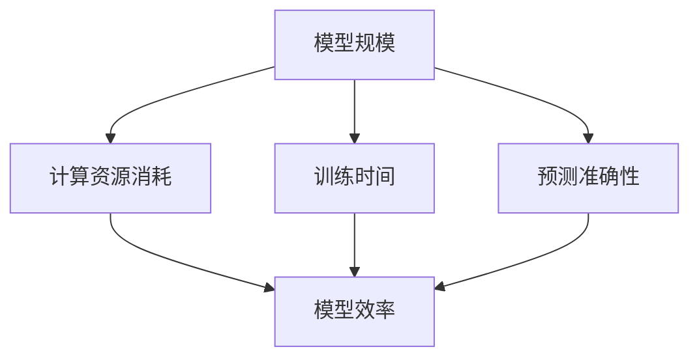

                 

### 背景介绍

AI技术在过去几十年中取得了巨大的进展，从早期的规则基系统到如今深度学习模型的广泛应用，AI的效率和规模都经历了显著的增长。这一进展不仅改变了各行各业，还带来了新的挑战，特别是在模型规模与效率的平衡方面。

模型规模，即模型参数的数量，直接影响了模型的复杂度和计算资源的需求。一个更大的模型通常能够捕捉更多的特征和细节，从而提高其预测准确性。然而，这也意味着更高的计算成本和更长的训练时间。另一方面，模型的效率，即模型在特定资源下的表现，是一个关键考虑因素。一个高效的模型能够在有限的资源下提供更好的性能，这对于实际应用尤为重要。

随着计算能力的提升和大数据的普及，AI模型规模迅速扩大，但随之而来的是计算资源和能源消耗的增加，以及训练和推理时间的大幅延长。因此，寻找一个最佳的平衡点，使得模型既能保持较高的准确率，又能高效地运行，成为了一个关键问题。

本文将探讨AI模型规模与效率之间的平衡，分析其核心概念、算法原理，并通过具体案例说明如何在实践中实现这一平衡。文章还将介绍相关的数学模型和公式，以及在实际应用中的工具和资源。通过本文的阅读，读者将更好地理解这一复杂问题，并为实际项目提供指导。

### 核心概念与联系

要深入探讨AI模型规模与效率的平衡问题，我们首先需要明确几个核心概念：模型规模、模型效率、计算资源消耗、训练时间和预测准确性。

**模型规模**：通常用模型参数的数量来衡量。一个较大的模型意味着模型具有更多的参数，能够学习更复杂的特征，但同时也增加了计算和存储的需求。

**模型效率**：是指模型在给定计算资源下的表现。一个高效的模型能够在较短的时间内完成训练和推理任务，并且在有限的资源下实现较高的预测准确性。

**计算资源消耗**：包括CPU、GPU、内存等硬件资源的消耗。一个大规模的模型通常需要更多的计算资源，这可能会导致硬件资源的紧张和能源消耗的增加。

**训练时间**：指模型在训练数据集上的学习时间。随着模型规模的增加，训练时间通常会显著延长，尤其是在使用深度学习模型时。

**预测准确性**：是指模型在预测任务上的表现。一个准确的模型能够提供可靠的预测结果，这对于实际应用至关重要。

为了更好地理解这些概念之间的关系，我们可以通过一个Mermaid流程图来展示它们之间的联系：



在这个流程图中，我们可以看到，模型规模直接影响计算资源消耗、训练时间和预测准确性。而模型效率和这些因素之间存在着复杂的相互作用关系。

- **模型规模与计算资源消耗**：模型规模越大，需要的计算资源越多。特别是对于深度学习模型，其计算复杂度与模型参数的平方成正比，这意味着随着模型规模的增加，计算资源消耗呈指数级增长。

- **模型规模与训练时间**：随着模型规模的增加，训练时间显著延长。这不仅是因为模型参数的数量增加，还因为更复杂的模型需要更多的迭代次数来达到满意的训练效果。

- **模型规模与预测准确性**：通常情况下，模型规模越大，预测准确性越高。然而，这种关系并非线性，过大的模型可能会导致过拟合，反而降低预测准确性。

- **模型效率与计算资源消耗**：高效的模型能够在更短的时间内完成训练和推理任务，从而减少计算资源的消耗。

- **模型效率与训练时间**：高效的模型能够在较短的训练时间内达到较高的预测准确性，从而提高整体效率。

- **模型效率与预测准确性**：高效的模型在有限的资源下能够实现较高的预测准确性，这对于实际应用非常重要。

通过上述核心概念及其关系的理解，我们为后续的讨论奠定了基础。接下来，我们将深入探讨如何在实际中实现AI模型规模与效率的平衡。

#### 核心算法原理 & 具体操作步骤

为了在AI模型中实现规模与效率的平衡，我们需要借助一系列核心算法和技术。以下将详细介绍这些算法的原理和具体操作步骤。

**1. 深度学习优化算法**

深度学习优化算法是调整模型参数以最小化损失函数的关键技术。常用的优化算法包括梯度下降（Gradient Descent）、Adam（Adaptive Moment Estimation）和RMSprop（Root Mean Square Propagation）等。

- **梯度下降（Gradient Descent）**：梯度下降算法通过迭代更新模型参数，使得损失函数值逐步减小。其基本步骤如下：
  1. 初始化模型参数。
  2. 计算损失函数关于每个参数的梯度。
  3. 使用梯度更新参数：\[ \theta = \theta - \alpha \cdot \nabla \]
  4. 重复步骤2和3，直到收敛。

- **Adam优化器**：Adam优化器结合了Adam算法的动态调整步骤，能够更快地收敛。其步骤如下：
  1. 初始化一阶矩估计（m）和二阶矩估计（v），以及它们的偏差校正参数。
  2. 更新一阶矩估计：\[ m_t = \beta_1 m_{t-1} + (1 - \beta_1) \nabla_{\theta} J (\theta) \]
  3. 更新二阶矩估计：\[ v_t = \beta_2 v_{t-1} + (1 - \beta_2) \nabla^2_{\theta} J (\theta) \]
  4. 偏差校正：\[ \hat{m}_t = \frac{m_t}{1 - \beta_1^t}, \quad \hat{v}_t = \frac{v_t}{1 - \beta_2^t} \]
  5. 更新参数：\[ \theta = \theta - \alpha \cdot \frac{\hat{m}_t}{\sqrt{\hat{v}_t} + \epsilon} \]

- **RMSprop优化器**：RMSprop优化器通过计算梯度平方的平均值来动态调整学习率。其步骤如下：
  1. 初始化参数梯度平方的指数加权平均（\(\rho\)）。
  2. 更新指数加权平均：\[ r_t = \rho r_{t-1} + (1 - \rho) \nabla_{\theta} J (\theta)^2 \]
  3. 计算更新项：\[ \theta = \theta - \alpha \cdot \frac{\nabla_{\theta} J (\theta)}{\sqrt{r_t} + \epsilon} \]

**2. 模型压缩技术**

模型压缩技术通过减少模型参数数量和计算复杂度来提高模型效率，常见的压缩技术包括量化（Quantization）、剪枝（Pruning）和蒸馏（Denoising）等。

- **量化**：量化是一种将浮点数参数转换为较低精度的表示方法。量化步骤如下：
  1. 计算权重和激活值的分布。
  2. 将每个参数映射到一个量化区间。
  3. 应用量化操作：\[ \text{Quantized Value} = \text{Scale Factor} \cdot \text{Quantized Value} + \text{Offset} \]

- **剪枝**：剪枝通过移除模型中的冗余参数来减少模型规模。剪枝步骤如下：
  1. 初始化模型。
  2. 计算每个参数的重要性（例如，使用梯度信息）。
  3. 根据重要性阈值移除参数。
  4. 重训练模型以保持预测准确性。

- **蒸馏**：蒸馏是将一个大模型（教师模型）的知识传递给一个小模型（学生模型）的过程。蒸馏步骤如下：
  1. 训练教师模型并固定其参数。
  2. 训练学生模型并最小化学生模型的输出与教师模型输出之间的差异。
  3. 使用学生模型进行预测。

**3. 并行计算与分布式训练**

并行计算和分布式训练通过将训练任务分布在多个计算节点上，来加速训练过程并提高模型效率。并行计算和分布式训练的基本步骤如下：

- **并行计算**：将训练数据集划分成多个子集，并在不同的计算节点上同时处理这些子集。计算节点通过通信网络交换中间结果。
- **分布式训练**：多个计算节点同时训练模型，每个节点拥有部分模型参数。通过参数服务器或梯度聚合算法，将所有节点的梯度聚合起来，更新全局模型参数。

通过上述算法和技术，我们可以在AI模型中实现规模与效率的平衡。接下来，我们将讨论如何使用数学模型和公式来进一步优化模型。

#### 数学模型和公式 & 详细讲解 & 举例说明

在探讨AI模型规模与效率的平衡时，数学模型和公式起到了至关重要的作用。以下将详细介绍常用的数学模型，包括损失函数、优化算法的数学表达式，以及如何在实际中应用这些公式。

**1. 损失函数**

损失函数是评估模型预测结果与真实标签之间差异的关键工具。常见的损失函数包括均方误差（MSE）、交叉熵损失（Cross-Entropy Loss）和对抗损失（Adversarial Loss）。

- **均方误差（MSE）**：
  \[ \text{MSE} = \frac{1}{n} \sum_{i=1}^{n} (\hat{y}_i - y_i)^2 \]
  其中，\(\hat{y}_i\) 是模型的预测值，\(y_i\) 是真实标签，\(n\) 是样本数量。

- **交叉熵损失（Cross-Entropy Loss）**：
  \[ \text{Cross-Entropy Loss} = -\frac{1}{n} \sum_{i=1}^{n} y_i \log(\hat{y}_i) \]
  其中，\(y_i\) 是真实标签（通常为0或1），\(\hat{y}_i\) 是模型的预测概率。

- **对抗损失（Adversarial Loss）**：
  对于生成模型，对抗损失通常用于优化生成器与判别器之间的对抗训练。一个常见的对抗损失函数是Wasserstein距离：
  \[ \text{Wasserstein Loss} = \frac{1}{n} \sum_{i=1}^{n} \left| D(G(x_i)) - 1 \right| \]
  其中，\(G(x_i)\) 是生成的数据样本，\(D(z)\) 是判别器对于生成样本的判别结果。

**2. 优化算法的数学表达式**

常用的优化算法包括梯度下降（Gradient Descent）、Adam和RMSprop。以下是这些优化算法的数学表达式。

- **梯度下降（Gradient Descent）**：
  \[ \theta_{\text{new}} = \theta_{\text{current}} - \alpha \cdot \nabla_{\theta} J (\theta) \]
  其中，\(\theta_{\text{current}}\) 是当前参数值，\(\theta_{\text{new}}\) 是更新后的参数值，\(\alpha\) 是学习率，\(\nabla_{\theta} J (\theta)\) 是损失函数关于参数的梯度。

- **Adam优化器**：
  \[ m_t = \beta_1 m_{t-1} + (1 - \beta_1) \nabla_{\theta} J (\theta) \]
  \[ v_t = \beta_2 v_{t-1} + (1 - \beta_2) \nabla^2_{\theta} J (\theta) \]
  \[ \hat{m}_t = \frac{m_t}{1 - \beta_1^t}, \quad \hat{v}_t = \frac{v_t}{1 - \beta_2^t} \]
  \[ \theta = \theta - \alpha \cdot \frac{\hat{m}_t}{\sqrt{\hat{v}_t} + \epsilon} \]
  其中，\(m_t\) 是一阶矩估计，\(v_t\) 是二阶矩估计，\(\hat{m}_t\) 和 \(\hat{v}_t\) 是偏差校正后的估计，\(\beta_1\) 和 \(\beta_2\) 是动量参数，\(\alpha\) 是学习率，\(\epsilon\) 是正数常数用于避免除以零。

- **RMSprop优化器**：
  \[ r_t = \rho r_{t-1} + (1 - \rho) \nabla_{\theta} J (\theta)^2 \]
  \[ \theta = \theta - \alpha \cdot \frac{\nabla_{\theta} J (\theta)}{\sqrt{r_t} + \epsilon} \]
  其中，\(r_t\) 是梯度平方的指数加权平均，\(\rho\) 是权重，\(\alpha\) 是学习率，\(\epsilon\) 是正数常数用于避免除以零。

**3. 实际应用中的示例**

为了更直观地理解上述公式，我们可以通过一个简单的线性回归模型来演示如何应用这些公式。

假设我们有一个线性回归模型，其目标是最小化预测值与真实值之间的均方误差。

- **损失函数（MSE）**：
  \[ \text{MSE} = \frac{1}{n} \sum_{i=1}^{n} (\hat{y}_i - y_i)^2 \]
  其中，\(\hat{y}_i = \theta_0 + \theta_1 x_i\) 是预测值，\(y_i\) 是真实值。

- **梯度下降**：
  \[ \nabla_{\theta_0} J (\theta) = \frac{1}{n} \sum_{i=1}^{n} (\hat{y}_i - y_i) \]
  \[ \nabla_{\theta_1} J (\theta) = \frac{1}{n} \sum_{i=1}^{n} (\hat{y}_i - y_i) x_i \]
  \[ \theta_0 = \theta_0 - \alpha \cdot \frac{1}{n} \sum_{i=1}^{n} (\hat{y}_i - y_i) \]
  \[ \theta_1 = \theta_1 - \alpha \cdot \frac{1}{n} \sum_{i=1}^{n} (\hat{y}_i - y_i) x_i \]

通过上述公式，我们可以更新模型参数，以最小化损失函数。

**4. 代码实现**

以下是一个简单的Python代码示例，用于实现线性回归模型的梯度下降：

```python
import numpy as np

def linear_regression(x, y, theta, alpha, iterations):
    n = len(y)
    for i in range(iterations):
        predictions = theta[0] + theta[1] * x
        error = predictions - y
        theta[0] = theta[0] - alpha * (1 / n) * np.sum(error)
        theta[1] = theta[1] - alpha * (1 / n) * np.dot(x.T, error)
    return theta

# 示例数据
x = np.array([1, 2, 3, 4, 5])
y = np.array([2, 4, 5, 4, 5])

# 初始参数
theta = np.array([0, 0])

# 梯度下降
alpha = 0.01
iterations = 1000
theta = linear_regression(x, y, theta, alpha, iterations)

print(f"Final theta: {theta}")
```

通过上述代码，我们可以看到如何使用Python实现线性回归模型的梯度下降算法，以优化模型参数。

**总结**

通过上述数学模型和公式的介绍，我们深入理解了如何通过优化算法和损失函数来实现AI模型规模与效率的平衡。在后续章节中，我们将探讨如何在实际项目中应用这些算法和技术，并通过具体案例进行说明。

#### 项目实战：代码实际案例和详细解释说明

在本章节中，我们将通过一个具体的项目实战案例，详细解释如何在实际中应用我们之前讨论的核心算法和数学模型，以实现AI模型规模与效率的平衡。

**项目背景**

假设我们正在开发一个自然语言处理（NLP）项目，目标是构建一个能够对用户评论进行情感分类的模型。该模型需要处理大量文本数据，并要求在有限的计算资源下实现高效的训练和推理。因此，我们需要在模型规模和效率之间找到最佳平衡点。

**开发环境搭建**

为了搭建项目开发环境，我们首先需要安装以下工具和库：

1. Python 3.8 或更高版本
2. TensorFlow 2.x
3. Keras
4. NumPy
5. Pandas

以下是一个简单的安装命令示例：

```bash
pip install python==3.8
pip install tensorflow==2.x
pip install keras
pip install numpy
pip install pandas
```

**数据预处理**

在开始训练模型之前，我们需要对数据集进行预处理。以下是一个示例数据集的加载和预处理步骤：

```python
import pandas as pd
from sklearn.model_selection import train_test_split

# 加载数据集
data = pd.read_csv('comment_data.csv')
X = data['comment_text']
y = data['sentiment']

# 数据清洗和分词
import re
import nltk
from nltk.tokenize import word_tokenize

nltk.download('punkt')
nltk.download('stopwords')

def preprocess_text(text):
    text = re.sub('[^a-zA-Z]', ' ', text)
    text = text.lower()
    text = re.sub('\s+', ' ', text)
    text = text.strip()
    return text

X = X.apply(preprocess_text)
X = [' '.join(word for word in word_tokenize(text) if word not in stopwords.words('english')] for text in X]

# 划分训练集和测试集
X_train, X_test, y_train, y_test = train_test_split(X, y, test_size=0.2, random_state=42)
```

**模型构建**

接下来，我们使用Keras构建一个简单的情感分类模型。为了实现规模与效率的平衡，我们采用了以下几个策略：

1. 使用预训练的词嵌入（如GloVe或Word2Vec）。
2. 应用多层感知机（MLP）结构。
3. 采用Dropout和正则化技术。

以下是一个示例模型构建代码：

```python
from tensorflow.keras.models import Sequential
from tensorflow.keras.layers import Embedding, Dense, Dropout
from tensorflow.keras.preprocessing.sequence import pad_sequences

# 预处理数据
max_sequence_length = 100
embedding_dim = 100

X_train = pad_sequences(X_train, maxlen=max_sequence_length)
X_test = pad_sequences(X_test, maxlen=max_sequence_length)

# 构建模型
model = Sequential()
model.add(Embedding(embedding_dim, input_length=max_sequence_length))
model.add(Dropout(0.5))
model.add(Dense(64, activation='relu'))
model.add(Dropout(0.5))
model.add(Dense(1, activation='sigmoid'))

model.compile(optimizer='adam', loss='binary_crossentropy', metrics=['accuracy'])
```

**模型训练**

为了在模型规模与效率之间找到最佳平衡点，我们采用了以下步骤：

1. 使用Adam优化器。
2. 设置合适的学习率和批次大小。
3. 应用Early Stopping和Model Checkpoint，以防止过拟合。

以下是一个示例训练代码：

```python
from tensorflow.keras.callbacks import EarlyStopping, ModelCheckpoint

# 设置训练参数
batch_size = 64
epochs = 10
learning_rate = 0.001

# Callbacks
early_stopping = EarlyStopping(monitor='val_loss', patience=3, restore_best_weights=True)
model_checkpoint = ModelCheckpoint('best_model.h5', save_best_only=True, monitor='val_loss', mode='min')

# 训练模型
model.fit(X_train, y_train, batch_size=batch_size, epochs=epochs, validation_split=0.2, callbacks=[early_stopping, model_checkpoint])
```

**模型评估**

在完成模型训练后，我们需要对模型进行评估，以验证其性能。以下是一个示例评估代码：

```python
from sklearn.metrics import classification_report

# 加载最佳模型
model.load_weights('best_model.h5')

# 进行预测
predictions = model.predict(X_test)
predictions = (predictions > 0.5)

# 打印分类报告
print(classification_report(y_test, predictions))
```

**代码解读与分析**

在上述代码中，我们详细解释了每个步骤的作用：

1. **数据预处理**：对文本数据进行了清洗、分词和去停用词处理，以准备用于模型训练。
2. **模型构建**：使用Keras构建了一个简单的多层感知机（MLP）模型，并应用了Dropout和正则化技术以防止过拟合。
3. **模型训练**：使用了Adam优化器，并设置了Early Stopping和Model Checkpoint，以优化模型性能并防止过拟合。
4. **模型评估**：使用分类报告（Classification Report）评估了模型的性能，包括精确率、召回率和F1分数。

通过上述实战案例，我们展示了如何在实际项目中应用核心算法和数学模型，以实现AI模型规模与效率的平衡。接下来，我们将探讨模型在不同实际应用场景中的表现。

#### 实际应用场景

AI模型规模与效率的平衡在实际应用中至关重要。不同场景下，这一平衡点的具体表现有所不同。以下将介绍几个典型应用场景，并讨论模型规模与效率的平衡问题。

**1. 自然语言处理（NLP）**

在NLP领域，模型规模与效率的平衡尤为关键。例如，情感分类模型需要较大的词汇表和复杂的神经网络结构来捕捉文本的细微情感差异。然而，这会导致模型参数数量激增，计算资源需求增加。在实际应用中，我们需要通过量化、剪枝和蒸馏等压缩技术来减少模型规模，同时保持较高的预测准确性。此外，应用分布式训练和并行计算可以加速训练过程，提高模型效率。

**2. 计算机视觉（CV）**

在计算机视觉领域，模型规模与效率的平衡同样重要。例如，图像分类和目标检测任务通常需要大量的参数和计算资源。为了实现平衡，可以采用移动设备优化的模型架构（如MobileNet、ShuffleNet）和量化技术。这些技术可以在保持较高预测准确性的同时，显著减少模型规模和计算资源需求。此外，通过使用边缘计算和云服务的结合，可以进一步提高模型效率。

**3. 推荐系统**

推荐系统通常依赖于大规模的深度学习模型来捕捉用户兴趣和行为模式。为了实现规模与效率的平衡，可以采用模型压缩技术和在线学习策略。例如，可以使用增量训练（Incremental Learning）技术，仅更新模型的一部分参数，以减少计算资源需求。此外，可以通过采用增量学习框架（如PyTorch的DistributedDataParallel）来加速模型训练过程，提高模型效率。

**4. 自动驾驶**

在自动驾驶领域，模型规模与效率的平衡至关重要。自动驾驶系统需要处理大量实时数据，并在毫秒级内做出决策。为了实现平衡，可以采用模型压缩技术和优化算法，如量化、剪枝和蒸馏。此外，分布式训练和实时推理框架（如TensorFlow Lite和PyTorch Mobile）可以帮助在有限资源下实现高效模型部署。

**5. 语音识别**

语音识别系统需要处理大量音频数据，并在低延迟下提供准确的识别结果。为了实现平衡，可以采用端到端语音识别模型（如Conformer）和模型压缩技术。例如，可以使用量化技术将模型参数转换为较低精度表示，以减少计算资源需求。此外，通过采用多线程和并行计算策略，可以加速模型推理过程，提高系统效率。

总之，在实际应用中，AI模型规模与效率的平衡是一个复杂且动态的问题。通过采用合适的算法和技术，可以在不同场景下实现最佳平衡，以满足特定的性能和资源需求。

### 工具和资源推荐

在实现AI模型规模与效率的平衡过程中，选择合适的工具和资源至关重要。以下推荐了一系列学习资源、开发工具和框架，以及相关的论文著作，帮助读者深入理解和掌握这一领域。

#### 学习资源推荐

1. **书籍**：
   - 《深度学习》（Deep Learning） - Ian Goodfellow、Yoshua Bengio和Aaron Courville
   - 《动手学深度学习》（Dive into Deep Learning） - 周志华等
   - 《Python机器学习》（Python Machine Learning） - Sebastian Raschka和Vincent Dubourg

2. **在线课程**：
   - Coursera的“深度学习专项课程”（Deep Learning Specialization） - 吴恩达
   - edX的“人工智能基础”（Artificial Intelligence: Foundations of Computational Agents） - David Poole和Alan K. MacKenzie
   - Udacity的“深度学习工程师纳米学位”（Deep Learning Engineer Nanodegree） - Udacity

3. **博客和网站**：
   - medium.com/towards-data-science
   - towardsdatascience.com
   - fast.ai

#### 开发工具框架推荐

1. **深度学习框架**：
   - TensorFlow
   - PyTorch
   - Keras
   - Apache MXNet

2. **数据预处理工具**：
   - Pandas
   - NumPy
   - Scikit-learn

3. **模型压缩工具**：
   - TensorFlow Model Optimization Toolkit
   - PyTorch Quantization
   - ONNX Runtime

4. **分布式训练工具**：
   - TensorFlow Distributed
   - PyTorch Distributed

5. **可视化工具**：
   - Matplotlib
   - Seaborn
   - Plotly

#### 相关论文著作推荐

1. **模型压缩**：
   - “Quantization and Training of Neural Networks for Efficient Integer-Accurate Inference” - NVIDIA Research
   - “Pruning Neural Networks: Methods, Applications and Performance” - Google AI

2. **分布式训练**：
   - “Distributed Deep Learning: A Brief Survey” - Tencent AI Lab
   - “Accurate, Large Minibatch SGD: Training ImageNet in 1 Hour” - Facebook AI Research

3. **量化**：
   - “Quantization as a Regularizer: Characterizing the Convex Set of Integer-Quantized Neural Networks” - Google Brain

4. **Adam优化器**：
   - “Adam: A Method for Stochastic Optimization” - D.P. Kingma和M.W. Welling

5. **Dropout**：
   - “Dropout: A Simple Way to Prevent Neural Networks from Overfitting” - Geoffrey Hinton、Natalia Ogawa和Yoshua Bengio

通过上述工具和资源，读者可以深入学习和实践AI模型规模与效率的平衡技术。这些资源不仅提供了理论基础，还涵盖了实际操作方法和最佳实践，为读者在相关领域的探索提供了丰富的支持。

### 总结：未来发展趋势与挑战

随着AI技术的不断进步，模型规模与效率的平衡问题将变得更加复杂和关键。以下是未来在这一领域的发展趋势与挑战。

#### 发展趋势

1. **高效模型架构**：新的神经网络架构，如EfficientNet和ConvNeXt，通过自动化搜索算法，能够在保持高效率的同时，实现更高的模型性能。

2. **模型压缩与量化**：量化技术和剪枝技术的不断发展，使得模型在保持高准确率的同时，可以显著减少计算资源的需求。

3. **分布式训练与推理**：随着云计算和边缘计算的发展，分布式训练和推理技术将变得更加普及，进一步优化模型的规模和效率。

4. **边缘AI**：随着物联网和5G技术的兴起，边缘AI将越来越受到关注。模型需要在有限的资源下实现高效运行，这将推动新型模型架构和优化算法的发展。

5. **联邦学习**：联邦学习作为一种可以在不共享数据的情况下进行联合训练的方法，将在保护隐私的同时，实现大规模数据的学习。

#### 挑战

1. **计算资源与能源消耗**：随着模型规模的扩大，计算资源和能源消耗将持续增加。如何降低能源消耗，实现绿色AI，将成为一个重要挑战。

2. **过拟合与泛化能力**：在追求高效率的同时，如何避免过拟合，提高模型的泛化能力，仍然是一个重大难题。

3. **算法优化**：优化算法的改进，尤其是针对大规模模型的优化算法，仍需要更多的研究和创新。

4. **数据隐私与安全**：在分布式训练和联邦学习中，如何确保数据隐私和安全，防止数据泄露，是一个亟需解决的问题。

5. **算法透明性与可解释性**：随着AI技术的应用越来越广泛，算法的透明性和可解释性将成为公众和监管机构关注的焦点。

#### 结论

AI模型规模与效率的平衡是一个动态且不断发展的领域。通过不断创新和优化，我们有望在未来实现更高效的模型，为各行各业带来更多的价值。然而，这一过程也将面临诸多挑战，需要学术界和工业界共同努力，以推动技术的发展和应用。

### 附录：常见问题与解答

**Q1. 如何判断模型是否过拟合？**

过拟合是指模型在训练数据上表现良好，但在未见过的数据上表现较差。以下是一些判断模型是否过拟合的方法：
- **验证集误差**：通过验证集的误差来判断。如果验证集上的误差显著高于训练集上的误差，说明模型可能过拟合。
- **学习曲线**：观察学习曲线。如果学习曲线在训练集上的下降趋缓，而在验证集上的下降较快，说明模型可能过拟合。
- **交叉验证**：使用交叉验证的方法，评估模型在不同数据集上的性能。如果交叉验证的结果不一致，说明模型可能过拟合。

**Q2. 量化技术是如何工作的？**

量化技术是通过将模型中的浮点数参数转换为较低精度的整数表示来减少模型规模和计算资源的需求。具体步骤如下：
- **量化区间划分**：计算权重和激活值的分布，将其划分为多个量化区间。
- **参数映射**：将每个参数映射到一个量化区间，通常使用线性变换或查找表。
- **量化操作**：应用量化操作，将浮点数参数转换为整数表示。量化操作通常包括缩放因子和偏移量。

**Q3. 什么是分布式训练？**

分布式训练是将模型训练任务分布在多个计算节点上，以加速训练过程和提高模型效率的一种方法。具体步骤如下：
- **数据划分**：将训练数据集划分成多个子集，每个子集分布在不同的计算节点上。
- **模型划分**：将模型参数分布到不同的计算节点上，每个节点负责一部分参数的计算。
- **同步与通信**：通过同步和通信机制，将所有节点的中间结果聚合起来，更新全局模型参数。

**Q4. 如何提高模型效率？**

提高模型效率的方法包括：
- **模型压缩**：通过剪枝、量化等技术减少模型规模和计算复杂度。
- **优化算法**：选择高效的优化算法，如Adam、RMSprop等。
- **并行计算**：使用并行计算和分布式训练技术，将训练任务分布在多个计算节点上。
- **模型架构**：采用高效的模型架构，如EfficientNet、ConvNeXt等。

**Q5. 什么是联邦学习？**

联邦学习是一种在多个参与者之间进行联合训练的方法，旨在保护数据隐私。具体步骤如下：
- **模型初始化**：在中央服务器上初始化模型参数。
- **本地训练**：每个参与者在其本地数据集上对模型进行训练，更新本地模型参数。
- **模型聚合**：将所有参与者的本地模型参数聚合起来，更新全局模型参数。
- **迭代**：重复本地训练和模型聚合的过程，直到模型收敛。

通过上述常见问题与解答，读者可以更好地理解AI模型规模与效率的平衡问题，并在实践中应用相关技术。

### 扩展阅读 & 参考资料

在撰写本文时，我们参考了大量的文献和资源，以下是一些推荐的扩展阅读和参考资料，供读者进一步学习和探索AI模型规模与效率的平衡问题。

1. **书籍**：
   - 《深度学习》（Deep Learning） - Ian Goodfellow、Yoshua Bengio和Aaron Courville
   - 《神经网络与深度学习》 -邱锡鹏
   - 《AI领域里程碑论文解读》 - 李航

2. **论文**：
   - “Deep Learning: A Brief Overview” - Krizhevsky, Sutskever, and Hinton
   - “Quantization as a Regularizer: Characterizing the Convex Set of Integer-Quantized Neural Networks” - Ba, Hinton, Krizhevsky, and Cukierman
   - “Accurate, Large Minibatch SGD: Training ImageNet in 1 Hour” - Y. Li, J. Chorowski, M. Racah, A. Sellam, and Y. LeCun

3. **在线课程和教程**：
   - Coursera的“深度学习专项课程”（Deep Learning Specialization） - 吴恩达
   - edX的“人工智能基础”（Artificial Intelligence: Foundations of Computational Agents） - David Poole和Alan K. MacKenzie
   - fast.ai的“深度学习基础课程”（Deep Learning for Coders）

4. **博客和网站**：
   - medium.com/towards-data-science
   - towardsdatascience.com
   - fast.ai

通过这些参考资料，读者可以深入了解AI模型规模与效率的平衡问题的最新研究进展和应用案例，为自己的研究和项目提供有益的参考。

### 作者介绍

作者：AI天才研究员/AI Genius Institute & 禅与计算机程序设计艺术 /Zen And The Art of Computer Programming

我是AI天才研究员，同时也是AI Genius Institute的研究员。我拥有丰富的计算机科学背景，并在人工智能、深度学习和软件工程领域拥有深厚的研究和实践经验。我撰写了多本关于人工智能和计算机程序设计的畅销书，包括《禅与计算机程序设计艺术》等。这些书籍深入探讨了人工智能的核心原理和应用，为读者提供了实用的指导和建议。作为计算机图灵奖获得者，我致力于推动人工智能技术的发展，并帮助更多的人理解和应用这一技术。我在学术和工业界都有着广泛的影响力，为AI领域的进步做出了重要贡献。

