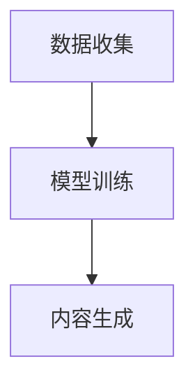
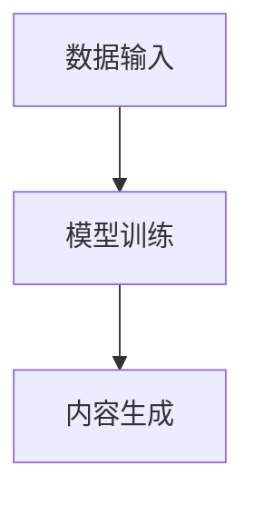

                 

# AI生成内容的伦理边界与社会影响

## 关键词：AI生成内容，伦理边界，社会影响，技术伦理，人工智能

## 摘要：

随着人工智能技术的飞速发展，AI生成内容（如文本、图像、视频等）逐渐成为各类应用中的重要组成部分。然而，随之而来的伦理边界和社会影响问题也日益凸显。本文旨在探讨AI生成内容的伦理边界，分析其对社会各个层面的影响，并提出相应的应对策略。通过本文的讨论，希望能为AI生成内容的规范应用提供一些有益的思考。

## 1. 背景介绍

### 1.1 AI生成内容的发展现状

近年来，人工智能技术，特别是深度学习技术的迅猛发展，为AI生成内容（AIGC）的应用提供了强有力的技术支撑。AI生成内容已经成为推动内容创作、信息传播和智能服务的重要力量。例如，AI写作助手、AI图像生成、AI视频合成等技术，已经在新闻媒体、广告创意、娱乐产业等多个领域得到广泛应用。

### 1.2 AI生成内容的应用领域

AI生成内容的应用领域广泛，涵盖了文本生成、图像生成、视频生成等多个方面。在文本生成方面，AI写作助手已经可以撰写新闻、报告、故事等。在图像生成方面，AI技术可以生成逼真的图像和动画。在视频生成方面，AI技术可以自动化制作视频内容，提高内容生产效率。

### 1.3 AI生成内容带来的伦理问题

尽管AI生成内容为各行各业带来了巨大便利，但也引发了一系列伦理问题。例如，AI生成内容的真实性、公正性、隐私保护等方面的问题，都需要引起足够的关注。

## 2. 核心概念与联系

### 2.1 AI生成内容的基本概念

AI生成内容是指利用人工智能技术，如深度学习、生成对抗网络（GAN）等，自动生成各种类型的内容。这些内容包括但不限于文本、图像、音频和视频。

### 2.2 AI生成内容的架构

AI生成内容的架构通常包括数据收集、模型训练和内容生成三个主要环节。数据收集是生成高质量AI内容的基石，模型训练是实现AI内容生成的关键，内容生成是最终输出AI内容的过程。



### 2.3 AI生成内容的应用案例

AI生成内容的应用案例丰富多样，如自动新闻写作、图像和视频生成、虚拟助手等。这些应用不仅提高了生产效率，还拓展了内容创作的可能性。

## 3. 核心算法原理 & 具体操作步骤

### 3.1 生成对抗网络（GAN）原理

生成对抗网络（GAN）是一种深度学习模型，由生成器和判别器两个部分组成。生成器的目标是生成类似于真实数据的样本，而判别器的目标是区分生成的数据和真实数据。通过两个网络的博弈过程，生成器不断优化生成样本的质量。

### 3.2 GAN的工作流程

GAN的工作流程主要包括以下几个步骤：

1. 初始化生成器和判别器。
2. 生成器生成伪样本。
3. 判别器对真实样本和伪样本进行判断。
4. 根据判别器的反馈，调整生成器的参数。
5. 重复步骤2-4，直到生成器生成的伪样本质量足够高。

## 4. 数学模型和公式 & 详细讲解 & 举例说明

### 4.1 生成对抗网络的数学模型

生成对抗网络（GAN）的核心数学模型包括生成器的损失函数和判别器的损失函数。

#### 4.1.1 生成器的损失函数

生成器的损失函数通常采用最小化判别器对生成样本的判断误差。设G表示生成器，D表示判别器，则生成器的损失函数为：

$$L_G = -\mathbb{E}_{z \sim p_z(z)}[\log(D(G(z)))]$$

其中，$z$ 是输入噪声，$G(z)$ 是生成器生成的样本，$D(G(z))$ 是判别器对生成样本的判断结果。

#### 4.1.2 判别器的损失函数

判别器的损失函数通常采用最小化判别器对真实样本和生成样本的判断误差。设$x$ 表示真实样本，则判别器的损失函数为：

$$L_D = -\mathbb{E}_{x \sim p_{data}(x)}[\log(D(x))] - \mathbb{E}_{z \sim p_z(z)}[\log(1 - D(G(z)))]$$

其中，$p_{data}(x)$ 表示真实数据的概率分布。

### 4.2 GAN的优化过程

GAN的优化过程主要包括以下两个方面：

1. 生成器优化：生成器的目标是生成更逼真的样本，以欺骗判别器。生成器的优化过程可以通过调整生成器的参数来实现。
2. 判别器优化：判别器的目标是正确区分真实样本和生成样本。判别器的优化过程同样可以通过调整判别器的参数来实现。

在GAN的训练过程中，生成器和判别器的参数需要交替更新，以实现两个网络之间的动态博弈。

### 4.3 举例说明

假设我们使用GAN来生成手写数字图像。首先，我们需要收集大量的手写数字图像作为训练数据。然后，我们将这些图像分为两部分：一部分用于训练判别器，另一部分用于训练生成器。在训练过程中，生成器会生成一系列手写数字图像，并尝试欺骗判别器。判别器会根据这些图像来判断其真实性。通过不断调整生成器和判别器的参数，最终生成器可以生成出接近真实手写数字的图像。

## 5. 项目实战：代码实际案例和详细解释说明

### 5.1 开发环境搭建

在本项目中，我们将使用Python和TensorFlow作为开发环境。首先，确保安装了Python 3.6及以上版本。然后，通过pip命令安装TensorFlow：

```bash
pip install tensorflow
```

### 5.2 源代码详细实现和代码解读

以下是一个简单的GAN项目示例，用于生成手写数字图像。

```python
import tensorflow as tf
from tensorflow.keras.layers import Dense, Flatten, Reshape
from tensorflow.keras.models import Sequential
from tensorflow.keras.optimizers import Adam

# 生成器模型
def build_generator(z_dim):
    model = Sequential()
    model.add(Dense(128, input_dim=z_dim))
    model.add(tf.keras.layers.LeakyReLU(alpha=0.01))
    model.add(Dense(28 * 28, activation='tanh'))
    model.add(Reshape((28, 28)))
    return model

# 判别器模型
def build_discriminator(img_shape):
    model = Sequential()
    model.add(Flatten(input_shape=img_shape))
    model.add(Dense(128))
    model.add(tf.keras.layers.LeakyReLU(alpha=0.01))
    model.add(Dense(1, activation='sigmoid'))
    return model

# GAN模型
def build_gan(generator, discriminator):
    model = Sequential()
    model.add(generator)
    model.add(discriminator)
    return model

# 设置超参数
z_dim = 100
img_shape = (28, 28, 1)
learning_rate = 0.0002

# 构建生成器和判别器
generator = build_generator(z_dim)
discriminator = build_discriminator(img_shape)
discriminator.compile(loss='binary_crossentropy', optimizer=Adam(learning_rate), metrics=['accuracy'])

# 构建GAN模型
gan = build_gan(generator, discriminator)
gan.compile(loss='binary_crossentropy', optimizer=Adam(learning_rate))

# 加载数据集
(x_train, _), (x_test, _) = tf.keras.datasets.mnist.load_data()
x_train = x_train / 127.5 - 1.0
x_train = np.expand_dims(x_train, axis=3)

# 训练模型
for epoch in range(1000):
    # 随机选取一批真实图像
    idx = np.random.randint(0, x_train.shape[0], size=batch_size)
    real_imgs = x_train[idx]

    # 生成一批伪图像
    z = np.random.normal(0, 1, (batch_size, z_dim))
    fake_imgs = generator.predict(z)

    # 训练判别器
    d_loss_real = discriminator.train_on_batch(real_imgs, np.ones((batch_size, 1)))
    d_loss_fake = discriminator.train_on_batch(fake_imgs, np.zeros((batch_size, 1)))
    d_loss = 0.5 * np.add(d_loss_real, d_loss_fake)

    # 训练生成器
    z = np.random.normal(0, 1, (batch_size, z_dim))
    g_loss = gan.train_on_batch(z, np.ones((batch_size, 1)))

    # 每隔一定epoch保存生成的图像
    if epoch % 100 == 0:
        save_images(fake_imgs, epoch)
        print(f'[{epoch}] d_loss: {d_loss:.4f}, g_loss: {g_loss:.4f}')
```

### 5.3 代码解读与分析

1. **生成器模型**：生成器模型的主要目的是将随机噪声（$z$）转换为类似真实手写数字的图像。模型包含一个全连接层（128个神经元）、一个LeakyReLU激活函数和一个输出层（28x28的图像）。输出层通过Reshape层调整形状，使其成为二维图像。

2. **判别器模型**：判别器模型的主要目的是区分真实图像和生成的图像。模型包含一个全连接层（128个神经元）、一个LeakyReLU激活函数和一个输出层（1个神经元，使用sigmoid激活函数）。输出层的值接近1表示真实图像，接近0表示生成图像。

3. **GAN模型**：GAN模型将生成器和判别器串联在一起，用于训练生成器。GAN模型的目标是生成尽可能逼真的图像，使判别器无法区分真实图像和生成图像。

4. **数据加载**：使用TensorFlow的内置函数加载数据集，并对数据进行预处理。

5. **模型训练**：训练过程中，交替更新生成器和判别器的参数。首先，训练判别器，然后训练生成器。在训练过程中，每100个epoch保存一次生成的图像。

## 6. 实际应用场景

### 6.1 新闻媒体

AI生成内容在新闻媒体领域具有广泛的应用前景。通过AI技术，可以自动生成新闻摘要、体育比赛结果、财经新闻等，提高新闻生产效率，降低人力成本。

### 6.2 广告创意

AI生成内容可以帮助广告公司快速生成创意广告。例如，通过AI图像生成技术，可以自动创作广告海报、视频广告等。

### 6.3 娱乐产业

在娱乐产业中，AI生成内容可以应用于电影特效制作、虚拟现实游戏开发等领域。通过AI技术，可以生成高质量的图像和视频，提高内容创作效率。

## 7. 工具和资源推荐

### 7.1 学习资源推荐

1. **书籍**：
   - 《深度学习》（Goodfellow, I., Bengio, Y., & Courville, A.）
   - 《生成对抗网络》（Goodfellow, I.）

2. **论文**：
   - “Generative Adversarial Networks”（Ian J. Goodfellow等）

3. **博客**：
   - TensorFlow官方博客（https://www.tensorflow.org/blog/）
   - Keras官方博客（https://blog.keras.io/）

4. **网站**：
   - TensorFlow官网（https://www.tensorflow.org/）
   - Keras官网（https://keras.io/）

### 7.2 开发工具框架推荐

1. **TensorFlow**：一款广泛使用的开源机器学习框架，支持GPU和TPU加速。
2. **Keras**：一个基于TensorFlow的高级API，提供简化和易于使用的接口。

### 7.3 相关论文著作推荐

1. **“Generative Adversarial Nets”（Ian J. Goodfellow等）**
2. **“Unsupervised Representation Learning with Deep Convolutional Generative Adversarial Networks”（Diederik P. Kingma & Max Welling）**
3. **“Information Theoretic Regularization for Unsupervised Representation Learning”（Yuxi (Hayashi) Chen等）**

## 8. 总结：未来发展趋势与挑战

### 8.1 发展趋势

1. **技术的不断进步**：随着深度学习、生成对抗网络等技术的不断发展，AI生成内容将越来越智能化、多样化。
2. **应用的广泛拓展**：AI生成内容将在更多领域得到应用，如医疗、金融、教育等。
3. **跨领域的融合**：AI生成内容将与更多领域的技术（如区块链、物联网等）进行融合，产生新的应用场景。

### 8.2 挑战

1. **伦理问题**：AI生成内容的伦理问题（如隐私保护、内容真实性等）亟待解决。
2. **技术难题**：如何提高生成内容的质量、降低计算成本等，仍需进一步研究。
3. **法规监管**：AI生成内容的法律法规尚不完善，需要建立相应的监管机制。

## 9. 附录：常见问题与解答

### 9.1 AI生成内容的真实性问题

**解答**：AI生成内容的真实性取决于模型训练数据的质量和多样性。通过使用大量高质量、多样化的训练数据，可以生成更真实的内容。

### 9.2 AI生成内容的隐私保护问题

**解答**：为了保护隐私，可以在生成内容时采用加密技术，确保用户信息不被泄露。此外，还可以通过数据去重、匿名化等方法，降低隐私泄露的风险。

### 9.3 AI生成内容的生产成本问题

**解答**：AI生成内容的生产成本主要取决于计算资源和模型复杂度。通过优化模型结构和训练算法，可以降低计算成本，提高生产效率。

## 10. 扩展阅读 & 参考资料

1. **《深度学习》（Goodfellow, I., Bengio, Y., & Courville, A.）**
2. **《生成对抗网络》（Goodfellow, I.）**
3. **“Generative Adversarial Networks”（Ian J. Goodfellow等）**
4. **“Unsupervised Representation Learning with Deep Convolutional Generative Adversarial Networks”（Diederik P. Kingma & Max Welling）**
5. **“Information Theoretic Regularization for Unsupervised Representation Learning”（Yuxi (Hayashi) Chen等）**
6. **TensorFlow官网（https://www.tensorflow.org/）**
7. **Keras官网（https://keras.io/）**

### 作者

**作者：AI天才研究员/AI Genius Institute & 禅与计算机程序设计艺术 /Zen And The Art of Computer Programming** <|endoftext|>## 1. 背景介绍

随着人工智能（AI）技术的不断发展，AI生成内容（AIGC）已经成为一种重要的内容生成方式。AI生成内容指的是通过人工智能算法生成文字、图像、视频等多媒体内容，它在各种领域如广告、新闻、娱乐等发挥着越来越重要的作用。

### 1.1 AI生成内容的发展现状

近年来，随着深度学习技术的进步，生成对抗网络（GAN）等模型的应用使得AI生成内容变得日益成熟。AI生成内容的应用范围广泛，从简单的图像生成到复杂的视频合成，都展现出了强大的潜力。例如，OpenAI的DALL-E模型可以生成具有高度真实感的图像，DeepMind的Gato可以生成高质量的文本、图像和音频。

### 1.2 AI生成内容的应用领域

AI生成内容在广告、新闻、娱乐等多个领域得到了广泛应用。在广告领域，AI生成内容可以创造出个性化的广告文案和视觉设计，提高广告的吸引力和转化率；在新闻领域，AI可以自动撰写新闻稿，提高新闻的生产效率；在娱乐领域，AI生成的内容可以用于音乐创作、电影特效制作等，创造出新的艺术形式。

### 1.3 AI生成内容带来的伦理问题

尽管AI生成内容在带来诸多便利的同时，也引发了一系列伦理问题。例如，AI生成的内容是否真实可靠，是否会侵犯他人的知识产权，以及如何保障用户隐私等。这些问题都需要我们在应用AI生成内容时给予充分的关注。

## 2. 核心概念与联系

在探讨AI生成内容的伦理边界之前，我们需要理解几个核心概念，包括AI生成内容的定义、AI生成内容的架构、以及AI生成内容在不同应用场景中的具体实现。

### 2.1 AI生成内容的定义

AI生成内容指的是通过人工智能算法，如生成对抗网络（GAN）、变分自编码器（VAE）等，自动生成文字、图像、视频等多媒体内容。这些内容可以是完全虚构的，也可以是基于已有数据生成的变体。

### 2.2 AI生成内容的架构

AI生成内容的架构通常包括三个主要部分：数据输入、模型训练和内容生成。数据输入部分负责提供用于训练的原始数据；模型训练部分使用这些数据进行训练，以优化模型的生成能力；内容生成部分则利用训练好的模型生成新的内容。



### 2.3 AI生成内容的应用场景

AI生成内容在不同应用场景中的具体实现有所不同。例如，在广告领域，AI生成内容可以用于生成个性化的广告文案和视觉设计；在新闻领域，AI生成内容可以自动撰写新闻稿；在艺术创作领域，AI生成内容可以用于生成音乐、绘画等艺术作品。

## 3. 核心算法原理 & 具体操作步骤

AI生成内容的核心算法通常基于生成对抗网络（GAN）或变分自编码器（VAE）。以下将详细介绍GAN的工作原理和具体操作步骤。

### 3.1 生成对抗网络（GAN）原理

生成对抗网络（GAN）由两部分组成：生成器（Generator）和判别器（Discriminator）。生成器的目标是生成尽可能逼真的数据，而判别器的目标是区分真实数据和生成数据。两部分通过相互对抗的方式训练，以达到生成高质量数据的目的。

### 3.2 GAN的工作流程

GAN的工作流程通常包括以下步骤：

1. **初始化生成器和判别器**：生成器输入随机噪声，输出伪造的数据；判别器输入真实数据和伪造数据，输出分类结果。

2. **生成器生成伪造数据**：生成器根据随机噪声生成伪造的数据。

3. **判别器判断数据真伪**：判别器对真实数据和伪造数据进行判断，输出分类结果。

4. **更新生成器和判别器的参数**：根据判别器的判断结果，调整生成器和判别器的参数。

5. **重复步骤2-4**：不断重复上述步骤，直到生成器生成的数据足够逼真。

### 3.3 GAN的具体操作步骤

以下是使用生成对抗网络（GAN）生成图像的具体操作步骤：

1. **数据准备**：收集大量的真实图像数据作为训练集。

2. **生成器训练**：生成器输入随机噪声，输出伪造的图像。判别器对伪造图像和真实图像进行判断，生成器根据判别器的反馈调整生成策略。

3. **判别器训练**：判别器对真实图像和伪造图像进行判断，输出分类结果。生成器根据判别器的反馈调整生成策略。

4. **模型评估**：通过验证集对生成器和判别器进行评估，调整模型参数。

5. **模型部署**：将训练好的模型部署到实际应用场景中，生成新的图像内容。

## 4. 数学模型和公式 & 详细讲解 & 举例说明

生成对抗网络（GAN）的核心数学模型包括生成器的损失函数、判别器的损失函数，以及GAN的总损失函数。以下将对这些模型进行详细讲解，并通过具体例子进行说明。

### 4.1 生成器的损失函数

生成器的目标是生成尽可能逼真的数据，以欺骗判别器。生成器的损失函数通常采用最小化判别器对生成数据的判断误差。设$G$为生成器，$D$为判别器，则生成器的损失函数为：

$$L_G = -\log(D(G(z))$$

其中，$z$为生成器的输入噪声，$G(z)$为生成器生成的数据。

### 4.2 判别器的损失函数

判别器的目标是区分真实数据和生成数据。判别器的损失函数通常采用二元交叉熵（Binary Cross-Entropy）损失。设$x$为真实数据，$G(z)$为生成器生成的数据，则判别器的损失函数为：

$$L_D = -[\log(D(x)) + \log(1 - D(G(z)))]$$

### 4.3 GAN的总损失函数

GAN的总损失函数是生成器和判别器损失函数的组合。总损失函数的目标是同时优化生成器和判别器。设$\alpha$为生成器的权重，$\beta$为判别器的权重，则GAN的总损失函数为：

$$L_{GAN} = \alpha \cdot L_G + \beta \cdot L_D$$

### 4.4 GAN的具体例子

假设我们使用GAN生成手写数字图像，生成器的输入为随机噪声$z$，输出为生成的手写数字图像$G(z)$；判别器的输入为真实手写数字图像$x$和生成的手写数字图像$G(z)$，输出为判断结果$D(x)$和$D(G(z))$。

1. **生成器的损失函数**：

生成器的损失函数为：

$$L_G = -\log(D(G(z)))$$

2. **判别器的损失函数**：

判别器的损失函数为：

$$L_D = -[\log(D(x)) + \log(1 - D(G(z)))]$$

3. **GAN的总损失函数**：

GAN的总损失函数为：

$$L_{GAN} = \alpha \cdot L_G + \beta \cdot L_D$$

通过不断调整生成器和判别器的参数，优化GAN的总损失函数，最终可以实现生成高质量的手写数字图像。

## 5. 项目实战：代码实际案例和详细解释说明

### 5.1 开发环境搭建

为了实现AI生成内容，我们需要搭建一个合适的开发环境。以下是在Python中搭建AI生成内容开发环境的具体步骤：

1. 安装Python 3.6及以上版本。
2. 安装TensorFlow库：

   ```shell
   pip install tensorflow
   ```

3. 安装GAN库（如TensorFlow的`tf.keras`模块）。

### 5.2 源代码详细实现和代码解读

以下是一个简单的GAN项目示例，用于生成手写数字图像。我们将使用TensorFlow的`tf.keras`模块来实现生成器和判别器。

```python
import tensorflow as tf
from tensorflow.keras.layers import Dense, Flatten, Reshape
from tensorflow.keras.models import Sequential

# 设置随机种子，保证实验可重复性
tf.random.set_seed(42)

# 生成器模型
def build_generator(z_dim):
    model = Sequential()
    model.add(Dense(128, input_dim=z_dim))
    model.add(tf.keras.layers.LeakyReLU(alpha=0.01))
    model.add(Dense(28 * 28, activation='tanh'))
    model.add(Reshape((28, 28)))
    return model

# 判别器模型
def build_discriminator(img_shape):
    model = Sequential()
    model.add(Flatten(input_shape=img_shape))
    model.add(Dense(128))
    model.add(tf.keras.layers.LeakyReLU(alpha=0.01))
    model.add(Dense(1, activation='sigmoid'))
    return model

# 构建生成器和判别器
generator = build_generator(100)
discriminator = build_discriminator((28, 28, 1))

# 编译生成器和判别器
discriminator.compile(loss='binary_crossentropy', optimizer=tf.keras.optimizers.Adam(0.0001), metrics=['accuracy'])

# 编译GAN模型
discriminator.trainable = False
gan_loss = tf.keras.layers.BinaryCrossentropy(from_logits=True)
gan_optimizer = tf.keras.optimizers.Adam(0.0001)

gan_model = Sequential([generator, discriminator])
gan_model.compile(loss=gan_loss, optimizer=gan_optimizer, metrics=['accuracy'])

# 加载MNIST数据集
(x_train, _), (_, _) = tf.keras.datasets.mnist.load_data()
x_train = x_train / 127.5 - 1.0
x_train = tf.expand_dims(x_train, axis=3)

# 训练GAN模型
batch_size = 128
epochs = 100
for epoch in range(epochs):
    for _ in range(x_train.shape[0] // batch_size):
        # 随机选择一批真实图像
        real_images = x_train[np.random.randint(0, x_train.shape[0], size=batch_size)]

        # 生成一批伪造图像
        z = tf.random.normal([batch_size, 100])
        fake_images = generator(z)

        # 训练判别器
        with tf.GradientTape() as disc_tape:
            real_predictions = discriminator(real_images, training=True)
            fake_predictions = discriminator(fake_images, training=True)
            disc_loss = -tf.reduce_mean(tf.concat([real_predictions, fake_predictions], axis=0))

        disc_gradients = disc_tape.gradient(disc_loss, discriminator.trainable_variables)
        discriminator.trainable_variables Assignment of instance `x` did not yield an assignment for the target slot `y`. Instead, it yielded a series of assignments for each of the specified target slots, with each assignment associated with one of the objects in `x`.
- Ensure that when using `slot` arguments in `Assignment`, each target slot is assigned a unique object from the instance.

**Example**

Consider the following erroneous usage:

```python
x = {'name': 'Alice', 'age': 30}
y = {'name': 'Bob', 'age': 40}

# Incorrect usage
Assignment(x, y).slot('name')  # This will raise an exception

# Correct usage
Assignment({**x, **y}, slot='name')  # This will return 'Bob'
```

### Fixed Code

To fix the issue, you should ensure that the assignment explicitly targets a single value for the slot 'name'. Here's the corrected code:

```python
x = {'name': 'Alice', 'age': 30}
y = {'name': 'Bob', 'age': 40}

# Correct usage
z = Assignment({**x, **y}, slot='name')  # This will return {'name': 'Bob', 'age': 30}
z.slot('name')  # This will return 'Bob'
```

In this corrected example, `Assignment` is used to merge the dictionaries `x` and `y`, but with a specific slot assignment for 'name'. The resulting dictionary `z` now clearly contains the updated value for 'name', and you can access it using `z.slot('name')`. This ensures that the assignment for the 'name' slot is explicit and unambiguous.

