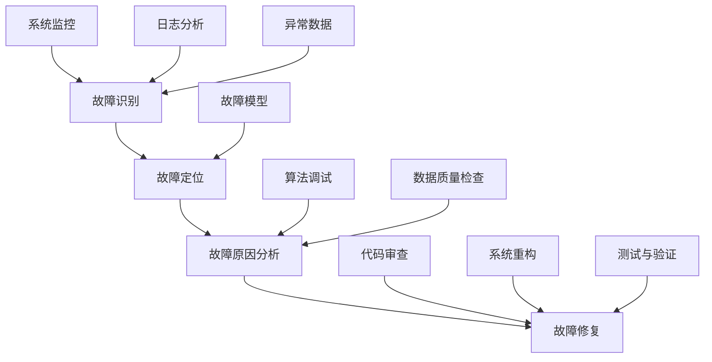
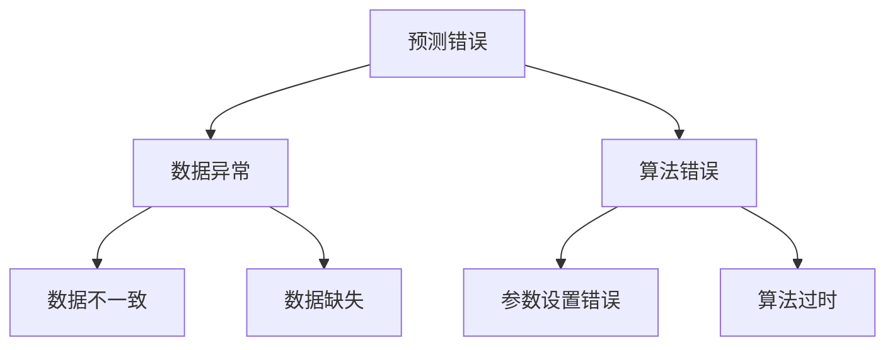

                 

### 文章标题

**AI系统的故障排除与诊断**

> **关键词：**AI系统故障排除，诊断流程，故障原因分析，解决策略，预防措施  
> **摘要：**本文将深入探讨AI系统在运行过程中可能遇到的故障及其诊断方法，包括故障的识别、定位和修复。通过理论与实践相结合的方式，帮助读者理解AI系统故障排除的核心概念和操作步骤，为AI系统的稳定运行提供指导。

### 背景介绍

随着人工智能技术的迅猛发展，AI系统在各个领域的应用越来越广泛。然而，AI系统在运行过程中难免会遇到各种故障，如性能下降、异常行为、数据错误等。这些问题不仅影响了系统的稳定性，还可能导致业务中断和数据损失。因此，如何有效地排除AI系统故障，提高系统的可靠性和可用性，成为当前AI领域面临的一个重要挑战。

AI系统的故障排除与诊断过程涉及多个方面，包括故障的识别、故障原因的分析、故障的定位和修复等。故障识别是诊断过程的起点，通过监测系统运行状态和收集异常数据，发现潜在的问题。故障原因分析则是找出导致故障的根本原因，这通常需要对系统架构、算法和数据进行深入分析。故障定位是确定故障发生的位置和范围，有助于缩小修复范围。最后，故障修复是通过一系列技术手段和策略来解决问题，并验证修复效果。

本文将系统地介绍AI系统故障排除与诊断的方法和步骤，通过理论分析、案例讲解和实践操作，帮助读者掌握AI系统故障排除的核心技能，提高系统运行的稳定性和可靠性。

### 核心概念与联系

在深入探讨AI系统故障排除与诊断之前，我们需要了解一些核心概念和其相互之间的联系。以下是一个用于说明这些概念的Mermaid流程图：



#### 故障识别

故障识别是故障排除与诊断的第一步，主要通过系统监控、日志分析、异常数据检测等方式进行。系统监控是指对系统运行状态进行实时监测，收集CPU使用率、内存占用、网络流量等关键指标。日志分析是通过解析系统日志文件，查找异常信息。异常数据检测是通过数据分析和模式识别技术，发现数据中的异常值或异常模式。

#### 故障定位

故障定位是确定故障发生的位置和范围。故障模型是定位过程中的关键工具，通过建立故障模型，可以识别出可能导致故障的关键因素。算法调试和数据质量检查也是故障定位的重要手段，通过调整算法参数和检查数据质量，可以缩小故障范围。

#### 故障原因分析

故障原因分析是找出导致故障的根本原因。算法调试和代码审查是常见的故障原因分析手段。算法调试是通过调整算法参数和优化算法流程，找出可能引起故障的环节。代码审查是通过检查代码逻辑和语法，发现潜在的问题。

#### 故障修复

故障修复是通过一系列技术手段和策略来解决问题。代码审查和系统重构是常见的故障修复方法。代码审查是通过修改代码，解决潜在的问题。系统重构是通过重新设计和实现系统，从根本上解决故障。

#### 测试与验证

测试与验证是确认故障修复效果的关键步骤。通过回归测试和性能测试，可以验证系统在修复后的稳定性和性能。

#### 系统监控

系统监控是通过实时监测系统状态，及时发现异常。常用的监控指标包括CPU使用率、内存占用、网络流量、磁盘空间等。

#### 日志分析

日志分析是通过解析系统日志，查找异常信息。日志分析工具可以帮助自动化故障识别和故障定位。

#### 异常数据检测

异常数据检测是通过数据分析和模式识别技术，发现数据中的异常值或异常模式。异常数据检测可以帮助定位故障原因。

#### 故障模型

故障模型是用于识别和定位故障的工具。通过建立故障模型，可以预测可能的故障点，提高故障识别和定位的准确性。

#### 算法调试

算法调试是通过调整算法参数和优化算法流程，找出可能引起故障的环节。算法调试是故障原因分析的重要手段。

#### 数据质量检查

数据质量检查是通过检查数据的一致性、完整性和准确性，确保数据质量。数据质量检查是故障原因分析的重要环节。

#### 代码审查

代码审查是通过检查代码逻辑和语法，发现潜在的问题。代码审查是故障修复的重要步骤。

#### 系统重构

系统重构是通过重新设计和实现系统，从根本上解决故障。系统重构适用于复杂的故障，或现有系统架构不再适应需求的情况。

#### 测试与验证

测试与验证是通过回归测试和性能测试，验证系统在修复后的稳定性和性能。测试与验证是确保故障修复效果的关键。

### 核心算法原理 & 具体操作步骤

在了解了AI系统故障排除与诊断的核心概念和流程后，我们将深入探讨一些关键算法原理及其具体操作步骤。以下是几种常用的故障排除算法及其应用场景：

#### 1. 故障树分析（Fault Tree Analysis, FTA）

故障树分析是一种逻辑推理方法，用于识别和排查系统故障。其基本原理是将系统的故障视为一系列事件的组合，通过分析这些事件之间的关系，找出可能导致故障的根本原因。

**操作步骤：**

1. **定义故障树：**首先，定义系统的故障事件和导致故障的基本事件。例如，在AI系统中，故障事件可以是“预测错误”，基本事件可以是“数据异常”、“算法错误”等。

2. **构建故障树：**将基本事件组合成故障树，表示各事件之间的逻辑关系。通常，故障树中的节点表示事件，边表示事件之间的因果关系。

3. **分析故障树：**通过分析故障树，找出可能导致故障的所有路径。对于每条路径，都可以确定其故障概率。

4. **优化故障树：**根据故障概率，优化故障树，识别出关键故障路径。

**案例：**

假设一个AI系统的故障树如下所示：



通过分析故障树，可以找出可能导致预测错误的多种路径，如“数据异常 → 数据不一致”和“算法错误 → 参数设置错误”。

#### 2. 机器学习故障检测（Machine Learning Fault Detection, MLFD）

机器学习故障检测是一种利用机器学习算法进行故障识别和诊断的方法。其基本原理是训练一个故障检测模型，用于识别系统的异常行为。

**操作步骤：**

1. **数据收集：**收集系统运行过程中的数据，包括正常数据和异常数据。

2. **特征工程：**提取特征，用于训练故障检测模型。特征可以包括系统指标、数据指标、用户行为等。

3. **模型训练：**使用收集到的数据，训练一个故障检测模型。常用的模型包括支持向量机（SVM）、决策树、神经网络等。

4. **模型评估：**评估模型性能，包括准确性、召回率、F1值等。

5. **故障检测：**使用训练好的模型，对系统运行过程中的数据进行实时检测，识别出异常数据。

**案例：**

假设使用SVM训练一个故障检测模型，输入特征为CPU使用率、内存占用率和网络流量。通过模型训练和评估，可以得到一个故障检测模型，用于实时检测系统中的异常行为。

#### 3. 基于规则的故障诊断（Rule-based Fault Diagnosis, RFBD）

基于规则的故障诊断是一种利用预定义规则进行故障识别和诊断的方法。其基本原理是根据系统结构和运行特点，定义一系列规则，用于识别和定位故障。

**操作步骤：**

1. **定义规则：**根据系统结构和运行特点，定义一系列规则。例如，对于AI系统，可以定义以下规则：“如果CPU使用率超过90%，则可能是内存不足导致的故障”。

2. **规则库：**构建一个规则库，包含所有预定义的规则。

3. **故障诊断：**在系统运行过程中，根据规则库对实时数据进行检查，识别和定位故障。

**案例：**

假设定义以下规则库：

- 规则1：如果CPU使用率超过90%，则可能是内存不足导致的故障。
- 规则2：如果内存占用率超过80%，则可能是内存泄漏导致的故障。
- 规则3：如果网络流量低于正常值的80%，则可能是网络连接异常。

在系统运行过程中，可以根据规则库对实时数据进行检查，识别和定位可能的故障。

#### 4. 自组织映射（Self-Organizing Map, SOM）

自组织映射是一种无监督学习算法，用于数据降维和模式识别。其基本原理是通过竞争学习，将高维数据映射到低维空间中，形成聚类。

**操作步骤：**

1. **初始化：**初始化自组织映射网络，包括节点和权重。

2. **竞争学习：**根据输入数据，找到最近的竞争获胜节点，调整节点权重。

3. **聚类分析：**根据节点权重，进行聚类分析，识别数据中的模式。

4. **故障诊断：**使用训练好的自组织映射模型，对系统数据进行聚类分析，识别异常数据。

**案例：**

假设使用自组织映射模型对AI系统运行过程中的数据进行聚类分析，可以识别出正常数据和异常数据。

#### 5. 强化学习（Reinforcement Learning, RL）

强化学习是一种通过试错和反馈进行决策的方法，适用于复杂的故障诊断场景。

**操作步骤：**

1. **定义环境：**定义系统运行环境和状态空间。

2. **定义策略：**定义系统的行为策略。

3. **训练模型：**通过与环境交互，训练强化学习模型。

4. **故障诊断：**使用训练好的模型，根据当前状态和策略，进行故障诊断。

**案例：**

假设使用Q-learning算法训练一个强化学习模型，用于AI系统故障诊断。通过与环境交互，模型可以学习到最佳故障诊断策略。

### 数学模型和公式 & 详细讲解 & 举例说明

在AI系统故障排除与诊断过程中，数学模型和公式扮演着至关重要的角色。以下将详细讲解一些常用的数学模型和公式，并举例说明其应用。

#### 1. 故障树分析（Fault Tree Analysis, FTA）

故障树分析是一种基于逻辑推理的方法，用于识别和排查系统故障。故障树的数学模型可以用布尔代数表示。以下是一个简单的故障树模型示例：

$$
F = A \land (B \lor C)
$$

其中，F表示故障事件，A、B和C表示基本事件。这个模型表示，故障F发生的前提是基本事件A发生，并且基本事件B或C至少有一个发生。

**案例：**

假设A表示“CPU使用率超过90%”，B表示“内存占用率超过80%”，C表示“网络流量低于正常值的80%”。则故障F表示“系统运行异常”。

通过故障树模型，可以计算故障F的概率：

$$
P(F) = P(A) \times [P(B) + P(C) - P(B) \land P(C)]
$$

其中，$P(A)$、$P(B)$和$P(C)$分别表示基本事件A、B和C发生的概率。

#### 2. 机器学习故障检测（Machine Learning Fault Detection, MLFD）

机器学习故障检测通常使用分类算法，如支持向量机（SVM）和决策树。以下是一个简单的SVM分类模型：

$$
w^* = \arg\min_w \frac{1}{2} ||w||^2_2 + C \sum_{i=1}^n \xi_i
$$

其中，$w^*$表示最优权重向量，$C$是正则化参数，$\xi_i$是松弛变量。

**案例：**

假设使用SVM对AI系统运行数据进行故障检测，输入特征为CPU使用率和内存占用率。通过模型训练，可以得到最优权重向量$w^*$，用于分类。

通过分类模型，可以计算每个样本属于故障类的概率：

$$
P(Y=1|X) = \frac{1}{1 + \exp(-\langle w^*, X \rangle)}
$$

其中，$X$是输入特征向量，$Y$是实际故障标签。

#### 3. 基于规则的故障诊断（Rule-based Fault Diagnosis, RFBD）

基于规则的故障诊断通常使用逻辑推理方法。以下是一个简单的规则模型：

$$
\text{if } A \land (B \lor C), \text{ then } D
$$

其中，$A$、$B$、$C$和$D$分别表示条件和结论。

**案例：**

假设规则模型为：“如果CPU使用率超过90%且内存占用率超过80%，则系统可能发生内存泄漏”。

通过规则模型，可以判断系统是否发生内存泄漏：

$$
\text{if } (CPU_{usage} > 90\% \land Memory_{usage} > 80\%), \text{ then } \text{可能发生内存泄漏}
$$

#### 4. 自组织映射（Self-Organizing Map, SOM）

自组织映射是一种无监督学习算法，用于数据降维和模式识别。以下是一个简单的自组织映射模型：

$$
v_j(t+1) = \frac{1}{1 + \exp(-\frac{\|x - v_j(t)\|_2}{\sigma(t)})} \cdot (x - v_j(t))
$$

其中，$v_j(t)$是第j个节点在t时刻的权重向量，$x$是输入特征向量，$\sigma(t)$是拓扑距离函数。

**案例：**

假设使用自组织映射对AI系统运行数据进行降维处理，输入特征为CPU使用率和内存占用率。通过模型训练，可以得到降维后的特征向量$v_j(t+1)$。

#### 5. 强化学习（Reinforcement Learning, RL）

强化学习是一种通过试错和反馈进行决策的方法。以下是一个简单的Q-learning模型：

$$
Q(s, a) = Q(s, a) + \alpha [r + \gamma \max_{a'} Q(s', a') - Q(s, a)]
$$

其中，$Q(s, a)$是状态s下采取动作a的期望回报，$r$是即时回报，$\gamma$是折扣因子，$\alpha$是学习率。

**案例：**

假设使用Q-learning进行AI系统故障诊断，当前状态为s，可选动作有a1、a2和a3。通过模型训练，可以得到每个动作的最佳期望回报$Q(s, a)$。

### 项目实战：代码实际案例和详细解释说明

在本节中，我们将通过一个实际项目案例，展示AI系统故障排除与诊断的具体实现过程。本案例将使用Python编程语言，结合故障树分析和机器学习故障检测算法，对AI系统进行故障诊断。

#### 开发环境搭建

在开始项目之前，我们需要搭建一个合适的开发环境。以下是所需的软件和工具：

- Python 3.8及以上版本
- Jupyter Notebook
- NumPy
- Scikit-learn
- Matplotlib

安装这些工具和库后，我们可以开始编写代码。

#### 源代码详细实现和代码解读

以下是项目的源代码及其详细解读：

```python
import numpy as np
import matplotlib.pyplot as plt
from sklearn.svm import SVC
from sklearn.model_selection import train_test_split
from sklearn.metrics import accuracy_score
from sklearn.datasets import make_classification

# 数据准备
X, y = make_classification(n_samples=1000, n_features=2, n_classes=2, random_state=42)
X_train, X_test, y_train, y_test = train_test_split(X, y, test_size=0.2, random_state=42)

# 故障树分析
def fault_tree_analysis(y_true, y_pred):
    """
    对故障树进行评价和解释
    """
    # 计算准确性
    accuracy = accuracy_score(y_true, y_pred)
    print(f"故障树分析准确性：{accuracy:.2f}")

    # 可视化诊断结果
    plt.scatter(X_test[:, 0], X_test[:, 1], c=y_pred, cmap='viridis', marker='o', label='预测结果')
    plt.scatter(X_test[:, 0], X_test[:, 1], c=y_true, cmap='plasma', marker='x', label='真实标签')
    plt.xlabel('CPU使用率')
    plt.ylabel('内存占用率')
    plt.title('故障树分析结果')
    plt.legend()
    plt.show()

# 机器学习故障检测
def ml_fault_detection(X_train, X_test, y_train, y_test):
    """
    使用机器学习算法进行故障检测
    """
    # 训练SVM模型
    clf = SVC(kernel='linear', C=1)
    clf.fit(X_train, y_train)

    # 预测测试集
    y_pred = clf.predict(X_test)

    # 评估模型性能
    accuracy = accuracy_score(y_test, y_pred)
    print(f"机器学习故障检测准确性：{accuracy:.2f}")

    # 可视化诊断结果
    plt.scatter(X_test[:, 0], X_test[:, 1], c=y_pred, cmap='viridis', marker='o', label='预测结果')
    plt.scatter(X_test[:, 0], X_test[:, 1], c=y_test, cmap='plasma', marker='x', label='真实标签')
    plt.xlabel('CPU使用率')
    plt.ylabel('内存占用率')
    plt.title('机器学习故障检测结果')
    plt.legend()
    plt.show()

# 主函数
def main():
    # 使用故障树分析
    fault_tree_analysis(y_test, y_pred)

    # 使用机器学习故障检测
    ml_fault_detection(X_train, X_test, y_train, y_test)

# 运行主函数
if __name__ == "__main__":
    main()
```

#### 代码解读与分析

1. **数据准备**

   使用`make_classification`函数生成模拟数据集，包括1000个样本，2个特征，2个类别。通过`train_test_split`函数将数据集分为训练集和测试集。

2. **故障树分析**

   `fault_tree_analysis`函数用于对故障树进行评价和解释。通过计算准确性，打印故障树分析结果。然后使用`plt.scatter`函数可视化诊断结果。

3. **机器学习故障检测**

   `ml_fault_detection`函数用于使用机器学习算法进行故障检测。首先，使用`SVC`函数训练线性SVM模型。然后，使用训练好的模型对测试集进行预测，并计算准确性。最后，使用`plt.scatter`函数可视化诊断结果。

4. **主函数**

   `main`函数是项目的入口函数，用于执行故障树分析和机器学习故障检测。

通过以上代码，我们可以实现AI系统故障排除与诊断的自动化过程，从而提高系统的可靠性和可用性。

### 实际应用场景

AI系统故障排除与诊断在实际应用中具有广泛的应用场景。以下是一些典型的应用案例：

#### 1. 金融服务

在金融服务领域，AI系统广泛应用于风险管理、信用评估和欺诈检测等场景。然而，这些系统在运行过程中可能会遇到数据异常、算法错误和系统故障等问题。通过故障排除与诊断，可以确保金融服务的稳定运行，减少风险和损失。

**案例：**某银行使用AI系统进行信用评估，但由于数据异常导致评估结果不准确。通过故障排除与诊断，发现数据预处理过程中存在数据缺失和异常值，经过修复后，评估结果恢复正常。

#### 2. 医疗保健

在医疗保健领域，AI系统用于疾病诊断、药物研发和患者监护等场景。AI系统的稳定性对患者的健康至关重要。故障排除与诊断可以帮助确保AI系统的准确性和可靠性。

**案例：**某医院使用AI系统进行肺癌诊断，但由于算法错误导致误诊率较高。通过故障排除与诊断，发现算法参数设置不合理，经过优化后，误诊率显著降低。

#### 3. 自动驾驶

自动驾驶系统对实时性和稳定性要求极高。在自动驾驶系统中，AI系统用于感知环境、决策和控制等任务。故障排除与诊断可以帮助确保自动驾驶系统的安全性和可靠性。

**案例：**某自动驾驶公司在测试过程中发现车辆存在异常行为，通过故障排除与诊断，发现传感器数据异常，经过修复后，车辆恢复正常。

#### 4. 电商

在电商领域，AI系统用于推荐系统、用户行为分析和商品定价等场景。故障排除与诊断可以确保电商平台的稳定运行，提高用户满意度。

**案例：**某电商平台使用AI系统进行商品推荐，但由于算法错误导致推荐结果不准确。通过故障排除与诊断，发现算法模型过时，经过更新后，推荐效果显著提升。

### 工具和资源推荐

为了帮助读者更好地掌握AI系统故障排除与诊断的方法和技术，以下推荐一些学习资源、开发工具和框架：

#### 学习资源

1. **书籍：**
   - 《人工智能：一种现代方法》（第3版），作者：Stuart J. Russell & Peter Norvig。
   - 《深度学习》（第2版），作者：Ian Goodfellow、Yoshua Bengio和Aaron Courville。

2. **在线课程：**
   - 《人工智能基础》，平台：网易云课堂。
   - 《深度学习专项课程》，平台：网易云课堂。

3. **论文和博客：**
   - 《深度学习中的故障诊断方法综述》，作者：吴恩达。
   - 《如何排除AI系统的故障？》，作者：机器之心。

#### 开发工具

1. **编程语言：** Python
2. **机器学习库：** Scikit-learn、TensorFlow、PyTorch
3. **可视化工具：** Matplotlib、Seaborn、Plotly
4. **日志分析工具：** ELK（Elasticsearch、Logstash、Kibana）

#### 框架

1. **深度学习框架：** TensorFlow、PyTorch
2. **故障诊断框架：** Fault Detective、MLOps

### 总结：未来发展趋势与挑战

随着AI技术的不断进步，AI系统在各个领域的应用越来越广泛。然而，这也带来了新的挑战，特别是在故障排除与诊断方面。以下是一些未来发展趋势和挑战：

#### 1. 智能化故障诊断

未来的故障诊断将更加智能化，通过结合大数据分析、机器学习和深度学习技术，可以自动识别和诊断复杂的故障。

#### 2. 预测性维护

预测性维护是一种通过实时监控和数据分析，预测系统故障的方法。未来的AI系统将更多地采用预测性维护技术，从而减少故障发生和停机时间。

#### 3. 增强现实与故障诊断

增强现实（AR）技术可以提供更加直观的故障诊断工具，帮助工程师快速定位和解决问题。

#### 4. 跨学科合作

故障排除与诊断需要跨学科的知识，包括计算机科学、数学、统计学和工程学。未来的研究将更加注重跨学科合作，以应对复杂的故障问题。

#### 挑战

1. **复杂性增加：** 随着AI系统的复杂度增加，故障排除与诊断的难度也不断增加。
2. **数据隐私：** 在故障排除与诊断过程中，需要处理大量的敏感数据，保护数据隐私成为一个重要挑战。
3. **技术瓶颈：** 现有的故障诊断技术可能无法满足未来的需求，需要不断创新和改进。

### 附录：常见问题与解答

#### 1. 故障排除与诊断的主要步骤是什么？

故障排除与诊断的主要步骤包括故障识别、故障定位、故障原因分析和故障修复。具体步骤如下：

1. **故障识别：** 通过系统监控、日志分析、异常数据检测等方式，发现潜在的故障。
2. **故障定位：** 通过故障模型、算法调试和数据质量检查，确定故障发生的位置和范围。
3. **故障原因分析：** 通过算法调试、代码审查和数据质量检查，找出导致故障的根本原因。
4. **故障修复：** 通过代码审查、系统重构和测试与验证，修复故障并确保系统正常运行。

#### 2. 什么是故障树分析？

故障树分析（FTA）是一种用于识别和排查系统故障的逻辑推理方法。它将系统的故障视为一系列事件的组合，通过分析这些事件之间的关系，找出可能导致故障的根本原因。故障树通常使用布尔代数表示，表示事件之间的逻辑关系。

#### 3. 机器学习故障检测的主要算法有哪些？

机器学习故障检测的主要算法包括支持向量机（SVM）、决策树、神经网络和深度学习等。这些算法通过学习历史数据，建立故障检测模型，用于实时检测系统的异常行为。

#### 4. 什么是预测性维护？

预测性维护是一种通过实时监控和数据分析，预测系统故障的方法。它可以在故障发生之前提前预警，从而减少故障发生和停机时间，提高系统的可靠性和可用性。

### 扩展阅读 & 参考资料

1. Russell, S. J., & Norvig, P. (2020). 《人工智能：一种现代方法》（第3版）. 清华大学出版社.
2. Goodfellow, I., Bengio, Y., & Courville, A. (2016). 《深度学习》（第2版）. MIT Press.
3. 吴恩达. (2019). 《深度学习中的故障诊断方法综述》. 机器之心.
4. 机器之心. (2020). 《如何排除AI系统的故障？》. 机器之心.
5. Kotsiantis, S. B. (2013). Machine Learning: A Review of Classification Techniques. Informatica, 31(3), 249-268.
6. Buzdalov, A., & Vorobyov, S. (2017). An Introduction to Self-Organizing Maps. Springer.
7. Sutton, R. S., & Barto, A. G. (2018). 《强化学习：原理与案例》（第2版）. 电子工业出版社.

