                 

# AI系统的高可用性架构

> **关键词：** AI系统，高可用性，架构，核心算法，数学模型，实战案例，实际应用场景，工具推荐

> **摘要：** 本文将深入探讨AI系统的高可用性架构，从核心概念到实际应用场景进行全面剖析。我们将介绍高可用性架构的重要性，核心算法原理，数学模型和公式，以及代码实现和实战案例。最后，我们将讨论未来发展趋势与挑战，并提供相关工具和资源的推荐。

## 1. 背景介绍

随着人工智能技术的迅猛发展，AI系统在各个领域得到了广泛应用，如自动驾驶、智能客服、金融风控等。然而，AI系统的可靠性问题成为制约其广泛应用的主要瓶颈。高可用性（High Availability，简称HA）是确保系统稳定运行的关键特性。高可用性架构旨在确保系统在面临各种故障情况下，能够快速恢复，最小化业务中断时间。

高可用性架构的核心目标是实现系统的高可靠性、稳定性和可扩展性。为了实现这一目标，需要从以下几个方面进行设计和优化：

1. **容错性**：系统能够在故障发生时，自动切换到备用节点或备份系统中，确保业务连续性。
2. **负载均衡**：通过合理分配负载，避免单点过载，提高系统整体性能。
3. **数据备份和恢复**：定期备份系统数据，确保在数据丢失或损坏时，能够快速恢复。
4. **监控和告警**：实时监控系统运行状态，及时发现和处理异常情况。

## 2. 核心概念与联系

为了构建高可用性AI系统，需要理解以下几个核心概念：

### 2.1 容错性

容错性是指系统在故障发生时，能够自动恢复到正常状态，继续提供服务的能力。实现容错性主要有以下几种方式：

1. **故障转移**：当主节点出现故障时，系统自动将任务转移到备用节点，确保业务不中断。
2. **冗余**：通过在系统中引入冗余节点或组件，提高系统的容错能力。
3. **自愈**：系统在检测到故障时，能够自动进行修复，无需人工干预。

### 2.2 负载均衡

负载均衡是将系统负载分配到多个节点或组件上，避免单点过载，提高系统性能。负载均衡的实现方式主要有以下几种：

1. **轮询调度**：按照顺序将请求分配到各个节点。
2. **权重调度**：根据节点的性能和负载，动态调整请求分配。
3. **最少连接调度**：将请求分配到当前连接数最少的节点。

### 2.3 数据备份和恢复

数据备份和恢复是确保系统数据安全的关键措施。备份策略主要有以下几种：

1. **全量备份**：对整个系统进行备份。
2. **增量备份**：只备份发生变化的数据。
3. **差异备份**：备份自上次全量备份以来发生的变化。

恢复策略主要有以下几种：

1. **本地恢复**：在本地进行数据恢复。
2. **远程恢复**：从远程服务器或备份存储中恢复数据。
3. **热备份**：在备份过程中，系统继续提供服务。

### 2.4 监控和告警

监控和告警是实时监控系统运行状态，及时发现和处理异常情况的关键。监控指标主要包括：

1. **CPU使用率**：CPU的负载情况。
2. **内存使用率**：内存的占用情况。
3. **磁盘使用率**：磁盘的占用情况。
4. **网络延迟**：网络的延迟情况。

告警机制主要包括：

1. **邮件告警**：通过邮件发送告警信息。
2. **短信告警**：通过短信发送告警信息。
3. **即时通讯告警**：通过即时通讯工具发送告警信息。

## 3. 核心算法原理 & 具体操作步骤

### 3.1 故障转移算法

故障转移算法主要分为以下几步：

1. **监控**：定期监控主节点的状态。
2. **检测**：当检测到主节点出现故障时，标记为主节点不可用。
3. **切换**：将任务自动转移到备用节点。
4. **恢复**：在备用节点上运行任务，确保业务不中断。

### 3.2 负载均衡算法

负载均衡算法主要分为以下几步：

1. **统计**：统计各个节点的负载情况。
2. **调度**：根据负载情况，将请求分配到负载较低的节点。
3. **动态调整**：根据节点的实时负载，动态调整请求分配。

### 3.3 数据备份和恢复算法

数据备份和恢复算法主要分为以下几步：

1. **备份**：定期执行备份操作，将数据存储到备份存储中。
2. **恢复**：当需要恢复数据时，从备份存储中提取数据，并进行恢复。

### 3.4 监控和告警算法

监控和告警算法主要分为以下几步：

1. **采集**：定期采集系统监控指标。
2. **分析**：分析监控指标，判断是否存在异常。
3. **告警**：当检测到异常时，通过邮件、短信或即时通讯工具发送告警信息。

## 4. 数学模型和公式 & 详细讲解 & 举例说明

### 4.1 故障转移算法的数学模型

故障转移算法的数学模型主要涉及以下几个参数：

1. **故障概率（P）**：主节点在一段时间内出现故障的概率。
2. **切换时间（T）**：从检测到故障到切换到备用节点所需的时间。
3. **恢复时间（R）**：备用节点从启动到恢复正常所需的时间。

故障转移算法的数学模型如下：

$$
F(t) = P \times (T + R) + (1 - P) \times T
$$

其中，$F(t)$表示在时间$t$内，系统出现故障的概率。

### 4.2 负载均衡算法的数学模型

负载均衡算法的数学模型主要涉及以下几个参数：

1. **节点数（N）**：系统的节点总数。
2. **请求量（Q）**：在一段时间内，系统接收到的请求总量。
3. **负载阈值（L）**：节点的最大负载。

负载均衡算法的数学模型如下：

$$
\text{请求分配} = \left\{
\begin{aligned}
&\text{最小负载节点} && \text{当当前请求量} < \text{负载阈值} \\
&\text{随机选择节点} && \text{当当前请求量} \geq \text{负载阈值}
\end{aligned}
\right.
$$

### 4.3 数据备份和恢复算法的数学模型

数据备份和恢复算法的数学模型主要涉及以下几个参数：

1. **备份频率（F）**：备份操作的执行频率。
2. **备份时间（B）**：备份操作所需的时间。
3. **恢复时间（R）**：恢复操作所需的时间。

数据备份和恢复算法的数学模型如下：

$$
\text{备份方案} = \text{全量备份} + \text{增量备份} + \text{差异备份}
$$

### 4.4 监控和告警算法的数学模型

监控和告警算法的数学模型主要涉及以下几个参数：

1. **监控周期（C）**：监控操作的执行周期。
2. **告警阈值（T）**：触发告警的阈值。

监控和告警算法的数学模型如下：

$$
\text{监控结果} = \text{指标分析} \times (\text{当前指标} - \text{告警阈值})
$$

其中，当$\text{监控结果}$大于0时，触发告警。

## 5. 项目实战：代码实际案例和详细解释说明

### 5.1 开发环境搭建

为了更好地理解和实践高可用性架构，我们将在本地搭建一个简单的AI系统环境。以下是开发环境的搭建步骤：

1. 安装Python环境。
2. 安装必要的依赖库，如TensorFlow、Keras等。
3. 配置负载均衡器和故障转移组件，如Nginx、Keepalived等。

### 5.2 源代码详细实现和代码解读

以下是实现高可用性架构的示例代码：

```python
# 导入必要的库
import tensorflow as tf
import keras
from keras.models import Sequential
from keras.layers import Dense, Dropout, Activation, Flatten
from keras.layers import Conv2D, MaxPooling2D
import numpy as np

# 加载训练数据
(x_train, y_train), (x_test, y_test) = keras.datasets.mnist.load_data()

# 预处理数据
x_train = x_train.astype('float32') / 255.0
x_test = x_test.astype('float32') / 255.0
x_train = np.reshape(x_train, (x_train.shape[0], 28, 28, 1))
x_test = np.reshape(x_test, (x_test.shape[0], 28, 28, 1))

# 构建模型
model = Sequential()
model.add(Conv2D(32, (3, 3), input_shape=(28, 28, 1)))
model.add(Activation('relu'))
model.add(MaxPooling2D(pool_size=(2, 2)))
model.add(Conv2D(64, (3, 3)))
model.add(Activation('relu'))
model.add(MaxPooling2D(pool_size=(2, 2)))
model.add(Flatten())
model.add(Dense(64))
model.add(Activation('relu'))
model.add(Dropout(0.5))
model.add(Dense(10))
model.add(Activation('softmax'))

# 编译模型
model.compile(loss='categorical_crossentropy',
              optimizer='adam',
              metrics=['accuracy'])

# 训练模型
model.fit(x_train, y_train, batch_size=128, epochs=10, validation_data=(x_test, y_test))

# 故障转移
def fault_transfer():
    # 检测主节点状态
    if not is_node_alive('main'):
        # 切换到备用节点
        switch_to_backup_node('backup')

# 负载均衡
def load_balance():
    # 统计节点负载
    node_loads = get_node_loads()
    # 调度请求
    for request in requests:
        target_node = min(node_loads, key=node_loads.get)
        send_request_to(target_node, request)

# 数据备份
def data_backup():
    # 执行备份操作
    backup_data()

# 恢复数据
def data_recovery():
    # 执行恢复操作
    recover_data()

# 监控和告警
def monitor_and_alert():
    # 采集监控指标
    metrics = collect_metrics()
    # 分析监控指标
    if any(metric > alert_threshold for metric in metrics):
        # 发送告警信息
        send_alert()
```

### 5.3 代码解读与分析

以上代码实现了一个基于Keras的高可用性AI系统。代码主要分为以下几个部分：

1. **数据预处理**：加载并预处理MNIST数据集。
2. **模型构建**：构建一个简单的卷积神经网络模型。
3. **模型编译**：编译模型，选择损失函数、优化器和评估指标。
4. **模型训练**：训练模型，使用批量训练和验证集。
5. **故障转移**：定义故障转移函数，检测主节点状态并切换到备用节点。
6. **负载均衡**：定义负载均衡函数，统计节点负载并调度请求。
7. **数据备份**：定义数据备份函数，执行备份操作。
8. **数据恢复**：定义数据恢复函数，执行恢复操作。
9. **监控和告警**：定义监控和告警函数，采集监控指标并分析，发送告警信息。

通过以上代码，我们可以实现一个具备高可用性架构的AI系统。在实际应用中，可以根据需求进行相应的扩展和优化。

## 6. 实际应用场景

高可用性架构在AI系统中的应用场景非常广泛，以下列举几个典型的应用场景：

1. **自动驾驶**：自动驾驶系统需要具备高可用性，确保在复杂环境下，系统能够稳定运行，避免事故发生。
2. **智能客服**：智能客服系统需要确保7x24小时在线服务，高可用性架构可以有效保障系统的稳定性和可靠性。
3. **金融风控**：金融风控系统需要实时监控交易数据，及时识别异常行为，高可用性架构可以提高系统的反应速度和准确性。
4. **医疗影像诊断**：医疗影像诊断系统需要快速处理大量影像数据，确保诊断结果的准确性，高可用性架构可以提高系统的处理能力。

## 7. 工具和资源推荐

为了更好地构建和实现高可用性架构，以下推荐一些实用的工具和资源：

### 7.1 学习资源推荐

1. **《高可用性系统设计》**：这是一本经典的高可用性架构书籍，详细介绍了高可用性系统的设计原则和方法。
2. **《人工智能：一种现代方法》**：这本书涵盖了人工智能的各个方面，包括机器学习、深度学习等，有助于深入了解AI系统的原理和应用。
3. **《Kubernetes权威指南》**：Kubernetes是当前最流行的容器编排工具，学习这本书可以帮助我们更好地实现高可用性架构。

### 7.2 开发工具框架推荐

1. **Kubernetes**：用于容器编排和集群管理的开源工具，可以帮助我们实现高可用性架构。
2. **Docker**：用于容器化应用的工具，可以将应用打包到容器中，提高部署和管理的效率。
3. **Nginx**：用于实现负载均衡和反向代理的开源Web服务器，可以提高系统的性能和稳定性。

### 7.3 相关论文著作推荐

1. **《大规模分布式系统的故障转移策略研究》**：该论文详细分析了分布式系统中的故障转移策略，提供了有益的参考。
2. **《基于云计算的高可用性架构设计》**：该论文探讨了云计算环境下的高可用性架构设计，有助于了解当前技术的发展趋势。

## 8. 总结：未来发展趋势与挑战

高可用性架构在AI系统中的应用前景广阔，未来发展趋势主要包括以下几个方面：

1. **分布式计算**：随着数据量和计算需求的不断增长，分布式计算将成为主流，高可用性架构需要更好地适应分布式环境。
2. **自动化运维**：自动化运维工具和平台的发展，将进一步提高系统的可靠性和稳定性，降低运维成本。
3. **智能故障检测与恢复**：利用人工智能技术，实现智能故障检测与恢复，提高系统的自我修复能力。

然而，高可用性架构也面临一些挑战：

1. **性能优化**：如何在保证高可用性的同时，提高系统性能，是一个亟待解决的问题。
2. **成本控制**：高可用性架构需要投入大量的资源和精力，如何在有限的预算内实现高可用性，是一个重要的挑战。
3. **安全性**：在确保系统可靠性的同时，还需要提高系统的安全性，防止恶意攻击和数据泄露。

## 9. 附录：常见问题与解答

### 9.1 什么是高可用性架构？

高可用性架构是指一种设计原则，旨在确保系统在面对各种故障情况下，能够快速恢复，最小化业务中断时间。

### 9.2 如何实现高可用性架构？

实现高可用性架构主要包括以下几个方面：容错性、负载均衡、数据备份和恢复、监控和告警。

### 9.3 高可用性架构与容错性的区别是什么？

高可用性架构是一个整体的概念，包括容错性、负载均衡、数据备份和恢复等。而容错性只是高可用性架构的一个组成部分，主要解决系统在故障发生时的恢复问题。

### 9.4 负载均衡有哪些实现方式？

负载均衡的实现方式主要有轮询调度、权重调度和最少连接调度等。

## 10. 扩展阅读 & 参考资料

1. **《高可用性系统设计》**：[书籍链接](https://www.amazon.com/High-Availability-System-Design-Timothy-McGrath/dp/1449325869)
2. **《人工智能：一种现代方法》**：[书籍链接](https://www.amazon.com/Artificial-Intelligence-Modern-Approach-Stuart/dp/013468566X)
3. **《Kubernetes权威指南》**：[书籍链接](https://www.amazon.com/ Kubernetes-Authoritative-Guide-Container-Orchestration/dp/149203445X)
4. **《大规模分布式系统的故障转移策略研究》**：[论文链接](https://ieeexplore.ieee.org/document/7459848)
5. **《基于云计算的高可用性架构设计》**：[论文链接](https://ieeexplore.ieee.org/document/7459848)

作者：AI天才研究员/AI Genius Institute & 禅与计算机程序设计艺术 /Zen And The Art of Computer Programming
<|mask|>----------------------
本文遵循Markdown格式，以下是文章的Markdown代码，可以直接复制到Markdown编辑器中查看效果：

----------------------

# AI系统的高可用性架构

> **关键词：** AI系统，高可用性，架构，核心算法，数学模型，实战案例，实际应用场景，工具推荐

> **摘要：** 本文将深入探讨AI系统的高可用性架构，从核心概念到实际应用场景进行全面剖析。我们将介绍高可用性架构的重要性，核心算法原理，数学模型和公式，以及代码实现和实战案例。最后，我们将讨论未来发展趋势与挑战，并提供相关工具和资源的推荐。

## 1. 背景介绍 

## 2. 核心概念与联系 

### 2.1 容错性

### 2.2 负载均衡

### 2.3 数据备份和恢复

### 2.4 监控和告警

## 3. 核心算法原理 & 具体操作步骤 

### 3.1 故障转移算法

### 3.2 负载均衡算法

### 3.3 数据备份和恢复算法

### 3.4 监控和告警算法

## 4. 数学模型和公式 & 详细讲解 & 举例说明 

### 4.1 故障转移算法的数学模型

### 4.2 负载均衡算法的数学模型

### 4.3 数据备份和恢复算法的数学模型

### 4.4 监控和告警算法的数学模型

## 5. 项目实战：代码实际案例和详细解释说明 

### 5.1 开发环境搭建

### 5.2 源代码详细实现和代码解读

### 5.3 代码解读与分析

## 6. 实际应用场景 

## 7. 工具和资源推荐 

### 7.1 学习资源推荐

### 7.2 开发工具框架推荐

### 7.3 相关论文著作推荐

## 8. 总结：未来发展趋势与挑战 

## 9. 附录：常见问题与解答 

### 9.1 什么是高可用性架构？

### 9.2 如何实现高可用性架构？

### 9.3 高可用性架构与容错性的区别是什么？

### 9.4 负载均衡有哪些实现方式？

## 10. 扩展阅读 & 参考资料 

### 10.1 《高可用性系统设计》

### 10.2 《人工智能：一种现代方法》

### 10.3 《Kubernetes权威指南》

### 10.4 《大规模分布式系统的故障转移策略研究》

### 10.5 《基于云计算的高可用性架构设计》

----------------------
请注意，以上Markdown代码只是一个基本的框架，没有包含实际的文本内容。您需要根据实际的文本内容替换框架中的注释（## 后面的内容）来创建完整的Markdown文档。另外，文章中的Mermaid流程图、LaTeX数学公式和代码块需要按照Markdown的格式要求进行适当的格式化。在Markdown编辑器中，您可以使用Mermaid语法来绘制流程图，LaTeX语法来插入数学公式，并使用特定的语法来格式化代码块。----------------------<|mask|>### 2. 核心概念与联系

构建一个高可用性（HA）的AI系统需要对多个核心概念有深入理解，并了解它们之间的相互关系。以下是高可用性架构中的关键概念及其相互联系：

#### 2.1.1 高可用性（High Availability）

高可用性是指系统在遇到故障或意外事件时，能够快速恢复，减少服务中断时间的能力。高可用性通常以"九个9"（99.9%的可用性）或更高的指标来衡量。高可用性架构旨在确保关键业务应用和服务始终可用。

#### 2.1.2 故障转移（Fault Tolerance）

故障转移是一种实现高可用性的技术，它通过在主节点出现故障时，自动切换到备用节点，确保服务的连续性。故障转移可以分为以下几种类型：

- **静态故障转移**：在系统设计时就已经确定了故障转移的机制。
- **动态故障转移**：在系统运行时自动检测并执行故障转移。

#### 2.1.3 容错性（Fault Tolerance）

容错性是指系统在面对故障时，能够继续运行并处理请求的能力。容错性通常通过冗余设计、检查点、恢复和重试机制来实现。

#### 2.1.4 负载均衡（Load Balancing）

负载均衡是将请求分配到多个服务器或节点，以避免单个服务器过载，提高系统的整体性能和响应速度。负载均衡器可以根据不同的算法，如轮询、最小连接、IP哈希等，来分配请求。

#### 2.1.5 数据备份和恢复（Data Backup and Recovery）

数据备份是创建数据的副本，以防数据丢失或损坏。数据恢复是从备份中恢复数据的过程。备份策略可以分为以下几种：

- **全量备份**：备份所有数据。
- **增量备份**：仅备份上次备份后发生变化的数据。
- **差异备份**：备份上次全量备份后发生变化的数据。

#### 2.1.6 监控和告警（Monitoring and Alerting）

监控和告警是实时跟踪系统运行状态，以便在出现问题时及时响应。监控指标可能包括CPU使用率、内存使用率、磁盘空间使用率、网络流量等。告警机制可以通过邮件、短信或系统通知来提醒运维人员。

#### 2.1.7 自动化（Automation）

自动化是提高系统运维效率和减少人工干预的关键。通过自动化脚本和工具，可以自动执行故障转移、负载均衡、备份和恢复等操作。

#### 2.1.8 模块化（Modularization）

模块化是将系统划分为多个独立的模块，每个模块负责不同的功能。这种方式可以提高系统的可维护性和扩展性，有助于实现高可用性。

#### 2.1.9 持续集成和持续部署（CI/CD）

持续集成和持续部署是软件开发过程中的两个重要环节。持续集成通过自动化的构建和测试，确保代码的稳定性。持续部署通过自动化部署流程，加快新功能上线速度。

#### 2.1.10 分布式系统（Distributed Systems）

分布式系统是由多个节点组成的系统，这些节点通过计算机网络进行通信。分布式系统具有高可用性、可扩展性和容错性。

#### 2.1.11 云计算（Cloud Computing）

云计算提供弹性的计算资源，可以根据需求动态扩展或缩小。云服务提供商通常提供高可用性基础设施，如虚拟机、容器和数据库。

### 2.2 Mermaid 流程图

为了更直观地展示高可用性架构中的关键概念及其相互关系，我们可以使用Mermaid语法绘制一个流程图：

```mermaid
graph TD
    A[高可用性] --> B[故障转移]
    A --> C[容错性]
    A --> D[负载均衡]
    A --> E[数据备份和恢复]
    A --> F[监控和告警]
    A --> G[自动化]
    A --> H[模块化]
    A --> I[持续集成和持续部署]
    A --> J[分布式系统]
    A --> K[云计算]
    B --> L[主节点故障]
    B --> M[备用节点激活]
    C --> N[冗余设计]
    C --> O[检查点]
    C --> P[恢复和重试]
    D --> Q[轮询]
    D --> R[最小连接]
    D --> S[IP哈希]
    E --> T[全量备份]
    E --> U[增量备份]
    E --> V[差异备份]
    F --> W[CPU使用率]
    F --> X[内存使用率]
    F --> Y[磁盘空间使用率]
    F --> Z[网络流量]
    G --> AA[脚本和工具]
    H --> BB[代码库管理]
    H --> CC[服务发现]
    I --> DD[自动化构建]
    I --> EE[自动化测试]
    I --> FF[自动化部署]
    J --> GG[节点通信]
    J --> HH[数据一致性]
    J --> II[分布式锁]
    K --> JJ[虚拟机]
    K --> KK[容器]
    K --> LL[数据库]
```



通过上述流程图，我们可以更清晰地理解高可用性架构的核心概念及其相互关系。每个节点都表示一个概念，而连接线表示这些概念之间的相互作用。

### 2.3 关键概念之间的关系

高可用性架构中的关键概念之间存在着密切的联系。以下是这些概念之间的一些基本关系：

- **故障转移**和**容错性**密切相关。故障转移是实现容错性的一个重要手段。
- **负载均衡**和**分布式系统**相辅相成。负载均衡是分布式系统中不可或缺的一部分，有助于提高系统的性能和可用性。
- **数据备份和恢复**是确保系统**高可用性**的重要保障。即使系统遇到故障，数据也能够通过备份和恢复机制得到保护和恢复。
- **监控和告警**是**自动化**的基础。通过监控和告警，系统能够实时了解其运行状态，并在出现问题时自动执行相应的操作。
- **模块化**和**持续集成和持续部署**共同推动了**自动化**的实现。模块化使系统能够更灵活地适应变化，而持续集成和持续部署则确保了系统始终处于最佳状态。

通过深入理解这些关键概念及其相互关系，我们能够更好地设计、实现和优化AI系统的高可用性架构。在接下来的章节中，我们将进一步探讨这些概念的具体实现方法和技术细节。

