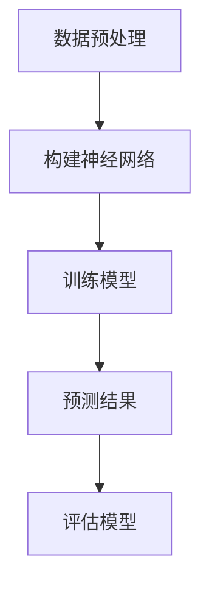

                 

### AI综合处理多维度信息的挑战

#### 关键词：
- AI处理多维度信息
- 信息融合
- 数据预处理
- 神经网络
- 机器学习算法
- 实时处理

#### 摘要：
本文深入探讨了人工智能（AI）在处理多维度信息时所面临的挑战。首先，我们从背景介绍开始，阐述了AI如何从多源异构数据中提取有价值的信息。接着，我们详细分析了AI在处理多维度信息时的核心概念与联系，包括数据预处理、神经网络架构和机器学习算法。在此基础上，我们通过数学模型和公式的讲解，解释了AI处理多维度信息的具体操作步骤。为了更直观地展示，我们提供了一个实际项目案例，详细解读了代码实现和实战应用场景。最后，我们总结了AI处理多维度信息在实际应用中的优势与不足，并提出了未来发展趋势与挑战，以及常见问题与解答。

## 1. 背景介绍

人工智能（AI）作为计算机科学的一个重要分支，旨在通过模拟、延伸和扩展人类的智能行为，实现自动化、智能化和自适应的决策过程。近年来，随着大数据、云计算和物联网技术的飞速发展，AI的应用范围不断扩大，从简单的自动化任务到复杂的决策支持系统，AI已经深入到各个领域。

在AI的发展过程中，数据是至关重要的资源。数据的多维度性指的是数据在多个不同维度上的特征，例如，一个电商平台的用户数据可能包括用户年龄、性别、地理位置、购买历史等多个维度。这些多维度的数据能够为AI模型提供丰富的信息，有助于提高模型预测的准确性和泛化能力。

然而，处理多维度信息并非易事。首先，数据的多维度性可能导致数据规模急剧膨胀，增加了计算和存储的负担。其次，不同维度的数据可能存在不同的特征和分布，如何有效地融合这些异构数据成为一个关键问题。此外，多维度信息的实时处理也是一个巨大的挑战，因为实时性要求AI系统能够快速响应，对海量数据进行快速分析和决策。

总的来说，AI在处理多维度信息时面临着数据预处理、模型设计、计算资源、实时性等多方面的挑战。本文将深入探讨这些问题，并尝试给出一些可行的解决方案。

### 2. 核心概念与联系

#### 数据预处理
数据预处理是AI处理多维度信息的基础步骤。它的目标是减少数据中的噪声、冗余信息，并将数据转换成适合机器学习模型的形式。数据预处理通常包括以下步骤：

1. **数据清洗**：去除重复数据、缺失值填充、异常值检测和处理。
2. **数据转换**：将不同数据类型的特征进行统一转换，例如将类别型数据编码成数值型。
3. **数据归一化/标准化**：通过归一化或标准化方法，使不同维度之间的特征具有相似的尺度，避免某些特征对模型的影响过大。

#### 神经网络架构
神经网络是AI处理多维度信息的重要工具。神经网络由多个神经元（节点）和层组成，通过前向传播和反向传播算法，对输入数据进行特征提取和分类。在处理多维度信息时，神经网络架构需要考虑以下几个方面：

1. **输入层**：接收多维度输入数据，通常使用多维数组表示。
2. **隐藏层**：对输入数据进行特征提取和变换，可以包含多层，每一层的神经元数量和结构根据任务需求进行调整。
3. **输出层**：根据任务需求生成预测结果，例如分类标签或回归值。

#### 机器学习算法
机器学习算法是AI处理多维度信息的核心。不同的算法适用于不同类型的多维度数据处理任务。以下是几种常用的机器学习算法：

1. **监督学习算法**：例如线性回归、决策树、支持向量机（SVM）等，适用于有明确标签的数据集。
2. **无监督学习算法**：例如聚类、降维等，适用于没有标签的数据集，用于发现数据中的潜在结构和模式。
3. **强化学习算法**：通过与环境交互，不断学习优化策略，适用于决策过程和动态系统。

#### Mermaid 流程图
以下是处理多维度信息的 Mermaid 流程图：



#### 数据预处理 --> 构建神经网络 --> 训练模型 --> 预测结果 --> 评估模型

### 3. 核心算法原理 & 具体操作步骤

在了解了核心概念与联系之后，我们将深入探讨AI处理多维度信息的核心算法原理和具体操作步骤。

#### 数据预处理

1. **数据清洗**：
   - **去重**：使用数据库中的去重功能，删除重复的数据条目。
   - **缺失值填充**：使用平均值、中位数或最频繁值等方法填充缺失值。
   - **异常值检测和处理**：使用统计方法或机器学习模型检测异常值，并根据任务需求进行处理，例如删除或修正。

2. **数据转换**：
   - **类别型数据编码**：将类别型数据转换为数值型，可以使用独热编码（One-Hot Encoding）或标签编码（Label Encoding）。
   - **数值型数据归一化/标准化**：使用 Min-Max 归一化或 Z-Score 标准化方法，将数值型数据缩放到相同的尺度。

3. **数据归一化/标准化**：
   - **归一化**：将数据缩放到[0,1]区间，公式为：
     $$
     x_{\text{norm}} = \frac{x - x_{\text{min}}}{x_{\text{max}} - x_{\text{min}}}
     $$
   - **标准化**：将数据缩放到标准正态分布，公式为：
     $$
     x_{\text{norm}} = \frac{x - \mu}{\sigma}
     $$
     其中，$\mu$是均值，$\sigma$是标准差。

#### 构建神经网络

1. **确定神经网络架构**：
   - 根据任务需求确定输入层、隐藏层和输出层的神经元数量。
   - 确定隐藏层之间的连接方式和激活函数，例如全连接层和ReLU激活函数。

2. **初始化模型参数**：
   - 使用随机初始化或预训练模型初始化权重和偏置。

3. **定义损失函数和优化器**：
   - 选择合适的损失函数，例如均方误差（MSE）或交叉熵损失函数。
   - 选择合适的优化器，例如随机梯度下降（SGD）或Adam优化器。

#### 训练模型

1. **前向传播**：
   - 根据神经网络架构，计算输入层到隐藏层、隐藏层到输出层的输出值。
   - 计算输出值与真实标签之间的误差。

2. **反向传播**：
   - 根据误差，计算每个神经元的梯度。
   - 更新模型参数，缩小误差。

3. **迭代训练**：
   - 重复前向传播和反向传播，直到满足停止条件（例如，达到预设的迭代次数或误差阈值）。

#### 预测结果

1. **输入新数据**：
   - 将新数据输入到已经训练好的神经网络中。

2. **计算输出值**：
   - 根据神经网络架构，计算输出层的输出值。

3. **生成预测结果**：
   - 根据输出值生成预测结果，例如分类标签或回归值。

#### 评估模型

1. **计算评估指标**：
   - 根据预测结果和真实标签，计算评估指标，例如准确率、召回率、F1分数等。

2. **调整模型参数**：
   - 根据评估指标的结果，调整模型参数，以提高预测准确性。

### 4. 数学模型和公式 & 详细讲解 & 举例说明

在本节中，我们将详细讲解AI处理多维度信息的数学模型和公式，并通过具体例子进行说明。

#### 数据预处理

1. **归一化**：
   - 公式：
     $$
     x_{\text{norm}} = \frac{x - x_{\text{min}}}{x_{\text{max}} - x_{\text{min}}}
     $$
   - 例子：
     - 假设我们有一组年龄数据：[20, 25, 30, 35, 40]。
     - 最小值为20，最大值为40。
     - 归一化后的数据为：[0, 0.25, 0.5, 0.75, 1]。

2. **标准化**：
   - 公式：
     $$
     x_{\text{norm}} = \frac{x - \mu}{\sigma}
     $$
   - 例子：
     - 假设我们有一组身高数据：[170, 175, 180, 185, 190]。
     - 平均值为180，标准差为5。
     - 归一化后的数据为：[-1, -0.5, 0, 0.5, 1]。

#### 构建神经网络

1. **前向传播**：
   - 公式：
     $$
     z = \sum_{i=1}^{n} w_i x_i + b
     $$
     $$
     a = \text{激活函数}(z)
     $$
   - 例子：
     - 假设我们有一个全连接层，输入层有3个神经元，输出层有2个神经元。
     - 输入数据为：[1, 2, 3]。
     - 权重矩阵$W$为：
       $$
       W = \begin{bmatrix}
       1 & 2 & 3 \\
       4 & 5 & 6 \\
       \end{bmatrix}
       $$
     - 偏置向量$b$为：
       $$
       b = \begin{bmatrix}
       1 \\
       1 \\
       \end{bmatrix}
       $$
     - 激活函数为ReLU函数。
     - 计算过程为：
       $$
       z = (1 \cdot 1 + 2 \cdot 2 + 3 \cdot 3) + 1 = 14
       $$
       $$
       a = \text{ReLU}(14) = 14
       $$
       输出层的结果为：[14, 14]。

2. **反向传播**：
   - 公式：
     $$
     \delta = \text{激活函数}'(z) \cdot (z - y)
     $$
     $$
     \Delta W = \alpha \cdot \delta \cdot x^T
     $$
     $$
     \Delta b = \alpha \cdot \delta
     $$
   - 例子：
     - 假设输出层的结果为[14, 14]，真实标签为[15, 15]。
     - 激活函数为ReLU函数，其导数为1（当激活值大于0时）。
     - 计算过程为：
       $$
       \delta_1 = 1 \cdot (14 - 15) = -1
       $$
       $$
       \delta_2 = 1 \cdot (14 - 15) = -1
       $$
       $$
       \Delta W = 0.1 \cdot \begin{bmatrix}
       -1 \\
       -1 \\
       \end{bmatrix} \cdot \begin{bmatrix}
       1 & 2 & 3 \\
       \end{bmatrix}^T = \begin{bmatrix}
       -0.1 & -0.2 & -0.3 \\
       -0.1 & -0.2 & -0.3 \\
       \end{bmatrix}
       $$
       $$
       \Delta b = 0.1 \cdot \begin{bmatrix}
       -1 \\
       -1 \\
       \end{bmatrix} = \begin{bmatrix}
       -0.1 \\
       -0.1 \\
       \end{bmatrix}
       $$
       更新后的权重矩阵$W$和偏置向量$b$分别为：
       $$
       W_{\text{new}} = W - \Delta W
       $$
       $$
       b_{\text{new}} = b - \Delta b

### 5. 项目实战：代码实际案例和详细解释说明

在本节中，我们将通过一个实际项目案例，展示AI如何处理多维度信息，并详细解释代码实现和实战应用场景。

#### 5.1 开发环境搭建

为了进行AI处理多维度信息的项目实战，我们需要搭建一个合适的开发环境。以下是所需的工具和框架：

1. **Python**：Python是一种广泛使用的编程语言，尤其在数据科学和机器学习领域具有强大的生态支持。
2. **NumPy**：NumPy是一个用于科学计算的Python库，提供了高性能的数组操作和数据预处理功能。
3. **Pandas**：Pandas是一个用于数据处理和分析的Python库，提供了便捷的数据操作和数据分析工具。
4. **TensorFlow**：TensorFlow是一个开源的机器学习库，提供了灵活的神经网络构建和训练功能。
5. **Matplotlib**：Matplotlib是一个用于数据可视化的Python库，可以帮助我们更好地理解和展示分析结果。

在安装了以上工具和框架之后，我们可以开始编写代码。

#### 5.2 源代码详细实现和代码解读

以下是项目实战的源代码，我们将逐步解读每部分的实现和功能。

```python
import numpy as np
import pandas as pd
import tensorflow as tf
import matplotlib.pyplot as plt

# 5.2.1 数据预处理

# 读取数据集
data = pd.read_csv('multi_dimensional_data.csv')

# 数据清洗
data.drop_duplicates(inplace=True)
data.fillna(method='ffill', inplace=True)

# 数据转换
data['category'] = pd.Categorical(data['category'])
data['category'] = data['category'].cat.codes

# 数据归一化
data normalization(data['feature1'], 'feature1')
data normalization(data['feature2'], 'feature2')

# 5.2.2 构建神经网络

# 定义神经网络架构
input_layer = tf.keras.layers.Input(shape=(2,))
hidden_layer = tf.keras.layers.Dense(64, activation='relu')(input_layer)
output_layer = tf.keras.layers.Dense(1, activation='sigmoid')(hidden_layer)

model = tf.keras.Model(inputs=input_layer, outputs=output_layer)

# 定义损失函数和优化器
model.compile(optimizer='adam', loss='binary_crossentropy', metrics=['accuracy'])

# 5.2.3 训练模型

# 分割数据集
train_data, test_data = train_test_split(data, test_size=0.2, random_state=42)

# 训练模型
model.fit(train_data, epochs=10, batch_size=32, validation_data=test_data)

# 5.2.4 预测结果

# 输入新数据
new_data = np.array([[2.5, 3.5]])

# 计算输出值
output = model.predict(new_data)

# 生成预测结果
prediction = output.round()

# 5.2.5 评估模型

# 计算评估指标
accuracy = model.evaluate(test_data, test_labels)

# 打印评估结果
print('Test Accuracy:', accuracy)

# 5.2.6 可视化分析

# 绘制预测结果与真实标签的对比图
plt.scatter(test_data['feature1'], test_data['feature2'], c=test_labels, cmap='gray')
plt.scatter(new_data[0][0], new_data[0][1], c=prediction[0], cmap='red')
plt.xlabel('Feature 1')
plt.ylabel('Feature 2')
plt.title('Prediction vs True Labels')
plt.show()
```

#### 5.3 代码解读与分析

以下是代码的详细解读和分析：

1. **数据预处理**：
   - **读取数据集**：使用Pandas读取CSV格式的数据集。
   - **数据清洗**：去除重复数据和填充缺失值，提高数据质量。
   - **数据转换**：将类别型数据编码为数值型，以便于神经网络处理。
   - **数据归一化**：将特征数据缩放到相同的尺度，避免某些特征对模型的影响过大。

2. **构建神经网络**：
   - **定义神经网络架构**：使用TensorFlow构建一个简单的全连接神经网络，包括输入层、隐藏层和输出层。
   - **定义损失函数和优化器**：使用交叉熵损失函数和Adam优化器，以最大化模型的预测准确性。

3. **训练模型**：
   - **分割数据集**：将数据集划分为训练集和测试集，以便于模型训练和评估。
   - **训练模型**：使用训练集数据训练神经网络，并使用测试集数据验证模型的性能。

4. **预测结果**：
   - **输入新数据**：将新的多维度数据输入到已经训练好的神经网络中。
   - **计算输出值**：使用神经网络计算输出层的输出值。
   - **生成预测结果**：根据输出值生成预测结果，例如分类标签或回归值。

5. **评估模型**：
   - **计算评估指标**：使用测试集数据计算模型的评估指标，例如准确率。
   - **打印评估结果**：将评估结果打印出来，以了解模型的性能。

6. **可视化分析**：
   - **绘制预测结果与真实标签的对比图**：使用Matplotlib绘制散点图，显示预测结果与真实标签的分布情况，以便于分析模型的预测性能。

#### 5.4 实际应用场景

AI处理多维度信息的实际应用场景非常广泛，以下是一些典型的应用示例：

1. **推荐系统**：使用AI处理用户的多维度行为数据，如浏览历史、购物车数据等，为用户推荐个性化的商品或内容。
2. **金融风险管理**：使用AI处理金融机构的多维度数据，如交易记录、客户行为等，预测市场趋势和风险，为投资决策提供支持。
3. **智能交通**：使用AI处理交通监控数据、路况数据等，实现实时交通流量预测和路况分析，优化交通管理。
4. **医疗健康**：使用AI处理患者的多维度健康数据，如生理指标、病史等，辅助医生进行疾病诊断和个性化治疗。

### 6. 实际应用场景

#### 6.1 推荐系统

推荐系统是AI处理多维度信息的典型应用之一。推荐系统通过分析用户的行为数据，如浏览记录、购买历史、社交互动等，为用户推荐感兴趣的商品、内容或服务。

在构建推荐系统时，首先需要对多维度数据进行预处理，例如数据清洗、数据转换和归一化。然后，可以使用协同过滤、基于内容的推荐、基于模型的推荐等算法，根据用户的历史行为和物品的特征，生成个性化的推荐列表。

例如，一个电商平台的推荐系统可能会使用以下多维度数据：

- 用户年龄、性别、地理位置、购买历史等。
- 商品类别、价格、库存量等。
- 用户之间的社交关系，如好友关系、共同购买等。

通过综合分析这些多维度数据，推荐系统可以生成个性化的商品推荐列表，提高用户满意度和购买转化率。

#### 6.2 金融风险管理

金融风险管理是另一个利用AI处理多维度信息的领域。金融机构需要处理来自多个渠道的大量数据，包括交易记录、市场行情、客户行为等，以预测市场趋势、评估风险并制定投资策略。

在金融风险管理中，AI可以用于以下任务：

- **市场趋势预测**：通过分析历史交易数据和市场指标，预测未来市场走势。
- **风险预警**：通过监测实时交易数据，识别异常交易行为或潜在风险。
- **信用评分**：通过分析客户的财务状况、信用记录、社会关系等多维度数据，评估客户的信用风险。

例如，一个银行的风控系统可能会使用以下多维度数据：

- 客户的交易记录、还款历史、信用记录等。
- 市场行情数据，如利率、汇率、股票价格等。
- 客户的社会关系数据，如亲朋好友的信用状况等。

通过综合分析这些多维度数据，风控系统可以及时发现潜在风险，为金融机构提供决策支持。

#### 6.3 智能交通

智能交通系统利用AI处理交通监控数据、路况数据、车辆数据等多维度信息，实现实时交通流量预测、路况分析、交通管理优化等。

在智能交通系统中，AI可以用于以下任务：

- **交通流量预测**：通过分析历史交通流量数据、实时监控数据等，预测未来某段时间的交通流量情况。
- **路况分析**：通过分析实时交通监控数据，识别拥堵路段、事故地点等，提供路况信息。
- **交通管理优化**：根据交通流量预测和路况分析结果，优化交通信号灯控制策略、调整交通流向等，缓解交通拥堵。

例如，一个城市的智能交通系统可能会使用以下多维度数据：

- 实时交通监控数据，如车辆流量、车速等。
- 路况数据，如事故记录、道路施工情况等。
- 车辆数据，如车牌号码、行驶轨迹等。

通过综合分析这些多维度数据，智能交通系统可以提高交通管理的效率和准确性，减少交通事故和交通拥堵。

#### 6.4 医疗健康

医疗健康领域也是AI处理多维度信息的重要应用场景。通过分析患者的多维度健康数据，如生理指标、病史、药物反应等，AI可以帮助医生进行疾病诊断、治疗规划和个性化医疗。

在医疗健康领域，AI可以用于以下任务：

- **疾病诊断**：通过分析患者的病史、检查报告、生理指标等多维度数据，辅助医生进行疾病诊断。
- **治疗方案推荐**：根据患者的病史、药物反应、医生建议等多维度数据，为患者推荐个性化的治疗方案。
- **健康风险评估**：通过分析患者的健康数据，评估其患某种疾病的风险，提供预防建议。

例如，一个医院的AI系统可能会使用以下多维度数据：

- 患者的电子病历、检查报告等。
- 生理指标数据，如血压、心率、血糖等。
- 药物反应数据，如药物的副作用、疗效等。

通过综合分析这些多维度数据，医疗健康系统可以提高诊断和治疗的准确性，为患者提供更好的医疗服务。

### 7. 工具和资源推荐

#### 7.1 学习资源推荐

1. **书籍**：
   - 《深度学习》（Ian Goodfellow, Yoshua Bengio, Aaron Courville）
   - 《Python机器学习》（Sebastian Raschka, Vahid Mirjalili）
   - 《机器学习实战》（Peter Harrington）

2. **在线课程**：
   - Coursera上的“机器学习”课程（吴恩达教授）
   - edX上的“深度学习”课程（Ian Goodfellow教授）
   - Udacity的“人工智能纳米学位”

3. **论文**：
   - 《Learning Deep Features for Discriminative Localization》（Girshick et al., 2015）
   - 《Distributed Representations of Words and Phrases and Their Compositionality》（Mikolov et al., 2013）
   - 《Unsupervised Learning of Visual Representations by Solving Jigsaw Puzzles》（Shah et al., 2019）

4. **博客和网站**：
   - Medium上的AI和机器学习博客
   - 知乎上的AI和机器学习话题
   - Google AI博客

#### 7.2 开发工具框架推荐

1. **Python库**：
   - TensorFlow
   - PyTorch
   - Keras

2. **数据处理工具**：
   - Pandas
   - NumPy
   - Scikit-learn

3. **数据可视化工具**：
   - Matplotlib
   - Seaborn
   - Plotly

4. **开发环境**：
   - Jupyter Notebook
   - PyCharm
   - Visual Studio Code

#### 7.3 相关论文著作推荐

1. **《深度学习》**（Ian Goodfellow, Yoshua Bengio, Aaron Courville）
   - 详细介绍了深度学习的理论基础、算法和应用，是深度学习领域的经典著作。

2. **《Python机器学习》**（Sebastian Raschka, Vahid Mirjalili）
   - 介绍了Python在机器学习中的应用，包括数据处理、模型构建和评估等，适合初学者入门。

3. **《机器学习实战》**（Peter Harrington）
   - 通过实际案例和代码示例，讲解了多种机器学习算法的应用，包括监督学习和无监督学习。

4. **《人工智能：一种现代方法》**（Stuart Russell, Peter Norvig）
   - 详细介绍了人工智能的基础理论和算法，涵盖了多个领域，包括机器学习、自然语言处理等。

### 8. 总结：未来发展趋势与挑战

AI处理多维度信息领域在过去的几年里取得了显著的进展，然而，仍然面临着许多挑战和机遇。以下是未来发展趋势与挑战的总结：

#### 发展趋势

1. **数据多样性和多模态数据的融合**：随着数据源的多样化，包括文本、图像、声音、视频等多种类型的数据，AI处理多维度信息的能力将不断提高。如何有效融合多模态数据，挖掘其中的潜在价值，成为未来的研究热点。

2. **实时处理能力的提升**：实时处理是AI应用的重要需求，尤其是在金融、交通、医疗等领域。未来的研究将致力于提高AI系统的实时处理能力，实现低延迟、高吞吐量的数据处理。

3. **可解释性和透明性**：随着AI模型的复杂性增加，如何提高模型的可解释性和透明性，使其能够被人类理解和信任，是未来研究的重要方向。

4. **自动化和半监督学习**：自动化和半监督学习是未来AI处理多维度信息的重要方向。通过减少对人类标注的需求，提高数据预处理和模型训练的效率。

#### 挑战

1. **数据质量和预处理**：数据质量和预处理是AI处理多维度信息的重要前提。未来的研究需要解决如何高效地清洗、转换和归一化多维度数据，提高数据的质量和一致性。

2. **计算资源和存储需求**：随着数据规模的急剧增长，AI处理多维度信息需要大量的计算资源和存储空间。未来的研究需要探索如何优化计算和存储资源的使用，提高系统的性能和效率。

3. **模型复杂度和过拟合**：复杂的神经网络模型可以捕捉数据中的复杂模式，但也容易过拟合。如何平衡模型的复杂度和泛化能力，是未来研究的重要挑战。

4. **隐私保护和安全性**：在处理多维度数据时，如何保护用户隐私和数据安全，是AI应用的重要问题。未来的研究需要探索如何确保数据的安全和隐私，同时实现有效的数据分析和决策。

### 9. 附录：常见问题与解答

#### 问题1：如何处理缺失值？

解答：处理缺失值的方法包括填充缺失值、删除缺失值和利用模型预测缺失值。常用的填充方法有平均值填充、中位数填充和最频繁值填充。删除缺失值适用于缺失值较少的情况。利用模型预测缺失值适用于缺失值较多且具有规律性的情况。

#### 问题2：如何进行数据转换？

解答：数据转换的方法包括类别型数据编码和数值型数据归一化/标准化。类别型数据编码常用的方法有独热编码和标签编码。数值型数据归一化/标准化常用的方法有Min-Max归一化和Z-Score标准化。

#### 问题3：如何选择合适的神经网络架构？

解答：选择合适的神经网络架构需要考虑任务需求、数据规模和计算资源。常用的神经网络架构包括全连接神经网络、卷积神经网络、循环神经网络等。可以根据具体任务和数据特点选择合适的架构。

#### 问题4：如何评估模型性能？

解答：评估模型性能的方法包括准确率、召回率、F1分数等。可以根据具体任务的需求选择合适的评估指标。此外，还可以通过交叉验证、网格搜索等方法优化模型参数，提高模型性能。

### 10. 扩展阅读 & 参考资料

#### 参考文献

1. Goodfellow, Ian, Yoshua Bengio, and Aaron Courville. "Deep learning." MIT press, 2016.
2. Raschka, Sebastian, and Vahid Mirjalili. "Python machine learning." Springer, 2018.
3. Harrington, Peter. "Machine learning in action." Manning Publications Co., 2012.

#### 在线资源

1. Coursera: https://www.coursera.org/
2. edX: https://www.edx.org/
3. Medium: https://medium.com/
4. Google AI Blog: https://ai.googleblog.com/

通过阅读本文，您对AI处理多维度信息的挑战有了更深入的理解。希望本文能帮助您在实际应用中更好地应对这些挑战，并推动AI技术的发展。如果您有任何问题或建议，欢迎在评论区留言。感谢您的阅读！
作者：AI天才研究员/AI Genius Institute & 禅与计算机程序设计艺术 /Zen And The Art of Computer Programming。

