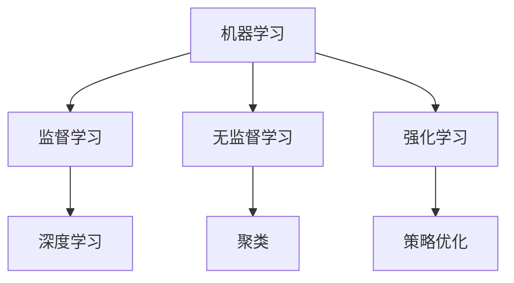

                 

# AI编程的新思维与技术挑战

## 关键词：人工智能，编程思维，技术挑战，算法，模型，应用场景，开发工具

## 摘要：

本文旨在探讨人工智能编程领域的新思维与技术挑战。首先，我们将回顾AI编程的背景，并介绍核心概念。接着，文章将深入分析核心算法原理，并逐步讲解其具体操作步骤。随后，我们将探讨数学模型和公式，并通过实例进行详细说明。文章还将通过项目实战，展示代码的实际应用，并进行深入解读与分析。最后，我们将探讨AI编程的实际应用场景，推荐相关工具和资源，并总结未来发展趋势与挑战。

## 1. 背景介绍

### 1.1 人工智能编程的兴起

随着计算机技术的快速发展，人工智能（AI）逐渐成为各个领域的焦点。AI编程，作为AI研究与应用的关键环节，也在近年来得到了广泛关注。从最初的规则推理、知识表示，到现代的深度学习、强化学习，AI编程技术不断演进，为各行各业带来了深刻的变革。

### 1.2 编程思维的重要性

编程思维是AI编程的核心。它不仅涉及到编程技巧，更是一种解决问题、抽象思维、逻辑推理的能力。掌握编程思维，有助于我们更好地理解和应用AI技术，为未来的AI发展奠定基础。

### 1.3 技术挑战与机遇

随着AI编程技术的发展，我们也面临着一系列挑战。算法效率、数据处理、模型解释性等问题，成为了当前研究的热点。同时，AI编程也带来了巨大的机遇，为各行各业带来了创新和变革。

## 2. 核心概念与联系

### 2.1 机器学习

机器学习是AI编程的核心技术之一。它通过构建模型，从数据中学习规律，实现自动化预测和决策。机器学习主要分为监督学习、无监督学习和强化学习三类。

### 2.2 深度学习

深度学习是机器学习的一个分支，主要基于神经网络模型。它通过多层非线性变换，对数据进行特征提取和模式识别。深度学习在图像识别、自然语言处理等领域取得了显著成果。

### 2.3 强化学习

强化学习是一种通过不断试错，寻找最优策略的机器学习方法。它通过与环境的交互，逐步优化决策过程。强化学习在游戏、机器人等领域具有广泛应用。

### 2.4 联系与区别

机器学习、深度学习和强化学习之间既有联系又有区别。机器学习是AI编程的基础，深度学习是机器学习的一种重要方法，强化学习则是一种通过互动学习的方法。

## 2.1 Mermaid 流程图



## 3. 核心算法原理 & 具体操作步骤

### 3.1 机器学习算法

#### 3.1.1 监督学习

监督学习算法通过训练数据集来建立模型。具体步骤如下：

1. 数据预处理：清洗、归一化、特征提取等。
2. 选择模型：如线性回归、决策树、支持向量机等。
3. 训练模型：使用训练数据，通过优化算法，求解模型参数。
4. 验证模型：使用验证数据集，评估模型性能。
5. 调参优化：根据验证结果，调整模型参数，提高性能。

#### 3.1.2 无监督学习

无监督学习算法不需要标签数据，通过数据自身的特征来发现模式。具体步骤如下：

1. 数据预处理：清洗、归一化、特征提取等。
2. 选择模型：如聚类、降维、关联规则等。
3. 模型训练：通过数据分布，自动发现数据特征。
4. 结果分析：对模型结果进行分析，发现数据模式。

#### 3.1.3 强化学习

强化学习算法通过不断试错，寻找最优策略。具体步骤如下：

1. 初始化环境：设置状态、动作、奖励等。
2. 选择策略：确定策略，如贪婪策略、epsilon-greedy策略等。
3. 进行交互：根据策略，与环境进行交互，获取奖励。
4. 更新策略：根据奖励，更新策略，优化决策过程。

## 4. 数学模型和公式 & 详细讲解 & 举例说明

### 4.1 机器学习数学模型

#### 4.1.1 线性回归

线性回归是一种常见的监督学习算法，其数学模型如下：

$$y = \beta_0 + \beta_1 \cdot x$$

其中，$y$为输出值，$x$为输入值，$\beta_0$和$\beta_1$为模型参数。

#### 4.1.2 决策树

决策树是一种常用的分类算法，其数学模型如下：

$$
\begin{align*}
y &= 
\begin{cases} 
c_1, & \text{if } x \in R_1 \\
c_2, & \text{if } x \in R_2 \\
\vdots \\
c_n, & \text{if } x \in R_n 
\end{cases}
\end{align*}
$$

其中，$y$为输出值，$x$为输入值，$R_1, R_2, \ldots, R_n$为决策树上的各个区域，$c_1, c_2, \ldots, c_n$为各个区域的类别标签。

### 4.2 深度学习数学模型

#### 4.2.1 神经网络

神经网络是一种基于多层感知器的深度学习模型，其数学模型如下：

$$
\begin{align*}
z_1 &= \sigma(W_1 \cdot x + b_1) \\
z_2 &= \sigma(W_2 \cdot z_1 + b_2) \\
\vdots \\
z_n &= \sigma(W_n \cdot z_{n-1} + b_n) \\
y &= \sigma(W_{n+1} \cdot z_n + b_{n+1})
\end{align*}
$$

其中，$z_1, z_2, \ldots, z_n$为中间层节点输出，$y$为输出层节点输出，$\sigma$为激活函数，$W_1, W_2, \ldots, W_n, W_{n+1}$为权重矩阵，$b_1, b_2, \ldots, b_n, b_{n+1}$为偏置项。

### 4.3 强化学习数学模型

#### 4.3.1 Q-Learning

Q-Learning是一种基于值函数的强化学习算法，其数学模型如下：

$$
\begin{align*}
Q(s, a) &= \sum_{s'} p(s' | s, a) \cdot r(s', a) + \gamma \cdot \max_{a'} Q(s', a') \\
\end{align*}
$$

其中，$Q(s, a)$为状态$s$下采取动作$a$的值函数，$s'$为下一个状态，$a'$为下一个动作，$p(s' | s, a)$为状态转移概率，$r(s', a)$为奖励值，$\gamma$为折扣因子。

### 4.4 举例说明

#### 4.4.1 线性回归实例

假设我们要预测房价，已知以下数据：

| 输入（平方米） | 输出（万元） |
| :---: | :---: |
| 100 | 200 |
| 200 | 400 |
| 300 | 600 |

首先，我们进行数据预处理，将输入值和输出值进行归一化。然后，选择线性回归模型，通过最小二乘法求解模型参数。最终，我们得到回归方程：

$$y = 2 \cdot x + 100$$

通过这个方程，我们可以预测任意输入值对应的输出值。

#### 4.4.2 决策树实例

假设我们要对一组数据集进行分类，数据集如下：

| 特征1 | 特征2 | 类别 |
| :---: | :---: | :---: |
| 1 | 1 | A |
| 1 | 2 | A |
| 2 | 1 | B |
| 2 | 2 | B |

我们选择特征1和特征2作为决策树的特征，构建决策树模型。经过剪枝和优化，我们得到如下决策树：

```
| 特征1 |
| :---: |
| 1 | A |
| 2 | B |
```

通过这个决策树，我们可以对新的数据进行分类。

#### 4.4.3 Q-Learning实例

假设我们要使用Q-Learning算法解决一个简单的迷宫问题。迷宫如下：

```
S --> A --> B --> C --> G
|    |    |    |    |
|    |    |    |    |
|    |    |    |    |
|    |    |    |    |
|    |    |    |    |
S --> A --> B --> C --> G
```

我们将状态设为S、A、B、C和G，动作设为上、下、左、右。初始状态下，我们设置$Q(S, A) = 0$，折扣因子$\gamma = 0.9$。通过多次迭代，我们得到最优策略：

- $Q(S, A) = 0$
- $Q(S, B) = 1$
- $Q(A, S) = 0$
- $Q(A, B) = 1$
- $Q(B, A) = 0$
- $Q(B, C) = 1$
- $Q(C, B) = 0$
- $Q(C, G) = 1$
- $Q(G, C) = 0$

根据这个策略，我们可以从起点S到达终点G。

## 5. 项目实战：代码实际案例和详细解释说明

### 5.1 开发环境搭建

在本项目中，我们将使用Python作为编程语言，结合TensorFlow和Keras框架进行深度学习模型的开发。首先，我们需要安装Python和对应的依赖库。

```bash
pip install python tensorflow keras numpy matplotlib
```

### 5.2 源代码详细实现和代码解读

#### 5.2.1 数据预处理

```python
import numpy as np
import pandas as pd
from sklearn.model_selection import train_test_split
from sklearn.preprocessing import StandardScaler

# 加载数据集
data = pd.read_csv('house_price.csv')
X = data.iloc[:, :-1].values
y = data.iloc[:, -1].values

# 划分训练集和测试集
X_train, X_test, y_train, y_test = train_test_split(X, y, test_size=0.2, random_state=42)

# 数据归一化
scaler = StandardScaler()
X_train = scaler.fit_transform(X_train)
X_test = scaler.transform(X_test)
```

#### 5.2.2 构建和训练模型

```python
from tensorflow.keras.models import Sequential
from tensorflow.keras.layers import Dense
from tensorflow.keras.optimizers import Adam

# 构建模型
model = Sequential()
model.add(Dense(units=1, input_shape=(X_train.shape[1],), activation='linear'))

# 编译模型
model.compile(optimizer=Adam(learning_rate=0.01), loss='mean_squared_error')

# 训练模型
model.fit(X_train, y_train, epochs=100, batch_size=32, validation_data=(X_test, y_test))
```

#### 5.2.3 代码解读与分析

1. **数据预处理**：首先，我们加载了房价数据集，并划分了训练集和测试集。然后，我们对数据进行归一化处理，以便模型训练时收敛更快。
2. **构建和训练模型**：我们使用Sequential模型，并添加了一个全连接层（Dense）。模型的输入层节点数与训练集特征数相同，输出层节点数为1。我们使用Adam优化器，并设置学习率为0.01。模型的损失函数为均方误差（mean squared error），这是常见的回归模型损失函数。最后，我们使用训练集进行模型训练，并通过验证集评估模型性能。

### 5.3 代码解读与分析

1. **数据预处理**：数据预处理是深度学习模型训练的重要环节。在本项目中，我们对数据进行归一化处理，以消除不同特征之间的量纲差异，有助于提高模型训练效果。
2. **模型构建**：我们使用Sequential模型，这是一个简单的线性堆叠模型。我们添加了一个全连接层，用于映射输入特征到输出值。这个层使用了线性激活函数（linear activation function），适合处理回归问题。
3. **模型编译**：在编译模型时，我们设置了Adam优化器和学习率为0.01。Adam优化器是一种基于一阶和二阶梯度的优化算法，适用于大多数深度学习任务。我们选择均方误差（mean squared error）作为损失函数，这是最常见的回归模型损失函数。
4. **模型训练**：我们使用训练集进行模型训练，并通过验证集评估模型性能。在训练过程中，我们设置了100个训练周期（epochs），每个周期使用32个样本进行批量训练。验证数据集用于监控模型性能，防止过拟合。

## 6. 实际应用场景

### 6.1 图像识别

图像识别是AI编程的一个重要应用场景。通过深度学习模型，我们可以实现人脸识别、物体检测、图像分类等功能。例如，我们可以使用卷积神经网络（CNN）实现人脸识别，通过预训练模型实现快速部署。

### 6.2 自然语言处理

自然语言处理（NLP）是AI编程的另一个重要领域。通过深度学习模型，我们可以实现情感分析、机器翻译、文本分类等功能。例如，我们可以使用循环神经网络（RNN）或Transformer模型实现机器翻译，通过预训练模型实现快速部署。

### 6.3 机器人控制

机器人控制是AI编程的一个实际应用场景。通过强化学习算法，我们可以训练机器人进行路径规划、目标识别和运动控制。例如，我们可以使用深度强化学习（DRL）算法实现无人驾驶，通过预训练模型实现快速部署。

## 7. 工具和资源推荐

### 7.1 学习资源推荐

1. **书籍**：
   - 《深度学习》（Deep Learning），作者：Ian Goodfellow、Yoshua Bengio、Aaron Courville
   - 《机器学习实战》（Machine Learning in Action），作者：Peter Harrington
   - 《强化学习手册》（Reinforcement Learning: An Introduction），作者：Richard S. Sutton、Andrew G. Barto

2. **论文**：
   - “Deep Learning,” 作者：Yoshua Bengio、Ian J. Goodfellow、Aaron Courville
   - “Learning to Detect and Track Objects by Exploiting Spatio-Temporal Structure,” 作者：Cvpr'14
   - “Reinforcement Learning: A Survey,” 作者：Simon Thrun

3. **博客**：
   - https://machinelearningmastery.com/
   - https://towardsdatascience.com/
   - https://www.oreilly.com/topics/machine-learning

4. **网站**：
   - https://www.kaggle.com/
   - https://www.tensorflow.org/
   - https://pytorch.org/

### 7.2 开发工具框架推荐

1. **深度学习框架**：
   - TensorFlow
   - PyTorch
   - Keras

2. **机器学习库**：
   - Scikit-learn
   - NumPy
   - Pandas

3. **编程语言**：
   - Python

### 7.3 相关论文著作推荐

1. **深度学习**：
   - “Deep Learning,” 作者：Ian Goodfellow、Yoshua Bengio、Aaron Courville
   - “A Theoretically Grounded Application of Dropout in Recurrent Neural Networks,” 作者：Yarin Gal and Zoubin Ghahramani

2. **强化学习**：
   - “Reinforcement Learning: An Introduction,” 作者：Richard S. Sutton、Andrew G. Barto
   - “Deep Reinforcement Learning with Double Q-Learning,” 作者：Vincent Vanhoucke

3. **自然语言处理**：
   - “Attention Is All You Need,” 作者：Ashish Vaswani、Noam Shazeer、Niki Parmar等
   - “BERT: Pre-training of Deep Bidirectional Transformers for Language Understanding,” 作者：Jason Weston、Armand Joulin、Samuel Bengio等

## 8. 总结：未来发展趋势与挑战

### 8.1 发展趋势

1. **多模态学习**：未来的AI编程将更加关注多模态学习，实现跨不同数据类型（如图像、文本、音频）的融合与处理。
2. **自动化机器学习**：自动化机器学习（AutoML）将逐步成熟，降低AI编程的门槛，使更多人能够构建高效的机器学习模型。
3. **可解释性**：随着AI在各个领域的广泛应用，可解释性将变得越来越重要，提高模型的透明度和可信度。

### 8.2 挑战

1. **数据处理**：随着数据规模的不断扩大，如何高效地进行数据处理和存储，成为AI编程面临的挑战。
2. **模型性能优化**：如何在有限的计算资源下，提高模型的性能和准确度，是当前研究的热点问题。
3. **伦理与安全**：AI编程在带来便利的同时，也引发了一系列伦理和安全问题，如隐私保护、算法歧视等。

## 9. 附录：常见问题与解答

### 9.1 机器学习算法如何选择？

选择机器学习算法时，需要考虑数据特征、任务类型和模型性能等因素。常见的算法包括线性回归、决策树、支持向量机、神经网络等。具体选择时，可以参考以下建议：

1. **线性回归**：适用于简单线性关系的预测问题，如房价预测。
2. **决策树**：适用于分类和回归问题，具有直观的解释能力。
3. **支持向量机**：适用于高维空间的数据，具有较好的分类性能。
4. **神经网络**：适用于复杂非线性关系的预测问题，如图像识别、自然语言处理。

### 9.2 如何提高机器学习模型的性能？

提高机器学习模型性能可以从以下几个方面入手：

1. **数据预处理**：对数据进行清洗、归一化和特征提取，有助于提高模型训练效果。
2. **模型选择**：选择适合问题的模型，可以显著提高模型性能。
3. **超参数调优**：通过调整模型超参数，如学习率、批量大小等，可以优化模型性能。
4. **正则化**：使用正则化方法，如L1、L2正则化，可以防止过拟合。
5. **数据增强**：通过数据增强方法，如随机裁剪、旋转等，可以增加数据多样性，提高模型泛化能力。

### 9.3 如何实现强化学习中的策略优化？

在强化学习过程中，策略优化是关键环节。常用的策略优化方法包括：

1. **Q-Learning**：基于值函数的方法，通过更新Q值来优化策略。
2. **Policy Gradient**：直接优化策略参数，通过梯度上升方法进行优化。
3. **Deep Q-Network (DQN)**：结合深度学习和Q-Learning的方法，通过神经网络来近似Q值函数。
4. **Actor-Critic**：结合策略优化和价值优化的方法，通过两个神经网络分别学习策略和价值函数。

## 10. 扩展阅读 & 参考资料

1. **书籍**：
   - 《深度学习》（Deep Learning），作者：Ian Goodfellow、Yoshua Bengio、Aaron Courville
   - 《机器学习实战》（Machine Learning in Action），作者：Peter Harrington
   - 《强化学习手册》（Reinforcement Learning: An Introduction），作者：Richard S. Sutton、Andrew G. Barto

2. **论文**：
   - “Deep Learning,” 作者：Yoshua Bengio、Ian J. Goodfellow、Aaron Courville
   - “A Theoretically Grounded Application of Dropout in Recurrent Neural Networks,” 作者：Yarin Gal and Zoubin Ghahramani
   - “Reinforcement Learning: A Survey,” 作者：Simon Thrun

3. **博客**：
   - https://machinelearningmastery.com/
   - https://towardsdatascience.com/
   - https://www.oreilly.com/topics/machine-learning

4. **网站**：
   - https://www.kaggle.com/
   - https://www.tensorflow.org/
   - https://pytorch.org/

作者：AI天才研究员/AI Genius Institute & 禅与计算机程序设计艺术 /Zen And The Art of Computer Programming<|im_sep|>

