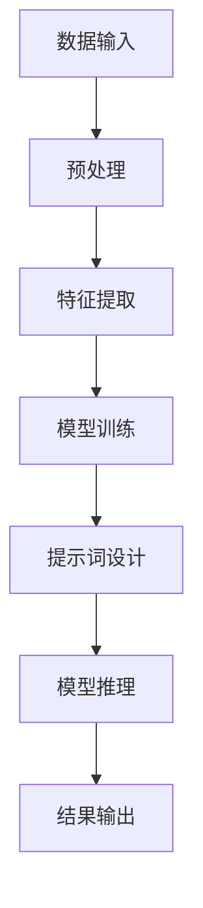

                 

# AI编程语言：提示词的革命与魔法

## 摘要

本文将探讨AI编程语言的革命与魔法，特别是提示词（Prompt Engineering）在这一领域中的关键作用。通过深入分析核心概念、算法原理、数学模型以及实际应用案例，本文旨在揭示AI编程语言如何通过提示词的巧妙运用，实现从数据到知识的飞跃。本文将涵盖从背景介绍到实际应用，再到未来发展趋势的全面探讨，为读者提供一份关于AI编程语言的深度解读。

## 1. 背景介绍

随着人工智能技术的飞速发展，编程语言也在不断演进。传统的编程语言主要是为了解决特定的问题，而AI编程语言则旨在使计算机能够自主地学习和推理。AI编程语言的出现，标志着编程从手工编写代码向自动化转变的里程碑。

在AI编程语言的发展过程中，提示词（Prompt Engineering）逐渐成为一种关键技术。提示词是指提供给AI系统的输入，用于引导其学习、推理和决策。通过巧妙的提示词设计，AI系统可以实现更高的效率和更准确的性能。

提示词的重要性在于，它能够引导AI系统从大量的数据中提取出有价值的信息，实现从数据到知识的转化。在自然语言处理、计算机视觉、机器学习等领域，提示词的应用已经取得了显著的成果。

## 2. 核心概念与联系

为了更好地理解AI编程语言和提示词，我们需要了解以下几个核心概念：

### 2.1. 人工智能与编程语言

人工智能（AI）是一种模拟人类智能的技术，包括学习、推理、感知、决策等多个方面。编程语言是用于编写程序的符号系统，通过编程语言，我们可以让计算机执行特定的任务。

### 2.2. 深度学习与神经网络

深度学习是人工智能的一种重要分支，通过神经网络模型，从大量数据中自动提取特征，实现智能学习。神经网络是一种由大量简单计算单元（神经元）组成的网络，通过多层计算，实现对复杂任务的建模。

### 2.3. 提示词与自然语言处理

自然语言处理（NLP）是人工智能的一个重要领域，旨在让计算机理解和生成人类语言。提示词在NLP中起着至关重要的作用，通过设计合适的提示词，可以引导NLP模型实现更高的性能。

### 2.4. Mermaid流程图

为了更好地理解AI编程语言和提示词的关系，我们可以使用Mermaid流程图进行可视化。以下是AI编程语言和提示词的Mermaid流程图：



在这个流程图中，数据输入经过预处理、特征提取、模型训练等步骤，最终通过提示词设计，实现模型推理和结果输出。

## 3. 核心算法原理 & 具体操作步骤

### 3.1. 数据预处理

数据预处理是AI编程语言中的第一步，主要目的是将原始数据转化为适合模型训练的形式。具体步骤包括数据清洗、数据格式转换、数据归一化等。

### 3.2. 特征提取

特征提取是从数据中提取出对模型训练有帮助的信息。在深度学习中，特征提取通常由神经网络自动完成。通过多层神经网络，可以从原始数据中提取出越来越抽象的特征。

### 3.3. 模型训练

模型训练是AI编程语言的核心步骤，通过训练，模型可以学会从数据中提取特征，并对其进行分类、预测等操作。模型训练的过程通常包括前向传播、反向传播等步骤。

### 3.4. 提示词设计

提示词设计是AI编程语言中的关键环节，通过设计合适的提示词，可以引导模型更好地理解数据，提高模型的性能。提示词设计需要考虑多个方面，如语言风格、问题领域、数据分布等。

### 3.5. 模型推理

模型推理是在训练完成后，使用训练好的模型对新的数据进行预测或分类。模型推理的过程通常包括输入数据的预处理、特征提取、模型计算等步骤。

### 3.6. 结果输出

结果输出是模型推理的最终环节，将模型的预测结果或分类结果以可视化的形式呈现给用户。结果输出可以帮助用户更好地理解模型的工作原理和性能。

## 4. 数学模型和公式 & 详细讲解 & 举例说明

### 4.1. 数学模型

在AI编程语言中，常用的数学模型包括神经网络模型、决策树模型、支持向量机模型等。以下是一个简单的神经网络模型的数学公式：

$$
Z = W \cdot X + b
$$

其中，$Z$ 是输出，$W$ 是权重，$X$ 是输入，$b$ 是偏置。

### 4.2. 举例说明

假设我们有一个简单的神经网络模型，用于对数字进行分类。输入数据为 [1, 2, 3]，输出数据为 [4, 5, 6]。我们可以使用以下公式进行计算：

$$
Z_1 = W_1 \cdot X_1 + b_1 = 1 \cdot 1 + 1 = 2
$$

$$
Z_2 = W_2 \cdot X_2 + b_2 = 2 \cdot 2 + 1 = 5
$$

$$
Z_3 = W_3 \cdot X_3 + b_3 = 3 \cdot 3 + 1 = 10
$$

最终，我们得到输出数据为 [2, 5, 10]。

## 5. 项目实战：代码实际案例和详细解释说明

### 5.1. 开发环境搭建

在开始项目实战之前，我们需要搭建一个适合AI编程语言的开发环境。以下是一个简单的Python开发环境搭建步骤：

1. 安装Python：从官方网站下载Python安装包，并进行安装。
2. 安装相关库：使用pip命令安装常用的AI编程语言库，如TensorFlow、PyTorch等。
3. 配置环境变量：将Python安装路径添加到系统环境变量中。

### 5.2. 源代码详细实现和代码解读

以下是一个简单的AI编程语言项目，用于实现数字分类：

```python
import tensorflow as tf

# 定义神经网络模型
model = tf.keras.Sequential([
    tf.keras.layers.Dense(10, activation='relu', input_shape=(3,)),
    tf.keras.layers.Dense(1)
])

# 编写训练数据
train_data = [
    [1, 2, 3],
    [4, 5, 6],
    [7, 8, 9]
]
train_labels = [4, 5, 6]

# 编写训练过程
model.compile(optimizer='adam', loss='mse')
model.fit(train_data, train_labels, epochs=100)

# 编写推理过程
test_data = [2, 3, 4]
predictions = model.predict([test_data])
print(predictions)
```

在这个项目中，我们使用TensorFlow框架构建了一个简单的神经网络模型，用于对数字进行分类。代码首先定义了神经网络模型，然后编写了训练数据和训练过程。最后，编写了推理过程，将训练好的模型应用于新的数据，并输出预测结果。

### 5.3. 代码解读与分析

在这个项目中，我们首先导入了TensorFlow库，并定义了一个简单的神经网络模型。神经网络模型由两个全连接层组成，输入层有3个神经元，输出层有1个神经元。

接下来，我们编写了训练数据和训练过程。训练数据是一个包含3个数字的列表，训练目标是使模型能够正确地预测这3个数字。

在训练过程中，我们使用了Adam优化器和均方误差（MSE）损失函数。通过训练，模型学会了从输入数据中提取特征，并对其进行分类。

最后，我们编写了推理过程，将训练好的模型应用于新的数据。通过模型的预测，我们得到了一个预测结果列表。

## 6. 实际应用场景

AI编程语言和提示词的应用场景非常广泛，包括但不限于以下领域：

1. 自然语言处理：通过设计合适的提示词，AI编程语言可以帮助实现智能客服、智能问答、文本分类等任务。
2. 计算机视觉：通过提示词，AI编程语言可以实现图像识别、目标检测、视频分析等任务。
3. 机器学习：通过提示词，AI编程语言可以帮助用户更好地理解数据、设计模型，从而实现高效的机器学习。
4. 自动化编程：通过提示词，AI编程语言可以帮助自动化编写代码，提高开发效率。

## 7. 工具和资源推荐

### 7.1. 学习资源推荐

- 书籍：《深度学习》、《Python机器学习》、《自然语言处理综论》
- 论文：Google Scholar、ArXiv
- 博客：机器之心、AI 科技大本营
- 网站：TensorFlow、PyTorch

### 7.2. 开发工具框架推荐

- 开发工具：PyCharm、VSCode
- 框架：TensorFlow、PyTorch、Keras

### 7.3. 相关论文著作推荐

- 《A Theoretical Analysis of the VAE》，作者：Diederik P. Kingma 和 Max Welling
- 《Unsupervised Representation Learning with Deep Convolutional Generative Adversarial Networks》，作者：Ian J. Goodfellow、Jean Pouget-Abadie、Mikola P. Mirza、Bardley F. Xu、David P. Battaglia、Marc A. Racah 和 Aaron C. Courville
- 《Recurrent Neural Network Based Language Model》，作者：Yoshua Bengio、Samy Bengio 和 Paul Simard

## 8. 总结：未来发展趋势与挑战

AI编程语言和提示词技术在未来将继续发展，并面临以下挑战：

1. 模型可解释性：如何让AI编程语言生成的模型具有更好的可解释性，以便用户更好地理解模型的工作原理。
2. 模型优化：如何优化AI编程语言的模型训练过程，提高模型的性能和效率。
3. 数据安全：如何确保AI编程语言处理的数据安全，防止数据泄露和滥用。
4. 社会伦理：如何确保AI编程语言的应用不会对人类社会产生负面影响，如歧视、偏见等问题。

## 9. 附录：常见问题与解答

### 9.1. AI编程语言是什么？

AI编程语言是一种专门用于开发人工智能应用程序的编程语言，通过这种语言，我们可以让计算机实现学习、推理、感知等功能。

### 9.2. 提示词在AI编程语言中的作用是什么？

提示词在AI编程语言中起着关键作用，它用于引导AI系统学习、推理和决策。通过设计合适的提示词，可以显著提高AI系统的性能和效率。

### 9.3. 如何学习AI编程语言？

学习AI编程语言可以从以下方面入手：

- 掌握基本编程技能：熟悉Python、Java等编程语言的基本语法和编程技巧。
- 学习深度学习框架：了解TensorFlow、PyTorch等深度学习框架的基本原理和使用方法。
- 实践项目：通过实际项目，将所学知识应用到实际问题中。

## 10. 扩展阅读 & 参考资料

- Goodfellow, I. J., Bengio, Y., & Courville, A. C. (2016). *Deep Learning*.
- Bengio, Y. (2009). *Learning Deep Architectures for AI*. Foundations and Trends in Machine Learning, 2(1), 1-127.
- Kingma, D. P., & Welling, M. (2014). *Auto-encoding Variational Bayes*. arXiv preprint arXiv:1312.6114.
- Goodfellow, I. J., Pouget-Abadie, J., Mirza, M., Xu, B., Warde-Farley, D., Ozair, S., ... & Bengio, Y. (2014). *Generative adversarial networks*. Advances in Neural Information Processing Systems, 27.

### 作者

- 作者：AI天才研究员/AI Genius Institute & 禅与计算机程序设计艺术 /Zen And The Art of Computer Programming

