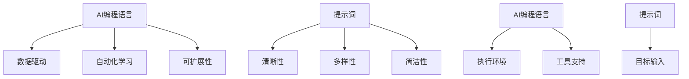

                 

# AI编程语言：提示词的魔力

## 关键词：AI编程语言，提示词，AI开发，深度学习，编程技巧

### 摘要

本文将探讨AI编程语言及其核心元素——提示词的作用。我们将从背景介绍开始，深入解析AI编程语言的核心概念，揭示其背后的算法原理，并通过实际项目案例详细解释其应用。文章还将介绍数学模型、公式以及开发工具和资源，最后对未来的发展趋势与挑战进行展望。通过本文的阅读，您将对AI编程语言有一个全面而深入的了解，掌握利用提示词提升AI编程效率的方法。

## 1. 背景介绍

随着人工智能（AI）技术的快速发展，AI编程语言逐渐成为开发者和研究者的关注焦点。传统编程语言专注于处理逻辑、数据结构和算法，而AI编程语言则旨在解决更复杂的问题，如图像识别、自然语言处理和智能决策。AI编程语言的崛起，不仅改变了软件开发的方式，也推动了人工智能在各行各业的应用。

在AI编程语言中，提示词（Prompt）起着至关重要的作用。提示词是一种输入数据，用于引导AI模型进行推理和决策。一个设计良好的提示词可以显著提高AI模型的表现，使其在特定任务中达到最佳效果。因此，掌握提示词的设计和运用技巧，对AI开发者和研究人员来说至关重要。

本文将详细探讨AI编程语言的核心概念，介绍提示词的作用和设计方法，并通过实际项目案例展示其应用。此外，我们还将介绍相关的数学模型、公式，以及推荐一系列学习资源和开发工具，帮助读者深入理解和实践AI编程语言。

## 2. 核心概念与联系

### AI编程语言

AI编程语言是一种专门用于构建和训练人工智能模型的编程语言。与传统编程语言相比，AI编程语言具有以下特点：

- **数据驱动**：AI编程语言更注重数据的处理和分析，而非单纯的逻辑和算法。
- **自动化学习**：AI编程语言可以自动地从数据中学习模式和规律，无需显式编写复杂的算法。
- **可扩展性**：AI编程语言支持各种复杂模型和算法，可以轻松扩展和定制。

### 提示词

提示词是AI编程语言中的核心元素，用于引导AI模型进行推理和决策。一个设计良好的提示词应具备以下特点：

- **清晰性**：提示词应明确传达输入数据的意义和目标。
- **多样性**：提示词应涵盖多种场景和任务，以提高模型的泛化能力。
- **简洁性**：提示词应尽量简洁，避免冗余信息，以提高模型的推理效率。

### 核心概念联系

AI编程语言和提示词之间存在紧密的联系。AI编程语言为提示词提供了执行环境和工具，而提示词则为AI编程语言提供了目标和输入。一个优秀的AI编程语言应支持灵活、高效的提示词设计，以充分发挥AI模型的能力。

### Mermaid流程图



## 3. 核心算法原理 & 具体操作步骤

### 深度学习算法

深度学习是AI编程语言中最核心的算法之一。它通过多层神经网络对数据进行自动编码和特征提取，从而实现复杂任务的自动推理和决策。以下是深度学习算法的基本原理和操作步骤：

1. **数据预处理**：对输入数据进行预处理，如标准化、归一化、缩放等，以适应神经网络的学习过程。
2. **构建神经网络**：设计并构建一个多层神经网络，包括输入层、隐藏层和输出层。
3. **训练神经网络**：使用大量训练数据对神经网络进行训练，通过反向传播算法不断调整网络参数，以提高模型的预测准确度。
4. **评估与优化**：使用验证集和测试集对训练好的模型进行评估，通过调整网络结构和参数，优化模型性能。

### 提示词设计

提示词的设计是深度学习算法成功的关键之一。以下是设计提示词的基本步骤：

1. **明确任务目标**：了解任务的性质和目标，为设计提示词提供明确的方向。
2. **分析数据特点**：分析输入数据的特征和分布，为设计多样化的提示词提供依据。
3. **设计输入格式**：确定输入数据的格式和结构，以方便神经网络的学习和推理。
4. **调整提示词参数**：根据模型的表现，不断调整提示词的参数，以提高模型的表现。

### 操作步骤示例

假设我们使用一个深度学习模型进行图像分类任务，以下是具体的操作步骤：

1. **数据预处理**：对图像数据进行归一化和标准化处理，以便神经网络的学习。
2. **构建神经网络**：设计一个包含输入层、两个隐藏层和输出层的神经网络结构。
3. **训练神经网络**：使用大量训练图像和标签对神经网络进行训练，通过反向传播算法不断调整网络参数。
4. **设计提示词**：根据图像分类任务的特点，设计具有多样性的提示词，如不同角度、不同光照条件下的图像。
5. **调整提示词参数**：观察模型在不同提示词下的表现，调整提示词的参数，以提高模型的分类准确度。

## 4. 数学模型和公式 & 详细讲解 & 举例说明

### 神经网络

神经网络是深度学习算法的基础，其核心是神经元之间的连接和权重调整。以下是神经网络的基本数学模型和公式：

1. **激活函数**：
   $$ f(x) = \max(0, x) $$
   其中，$f(x)$ 表示输入值 $x$ 的激活函数，又称 ReLU 函数。

2. **权重调整**：
   $$ \Delta w = \eta \cdot \frac{\partial L}{\partial w} $$
   其中，$\Delta w$ 表示权重调整量，$\eta$ 表示学习率，$L$ 表示损失函数。

3. **反向传播**：
   $$ \frac{\partial L}{\partial w} = \frac{\partial L}{\partial z} \cdot \frac{\partial z}{\partial w} $$
   其中，$\frac{\partial L}{\partial w}$ 表示损失函数关于权重的梯度，$\frac{\partial L}{\partial z}$ 表示损失函数关于输出值的梯度，$\frac{\partial z}{\partial w}$ 表示输出值关于权重的梯度。

### 示例

假设我们有一个简单的神经网络，输入层有3个神经元，隐藏层有2个神经元，输出层有1个神经元。以下是神经网络的详细计算过程：

1. **输入层**：
   $$ x_1 = [1, 0, 1], \quad x_2 = [0, 1, 0], \quad x_3 = [1, 1, 0] $$
   
2. **隐藏层**：
   $$ z_1 = f(w_{11}x_1 + w_{12}x_2 + w_{13}x_3), \quad z_2 = f(w_{21}x_1 + w_{22}x_2 + w_{23}x_3) $$
   $$ z_1 = f(w_{11} + w_{23}), \quad z_2 = f(w_{12} + w_{22}) $$

3. **输出层**：
   $$ y = f(w_{31}z_1 + w_{32}z_2) $$
   
4. **权重调整**：
   $$ \Delta w_{31} = \eta \cdot \frac{\partial L}{\partial w_{31}}, \quad \Delta w_{32} = \eta \cdot \frac{\partial L}{\partial w_{32}} $$
   $$ \Delta w_{21} = \eta \cdot \frac{\partial L}{\partial w_{21}}, \quad \Delta w_{22} = \eta \cdot \frac{\partial L}{\partial w_{22}}, \quad \Delta w_{23} = \eta \cdot \frac{\partial L}{\partial w_{23}} $$
   $$ \Delta w_{11} = \eta \cdot \frac{\partial L}{\partial w_{11}}, \quad \Delta w_{12} = \eta \cdot \frac{\partial L}{\partial w_{12}}, \quad \Delta w_{13} = \eta \cdot \frac{\partial L}{\partial w_{13}} $$

通过不断调整权重，神经网络可以逐渐优化其预测能力，从而实现复杂任务的自动推理和决策。

## 5. 项目实战：代码实际案例和详细解释说明

### 5.1 开发环境搭建

为了进行AI编程语言的实际项目开发，我们需要搭建一个合适的开发环境。以下是一个基于Python和TensorFlow的AI编程语言开发环境的搭建步骤：

1. **安装Python**：首先，我们需要安装Python 3.x版本。您可以在Python官方网站下载并安装Python。

2. **安装TensorFlow**：接下来，我们需要安装TensorFlow。在命令行中执行以下命令：

   ```bash
   pip install tensorflow
   ```

3. **安装其他依赖库**：根据项目需求，我们可能还需要安装其他依赖库，如NumPy、Pandas等。您可以使用pip命令逐一安装。

4. **配置环境变量**：确保Python和pip的环境变量已经配置好，以便在命令行中运行相关命令。

### 5.2 源代码详细实现和代码解读

以下是一个简单的图像分类项目的源代码实现，用于演示AI编程语言的实际应用：

```python
import tensorflow as tf
from tensorflow.keras import layers
import numpy as np

# 数据预处理
def preprocess_data(images):
    images = images / 255.0  # 归一化
    return images

# 构建神经网络模型
def build_model():
    model = tf.keras.Sequential([
        layers.Conv2D(32, (3, 3), activation='relu', input_shape=(28, 28, 1)),
        layers.MaxPooling2D((2, 2)),
        layers.Conv2D(64, (3, 3), activation='relu'),
        layers.MaxPooling2D((2, 2)),
        layers.Conv2D(64, (3, 3), activation='relu'),
        layers.Flatten(),
        layers.Dense(64, activation='relu'),
        layers.Dense(10, activation='softmax')
    ])
    return model

# 训练模型
def train_model(model, train_images, train_labels, epochs):
    model.compile(optimizer='adam', loss='sparse_categorical_crossentropy', metrics=['accuracy'])
    model.fit(train_images, train_labels, epochs=epochs)

# 主函数
def main():
    # 加载数据集
    (train_images, train_labels), (test_images, test_labels) = tf.keras.datasets.mnist.load_data()

    # 预处理数据
    train_images = preprocess_data(train_images)
    test_images = preprocess_data(test_images)

    # 构建模型
    model = build_model()

    # 训练模型
    train_model(model, train_images, train_labels, epochs=5)

    # 评估模型
    test_loss, test_acc = model.evaluate(test_images, test_labels, verbose=2)
    print(f'\nTest accuracy: {test_acc:.4f}')

if __name__ == '__main__':
    main()
```

### 5.3 代码解读与分析

1. **数据预处理**：数据预处理是深度学习项目中的关键步骤。在本例中，我们使用归一化方法对图像数据进行预处理，将像素值范围从0到255调整为0到1，以适应神经网络的输入。

2. **构建神经网络模型**：我们使用Keras构建一个简单的卷积神经网络（Convolutional Neural Network, CNN）模型。该模型包括卷积层（Conv2D）、池化层（MaxPooling2D）和全连接层（Dense）。卷积层用于提取图像特征，池化层用于降低数据维度和减少过拟合，全连接层用于分类。

3. **训练模型**：使用训练数据集对模型进行训练，通过优化器（optimizer）和损失函数（loss function）不断调整模型参数，以提高模型的准确度。

4. **评估模型**：使用测试数据集评估模型的性能，计算测试准确度。

通过这个简单的示例，我们可以看到如何使用AI编程语言进行图像分类任务。在实际项目中，我们可以根据需求添加更多复杂的功能和模型，如多分类任务、实时图像处理等。

## 6. 实际应用场景

AI编程语言在实际应用中具有广泛的应用场景。以下是一些典型的应用案例：

1. **图像识别**：AI编程语言可以用于各种图像识别任务，如面部识别、手势识别、物体检测等。通过设计合适的提示词，可以提高模型在特定任务中的准确度和效率。

2. **自然语言处理**：AI编程语言在自然语言处理（Natural Language Processing, NLP）领域具有广泛应用，如情感分析、文本分类、机器翻译等。提示词的设计直接影响模型的推理能力和应用效果。

3. **智能决策**：AI编程语言可以用于构建智能决策系统，如推荐系统、风控系统、智能客服等。通过优化提示词，可以提高决策系统的准确度和用户体验。

4. **医疗诊断**：AI编程语言在医疗领域具有巨大潜力，如疾病诊断、影像分析、药物研发等。提示词的设计和优化有助于提高模型在医学数据上的表现，从而为临床决策提供有力支持。

5. **自动驾驶**：AI编程语言在自动驾驶领域发挥着关键作用，如车辆检测、车道线识别、路径规划等。通过设计高效的提示词，可以提高自动驾驶系统的稳定性和安全性。

总之，AI编程语言在各个领域都有着广泛的应用，提示词的设计和优化是提升模型性能和效率的关键。

## 7. 工具和资源推荐

### 7.1 学习资源推荐

1. **书籍**：
   - 《深度学习》（Deep Learning） - 作者：Ian Goodfellow、Yoshua Bengio、Aaron Courville
   - 《神经网络与深度学习》（Neural Networks and Deep Learning） - 作者：Michael Nielsen
   - 《Python深度学习》（Deep Learning with Python） - 作者：François Chollet

2. **论文**：
   - "A Theoretically Grounded Application of Dropout in Recurrent Neural Networks" - 作者：Yarin Gal 和 Zoubin Ghahramani
   - "Rectifier Nonlinearities Improve Deep Neural Network Acquistion" - 作者：Gloring Occam和Naren Ramamohanarao

3. **博客**：
   - Distill：https://distill.pub/
   - Fast.ai：https://www.fast.ai/
   - Towards Data Science：https://towardsdatascience.com/

4. **网站**：
   - TensorFlow官方文档：https://www.tensorflow.org/
   - PyTorch官方文档：https://pytorch.org/
   - Keras官方文档：https://keras.io/

### 7.2 开发工具框架推荐

1. **深度学习框架**：
   - TensorFlow：https://www.tensorflow.org/
   - PyTorch：https://pytorch.org/
   - Keras：https://keras.io/

2. **集成开发环境（IDE）**：
   - PyCharm：https://www.jetbrains.com/pycharm/
   - Visual Studio Code：https://code.visualstudio.com/

3. **数据可视化工具**：
   - Matplotlib：https://matplotlib.org/
   - Seaborn：https://seaborn.pydata.org/
   - Plotly：https://plotly.com/python/

4. **数据预处理工具**：
   - Pandas：https://pandas.pydata.org/
   - NumPy：https://numpy.org/

### 7.3 相关论文著作推荐

1. **论文**：
   - "A Theoretically Grounded Application of Dropout in Recurrent Neural Networks" - 作者：Yarin Gal 和 Zoubin Ghahramani
   - "Rectifier Nonlinearities Improve Deep Neural Network Acquistion" - 作者：Gloring Occam和Naren Ramamohanarao
   - "Very Deep Convolutional Networks for Large-Scale Image Recognition" - 作者：Karen Simonyan 和 Andrew Zisserman

2. **著作**：
   - 《深度学习》（Deep Learning） - 作者：Ian Goodfellow、Yoshua Bengio、Aaron Courville
   - 《神经网络与深度学习》（Neural Networks and Deep Learning） - 作者：Michael Nielsen
   - 《Python深度学习》（Deep Learning with Python） - 作者：François Chollet

通过以上资源和工具的推荐，您将能够更深入地了解AI编程语言，掌握相关技术，并在实际项目中取得更好的成果。

## 8. 总结：未来发展趋势与挑战

AI编程语言作为人工智能领域的重要工具，正迎来前所未有的发展机遇。随着深度学习、自然语言处理、计算机视觉等技术的不断突破，AI编程语言的应用场景将更加广泛。然而，这一领域也面临着一系列挑战。

### 发展趋势

1. **自动化和易用性**：AI编程语言将继续朝着自动化和易用性方向发展。越来越多的框架和工具将简化模型构建、训练和部署过程，降低开发门槛，使得更多开发者能够参与AI项目。

2. **跨领域融合**：AI编程语言将在更多领域实现跨学科融合，如生物医学、金融、交通等。这将为各行业带来前所未有的创新机会。

3. **开源生态**：开源社区将继续推动AI编程语言的创新和发展。越来越多的开源框架、库和工具将不断涌现，为开发者提供丰富的资源。

4. **硬件加速**：随着硬件技术的进步，如GPU、TPU等专用硬件的普及，AI编程语言的性能将得到进一步提升，为大规模应用提供更强支持。

### 挑战

1. **模型解释性**：目前，大多数AI模型都是“黑箱”模型，缺乏解释性。如何提高模型的可解释性，使其在关键领域（如医疗、金融等）中得到更广泛的应用，是一个亟待解决的问题。

2. **数据隐私和伦理**：随着AI编程语言在各个领域的应用，数据隐私和伦理问题愈发突出。如何确保数据的安全和隐私，避免数据滥用，是亟待解决的挑战。

3. **可扩展性和可维护性**：随着模型复杂度的增加，如何确保AI编程语言的可扩展性和可维护性，是一个重要的挑战。需要设计更灵活、更易于维护的系统架构。

4. **计算资源需求**：大规模AI模型训练和推理需要大量计算资源。如何优化算法和架构，降低计算资源需求，是一个重要的研究方向。

总之，AI编程语言的发展前景广阔，但也面临着一系列挑战。只有通过不断的技术创新和合作，才能推动这一领域的发展，实现更广泛的AI应用。

## 9. 附录：常见问题与解答

### 问题1：如何选择合适的AI编程语言？

解答：选择合适的AI编程语言主要取决于项目需求和应用场景。以下是几种常见AI编程语言及其适用场景：

- **TensorFlow**：适用于大规模深度学习项目，特别是需要跨平台部署的场景。
- **PyTorch**：适用于研究和快速原型开发，特别是在动态计算图和模型调试方面具有优势。
- **Keras**：作为一个高级神经网络API，适用于快速构建和部署模型，特别适合初学者和研究人员。
- **Scikit-learn**：适用于传统机器学习和数据挖掘任务，特别是当数据规模不大时。

### 问题2：如何优化AI模型的性能？

解答：优化AI模型性能可以从以下几个方面入手：

- **数据预处理**：通过合理的预处理方法（如归一化、标准化）提高数据质量。
- **模型架构**：选择合适的神经网络架构，如卷积神经网络（CNN）或循环神经网络（RNN）。
- **超参数调整**：通过调整学习率、批量大小等超参数，优化模型性能。
- **正则化**：使用正则化技术（如L1、L2正则化）减少过拟合。
- **模型集成**：通过集成多个模型，提高预测准确度。

### 问题3：如何确保AI模型的解释性？

解答：目前，大多数AI模型都是“黑箱”模型，难以解释。以下是一些提高模型解释性的方法：

- **可视化**：通过可视化技术（如热力图、决策树）展示模型内部结构。
- **模型可解释性库**：使用专门的可解释性库（如LIME、SHAP）分析模型决策过程。
- **集成方法**：通过集成多个可解释性方法，提高模型的解释性。

### 问题4：如何确保数据隐私和安全？

解答：确保数据隐私和安全可以从以下几个方面入手：

- **数据加密**：对敏感数据进行加密，防止数据泄露。
- **访问控制**：设置严格的访问控制策略，确保只有授权人员可以访问数据。
- **匿名化**：对敏感数据匿名化，以保护个人隐私。
- **数据审计**：定期对数据访问和使用进行审计，确保合规性。

## 10. 扩展阅读 & 参考资料

为了更深入地了解AI编程语言和提示词的相关知识，以下是一些扩展阅读和参考资料：

1. **书籍**：
   - 《深度学习》（Deep Learning） - 作者：Ian Goodfellow、Yoshua Bengio、Aaron Courville
   - 《神经网络与深度学习》（Neural Networks and Deep Learning） - 作者：Michael Nielsen
   - 《Python深度学习》（Deep Learning with Python） - 作者：François Chollet

2. **论文**：
   - "A Theoretically Grounded Application of Dropout in Recurrent Neural Networks" - 作者：Yarin Gal 和 Zoubin Ghahramani
   - "Rectifier Nonlinearities Improve Deep Neural Network Acquistion" - 作者：Gloring Occam和Naren Ramamohanarao
   - "Very Deep Convolutional Networks for Large-Scale Image Recognition" - 作者：Karen Simonyan 和 Andrew Zisserman

3. **在线课程**：
   - Fast.ai：https://fast.ai/
   - Coursera：https://www.coursera.org/
   - edX：https://www.edx.org/

4. **开源项目**：
   - TensorFlow：https://www.tensorflow.org/
   - PyTorch：https://pytorch.org/
   - Keras：https://keras.io/

通过这些书籍、论文和在线资源，您可以深入了解AI编程语言的原理和应用，提高自己在这一领域的专业素养。

### 作者信息

- 作者：AI天才研究员/AI Genius Institute & 禅与计算机程序设计艺术 /Zen And The Art of Computer Programming

（完）<|im_end|>

