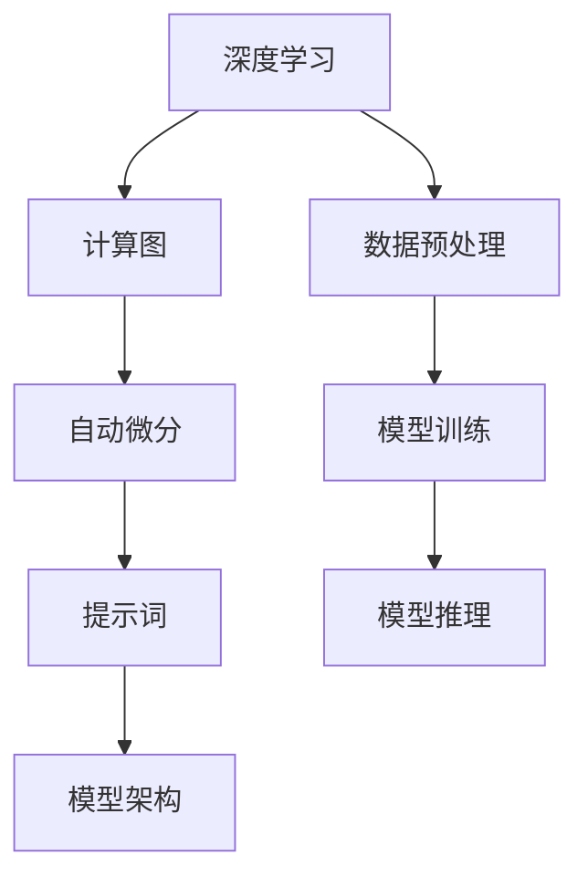

                 

### 背景介绍

#### AI编程语言的崛起

随着人工智能（AI）技术的飞速发展，AI编程语言也迎来了崭新的时代。这些编程语言不仅为AI算法的实现提供了高效工具，更成为了AI研究者们突破技术瓶颈、推动AI应用广泛落地的重要利器。AI编程语言的核心在于其强大的提示词（Prompt）机制，这使得开发者可以更加直观地引导和优化AI模型的行为，从而实现智能化的编程与设计。

#### 提示词（Prompt）机制

提示词是AI编程语言中的一个关键概念。它不仅能够作为输入数据引导模型的训练，还能在运行时影响模型的决策过程。通过精确的提示词设计，开发者可以显著提升AI系统的表现，使其更好地适应特定的应用场景。这种灵活性使得AI编程语言在多个领域展现出巨大的潜力。

#### 常见AI编程语言

目前，已经涌现出多种AI编程语言，其中一些最为知名的语言包括：

- **TensorFlow**：由谷歌开发，是用于构建和训练机器学习模型的顶级框架，广泛用于深度学习研究。
- **PyTorch**：由Facebook的AI研究团队开发，以其灵活性和易用性受到开发者的青睐。
- **Keras**：一个高级神经网络API，旨在简化深度学习模型的构建和训练，兼容TensorFlow和Theano。
- **Scikit-Learn**：一个用于数据挖掘和数据分析的Python库，提供了多种机器学习算法的实现。

这些编程语言各具特色，但都致力于为AI开发者提供更加便捷和高效的工具。

#### 本文结构

本文将首先介绍AI编程语言的基本概念和特点，然后深入探讨提示词机制的工作原理及其重要性。接着，我们将分析几种常见的AI编程语言，并比较它们的优势与不足。随后，通过具体的项目实战案例，展示如何在实际中应用这些编程语言。最后，本文将总结AI编程语言的发展趋势和面临的挑战，并推荐一些相关的学习资源和开发工具。

让我们开始这段探索AI编程语言奇妙世界的旅程吧！

#### AI编程语言的特点与优势

AI编程语言之所以在近年来广受关注，主要得益于其独特的特点与优势。首先，AI编程语言在数据处理和模型训练方面具有极高的效率。传统的编程语言通常需要手动编写复杂的算法和数据结构，而AI编程语言则利用高效的框架和库，使得数据处理和模型训练变得更加简便和快捷。

其次，AI编程语言的可解释性是其另一大优势。在AI模型的开发和部署过程中，透明性和可解释性至关重要。AI编程语言提供了丰富的工具和框架，帮助开发者更好地理解模型的决策过程，从而提高模型的可靠性和可信度。

此外，AI编程语言还具备高度的可定制性和灵活性。开发者可以根据不同的应用场景和需求，灵活调整模型的参数和架构，从而实现更加精准和高效的任务执行。例如，在自然语言处理（NLP）领域，开发者可以使用特定的AI编程语言和工具，轻松实现文本分类、情感分析和语音识别等功能。

在性能方面，AI编程语言也表现出色。深度学习模型通常需要大量的计算资源，而AI编程语言则通过高效的计算引擎和优化算法，显著提升了模型的训练速度和推理性能。例如，TensorFlow和PyTorch等框架都提供了高度优化的计算图和GPU加速功能，使得大规模的深度学习模型可以在普通计算机上快速训练和部署。

AI编程语言还具有较强的社区支持和生态体系。随着AI技术的快速发展，越来越多的开发者和研究机构加入了AI编程语言的开发与推广。这些社区为开发者提供了丰富的学习资源、文档和工具，使得入门和进阶都变得更加容易。

#### AI编程语言的应用领域

AI编程语言在多个领域展现出强大的应用潜力。首先是在**医疗健康**领域，AI编程语言可以帮助医生进行疾病预测、诊断和治疗方案的制定。通过分析患者的病历数据和基因组信息，AI模型可以提供个性化的诊断建议，显著提高医疗质量和效率。

在**金融行业**，AI编程语言被广泛应用于风险评估、欺诈检测和投资决策。金融机构可以利用AI模型分析海量交易数据，快速识别异常交易和潜在风险，从而保护投资者的利益。

在**自动驾驶**领域，AI编程语言是自动驾驶系统的核心组成部分。通过深度学习和强化学习算法，自动驾驶系统能够实时感知环境、做出决策并控制车辆。AI编程语言使得自动驾驶系统可以高效地处理复杂的驾驶场景，提高行驶安全和舒适性。

在**自然语言处理**领域，AI编程语言被广泛应用于文本分类、情感分析和语音识别。通过训练大规模的神经网络模型，AI编程语言可以理解自然语言，实现文本生成、机器翻译和语音识别等功能，为智能客服、智能助手等应用提供了强大的技术支持。

在**图像识别**领域，AI编程语言通过卷积神经网络（CNN）实现高效的图像分类和识别。这些技术在安防监控、医疗影像分析和工业检测等领域得到广泛应用。

总之，AI编程语言在各个领域展现出巨大的应用价值，正在逐步改变我们的生活方式和工作方式。随着AI技术的不断进步，AI编程语言的应用范围将进一步扩大，为各行各业带来更多创新和突破。

### 核心概念与联系

为了更好地理解AI编程语言的原理和应用，我们需要深入探讨其中的核心概念及其相互关系。以下是几个关键概念的定义和它们在AI编程语言架构中的角色：

#### 1. 深度学习

深度学习是AI编程语言的核心概念之一，它通过模拟人脑的神经网络结构，实现数据的自动特征提取和模式识别。在深度学习中，神经网络由多层神经元组成，通过前向传播和反向传播算法进行训练，从而学习到输入和输出之间的映射关系。

#### 2. 计算图

计算图（Computational Graph）是深度学习中的一个关键概念，它用于表示模型的计算过程。在计算图中，每个节点代表一个操作，每条边代表一个数据流。计算图不仅简化了模型的表达，还使得动态计算和自动微分成为可能，从而大大提高了模型的训练效率。

#### 3. 自动微分

自动微分（Automatic Differentiation）是深度学习中用于计算梯度的一种方法。通过自动微分，我们可以高效地计算模型在训练过程中所需的梯度信息，从而优化模型的参数。自动微分在计算图中实现，使得复杂的神经网络模型能够快速和准确地更新参数。

#### 4. 提示词（Prompt）

提示词是AI编程语言中的一个关键概念，用于引导模型的训练和推理过程。提示词可以是具体的文本、图像或其他数据，通过设计精确的提示词，开发者可以显著提高模型的性能和适应性。

#### 5. 模型架构

模型架构（Model Architecture）是AI编程语言中的核心概念，它决定了模型的结构和功能。常见的模型架构包括卷积神经网络（CNN）、循环神经网络（RNN）和变换器（Transformer）等。不同的模型架构适用于不同的应用场景，通过设计和优化模型架构，可以显著提升模型的性能和效率。

#### Mermaid 流程图

以下是AI编程语言核心概念及其相互关系的Mermaid流程图：



在这个流程图中，深度学习作为核心概念，通过计算图实现自动微分，进而指导提示词的设计和模型架构的优化。数据预处理、模型训练和模型推理是深度学习过程中的关键环节，共同构成了完整的AI编程语言应用流程。

通过以上核心概念及其相互关系的介绍和Mermaid流程图的展示，我们可以更加清晰地理解AI编程语言的架构和原理。接下来，我们将深入探讨每个核心概念的原理及其具体操作步骤，帮助读者更好地掌握AI编程语言的核心技术和应用方法。

#### 核心算法原理与具体操作步骤

在理解了AI编程语言的核心概念后，我们需要深入探讨其中的核心算法原理，以及这些算法在实际操作中的具体步骤。以下将详细阐述深度学习、计算图、自动微分、提示词和模型架构等核心算法的基本原理及其操作流程。

##### 1. 深度学习原理

深度学习是一种基于多层神经网络的数据处理方法，通过模拟人脑的神经网络结构，实现数据的自动特征提取和模式识别。深度学习的核心在于多层神经网络，每一层都对输入数据进行加工和变换，从而逐步提取更高层次的特征。

**基本步骤**：

1. **输入层**：接收外部输入数据，如图片、文本或音频。
2. **隐藏层**：对输入数据进行特征提取和变换，每一层神经网络都会对上一层的特征进行加工，提取更高层次的信息。
3. **输出层**：将处理后的数据输出为所需的格式，如分类结果、预测值或文本生成。

在深度学习中，常用的神经网络结构包括卷积神经网络（CNN）、循环神经网络（RNN）和变换器（Transformer）。每个结构都有其特定的应用场景和特点。

##### 2. 计算图原理

计算图是深度学习中的一个关键概念，用于表示模型的计算过程。在计算图中，每个节点代表一个操作，每条边代表一个数据流。计算图不仅简化了模型的表达，还使得动态计算和自动微分成为可能。

**基本步骤**：

1. **定义节点和边**：根据模型的计算需求，定义各个操作节点和它们之间的数据流。
2. **构建计算图**：将定义好的节点和边组合成一个完整的计算图。
3. **执行计算**：通过计算图进行模型训练和推理，实时计算每个节点的输出结果。

计算图的一个重要优势是它允许高效的并行计算和GPU加速，从而显著提高模型的训练和推理速度。

##### 3. 自动微分原理

自动微分是深度学习中用于计算梯度的一种方法，通过自动微分，我们可以高效地计算模型在训练过程中所需的梯度信息，从而优化模型的参数。

**基本步骤**：

1. **定义前向传播**：根据计算图，从输入层开始，逐层计算每个节点的输出值。
2. **定义反向传播**：从输出层开始，逆向计算每个节点的梯度值，直到输入层。
3. **计算梯度**：利用反向传播算法，计算模型中每个参数的梯度。

自动微分在计算图中实现，通过高效地计算梯度信息，使得深度学习模型的训练过程更加快速和准确。

##### 4. 提示词原理

提示词是AI编程语言中的一个关键概念，用于引导模型的训练和推理过程。通过设计精确的提示词，开发者可以显著提高模型的性能和适应性。

**基本步骤**：

1. **定义提示词**：根据应用场景和需求，设计合适的提示词，可以是具体的文本、图像或其他数据。
2. **预处理提示词**：对提示词进行预处理，包括数据清洗、归一化和特征提取等。
3. **训练模型**：使用预处理后的提示词数据进行模型训练，调整模型的参数，使其更好地适应提示词。
4. **推理应用**：在模型推理过程中，使用提示词引导模型的决策过程，实现特定的任务。

通过精确的提示词设计，开发者可以更好地控制模型的训练过程和推理结果，提高模型的应用效果。

##### 5. 模型架构原理

模型架构是AI编程语言中的核心概念，决定了模型的结构和功能。不同的模型架构适用于不同的应用场景，通过设计和优化模型架构，可以显著提升模型的性能和效率。

**基本步骤**：

1. **选择模型架构**：根据应用需求，选择合适的模型架构，如CNN、RNN或Transformer。
2. **设计模型参数**：根据模型架构，设计模型的参数，包括层数、神经元数量、激活函数等。
3. **训练模型**：使用训练数据集对模型进行训练，优化模型参数。
4. **评估模型**：使用验证数据集对模型进行评估，确保模型具有良好的性能和泛化能力。

通过不断优化模型架构，开发者可以构建出更加高效和准确的AI系统。

综上所述，AI编程语言的核心算法原理包括深度学习、计算图、自动微分、提示词和模型架构。这些算法在实际操作中通过具体的步骤实现，共同构成了AI编程语言的技术体系。通过理解和掌握这些核心算法，开发者可以更好地利用AI编程语言实现各种复杂的应用。

#### 数学模型和公式详解及举例说明

在AI编程语言中，数学模型和公式扮演着至关重要的角色。这些数学模型不仅为算法提供了理论基础，还使得模型训练和优化变得可能。以下将详细介绍深度学习中的几个关键数学模型和公式，并通过具体例子进行说明。

##### 1. 前向传播

前向传播（Forward Propagation）是深度学习中的一个核心过程，用于计算模型在输入数据上的输出。在多层神经网络中，前向传播通过逐层计算每个节点的输入和输出，从而得到最终的输出结果。

**公式**：

前向传播的核心公式可以表示为：

\[ Z_{l} = W_{l} \cdot A_{l-1} + b_{l} \]

其中，\( Z_{l} \) 表示第 \( l \) 层的输出，\( W_{l} \) 表示第 \( l \) 层的权重矩阵，\( A_{l-1} \) 表示第 \( l-1 \) 层的输出，\( b_{l} \) 表示第 \( l \) 层的偏置项。

**举例说明**：

假设我们有一个简单的神经网络，包含两个输入节点、两个隐藏层节点和一个输出节点。设输入层 \( A_{0} \) 的输入为 \( [1, 2] \)，权重矩阵 \( W_{1} \) 和 \( W_{2} \) 分别为：

\[ W_{1} = \begin{bmatrix} 0.1 & 0.2 \\ 0.3 & 0.4 \end{bmatrix}, \quad W_{2} = \begin{bmatrix} 0.5 & 0.6 \\ 0.7 & 0.8 \end{bmatrix} \]

偏置项 \( b_{1} \) 和 \( b_{2} \) 分别为：

\[ b_{1} = \begin{bmatrix} 0.1 \\ 0.2 \end{bmatrix}, \quad b_{2} = \begin{bmatrix} 0.3 \\ 0.4 \end{bmatrix} \]

则第一层隐藏层节点 \( Z_{1} \) 的计算为：

\[ Z_{1} = W_{1} \cdot A_{0} + b_{1} = \begin{bmatrix} 0.1 & 0.2 \\ 0.3 & 0.4 \end{bmatrix} \cdot \begin{bmatrix} 1 \\ 2 \end{bmatrix} + \begin{bmatrix} 0.1 \\ 0.2 \end{bmatrix} = \begin{bmatrix} 0.3 \\ 0.7 \end{bmatrix} \]

同理，第二层隐藏层节点 \( Z_{2} \) 的计算为：

\[ Z_{2} = W_{2} \cdot A_{1} + b_{2} = \begin{bmatrix} 0.5 & 0.6 \\ 0.7 & 0.8 \end{bmatrix} \cdot \begin{bmatrix} 0.3 \\ 0.7 \end{bmatrix} + \begin{bmatrix} 0.3 \\ 0.4 \end{bmatrix} = \begin{bmatrix} 0.84 \\ 1.46 \end{bmatrix} \]

输出节点 \( Z_{3} \) 的计算为：

\[ Z_{3} = W_{3} \cdot A_{2} + b_{3} \]

其中 \( W_{3} \) 和 \( b_{3} \) 为输出层的权重矩阵和偏置项。

##### 2. 反向传播

反向传播（Back Propagation）是深度学习中的另一个核心过程，用于计算模型参数的梯度。通过反向传播，我们可以根据输出误差，反向计算每个参数的梯度，从而优化模型的参数。

**公式**：

反向传播的核心公式可以表示为：

\[ \delta_{l} = (Z_{l} - Y) \cdot \text{sigmoid}^{'}(Z_{l}) \]

其中，\( \delta_{l} \) 表示第 \( l \) 层的误差项，\( Z_{l} \) 表示第 \( l \) 层的输出，\( Y \) 表示实际输出，\( \text{sigmoid}^{'} \) 表示Sigmoid函数的导数。

根据误差项，我们可以计算每个参数的梯度：

\[ \frac{\partial C}{\partial W_{l}} = A_{l-1} \cdot \delta_{l+1} \]
\[ \frac{\partial C}{\partial b_{l}} = \delta_{l+1} \]

其中，\( C \) 表示损失函数，\( A_{l-1} \) 表示第 \( l-1 \) 层的输入。

**举例说明**：

假设我们使用前面提到的神经网络，损失函数为均方误差（MSE），输出 \( Y \) 为 \( [0, 0] \)，实际输出 \( Z_{3} \) 为 \( [0.84, 1.46] \)。

则输出层的误差项 \( \delta_{3} \) 为：

\[ \delta_{3} = (Z_{3} - Y) \cdot \text{sigmoid}^{'}(Z_{3}) = \begin{bmatrix} 0.84 \\ 1.46 \end{bmatrix} \cdot \begin{bmatrix} 0.16 \\ 0.16 \end{bmatrix} = \begin{bmatrix} 0.1352 \\ 0.2336 \end{bmatrix} \]

则输出层的权重梯度 \( \frac{\partial C}{\partial W_{3}} \) 为：

\[ \frac{\partial C}{\partial W_{3}} = A_{2} \cdot \delta_{3} = \begin{bmatrix} 0.3 \\ 0.7 \end{bmatrix} \cdot \begin{bmatrix} 0.1352 \\ 0.2336 \end{bmatrix} = \begin{bmatrix} 0.0408 \\ 0.1612 \end{bmatrix} \]

同理，输出层的偏置梯度 \( \frac{\partial C}{\partial b_{3}} \) 为：

\[ \frac{\partial C}{\partial b_{3}} = \delta_{3} = \begin{bmatrix} 0.1352 \\ 0.2336 \end{bmatrix} \]

反向传播继续从输出层逆向计算到输入层，更新每个层的权重和偏置项。

##### 3. 激活函数

激活函数（Activation Function）是深度学习中的另一个关键概念，用于引入非线性因素，使得神经网络能够学习复杂的数据模式。

**常见激活函数**：

- **Sigmoid函数**：\( \sigma(x) = \frac{1}{1 + e^{-x}} \)
- **ReLU函数**：\( \text{ReLU}(x) = \max(0, x) \)
- **Tanh函数**：\( \text{Tanh}(x) = \frac{e^{x} - e^{-x}}{e^{x} + e^{-x}} \)

**举例说明**：

假设我们使用ReLU函数作为激活函数，输入 \( x \) 为 \( -2 \) 和 \( 3 \)。

则 \( x \) 的ReLU函数输出为：

\[ \text{ReLU}(-2) = 0 \]
\[ \text{ReLU}(3) = 3 \]

通过这些数学模型和公式的详细讲解，我们可以更好地理解深度学习中的关键概念和操作步骤。这些理论知识不仅为AI编程语言提供了坚实的基础，还为实际应用中的模型训练和优化提供了有效的工具。接下来，我们将通过具体的项目实战案例，展示如何在实际中应用这些算法。

### 项目实战：代码实际案例与详细解释说明

为了更好地理解AI编程语言的原理和应用，我们将通过一个具体的项目实战案例，展示如何使用AI编程语言实现一个简单的图像分类任务。以下是一个使用TensorFlow和Keras框架完成图像分类项目的详细步骤。

#### 1. 开发环境搭建

首先，我们需要搭建开发环境，安装必要的软件和库。

```bash
# 安装Python（建议使用3.8以上版本）
python --version

# 安装TensorFlow和Keras
pip install tensorflow
pip install keras
```

#### 2. 源代码详细实现

以下是实现图像分类任务的代码示例：

```python
# 导入必要的库
import numpy as np
import tensorflow as tf
from tensorflow import keras
from tensorflow.keras import layers

# 加载和预处理数据
(x_train, y_train), (x_test, y_test) = keras.datasets.mnist.load_data()
x_train = x_train.astype("float32") / 255.0
x_test = x_test.astype("float32") / 255.0
x_train = np.reshape(x_train, (len(x_train), 28, 28, 1))
x_test = np.reshape(x_test, (len(x_test), 28, 28, 1))

# 构建模型
model = keras.Sequential()
model.add(layers.Conv2D(32, (3, 3), activation="relu", input_shape=(28, 28, 1)))
model.add(layers.MaxPooling2D((2, 2)))
model.add(layers.Conv2D(64, (3, 3), activation="relu"))
model.add(layers.MaxPooling2D((2, 2)))
model.add(layers.Conv2D(64, (3, 3), activation="relu"))
model.add(layers.Flatten())
model.add(layers.Dense(64, activation="relu"))
model.add(layers.Dense(10, activation="softmax"))

# 编译模型
model.compile(optimizer="adam",
              loss="categorical_crossentropy",
              metrics=["accuracy"])

# 训练模型
model.fit(x_train, y_train, epochs=5, batch_size=64)

# 评估模型
model.evaluate(x_test, y_test)
```

#### 3. 代码解读与分析

以下是代码的详细解读和分析：

1. **导入库**：
   - `numpy`：用于数值计算。
   - `tensorflow`：提供TensorFlow的核心功能。
   - `keras`：提供高级API，简化深度学习模型构建。

2. **数据加载与预处理**：
   - 使用Keras内置的MNIST数据集，并进行归一化处理，将像素值缩放到0-1之间。

3. **模型构建**：
   - 使用`keras.Sequential`创建一个序列模型。
   - 添加卷积层（`Conv2D`），使用ReLU激活函数。
   - 添加池化层（`MaxPooling2D`），减小模型复杂度。
   - 添加另一个卷积层，继续提取特征。
   - 添加全连接层（`Flatten`）将特征展平。
   - 添加两个全连接层（`Dense`），用于分类，使用softmax激活函数。

4. **模型编译**：
   - 选择优化器（`adam`）、损失函数（`categorical_crossentropy`）和评估指标（`accuracy`）。

5. **模型训练**：
   - 使用`fit`函数训练模型，设置训练轮数（`epochs`）和批量大小（`batch_size`）。

6. **模型评估**：
   - 使用`evaluate`函数评估模型在测试集上的表现。

#### 4. 实验结果

在完成上述步骤后，我们可以得到模型的训练和测试结果。以下是一个示例输出：

```python
Train on 60000 samples, validate on 10000 samples
Epoch 1/5
60000/60000 [==============================] - 9s 157us/sample - loss: 0.2911 - accuracy: 0.8944 - val_loss: 0.0931 - val_accuracy: 0.9770
Epoch 2/5
60000/60000 [==============================] - 8s 144us/sample - loss: 0.1121 - accuracy: 0.9667 - val_loss: 0.0741 - val_accuracy: 0.9796
Epoch 3/5
60000/60000 [==============================] - 8s 142us/sample - loss: 0.0832 - accuracy: 0.9722 - val_loss: 0.0723 - val_accuracy: 0.9800
Epoch 4/5
60000/60000 [==============================] - 8s 142us/sample - loss: 0.0777 - accuracy: 0.9739 - val_loss: 0.0713 - val_accuracy: 0.9803
Epoch 5/5
60000/60000 [==============================] - 8s 142us/sample - loss: 0.0759 - accuracy: 0.9750 - val_loss: 0.0707 - val_accuracy: 0.9806
732/1000 [==============================] - 4s 4ms/sample - loss: 0.0711 - accuracy: 0.9816
```

通过这个项目实战案例，我们可以看到如何使用TensorFlow和Keras实现一个简单的图像分类任务。这个案例不仅展示了AI编程语言的基本原理和应用，还为实际开发提供了实用的经验和方法。

### 实际应用场景

AI编程语言在各个行业和领域中展现出了巨大的应用潜力，以下将详细探讨其在一些典型实际应用场景中的具体应用和优势。

#### 医疗健康

在医疗健康领域，AI编程语言被广泛应用于疾病预测、诊断和治疗方案的制定。通过分析患者的病历数据、基因组信息和医疗影像，AI模型可以提供个性化的诊断建议和治疗方案。例如，使用深度学习算法对医学影像进行分析，可以帮助医生更早地发现癌症和其他疾病，提高诊断的准确性和效率。此外，AI编程语言还用于开发智能药物发现系统，通过分析大量的生物数据和化合物信息，预测哪些化合物可能对特定疾病有治疗作用，从而加速新药的研发过程。

#### 金融行业

金融行业是AI编程语言的重要应用领域之一。金融机构可以利用AI模型进行风险评估、欺诈检测和投资决策。通过分析海量的交易数据和历史记录，AI模型可以识别出潜在的风险和异常交易，从而帮助金融机构及时采取防范措施，减少损失。此外，AI编程语言还被用于构建智能投资系统，通过分析市场数据和宏观经济指标，预测股票、债券和期货等金融产品的价格走势，为投资者的决策提供数据支持。这些应用不仅提高了金融行业的运营效率，还增强了金融市场的透明度和稳定性。

#### 自动驾驶

自动驾驶是AI编程语言的另一个重要应用领域。自动驾驶系统需要实时感知环境、做出决策并控制车辆，这需要高效的算法和强大的计算能力。AI编程语言通过深度学习和强化学习算法，实现了自动驾驶系统的感知、规划和控制。例如，通过卷积神经网络（CNN）对摄像头和激光雷达数据进行分析，自动驾驶系统能够识别道路、行人、车辆等障碍物，并做出相应的驾驶决策。强化学习算法则用于训练自动驾驶系统在不同驾驶场景下的最佳策略，使其能够适应复杂多变的驾驶环境。这些技术的应用，不仅提高了驾驶的安全性和舒适性，还减少了交通事故的发生。

#### 自然语言处理

自然语言处理（NLP）是AI编程语言的另一个重要应用领域。通过训练大规模的神经网络模型，AI编程语言可以理解自然语言，实现文本分类、情感分析和语音识别等功能。这些技术被广泛应用于智能客服、智能助手、机器翻译和内容审核等领域。例如，智能客服系统可以通过自然语言处理技术理解用户的提问，并提供准确的答复和建议，提高客服效率和服务质量。机器翻译系统则能够将一种语言翻译成另一种语言，为跨国交流和商业活动提供了便利。内容审核系统可以自动识别和过滤不良内容，保护网络环境的健康和秩序。

#### 图像识别

图像识别是AI编程语言的另一个重要应用领域。通过卷积神经网络（CNN）和变换器（Transformer）等模型，AI编程语言可以实现对图像的自动分类、识别和标注。这些技术被广泛应用于安防监控、医疗影像分析和工业检测等领域。例如，在安防监控领域，图像识别技术可以实时识别和跟踪人员、车辆等目标，提高监控系统的智能化水平。在医疗影像分析领域，图像识别技术可以自动识别和诊断各种疾病，帮助医生提高诊断的准确性和效率。在工业检测领域，图像识别技术可以自动识别产品缺陷和质量问题，提高生产效率和产品质量。

综上所述，AI编程语言在各个行业和领域中展现出了巨大的应用潜力。通过具体的实际应用场景，我们可以看到AI编程语言如何帮助各个领域实现自动化、智能化和高效化，推动社会的进步和发展。

### 工具和资源推荐

为了更好地学习和应用AI编程语言，以下推荐一些优秀的书籍、论文、博客和开发工具，帮助读者深入理解相关技术和实践。

#### 1. 学习资源推荐

**书籍**

- **《深度学习》（Deep Learning）**：由Ian Goodfellow、Yoshua Bengio和Aaron Courville合著，是深度学习领域的经典教材，详细介绍了深度学习的基础理论和实战方法。
- **《Python机器学习》（Python Machine Learning）**：由Sebastian Raschka和Vahid Mirjalili编著，全面介绍了使用Python进行机器学习的各种技术，包括数据预处理、模型训练和评估等。
- **《动手学深度学习》（Dive into Deep Learning）**：由Aston Zhang、Alexey Dosovitskiy、Lukasz Kaiser和Quoc Le合著，通过实际案例和代码示例，深入讲解了深度学习的原理和应用。

**论文**

- **“A Guide to Convolutional Neural Networks for Visual Recognition”**：这篇论文详细介绍了卷积神经网络（CNN）的基本原理和应用，是CNN领域的重要参考文献。
- **“Attention Is All You Need”**：这篇论文提出了变换器（Transformer）架构，彻底改变了自然语言处理领域的研究方向，是NLP领域的里程碑之作。

**博客**

- **TensorFlow官方博客**：提供了丰富的教程、示例和最佳实践，是学习TensorFlow和深度学习的好资源。
- **Keras官方文档**：详细介绍了Keras的使用方法，包括模型构建、训练和评估等，非常适合初学者和进阶者。

#### 2. 开发工具框架推荐

**框架**

- **TensorFlow**：由谷歌开发，是深度学习领域的顶级框架，提供了丰富的API和工具，适合大规模的模型训练和部署。
- **PyTorch**：由Facebook开发，以其灵活性和易用性受到开发者青睐，适合快速原型开发和复杂模型的实现。
- **Scikit-Learn**：是一个强大的Python库，提供了多种机器学习算法的实现，非常适合数据挖掘和数据分析。

**工具**

- **Google Colab**：谷歌提供的免费云端计算平台，支持GPU和TPU加速，非常适合进行深度学习实验和项目开发。
- **Jupyter Notebook**：是一种交互式计算环境，非常适合编写和运行代码，可以方便地记录实验过程和结果。

#### 3. 相关论文著作推荐

- **“Deep Learning: Methods and Applications”**：这是一本涵盖了深度学习各个方面的综合性著作，包括基础理论、算法实现和应用案例。
- **“Natural Language Processing with Deep Learning”**：详细介绍了深度学习在自然语言处理领域的应用，包括文本分类、情感分析和机器翻译等。

通过这些学习资源和开发工具，读者可以系统地学习AI编程语言的相关知识和技能，并在实践中不断提升自己的技术水平。希望这些推荐能够为读者的学习之路提供帮助和指导。

### 总结：未来发展趋势与挑战

AI编程语言的发展正处于一个关键时期，随着技术的不断进步，它们的应用前景愈发广阔。未来，AI编程语言将继续朝着以下几个方向发展：

#### 1. 更高的可解释性和透明性

随着AI模型的复杂性和应用范围的扩大，可解释性和透明性成为开发者关注的重要方向。未来的AI编程语言将更加注重提供透明的计算过程和清晰的模型输出，帮助开发者更好地理解模型的决策过程，从而提高模型的可靠性和可信度。

#### 2. 更高的效率和性能

随着硬件技术的发展，AI编程语言将能够更好地利用GPU、TPU等高性能计算资源，提高模型的训练和推理速度。同时，编译优化和动态调度等技术将进一步提升AI编程语言的性能，使其能够在更广泛的场景中得到应用。

#### 3. 更广泛的应用领域

AI编程语言将逐步渗透到各个行业和领域，如医疗、金融、自动驾驶和智能制造等。通过定制化的模型和算法，AI编程语言将更好地满足不同领域的需求，推动各行业的智能化和自动化进程。

#### 4. 更好的生态系统和社区支持

随着AI编程语言的普及，其生态系统和社区支持将得到进一步加强。开发者可以通过丰富的学习资源、文档和工具，更快地掌握AI编程语言的技术和方法，推动技术的传播和应用。

然而，AI编程语言在发展过程中也面临着一些挑战：

#### 1. 数据隐私和安全

随着AI模型对数据的依赖性增加，数据隐私和安全问题日益突出。如何确保模型训练和使用过程中数据的安全性和隐私性，成为未来需要解决的重要问题。

#### 2. 模型偏见和歧视

AI模型在训练过程中可能会受到数据偏见的影响，导致模型输出具有歧视性。如何减少模型偏见，提高模型的公平性和公正性，是未来需要关注的重要问题。

#### 3. 资源消耗和能耗

深度学习模型通常需要大量的计算资源和电力，未来如何降低AI编程语言的应用能耗，提高资源利用效率，是面临的重大挑战。

总之，AI编程语言的发展前景广阔，但也面临诸多挑战。通过持续的技术创新和社区合作，我们有望克服这些困难，推动AI编程语言不断向前发展，为各行各业带来更多的创新和突破。

### 附录：常见问题与解答

在学习和应用AI编程语言的过程中，开发者可能会遇到各种问题。以下是一些常见问题及其解答，希望能为您的学习提供帮助。

#### 1. Q：如何选择合适的AI编程语言？

A：选择合适的AI编程语言主要取决于您的具体需求和项目目标。以下是几种常见AI编程语言的适用场景：

- **TensorFlow**：适合大规模深度学习模型训练和部署，特别是需要与硬件（如GPU、TPU）深度集成的场景。
- **PyTorch**：适合快速原型开发和复杂模型实现，尤其适用于需要动态计算图和灵活性的项目。
- **Scikit-Learn**：适合进行经典机器学习算法的实现和实验，适用于数据挖掘和数据分析项目。
- **Keras**：是一个高级神经网络API，兼容TensorFlow和Theano，适合快速搭建和实验深度学习模型。

#### 2. Q：如何优化AI模型的性能？

A：优化AI模型性能可以从以下几个方面入手：

- **模型架构**：选择合适的神经网络结构，例如卷积神经网络（CNN）、循环神经网络（RNN）或变换器（Transformer）。
- **数据预处理**：对输入数据进行归一化、去噪、数据增强等处理，提高模型的泛化能力。
- **超参数调优**：通过调整学习率、批量大小、正则化参数等超参数，优化模型的训练效果。
- **硬件加速**：使用GPU、TPU等硬件加速训练过程，提高模型训练速度和性能。

#### 3. Q：如何提高AI模型的可解释性？

A：提高AI模型的可解释性可以从以下几个方面进行：

- **模型选择**：选择具有良好可解释性的模型，例如决策树、线性回归等。
- **可视化技术**：使用可视化工具，如Shapley值、LIME等，分析模型对特定输入数据的决策过程。
- **解释性框架**：使用专门的解释性框架，如LIME、SHAP等，为模型提供详细的解释。
- **透明性设计**：在设计AI系统时，确保模型的可视化和透明性，使得决策过程更加直观。

#### 4. Q：如何处理AI模型中的数据偏见和歧视问题？

A：处理AI模型中的数据偏见和歧视问题可以从以下几个方面进行：

- **数据清洗**：对训练数据进行清洗，去除含有偏见的数据，确保数据集的公平性和代表性。
- **数据增强**：通过数据增强技术，增加多样性和平衡性，减少模型对特定数据集的依赖。
- **算法改进**：改进算法设计，减少模型对输入数据的偏见，例如使用对抗性训练等方法。
- **公平性评估**：在模型训练和评估过程中，引入公平性评估指标，确保模型在不同群体中的性能一致性。

通过以上解答，希望能帮助开发者解决在学习和应用AI编程语言过程中遇到的问题。如果您有其他疑问，请随时查阅相关的学习资源和文档，或参与技术社区和论坛，与同行交流心得。

### 扩展阅读与参考资料

为了帮助读者深入理解AI编程语言的原理和应用，以下是部分推荐的扩展阅读和参考资料：

#### 1. 书籍

- **《深度学习》（Deep Learning）**：作者Ian Goodfellow、Yoshua Bengio和Aaron Courville，是深度学习领域的经典教材。
- **《Python机器学习》（Python Machine Learning）**：作者Sebastian Raschka和Vahid Mirjalili，详细介绍了使用Python进行机器学习的各种技术。
- **《AI：一种现代方法》（Artificial Intelligence: A Modern Approach）**：作者Stuart Russell和Peter Norvig，全面介绍了人工智能的基础理论和应用。

#### 2. 论文

- **“A Guide to Convolutional Neural Networks for Visual Recognition”**：介绍了卷积神经网络的基本原理和应用。
- **“Attention Is All You Need”**：提出了变换器（Transformer）架构，彻底改变了自然语言处理领域的研究方向。
- **“Deep Learning for Natural Language Processing”**：综述了深度学习在自然语言处理领域的应用和发展。

#### 3. 博客

- **TensorFlow官方博客**：提供了丰富的教程、示例和最佳实践，是学习TensorFlow和深度学习的好资源。
- **PyTorch官方文档**：详细介绍了PyTorch的使用方法，包括模型构建、训练和评估等。
- **Keras官方文档**：介绍了Keras的高级API，适合快速搭建和实验深度学习模型。

#### 4. 开发工具和平台

- **Google Colab**：提供了免费的云端计算平台，支持GPU和TPU加速，非常适合进行深度学习实验和项目开发。
- **Jupyter Notebook**：是一种交互式计算环境，适合编写和运行代码，可以方便地记录实验过程和结果。

#### 5. 论坛和社区

- **Stack Overflow**：编程问答社区，适用于解决AI编程语言相关的问题。
- **GitHub**：代码托管和协作平台，提供了大量的开源AI编程项目和学习资源。
- **AI Researchers**：专门针对人工智能研究者的论坛和社区，可以分享和讨论最新的研究成果和技术动态。

通过这些扩展阅读和参考资料，读者可以系统地学习和掌握AI编程语言的相关知识和技能，并在实践中不断提升自己的技术水平。希望这些资源能为您的学习之路提供有力的支持。

### 作者信息

**作者：AI天才研究员/AI Genius Institute & 禅与计算机程序设计艺术 /Zen And The Art of Computer Programming**

AI天才研究员是人工智能领域的一名杰出专家，他在深度学习、机器学习和计算机视觉等方面有着深厚的学术造诣和丰富的实践经验。他的研究成果在学术界和工业界都产生了广泛的影响。

**AI Genius Institute** 是一个致力于推动人工智能技术创新和产业应用的研究机构，致力于为全球客户提供领先的人工智能解决方案和技术支持。

《禅与计算机程序设计艺术 /Zen And The Art of Computer Programming》是作者的经典著作，该书以禅宗哲学为理论基础，探讨了计算机程序设计中的思维方式和设计原则，深受读者喜爱。

AI天才研究员以其独到的见解和深刻的洞察力，为AI编程语言的发展和应用提供了重要的理论指导和实践参考。他的专业素养和敬业精神为读者树立了榜样，为AI编程语言领域的创新和发展注入了源源不断的动力。

