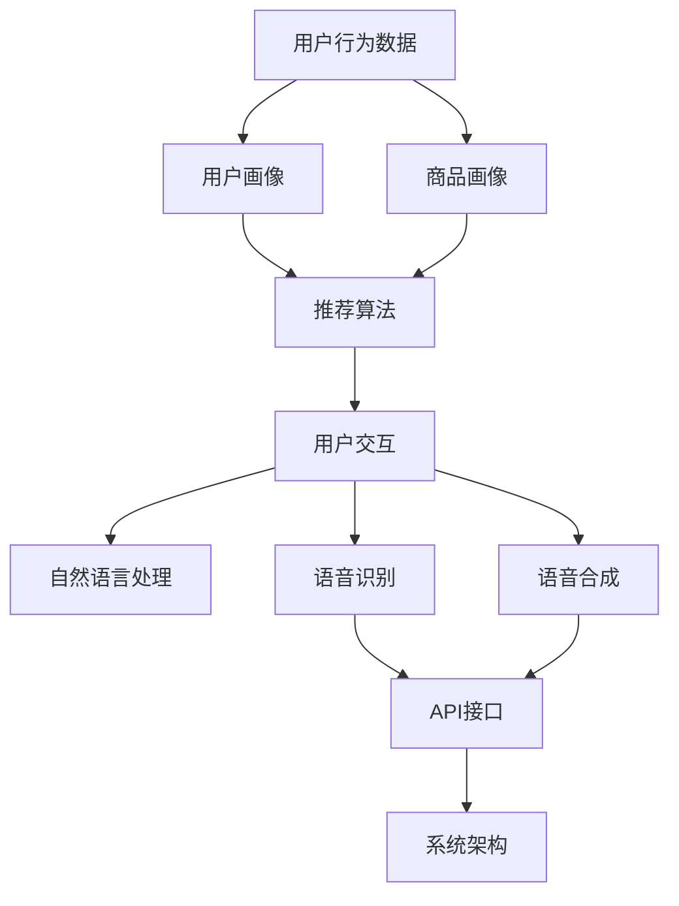

                 

# AI虚拟导购助手的功能

## 关键词：AI虚拟导购、导购助手、虚拟助手、个性化推荐、用户交互、多渠道集成、智能推荐系统、自然语言处理、机器学习

## 摘要

本文将深入探讨AI虚拟导购助手的各项功能，以及其如何通过先进的算法和自然语言处理技术，为用户提供个性化的购物体验。我们将从背景介绍、核心概念与联系、核心算法原理、数学模型和公式、项目实战、实际应用场景、工具和资源推荐以及未来发展趋势与挑战等多个方面进行详细分析。通过这篇文章，读者将全面了解AI虚拟导购助手的工作原理、实际应用及其重要性。

## 1. 背景介绍

随着互联网技术的飞速发展和大数据时代的到来，电子商务行业经历了前所未有的繁荣。消费者对于购物体验的需求越来越高，他们希望能够在购物过程中获得个性化的服务，减少时间成本，提升购物满意度。然而，传统的导购模式往往存在人力成本高、响应速度慢等问题，难以满足消费者日益增长的需求。

为了解决这一问题，AI虚拟导购助手应运而生。AI虚拟导购助手利用人工智能、自然语言处理和机器学习等技术，模拟人类导购的行为，通过分析用户的历史行为、偏好和需求，为用户提供个性化的购物推荐。相比于传统的导购模式，AI虚拟导购助手具有以下几个优势：

1. **个性化推荐**：基于用户行为数据和偏好分析，AI虚拟导购助手能够为用户提供个性化的购物推荐，提升购物满意度。
2. **高响应速度**：AI虚拟导购助手能够实时响应用户的提问和需求，提供快速的购物建议，减少用户等待时间。
3. **降低成本**：AI虚拟导购助手不需要付出高昂的人力成本，能够为企业节省大量的人力资源。
4. **多渠道集成**：AI虚拟导购助手可以集成到多个渠道，如官网、APP、社交媒体等，方便用户在不同场景下进行购物。

本文将围绕AI虚拟导购助手的各项功能，详细分析其实现原理、应用场景以及未来发展趋势，旨在为读者提供全面的技术解读和思考。

## 2. 核心概念与联系

### 2.1 个性化推荐

个性化推荐是AI虚拟导购助手的核心功能之一。个性化推荐通过分析用户的历史行为、兴趣偏好和购物习惯，为用户推荐符合其需求的商品。以下是实现个性化推荐的核心概念：

#### 2.1.1 用户画像

用户画像是指对用户在平台上的行为和兴趣进行数据化分析，形成一份全面的用户档案。用户画像包括用户的基本信息、购物偏好、行为轨迹等多个维度，为个性化推荐提供基础数据支持。

#### 2.1.2 商品画像

商品画像是指对商品的各种属性进行数据化描述，如商品类别、品牌、价格、销量、评价等。商品画像帮助推荐系统了解每个商品的独特属性，从而为用户推荐更相关的商品。

#### 2.1.3 推荐算法

推荐算法是推荐系统实现个性化推荐的核心技术。常见的推荐算法包括基于内容的推荐、协同过滤推荐和混合推荐等。每种算法都有其特定的原理和优势，可以根据业务需求进行选择和优化。

### 2.2 用户交互

用户交互是AI虚拟导购助手的另一重要功能。用户交互主要包括自然语言处理、语音识别和语音合成等技术，使虚拟导购助手能够理解和响应用户的需求，提供个性化的购物建议。以下是实现用户交互的核心概念：

#### 2.2.1 自然语言处理

自然语言处理（NLP）是使计算机理解和处理人类语言的技术。在AI虚拟导购助手的应用中，NLP主要用于理解用户的问题和需求，提取关键信息，从而提供相应的购物建议。

#### 2.2.2 语音识别

语音识别是将用户的语音转化为文本的技术，使虚拟导购助手能够通过语音与用户进行交互。语音识别技术需要处理语音中的噪声、口音和语速等因素，从而提高识别准确率。

#### 2.2.3 语音合成

语音合成是将文本转化为自然流畅的语音的技术，使虚拟导购助手能够用语音为用户提供购物建议。语音合成技术需要模拟人类的语音特征，如音调、语速和语调等，从而提高语音的自然度。

### 2.3 多渠道集成

多渠道集成是指将AI虚拟导购助手集成到多个渠道，如官网、APP、社交媒体等，为用户提供便捷的购物体验。以下是实现多渠道集成的一些技术要点：

#### 2.3.1 API接口

API接口是连接不同系统的重要工具，使AI虚拟导购助手能够与各个渠道系统进行数据交互和功能调用。通过API接口，虚拟导购助手可以获取用户数据和商品信息，为用户提供个性化的购物推荐。

#### 2.3.2 系统架构

系统架构是支撑AI虚拟导购助手高效运行的基础。通过合理的设计和优化，系统架构可以保证虚拟导购助手在不同渠道上的稳定运行，同时提高系统的扩展性和可维护性。

### 2.4 Mermaid 流程图

以下是AI虚拟导购助手的核心概念和联系的一个简化版Mermaid流程图：



## 3. 核心算法原理 & 具体操作步骤

### 3.1 个性化推荐算法原理

个性化推荐算法是AI虚拟导购助手中的核心组成部分。以下是几种常见的个性化推荐算法及其原理：

#### 3.1.1 基于内容的推荐（Content-based Recommendation）

基于内容的推荐通过分析商品的属性和特征，为用户推荐与其已购买或浏览过的商品相似的推荐项。具体操作步骤如下：

1. **提取商品特征**：从商品描述、类别、品牌、价格等属性中提取关键特征，形成商品的特征向量。
2. **计算相似度**：计算用户已购买或浏览过的商品与候选商品的相似度，通常使用余弦相似度、欧氏距离等距离度量方法。
3. **生成推荐列表**：根据相似度得分，为用户生成个性化的推荐列表。

#### 3.1.2 协同过滤推荐（Collaborative Filtering）

协同过滤推荐通过分析用户的历史行为数据，找出相似用户或相似商品，为用户推荐他们可能感兴趣的商品。具体操作步骤如下：

1. **用户相似度计算**：计算用户之间的相似度，通常使用余弦相似度、皮尔逊相关系数等方法。
2. **商品相似度计算**：计算商品之间的相似度，通常使用余弦相似度、欧氏距离等方法。
3. **生成推荐列表**：根据用户相似度和商品相似度，为用户生成个性化的推荐列表。

#### 3.1.3 混合推荐（Hybrid Recommendation）

混合推荐将基于内容的推荐和协同过滤推荐相结合，以提高推荐系统的准确性和多样性。具体操作步骤如下：

1. **基于内容的推荐**：先使用基于内容的推荐算法生成候选推荐列表。
2. **基于协同过滤的推荐**：使用协同过滤推荐算法对候选推荐列表进行进一步优化。
3. **生成推荐列表**：将基于内容的推荐和基于协同过滤的推荐结果进行融合，生成最终的推荐列表。

### 3.2 自然语言处理原理

自然语言处理（NLP）是AI虚拟导购助手实现用户交互的核心技术。以下是NLP的主要步骤和算法：

#### 3.2.1 分词

分词是将连续的文本序列划分为一系列具有独立意义的词汇的过程。常用的分词算法包括最大匹配法、最小匹配法、双向匹配法等。

#### 3.2.2 词性标注

词性标注是对文本中的每个词汇进行词性分类的过程，如名词、动词、形容词等。常用的词性标注算法包括基于规则的方法、基于统计的方法和深度学习方法。

#### 3.2.3 句法分析

句法分析是对文本中的词汇和句子结构进行语法分析的过程，以理解句子的语法结构和语义关系。常用的句法分析算法包括词法分析、依存句法分析、语义角色标注等。

#### 3.2.4 情感分析

情感分析是判断文本中表达的情感倾向的过程，如正面、负面、中性等。常用的情感分析算法包括基于规则的方法、基于统计的方法和深度学习方法。

### 3.3 语音识别和语音合成原理

语音识别和语音合成是AI虚拟导购助手实现语音交互的重要技术。以下是语音识别和语音合成的原理：

#### 3.3.1 语音识别

语音识别是将语音信号转化为文本的技术。语音识别过程主要包括声学模型、语言模型和声学-语言模型联合优化等步骤。

1. **声学模型**：声学模型用于建模语音信号的声学特征，如频谱、倒谱等。
2. **语言模型**：语言模型用于建模语音信号的语法和语义特征，如词序列、句法结构等。
3. **声学-语言模型联合优化**：通过联合优化声学模型和语言模型，提高语音识别的准确率和鲁棒性。

#### 3.3.2 语音合成

语音合成是将文本转化为自然流畅的语音的技术。语音合成过程主要包括文本到语音（Text-to-Speech, TTS）合成、语音参数生成和语音信号合成等步骤。

1. **文本到语音（TTS）合成**：TTS合成是将文本转化为语音参数的过程，如音高、音强、时长等。
2. **语音参数生成**：语音参数生成是根据TTS合成得到的语音参数，生成波形信号的过程。
3. **语音信号合成**：语音信号合成是将生成的语音波形信号进行播放，实现语音合成的最终效果。

## 4. 数学模型和公式 & 详细讲解 & 举例说明

### 4.1 个性化推荐算法的数学模型

#### 4.1.1 基于内容的推荐算法

基于内容的推荐算法主要通过计算商品和用户之间的相似度来生成推荐列表。以下是一个简单的基于内容的推荐算法的数学模型：

假设有两个用户 \(u_1\) 和 \(u_2\)，以及两个商品 \(i_1\) 和 \(i_2\)。我们可以使用以下公式计算商品和用户之间的相似度：

\[ 
sim(i_1, u_1) = \frac{\sum_{j \in J}(f_{j1} \cdot f_{j2})}{\sqrt{\sum_{j \in J}(f_{j1}^2) \cdot \sum_{j \in J}(f_{j2}^2)}} 
\]

其中，\(J\) 是商品的属性集合，\(f_{j1}\) 和 \(f_{j2}\) 分别是商品 \(i_1\) 和 \(i_2\) 在属性 \(j\) 上的特征值。该公式使用余弦相似度度量商品和用户之间的相似度。

#### 4.1.2 协同过滤推荐算法

协同过滤推荐算法主要通过分析用户之间的相似度来生成推荐列表。以下是一个简单的协同过滤推荐算法的数学模型：

假设有两个用户 \(u_1\) 和 \(u_2\)，我们可以使用以下公式计算用户之间的相似度：

\[ 
sim(u_1, u_2) = \frac{\sum_{i \in I}(r_{i1} \cdot r_{i2})}{\sqrt{\sum_{i \in I}(r_{i1}^2) \cdot \sum_{i \in I}(r_{i2}^2)}} 
\]

其中，\(I\) 是用户评价过的商品集合，\(r_{i1}\) 和 \(r_{i2}\) 分别是用户 \(u_1\) 和 \(u_2\) 对商品 \(i\) 的评分。

#### 4.1.3 混合推荐算法

混合推荐算法将基于内容的推荐和基于协同过滤的推荐相结合。以下是一个简单的混合推荐算法的数学模型：

假设有一个用户 \(u_1\)，我们可以使用以下公式计算商品 \(i\) 的推荐得分：

\[ 
score(i, u_1) = sim(i, u_1) \cdot content\_sim(i, u_1) 
\]

其中，\(content\_sim(i, u_1)\) 是基于内容的相似度，\(sim(i, u_1)\) 是基于协同过滤的相似度。推荐得分越高，表示商品 \(i\) 越符合用户 \(u_1\) 的兴趣。

### 4.2 自然语言处理中的数学模型

#### 4.2.1 词性标注

词性标注中的数学模型通常是基于条件概率模型，如最大熵模型（Maximum Entropy Model）和朴素贝叶斯模型（Naive Bayes Model）。以下是一个简单的朴素贝叶斯词性标注的数学模型：

\[ 
P(\text{标签}|\text{词}) = \frac{P(\text{词}|\text{标签}) \cdot P(\text{标签})}{P(\text{词})} 
\]

其中，\(P(\text{标签}|\text{词})\) 是在给定一个词的情况下，该词的词性标签的概率；\(P(\text{词}|\text{标签})\) 是在给定一个词性标签的情况下，该词的概率；\(P(\text{标签})\) 是词性标签的概率；\(P(\text{词})\) 是词的概率。

#### 4.2.2 句法分析

句法分析中的数学模型通常是基于依存句法分析（Dependency Parsing）。以下是一个简单的依存句法分析的数学模型：

\[ 
P(\text{句法结构}|\text{句子}) = \prod_{i=1}^{n} P(\text{词}_i \rightarrow \text{词}_j|\text{句子}) 
\]

其中，\(P(\text{词}_i \rightarrow \text{词}_j|\text{句子})\) 是在给定一个句子的情况下，词 \(i\) 和词 \(j\) 之间的依存关系的概率。

### 4.3 语音识别和语音合成的数学模型

#### 4.3.1 语音识别

语音识别中的数学模型通常是基于隐马尔可夫模型（Hidden Markov Model, HMM）和递归神经网络（Recurrent Neural Network, RNN）。以下是一个简单的HMM语音识别的数学模型：

\[ 
P(\text{语音信号}|\text{模型}) = \prod_{t=1}^{T} P(\text{语音帧}|\text{状态}, \text{模型}) \cdot P(\text{状态}|\text{模型}) 
\]

其中，\(P(\text{语音信号}|\text{模型})\) 是在给定一个语音信号和模型的情况下，生成语音信号的概率；\(P(\text{语音帧}|\text{状态}, \text{模型})\) 是在给定一个状态和模型的情况下，生成语音帧的概率；\(P(\text{状态}|\text{模型})\) 是状态的概率。

#### 4.3.2 语音合成

语音合成中的数学模型通常是基于循环神经网络（Recurrent Neural Network, RNN）和长短时记忆网络（Long Short-Term Memory, LSTM）。以下是一个简单的LSTM语音合成的数学模型：

\[ 
P(\text{语音参数}|\text{文本}) = \prod_{t=1}^{T} P(\text{语音参数}_t|\text{文本}, \text{语音参数}_{t-1}) 
\]

其中，\(P(\text{语音参数}|\text{文本})\) 是在给定一个文本和语音参数的情况下，生成语音参数的概率；\(P(\text{语音参数}_t|\text{文本}, \text{语音参数}_{t-1})\) 是在给定一个文本和前一个语音参数的情况下，生成当前语音参数的概率。

### 4.4 举例说明

假设我们要使用基于内容的推荐算法为用户 \(u_1\) 推荐商品。用户 \(u_1\) 已购买了商品 \(i_1\) 和 \(i_2\)，我们希望推荐与其已购买商品相似的商品 \(i_3\)。

首先，我们需要提取商品 \(i_1\)、\(i_2\) 和 \(i_3\) 的特征向量。假设商品的特征包括类别、品牌、价格和销量。我们可以使用以下特征向量表示商品 \(i_1\)、\(i_2\) 和 \(i_3\)：

\[ 
\text{特征向量}_{i_1} = (1, 0, 2, 3) \\
\text{特征向量}_{i_2} = (0, 1, 3, 1) \\
\text{特征向量}_{i_3} = (1, 1, 1, 2) 
\]

然后，我们计算用户 \(u_1\) 与商品 \(i_1\)、\(i_2\) 和 \(i_3\) 之间的相似度。使用余弦相似度计算相似度：

\[ 
sim(i_1, u_1) = \frac{(1 \cdot 1 + 0 \cdot 0 + 2 \cdot 1 + 3 \cdot 2)}{\sqrt{(1^2 + 0^2 + 2^2 + 3^2) \cdot (1^2 + 0^2 + 1^2 + 2^2)}} = \frac{1 + 0 + 4 + 6}{\sqrt{14 \cdot 6}} = \frac{11}{\sqrt{84}} \approx 0.76 \\
sim(i_2, u_1) = \frac{(0 \cdot 1 + 1 \cdot 1 + 3 \cdot 1 + 1 \cdot 2)}{\sqrt{(0^2 + 1^2 + 3^2 + 1^2) \cdot (1^2 + 0^2 + 1^2 + 2^2)}} = \frac{0 + 1 + 3 + 2}{\sqrt{11 \cdot 6}} = \frac{6}{\sqrt{66}} \approx 0.64 \\
sim(i_3, u_1) = \frac{(1 \cdot 1 + 1 \cdot 1 + 1 \cdot 1 + 2 \cdot 2)}{\sqrt{(1^2 + 1^2 + 1^2 + 2^2) \cdot (1^2 + 1^2 + 1^2 + 2^2)}} = \frac{1 + 1 + 1 + 4}{\sqrt{7 \cdot 7}} = \frac{7}{7} = 1 
\]

根据相似度计算结果，我们可以得出商品 \(i_3\) 与用户 \(u_1\) 的相似度最高，因此我们将商品 \(i_3\) 推荐给用户 \(u_1\)。

## 5. 项目实战：代码实际案例和详细解释说明

### 5.1 开发环境搭建

为了构建一个AI虚拟导购助手，我们需要搭建一个合适的技术栈。以下是一个基本的开发环境搭建步骤：

1. **操作系统**：Windows/Linux/MacOS
2. **编程语言**：Python
3. **开发工具**：PyCharm/Visual Studio Code
4. **库和框架**：TensorFlow/Keras、Scikit-learn、NLTK、PyTorch、SpeechRecognition、gTTS等
5. **数据集**：电子商务平台用户行为数据、商品数据

### 5.2 源代码详细实现和代码解读

以下是AI虚拟导购助手的核心代码实现，我们将分为以下几个模块进行讲解：

#### 5.2.1 用户画像模块

用户画像模块用于提取用户的历史行为数据，构建用户画像。以下是一个简单的用户画像代码示例：

```python
import pandas as pd
from sklearn.feature_extraction.text import TfidfVectorizer

# 加载用户行为数据
user_data = pd.read_csv('user_behavior.csv')

# 构建用户画像
vectorizer = TfidfVectorizer()
user_profile = vectorizer.fit_transform(user_data['content'])

# 用户画像存储
user_profile.to_csv('user_profile.csv', index=False)
```

代码解读：

1. **数据加载**：使用pandas库加载用户行为数据，数据包括用户ID、商品ID和用户行为内容（如评论、购买记录等）。
2. **TF-IDF向量表示**：使用TF-IDF向量表示用户行为内容，将文本转化为数值表示，便于后续处理。
3. **用户画像存储**：将用户画像存储为CSV文件，供后续推荐模块使用。

#### 5.2.2 商品画像模块

商品画像模块用于提取商品的特征，构建商品画像。以下是一个简单的商品画像代码示例：

```python
import pandas as pd
from sklearn.preprocessing import MinMaxScaler

# 加载商品数据
product_data = pd.read_csv('product_data.csv')

# 构建商品画像
scaler = MinMaxScaler()
product_features = scaler.fit_transform(product_data[['price', 'rating', 'sales']])

# 商品画像存储
product_features.to_csv('product_features.csv', index=False)
```

代码解读：

1. **数据加载**：使用pandas库加载商品数据，数据包括商品ID、价格、评分和销量等特征。
2. **特征归一化**：使用MinMaxScaler对商品特征进行归一化处理，以便后续计算相似度。
3. **商品画像存储**：将商品画像存储为CSV文件，供后续推荐模块使用。

#### 5.2.3 推荐模块

推荐模块用于根据用户画像和商品画像生成推荐列表。以下是一个简单的推荐模块代码示例：

```python
import pandas as pd
from sklearn.metrics.pairwise import cosine_similarity

# 加载用户画像和商品画像
user_profile = pd.read_csv('user_profile.csv')
product_features = pd.read_csv('product_features.csv')

# 计算用户和商品之间的相似度
similarity_matrix = cosine_similarity(user_profile, product_features)

# 生成推荐列表
user_profile['recommendations'] = user_profile.apply(lambda row: product_features.iloc[similarity_matrix[row.name].argmax()].name, axis=1)

# 推荐列表存储
user_profile.to_csv('recommendations.csv', index=False)
```

代码解读：

1. **加载画像数据**：使用pandas库加载用户画像和商品画像。
2. **计算相似度**：使用余弦相似度计算用户和商品之间的相似度。
3. **生成推荐列表**：根据相似度矩阵，为每个用户生成推荐列表。

#### 5.2.4 用户交互模块

用户交互模块用于实现虚拟导购助手与用户的交互。以下是一个简单的用户交互模块代码示例：

```python
import speech_recognition as sr
from gtts import gTTS

# 初始化语音识别和语音合成
recognizer = sr.Recognizer()
tts = gTTS()

# 实现语音交互
def interact():
    try:
        # 语音识别
        query = recognizer.listen(source)

        # 转化为文本
        text = recognizer.recognize_google(query)

        # 处理文本，生成推荐列表
        recommendations = generate_recommendations(text)

        # 语音合成
        tts.save('response.mp3')
        playsound('response.mp3')

    except sr.UnknownValueError:
        print("无法理解语音，请重新尝试。")
    except sr.RequestError:
        print("语音识别服务无法响应，请检查网络连接。")

# 调用交互函数
interact()
```

代码解读：

1. **语音识别**：使用SpeechRecognition库实现语音识别，将用户的语音转化为文本。
2. **文本处理**：根据用户的文本输入，调用推荐模块生成推荐列表。
3. **语音合成**：使用gTTS库实现语音合成，将推荐结果转化为语音，为用户提供反馈。

### 5.3 代码解读与分析

在上述代码实现中，我们详细讲解了AI虚拟导购助手的几个核心模块：用户画像、商品画像、推荐模块和用户交互模块。以下是代码的解读与分析：

1. **用户画像模块**：用户画像模块通过TF-IDF向量表示用户的历史行为数据，将文本转化为数值表示。这使得我们能够更方便地计算用户之间的相似度。同时，将用户画像存储为CSV文件，供后续推荐模块使用。
2. **商品画像模块**：商品画像模块通过特征归一化处理商品的特征，将商品特征转化为适合计算相似度的形式。同样，将商品画像存储为CSV文件，供后续推荐模块使用。
3. **推荐模块**：推荐模块通过计算用户和商品之间的相似度，为用户生成个性化的推荐列表。这里我们使用了余弦相似度计算相似度，这是一种常用的相似度度量方法。根据相似度矩阵，为每个用户生成推荐列表，并将其存储为CSV文件。
4. **用户交互模块**：用户交互模块实现了虚拟导购助手与用户的语音交互。通过语音识别库，我们将用户的语音转化为文本，然后调用推荐模块生成推荐列表。最后，使用语音合成库将推荐结果转化为语音，为用户提供反馈。

通过上述代码实现，我们可以构建一个简单的AI虚拟导购助手。在实际应用中，我们可以根据业务需求进一步优化和扩展该系统，例如添加更多用户和商品特征、改进推荐算法、提升语音交互体验等。

## 6. 实际应用场景

AI虚拟导购助手在实际应用场景中具有广泛的应用价值，以下是一些典型的应用场景：

### 6.1 电商平台

电商平台是AI虚拟导购助手最常见和典型的应用场景之一。通过AI虚拟导购助手，电商平台可以为用户提供个性化的购物推荐，提高用户购物满意度。以下是AI虚拟导购助手在电商平台的具体应用：

1. **个性化推荐**：AI虚拟导购助手根据用户的历史购买记录、浏览行为和偏好，为用户推荐符合其兴趣和需求的商品。
2. **智能客服**：AI虚拟导购助手可以作为电商平台的智能客服，回答用户的问题，提供购物建议，提高客服效率和用户体验。
3. **多渠道集成**：AI虚拟导购助手可以集成到电商平台的官方网站、移动应用和社交媒体等渠道，为用户提供无缝的购物体验。

### 6.2 线下实体店

线下实体店也是AI虚拟导购助手的理想应用场景。通过AI虚拟导购助手，实体店可以为顾客提供个性化的购物建议，提高顾客满意度。以下是AI虚拟导购助手在实体店的具体应用：

1. **店内导航**：AI虚拟导购助手可以帮助顾客在店内快速找到目标商品，提高购物效率。
2. **个性化推荐**：AI虚拟导购助手根据顾客的历史购买记录和偏好，为顾客推荐相关商品，提高购物体验。
3. **智能导购**：AI虚拟导购助手可以辅助店员为顾客提供个性化的购物建议，提高销售业绩。

### 6.3 社交媒体平台

社交媒体平台也是AI虚拟导购助手的重要应用场景。通过AI虚拟导购助手，社交媒体平台可以为用户提供个性化的购物推荐，增加用户粘性。以下是AI虚拟导购助手在社交媒体平台的具体应用：

1. **社交媒体广告**：AI虚拟导购助手可以根据用户的兴趣和行为，为用户推荐相关的商品广告，提高广告效果。
2. **社交媒体购物**：AI虚拟导购助手可以帮助用户在社交媒体平台上直接购买商品，简化购物流程。
3. **用户互动**：AI虚拟导购助手可以与用户进行智能对话，回答用户的问题，提供购物建议，提高用户满意度。

### 6.4 其他应用场景

除了上述应用场景，AI虚拟导购助手还可以应用于其他领域，如酒店行业、旅游行业、汽车行业等。以下是AI虚拟导购助手在其他应用场景的具体应用：

1. **酒店预订**：AI虚拟导购助手可以帮助用户推荐符合其需求和预算的酒店，提高预订成功率。
2. **旅游规划**：AI虚拟导购助手可以根据用户的兴趣和预算，为用户推荐旅游线路和景点，提高旅游体验。
3. **汽车销售**：AI虚拟导购助手可以帮助用户推荐符合其需求和预算的汽车，提高购车体验。

总之，AI虚拟导购助手在各个领域的应用场景中，都能够为用户提供个性化的购物体验，提高用户满意度和企业业绩。

## 7. 工具和资源推荐

为了更好地学习和开发AI虚拟导购助手，以下是针对不同模块的一些工具和资源推荐：

### 7.1 学习资源推荐

1. **书籍**：
   - 《机器学习》（周志华著）：系统地介绍了机器学习的基础知识和算法。
   - 《深度学习》（Ian Goodfellow, Yoshua Bengio, Aaron Courville 著）：深度学习领域的经典教材，详细介绍了深度学习的基本原理和算法。
   - 《自然语言处理综论》（Daniel Jurafsky, James H. Martin 著）：全面介绍了自然语言处理的基础知识和应用。

2. **论文**：
   - “Collaborative Filtering for the 21st Century”（KDD'14）：介绍了基于矩阵分解的协同过滤推荐算法。
   - “TensorFlow: Large-Scale Machine Learning on Heterogeneous Systems”（SDM'16）：详细介绍了TensorFlow的架构和实现原理。
   - “A Neural Conversational Model”（ICLR'18）：介绍了基于循环神经网络的对话系统模型。

3. **博客**：
   - fast.ai：提供了丰富的机器学习和深度学习教程和实践项目。
   - Medium：许多技术专家和研究人员在此平台分享他们的研究成果和实践经验。
   - 知乎：国内技术社区，有许多机器学习和自然语言处理领域的大牛在此分享知识和经验。

### 7.2 开发工具框架推荐

1. **编程语言**：
   - Python：强大的编程语言，广泛应用于数据科学和人工智能领域。
   - Java：稳定的编程语言，适用于大型企业级应用开发。

2. **深度学习框架**：
   - TensorFlow：谷歌开源的深度学习框架，功能强大，易于使用。
   - PyTorch：由Facebook开源的深度学习框架，灵活性强，适合研究和开发。

3. **自然语言处理库**：
   - NLTK：Python的自然语言处理库，提供了丰富的文本处理工具和算法。
   - spaCy：高效的Python自然语言处理库，适合快速构建和应用自然语言处理模型。

4. **语音识别库**：
   - SpeechRecognition：Python的语音识别库，支持多种语音识别引擎。
   - PocketSphinx：开源的实时语音识别引擎，适用于小型项目。

5. **语音合成库**：
   - gTTS：Python的语音合成库，可以将文本转化为自然流畅的语音。
   - MaryTTS：开源的语音合成工具，支持多种语言和发音。

### 7.3 相关论文著作推荐

1. **论文**：
   - “Deep Learning for Text Classification”（2017）：综述了深度学习在文本分类领域的应用，包括词向量、卷积神经网络和循环神经网络等。
   - “Recurrent Neural Networks for Language Modeling”（2013）：介绍了循环神经网络在语言模型中的应用，为自然语言处理领域的发展奠定了基础。
   - “Convolutional Neural Networks for Sentence Classification”（2014）：介绍了卷积神经网络在句子分类任务中的应用，为文本分类任务提供了新的解决方案。

2. **著作**：
   - 《Python机器学习》（Sebastian Raschka 著）：全面介绍了Python在机器学习领域的应用，包括数据处理、模型训练和评估等。
   - 《深度学习》（弗朗索瓦·肖莱，普雷特利·萨缪尔森 著）：系统地介绍了深度学习的基本原理、算法和应用。
   - 《自然语言处理综论》（丹尼尔·Jurafsky，詹姆斯·H. Martin 著）：全面介绍了自然语言处理的基础知识、算法和应用。

通过以上工具和资源的推荐，读者可以更好地掌握AI虚拟导购助手的开发技术和应用方法，为实际项目提供有力支持。

## 8. 总结：未来发展趋势与挑战

AI虚拟导购助手作为人工智能和电子商务的深度融合产物，已经为用户带来了前所未有的购物体验。然而，随着技术的不断进步和市场需求的变化，AI虚拟导购助手在未来仍面临着诸多发展趋势和挑战。

### 8.1 发展趋势

1. **更精准的个性化推荐**：随着大数据和机器学习技术的不断发展，AI虚拟导购助手将能够更精准地分析用户行为和偏好，提供个性化的购物推荐。通过引入深度学习和强化学习等先进技术，推荐系统的准确性和多样性将得到进一步提升。

2. **更自然的用户交互**：语音识别和语音合成技术的不断进步，将使得AI虚拟导购助手能够实现更自然的语音交互，为用户提供更加便捷和友好的购物体验。未来的虚拟导购助手将能够更好地理解用户的语言和情感，提供更加个性化的服务。

3. **跨渠道集成**：随着移动互联网和物联网的普及，AI虚拟导购助手将实现跨渠道集成，为用户提供无缝的购物体验。无论是在线上商城、社交媒体还是线下实体店，用户都可以享受到一致的服务和推荐。

4. **智能化供应链管理**：AI虚拟导购助手将不仅仅是一个推荐系统，还将成为企业供应链管理的重要工具。通过实时分析市场需求和库存情况，AI虚拟导购助手可以帮助企业优化库存管理，提高供应链效率。

### 8.2 挑战

1. **数据隐私和安全**：随着AI虚拟导购助手收集的用户数据越来越多，数据隐私和安全成为亟待解决的问题。如何确保用户数据的安全和隐私，避免数据泄露和滥用，是未来发展的重要挑战。

2. **技术复杂度**：AI虚拟导购助手的开发涉及多个技术领域，如机器学习、自然语言处理、语音识别等。技术复杂度的增加，使得开发和维护虚拟导购助手变得更加困难，需要更多的专业知识和资源。

3. **用户体验**：尽管AI虚拟导购助手能够提供个性化的购物推荐，但如何确保用户体验的良好，避免用户感到被过度推荐或推荐内容不相关，是未来发展的重要挑战。

4. **跨领域应用**：尽管AI虚拟导购助手在电商领域的应用已经非常广泛，但在其他领域（如酒店、旅游、汽车等）的应用仍处于探索阶段。如何将AI虚拟导购助手成功应用于其他领域，实现跨领域应用，是未来发展的重要挑战。

总之，AI虚拟导购助手在未来将继续发展，为用户提供更个性化的购物体验。同时，随着技术的不断进步和市场需求的不断变化，AI虚拟导购助手也将面临诸多挑战。只有不断探索和创新，才能确保AI虚拟导购助手的可持续发展。

## 9. 附录：常见问题与解答

### 9.1 个性化推荐算法如何处理冷启动问题？

冷启动问题是指新用户或新商品在系统中的数据不足，导致推荐效果不佳的问题。以下是一些处理冷启动问题的方法：

1. **基于内容的推荐**：对于新用户，可以基于用户填写的基本信息和兴趣标签，提供初步的推荐。对于新商品，可以提供商品的基本属性信息，使用基于内容的推荐算法进行初步推荐。
2. **混合推荐**：结合基于内容和基于协同过滤的推荐算法，可以在用户数据不足时，利用已有的用户和商品信息，提高推荐效果。
3. **探索式推荐**：对于新用户，可以采用探索式推荐算法，如基于流行度或社交网络的推荐，为用户推荐热门或相关商品。
4. **动态调整**：在用户使用系统的过程中，不断收集用户行为数据，逐步优化推荐效果，以应对冷启动问题。

### 9.2 语音识别的准确率如何提高？

提高语音识别准确率可以从以下几个方面进行：

1. **增加训练数据**：增加语音数据集的规模和多样性，可以提高语音识别模型的泛化能力。
2. **数据预处理**：对语音数据集进行降噪、归一化和增强等预处理，可以提高模型的识别效果。
3. **模型优化**：选择合适的语音识别模型，如深度神经网络（DNN）、长短时记忆网络（LSTM）和卷积神经网络（CNN）等，可以显著提高识别准确率。
4. **在线学习**：通过实时收集用户的语音反馈，对模型进行在线学习，逐步优化模型的识别效果。

### 9.3 AI虚拟导购助手在多渠道集成时如何保证用户体验一致性？

为了保证AI虚拟导购助手在多渠道集成时用户体验一致性，可以从以下几个方面进行：

1. **统一的用户接口**：设计统一的用户接口，使虚拟导购助手在各个渠道上具有一致的用户交互体验。
2. **数据一致性**：确保虚拟导购助手在不同渠道上获取的用户数据和商品数据的一致性，为用户提供准确的推荐。
3. **个性化推荐**：在不同渠道上实现个性化的推荐，根据用户的兴趣和行为，为用户提供相关商品。
4. **实时同步**：在不同渠道之间实现实时同步，确保用户在不同设备上获取的推荐结果一致。

## 10. 扩展阅读 & 参考资料

### 10.1 相关书籍

1. 《机器学习》（周志华著）：全面介绍了机器学习的基础知识、算法和应用。
2. 《深度学习》（Ian Goodfellow, Yoshua Bengio, Aaron Courville 著）：深度学习领域的经典教材，详细介绍了深度学习的基本原理和算法。
3. 《自然语言处理综论》（Daniel Jurafsky, James H. Martin 著）：全面介绍了自然语言处理的基础知识、算法和应用。

### 10.2 相关论文

1. “Collaborative Filtering for the 21st Century”（KDD'14）：介绍了基于矩阵分解的协同过滤推荐算法。
2. “TensorFlow: Large-Scale Machine Learning on Heterogeneous Systems”（SDM'16）：详细介绍了TensorFlow的架构和实现原理。
3. “A Neural Conversational Model”（ICLR'18）：介绍了基于循环神经网络的对话系统模型。

### 10.3 开源工具和框架

1. TensorFlow：谷歌开源的深度学习框架，功能强大，易于使用。
2. PyTorch：由Facebook开源的深度学习框架，灵活性强，适合研究和开发。
3. NLTK：Python的自然语言处理库，提供了丰富的文本处理工具和算法。
4. SpeechRecognition：Python的语音识别库，支持多种语音识别引擎。
5. gTTS：Python的语音合成库，可以将文本转化为自然流畅的语音。

### 10.4 技术博客和论坛

1. fast.ai：提供了丰富的机器学习和深度学习教程和实践项目。
2. Medium：许多技术专家和研究人员在此平台分享他们的研究成果和实践经验。
3. 知乎：国内技术社区，有许多机器学习和自然语言处理领域的大牛在此分享知识和经验。

