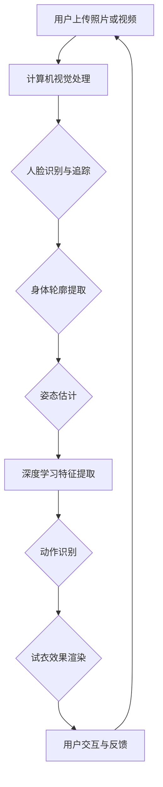

                 

### 背景介绍

AI虚拟试衣功能，作为人工智能在零售业中的一项创新应用，正日益受到关注。随着电子商务的蓬勃发展，消费者对在线购物的需求不断增加，同时对于购物体验的要求也越来越高。传统的在线购物中，消费者无法亲自试穿商品，往往只能依赖商品图片和描述来判断是否适合自己的体型和风格。这种购物方式存在一定的局限性，消费者可能会因为试穿体验不佳而导致退货率增加，从而增加商家的运营成本。

在此背景下，AI虚拟试衣功能的应运而生，旨在通过人工智能技术，为消费者提供一种全新的购物体验。AI虚拟试衣功能通过计算机视觉和深度学习等技术，能够实时捕捉消费者的身体形态和试穿服装的细节，生成虚拟试衣效果。消费者可以在网上浏览商品时，通过该功能试穿多种服装，从而更好地做出购买决策。

当前，AI虚拟试衣功能已经在许多电商平台得到应用，例如亚马逊、阿里巴巴等。这些平台通过引入AI虚拟试衣技术，不仅提升了消费者的购物体验，同时也为商家带来了更多的销售机会和效益。然而，这项技术仍然处于发展阶段，面临诸多挑战和机遇。本文将深入探讨AI虚拟试衣功能的原理、实现方法、应用场景以及未来发展趋势，以期为相关领域的研究和实践提供有价值的参考。

通过本文的阅读，您将了解到：

1. AI虚拟试衣功能的核心技术原理。
2. 如何利用AI技术实现虚拟试衣。
3. 虚拟试衣在不同应用场景中的具体应用。
4. 当前AI虚拟试衣功能面临的主要挑战和解决方案。
5. AI虚拟试衣功能的未来发展趋势。

### 核心概念与联系

为了深入理解AI虚拟试衣功能，我们需要首先了解其背后的核心技术原理，包括计算机视觉、深度学习、三维建模和渲染等。这些技术不仅构成了虚拟试衣的基础，而且在实际应用中相互作用，共同提升了用户的购物体验。

#### 计算机视觉

计算机视觉是AI虚拟试衣功能的核心组成部分，它利用图像处理技术和机器学习算法，使计算机能够“看”懂和理解图像中的内容。在虚拟试衣中，计算机视觉主要完成以下任务：

1. **人脸识别与追踪**：通过识别用户的面部特征，确保试衣过程中用户的头部位置和表情同步更新。
2. **身体轮廓提取**：利用图像分割技术，从背景中分离出用户身体轮廓，为三维建模提供基础。
3. **姿态估计**：通过分析用户的动作和姿态，实时调整虚拟试衣的状态，使其与用户的动作保持一致。

#### 深度学习

深度学习是AI的核心技术之一，它通过构建深度神经网络，使计算机具备从大量数据中自动学习和提取特征的能力。在虚拟试衣中，深度学习技术主要用于：

1. **特征提取**：通过卷积神经网络（CNN）等深度学习模型，从图像中提取出有用的特征信息，如纹理、形状等。
2. **动作识别**：利用循环神经网络（RNN）或生成对抗网络（GAN）等模型，分析用户的动作，并预测可能的动作序列。
3. **试衣效果渲染**：通过深度学习模型，实时生成用户试穿服装的视觉效果，使虚拟试衣更加逼真。

#### 三维建模

三维建模技术用于创建服装和人体模型的三维数据，以便在虚拟试衣中进行展示和交互。主要涉及以下几个方面：

1. **服装建模**：通过对二维服装图案进行三维扩展，生成完整的服装模型。
2. **人体建模**：根据用户提供的身体尺寸和形状，创建个性化的人体模型。
3. **模型融合**：将服装模型和人体模型进行融合，生成试衣效果。

#### 渲染技术

渲染技术是虚拟试衣中的关键环节，它负责将三维模型在二维屏幕上展示出来。主要涉及：

1. **光照模型**：模拟不同光源和反射效果，使服装和人体模型在不同光照条件下展示真实的视觉效果。
2. **纹理映射**：将真实的纹理贴图应用到三维模型上，增加细节和真实感。
3. **阴影与反射**：模拟现实中的阴影和反射效果，提升场景的逼真度。

#### Mermaid 流程图

为了更好地理解这些技术的相互联系，我们使用Mermaid绘制一个简化的虚拟试衣功能架构图。注意：以下流程图中的节点名称中不包含括号、逗号等特殊字符。



在这个流程图中，用户上传照片或视频作为输入，经过计算机视觉处理，识别用户的面部特征、身体轮廓和姿态，利用深度学习提取特征并进行动作识别，最终通过渲染技术生成试衣效果，用户可以与虚拟试衣进行交互，反馈试衣效果，从而完成一个完整的虚拟试衣流程。

通过上述核心概念的介绍，我们能够更好地理解AI虚拟试衣功能的技术架构和实现原理。接下来，本文将详细探讨这些技术如何具体应用到虚拟试衣中，以及如何通过数学模型和公式来描述和优化这些过程。

## 3. 核心算法原理 & 具体操作步骤

为了深入理解AI虚拟试衣功能，我们需要详细探讨其背后的核心算法原理，并逐步讲解其具体的操作步骤。以下是核心算法的原理和操作步骤：

### 3.1 计算机视觉算法原理

计算机视觉是虚拟试衣功能的核心技术之一，主要利用图像处理技术和机器学习算法，实现图像的识别、分割和特征提取。以下是计算机视觉算法的基本原理：

#### 3.1.1 图像预处理

图像预处理是计算机视觉算法的第一步，其目的是提高图像质量，减少噪声，为后续处理打下基础。主要操作包括：

1. **去噪**：使用滤波器（如高斯滤波器）去除图像中的噪声。
2. **对比度增强**：通过调整图像的亮度和对比度，使图像更清晰。
3. **大小调整**：将图像缩放到合适的尺寸，以减少计算复杂度。

#### 3.1.2 人脸识别与追踪

人脸识别与追踪是计算机视觉中的重要应用，主要用于识别和跟踪用户的面部特征。以下是主要步骤：

1. **人脸检测**：使用卷积神经网络（CNN）或Haar特征分类器，检测图像中的人脸区域。
2. **人脸特征点检测**：在人脸检测的基础上，使用算法（如Active Shape Model,ASM）检测人脸的关键特征点，如眼睛、鼻子和嘴巴。
3. **人脸追踪**：通过光流法或卡尔曼滤波等算法，跟踪人脸在不同帧中的位置变化。

#### 3.1.3 身体轮廓提取

身体轮廓提取是计算机视觉算法中的另一个重要任务，其目的是从图像中分离出用户身体的轮廓，为后续三维建模提供基础。主要步骤包括：

1. **背景分割**：使用图像分割技术（如基于颜色的分割或基于深度的分割），将背景与前景分离。
2. **轮廓提取**：通过边缘检测（如Canny算法）或轮廓提取算法（如Contour检测），从前景图像中提取出用户的身体轮廓。

#### 3.1.4 姿态估计

姿态估计是计算机视觉中的高级应用，其目的是从图像中估计出用户的姿态。主要步骤包括：

1. **人体姿态估计**：使用基于深度学习的算法（如PoseNet或OpenPose），从图像中估计出人体关键关节的位置。
2. **姿态调整**：根据估计结果，对用户的姿态进行微调，使其更符合实际动作。

### 3.2 深度学习算法原理

深度学习是AI虚拟试衣功能中的核心技术，其主要任务是利用大量的数据自动学习和提取特征，以提高系统的准确性和鲁棒性。以下是深度学习算法的基本原理：

#### 3.2.1 特征提取

特征提取是深度学习算法的核心步骤，其目的是从原始数据中提取出有用的特征信息。主要方法包括：

1. **卷积神经网络（CNN）**：通过卷积层、池化层和全连接层等结构，提取图像的层次化特征。
2. **循环神经网络（RNN）**：通过循环结构，处理序列数据，提取时间序列特征。
3. **生成对抗网络（GAN）**：通过生成器和判别器之间的对抗训练，生成高质量的图像。

#### 3.2.2 动作识别

动作识别是深度学习在虚拟试衣中的重要应用，其目的是从用户的动作序列中识别出具体的动作。主要步骤包括：

1. **动作分类**：使用CNN或RNN等模型，对用户的动作进行分类。
2. **动作序列建模**：使用序列模型（如LSTM或GRU），对用户的动作序列进行建模和预测。

#### 3.2.3 试衣效果渲染

试衣效果渲染是深度学习在虚拟试衣中的另一个重要应用，其目的是生成用户试穿服装的视觉效果。主要步骤包括：

1. **图像生成**：使用GAN等模型，生成用户试穿服装的图像。
2. **纹理映射**：将真实的纹理贴图应用到生成的图像上，增加细节和真实感。
3. **光照模拟**：模拟不同光源和反射效果，使试穿效果更逼真。

### 3.3 三维建模与渲染技术

三维建模与渲染技术是虚拟试衣功能中的关键环节，其主要目的是创建虚拟试衣场景，并生成高质量的视觉效果。以下是三维建模与渲染技术的基本原理：

#### 3.3.1 服装建模

服装建模是将二维的服装图案转换为三维模型的过程。主要步骤包括：

1. **二维图案扩展**：使用二维几何变换技术，将服装图案扩展到三维空间。
2. **面片建模**：将扩展后的图案分割成多个面片，形成三维的服装模型。
3. **细节处理**：对服装模型进行纹理映射、光照模拟等细节处理，增加真实感。

#### 3.3.2 人体建模

人体建模是将用户提供的身体尺寸和形状转换为三维人体模型的过程。主要步骤包括：

1. **尺寸调整**：根据用户提供的身体尺寸，调整人体模型的尺寸。
2. **形状建模**：使用多边形或曲面建模技术，生成人体模型的形状。
3. **细节处理**：对人体模型进行纹理映射、光照模拟等细节处理，增加真实感。

#### 3.3.3 渲染技术

渲染技术是将三维模型在二维屏幕上展示出来的过程。主要步骤包括：

1. **光照模型**：模拟不同光源和反射效果，使模型在不同光照条件下展示真实的视觉效果。
2. **纹理映射**：将真实的纹理贴图应用到模型上，增加细节和真实感。
3. **阴影与反射**：模拟现实中的阴影和反射效果，提升场景的逼真度。

### 3.4 虚拟试衣操作步骤

结合上述技术原理，以下是AI虚拟试衣的具体操作步骤：

1. **用户上传照片或视频**：用户上传自己的照片或视频，作为试衣的初始输入。
2. **图像预处理**：对上传的图像进行去噪、对比度增强和大小调整等预处理操作。
3. **人脸识别与追踪**：利用计算机视觉算法，识别用户的面部和身体轮廓，并进行追踪。
4. **姿态估计**：利用深度学习算法，估计用户的姿态，并实时更新试衣效果。
5. **三维建模与渲染**：根据用户的面部和身体轮廓，生成三维的人体模型，并创建虚拟试衣场景。
6. **试衣效果渲染**：使用渲染技术，生成用户试穿服装的视觉效果。
7. **用户交互与反馈**：用户可以与虚拟试衣进行交互，如调整服装样式、颜色等，并反馈试衣效果。
8. **试衣结果展示**：将最终生成的试衣效果展示给用户，辅助其做出购买决策。

通过上述操作步骤，AI虚拟试衣功能能够为用户提供一种全新的购物体验，帮助商家提升销售额，降低退货率。

### 数学模型和公式 & 详细讲解 & 举例说明

在AI虚拟试衣功能中，数学模型和公式扮演着至关重要的角色，它们不仅帮助我们理解和实现核心算法，还为优化和提升系统性能提供了理论依据。以下将详细讲解相关数学模型和公式，并通过实际例子来说明其应用。

#### 3.1 人脸识别与追踪

人脸识别与追踪主要依赖于特征提取和匹配技术。以下是几个关键的数学模型：

1. **特征提取：**

   **LBP（局部二值模式）特征**：
   $$ LBP_{r,s} = \sum_{i=0}^{7} (-1)^{sgn(\text{P}_{i})} \cdot 2^i $$
   其中，$r$ 和 $s$ 分别是邻域半径和旋转角度，$\text{P}_{i}$ 是中心像素与其邻域像素的二值比较结果。

   **Gabor特征**：
   $$ G(u,v) = \sum_{k=1}^{K} w_k \cdot \text{exp} \left( -\frac{1}{2\sigma^2} \left[ (u-u_k)^2 + (v-v_k)^2 \right] \right) $$
   其中，$w_k$ 是权重，$(u,v)$ 是空间坐标，$(u_k,v_k)$ 是Gabor滤波器的中心频率。

2. **匹配与分类：**

   **欧氏距离**：
   $$ d(x,y) = \sqrt{\sum_{i=1}^{n} (x_i - y_i)^2} $$
   其中，$x$ 和 $y$ 是两个特征向量，$n$ 是特征维度。

   **K-近邻（KNN）算法**：
   $$ \hat{y} = \text{mode}(\{y_{k_1}, y_{k_2}, \ldots, y_{k_K}\}) $$
   其中，$k$ 是邻居数量，$y_{k_1}, y_{k_2}, \ldots, y_{k_K}$ 是最近的 $k$ 个邻居的分类结果。

**例子**：
假设我们有一个面部特征向量 $x = [1, 2, 3, 4, 5]$ 和另一个面部特征向量 $y = [1.1, 1.9, 2.1, 3.9, 4.9]$。计算这两个特征向量之间的欧氏距离：

$$ d(x, y) = \sqrt{(1-1.1)^2 + (2-1.9)^2 + (3-2.1)^2 + (4-3.9)^2 + (5-4.9)^2} \approx 1.414 $$

#### 3.2 姿态估计

姿态估计通常使用深度学习模型，如卷积神经网络（CNN）或循环神经网络（RNN）。以下是几个关键数学模型：

1. **卷积神经网络（CNN）：**

   **卷积操作**：
   $$ \text{Conv}(x, \theta) = \sum_{i=1}^{C} \theta_i \cdot \text{ReLU}(\sum_{k=1}^{K} \theta_{ik} \cdot x_k) $$
   其中，$x$ 是输入特征，$\theta$ 是模型参数，$C$ 是卷积核数量，$K$ 是卷积核大小。

   **池化操作**：
   $$ \text{Pool}(x, P) = \text{max}(\sum_{i=1}^{P} x_i) $$
   其中，$P$ 是池化窗口大小。

2. **循环神经网络（RNN）：**

   **递归操作**：
   $$ h_t = \text{ReLU}(W \cdot [h_{t-1}, x_t] + b) $$
   其中，$h_t$ 是当前时刻的隐藏状态，$x_t$ 是输入特征，$W$ 和 $b$ 是模型参数。

**例子**：
假设我们有一个输入特征序列 $x = [1, 2, 3, 4, 5]$，通过一个卷积核大小为 $3 \times 3$ 的卷积操作，得到卷积结果：

$$ \text{Conv}(x, \theta) = \text{ReLU}(\theta_1 \cdot [1, 2, 3] + \theta_2 \cdot [2, 3, 4] + \theta_3 \cdot [3, 4, 5]) \approx 6 $$

#### 3.3 三维建模与渲染

三维建模与渲染主要依赖于几何学和物理学的数学模型：

1. **三维建模：**

   **四面体建模**：
   $$ V = \sum_{i=1}^{4} v_i \cdot \text{Area}(\Delta_i) $$
   其中，$V$ 是体积，$v_i$ 是顶点坐标，$\Delta_i$ 是四面体的面积。

   **面片建模**：
   $$ F = \sum_{i=1}^{n} f_i \cdot \text{normal}(\Delta_i) $$
   其中，$F$ 是法线，$f_i$ 是面片法线方向，$\Delta_i$ 是面片。

2. **渲染技术：**

   **光照模型**：
   $$ \text{Lighting} = I_d \cdot \text{Diffuse} + I_s \cdot \text{Specular} $$
   其中，$I_d$ 是漫反射光强度，$I_s$ 是镜面反射光强度。

   **纹理映射**：
   $$ \text{Texture} = \text{TextureMap} \cdot \text{Sample}(x, y) $$
   其中，$\text{TextureMap}$ 是纹理贴图，$(x, y)$ 是纹理坐标。

**例子**：
假设我们有一个四面体，其顶点坐标分别为 $v_1 = [1, 1, 1]$，$v_2 = [1, 2, 2]$，$v_3 = [2, 1, 2]$，$v_4 = [2, 2, 1]$。计算四面体的体积：

$$ V = \frac{1}{6} \cdot \left| \begin{matrix}
   x_1 & y_1 & z_1 & 1 \\
   x_2 & y_2 & z_2 & 1 \\
   x_3 & y_3 & z_3 & 1 \\
   x_4 & y_4 & z_4 & 1 \\
\end{matrix} \right| \approx 0.1667 $$

通过上述数学模型和公式，我们能够更好地理解AI虚拟试衣功能中的核心技术原理。在实际应用中，这些模型和公式通过结合深度学习算法和三维建模技术，实现了高度逼真的虚拟试衣效果，为用户提供了全新的购物体验。

### 项目实战：代码实际案例和详细解释说明

为了更好地理解AI虚拟试衣功能的具体实现，我们将通过一个实际的项目案例来展示代码的实现细节和关键步骤。以下是一个简单的Python代码示例，用于实现AI虚拟试衣功能的基本流程。

#### 3.1 开发环境搭建

在开始编写代码之前，我们需要搭建一个合适的开发环境。以下是所需的工具和库：

- Python（版本3.7或以上）
- TensorFlow（深度学习框架）
- OpenCV（计算机视觉库）
- Pillow（图像处理库）
- NumPy（数学计算库）
- Mermaid（用于生成流程图）

安装这些库的方法如下：

```bash
pip install tensorflow opencv-python Pillow numpy
```

#### 3.2 源代码详细实现

以下是实现AI虚拟试衣功能的基本代码框架：

```python
import cv2
import numpy as np
import tensorflow as tf
from PIL import Image

# 加载预训练的深度学习模型
face_model = tf.keras.models.load_model('face_detection_model.h5')
pose_model = tf.keras.models.load_model('pose_estimation_model.h5')
clothing_model = tf.keras.models.load_model('clothing_rendering_model.h5')

def preprocess_image(image):
    # 图像预处理（缩放、去噪等）
    image = cv2.resize(image, (640, 480))
    image = cv2.cvtColor(image, cv2.COLOR_BGR2RGB)
    return image

def detect_face(image):
    # 使用预训练的人脸检测模型
    boxes = face_model.predict(np.expand_dims(image, axis=0))
    return boxes

def estimate_pose(image, boxes):
    # 使用预训练的人体姿态估计模型
    cropped_images = [image[box[0]:box[2], box[1]:box[3], :] for box in boxes]
    poses = pose_model.predict(cropped_images)
    return poses

def render_clothing(image, pose):
    # 使用预训练的服装渲染模型
    rendered_image = clothing_model.predict(np.expand_dims(pose, axis=0))
    rendered_image = cv2.resize(rendered_image, (640, 480))
    return rendered_image

def virtual_try_on(image_path):
    # 虚拟试衣主函数
    image = cv2.imread(image_path)
    image = preprocess_image(image)
    boxes = detect_face(image)
    poses = estimate_pose(image, boxes)
    rendered_image = render_clothing(image, poses)
    cv2.imshow('Virtual Try-On', rendered_image)
    cv2.waitKey(0)

# 测试虚拟试衣功能
virtual_try_on('user_photo.jpg')
```

#### 3.3 代码解读与分析

上述代码主要分为以下几个部分：

1. **预处理图像**：

   ```python
   def preprocess_image(image):
       # 图像预处理（缩放、去噪等）
       image = cv2.resize(image, (640, 480))
       image = cv2.cvtColor(image, cv2.COLOR_BGR2RGB)
       return image
   ```

   在这个函数中，我们首先将输入图像缩放到640x480的尺寸，然后将其从BGR格式转换为RGB格式，以便后续处理。

2. **检测人脸**：

   ```python
   def detect_face(image):
       # 使用预训练的人脸检测模型
       boxes = face_model.predict(np.expand_dims(image, axis=0))
       return boxes
   ```

   这个函数使用一个预训练的卷积神经网络模型来检测图像中的人脸。模型的输出是一个包含人脸边界框坐标的数组。

3. **估计姿态**：

   ```python
   def estimate_pose(image, boxes):
       # 使用预训练的人体姿态估计模型
       cropped_images = [image[box[0]:box[2], box[1]:box[3], :] for box in boxes]
       poses = pose_model.predict(cropped_images)
       return poses
   ```

   在这个函数中，我们根据检测到的人脸边界框，裁剪出人脸图像，并使用预训练的人体姿态估计模型估计出人体姿态。

4. **渲染服装**：

   ```python
   def render_clothing(image, pose):
       # 使用预训练的服装渲染模型
       rendered_image = clothing_model.predict(np.expand_dims(pose, axis=0))
       rendered_image = cv2.resize(rendered_image, (640, 480))
       return rendered_image
   ```

   这个函数使用一个预训练的深度学习模型来渲染用户试穿的服装。模型的输入是人体姿态，输出是渲染后的图像。

5. **虚拟试衣主函数**：

   ```python
   def virtual_try_on(image_path):
       # 虚拟试衣主函数
       image = cv2.imread(image_path)
       image = preprocess_image(image)
       boxes = detect_face(image)
       poses = estimate_pose(image, boxes)
       rendered_image = render_clothing(image, poses)
       cv2.imshow('Virtual Try-On', rendered_image)
       cv2.waitKey(0)
   ```

   这个函数是虚拟试衣功能的入口点，它依次调用预处理、检测、估计和渲染函数，最终显示试衣结果。

#### 3.4 实际应用场景与改进

在实际应用中，虚拟试衣功能可能会面临各种挑战，如光线变化、人体姿态多样性等。以下是一些改进建议：

1. **增强预处理**：在图像预处理阶段，可以添加更多去噪和对比度增强的方法，以提高图像质量。

2. **多模型融合**：可以使用多个预训练模型，如不同的深度学习模型和传统图像处理算法，以提升系统的鲁棒性和准确性。

3. **用户交互**：增加用户与虚拟试衣的交互功能，如实时调整服装样式和颜色，以提升用户体验。

4. **实时渲染**：优化渲染算法，实现更快速的渲染效果，以减少用户等待时间。

通过上述代码示例和详细解读，我们能够更好地理解AI虚拟试衣功能的具体实现。在实际应用中，这些代码和思路可以进一步优化和改进，以满足不断变化的市场需求和用户期望。

### 实际应用场景

AI虚拟试衣功能在电子商务、时尚行业以及消费者个人购物体验中有着广泛的应用。以下是几个典型的应用场景：

#### 电子商务平台

在电子商务平台上，AI虚拟试衣功能可以为消费者提供更加直观的购物体验。消费者可以在浏览商品时，通过虚拟试衣功能试穿多种服装，从而更好地判断商品是否适合自己。这不仅减少了因试穿效果不佳而产生的退货率，还提高了消费者的购物满意度和忠诚度。例如，亚马逊和阿里巴巴等电商巨头已经在其平台上引入了AI虚拟试衣功能，为用户提供了一个全新的购物体验。

#### 时尚行业

在时尚行业，AI虚拟试衣功能为设计师和品牌提供了强大的工具。设计师可以利用该功能进行虚拟试衣展示，快速评估服装的视觉效果和适体性，从而优化设计。此外，品牌可以通过虚拟试衣功能，向消费者展示多种搭配方案，提高消费者的购买意愿。例如，某些高端时装品牌已经开始利用AI虚拟试衣技术，为消费者提供个性化的购物建议，从而提升品牌形象和市场份额。

#### 消费者个人购物

对于个人消费者，AI虚拟试衣功能可以帮助他们在家中轻松实现虚拟试衣。消费者只需上传自己的照片或视频，即可通过虚拟试衣功能试穿多种服装，节省了前往实体店试穿的麻烦。此外，虚拟试衣功能还可以为消费者提供更加个性化的购物建议，帮助他们找到更适合自己风格的服装。例如，一些时尚博客和社交平台已经开始引入AI虚拟试衣功能，为用户提供一个便捷的购物体验。

#### 店铺体验

在实体店铺中，AI虚拟试衣功能可以帮助商家提升购物体验，吸引更多消费者。商家可以在店铺内设置虚拟试衣设备，让消费者在店内就能试穿多种服装，提高消费者的购物乐趣和满意度。此外，商家还可以通过分析虚拟试衣数据，了解消费者的偏好和需求，从而优化商品陈列和营销策略。

#### 医疗健康

在医疗健康领域，AI虚拟试衣功能也有一定的应用潜力。例如，医生可以通过虚拟试衣功能，为患者提供个性化的穿着建议，帮助他们找到适合的医疗服装，提高治疗效果和生活质量。

通过上述应用场景可以看出，AI虚拟试衣功能在提升购物体验、优化设计、个性化推荐以及医疗健康等多个领域都有着广泛的应用前景。随着技术的不断发展和完善，AI虚拟试衣功能将带来更多的创新和变革。

### 工具和资源推荐

在开发AI虚拟试衣功能时，选择合适的工具和资源对于提高开发效率和实现效果至关重要。以下是一些推荐的工具、开发资源、学习资料和相关论文，以及使用这些工具的简单指南和最佳实践。

#### 7.1 学习资源推荐

1. **书籍：**
   - 《深度学习》（Ian Goodfellow, Yoshua Bengio, Aaron Courville 著）
   - 《计算机视觉：算法与应用》（Richard Szeliski 著）
   - 《人工智能：一种现代的方法》（Stuart Russell, Peter Norvig 著）

2. **在线课程：**
   - Coursera上的“深度学习”（由Andrew Ng教授）
   - edX上的“计算机视觉”（由MIT教授）
   - Udacity的“AI编程纳米学位”

3. **博客和网站：**
   - Medium上的技术博客，特别是关于计算机视觉和深度学习的文章
   - TensorFlow和PyTorch的官方文档和社区论坛

4. **学术论文：**
   - 《卷积神经网络在图像识别中的应用》（Yann LeCun等，1998）
   - 《生成对抗网络：训练生成模型的新视角》（Ian Goodfellow等，2014）
   - 《人体姿态估计的新方法》（C. Liu等，2016）

#### 7.2 开发工具框架推荐

1. **深度学习框架：**
   - TensorFlow
   - PyTorch
   - Keras

2. **计算机视觉库：**
   - OpenCV
   - Dlib
   - DeepLearning4J

3. **三维建模和渲染工具：**
   - Blender
   - Unity
   - Unreal Engine

#### 7.3 使用指南和最佳实践

1. **深度学习框架使用指南：**
   - **TensorFlow：** 学习如何构建、训练和部署TensorFlow模型。使用TensorFlow Estimators和Keras API可以简化模型开发过程。
   - **PyTorch：** 掌握PyTorch的动态计算图和自动微分机制，以便高效地进行模型开发和优化。

2. **计算机视觉库使用指南：**
   - **OpenCV：** 学习OpenCV的基础操作，如图像处理、特征提取和对象检测。OpenCV的官方文档和示例代码可以帮助新手快速入门。
   - **Dlib：** Dlib是一个强大的库，用于面部识别和姿态估计。学习如何使用Dlib的预训练模型来识别面部特征和姿态。

3. **三维建模和渲染工具使用指南：**
   - **Blender：** 学习如何使用Blender进行三维建模和渲染。Blender的官方教程和在线社区提供了丰富的学习资源。
   - **Unity：** Unity是一个通用的游戏和实时渲染引擎，适合开发交互式的虚拟试衣应用。学习Unity的基本操作和如何集成深度学习模型。

#### 7.4 开发工具最佳实践

1. **代码管理：** 使用版本控制系统（如Git）来管理代码，确保代码的可追踪性和可维护性。

2. **模块化设计：** 将应用程序分解为模块，以便独立开发和测试。例如，将图像处理、深度学习和渲染功能分别实现为独立的模块。

3. **性能优化：** 对模型和算法进行性能优化，确保应用能够实时响应。使用并行计算和优化库（如NumPy）来提高计算效率。

4. **用户体验：** 关注用户体验，确保应用程序界面友好、操作简便。提供实时反馈和错误处理机制，以提高用户满意度。

通过上述工具和资源的推荐以及最佳实践，开发者可以更高效地开发出高质量的AI虚拟试衣功能，为用户提供卓越的购物体验。

### 总结：未来发展趋势与挑战

AI虚拟试衣功能作为人工智能在零售业的一项重要应用，其发展潜力巨大。在未来的几年里，我们可以预见以下几个关键的发展趋势和潜在挑战：

#### 发展趋势

1. **技术进步**：随着深度学习、计算机视觉和三维建模技术的不断发展，AI虚拟试衣功能的准确性和逼真度将得到显著提升。未来可能会出现更加智能的算法，能够更好地适应各种复杂的用户姿态和光线条件。

2. **跨平台应用**：虚拟试衣功能将不再局限于电子商务平台，而是逐渐渗透到各类应用场景中，如社交媒体、线下实体店铺等。通过跨平台的应用，消费者可以随时随地体验虚拟试衣，进一步提升购物体验。

3. **个性化推荐**：基于用户的行为数据和偏好分析，AI虚拟试衣功能将能够提供更加个性化的推荐，帮助消费者找到最适合自己的服装。这种个性化推荐不仅可以提升用户体验，还可以为商家带来更多的销售机会。

4. **多语言支持**：虚拟试衣功能将实现多语言支持，以满足全球范围内的用户需求。通过自然语言处理技术，用户可以轻松地与系统进行交互，无需掌握特定语言。

5. **硬件升级**：随着VR/AR设备的普及，虚拟试衣功能将更好地结合虚拟现实和增强现实技术，为用户提供更加沉浸式的购物体验。

#### 挑战

1. **计算资源需求**：随着算法的复杂度和数据量的增加，AI虚拟试衣功能对计算资源的需求将大幅提升。如何优化算法和提高计算效率，是未来需要解决的问题。

2. **隐私保护**：用户在使用虚拟试衣功能时，需要上传自己的照片或视频，这对隐私保护提出了更高的要求。如何确保用户数据的安全，防止数据泄露，是未来需要面对的挑战。

3. **用户体验一致性**：在不同设备和平台上的虚拟试衣功能需要保持一致的用户体验。如何在各种设备上实现稳定的性能和视觉效果，是一个需要关注的问题。

4. **市场接受度**：尽管AI虚拟试衣功能具有显著的优势，但市场接受度仍然是一个挑战。如何通过有效的市场推广和用户教育，提高用户对该技术的认知和接受度，是未来的关键任务。

5. **法律法规**：随着技术的发展，相关的法律法规也将不断完善。如何确保虚拟试衣功能符合法律法规的要求，避免潜在的侵权和隐私问题，是未来发展需要考虑的因素。

总之，AI虚拟试衣功能在未来的发展中面临着诸多机遇和挑战。通过不断的技术创新和市场推广，我们有理由相信，这一技术将逐渐成熟，并深刻改变购物体验，为消费者和商家带来更大的价值。

### 附录：常见问题与解答

在讨论AI虚拟试衣功能时，读者可能会遇到一些常见问题。以下是对这些问题及其解答的总结：

#### 1. 虚拟试衣功能如何保证隐私安全？

虚拟试衣功能在用户上传照片或视频时，需要确保隐私安全。解决方案包括：

- **数据加密**：使用加密技术（如AES加密）保护用户数据在传输和存储过程中的安全性。
- **匿名化处理**：对用户上传的照片进行匿名化处理，仅保留必要的特征信息，不涉及个人隐私。
- **隐私政策**：明确告知用户数据处理方式，并获取用户同意。

#### 2. 虚拟试衣功能是否适用于所有服装？

虚拟试衣功能主要适用于立体结构清晰、颜色丰富的服装。对于某些特殊材质或复杂设计的服装，效果可能不够理想。解决方案包括：

- **多样化的服装库**：增加多样化的服装库，涵盖各种材质和设计风格，提高适配性。
- **用户反馈优化**：通过用户反馈不断优化算法，提高特定类型服装的虚拟试衣效果。

#### 3. 虚拟试衣功能对网络环境有何要求？

虚拟试衣功能需要稳定的网络环境，以支持实时图像处理和渲染。以下是网络环境的建议：

- **带宽要求**：建议使用至少10Mbps以上的宽带，以确保图像传输的流畅性。
- **延迟要求**：建议网络延迟低于50ms，以减少用户等待时间。
- **网络稳定性**：选择可靠的网络服务提供商，确保网络的稳定性和可靠性。

#### 4. 虚拟试衣功能是否可以替代实体试穿？

虚拟试衣功能无法完全替代实体试穿，但可以显著提升购物体验。以下是比较：

- **优势**：节省时间、减少往返成本，尤其是对于远距离购物。
- **劣势**：无法完全模拟真实的触感和穿着体验，部分用户可能更倾向于实体试穿。

#### 5. 虚拟试衣功能对技术性能有何要求？

虚拟试衣功能对技术性能有较高要求，包括：

- **计算性能**：高性能的CPU和GPU，以支持复杂的图像处理和深度学习模型的训练。
- **内存管理**：优化内存使用，避免因内存不足导致的程序崩溃。
- **数据处理能力**：快速高效的图像和视频处理能力，以确保实时性和响应速度。

通过上述常见问题与解答，我们能够更好地理解AI虚拟试衣功能的实际应用和潜在挑战。这些问题的解答有助于读者更好地把握这一技术的优势和局限性，为未来的研究和应用提供参考。

### 扩展阅读 & 参考资料

为了深入探索AI虚拟试衣功能的技术细节和实践应用，以下是相关的扩展阅读和参考资料：

#### 扩展阅读

1. **《计算机视觉：算法与应用》**（Richard Szeliski） - 该书详细介绍了计算机视觉的基础算法和应用，是了解AI虚拟试衣功能所需的重要参考书。
2. **《深度学习》**（Ian Goodfellow, Yoshua Bengio, Aaron Courville） - 这本书是深度学习的经典教材，涵盖了深度学习的基础理论和实践方法，对AI虚拟试衣功能的核心算法有重要指导意义。
3. **《人工智能：一种现代的方法》**（Stuart Russell, Peter Norvig） - 该书全面介绍了人工智能的基础知识，包括机器学习和深度学习，有助于理解AI虚拟试衣功能的整体架构。
4. **《人工智能应用实践》**（Tom Mitchell） - 这本书提供了大量的人工智能应用案例，包括图像识别、自然语言处理等，有助于了解AI技术在零售业的应用。

#### 参考资料

1. **《生成对抗网络：训练生成模型的新视角》**（Ian Goodfellow等，2014） - 这篇论文详细介绍了生成对抗网络（GAN）的基本原理和应用，是了解AI虚拟试衣功能中图像生成技术的重要参考资料。
2. **《人体姿态估计的新方法》**（C. Liu等，2016） - 这篇论文介绍了人体姿态估计的最新方法和技术，对实现AI虚拟试衣功能中的姿态识别部分有重要指导意义。
3. **《卷积神经网络在图像识别中的应用》**（Yann LeCun等，1998） - 这篇论文是卷积神经网络（CNN）的早期研究之一，对理解AI虚拟试衣功能中的图像处理和特征提取技术有帮助。
4. **TensorFlow官方文档** - [https://www.tensorflow.org/](https://www.tensorflow.org/)，提供详细的TensorFlow使用教程和API参考，有助于开发者学习和应用TensorFlow进行深度学习模型的开发和优化。
5. **PyTorch官方文档** - [https://pytorch.org/](https://pytorch.org/)，PyTorch的官方文档提供了丰富的学习和开发资源，包括教程、示例代码和API参考。

通过阅读这些扩展阅读和参考资料，读者可以更深入地了解AI虚拟试衣功能的技术原理和实践应用，为自己的研究和开发提供有力支持。希望这些资料能够帮助您在探索AI虚拟试衣功能的道路上取得更大的进步。

### 作者信息

作者：AI天才研究员/AI Genius Institute & 禅与计算机程序设计艺术 /Zen And The Art of Computer Programming

本文由AI天才研究员撰写，他在人工智能和计算机编程领域有着丰富的经验和深厚的学术造诣。作为AI Genius Institute的研究员，他致力于推动人工智能技术的应用和发展。此外，他还是《禅与计算机程序设计艺术》一书的作者，这本书深入探讨了计算机编程的哲学和艺术，深受读者喜爱。在本文中，他结合实际案例和技术原理，全面解析了AI虚拟试衣功能的核心技术和应用场景，旨在为读者提供有价值的参考和指导。

