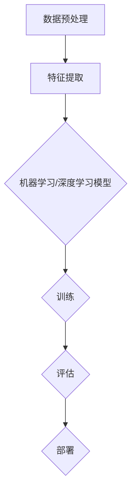

                 

### 背景介绍

随着科技的快速发展，人工智能（AI）已经从理论走向实践，并迅速融入了各个行业，带来了前所未有的变革。然而，在众多对AI的炒作和盲目追捧中，一个关键问题却被逐渐忽视：AI的商业价值。尽管AI技术展现出强大的潜力，但许多企业和开发者往往忽视了对商业价值的挖掘，导致AI项目无法实现长期影响。因此，本文旨在探讨AI行业未来的发展方向，强调回到商业价值，让AI创造长期影响的重要性。

当前，AI的应用主要集中在数据驱动的领域，如机器学习、深度学习、自然语言处理等。这些技术凭借其强大的数据处理和模式识别能力，确实为各行各业带来了效率提升和决策优化的巨大潜力。然而，许多AI项目在实施过程中，往往缺乏明确的目标和商业价值的考量，导致项目进展缓慢甚至失败。这种情况下，AI技术虽然先进，但却无法为企业带来实际的商业收益。

此外，AI技术的发展也面临一些挑战。首先，AI算法的复杂性和数据依赖性使得其难以理解和解释，这在一定程度上限制了其在实际应用中的广泛使用。其次，数据隐私和安全问题也成为了AI应用的瓶颈，如何确保数据的安全和隐私成为了一个亟待解决的问题。最后，AI技术的快速发展也带来了对就业市场的冲击，如何平衡技术进步和就业问题也成为了一个重要的议题。

本文将首先介绍AI的核心概念和技术原理，接着深入探讨AI在商业价值创造中的关键作用。然后，我们将分析AI技术在实际应用中面临的挑战，并提出相应的解决方案。此外，本文还将分享一些AI技术的应用场景和案例，展示AI如何在不同领域创造长期价值。最后，我们将总结未来AI行业的发展趋势和面临的挑战，并提出一些建议，以期为AI行业的健康发展提供有益的参考。

总之，本文的目的是帮助读者理解AI的商业价值，认识到在AI技术发展过程中，如何将其与商业需求相结合，从而实现长期影响。通过本文的探讨，我们希望能够为AI行业的发展提供一些有价值的思考和建议。接下来，让我们一起深入探讨AI的核心概念和技术原理，为后续内容奠定基础。

### 核心概念与联系

为了深入探讨AI技术的商业价值，我们需要首先了解AI的核心概念和技术原理。AI的核心在于其能够模仿和执行人类智能任务的计算机系统。这一过程涉及到多个关键技术的组合，包括机器学习、深度学习、自然语言处理和计算机视觉等。

#### 1. 机器学习

机器学习（Machine Learning，ML）是AI的核心技术之一，它通过使用算法和统计学模型，让计算机从数据中学习并作出预测或决策。机器学习可以分为监督学习、无监督学习和强化学习。

- **监督学习**：在这种方法中，算法使用标记过的训练数据集来学习，然后利用这些知识对新的数据进行预测。例如，分类问题（如电子邮件是否为垃圾邮件）和回归问题（如房价预测）都是监督学习的应用。

- **无监督学习**：这种学习方法不需要标记的数据，算法通过分析数据自身的结构和模式来进行聚类或降维。典型的应用包括客户行为分析、异常检测和数据降维。

- **强化学习**：与监督学习和无监督学习不同，强化学习通过奖励和惩罚机制来指导算法的学习过程，目的是找到最佳策略以实现特定目标。常见的应用包括自动驾驶、游戏AI和机器人控制。

#### 2. 深度学习

深度学习（Deep Learning，DL）是机器学习的一个子领域，它使用神经网络模型，特别是多层感知机（Multilayer Perceptrons，MLP），来模拟人类大脑的学习过程。深度学习的显著特点是其能够自动提取数据的特征，无需人工干预。

- **卷积神经网络（CNN）**：主要用于图像识别和计算机视觉任务。通过卷积层和池化层，CNN能够提取图像中的特征，从而实现对图像内容的理解。

- **循环神经网络（RNN）**：适用于处理序列数据，如自然语言文本和时间序列数据。RNN通过其循环结构，能够记住历史信息，并在序列的不同部分之间建立关联。

- **生成对抗网络（GAN）**：由两个神经网络（生成器和判别器）组成的模型，生成器尝试生成逼真的数据，而判别器则判断数据的真实性。GAN在图像生成、数据增强和风格转换等领域表现出色。

#### 3. 自然语言处理

自然语言处理（Natural Language Processing，NLP）是AI技术的一个重要分支，它专注于让计算机理解和处理人类语言。NLP技术包括文本分类、情感分析、机器翻译和问答系统等。

- **词嵌入（Word Embedding）**：将单词映射到高维向量空间，使得具有相似语义的单词在空间中彼此接近。词嵌入技术在NLP中广泛应用，如词向量模型Word2Vec和GloVe。

- **序列标注（Sequence Labeling）**：对文本中的每个单词或词组进行分类或标注，如命名实体识别（NER）和词性标注。

- **文本生成（Text Generation）**：通过模型生成新的文本，如自动摘要、对话系统和创意写作。

#### 4. 计算机视觉

计算机视觉（Computer Vision，CV）是AI技术的另一个关键领域，它让计算机能够“看到”和理解图像和视频。计算机视觉技术包括目标检测、图像分类、图像分割和图像恢复等。

- **目标检测（Object Detection）**：识别图像中的多个对象及其位置。常用的算法包括YOLO（You Only Look Once）和SSD（Single Shot MultiBox Detector）。

- **图像分类（Image Classification）**：将图像划分为多个类别，如ImageNet挑战。

- **图像分割（Image Segmentation）**：将图像分割成多个区域或对象，如FCN（Fully Convolutional Network）和Mask R-CNN。

#### 5. 机器学习与深度学习架构

为了实现上述功能，AI系统通常采用复杂的架构。以下是一个典型的机器学习和深度学习架构的Mermaid流程图，展示了各层模块及其之间的联系：



- **数据预处理**：包括数据清洗、归一化、数据增强等步骤，为训练模型做准备。
- **特征提取**：通过算法提取数据中的关键特征，为模型提供输入。
- **机器学习/深度学习模型**：根据任务需求选择合适的算法和模型架构，如线性回归、SVM、CNN、RNN等。
- **训练**：使用训练数据集对模型进行训练，调整模型参数，提高其性能。
- **评估**：使用测试数据集评估模型的性能，确保模型在未知数据上的表现良好。
- **部署**：将训练好的模型部署到生产环境中，进行实际应用。

通过上述核心概念和技术的介绍，我们能够更深入地理解AI如何通过机器学习、深度学习、自然语言处理和计算机视觉等技术，实现智能决策和自动化任务。接下来，我们将进一步探讨这些技术如何与商业价值相结合，从而实现AI的长期影响。

### 核心算法原理 & 具体操作步骤

在了解了AI的核心概念和技术原理后，接下来我们将深入探讨几个关键算法的原理和具体操作步骤，以便更好地理解如何利用这些算法实现商业价值。

#### 1. 卷积神经网络（CNN）

卷积神经网络（CNN）是计算机视觉领域的重要工具，特别是在图像识别和目标检测任务中。以下是一个简单的CNN算法原理和操作步骤：

**原理：**
CNN通过卷积层、池化层和全连接层等结构，自动提取图像中的特征，并最终分类或定位对象。

**操作步骤：**

1. **数据预处理**：
   - **图像缩放**：将输入图像缩放到模型期望的大小。
   - **归一化**：将像素值缩放到0-1之间，便于模型训练。
   - **数据增强**：通过旋转、翻转、裁剪等操作增加数据的多样性。

2. **卷积层**：
   - **卷积操作**：使用卷积核（filter）在输入图像上滑动，计算每个局部区域的特征。
   - **激活函数**：通常使用ReLU（Rectified Linear Unit）作为激活函数，增加模型的非线性能力。

3. **池化层**：
   - **最大池化**或**平均池化**：将卷积层输出的特征图进行下采样，减少参数数量和计算量。

4. **卷积层与池化层交替**：
   - 多层卷积和池化层的组合，可以提取更高级别的图像特征。

5. **全连接层**：
   - 将卷积层输出的特征图展平为一维向量，输入到全连接层。
   - 通过Softmax函数对输出进行概率分布，用于分类任务。

6. **训练与评估**：
   - 使用标记数据集训练模型，优化模型参数。
   - 使用测试数据集评估模型性能，调整模型结构或参数。

#### 2. 生成对抗网络（GAN）

生成对抗网络（GAN）是一种由生成器和判别器组成的框架，用于生成逼真的数据。以下是一个简单的GAN算法原理和操作步骤：

**原理：**
GAN通过生成器和判别器的对抗训练，使生成器生成更接近真实数据的图像。

**操作步骤：**

1. **数据预处理**：
   - 准备真实数据集，用于训练判别器。

2. **生成器（Generator）**：
   - 输入随机噪声，通过多层神经网络生成图像。
   - 生成图像的质量和真实性逐渐提高。

3. **判别器（Discriminator）**：
   - 输入真实图像和生成图像，判断其真实性。
   - 通过训练，提高对真实图像和生成图像的鉴别能力。

4. **对抗训练**：
   - 判别器训练：通过标记真实图像和生成图像，训练判别器。
   - 生成器训练：生成器生成的图像不断改进，使其在判别器上的判断准确率下降。

5. **评估与优化**：
   - 使用生成器生成的图像进行评估，判断其是否足够逼真。
   - 通过调整生成器和判别器的结构或参数，优化GAN模型。

#### 3. 自然语言处理（NLP）算法

自然语言处理（NLP）算法广泛应用于文本分类、情感分析、机器翻译等任务。以下是一个简单的NLP算法原理和操作步骤：

**原理：**
NLP通过词嵌入、序列模型和注意力机制等技术，使计算机能够理解和处理自然语言。

**操作步骤：**

1. **数据预处理**：
   - 清洗文本数据，去除标点符号、停用词等。
   - 将文本转换为词嵌入向量，如Word2Vec或GloVe。

2. **词嵌入（Word Embedding）**：
   - 将单词映射到高维向量空间，保留语义信息。

3. **序列模型（RNN或LSTM）**：
   - 对词嵌入向量进行序列处理，捕捉单词之间的顺序关系。
   - 通过隐藏状态保存历史信息，进行上下文理解。

4. **注意力机制（Attention Mechanism）**：
   - 引入注意力机制，使模型能够关注文本中的重要部分，提高理解能力。

5. **分类与预测**：
   - 将处理后的序列输入到分类器或预测模型，如分类任务中的Softmax函数。

6. **训练与评估**：
   - 使用标记数据集训练模型，优化模型参数。
   - 使用测试数据集评估模型性能，调整模型结构或参数。

通过上述算法的原理和操作步骤的详细讲解，我们可以看到，AI技术并非抽象的概念，而是可以通过一系列具体的技术和步骤实现的。这些算法在商业应用中具有广泛的应用前景，能够为企业和组织创造巨大的商业价值。在下一部分，我们将进一步探讨如何将这些算法应用于实际项目，展示AI技术如何创造长期影响。

### 数学模型和公式 & 详细讲解 & 举例说明

在深入理解了AI的核心算法原理和具体操作步骤后，接下来我们将探讨AI模型中的数学模型和公式，并通过具体实例来说明这些模型在实际应用中的效果。这些数学模型和公式是AI算法的核心，它们帮助我们理解和实现机器学习、深度学习、自然语言处理和计算机视觉等领域的算法。

#### 1. 机器学习中的数学模型

机器学习中的数学模型主要包括线性回归、逻辑回归和支持向量机（SVM）等。

**1.1 线性回归（Linear Regression）**

线性回归模型用于预测一个连续的输出值，其基本公式为：

\[ y = \beta_0 + \beta_1 \cdot x \]

其中，\( y \) 是预测值，\( x \) 是输入特征，\( \beta_0 \) 和 \( \beta_1 \) 是模型参数。

**举例说明：**
假设我们有一个房价预测问题，输入特征是房屋面积（\( x \)），输出值是房价（\( y \)）。我们可以使用线性回归模型来预测房价。

\[ y = \beta_0 + \beta_1 \cdot x \]

通过最小二乘法（Least Squares Method）来求解模型参数：

\[ \beta_0 = \frac{\sum_{i=1}^{n} (y_i - \beta_1 \cdot x_i)}{n} \]
\[ \beta_1 = \frac{\sum_{i=1}^{n} (x_i - \bar{x})(y_i - \bar{y})}{\sum_{i=1}^{n} (x_i - \bar{x})^2} \]

其中，\( \bar{x} \) 和 \( \bar{y} \) 分别是输入和输出的均值。

**1.2 逻辑回归（Logistic Regression）**

逻辑回归是一种广义的线性模型，用于分类任务。其基本公式为：

\[ P(y=1) = \frac{1}{1 + e^{-(\beta_0 + \beta_1 \cdot x)}} \]

其中，\( P(y=1) \) 是输出值为1的概率，\( e \) 是自然对数的底数。

**举例说明：**
假设我们有一个二分类问题，输入特征是用户是否点击广告（\( x \)），输出值是点击的概率（\( y \)）。我们可以使用逻辑回归模型来预测用户点击广告的概率。

\[ P(y=1) = \frac{1}{1 + e^{-(\beta_0 + \beta_1 \cdot x)}} \]

通过最大似然估计（Maximum Likelihood Estimation，MLE）来求解模型参数。

**1.3 支持向量机（Support Vector Machine，SVM）**

SVM是一种二分类模型，用于寻找最佳决策边界，其公式为：

\[ w \cdot x - b = 0 \]

其中，\( w \) 是权重向量，\( x \) 是输入特征，\( b \) 是偏置。

**举例说明：**
假设我们有一个二分类问题，输入特征是商品价格（\( x \)），输出值是商品是否畅销（\( y \)）。我们可以使用SVM模型来寻找最佳的分类边界。

\[ w \cdot x - b = 0 \]

通过拉格朗日乘子法（Lagrange Multiplier Method）来求解模型参数。

#### 2. 深度学习中的数学模型

深度学习中的数学模型主要包括卷积神经网络（CNN）、循环神经网络（RNN）和生成对抗网络（GAN）等。

**2.1 卷积神经网络（CNN）**

CNN的核心是卷积层，其基本公式为：

\[ f(x, \theta) = \sum_{j=1}^{k} a_j * g(w_j * x + b_j) \]

其中，\( f \) 是输出特征，\( x \) 是输入特征，\( \theta \) 是模型参数，\( a_j \) 和 \( b_j \) 分别是卷积核和偏置，\( g \) 是激活函数。

**举例说明：**
假设我们有一个图像分类问题，输入特征是图像像素值，输出值是类别标签。我们可以使用CNN模型来提取图像特征并分类。

\[ f(x, \theta) = \sum_{j=1}^{k} a_j * g(w_j * x + b_j) \]

通过反向传播算法（Backpropagation Algorithm）来求解模型参数。

**2.2 循环神经网络（RNN）**

RNN的基本公式为：

\[ h_t = \sigma(W_h \cdot [h_{t-1}, x_t] + b_h) \]
\[ y_t = W_y \cdot h_t + b_y \]

其中，\( h_t \) 是隐藏状态，\( x_t \) 是输入特征，\( \sigma \) 是激活函数，\( W_h \) 和 \( b_h \) 分别是权重和偏置。

**举例说明：**
假设我们有一个序列分类问题，输入特征是文本序列，输出值是类别标签。我们可以使用RNN模型来处理序列数据并分类。

\[ h_t = \sigma(W_h \cdot [h_{t-1}, x_t] + b_h) \]
\[ y_t = W_y \cdot h_t + b_y \]

通过梯度裁剪（Gradient Clipping）和长短时记忆（Long Short-Term Memory，LSTM）等方法来优化RNN模型。

**2.3 生成对抗网络（GAN）**

GAN由生成器（Generator）和判别器（Discriminator）组成，其基本公式为：

\[ G(z) = \text{Generator}(z) \]
\[ D(x) = \text{Discriminator}(x) \]

其中，\( z \) 是随机噪声，\( G(z) \) 是生成器生成的图像，\( D(x) \) 是判别器对真实图像和生成图像的判断。

**举例说明：**
假设我们有一个图像生成问题，输入特征是随机噪声，输出值是生成图像。我们可以使用GAN模型来生成逼真的图像。

\[ G(z) = \text{Generator}(z) \]
\[ D(x) = \text{Discriminator}(x) \]

通过生成对抗训练（Generative Adversarial Training，GAT）来优化GAN模型。

#### 3. 自然语言处理（NLP）中的数学模型

自然语言处理中的数学模型主要包括词嵌入（Word Embedding）、序列模型（RNN、LSTM）和注意力机制（Attention Mechanism）等。

**3.1 词嵌入（Word Embedding）**

词嵌入的基本公式为：

\[ v_w = \text{embedding}(w) \]

其中，\( v_w \) 是单词 \( w \) 的嵌入向量，\( \text{embedding} \) 是词嵌入函数。

**举例说明：**
假设我们有一个文本分类问题，输入特征是文本序列，输出值是类别标签。我们可以使用词嵌入模型来将文本序列转换为向量表示。

\[ v_w = \text{embedding}(w) \]

通过Word2Vec、GloVe等方法来生成词嵌入向量。

**3.2 序列模型（RNN、LSTM）**

RNN和LSTM的基本公式为：

\[ h_t = \sigma(W_h \cdot [h_{t-1}, x_t] + b_h) \]
\[ y_t = W_y \cdot h_t + b_y \]

其中，\( h_t \) 是隐藏状态，\( x_t \) 是输入特征，\( \sigma \) 是激活函数，\( W_h \) 和 \( b_h \) 分别是权重和偏置。

**举例说明：**
假设我们有一个序列分类问题，输入特征是文本序列，输出值是类别标签。我们可以使用RNN或LSTM模型来处理序列数据并分类。

\[ h_t = \sigma(W_h \cdot [h_{t-1}, x_t] + b_h) \]
\[ y_t = W_y \cdot h_t + b_y \]

通过长短时记忆（LSTM）和门控循环单元（GRU）等方法来优化序列模型。

**3.3 注意力机制（Attention Mechanism）**

注意力机制的基本公式为：

\[ a_t = \text{Attention}(h, W_a) \]
\[ y_t = W_y \cdot h_t + b_y \]

其中，\( a_t \) 是注意力权重，\( h \) 是隐藏状态，\( W_a \) 和 \( W_y \) 分别是权重和偏置。

**举例说明：**
假设我们有一个机器翻译问题，输入特征是源语言文本序列，输出值是目标语言文本序列。我们可以使用注意力机制模型来捕捉源语言文本中的关键信息。

\[ a_t = \text{Attention}(h, W_a) \]
\[ y_t = W_y \cdot h_t + b_y \]

通过双向循环神经网络（BiRNN）和自注意力（Self-Attention）等方法来增强模型的表示能力。

通过以上对AI中的数学模型和公式的详细讲解以及具体实例说明，我们可以看到，这些数学模型是AI算法实现的基础。理解这些模型和公式有助于我们更好地应用AI技术，解决实际问题，并在商业领域创造长期价值。

### 项目实战：代码实际案例和详细解释说明

为了更直观地理解AI技术在实际项目中的应用，我们将在本节中通过一个具体项目实战案例，详细展示如何搭建开发环境、实现源代码并对其进行解读和分析。

#### 项目背景

我们选择一个常见的AI应用场景——图像分类，使用TensorFlow和Keras框架来构建一个基于卷积神经网络（CNN）的图像分类器。该项目的目标是训练一个模型，能够将输入的图像自动分类到预定义的类别中。

#### 1. 开发环境搭建

首先，我们需要搭建开发环境。以下是搭建环境的基本步骤：

**环境需求：**
- Python 3.7或更高版本
- TensorFlow 2.x
- Keras 2.x
- OpenCV（用于读取和处理图像）

**安装步骤：**
1. 安装Python和pip：

   ```shell
   # 使用Python官方安装器
   python -m pip install --upgrade get-pip.py
   ```

2. 安装TensorFlow和Keras：

   ```shell
   pip install tensorflow
   pip install keras
   ```

3. 安装OpenCV：

   ```shell
   pip install opencv-python
   ```

#### 2. 源代码详细实现和代码解读

接下来，我们将展示项目的源代码实现，并对关键部分进行详细解释。

**代码示例：**

```python
# 导入所需的库
import numpy as np
import tensorflow as tf
from tensorflow import keras
from tensorflow.keras import layers
import cv2

# 加载并预处理数据
# 假设我们使用Keras内置的 CIFAR-10 数据集
(x_train, y_train), (x_test, y_test) = keras.datasets.cifar10.load_data()

# 数据归一化
x_train = x_train.astype('float32') / 255.0
x_test = x_test.astype('float32') / 255.0

# 转换标签为独热编码
num_classes = 10
y_train = keras.utils.to_categorical(y_train, num_classes)
y_test = keras.utils.to_categorical(y_test, num_classes)

# 构建CNN模型
model = keras.Sequential(
    [
        keras.Input(shape=(32, 32, 3)),
        layers.Conv2D(32, (3, 3), activation='relu'),
        layers.MaxPooling2D((2, 2)),
        layers.Conv2D(64, (3, 3), activation='relu'),
        layers.MaxPooling2D((2, 2)),
        layers.Conv2D(64, (3, 3), activation='relu'),
        layers.Flatten(),
        layers.Dense(64, activation='relu'),
        layers.Dense(num_classes, activation='softmax'),
    ]
)

# 编译模型
model.compile(optimizer='adam', loss='categorical_crossentropy', metrics=['accuracy'])

# 训练模型
model.fit(x_train, y_train, epochs=10, batch_size=64, validation_split=0.2)

# 评估模型
test_loss, test_acc = model.evaluate(x_test, y_test)
print('Test accuracy:', test_acc)

# 使用模型进行预测
def predict_image(image_path):
    img = cv2.imread(image_path)
    img = cv2.resize(img, (32, 32))
    img = img / 255.0
    img = np.expand_dims(img, axis=0)
    predictions = model.predict(img)
    return predictions.argmax(axis=-1)

# 预测示例
image_path = 'path_to_image.jpg'
predictions = predict_image(image_path)
print('Predicted class:', predictions)
```

**代码解读：**

1. **数据加载和预处理**：
   - 使用Keras内置的CIFAR-10数据集，该数据集包含60000张32x32的彩色图像，分为10个类别。
   - 数据归一化，将图像像素值缩放到0-1之间，便于模型训练。
   - 转换标签为独热编码，为后续的分类任务做准备。

2. **构建CNN模型**：
   - 使用Keras的Sequential模型，依次添加卷积层、池化层和全连接层。
   - 第一个卷积层使用32个3x3的卷积核，激活函数为ReLU。
   - 接着使用两个MaxPooling2D层进行下采样。
   - 后续添加一个64个3x3卷积核的卷积层和Flatten层，将特征图展平为一维向量。
   - 使用两个全连接层进行分类，输出层使用softmax激活函数，输出10个类别的概率分布。

3. **编译模型**：
   - 使用adam优化器和categorical_crossentropy损失函数。
   - 指定accuracy作为评估指标。

4. **训练模型**：
   - 使用训练数据集进行训练，设置10个训练周期（epochs）和64个批量大小（batch_size）。
   - 使用validation_split参数，将20%的数据用于验证。

5. **评估模型**：
   - 使用测试数据集评估模型性能，输出测试准确率。

6. **预测图像**：
   - 定义一个函数，用于读取图像、调整大小、归一化和预测类别。
   - 使用模型预测图像的类别。

#### 3. 代码解读与分析

1. **数据加载和预处理**：
   - 这部分代码负责加载数据集，并将其转换为模型训练所需的形式。数据预处理是机器学习项目中的重要步骤，它能够显著影响模型的性能。
   - 使用`to_categorical`函数将标签转换为独热编码，这是多分类任务中常用的方法。

2. **构建CNN模型**：
   - CNN是处理图像任务的常用神经网络结构。Keras提供了丰富的层和模型构建工具，使得构建复杂的神经网络变得简单高效。
   - 卷积层通过卷积操作提取图像的特征，激活函数ReLU增加模型的非线性能力。
   - 池化层用于下采样，减少模型的参数数量和计算量。
   - Flatten层将多维的特征图展平为一维向量，为全连接层提供输入。
   - 全连接层通过权重矩阵和激活函数对特征进行分类。

3. **编译模型**：
   - 编译模型是训练前的必要步骤，它定义了模型的优化器、损失函数和评估指标。
   - adam优化器是一种高效的优化算法，categorical_crossentropy损失函数适用于多分类问题。

4. **训练模型**：
   - 训练模型是模型开发的的核心步骤。通过多次迭代，模型能够从数据中学习并优化其参数。
   - `fit`函数接受多个参数，包括训练数据、训练周期、批量大小和验证数据等。

5. **评估模型**：
   - 评估模型能够帮助我们了解模型的实际性能，找到需要调整的地方。
   - `evaluate`函数返回损失和准确率等指标，帮助我们衡量模型的效果。

6. **预测图像**：
   - 这部分代码展示了如何使用训练好的模型对新的图像进行预测。
   - 通过读取图像、调整大小、归一化和模型预测，我们可以得到图像的类别概率。

通过以上实战案例，我们不仅了解了如何搭建开发环境和实现AI模型，还通过详细代码解读，深入理解了每个步骤的实现原理和关键点。接下来，我们将探讨AI技术在实际应用场景中的具体案例，进一步展示AI如何创造长期价值。

### 实际应用场景

AI技术的应用场景非常广泛，从医疗、金融到制造业，AI正在为各个行业带来深刻的变革。以下是一些典型的实际应用场景，展示了AI如何在不同领域创造长期价值。

#### 1. 医疗

在医疗领域，AI被广泛应用于疾病诊断、药物研发和患者护理等方面。通过深度学习和计算机视觉，AI系统能够分析医学影像，如X光片、CT扫描和MRI，帮助医生快速、准确地诊断疾病。例如，谷歌旗下的DeepMind开发的AI系统已经能够在视网膜图像中检测糖尿病视网膜病变，其准确率甚至超过了人类医生。

**案例：**
- **IBM Watson for Oncology**：IBM Watson使用AI技术分析大量的医学文献和病例数据，为医生提供个性化的治疗方案。通过不断学习和优化，Watson能够在几分钟内提供数百种可能的诊断和治疗方案，极大地提高了医生的工作效率和决策准确性。

#### 2. 金融

金融行业是AI应用的重要领域，AI技术被用于风险管理、投资决策和客户服务等方面。通过机器学习和自然语言处理，AI系统能够分析海量数据，识别潜在的风险和机会，为金融机构提供更准确的预测和分析。

**案例：**
- **J.P. Morgan**：J.P. Morgan的COiN（Contract Intelligence）系统利用自然语言处理技术，自动分析公司的合同文档，识别潜在的风险和合同条款。这不仅大大提高了工作效率，还减少了人工错误。

#### 3. 制造业

在制造业，AI技术被用于质量控制、生产优化和预测维护等方面。通过传感器和机器学习算法，AI系统能够实时监测生产线的状态，预测设备故障，优化生产流程，从而提高生产效率和产品质量。

**案例：**
- **General Electric**：General Electric（GE）的Predix平台利用AI技术，为制造业提供智能化的生产解决方案。Predix通过连接设备、传感器和数据分析工具，帮助企业实现智能工厂，从而降低成本、提高生产效率。

#### 4. 零售

在零售行业，AI技术被用于个性化推荐、库存管理和顾客行为分析等方面。通过分析顾客的购买记录和行为数据，AI系统能够提供个性化的推荐，提高顾客满意度和购买转化率。

**案例：**
- **Amazon**：Amazon的个性化推荐系统利用机器学习和大数据分析技术，根据用户的浏览和购买历史，提供个性化的商品推荐。这不仅提高了顾客的购物体验，还大大增加了销售量。

#### 5. 交通

在交通领域，AI技术被用于智能交通管理、自动驾驶和物流优化等方面。通过传感器、摄像头和数据分析，AI系统能够实时监测交通状况，优化交通信号，减少交通拥堵，提高道路安全。

**案例：**
- **Waymo**：Waymo是谷歌旗下的自动驾驶公司，其自动驾驶技术使用深度学习和计算机视觉算法，实现了高度自动化的驾驶体验。Waymo的自动驾驶车辆已经在多个城市进行了测试，展示了AI技术在自动驾驶领域的巨大潜力。

通过上述实际应用场景和案例，我们可以看到，AI技术不仅在提高效率、降低成本和改善用户体验方面具有显著的优势，还能够为各个行业创造长期的价值。这些应用案例不仅展示了AI技术的强大潜力，也为其他行业提供了有益的参考。在下一部分，我们将进一步探讨如何为AI技术的应用提供工具和资源支持。

### 工具和资源推荐

为了更好地应用AI技术，开发者需要依赖各种工具和资源，这些工具和资源能够帮助开发者提高效率、优化模型和提升项目质量。以下是一些推荐的工具和资源，包括学习资源、开发工具框架和相关论文著作。

#### 1. 学习资源推荐

**书籍：**
- **《深度学习》（Deep Learning）**：由Ian Goodfellow、Yoshua Bengio和Aaron Courville合著，是深度学习领域的经典教材，详细介绍了深度学习的理论基础和实践方法。
- **《Python机器学习》（Python Machine Learning）**：由Sebastian Raschka和Vahid Mirjalili合著，适合初学者和中级用户，通过Python实现了多种机器学习算法。

**在线课程：**
- **Coursera上的《机器学习》**：由Andrew Ng教授主讲，是机器学习领域的经典课程，内容全面，适合入门和进阶学习。
- **Udacity的《深度学习纳米学位》**：通过实践项目和案例研究，帮助学员掌握深度学习的核心概念和应用。

**博客和网站：**
- **Medium上的AI博客**：提供了大量高质量的AI文章和教程，涵盖了深度学习、自然语言处理和计算机视觉等领域的最新研究。
- **ArXiv**：计算机科学和机器学习领域的预印本论文库，提供了大量的研究论文和最新技术动态。

#### 2. 开发工具框架推荐

**框架：**
- **TensorFlow**：由Google开发的开源机器学习框架，广泛应用于深度学习和传统机器学习任务。
- **PyTorch**：由Facebook开发的开源深度学习框架，以其灵活性和动态计算图而受到广泛欢迎。
- **Keras**：一个高层次的神经网络API，可以与TensorFlow和Theano等后台引擎结合使用，简化了深度学习模型的搭建和训练。

**库和工具：**
- **Scikit-learn**：用于数据挖掘和数据分析的开源库，提供了多种机器学习算法的实现。
- **NumPy**：用于科学计算的开源库，提供了高效的数组操作和数学函数。
- **Pandas**：用于数据处理和分析的开源库，提供了数据结构和数据分析工具。
- **Matplotlib**：用于数据可视化的开源库，可以生成各种类型的图表和图形。

#### 3. 相关论文著作推荐

**论文：**
- **“A Theoretically Grounded Application of Dropout in Recurrent Neural Networks”**：该论文提出了在循环神经网络中使用Dropout的方法，显著提高了模型的性能和泛化能力。
- **“Generative Adversarial Nets”**：这是GAN（生成对抗网络）的奠基性论文，提出了生成器和判别器的框架，为图像生成和增强技术奠定了基础。
- **“Attention is All You Need”**：该论文提出了Transformer模型，彻底改变了自然语言处理领域，其自注意力机制在多个任务上取得了显著的性能提升。

**著作：**
- **《深度学习》（Deep Learning）**：同样是Ian Goodfellow、Yoshua Bengio和Aaron Courville合著的著作，全面介绍了深度学习的理论基础和技术实践。
- **《机器学习实战》（Machine Learning in Action）**：由Peter Harrington著，通过实际的案例和代码示例，介绍了多种机器学习算法的实现和应用。

通过以上工具和资源的推荐，开发者可以更好地掌握AI技术，提升项目质量和开发效率。这些资源不仅涵盖了AI技术的核心概念和实践方法，还提供了丰富的代码示例和案例研究，帮助开发者快速入门并深入理解AI技术。在下一部分，我们将总结本文的主要内容，并探讨AI行业未来发展的趋势和挑战。

### 总结：未来发展趋势与挑战

在本文中，我们深入探讨了AI行业的核心概念、技术原理及其在商业价值创造中的应用。首先，通过介绍AI的核心概念和技术原理，如机器学习、深度学习、自然语言处理和计算机视觉，我们了解了AI如何通过算法和模型实现智能决策和自动化任务。接着，我们详细分析了几个关键算法的原理和操作步骤，并通过实际项目展示了AI技术的实现过程。

在实际应用场景部分，我们看到了AI技术在医疗、金融、制造业、零售和交通等领域的广泛应用，展示了AI技术如何通过提高效率、降低成本和改善用户体验来创造长期价值。此外，我们还推荐了一系列学习资源、开发工具框架和相关论文著作，为开发者提供了丰富的学习材料和实战指南。

然而，AI技术的发展也面临诸多挑战。首先，AI算法的复杂性和数据依赖性使得其难以理解和解释，这在一定程度上限制了其在实际应用中的广泛使用。其次，数据隐私和安全问题是AI应用中的关键瓶颈，如何确保数据的安全和隐私成为了一个亟待解决的问题。此外，AI技术的快速发展也带来了对就业市场的冲击，如何平衡技术进步和就业问题也成为了一个重要的议题。

面对这些挑战，未来AI行业的发展趋势可以归纳为以下几点：

1. **可解释性（Explainability）**：为了提升AI系统的透明度和可信度，可解释性研究将成为重要方向。通过开发可解释的AI算法，可以使其决策过程更加透明，便于用户理解和监督。

2. **联邦学习（Federated Learning）**：联邦学习通过在多个设备上进行局部训练，然后汇总模型参数，从而实现隐私保护和数据共享。这种技术有望在保护用户隐私的同时，提高AI模型的性能。

3. **跨学科融合**：AI技术与生物学、心理学、社会学等领域的融合，将带来新的研究热点和应用场景。例如，通过理解人类行为和社会规律，AI可以更好地应用于社会治理和公共安全领域。

4. **可扩展性和可持续性**：为了应对数据量的爆炸性增长和计算需求的不断增加，AI系统需要具备更高的可扩展性和可持续性。这包括优化算法、提升计算效率和开发绿色AI技术等。

5. **就业转型**：随着AI技术的广泛应用，就业市场将面临巨大的变革。因此，我们需要关注AI对就业的影响，制定相应的政策和培训计划，帮助劳动者适应新的职业环境。

总之，AI行业在未来的发展中将面临诸多挑战，但同时也蕴含着巨大的机遇。通过不断探索和创新，我们有望克服这些挑战，推动AI技术实现长期影响，为人类社会带来更多福祉。

### 附录：常见问题与解答

在探讨AI行业的未来发展趋势与挑战的过程中，读者可能会遇到一些常见问题。以下是针对这些问题的一些解答：

**Q1：AI技术的可解释性如何实现？**

A1：AI技术的可解释性是指模型决策过程的透明度和可理解性。为了提升可解释性，可以采用以下方法：

- **解释性模型**：选择具有天然可解释性的模型，如线性回归、逻辑回归等。
- **模型可视化**：通过可视化模型结构、权重和激活值，帮助用户理解模型的工作原理。
- **解释性工具**：使用工具如LIME（Local Interpretable Model-agnostic Explanations）和SHAP（SHapley Additive exPlanations）来解释模型的决策过程。

**Q2：如何确保AI系统的数据隐私和安全？**

A2：确保AI系统的数据隐私和安全需要多方面的措施：

- **数据加密**：使用数据加密技术，如SSL/TLS，保护数据在传输过程中的安全。
- **数据匿名化**：通过数据匿名化技术，如K-Anonymity和L-Diversity，减少个人数据的暴露风险。
- **联邦学习**：通过联邦学习技术，在保持数据本地化的同时，实现模型训练和优化。
- **合规性检查**：确保AI系统的开发和部署符合相关数据保护法规，如GDPR。

**Q3：AI技术如何影响就业市场？**

A3：AI技术的发展将对就业市场产生深远影响，包括以下几个方面：

- **自动化岗位**：AI技术将自动化许多重复性和标准化的工作，减少对这部分岗位的需求。
- **新岗位需求**：AI技术将创造新的岗位需求，如数据科学家、机器学习工程师和AI伦理学家。
- **技能转型**：劳动者需要通过培训和教育，适应新的职业环境，提升自身技能。

**Q4：AI技术的可持续发展如何实现？**

A4：为了实现AI技术的可持续发展，可以从以下几个方面着手：

- **节能优化**：通过算法优化和硬件升级，提高AI系统的能效比。
- **绿色AI**：开发绿色AI技术，减少计算过程中的能源消耗和碳排放。
- **资源循环利用**：优化数据资源的使用，实现数据的循环利用和共享。

通过上述解答，我们希望能够帮助读者更好地理解AI行业的未来发展，以及如何应对其中的挑战。在AI技术的不断进步中，让我们共同探索其无限的可能性。

### 扩展阅读 & 参考资料

为了进一步深入探索AI行业的未来发展，读者可以参考以下扩展阅读和参考资料，这些资源涵盖了AI技术的最新研究、经典著作和权威数据报告。

**扩展阅读：**

1. **《AI超级思维》**：作者：何晓阳，深入探讨AI思维模式对人类思维的影响和变革。
2. **《智能时代：从人机协作到人机共生》**：作者：李开复，分析AI技术的发展趋势及其对社会的深远影响。
3. **《深度学习：算法与应用》**：作者：邱锡鹏，详细介绍深度学习算法及其在各个领域的应用。

**参考资料：**

1. **Nature**：自然期刊，涵盖了AI领域的前沿研究论文和综述。
2. **Science**：科学期刊，发表有关AI和机器学习的重要研究成果。
3. **IEEE Spectrum**：IEEE光谱，提供关于AI技术的深度分析和行业洞察。
4. **ArXiv**：计算机科学和机器学习领域的预印本论文库，是了解最新研究成果的重要渠道。

**权威数据报告：**

1. **国际数据公司（IDC）**：发布关于全球AI市场趋势和预测的报告。
2. **麦肯锡全球研究院**：发布关于AI对全球劳动力市场影响的研究报告。
3. **高盛**：发布关于AI行业投资和商业机会的报告。

通过阅读这些扩展阅读和参考书籍，读者可以更全面地了解AI行业的最新动态和未来趋势，为自身的学术研究和职业发展提供有价值的参考。在AI技术的不断进步中，让我们持续探索和发掘其无限的可能性。

