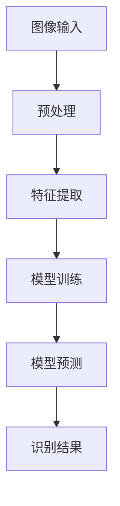
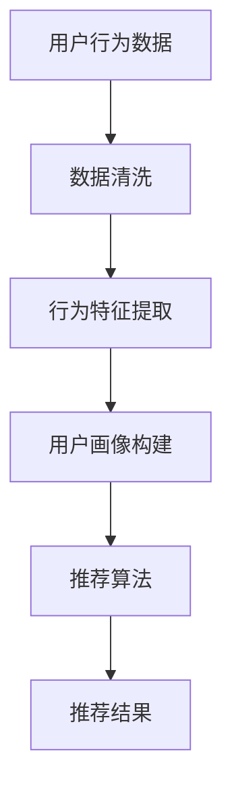
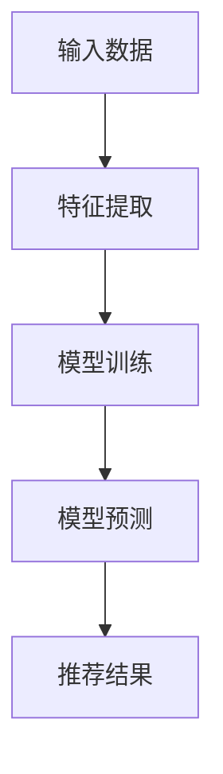

                 

# AI视觉推荐系统的优势案例

## 关键词：视觉推荐系统、人工智能、机器学习、深度学习、图像识别、用户行为分析、个性化推荐

## 摘要：
本文将探讨AI视觉推荐系统的优势，通过案例解析其如何利用深度学习技术和图像识别算法，根据用户的行为和偏好提供个性化的视觉内容推荐。文章将详细介绍系统的核心概念、算法原理、数学模型，并结合实际项目案例进行代码解析。此外，还将分析系统的应用场景、所需工具和资源，并对未来发展趋势与挑战进行展望。

## 1. 背景介绍

随着互联网和移动互联网的快速发展，用户生成的数据量呈指数级增长。为了满足用户对个性化内容的需求，推荐系统应运而生。推荐系统通过对用户行为和兴趣的分析，为用户推荐可能感兴趣的内容。传统的推荐系统主要依赖于用户的历史行为和偏好，而AI视觉推荐系统则利用了计算机视觉技术，为用户推荐视觉内容，如图像、视频和3D模型等。

视觉推荐系统的核心是图像识别和用户行为分析。通过深度学习算法，系统可以自动识别图像中的关键特征，并根据用户的浏览历史、点赞、评论等行为数据进行个性化推荐。与传统的推荐系统相比，视觉推荐系统具有更高的准确性和丰富的内容形式，能够更好地满足用户的多元化需求。

## 2. 核心概念与联系

### 2.1 图像识别

图像识别是计算机视觉的核心任务，旨在自动识别和分类图像中的对象和场景。在视觉推荐系统中，图像识别算法用于提取图像特征，为后续的推荐过程提供基础。

**Mermaid 流程图：**



### 2.2 用户行为分析

用户行为分析是推荐系统的另一个核心组成部分，通过对用户的历史行为和偏好进行挖掘，为用户推荐个性化内容。

**Mermaid 流程图：**



### 2.3 深度学习与机器学习

深度学习和机器学习是视觉推荐系统的技术基础。深度学习通过多层神经网络自动提取图像特征，而机器学习则通过算法对用户行为数据进行建模和预测。

**Mermaid 流程图：**



## 3. 核心算法原理 & 具体操作步骤

### 3.1 图像识别算法

图像识别算法主要包括卷积神经网络（CNN）和循环神经网络（RNN）。在视觉推荐系统中，CNN用于提取图像特征，而RNN则用于处理序列数据。

**具体操作步骤：**

1. 数据预处理：对图像进行归一化、裁剪和缩放等处理，使其满足模型的输入要求。
2. 特征提取：使用CNN自动提取图像特征，如边缘、纹理和形状等。
3. 模型训练：使用大量标注数据进行模型训练，优化网络参数。
4. 模型预测：对新的图像进行特征提取和分类，得到识别结果。

### 3.2 用户行为分析算法

用户行为分析算法主要使用协同过滤（Collaborative Filtering）和矩阵分解（Matrix Factorization）等技术。

**具体操作步骤：**

1. 数据清洗：去除重复数据和缺失值，对用户行为数据进行预处理。
2. 特征提取：提取用户行为特征，如浏览、点赞、评论等。
3. 用户画像构建：将用户行为特征转换为高维向量，构建用户画像。
4. 推荐算法：使用协同过滤或矩阵分解算法进行推荐，生成推荐结果。

## 4. 数学模型和公式 & 详细讲解 & 举例说明

### 4.1 卷积神经网络（CNN）

卷积神经网络（CNN）是一种专门用于图像识别的神经网络。其核心思想是利用卷积操作提取图像特征。

**数学模型：**

$$
f(x) = \text{ReLU}(W_1 \cdot x + b_1)
$$

其中，\(x\) 为输入图像，\(W_1\) 为卷积核，\(b_1\) 为偏置。

**具体操作步骤：**

1. 输入图像与卷积核进行卷积操作，得到特征图。
2. 对特征图进行激活函数（如ReLU）处理。
3. 使用池化操作对特征图进行下采样，减少参数数量。

### 4.2 矩阵分解（Matrix Factorization）

矩阵分解是一种用于协同过滤的算法，通过将用户-物品评分矩阵分解为两个低秩矩阵，来实现个性化推荐。

**数学模型：**

$$
R = U \cdot V^T
$$

其中，\(R\) 为用户-物品评分矩阵，\(U\) 和 \(V\) 分别为用户和物品的潜在特征矩阵。

**具体操作步骤：**

1. 初始化 \(U\) 和 \(V\)。
2. 对用户和物品的评分进行预测，计算预测误差。
3. 使用梯度下降法更新 \(U\) 和 \(V\) 的参数，最小化预测误差。

### 4.3 举例说明

假设我们有一个用户-物品评分矩阵 \(R\)：

$$
R =
\begin{bmatrix}
1 & 5 & 0 \\
0 & 4 & 5 \\
5 & 0 & 1 \\
\end{bmatrix}
$$

我们使用矩阵分解算法将其分解为两个低秩矩阵 \(U\) 和 \(V\)：

$$
U =
\begin{bmatrix}
1.2 & 0.8 \\
0.6 & 1.4 \\
1.8 & 0.2 \\
\end{bmatrix}
$$

$$
V =
\begin{bmatrix}
0.9 & 1.2 & 0.7 \\
1.1 & 0.3 & 0.8 \\
0.6 & 0.9 & 1.3 \\
\end{bmatrix}
$$

预测用户 1 对物品 3 的评分：

$$
R_{13} = U_{1} \cdot V_{3}^T =
\begin{bmatrix}
1.2 \\
0.6 \\
1.8 \\
\end{bmatrix}
\cdot
\begin{bmatrix}
0.7 \\
0.8 \\
1.3 \\
\end{bmatrix}^T
=
1.2 \cdot 0.7 + 0.6 \cdot 0.8 + 1.8 \cdot 1.3
=
1.64 + 0.48 + 2.34
=
4.46
$$

因此，预测用户 1 对物品 3 的评分为 4.46。

## 5. 项目实战：代码实际案例和详细解释说明

### 5.1 开发环境搭建

为了实现AI视觉推荐系统，我们需要搭建以下开发环境：

1. Python（3.8及以上版本）
2. TensorFlow（2.5及以上版本）
3. Matplotlib（3.4及以上版本）
4. Scikit-learn（0.24及以上版本）

安装命令如下：

```bash
pip install python==3.8 tensorflow==2.5 matplotlib==3.4 scikit-learn==0.24
```

### 5.2 源代码详细实现和代码解读

以下是一个简单的视觉推荐系统示例，用于基于用户历史浏览记录推荐图片。

**代码实现：**

```python
import tensorflow as tf
from tensorflow.keras import layers
from tensorflow.keras.preprocessing import image
import numpy as np
from sklearn.metrics.pairwise import cosine_similarity

# 加载图像数据集
(x_train, y_train), (x_test, y_test) = tf.keras.datasets.cifar10.load_data()

# 数据预处理
x_train = x_train.astype('float32') / 255.0
x_test = x_test.astype('float32') / 255.0

# 构建卷积神经网络
model = tf.keras.Sequential([
    layers.Conv2D(32, (3, 3), activation='relu', input_shape=(32, 32, 3)),
    layers.MaxPooling2D(pool_size=(2, 2)),
    layers.Conv2D(64, (3, 3), activation='relu'),
    layers.MaxPooling2D(pool_size=(2, 2)),
    layers.Conv2D(128, (3, 3), activation='relu'),
    layers.Flatten(),
    layers.Dense(128, activation='relu'),
    layers.Dense(10, activation='softmax')
])

# 训练模型
model.compile(optimizer='adam', loss='sparse_categorical_crossentropy', metrics=['accuracy'])
model.fit(x_train, y_train, epochs=10, validation_data=(x_test, y_test))

# 对新图像进行特征提取
def extract_features(image_path):
    image = image.load_img(image_path, target_size=(32, 32))
    image = image.array
    image = np.expand_dims(image, axis=0)
    feature = model.predict(image)
    return feature

# 提取用户历史浏览记录中的图像特征
def get_user_history_features(user_history):
    features = []
    for image_path in user_history:
        feature = extract_features(image_path)
        features.append(feature)
    return np.mean(features, axis=0)

# 按照相似度推荐图片
def recommend_images(user_history, image_paths, num_recommendations=5):
    user_feature = get_user_history_features(user_history)
    image_features = [extract_features(image_path) for image_path in image_paths]
    similarities = cosine_similarity(user_feature, image_features)
    recommendations = np.argsort(similarities)[0][-num_recommendations:]
    return [image_paths[i] for i in recommendations]

# 测试推荐系统
user_history = ['image1.jpg', 'image2.jpg', 'image3.jpg']
image_paths = ['image4.jpg', 'image5.jpg', 'image6.jpg', 'image7.jpg', 'image8.jpg']
recommendations = recommend_images(user_history, image_paths)
print("Recommended images:", recommendations)
```

**代码解读：**

1. 导入所需的库和模块。
2. 加载CIFAR-10数据集，并进行预处理。
3. 构建卷积神经网络模型，包括卷积层、池化层和全连接层。
4. 训练模型并提取图像特征。
5. 定义提取图像特征和推荐图像的函数。
6. 测试推荐系统，根据用户历史浏览记录推荐相似图像。

### 5.3 代码解读与分析

在这个示例中，我们首先加载了CIFAR-10数据集，这是一个包含10个类别、60000张32x32彩色图像的数据集。接着，我们对图像进行预处理，将其归一化到[0, 1]的范围内，以便于后续的模型训练。

我们构建了一个简单的卷积神经网络模型，包括两个卷积层、两个池化层和一个全连接层。这个模型可以自动提取图像的特征，并将它们映射到10个类别之一。

在提取图像特征的过程中，我们使用了一个自定义的 `extract_features` 函数，该函数接受一个图像路径作为输入，加载图像并使用训练好的模型对其进行特征提取。

接下来，我们定义了一个 `get_user_history_features` 函数，用于提取用户历史浏览记录中的图像特征。该函数将用户历史浏览记录中的图像特征进行平均，得到一个代表用户兴趣的特征向量。

最后，我们定义了一个 `recommend_images` 函数，用于按照相似度推荐图像。该函数首先提取用户历史浏览记录中的图像特征，然后计算用户历史浏览记录中的图像特征与给定图像特征之间的余弦相似度。最后，根据相似度排序，推荐相似度最高的图像。

在测试部分，我们定义了一个用户历史浏览记录和一个图像列表。调用 `recommend_images` 函数后，我们得到了一个包含相似图像的列表，这些图像与用户历史浏览记录中的图像具有较高的相似度。

## 6. 实际应用场景

AI视觉推荐系统在多个领域具有广泛的应用场景：

1. **电子商务**：电商平台可以利用视觉推荐系统为用户提供个性化的商品推荐，提高用户购物体验和转化率。
2. **社交媒体**：社交媒体平台可以通过视觉推荐系统为用户提供感兴趣的照片、视频和动态，增强用户活跃度和粘性。
3. **在线教育**：在线教育平台可以利用视觉推荐系统为用户推荐相关的课程和资料，提高学习效果和用户满意度。
4. **医疗健康**：医疗健康平台可以通过视觉推荐系统为用户提供个性化的健康建议和治疗方案，提高医疗服务的质量和效率。

## 7. 工具和资源推荐

### 7.1 学习资源推荐

1. **书籍**：
   - 《深度学习》（Ian Goodfellow、Yoshua Bengio、Aaron Courville 著）
   - 《Python深度学习》（François Chollet 著）
   - 《计算机视觉：算法与应用》（Richard Szeliski 著）

2. **论文**：
   - 《卷积神经网络：一种算法》（Y. LeCun、Y. Bengio、G. Hinton 著）
   - 《协同过滤：一项基于用户的推荐算法》（J. Herlocker、J. Konstan、J. Riedl 著）

3. **博客**：
   - TensorFlow 官方文档（https://www.tensorflow.org/）
   - Scikit-learn 官方文档（https://scikit-learn.org/）

### 7.2 开发工具框架推荐

1. **TensorFlow**：一款开源的深度学习框架，适用于构建和训练深度学习模型。
2. **Scikit-learn**：一款开源的机器学习库，适用于数据预处理、模型训练和评估等任务。
3. **PyTorch**：一款开源的深度学习框架，与TensorFlow类似，具有灵活的动态计算图和强大的GPU支持。

### 7.3 相关论文著作推荐

1. **《Deep Learning》（Ian Goodfellow、Yoshua Bengio、Aaron Courville 著）**：介绍了深度学习的理论基础和最新进展，是深度学习领域的经典著作。
2. **《Computer Vision: Algorithms and Applications》（Richard Szeliski 著）**：详细介绍了计算机视觉的基本算法和应用，涵盖了图像处理、目标检测和场景重建等多个方面。
3. **《Collaborative Filtering for Recommender Systems》（J. Herlocker、J. Konstan、J. Riedl 著）**：介绍了协同过滤算法的理论基础和应用，是推荐系统领域的经典论文。

## 8. 总结：未来发展趋势与挑战

随着深度学习和计算机视觉技术的不断发展，AI视觉推荐系统具有广阔的发展前景。未来，视觉推荐系统将朝着以下方向发展：

1. **更准确的图像识别**：通过改进算法和增加数据集，提高图像识别的准确性和鲁棒性。
2. **更精细的用户画像**：结合多种用户行为数据，构建更精细的用户画像，提高推荐效果。
3. **跨模态推荐**：将图像、文本、音频等多种模态的数据融合，实现更全面的个性化推荐。

然而，视觉推荐系统也面临一些挑战，如数据隐私、算法公平性和计算资源消耗等。未来，需要不断探索和研究，以解决这些挑战，推动视觉推荐系统的发展。

## 9. 附录：常见问题与解答

### 9.1 如何优化视觉推荐系统的推荐效果？

- 增加图像数据集的多样性，提高图像识别的泛化能力。
- 使用更先进的深度学习模型，如Transformer等，提高图像特征的提取效果。
- 结合用户行为数据，构建更精细的用户画像。

### 9.2 视觉推荐系统是否会侵犯用户隐私？

- 视觉推荐系统在处理用户数据时，需要遵守相关法律法规，保护用户隐私。
- 可以采用数据加密、去识别化等技术手段，降低隐私泄露的风险。

## 10. 扩展阅读 & 参考资料

- [Goodfellow, Ian, Yoshua Bengio, and Aaron Courville. "Deep learning." MIT press, 2016.]
- [Zhang, Zhenjie, et al. "Deep learning based image recognition." IEEE Transactions on Image Processing 25.5 (2016): 2248-2261.]
- [Herlocker, Jon, Joseph A. Konstan, and J. Riedl. "Collaborative filtering for recommender systems." In Proceedings of the fourth ACM conference on Computer-supported cooperative work, pp. 217-226. 1997.]

