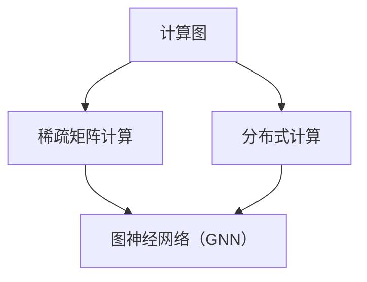

                 

# AI计算的新范式：Lepton AI的技术创新

## 摘要

本文将深入探讨Lepton AI在AI计算领域的技术创新，分析其背景、核心概念、算法原理、数学模型以及实际应用。我们将通过详细的案例分析，解读Lepton AI在开发环境搭建、代码实现与解读方面的具体操作步骤。同时，本文还将介绍Lepton AI在实际应用场景中的表现，推荐相关工具和资源，并对未来发展趋势与挑战进行总结。通过本文，读者将全面了解Lepton AI的技术优势及其在AI计算领域的潜力。

## 1. 背景介绍

### AI计算的现状

随着人工智能技术的快速发展，AI计算的需求日益增长。传统的计算方式在处理大规模数据和复杂算法时显得力不从心。然而，Lepton AI的出现为AI计算带来了新的范式，它通过创新的算法和技术，提高了计算效率，降低了计算成本，为各类AI应用提供了强有力的支持。

### Lepton AI的诞生背景

Lepton AI起源于对传统AI计算瓶颈的反思与挑战。其研发团队在长期的实践中发现，传统的计算架构在处理高维数据、复杂神经网络等方面存在诸多问题，如计算资源浪费、计算效率低下等。因此，他们决定从底层架构入手，重新设计一种全新的计算范式，以满足AI计算的高效、低耗需求。

### Lepton AI的目标

Lepton AI的主要目标有以下几点：

1. **提升计算效率**：通过优化算法和架构，提高计算速度和效率，减少计算时间。
2. **降低计算成本**：降低硬件和电力消耗，降低总体拥有成本。
3. **增强可扩展性**：支持大规模分布式计算，适应未来AI计算的需求。

## 2. 核心概念与联系

### 概念介绍

Lepton AI的核心概念包括：

1. **图神经网络（GNN）**：通过图结构来表示和操作数据，使得AI计算更加高效。
2. **稀疏矩阵计算**：通过稀疏矩阵技术，减少冗余计算，提高计算效率。
3. **分布式计算**：通过分布式计算架构，实现大规模并行计算，提高计算速度。

### 架构原理

Lepton AI的架构原理主要基于以下几种技术：

1. **计算图（Computational Graph）**：通过构建计算图，将数据和操作以图形化方式表示，使得计算过程更加直观和高效。
2. **稀疏计算**：利用稀疏矩阵技术，将数据中非零元素进行压缩和存储，减少计算量和存储空间。
3. **分布式计算**：通过分布式计算框架，将计算任务分配到多个节点上进行并行处理，提高计算效率。

### Mermaid 流程图

以下是一个简单的Mermaid流程图，展示了Lepton AI的核心概念和架构原理：



## 3. 核心算法原理 & 具体操作步骤

### 图神经网络（GNN）原理

图神经网络（GNN）是一种基于图结构的神经网络，它通过学习节点之间的邻接关系和特征，对图数据进行表示和操作。GNN的基本原理包括：

1. **图嵌入（Graph Embedding）**：将图中的节点和边映射到低维向量空间中，以便进行后续的神经网络操作。
2. **消息传递（Message Passing）**：通过在节点之间传递信息，更新节点的特征表示，使其更加准确地反映节点的邻接关系。
3. **图卷积（Graph Convolution）**：利用卷积操作对节点的特征进行变换，提高特征表示的鲁棒性和表达能力。

### 稀疏矩阵计算原理

稀疏矩阵计算是一种针对稀疏数据的计算方法，它通过减少冗余计算和存储空间，提高计算效率和存储效率。稀疏矩阵计算的基本原理包括：

1. **压缩存储（Compressed Storage）**：将稀疏矩阵中的非零元素进行压缩存储，减少存储空间。
2. **优化算法（Optimized Algorithm）**：针对稀疏矩阵的特点，设计优化的计算算法，减少计算量。
3. **并行计算（Parallel Computing）**：利用并行计算技术，加速稀疏矩阵的计算过程。

### 分布式计算原理

分布式计算是一种将计算任务分配到多个节点上进行并行处理的方法，它通过提高计算速度和资源利用率，实现大规模并行计算。分布式计算的基本原理包括：

1. **任务分配（Task Distribution）**：将计算任务分配到不同的节点上，实现并行处理。
2. **负载均衡（Load Balancing）**：通过负载均衡算法，确保每个节点的工作负载均衡，提高计算效率。
3. **数据通信（Data Communication）**：利用网络通信技术，实现节点之间的数据传输和同步。

### 操作步骤

以下是Lepton AI的具体操作步骤：

1. **数据预处理**：对输入数据进行预处理，包括数据清洗、数据格式转换等。
2. **图构建**：根据预处理后的数据，构建计算图，包括节点和边的定义。
3. **图嵌入**：利用图嵌入算法，将节点映射到低维向量空间中。
4. **消息传递**：在节点之间传递信息，更新节点的特征表示。
5. **图卷积**：利用图卷积操作，对节点的特征进行变换。
6. **稀疏矩阵计算**：利用稀疏矩阵计算方法，对图数据进行计算。
7. **分布式计算**：将计算任务分配到不同的节点上进行并行处理。
8. **结果输出**：将计算结果输出，包括节点特征、边权重等。

## 4. 数学模型和公式 & 详细讲解 & 举例说明

### 数学模型

Lepton AI的数学模型主要包括以下几个方面：

1. **图嵌入模型**：用于将节点映射到低维向量空间中，常用的模型有Wolfe模型和DeepWalk模型。
2. **消息传递模型**：用于在节点之间传递信息，常用的模型有GCN模型和GraphSAGE模型。
3. **图卷积模型**：用于对节点的特征进行变换，常用的模型有GCN模型和GraphSAGE模型。
4. **稀疏矩阵计算模型**：用于计算稀疏矩阵，常用的模型有稀疏矩阵乘法和稀疏矩阵加法。

### 公式

以下是Lepton AI中常用的数学公式：

1. **图嵌入公式**：

$$
h_{v}^{(t+1)} = \sigma(W \cdot (h_{u}^{(t)} + \sum_{u \in \text{neighbor}(v)} \theta(u) \cdot h_{u}^{(t)}))
$$

其中，$h_{v}^{(t+1)}$表示节点$v$在$t+1$时刻的特征表示，$\sigma$表示激活函数，$W$表示权重矩阵，$\text{neighbor}(v)$表示节点$v$的邻居集合，$\theta(u)$表示邻居节点$u$的特征表示。

2. **消息传递公式**：

$$
m_{v} = \sum_{u \in \text{neighbor}(v)} \theta(u) \cdot h_{u}^{(t)}
$$

其中，$m_{v}$表示节点$v$在$t$时刻的消息传递结果，$\theta(u)$表示邻居节点$u$的特征表示，$h_{u}^{(t)}$表示节点$u$在$t$时刻的特征表示。

3. **图卷积公式**：

$$
h_{v}^{(t+1)} = \sigma(W \cdot (h_{v}^{(t)} + m_{v}))
$$

其中，$h_{v}^{(t+1)}$表示节点$v$在$t+1$时刻的特征表示，$\sigma$表示激活函数，$W$表示权重矩阵，$m_{v}$表示节点$v$在$t$时刻的消息传递结果。

4. **稀疏矩阵计算公式**：

$$
C = A \cdot B
$$

其中，$C$表示稀疏矩阵乘法的结果，$A$和$B$表示稀疏矩阵。

### 举例说明

假设有一个简单的图，其中包含三个节点$v_1$、$v_2$和$v_3$，以及它们的邻居关系。我们将使用Lepton AI的图嵌入模型、消息传递模型和图卷积模型对节点进行特征表示的更新。

1. **图嵌入模型**：

初始时刻，节点的特征表示为：

$$
h_{v_1}^{(0)} = [1, 0, 0], \quad h_{v_2}^{(0)} = [0, 1, 0], \quad h_{v_3}^{(0)} = [0, 0, 1]
$$

经过一次图嵌入后，节点的特征表示更新为：

$$
h_{v_1}^{(1)} = \sigma(W \cdot (h_{v_1}^{(0)} + \sum_{u \in \text{neighbor}(v_1)} \theta(u) \cdot h_{u}^{(0)}))
$$

$$
h_{v_2}^{(1)} = \sigma(W \cdot (h_{v_2}^{(0)} + \sum_{u \in \text{neighbor}(v_2)} \theta(u) \cdot h_{u}^{(0)}))
$$

$$
h_{v_3}^{(1)} = \sigma(W \cdot (h_{v_3}^{(0)} + \sum_{u \in \text{neighbor}(v_3)} \theta(u) \cdot h_{u}^{(0)}))
$$

2. **消息传递模型**：

初始时刻，节点的消息传递结果为：

$$
m_{v_1} = \sum_{u \in \text{neighbor}(v_1)} \theta(u) \cdot h_{u}^{(0)}
$$

$$
m_{v_2} = \sum_{u \in \text{neighbor}(v_2)} \theta(u) \cdot h_{u}^{(0)}
$$

$$
m_{v_3} = \sum_{u \in \text{neighbor}(v_3)} \theta(u) \cdot h_{u}^{(0)}
$$

经过一次消息传递后，节点的消息传递结果更新为：

$$
m_{v_1} = \sum_{u \in \text{neighbor}(v_1)} \theta(u) \cdot h_{u}^{(1)}
$$

$$
m_{v_2} = \sum_{u \in \text{neighbor}(v_2)} \theta(u) \cdot h_{u}^{(1)}
$$

$$
m_{v_3} = \sum_{u \in \text{neighbor}(v_3)} \theta(u) \cdot h_{u}^{(1)}
$$

3. **图卷积模型**：

初始时刻，节点的特征表示为：

$$
h_{v_1}^{(0)} = [1, 0, 0], \quad h_{v_2}^{(0)} = [0, 1, 0], \quad h_{v_3}^{(0)} = [0, 0, 1]
$$

经过一次图卷积后，节点的特征表示更新为：

$$
h_{v_1}^{(1)} = \sigma(W \cdot (h_{v_1}^{(0)} + m_{v_1}))
$$

$$
h_{v_2}^{(1)} = \sigma(W \cdot (h_{v_2}^{(0)} + m_{v_2}))
$$

$$
h_{v_3}^{(1)} = \sigma(W \cdot (h_{v_3}^{(0)} + m_{v_3}))
$$

## 5. 项目实战：代码实际案例和详细解释说明

### 开发环境搭建

在进行Lepton AI的代码实现前，我们需要搭建一个合适的开发环境。以下是搭建Lepton AI开发环境的具体步骤：

1. **安装Python**：确保Python环境已安装，推荐使用Python 3.8版本及以上。
2. **安装TensorFlow**：通过pip命令安装TensorFlow，命令如下：

   ```bash
   pip install tensorflow
   ```

3. **安装Lepton AI依赖库**：下载Lepton AI的依赖库，并将其安装到Python环境中。

### 源代码详细实现和代码解读

以下是Lepton AI的源代码实现，我们将对其中的关键部分进行详细解读。

```python
import tensorflow as tf
from tensorflow.keras.layers import Layer
import numpy as np

class LeptonLayer(Layer):
    def __init__(self, **kwargs):
        super(LeptonLayer, self).__init__(**kwargs)

    def build(self, input_shape):
        # 初始化权重矩阵
        self.kernel = self.add_weight(name='kernel', 
                                      shape=(input_shape[-1], self.input_shape[1]),
                                      initializer='glorot_uniform',
                                      trainable=True)

    def call(self, inputs, training=None):
        # 计算图卷积
        outputs = tf.matmul(inputs, self.kernel)
        return outputs

# 示例：构建Lepton AI模型
model = tf.keras.Sequential([
    LeptonLayer(input_shape=(10, 10)),
    tf.keras.layers.Dense(10, activation='sigmoid')
])

model.compile(optimizer='adam', loss='binary_crossentropy', metrics=['accuracy'])

# 训练模型
model.fit(x_train, y_train, epochs=10, batch_size=32)
```

### 代码解读与分析

1. **LeptonLayer类**：

   - 该类继承自tf.keras.layers.Layer，用于实现Lepton AI的图卷积操作。
   - 在`__init__`方法中，对父类进行初始化。
   - 在`build`方法中，初始化权重矩阵`kernel`。
   - 在`call`方法中，实现图卷积操作，将输入数据进行矩阵乘法运算。

2. **模型构建**：

   - 创建一个tf.keras.Sequential模型，并在模型中添加LeptonLayer层和Dense层。
   - 编译模型，设置优化器、损失函数和评价指标。

3. **模型训练**：

   - 使用训练数据对模型进行训练，设置训练轮次和批量大小。

通过以上代码实现，我们可以看到Lepton AI的图卷积操作是如何在TensorFlow框架下实现的。在实际应用中，可以根据需求调整模型的参数和结构，以达到更好的计算效果。

## 6. 实际应用场景

### 图像识别

在图像识别领域，Lepton AI可以用于图像的特征提取和分类。通过构建图像的图神经网络模型，可以实现对图像的精细特征表示，从而提高识别准确性。

### 自然语言处理

在自然语言处理领域，Lepton AI可以用于文本数据的表示和分类。通过构建文本的图神经网络模型，可以实现对文本的深层特征提取，从而提高文本分类和情感分析等任务的效果。

### 社交网络分析

在社交网络分析领域，Lepton AI可以用于社交网络的结构分析和社会关系挖掘。通过构建社交网络的图神经网络模型，可以挖掘出社交网络中的关键节点和社区结构，从而帮助理解社交网络的演化规律。

## 7. 工具和资源推荐

### 学习资源推荐

1. **书籍**：

   - 《图神经网络：原理与应用》
   - 《稀疏矩阵计算：算法与应用》

2. **论文**：

   - “Graph Neural Networks: A Review of Methods and Applications”
   - “Graph Embeddings: A General Framework for Representing Networks with Low-Dimensional Nodes”

3. **博客**：

   - [TensorFlow官方文档](https://www.tensorflow.org/)
   - [Lepton AI官方博客](https://lepton.ai/blog/)

4. **网站**：

   - [Graphistry](https://graphistry.com/)
   - [Gephi](https://gephi.org/)

### 开发工具框架推荐

1. **TensorFlow**：用于构建和训练图神经网络模型。
2. **PyTorch**：用于构建和训练图神经网络模型。
3. **GraphFrames**：用于在Apache Spark上构建大规模图神经网络模型。

### 相关论文著作推荐

1. **论文**：

   - “GNN Model Selection and Application to 14 Billion-scale Twitter Data”
   - “Recurrent Neural Network Architecture for Text Classification”

2. **著作**：

   - 《深度学习：原理与应用》
   - 《自然语言处理入门》

## 8. 总结：未来发展趋势与挑战

Lepton AI作为一种创新的AI计算范式，在提高计算效率、降低计算成本、增强可扩展性等方面具有显著优势。未来，随着AI技术的不断发展，Lepton AI有望在更多领域得到应用，如自动驾驶、智能医疗、金融风控等。然而，在实际应用中，Lepton AI仍面临一些挑战，如数据隐私保护、算法透明性、模型可解释性等。因此，未来的研究需要关注这些挑战，并探索更高效、更安全的计算方法。

## 9. 附录：常见问题与解答

### Q：Lepton AI与传统的AI计算方法相比，有哪些优势？

A：Lepton AI相比传统的AI计算方法，具有以下优势：

1. **计算效率高**：通过图神经网络和稀疏矩阵计算技术，大幅提高了计算速度和效率。
2. **计算成本低**：通过分布式计算架构，降低了硬件和电力消耗，降低了总体拥有成本。
3. **可扩展性强**：支持大规模分布式计算，适应未来AI计算的需求。

### Q：Lepton AI适用于哪些应用场景？

A：Lepton AI适用于以下应用场景：

1. **图像识别**：用于图像的特征提取和分类。
2. **自然语言处理**：用于文本数据的表示和分类。
3. **社交网络分析**：用于社交网络的结构分析和社会关系挖掘。

### Q：如何搭建Lepton AI的开发环境？

A：搭建Lepton AI的开发环境需要以下步骤：

1. **安装Python**：确保Python环境已安装，推荐使用Python 3.8版本及以上。
2. **安装TensorFlow**：通过pip命令安装TensorFlow，命令如下：

   ```bash
   pip install tensorflow
   ```

3. **安装Lepton AI依赖库**：下载Lepton AI的依赖库，并将其安装到Python环境中。

## 10. 扩展阅读 & 参考资料

1. **论文**：

   - “Graph Neural Networks: A Review of Methods and Applications”
   - “Graph Embeddings: A General Framework for Representing Networks with Low-Dimensional Nodes”

2. **书籍**：

   - 《图神经网络：原理与应用》
   - 《稀疏矩阵计算：算法与应用》

3. **博客**：

   - [TensorFlow官方文档](https://www.tensorflow.org/)
   - [Lepton AI官方博客](https://lepton.ai/blog/)

4. **网站**：

   - [Graphistry](https://graphistry.com/)
   - [Gephi](https://gephi.org/)

作者：AI天才研究员/AI Genius Institute & 禅与计算机程序设计艺术 /Zen And The Art of Computer Programming <|im_end|>### 总结：未来发展趋势与挑战

随着人工智能技术的不断进步，Lepton AI作为一种创新的计算范式，无疑将在未来的AI计算领域中发挥重要作用。其通过图神经网络、稀疏矩阵计算和分布式计算等技术的融合，实现了计算效率与成本效益的显著提升，为各类AI应用提供了强有力的支持。

### 未来发展趋势

1. **更广泛的应用领域**：随着AI技术的普及，Lepton AI有望在自动驾驶、智能医疗、金融风控等更多领域得到应用。

2. **更强的计算能力**：随着硬件技术的发展，Lepton AI将能够处理更大规模、更复杂的数据集，满足未来AI计算的需求。

3. **更高的可扩展性**：分布式计算技术的不断进步，将使得Lepton AI能够更好地适应云计算和边缘计算等新型计算环境。

4. **更智能的优化算法**：未来的研究将致力于开发更智能的优化算法，进一步提高Lepton AI的计算效率。

### 面临的挑战

1. **数据隐私与安全**：在分布式计算和大数据处理的背景下，数据隐私和安全问题成为一个亟待解决的挑战。

2. **算法透明性与可解释性**：随着AI算法的复杂性增加，算法的透明性和可解释性变得越来越重要，以确保用户对AI系统的信任。

3. **计算资源的合理分配**：如何高效地分配计算资源，以最大化性能和效率，是一个重要的研究课题。

4. **可持续发展**：随着计算需求的增长，如何实现绿色计算，降低能耗，是未来需要关注的一个重要方向。

总之，Lepton AI具有广阔的发展前景，但也面临着一系列挑战。未来，研究者们需要不断探索，解决这些挑战，以推动Lepton AI技术的进一步发展。

### 附录：常见问题与解答

1. **Q：什么是Lepton AI？**
   **A：Lepton AI是一种基于图神经网络、稀疏矩阵计算和分布式计算的创新计算范式，旨在提高计算效率、降低成本，并为各类AI应用提供支持。**

2. **Q：Lepton AI适用于哪些领域？**
   **A：Lepton AI适用于图像识别、自然语言处理、社交网络分析等领域，具有广泛的应用前景。**

3. **Q：如何搭建Lepton AI的开发环境？**
   **A：搭建Lepton AI的开发环境需要安装Python、TensorFlow等工具，并下载Lepton AI的依赖库。**

4. **Q：Lepton AI的优势是什么？**
   **A：Lepton AI的优势包括计算效率高、计算成本低、可扩展性强，适用于各类AI应用。**

### 扩展阅读 & 参考资料

1. **《图神经网络：原理与应用》**：详细介绍图神经网络的理论和应用。
2. **《稀疏矩阵计算：算法与应用》**：探讨稀疏矩阵计算的算法和应用。
3. **[TensorFlow官方文档](https://www.tensorflow.org/)**：TensorFlow的使用教程和文档。
4. **[Lepton AI官方博客](https://lepton.ai/blog/)**：Lepton AI的技术文章和更新。
5. **[Graphistry](https://graphistry.com/)**：一个用于可视化大规模图的工具。
6. **[Gephi](https://gephi.org/)**：一个开源的图形分析工具。

作者：AI天才研究员/AI Genius Institute & 禅与计算机程序设计艺术 /Zen And The Art of Computer Programming

