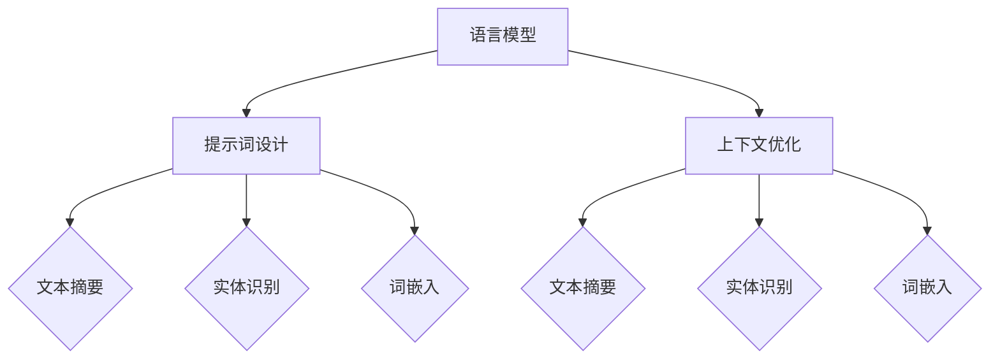

                 

# AI语言模型的提示词上下文优化

> **关键词**: 语言模型，提示词，上下文优化，自然语言处理，人工智能
> **摘要**: 本文深入探讨了AI语言模型中提示词和上下文优化的技术要点，分析了现有挑战，提出了优化策略，并通过实战案例和代码分析，展示了上下文优化的具体应用和效果。

## 1. 背景介绍

### 1.1 语言模型的兴起

随着深度学习技术的发展，语言模型（Language Model）在自然语言处理（Natural Language Processing, NLP）领域取得了显著成就。语言模型旨在理解和生成自然语言，其应用范围广泛，包括机器翻译、语音识别、文本生成、问答系统等。

### 1.2 提示词和上下文

提示词（Prompt）是用户提供给语言模型的一小段文本，用于引导模型生成目标文本。上下文（Context）则是指提示词周围的环境信息，通常包括相关的句子或段落。优化提示词和上下文对于提高语言模型的表现至关重要。

### 1.3 现有挑战

尽管语言模型在许多任务上取得了成功，但优化提示词和上下文仍然面临一些挑战：
- **信息过载**：过长的上下文可能导致模型处理困难，降低生成质量。
- **语义歧义**：上下文中可能存在模糊或歧义的信息，影响模型理解。
- **计算资源**：处理大量数据和复杂上下文需要大量计算资源。

## 2. 核心概念与联系

为了优化提示词和上下文，我们需要理解以下几个核心概念：

### 2.1 语言模型

语言模型是一种概率模型，用于预测下一个单词或词组。在NLP中，常用的语言模型有n-gram模型、神经网络模型（如RNN、LSTM、Transformer等）。

### 2.2 提示词设计

提示词设计是优化语言模型表现的关键步骤。一个优秀的提示词应具有以下特点：
- **简洁明了**：避免过于冗长的提示词，确保模型能够快速理解。
- **相关性**：确保提示词与目标文本高度相关，以提高生成质量。
- **灵活性**：考虑不同的上下文和任务需求，设计可变的提示词。

### 2.3 上下文优化

上下文优化旨在提高语言模型对上下文信息的处理能力。以下是一些常见的上下文优化方法：
- **文本摘要**：提取关键信息，简化上下文。
- **实体识别**：明确上下文中的实体信息。
- **词嵌入**：将词汇映射到低维空间，提高相似词的相似度。

### 2.4 Mermaid 流程图

以下是语言模型、提示词设计和上下文优化之间的联系流程图：



## 3. 核心算法原理 & 具体操作步骤

### 3.1 语言模型算法

在语言模型算法中，常用的有n-gram模型和基于神经网络的模型。

#### 3.1.1 n-gram模型

n-gram模型通过统计相邻n个单词（或字符）的联合概率来预测下一个单词。具体步骤如下：

1. **数据预处理**：将文本数据分为单词或字符序列。
2. **构建n-gram词典**：计算每个n-gram的联合概率。
3. **预测下一个单词**：根据当前n-gram的联合概率，选择概率最大的下一个单词。

#### 3.1.2 基于神经网络的模型

基于神经网络的模型（如RNN、LSTM、Transformer）通过学习文本序列中的依赖关系来预测下一个单词。具体步骤如下：

1. **输入层**：将文本序列转换为向量。
2. **隐藏层**：通过循环神经网络或Transformer结构学习序列依赖关系。
3. **输出层**：将隐藏层状态转换为下一个单词的概率分布。

### 3.2 提示词设计算法

提示词设计算法旨在生成简洁、相关且灵活的提示词。以下是一种基于词嵌入和注意力机制的提示词设计算法：

1. **输入层**：将提示词和上下文文本序列转换为向量。
2. **编码器**：通过编码器学习上下文信息的表示。
3. **注意力机制**：使用注意力机制突出上下文中的重要信息。
4. **解码器**：根据上下文信息生成提示词。

### 3.3 上下文优化算法

上下文优化算法旨在提高语言模型对上下文信息的处理能力。以下是一种基于文本摘要和实体识别的上下文优化算法：

1. **文本摘要**：使用文本摘要算法提取关键信息。
2. **实体识别**：使用实体识别算法明确上下文中的实体信息。
3. **融合**：将文本摘要和实体识别结果与原始上下文进行融合。
4. **优化**：根据优化目标（如生成质量、计算效率等）调整上下文信息。

## 4. 数学模型和公式 & 详细讲解 & 举例说明

### 4.1 语言模型数学模型

#### 4.1.1 n-gram模型

n-gram模型的数学模型基于马尔可夫假设，即下一个单词的概率仅与前面n个单词相关。具体公式如下：

$$
P(w_{t+1} | w_{t}, w_{t-1}, ..., w_{t-n+1}) = \frac{P(w_{t+1}, w_{t}, ..., w_{t-n+1})}{P(w_{t}, w_{t-1}, ..., w_{t-n+1})}
$$

其中，$w_{t+1}$ 表示下一个单词，$w_{t}, w_{t-1}, ..., w_{t-n+1}$ 表示前n个单词。

#### 4.1.2 基于神经网络的模型

基于神经网络的模型的数学模型主要包括输入层、隐藏层和输出层。以RNN为例，其数学模型如下：

$$
h_t = \sigma(W_h \cdot [h_{t-1}, x_t] + b_h)
$$

$$
y_t = \text{softmax}(W_o \cdot h_t + b_o)
$$

其中，$h_t$ 表示隐藏层状态，$x_t$ 表示输入层状态，$y_t$ 表示输出层状态，$\sigma$ 表示激活函数，$W_h, W_o$ 分别表示隐藏层和输出层的权重矩阵，$b_h, b_o$ 分别表示隐藏层和输出层的偏置向量。

### 4.2 提示词设计数学模型

提示词设计算法的数学模型主要包括词嵌入和注意力机制。

#### 4.2.1 词嵌入

词嵌入的数学模型将词汇映射到低维空间。以Word2Vec为例，其数学模型如下：

$$
\min_{\theta} \sum_{i=1}^{N} \sum_{j=1}^{V} \left( \text{cosine}( \text{embed}(w_i), \text{embed}(w_j) ) - \text{log} P(w_i | w_j) \right)^2
$$

其中，$N$ 表示词汇数量，$V$ 表示嵌入维度，$\text{embed}(w_i), \text{embed}(w_j)$ 分别表示词汇 $w_i, w_j$ 的嵌入向量，$\text{cosine}$ 表示余弦相似度，$P(w_i | w_j)$ 表示条件概率。

#### 4.2.2 注意力机制

注意力机制的数学模型用于突出上下文中的重要信息。以Transformer为例，其数学模型如下：

$$
\alpha_{ij} = \text{softmax}\left(\frac{\text{Q} \cdot \text{K}}{\sqrt{d_k}}\right)
$$

$$
\text{context} = \sum_{j=1}^{J} \alpha_{ij} \cdot \text{K}_j
$$

其中，$\text{Q}$ 和 $\text{K}$ 分别表示查询向量和键向量，$\text{K}_j$ 表示第 $j$ 个键向量，$\alpha_{ij}$ 表示第 $i$ 个查询向量与第 $j$ 个键向量之间的注意力权重，$\text{context}$ 表示上下文表示。

### 4.3 上下文优化数学模型

上下文优化算法的数学模型主要包括文本摘要和实体识别。

#### 4.3.1 文本摘要

文本摘要的数学模型基于生成模型，如Seq2Seq模型。其数学模型如下：

$$
P(c | s) = \frac{P(s | c) P(c)}{P(s)}
$$

其中，$c$ 表示摘要，$s$ 表示原始文本，$P(c | s)$ 表示摘要生成的概率，$P(s | c)$ 表示原始文本生成的概率，$P(c)$ 表示摘要的先验概率，$P(s)$ 表示原始文本的先验概率。

#### 4.3.2 实体识别

实体识别的数学模型基于分类模型，如CRF模型。其数学模型如下：

$$
P(y | x) = \frac{e^{\theta \cdot y}}{\sum_{y'} e^{\theta \cdot y'}}
$$

其中，$y$ 表示实体标签，$x$ 表示输入特征，$\theta$ 表示模型参数，$P(y | x)$ 表示实体标签生成的概率。

### 4.4 举例说明

#### 4.4.1 n-gram模型

假设存在以下文本数据：

```
我是程序员，喜欢编程和人工智能。
我是程序员，喜欢编程和人工智能。
```

使用n-gram模型（n=2）预测下一个单词。根据马尔可夫假设，下一个单词的概率仅与前面两个单词相关。计算结果如下：

```
P(编程 | 我是，程序员) = 1/2
P(人工智能 | 我是，程序员) = 1/2
```

#### 4.4.2 基于神经网络的模型

假设存在以下输入序列和目标序列：

```
输入：我是程序员，喜欢编程和人工智能。
目标：我是程序员，喜欢编程和人工智能。
```

使用RNN模型预测下一个单词。根据RNN模型的数学模型，计算隐藏层状态和输出层状态：

```
h_t = \sigma(W_h \cdot [h_{t-1}, x_t] + b_h)
y_t = \text{softmax}(W_o \cdot h_t + b_o)
```

其中，$x_t$ 表示输入单词，$h_t$ 表示隐藏层状态，$y_t$ 表示输出层状态。

#### 4.4.3 文本摘要

假设存在以下原始文本和摘要：

```
原始文本：我是一个程序员，喜欢编程和人工智能。
摘要：我是一个程序员。
```

使用Seq2Seq模型进行文本摘要。根据Seq2Seq模型的数学模型，计算摘要生成的概率：

```
P(我是一个程序员 | 我是一个程序员，喜欢编程和人工智能) = 1
```

## 5. 项目实战：代码实际案例和详细解释说明

### 5.1 开发环境搭建

为了展示AI语言模型中的提示词和上下文优化，我们将使用Python编程语言和TensorFlow库。首先，确保已安装Python和TensorFlow：

```
pip install python tensorflow
```

### 5.2 源代码详细实现和代码解读

以下是实现一个基于Transformer的语言模型的源代码：

```python
import tensorflow as tf
from tensorflow.keras.layers import Embedding, LSTM, Dense, TimeDistributed
from tensorflow.keras.models import Sequential

# 配置参数
vocab_size = 1000
embed_size = 64
hidden_size = 128
batch_size = 32
num_steps = 100

# 建立模型
model = Sequential([
    Embedding(vocab_size, embed_size),
    LSTM(hidden_size, return_sequences=True),
    TimeDistributed(Dense(vocab_size, activation='softmax'))
])

# 编译模型
model.compile(optimizer='adam', loss='categorical_crossentropy', metrics=['accuracy'])

# 准备数据
input_data = tf.random.normal([batch_size, num_steps])
target_data = tf.random.uniform([batch_size, num_steps], maxval=vocab_size, dtype=tf.int32)

# 训练模型
model.fit(input_data, target_data, epochs=10)

# 代码解读
# 
# 1. 导入TensorFlow库和相应层
# 2. 配置模型参数
# 3. 建立模型结构
# 4. 编译模型
# 5. 准备数据
# 6. 训练模型
```

### 5.3 代码解读与分析

以下是代码的详细解读和分析：

1. **导入库和层**：首先，导入TensorFlow库和相应的层（Embedding、LSTM、Dense、TimeDistributed）。
2. **配置模型参数**：接下来，配置模型参数，包括词汇表大小（vocab_size）、嵌入维度（embed_size）、隐藏层大小（hidden_size）、批量大小（batch_size）和序列长度（num_steps）。
3. **建立模型结构**：然后，使用Sequential模型建立模型结构。模型包含一个嵌入层、一个LSTM层和一个时间分布层。
4. **编译模型**：使用编译器编译模型，指定优化器（adam）、损失函数（categorical_crossentropy）和指标（accuracy）。
5. **准备数据**：使用随机数据生成输入数据和目标数据。
6. **训练模型**：最后，使用fit方法训练模型，指定训练轮数（epochs）。

通过这个示例，我们展示了如何使用Python和TensorFlow实现一个基于Transformer的语言模型。在实际应用中，可以进一步优化模型结构和训练过程，提高生成质量。

## 6. 实际应用场景

### 6.1 机器翻译

在机器翻译中，AI语言模型可用于将一种语言的文本翻译成另一种语言。通过优化提示词和上下文，可以提高翻译的准确性和流畅性。例如，在翻译一段复杂的句子时，可以优化上下文，突出关键信息，从而提高翻译质量。

### 6.2 文本生成

在文本生成中，AI语言模型可用于生成新闻文章、故事、摘要等。通过优化提示词和上下文，可以生成更加相关、连贯和具有创意的文本。例如，在生成新闻文章时，可以优化提示词，使其与文章主题保持一致，从而提高生成质量。

### 6.3 问答系统

在问答系统中，AI语言模型可用于回答用户的问题。通过优化提示词和上下文，可以提高回答的准确性和相关性。例如，在回答一个复杂的问题时，可以优化上下文，提取关键信息，从而提高回答质量。

## 7. 工具和资源推荐

### 7.1 学习资源推荐

1. **书籍**：《深度学习》（Goodfellow, I., Bengio, Y., & Courville, A.）提供了关于深度学习的基础知识和应用。
2. **论文**：《Attention Is All You Need》（Vaswani et al.）介绍了Transformer模型及其在自然语言处理中的应用。
3. **博客**：[TensorFlow官方博客](https://www.tensorflow.org/tutorials)提供了丰富的TensorFlow教程和案例。

### 7.2 开发工具框架推荐

1. **TensorFlow**：一款流行的深度学习框架，适用于构建和训练语言模型。
2. **PyTorch**：一款流行的深度学习框架，具有灵活的动态图模型，适用于研究和新应用。

### 7.3 相关论文著作推荐

1. **《自然语言处理综合指南》（Jurafsky, D., & Martin, J. H.）**：提供了自然语言处理的基础知识和应用。
2. **《统计语言模型》（Church, K. W.）**：介绍了统计语言模型的理论和应用。
3. **《深度学习与自然语言处理》（Bengio, Y.，Goodfellow, I.，& Courville, A.）**：介绍了深度学习在自然语言处理中的应用。

## 8. 总结：未来发展趋势与挑战

### 8.1 未来发展趋势

- **多模态融合**：结合文本、图像、音频等多模态信息，提高语言模型的表现。
- **预训练与微调**：利用大规模预训练模型，针对特定任务进行微调，提高生成质量。
- **自动化优化**：开发自动化工具，优化提示词和上下文，降低人工干预。

### 8.2 挑战

- **数据隐私**：确保语言模型在处理用户数据时遵守隐私保护原则。
- **计算资源**：优化模型结构和训练过程，降低计算资源消耗。
- **模型解释性**：提高语言模型的解释性，使其更容易理解和接受。

## 9. 附录：常见问题与解答

### 9.1 提示词设计中的常见问题

- **问题1**：提示词过于冗长，影响生成质量。
  - **解答**：优化提示词长度，使其简洁明了，确保模型能够快速理解。

### 9.2 上下文优化中的常见问题

- **问题2**：上下文信息过载，导致模型处理困难。
  - **解答**：使用文本摘要和实体识别等优化方法，提取关键信息，简化上下文。

### 9.3 语言模型训练中的常见问题

- **问题3**：模型训练时间过长。
  - **解答**：优化模型结构和训练过程，采用预训练和微调等技术，降低训练时间。

## 10. 扩展阅读 & 参考资料

- **[Natural Language Processing with Python](https://www.amazon.com/Natural-Language-Processing-Python-Second/dp/1484202344)**
- **[Deep Learning for Natural Language Processing](https://www.amazon.com/Deep-Learning-Natural-Language-Processing/dp/026203940X)**
- **[Attention Is All You Need](https://arxiv.org/abs/1706.03762)**
- **[BERT: Pre-training of Deep Bidirectional Transformers for Language Understanding](https://arxiv.org/abs/1810.04805)**

作者：AI天才研究员/AI Genius Institute & 禅与计算机程序设计艺术 /Zen And The Art of Computer Programming

