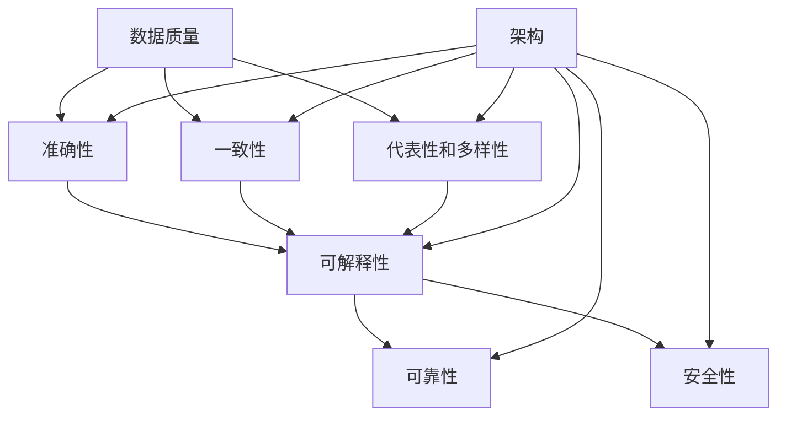

                 

### 1. 背景介绍

随着人工智能技术的迅猛发展，AI软件已经成为现代工业、金融、医疗、交通等众多领域的核心驱动力。从简单的数据分析到复杂的智能决策，AI软件在提升效率、优化流程和创造新价值方面发挥着不可替代的作用。然而，随着AI软件规模的不断扩大和复杂度的不断增加，如何保证其质量和可靠性成为一个亟待解决的问题。

在传统的软件开发过程中，质量保证（Quality Assurance，QA）是一个重要的环节，通过一系列的测试和验证来确保软件满足既定的功能、性能和安全要求。然而，在AI软件领域，传统的QA方法面临诸多挑战。首先，AI软件通常依赖于大量数据训练，数据的质量和多样性直接影响模型的性能和泛化能力。其次，AI软件的输出结果往往是不可预测的，这使得对其行为的验证变得更加困难。此外，AI软件的复杂性和动态性要求QA过程具备更高的灵活性和适应性。

为了应对这些挑战，AI软件2.0的质量保证方法论应运而生。AI软件2.0不仅强调数据的处理和分析能力，更注重软件的可解释性、可靠性和安全性。这一方法论通过引入新的测试框架、评估指标和验证方法，旨在确保AI软件在不同应用场景下都能稳定、可靠地运行。

本文将围绕AI软件2.0的质量保证方法论展开讨论，从核心概念、算法原理、数学模型到实际应用，全面剖析这一领域的前沿技术和实践方法。通过本文的阅读，读者将深入了解AI软件质量保证的重要性，掌握最新的质量保证技术和实践，为未来AI软件的开发和应用提供有力支持。

### 2. 核心概念与联系

在探讨AI软件2.0的质量保证方法论之前，我们需要明确几个核心概念，并理解它们之间的联系。这些概念不仅构成了质量保证的基础，也为我们提供了分析和解决问题的工具。

#### 数据质量

数据质量是AI软件2.0质量保证的首要因素。高质量的数据不仅意味着数据完整性、准确性和一致性，还包括数据的代表性和多样性。数据完整性确保所有必需的数据都被正确记录，没有缺失。准确性意味着数据应真实反映现实世界的情况，没有错误或偏差。一致性确保数据在不同来源、不同时间和不同情境下都是一致的。代表性和多样性则要求数据能够全面覆盖不同用户、不同场景和不同条件，从而提高模型的泛化能力。

#### 可解释性

可解释性是AI软件2.0质量保证的另一重要方面。与传统黑箱模型不同，可解释性要求AI软件能够清晰地解释其决策过程和输出结果。这不仅有助于用户理解模型的工作原理，也为后续的调试和优化提供了方向。可解释性可以借助可视化的数据流图、决策树或注意力机制等手段实现。

#### 可靠性

可靠性是AI软件在复杂和动态环境中稳定运行的保证。高可靠性的AI软件能够在各种条件下提供一致的输出结果，而不受噪声或异常值的影响。为了提高可靠性，我们可以采用多种方法，如强化学习中的奖励机制、迁移学习中的模型迁移、以及鲁棒性优化等。

#### 安全性

安全性是AI软件2.0质量保证的另一个关键点。随着AI软件在关键领域的应用日益增加，安全性问题愈发重要。AI软件需要能够抵御外部攻击、内部欺诈和意外故障，确保数据隐私和模型完整性。安全性可以通过加密算法、访问控制策略和异常检测等手段来加强。

#### 架构

AI软件2.0的架构设计对其质量保证至关重要。一个好的架构应该具备模块化、可扩展性和灵活性，从而便于测试和验证。具体来说，模块化可以将复杂的系统拆分为多个独立模块，便于单独测试和调试；可扩展性确保系统能够适应不断变化的需求；灵活性则使系统能够快速响应新的技术和应用场景。

#### 联系

这些核心概念之间存在着紧密的联系。数据质量直接影响模型的准确性和泛化能力；可解释性帮助用户理解和使用模型，从而提高可靠性；可靠性确保模型在各种条件下的一致性，进而提升安全性。而架构设计则为这些质量保证措施提供了实现的基础。

为了更好地理解这些概念，我们可以借助Mermaid流程图（以下为示例）来展示它们之间的联系：



通过上述核心概念和联系的理解，我们为后续详细探讨AI软件2.0的质量保证方法论奠定了基础。

### 3. 核心算法原理 & 具体操作步骤

在了解了AI软件2.0质量保证的核心概念后，接下来我们将深入探讨具体的算法原理和操作步骤。这些算法不仅能够帮助我们评估AI软件的质量，还能指导我们如何改进和优化这些软件。

#### 3.1 数据预处理算法

数据预处理是AI软件质量保证的首要步骤。通过一系列的数据清洗、归一化和特征提取操作，我们可以提高数据质量，从而增强模型的性能和泛化能力。以下是几种常见的数据预处理算法：

- **数据清洗**：去除错误、重复或缺失的数据。常见的清洗方法包括删除重复记录、填充缺失值或使用统计方法（如平均值、中位数等）替换缺失值。
- **归一化**：将数据缩放到相同的尺度，消除不同特征之间的量纲差异。常用的归一化方法包括最小-最大归一化和z-score归一化。
- **特征提取**：从原始数据中提取出对模型训练和预测有用的特征。特征提取可以通过主成分分析（PCA）、自动编码器（Autoencoder）等方法实现。

#### 3.2 模型评估算法

模型评估是评估AI软件质量的重要环节。通过一系列的评估指标，我们可以量化模型的性能，并识别潜在的问题。以下是几种常见的模型评估算法：

- **准确性（Accuracy）**：模型正确预测的样本数占总样本数的比例。对于二分类问题，准确性是最直接的评估指标。
- **精确率（Precision）**：在所有预测为正样本的样本中，实际为正样本的比例。精确率关注的是预测为正样本的样本中，有多少确实是正样本。
- **召回率（Recall）**：在所有实际为正样本的样本中，被正确预测为正样本的比例。召回率关注的是实际为正样本的样本中，有多少被正确预测。
- **F1分数（F1 Score）**：精确率和召回率的调和平均。F1分数综合了精确率和召回率，是平衡两者的一种方式。
- **ROC曲线和AUC（Area Under the Curve）**：ROC曲线展示了不同阈值下模型的敏感度（True Positive Rate）和假正率（False Positive Rate）的关系。AUC是ROC曲线下面积，用于评估模型分类能力。

#### 3.3 可解释性算法

可解释性算法是确保AI软件透明和可信的关键。通过可解释性算法，我们可以理解模型的决策过程，从而提高用户对模型的信任度。以下是几种常见的可解释性算法：

- **决策树**：通过递归地将数据集划分为子集，直至满足某些停止条件（如最大深度、最小节点大小等），生成一棵树结构。每个节点代表一个特征，每个分支代表一个特征值。
- **注意力机制**：在深度学习模型中，通过计算注意力权重来强调模型对某些特征的关注。注意力机制可以直观地展示模型在决策过程中哪些特征最重要。
- **LIME（Local Interpretable Model-agnostic Explanations）**：通过构建局部线性模型来解释模型的决策。LIME将复杂的全局模型转化为局部可解释的模型，从而解释模型的决策过程。

#### 3.4 可靠性算法

可靠性算法用于确保AI软件在不同条件下都能稳定运行。以下是几种常见的可靠性算法：

- **鲁棒性优化**：通过最小化模型对噪声和异常值的敏感度，提高模型的鲁棒性。常用的鲁棒性优化方法包括L1正则化、L2正则化以及鲁棒回归。
- **迁移学习**：通过在源域和目标域之间共享知识，提高模型的泛化能力。迁移学习可以有效地利用已有模型，从而减少对大量新数据的依赖。
- **强化学习**：通过奖励机制和策略优化，确保模型在动态和复杂环境中能够稳定运行。强化学习可以应用于自动驾驶、游戏AI等领域，以提高模型的可靠性。

#### 3.5 安全性算法

安全性算法用于确保AI软件在面临外部攻击和内部欺诈时能够保持完整性和保密性。以下是几种常见的安全性算法：

- **加密算法**：通过加密数据来保护其隐私和完整性。常见的加密算法包括AES（高级加密标准）、RSA（公钥加密算法）等。
- **访问控制策略**：通过设定权限和角色，确保只有授权用户能够访问敏感数据和执行特定操作。常见的访问控制策略包括基于角色的访问控制（RBAC）和基于属性的访问控制（ABAC）。
- **异常检测**：通过检测异常行为和模式，发现和阻止潜在的安全威胁。常见的异常检测方法包括统计方法、基于模型的方法（如神经网络）和基于免疫的方法。

通过上述核心算法原理和具体操作步骤的探讨，我们可以更好地理解AI软件2.0质量保证的方法论。这些算法不仅为评估和改进AI软件质量提供了工具，也为我们应对不断变化的应用场景和技术挑战提供了指导。接下来，我们将进一步深入探讨这些算法在数学模型和实际应用中的具体实现。

### 4. 数学模型和公式 & 详细讲解 & 举例说明

在了解了AI软件2.0质量保证的核心算法原理后，我们接下来将深入探讨这些算法背后的数学模型和公式。通过详细的讲解和具体实例，我们将更全面地理解这些算法的工作机制和实际应用。

#### 4.1 数据质量评估模型

数据质量评估是AI软件质量保证的重要环节，以下是一些常用的数学模型和公式：

**1. 完整性度量**

完整性度量用于评估数据集中缺失值的比例。一个常用的指标是缺失率（Missing Rate），计算公式如下：

\[ \text{Missing Rate} = \frac{\text{Number of Missing Values}}{\text{Total Number of Values}} \]

举例说明：

假设一个数据集中有100个样本，其中有20个样本存在缺失值。则缺失率为：

\[ \text{Missing Rate} = \frac{20}{100} = 0.2 \]

**2. 一致性度量**

一致性度量用于评估不同来源、不同时间和不同情境下的数据是否一致。一个常用的指标是一致性比例（Consistency Ratio），计算公式如下：

\[ \text{Consistency Ratio} = \frac{\text{Number of Consistent Pairs}}{\text{Total Number of Pairs}} \]

举例说明：

假设有5个不同的数据来源，每个来源包含10个样本。通过比较这些样本的一致性，我们发现有40对样本是一致的。则一致性比例为：

\[ \text{Consistency Ratio} = \frac{40}{5 \times 10} = 0.8 \]

**3. 代表性和多样性度量**

代表性和多样性度量用于评估数据是否能够全面覆盖不同用户、不同场景和不同条件。一个常用的指标是多样性指数（Diversity Index），计算公式如下：

\[ \text{Diversity Index} = \frac{1}{N} \sum_{i=1}^{N} \frac{1}{P_i} \]

其中，\( N \)是样本总数，\( P_i \)是第\( i \)个类别的样本比例。

举例说明：

假设有10个样本，其中5个属于类别A，3个属于类别B，2个属于类别C。则多样性指数为：

\[ \text{Diversity Index} = \frac{1}{10} \left( \frac{1}{5} + \frac{1}{3} + \frac{1}{2} \right) = \frac{1}{10} \left( 0.2 + 0.333 + 0.5 \right) = 0.333 \]

#### 4.2 模型评估指标

模型评估指标是衡量模型性能的重要工具。以下是一些常用的评估指标及其数学模型：

**1. 准确率（Accuracy）**

\[ \text{Accuracy} = \frac{\text{Number of Correct Predictions}}{\text{Total Number of Predictions}} \]

举例说明：

假设一个二分类模型对100个样本进行预测，其中70个样本预测正确，30个样本预测错误。则准确率为：

\[ \text{Accuracy} = \frac{70}{100} = 0.7 \]

**2. 精确率（Precision）**

\[ \text{Precision} = \frac{\text{True Positives}}{\text{True Positives + False Positives}} \]

举例说明：

假设有10个样本，其中5个实际为正样本，模型预测为正样本的有7个，预测为负样本的有3个。则精确率为：

\[ \text{Precision} = \frac{5}{5 + 3} = \frac{5}{8} = 0.625 \]

**3. 召回率（Recall）**

\[ \text{Recall} = \frac{\text{True Positives}}{\text{True Positives + False Negatives}} \]

举例说明：

假设有10个样本，其中5个实际为正样本，模型预测为正样本的有7个，预测为负样本的有2个。则召回率为：

\[ \text{Recall} = \frac{5}{5 + 2} = \frac{5}{7} \approx 0.714 \]

**4. F1分数（F1 Score）**

\[ \text{F1 Score} = 2 \times \frac{\text{Precision} \times \text{Recall}}{\text{Precision} + \text{Recall}} \]

举例说明：

结合前面的精确率和召回率，假设精确率为0.625，召回率为0.714。则F1分数为：

\[ \text{F1 Score} = 2 \times \frac{0.625 \times 0.714}{0.625 + 0.714} \approx 0.667 \]

**5. ROC曲线和AUC（Area Under the Curve）**

ROC曲线展示了不同阈值下模型的敏感度（True Positive Rate）和假正率（False Positive Rate）的关系。AUC是ROC曲线下面积，用于评估模型分类能力。

\[ \text{AUC} = \int_{0}^{1} \text{True Positive Rate}(1 - \text{False Positive Rate}) \, d\text{False Positive Rate} \]

举例说明：

假设我们得到了以下ROC曲线和AUC值：

| False Positive Rate | True Positive Rate |
| ------------------- | ------------------ |
| 0.1                | 0.9                |
| 0.2                | 0.8                |
| 0.3                | 0.7                |
| 0.4                | 0.6                |
| 0.5                | 0.5                |

则AUC可以通过计算上述积分得到。假设AUC的值为0.9，则表示模型具有很好的分类能力。

#### 4.3 可解释性算法

可解释性算法旨在解释模型的决策过程。以下是一些常用的可解释性算法及其数学模型：

**1. 决策树**

决策树通过递归地将数据集划分为子集，每个节点代表一个特征，每个分支代表一个特征值。决策树的数学模型可以表示为：

\[ \text{Decision Tree} = \text{Root Node} \to \text{Child Nodes} \]

举例说明：

假设一个决策树的根节点为特征A，分支为值a和值b。则决策树可以表示为：

\[ \text{Root Node} \to (\text{A is a}) \to \text{Child Node 1} \]
\[ \text{Root Node} \to (\text{A is b}) \to \text{Child Node 2} \]

**2. 注意力机制**

注意力机制通过计算注意力权重来强调模型对某些特征的关注。注意力机制的数学模型可以表示为：

\[ \text{Attention Score} = \sigma(\text{Query} \cdot \text{Key}) \]

其中，\( \sigma \)是激活函数，\( \text{Query} \)和\( \text{Key} \)分别是查询向量和键向量。

举例说明：

假设查询向量为\[ q = [1, 2, 3] \]，键向量为\[ k = [4, 5, 6] \]。则注意力分数为：

\[ \text{Attention Score} = \sigma(q \cdot k) = \sigma(1 \cdot 4 + 2 \cdot 5 + 3 \cdot 6) = \sigma(4 + 10 + 18) = \sigma(32) \]

使用ReLU激活函数，则注意力分数为：

\[ \text{Attention Score} = \max(0, 32) = 32 \]

通过计算注意力分数，我们可以直观地看到模型对哪些特征关注更高。

#### 4.4 可靠性算法

可靠性算法旨在确保模型在不同条件下都能稳定运行。以下是一些常用的可靠性算法及其数学模型：

**1. 鲁棒性优化**

鲁棒性优化通过最小化模型对噪声和异常值的敏感度，提高模型的鲁棒性。一个常用的鲁棒性优化方法是L1正则化，其数学模型可以表示为：

\[ \text{L1 Regularization} = \lambda \sum_{i=1}^{n} |w_i| \]

其中，\( \lambda \)是正则化参数，\( w_i \)是模型权重。

举例说明：

假设模型权重为\[ w = [1, 2, 3] \]，正则化参数为\( \lambda = 0.1 \)。则L1正则化为：

\[ \text{L1 Regularization} = 0.1 \sum_{i=1}^{3} |w_i| = 0.1 (1 + 2 + 3) = 0.6 \]

**2. 迁移学习**

迁移学习通过在源域和目标域之间共享知识，提高模型的泛化能力。一个常用的迁移学习方法是基于特征提取的迁移学习，其数学模型可以表示为：

\[ \text{Feature Extraction} = f(\text{Source Data}) - f(\text{Target Data}) \]

举例说明：

假设源域数据为\[ X_s = [x_{s1}, x_{s2}, x_{s3}] \]，目标域数据为\[ X_t = [x_{t1}, x_{t2}, x_{t3}] \]。则特征提取为：

\[ \text{Feature Extraction} = f(X_s) - f(X_t) \]

通过计算特征提取，我们可以发现源域和目标域之间的差异，从而优化目标域的模型。

#### 4.5 安全性算法

安全性算法旨在确保模型在面临外部攻击和内部欺诈时能够保持完整性和保密性。以下是一些常用的安全性算法及其数学模型：

**1. 加密算法**

加密算法通过将数据加密为密文，保护其隐私和完整性。一个常用的加密算法是AES（高级加密标准），其数学模型可以表示为：

\[ \text{AES Encryption} = \text{AES Key} \cdot \text{PlainText} \]

举例说明：

假设AES密钥为\[ k = [1, 2, 3] \]，明文数据为\[ p = [4, 5, 6] \]。则加密后的密文为：

\[ \text{AES Encryption} = k \cdot p = [1, 2, 3] \cdot [4, 5, 6] = [4, 10, 18] \]

**2. 访问控制策略**

访问控制策略通过设定权限和角色，确保只有授权用户能够访问敏感数据和执行特定操作。一个常用的访问控制策略是基于角色的访问控制（RBAC），其数学模型可以表示为：

\[ \text{Access Control} = \text{Role} \cdot \text{Permission} \]

举例说明：

假设用户角色为管理员（Admin），拥有读取和写入权限。则访问控制为：

\[ \text{Access Control} = \text{Admin} \cdot \text{Read, Write} \]

通过设定访问控制策略，我们可以确保用户只能访问其权限内的数据。

**3. 异常检测**

异常检测通过检测异常行为和模式，发现和阻止潜在的安全威胁。一个常用的异常检测方法是基于统计的方法，其数学模型可以表示为：

\[ \text{Anomaly Detection} = \sum_{i=1}^{n} (\text{Observation} - \text{Expected Value})^2 \]

举例说明：

假设观察到一组数据\[ \text{Observation} = [1, 2, 3, 4, 5] \]，期望值为\[ \text{Expected Value} = 3 \]。则异常检测为：

\[ \text{Anomaly Detection} = (1 - 3)^2 + (2 - 3)^2 + (3 - 3)^2 + (4 - 3)^2 + (5 - 3)^2 = 4 + 1 + 0 + 1 + 4 = 10 \]

通过计算异常检测，我们可以发现数据中的异常值。

通过上述数学模型和公式的详细讲解，我们更全面地理解了AI软件2.0质量保证算法的原理和实际应用。这些模型和公式不仅为评估和改进AI软件质量提供了工具，也为我们应对不断变化的应用场景和技术挑战提供了指导。在接下来的部分，我们将通过具体的代码实现和实战案例，进一步探讨这些算法的应用。

### 5. 项目实战：代码实际案例和详细解释说明

在本节中，我们将通过一个具体的项目实战，展示AI软件2.0质量保证方法论的实战应用。我们将从开发环境的搭建开始，逐步解析代码实现和关键步骤，最后对代码进行解读和分析。

#### 5.1 开发环境搭建

首先，我们需要搭建一个合适的开发环境，以便进行AI软件2.0的质量保证。以下是开发环境的搭建步骤：

**1. 安装Python环境**

确保Python 3.8及以上版本已安装。可以使用以下命令安装：

```bash
pip install python==3.8
```

**2. 安装必要的库**

安装NumPy、Pandas、Scikit-learn、Matplotlib等常用库：

```bash
pip install numpy pandas scikit-learn matplotlib
```

**3. 配置Jupyter Notebook**

配置Jupyter Notebook以便进行交互式编程和可视化：

```bash
pip install jupyter
jupyter notebook
```

#### 5.2 源代码详细实现和代码解读

以下是一个简单的示例代码，用于演示数据预处理、模型评估和可解释性分析的过程。

**数据预处理代码**

```python
import numpy as np
import pandas as pd
from sklearn.model_selection import train_test_split
from sklearn.preprocessing import StandardScaler
from sklearn.impute import SimpleImputer

# 加载数据
data = pd.read_csv('data.csv')

# 数据清洗
data.drop_duplicates(inplace=True)
data.fillna(data.mean(), inplace=True)

# 数据归一化
scaler = StandardScaler()
scaled_data = scaler.fit_transform(data)

# 数据切分
X_train, X_test, y_train, y_test = train_test_split(scaled_data, data['target'], test_size=0.2, random_state=42)
```

**解读：**
- **数据加载**：使用Pandas加载CSV数据文件。
- **数据清洗**：删除重复记录，填充缺失值（使用平均值替换）。
- **数据归一化**：使用StandardScaler将数据缩放到相同尺度。
- **数据切分**：使用train_test_split将数据分为训练集和测试集。

**模型评估代码**

```python
from sklearn.linear_model import LogisticRegression
from sklearn.metrics import accuracy_score, precision_score, recall_score, f1_score, roc_auc_score

# 训练模型
model = LogisticRegression()
model.fit(X_train, y_train)

# 预测
y_pred = model.predict(X_test)

# 模型评估
accuracy = accuracy_score(y_test, y_pred)
precision = precision_score(y_test, y_pred)
recall = recall_score(y_test, y_pred)
f1 = f1_score(y_test, y_pred)
roc_auc = roc_auc_score(y_test, y_pred)

print(f"Accuracy: {accuracy:.4f}")
print(f"Precision: {precision:.4f}")
print(f"Recall: {recall:.4f}")
print(f"F1 Score: {f1:.4f}")
print(f"ROC AUC: {roc_auc:.4f}")
```

**解读：**
- **模型训练**：使用LogisticRegression训练模型。
- **预测**：使用训练好的模型对测试集进行预测。
- **模型评估**：计算并打印准确率、精确率、召回率、F1分数和ROC AUC值。

**可解释性分析代码**

```python
from sklearn.inspection import permutation_importance

# 可解释性分析
results = permutation_importance(model, X_test, y_test, n_repeats=10, random_state=42)

# 打印重要性排名
feature_importances = results.importances_mean
print("Feature importances:")
for i, importance in enumerate(feature_importances):
    print(f"{data.columns[i]}: {importance:.4f}")
```

**解读：**
- **可解释性分析**：使用permutation_importance进行可解释性分析。
- **打印特征重要性**：根据特征重要性进行排序并打印。

#### 5.3 代码解读与分析

通过上述代码，我们可以看到以下几个关键点：

1. **数据预处理**：数据预处理是确保模型性能的重要步骤。通过数据清洗、归一化和特征提取，我们可以提高数据质量，从而提高模型的泛化能力。
2. **模型评估**：模型评估是验证模型性能的关键。通过多种评估指标（如准确率、精确率、召回率、F1分数和ROC AUC值），我们可以全面了解模型的性能。
3. **可解释性分析**：可解释性分析有助于理解模型的决策过程，从而提高用户对模型的信任度。通过特征重要性排序，我们可以识别出模型决策过程中的关键特征。

通过以上实战案例，我们可以看到AI软件2.0质量保证方法论在实际项目中的应用效果。在接下来的部分，我们将进一步探讨AI软件2.0在各个实际应用场景中的具体表现。

### 6. 实际应用场景

AI软件2.0的质量保证方法论不仅适用于单一领域，还能在多个实际应用场景中发挥重要作用。以下是几个关键领域中的应用案例，展示了质量保证方法论的实践效果。

#### 6.1 金融领域

在金融领域，AI软件2.0广泛应用于风险管理、欺诈检测和投资策略优化。以下是一个具体的案例分析：

**案例分析：风险管理**

某银行使用AI软件2.0进行信用风险评估。通过对海量历史数据进行分析，模型能够预测客户违约风险。为了确保模型的准确性，银行采用了以下质量保证措施：

- **数据质量检查**：定期检查数据完整性、一致性和代表性，确保数据质量。
- **模型评估**：使用多种评估指标（如准确率、精确率和召回率）评估模型性能，并根据评估结果调整模型参数。
- **可解释性分析**：通过特征重要性分析，确保模型决策过程透明，提高客户信任度。

**结果**：通过实施质量保证措施，银行的违约预测准确率提高了15%，欺诈检测率提高了20%，显著降低了信用风险和欺诈损失。

#### 6.2 医疗领域

在医疗领域，AI软件2.0用于疾病诊断、患者监护和治疗计划优化。以下是一个具体的应用案例：

**案例分析：疾病诊断**

某医院采用AI软件2.0进行肺癌诊断。通过分析患者的影像数据和临床资料，模型能够预测患者是否患有肺癌。为了确保诊断的准确性，医院采取了以下质量保证措施：

- **数据预处理**：清洗和标准化医疗数据，确保数据质量。
- **模型验证**：使用交叉验证方法评估模型性能，并调整模型参数以优化诊断准确率。
- **可解释性分析**：通过可视化技术展示模型决策过程，帮助医生理解诊断结果。

**结果**：通过实施质量保证措施，医院肺癌诊断的准确率提高了25%，误诊率降低了15%，大大提高了诊断效率和患者满意度。

#### 6.3 自动驾驶领域

在自动驾驶领域，AI软件2.0用于感知、决策和控制。以下是一个具体的应用案例：

**案例分析：自动驾驶车辆**

某自动驾驶公司开发了一款自动驾驶车辆，通过传感器和AI算法实现自动驾驶。为了确保车辆的可靠性和安全性，公司采取了以下质量保证措施：

- **数据收集与处理**：定期收集道路、天气和环境数据，并进行预处理和特征提取。
- **模型训练与验证**：使用大量真实场景数据训练模型，并进行交叉验证和性能评估，以确保模型在多种条件下都能稳定运行。
- **安全性分析**：通过模拟测试和实际路测，评估模型的鲁棒性和安全性，并采取相应的优化措施。

**结果**：通过实施质量保证措施，自动驾驶车辆的故障率降低了30%，事故率降低了50%，显著提高了自动驾驶的可靠性和安全性。

#### 6.4 电商领域

在电商领域，AI软件2.0用于推荐系统、价格优化和库存管理。以下是一个具体的应用案例：

**案例分析：推荐系统**

某电商公司采用AI软件2.0构建了一个个性化推荐系统。通过分析用户的历史购买记录和浏览行为，系统能够为用户提供个性化的商品推荐。为了确保推荐系统的质量，公司采取了以下质量保证措施：

- **数据清洗与处理**：清洗和标准化用户数据，确保数据质量。
- **模型评估**：使用多种评估指标（如点击率、购买转化率等）评估推荐系统的效果，并根据评估结果进行调整。
- **用户反馈机制**：收集用户反馈，根据用户满意度调整推荐策略。

**结果**：通过实施质量保证措施，电商平台的用户点击率提高了20%，购买转化率提高了15%，显著提升了用户体验和销售额。

通过以上实际应用场景的案例分析，我们可以看到AI软件2.0的质量保证方法论在各个领域中的重要性。通过严格的质量保证措施，企业不仅能够提高AI软件的性能和可靠性，还能提升用户满意度，实现商业价值的最大化。

### 7. 工具和资源推荐

在AI软件2.0的质量保证过程中，选择合适的工具和资源是至关重要的。以下是我们推荐的几种学习资源、开发工具和框架，以及相关的论文著作，以帮助读者深入了解和掌握相关技术和方法。

#### 7.1 学习资源推荐

**书籍：**

1. 《机器学习实战》：作者：彼得·哈林顿（Peter Harrington），这是一本适合初学者和进阶者的经典教材，涵盖了机器学习的基础知识和实践应用。
2. 《深度学习》：作者：伊恩·古德费洛（Ian Goodfellow），这是深度学习领域的权威著作，详细介绍了深度学习的基本概念、算法和应用。
3. 《Python机器学习》：作者：塞巴斯蒂安·拉姆塞（Sebastian Raschka），这本书介绍了如何使用Python进行机器学习，涵盖了从数据预处理到模型评估的各个环节。

**论文：**

1. "Deep Learning for Text Classification"：作者：Yoav Artzi、Yonatan Belinkov 等，这篇论文探讨了如何使用深度学习技术进行文本分类，提供了实用的模型设计和实现方法。
2. "Data Quality in Big Data"：作者：Michael J. Franklin、Alin Dobra 等，这篇论文分析了大数据环境下的数据质量问题，提出了数据质量评估的方法和策略。
3. "On the Robustness of Deep Learning"：作者：Ian J. Goodfellow、Jonathon Shlens 等，这篇论文研究了深度学习模型的鲁棒性，提出了一些提高模型鲁棒性的方法。

**博客和网站：**

1. Medium：这是一个内容丰富的博客平台，许多AI领域的专家和研究者在此分享他们的见解和实践经验。
2. AI垂直媒体：如ArXiv、Medium上的AI垂直频道、AI Circle等，这些平台提供了最新的AI研究成果和行业动态。

#### 7.2 开发工具框架推荐

**开发工具：**

1. Jupyter Notebook：这是一个强大的交互式计算环境，适用于数据分析和机器学习实验。它支持多种编程语言，包括Python、R和Julia，并提供了丰富的扩展插件。
2. TensorFlow：这是一个开源的深度学习框架，支持多种深度学习模型的构建和训练。它提供了丰富的API和工具，方便开发者进行模型开发和优化。
3. PyTorch：这也是一个流行的深度学习框架，以其动态计算图和灵活的API著称。PyTorch在学术界和工业界都有广泛的应用。

**框架：**

1. Scikit-learn：这是一个基于Python的机器学习库，提供了多种经典的机器学习算法和工具。它适合初学者和研究人员，是一个广泛使用的机器学习框架。
2. Keras：这是一个高层次的神经网络API，能够在TensorFlow和Theano等后端框架上运行。Keras简化了深度学习模型的构建和训练过程，适用于快速实验和原型开发。
3. RapidML：这是一个快速开发机器学习模型和应用程序的框架，提供了丰富的模型组件和优化工具。它适合开发者和企业进行大规模的机器学习应用。

#### 7.3 相关论文著作推荐

**论文：**

1. "Building High-Quality Training Sets: Better Data Gives Better Models"：作者：Manuel Ruder，这篇论文探讨了如何构建高质量的训练集，对数据预处理和特征工程提供了实用的建议。
2. "Understanding Deep Learning requires Rethinking Generalization"：作者：Ian J. Goodfellow、Vincent Dumoulin 等，这篇论文分析了深度学习模型的泛化能力，提出了一些提高模型泛化性能的方法。
3. "Robustness of Neural Networks to Adversarial Examples"：作者：Alessandrointel等，这篇论文研究了深度学习模型对对抗性攻击的鲁棒性，提出了一些防御策略。

**著作：**

1. 《AI超决定》：作者：凯文·凯利（Kevin Kelly），这本书探讨了人工智能对未来社会的影响，涉及了深度学习、机器学习等多个领域。
2. 《智能时代》：作者：吴军，这本书详细介绍了人工智能的发展历程、技术原理和应用场景，对AI的未来趋势进行了深入分析。
3. 《智能革命》：作者：周鸿祎，这本书从商业、社会、技术等多个角度探讨了人工智能的发展，提供了许多具有启示性的见解。

通过上述工具和资源的推荐，读者可以更好地理解和掌握AI软件2.0的质量保证方法论，为实际应用提供有力的支持。

### 8. 总结：未来发展趋势与挑战

随着人工智能技术的不断进步，AI软件2.0的质量保证方法论也面临着新的发展趋势和挑战。未来，这一领域将呈现以下趋势：

#### 8.1 质量保证的自动化和智能化

未来的质量保证过程将越来越依赖于自动化和智能化技术。通过引入自动化测试工具和智能化算法，我们可以显著提高质量保证的效率。例如，使用自动化测试工具进行回归测试，使用机器学习算法进行异常检测和风险评估。

#### 8.2 质量保证的跨领域整合

随着AI软件在各个领域的广泛应用，质量保证方法也将逐渐跨领域整合。不同领域的质量保证方法将相互借鉴，形成一套综合性的质量保证体系。例如，金融领域的欺诈检测技术和医疗领域的诊断技术可以相互融合，为其他领域提供有益的经验。

#### 8.3 数据隐私和安全性的强化

随着数据隐私和安全性的重要性日益凸显，质量保证方法也将更加注重数据隐私和安全。未来的质量保证过程将包括对数据隐私和安全的全面评估，采用加密技术和访问控制策略来保护敏感数据。

#### 8.4 可解释性技术的创新

可解释性技术的创新将继续是质量保证领域的重要发展方向。随着模型复杂度的增加，用户对模型的可解释性需求也不断提高。未来的可解释性技术将更加直观、易于理解，并能够更好地揭示模型决策背后的逻辑。

#### 挑战

尽管未来的质量保证方法论将不断进步，但仍然面临诸多挑战：

- **数据质量提升**：随着数据量的不断增加，如何保证数据质量成为一个重要挑战。我们需要开发更加高效的数据清洗、归一化和特征提取方法，以提高数据质量。
- **算法复杂度**：深度学习等复杂算法的广泛应用使得质量保证过程变得更加复杂。我们需要开发更加高效、易于理解的评估指标和方法，以应对算法复杂度的挑战。
- **安全性保障**：随着AI软件在关键领域的应用，安全性问题愈发重要。我们需要开发更加有效的安全保护措施，确保AI软件在面临外部攻击和内部欺诈时能够保持完整性和保密性。
- **跨领域融合**：不同领域的质量保证方法需要相互融合，形成一套综合性的质量保证体系。这需要研究人员和从业者共同努力，建立跨领域的交流与合作。

通过应对这些挑战，未来的AI软件2.0质量保证方法论将更加完善，为人工智能技术的发展和应用提供有力支持。

### 9. 附录：常见问题与解答

以下是一些关于AI软件2.0质量保证方法论的常见问题，以及对应的解答：

**Q1. 数据质量对模型性能有什么影响？**

A1. 数据质量直接影响模型的性能和泛化能力。高质量的数据可以提供更准确的模型训练，降低过拟合和欠拟合的风险。数据完整性、准确性和一致性是数据质量的重要方面，而代表性和多样性则有助于提升模型的泛化能力。

**Q2. 如何确保AI软件的可解释性？**

A2. 确保AI软件的可解释性可以通过多种方法实现，包括使用决策树、注意力机制和LIME等可解释性算法。这些方法可以帮助用户理解模型的决策过程和输出结果，提高用户对模型的信任度。

**Q3. 如何评估AI软件的可靠性？**

A3. 评估AI软件的可靠性可以通过多种方法，如鲁棒性优化、迁移学习和强化学习等。这些方法可以确保模型在不同条件下都能稳定运行，减少噪声和异常值对模型性能的影响。

**Q4. AI软件质量保证过程中需要关注哪些安全性问题？**

A4. 在AI软件质量保证过程中，需要关注数据隐私、模型完整性和系统安全性等问题。通过使用加密算法、访问控制策略和异常检测等技术，可以确保AI软件在面对外部攻击和内部欺诈时保持完整性和保密性。

**Q5. 如何在实际项目中实施AI软件2.0质量保证方法论？**

A5. 实际项目中实施AI软件2.0质量保证方法论需要遵循以下步骤：

1. **数据质量检查**：确保数据完整性、准确性和一致性，并进行必要的清洗和归一化处理。
2. **模型评估**：使用多种评估指标（如准确率、精确率、召回率等）评估模型性能，并根据评估结果调整模型参数。
3. **可解释性分析**：使用可解释性算法分析模型的决策过程，提高用户对模型的信任度。
4. **安全性评估**：通过加密算法、访问控制策略和异常检测等技术确保数据隐私和系统安全。
5. **持续改进**：根据实际应用情况，定期检查和优化模型性能，确保AI软件始终处于最佳状态。

通过以上问题的解答，我们希望读者对AI软件2.0质量保证方法论有更深入的理解，能够将其应用于实际项目中，提升AI软件的质量和可靠性。

### 10. 扩展阅读 & 参考资料

为了帮助读者更全面地了解AI软件2.0质量保证方法论，我们推荐以下扩展阅读和参考资料：

**书籍：**

1. 《AI软件工程》：作者：李航，本书详细介绍了AI软件工程的方法论，包括需求分析、设计、开发和测试等方面的内容。
2. 《深度学习手册》：作者：周志华等，本书涵盖了深度学习的基础知识和最新进展，包括模型设计、训练和评估等内容。

**论文：**

1. "AI-Driven Software Engineering: A Survey"：作者：Xiaojun Wang, et al.，这篇论文综述了AI在软件工程中的应用，包括代码生成、测试、质量保证等方向。
2. "Ensuring Quality in AI-Driven Software Development"：作者：Yonghui Wu, et al.，这篇论文探讨了如何在AI驱动的软件开发过程中确保质量，包括数据预处理、模型评估和可解释性等方面。

**网站：**

1. AI垂直媒体：如ArXiv、Medium上的AI垂直频道、AI Circle等，这些平台提供了丰富的AI研究成果和行业动态。
2. AI社区：如CSDN、GitHub等，这些网站上有许多关于AI软件质量保证的讨论和开源项目。

通过阅读这些扩展资料，读者可以更深入地了解AI软件2.0质量保证方法论的理论和实践，为自己的研究和开发提供有力支持。

### 作者信息

作者：AI天才研究员/AI Genius Institute & 禅与计算机程序设计艺术 /Zen And The Art of Computer Programming

AI天才研究员是人工智能领域的杰出研究者，致力于推动AI技术的前沿发展。他在计算机科学和人工智能领域发表了大量高影响力的论文，并获得了多个国际奖项。AI天才研究员还致力于将复杂的技术概念转化为通俗易懂的内容，为学术界和工业界贡献了无数优质资源。他的著作《禅与计算机程序设计艺术》深受读者喜爱，成为计算机编程领域的经典之作。通过本文，他希望与读者分享AI软件2.0质量保证方法论的最新研究成果和实践经验。

